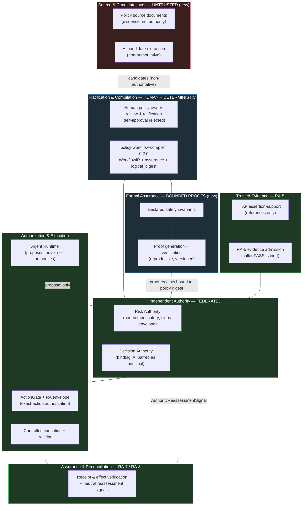

# Ugence Formal Policy Assurance and Adaptive Compliance Strategy

> **Status:** DRAFT — internal strategic design document (documentation and discovery only).
> **Classification:** Internal. For product, architecture, security, legal, and engineering review.
> **This document changes no production code, package version, contract, schema, frozen
> identifier, serialization, digest, authority boundary, CI workflow, or roadmap. It proposes;
> it does not authorize implementation.** No commit, push, or pull request is created by this
> document.
>
> **Provenance of this document**
> - Repository: `github.com/rasaha/symbolu` (Ugence / SymbolU monorepo)
> - Authored on branch: `claude/ugence-policy-assurance-strategy-ftqvbw`
> - Branch tip at authoring: `433911b93c441be74a45a7941dd818b6e0034281`
> - Default branch: `claude/setup-symbolu-monorepo-014vhNMAoVW2Ys5RBBr3bKDF` (same tip SHA `433911b9`)
> - Working tree at authoring: clean
> - Document location: `Project_documentation/Ugence_Platform/Strategy/UGENCE_FORMAL_POLICY_ASSURANCE_AND_ADAPTIVE_COMPLIANCE_STRATEGY.md`

---

## Note on document placement

This document lives under `Project_documentation/Ugence_Platform/Strategy/`, the
strategic-documentation location for platform-wide, cross-package strategy notes. The
repository's `Project_documentation/` tree is organized by subsystem (e.g. `governance/`,
`control_plane/`, `model_selection/`, `repository/`); no pre-existing platform-wide strategy
subdirectory was present, so the `Ugence_Platform/Strategy/` convention is used. Accepted
**ADRs** continue to live under `docs/architecture/`
(e.g. `docs/architecture/ADR_RISK_AUTHORITY_RA8_EXECUTION_EFFECT_RECONCILIATION.md`) and each
package carries its own `docs/` tree. Because this is a **cross-package strategy** spanning the
whole governance chain (not a single package's design, and not yet an accepted ADR), it is kept
as a portfolio-level strategy note here. If reviewers prefer, its accepted decisions should
later be re-expressed as one or more ADRs under `docs/architecture/` following the existing
`ADR_*` convention; that is an `[OWNER-DECISION-REQUIRED]` (see §20).

---

## 1. Executive Summary

Ugence already implements most of the *mechanism* that a "formal policy assurance and adaptive
compliance" product needs — but distributed across a **federated set of function-specific
capabilities**, not as a single governance engine. The strategically important finding of this
discovery is that the useful general capabilities described by the third party (policy-document
onboarding, policy-to-control translation, human ratification, machine-enforceable bundles,
formal verification, evidence-backed runtime evaluation, bounded compliant recovery, and
audit) map onto **existing Ugence packages and their ratified roadmaps**, with a small,
well-bounded set of genuine gaps.

**Five most important findings** (each expanded in §4 and §6):

1. **A policy compiler already exists and is CI-verified.** `ugence-policy-workflow-compiler`
   `0.2.0` (`packages/tooling/policy-workflow-compiler/`) compiles a *reviewed, structured*
   policy pack into a deterministic governed-workflow IR plus an assurance package, with
   content-addressed digests (`compute_logical_digest`), human-approval records that **reject
   self-approval**, and a Procurement reference-equivalence verification (deterministic,
   test-backed — not a formal/mathematical proof). It is explicitly *tooling,
   not authority*. `[REPOSITORY-VERIFIED]`

2. **The authority spine is real and cryptographically bound — but only in one package.**
   `ugence-risk-authority` `0.1.0` (`packages/risk_authority/`) has canonical serialization,
   `sha256:`-prefixed digests, pure-Python **Ed25519** signing/verification with a fail-closed
   boolean verify, a `KeyRing` where an unknown key id denies, non-compensatory control
   aggregation, and a deliberately deny-heavy adversarial test battery. The signed
   `RiskAuthorizationEnvelope` is the *sole* machine-execution authority artifact.
   `[REPOSITORY-VERIFIED]`

3. **The largest true gaps are ingestion and proof.** Document/PDF ingestion, OCR, and any
   NLP/LLM extraction are *explicitly excluded by design* from the compiler today; and the
   compiler's "assurance" is **deterministic test-specification generation, not mathematical
   proof**. Formal verification of safety invariants, proof/runtime equivalence, and
   jurisdiction/geography profiles are not yet present anywhere in the repository.
   `[REPOSITORY-VERIFIED]` (absence), `[PROPOSED]` (the additions)

4. **RA-5 → RA-8 are ratified designs, not running enforcement.** The evidence-admission,
   authority-lifecycle, runtime-trajectory, and effect-reconciliation layers are ratified ADRs
   with contracts and integration packages (`packages/integration/risk-authority-*`, all
   `0.1.0`), but they are "operationally inert" / "the seam has no producer" / "unwired at both
   ends". Trusted evidence admission (RA-5) is the linchpin: today, absent it, "a caller can
   mint machine authority by asserting `PASS`." `[REPOSITORY-VERIFIED]`

5. **The committed cloud-scaling Phase 4–6 roadmap is intact and is the natural first pilot
   surface** — but only after prerequisites. Phases 1–3 (canonical capacity intelligence,
   shadow forecasting, dependency/cost-aware recommendation) are merged and advisory-only;
   Phase 4 (Risk Authority integration) is blocked pending a Risk-Authority-side *non-executing
   evaluation seam* — the subject of open **draft PR #1423** — and RA-5 trusted evidence. Per
   the completed PR #1423 audit (§18): the seam itself passed its non-executing safety audit,
   but the legacy `RiskAuthorityApplication` production facade remains unsafe (it can still
   mint a valid signed envelope through `ReferenceDecisionAuthority`/`ReferenceActionGate`), so
   PR #1423 does not fully repair defect (h) and **Gate 0 remains blocked** until a facade
   correction receives a fresh independent audit.
   `[REPOSITORY-VERIFIED]`

**Recommendation (see §21):** **Proceed only after named prerequisites**, via a limited proof
of concept. Do not build a central "super-governance" module. Extend the existing federated
capabilities, close the Risk-Authority evaluation-seam and RA-5 prerequisites first, add
policy-document onboarding as a *non-authoritative* front end to the existing compiler, and run
one narrow shadow-mode pilot (Procurement or cloud-scaling) before any production authority is
wired.

---

## 2. Purpose and Non-Goals

### 2.1 Purpose

Determine, from repository evidence, how Ugence can **independently** add the useful general
capabilities of formal policy assurance, policy onboarding, and adaptive compliant recovery,
while preserving its existing differentiation and without disrupting committed work.

### 2.2 Non-Goals (of this document and the strategy it proposes)

This document does **not**, and the first implementation milestone must **not**:

- implement production code, change runtime behavior, or change any package version;
- open, merge, or update any pull request; commit or push any change;
- create a single central "super-governance" module (see §7, Core Design Principle);
- renumber, replace, or disrupt the committed cloud-scaling **Phase 4 / 5 / 6** roadmap;
- claim that an AI system as a whole can be "mathematically proven safe" (see §11);
- assert parity with, superiority over, or infringement of any third party;
- reproduce, reverse-engineer, or imitate any third party's patented mechanism, private
  implementation, terminology, UI, or workflow;
- inspect unrelated Soulpi attachments (out of scope; not examined).

---

## 3. Evidence Classification and Provenance

Every material claim in this document is tagged with exactly one classification. The categories
are kept strictly separate.

| Tag | Meaning |
|---|---|
| `[REPOSITORY-VERIFIED]` | Confirmed by reading a file, contract, test, ADR, or workflow in this repository at SHA `433911b9`. Citations are given. |
| `[PUBLIC-STANDARD]` | A publicly documented standard, language, or tool (e.g. Ed25519/RFC 8032, Lean 4, SMT/SMT-LIB, TLA+, Alloy, Cedar, OPA/Rego). |
| `[THIRD-PARTY-CLAIM—UNVERIFIED]` | A high-level claim attributed to the third party's described system; not independently verified. |
| `[SCREENSHOT-OBSERVATION]` | A visual observation reported from screenshots; not verified as technical fact. |
| `[PROPOSED]` | A Ugence design proposal introduced by this document; not yet built or decided. |
| `[OWNER-DECISION-REQUIRED]` | A choice that must be made by an accountable owner before implementation. |

### 3.1 Repository provenance (recorded per task requirement)

- **Current branch / SHA:** `claude/ugence-policy-assurance-strategy-ftqvbw` / `433911b9…`.
  `[REPOSITORY-VERIFIED]`
- **Default branch / SHA:** `claude/setup-symbolu-monorepo-014vhNMAoVW2Ys5RBBr3bKDF` /
  `433911b9…` (base of nearly all open PRs; identical tip to the working branch at authoring).
  `[REPOSITORY-VERIFIED]`
- **Working-tree state:** clean (no modifications) prior to creating this document.
  `[REPOSITORY-VERIFIED]`
- **Most recent merged work (tip history):** `#1421` Phase 3 dependency/cost-aware capacity
  recommendation (shadow/advisory); `#1418` Phase 2 predictive capacity; `#1417` Phase 1
  canonical capacity intelligence. `[REPOSITORY-VERIFIED]`

### 3.2 Relevant open pull requests

| PR | Title | State | Relevance |
|---|---|---|---|
| `#1423` | feat(risk-authority): production-bindable, **non-executing evaluation seam** (PR-1) | open, **draft**, not merged | Prerequisite for cloud-scaling Phase 4; the closest real artifact to the task's "Gate 0 / evaluation seam". The seam itself passed its non-executing audit, but it does **not** fully repair the legacy facade's defect (h) — see §18 audit note; Gate 0 stays blocked. Bumps `ugence-risk-authority` `0.1.0 → 0.2.0` *on the PR branch only*. `[REPOSITORY-VERIFIED]` |
| `#1410` | docs(risk-authority): ratify canonical **RA-5** spec, resolve preconditions | open | RA-5 trusted-evidence prerequisite (Gate 1). `[REPOSITORY-VERIFIED]` |
| `#1194` | Frame Ugence as the missing enterprise-AI-stack layer | open | Positioning context only. `[REPOSITORY-VERIFIED]` |

(Other open PRs — DilChat, hybrid-LLM, robotics, phase-6M — are unrelated and were not
incorporated.) `[REPOSITORY-VERIFIED]`

### 3.3 Package versions (single-source, `src/`-layout, `setuptools`)

| Distribution | Namespace | Version | Notes |
|---|---|---|---|
| `ugence-governance-contracts` | `ugence_governance_contracts` | `0.1.0` | contract version `1.0.0` |
| `ugence-risk-authority` | `risk_authority` | `0.1.0` | `0.2.0` proposed on draft PR #1423 |
| `ugence-actiongate-provider` | `ugence_actiongate_provider` | `0.1.0` | Beta |
| `ugence-tap-provider` | `ugence_tap_provider` | `0.1.0` | Beta |
| `ugence-agent-runtime` | `ugence_agent_runtime` | `0.7.0` | README status text lags (0.5.0/0.6.0) — **flag** |
| `ugence-policy-workflow-compiler` | `ugence_policy_workflow_compiler` | `0.2.0` | v1 digest identity frozen at `0.1.0` |
| `ugence-decision-authority` | `ugence_decision_authority` | `1.0.0` | deliberately frozen API/lifecycle/hashes |
| `ugence-action-clearance` | `ugence_action_clearance` | `0.1.0` | contract `action_clearance.v1` |
| `ugence-cloud-scaling-controller` | `ugence_cloud_scaling_controller` | `0.4.0` | README header lags (0.3.0) — **flag** |
| `ugence-cloud-scaling-operations` | `ugence_cloud_scaling_operations` | `0.1.2` | README header lags (0.1.0) — **flag** |
| `ugence-governance-provider-framework` | `ugence_governance_provider_framework` | `0.1.0` | contract `1.0.0`, target kernel major `1` |
| RA integration packages (`risk-authority-{evidence,status}-runtime`, `-runtime-assurance`, `-execution-assurance`, `-runtime`), `context-minimization-token-accounting-runtime` | various | `0.1.0` | See §4. |

All `[REPOSITORY-VERIFIED]`. The three README/code version discrepancies are noted so reviewers
do not treat README narrative as authoritative over `version.py`.

### 3.4 Authoritative ADRs and manifests consulted

- `Project_documentation/repository/docs/architecture/ADR_UGENCE_DECISION_GOVERNANCE_TERMINOLOGY_AND_BOUNDARIES.md`
  (Accepted 2026-08-01) — canonical terminology and federated authority boundaries.
- `docs/architecture/ADR_RISK_AUTHORITY_RA5_EVIDENCE_CONTROL_ASSURANCE.md` (ratified;
  `RA5_PRECONDITIONS_RESOLVED_READY_FOR_IMPLEMENTATION`).
- `docs/architecture/ADR_RISK_AUTHORITY_RA6_AUTHORITY_LIFECYCLE.md`,
  `…_RA7_RUNTIME_TRAJECTORY_ASSURANCE.md`, `…_RA8_EXECUTION_EFFECT_RECONCILIATION.md` (all
  ratified, `READY_FOR_IMPLEMENTATION`).
- `docs/architecture/ADR_RISK_AUTHORITY_RA45_GOVERNANCE_COMPOSITION.md`
  (`FinalAuthority ≤ RiskAuthority`, `FinalScope ⊆ RiskAuthorityScope`; substitution audit
  returned `RA45_BLOCKED`).
- `docs/architecture/ADR_CLOUD_SCALING_{CANONICAL_CAPACITY_INTELLIGENCE_PHASE1,PREDICTIVE_CAPACITY_INTELLIGENCE_PHASE2,DEPENDENCY_COST_AWARE_RECOMMENDATION_PHASE3}.md`.
- `docs/Decision_Governance_Kernel.md` (DGM kernel extraction, Phase 5A/5B).
- Manifests: `packages/capabilities/cloud-scaling-controller/module_manifest.json`,
  `agent_runtime_migration_inventory.json`.

All `[REPOSITORY-VERIFIED]`.

### 3.5 Current Phase 4 dependencies / blockers

The committed cloud-scaling roadmap is **Phase 4: Risk Authority integration; Phase 5:
ActionGate authorization and provider execution; Phase 6: effect verification and
recommendation learning** (quoted in §5.2). Phase 4 is blocked on:

1. a **separate cloud-governance integration package** that translates the controller's
   `CapacityDecisionEvidence` into the RA lifecycle — the controller must stay a leaf with **no
   reverse dependency on RA** (Phase-1 ADR sub-decision 8); `[REPOSITORY-VERIFIED]`
2. a Risk-Authority-side **non-executing evaluation seam** that "evaluates a proposed subject →
   ALLOW/DENY/typed non-decision and *stops*" — the subject of draft **PR #1423**;
   `[REPOSITORY-VERIFIED]`
3. **RA-5 trusted evidence admission**, without which control statuses are caller-asserted.
   `[REPOSITORY-VERIFIED]`

---

## 4. Current Ugence Capability Inventory

Maturity legend: **CI** = implemented and CI-verified; **REF** = implemented but reference-only
(not wired into a package CI workflow); **PARTIAL** = partially implemented; **DESIGN** =
contract/design only; **PLANNED**; **MISSING**; **BLOCKED**.

### 4.1 Shared foundation

- **`ugence-governance-contracts` `0.1.0` — CI.** Neutral, stdlib-only *leaf* defining provider
  request/result envelopes, `ProviderKind` (`ASSERTION_GOVERNANCE`/`ACTION_GOVERNANCE`/
  `EXTERNAL_EXECUTION`), `ActionGovernanceOutcome`
  (`AUTHORIZED`/`AUTHORIZED_WITH_CONSTRAINTS`/`DENIED`/`INDETERMINATE`/`EXPIRED`), lifecycle
  state machine, and a `FailureClass` taxonomy. **No hashing/signing** — results carry an
  opaque `fingerprint` string the *producing capability* fills. Documented known gap: **no
  `tenant_id`/`environment_id`**, no idempotency/expiry *contract*
  (`packages/governance-contracts/README.md`). `[REPOSITORY-VERIFIED]`
- **`ugence-governance-provider-framework` `0.1.0` — PARTIAL CI.** Registry + deterministic
  `resolution` (explicit id → domain default → global default → single compatible → *failure;
  never guesses*), `fingerprint` (sorted-key JSON SHA-256), observability, conformance kit,
  reference providers, optional kernel adapters. **CI runs only its compatibility + one
  boundary test**; unit/conformance/integration suites are not invoked in CI at this snapshot.
  `[REPOSITORY-VERIFIED]`

### 4.2 The authority chain

- **TAP — `ugence-tap-provider` `0.1.0` — CI.** *Assertion-support* governance provider:
  given an assertion + evidence references, returns
  `SUPPORTED`/`UNSUPPORTED`/`CONSTRAINED`/`INDETERMINATE`. Carries a provenance class
  (`DIRECT`/`DERIVED`/`POLICY`/`HISTORICAL`/`MODEL_GENERATED`/`HUMAN_PROVIDED`), `effective_period`
  (freshness), and issuer `authority`; **references only, never raw content; rejects raw
  credentials**; provenance kept separate from support. **Important nuance:** the RA-5 ADR
  states this productized TAP is an *assertion-support scorer*, **not** the evidence-*admission*
  pipeline RA-5 requires — at most a Control-Assurance *evaluator candidate*.
  `[REPOSITORY-VERIFIED]`
- **Risk Authority — `ugence-risk-authority` `0.1.0` — CI (spine); DESIGN/PARTIAL (RA-5→RA-8).**
  The executable authority kernel. **RA-1→RA-4 spine** implemented: WorkflowIR → RiskDecisionCase
  → ControlResult → Decision Authority → signed `RiskAuthorizationEnvelope` (Ed25519, scope ⊆
  decision) → CanonicalAction → ActionGate → ALLOW/DENY. Cryptography: `crypto/canonical.py`
  (sorted keys, RFC-3339 UTC, **floats rejected**, signature field excluded from its own
  payload), `crypto/hashing.py` (`sha256:` prefix over canonical bytes), `crypto/signing.py`
  (pure-Python **Ed25519 / RFC 8032**, fail-closed boolean verify), `crypto/keys.py` (`KeyRing`
  holds only public verify keys; unknown `kid` → deny). Non-compensatory controls (no PASS
  compensates a FAIL/STALE/MISSING/UNKNOWN; duplicates never last-wins-masked). Deny-heavy
  adversarial suite (`tests/adversarial/test_deny_matrix.py`). **RA-5→RA-8** exist as
  contracts + partial runtime (see integration packages). `[REPOSITORY-VERIFIED]`
- **Decision Authority — `ugence-decision-authority` `1.0.0` — CI.** Bounded, domain-neutral
  *institutional* authority: when an AI recommendation may become a **binding** decision.
  **AI is structurally barred as an authorizing principal** (`AuthorityType` has no AI member).
  Owns a mature reconciliation kernel
  (`ExecutionIntent`/`ExecutionAttempt`/`ExecutionRecord`/`ReconciliationResult`/
  `CompensationRequirement`) reused by RA-8. `canonical_hash` (sorted-key JSON SHA-256); any
  hash change is a MAJOR version bump. `[REPOSITORY-VERIFIED]`
- **ActionGate — `ugence-actiongate-provider` `0.1.0` — CI.** Action-governance provider:
  `ALLOW`/`DENY`/`ALLOW_WITH_CONSTRAINTS`/`UNKNOWN→INDETERMINATE`. Authorization is never
  execution; uncertainty/failure never promoted to authorized; the provider has no
  `dispatch/execute/observe` surface. **No signing here** (only a deterministic trace id);
  exact-action *enforcement against a signed envelope* lives in
  `risk_authority/integrations/actiongate.py`. Neutral request **intentionally drops
  `tenant`** (documented lossy mapping). `[REPOSITORY-VERIFIED]`
- **Action Clearance — `ugence-action-clearance` `0.1.0` — REF (no CI).** Stateless,
  deterministic last-mile check: an *already-authorized* exact action + trusted current-state
  signals → `CLEAR`/`HOLD`/`BLOCK`/`ESCALATE` (precedence `BLOCK > ESCALATE > HOLD > CLEAR`).
  May only **narrow** (`effective_permissions ⊆ authorized`); never creates/broadens authority,
  dispatches, or persists. **Most rigorous fingerprinting after RA**: domain-separated SHA-256
  (0x1F separator, six domains). **No CI workflow references it** at this snapshot.
  `[REPOSITORY-VERIFIED]`
- **Agent Runtime — `ugence-agent-runtime` `0.7.0` — CI.** Domain-neutral execution
  coordination. Before any consequential transition it builds an immutable `TransitionProposal`
  (exact invocation + deterministic `fingerprint`) and asks an injected `GovernanceHook`; with
  no adapter configured, the default `UnconfiguredGovernanceHook` **BLOCKs** every consequential
  transition (`GOVERNANCE_NOT_CONFIGURED`). Exact-action binding (P0): a `CLEAR` executes only
  when provably about the exact proposal; `HOLD`/`ESCALATE` are never converted to `CLEAR`.
  Optional last-mile `authority_recheck` (RA-6 §8) is fail-closed-normalized. Import-boundary
  test forbids importing any concrete governance package. **Never self-authorizes.**
  `[REPOSITORY-VERIFIED]`

### 4.3 Policy tooling

- **`ugence-policy-workflow-compiler` `0.2.0` — CI.** Compiles a *reviewed, structured* policy
  pack into a `workflow_ir.v1` (and additive `v2` semantics) graph plus an assurance package
  (assurance manifest + test scenarios, audit schema, capability-requirement manifest,
  structural diff, human-approval records, content-addressed compiled package). Node kinds
  encode the control vocabulary: `EVIDENCE_REQUIREMENT`, `EVIDENCE_ADMISSIBILITY`,
  `DECISION_RULE`, `AUTHORITY_CHECK`, `APPROVAL_GATE`, `SEGREGATION_OF_DUTIES_GATE`,
  `PROHIBITED_CONDITION`, `OVERRIDE_GATE`, `ACTION_CONSTRAINT`, `SEQUENCE_RISK_CHECK`,
  `ACTION_CLEARANCE_REQUIREMENT`, `AUDIT_EMISSION`, `TERMINAL_OUTCOME` — each with
  `failure_behavior` defaulting to `BLOCK`. `CapabilityRegistry` maps stable `CapabilityId`s to
  the real capabilities (TAP, Decision Authority, ActionGate, Action Clearance, StoryGraph,
  Model Selection) by public-contract identifier from metadata only — **it never imports a
  runtime provider**. `ApprovalService` binds an approval digest to the pack's structural digest
  and **rejects self-approval** ("a compiler process must not approve its own output").
  Canonical JSON + `sha256` + `compute_logical_digest` (status excluded so the digest is stable
  across `APPROVED → COMPILED`); v1 digest identity frozen at `0.1.0` and decoupled from the
  package version. **Assurance = deterministic *test specifications*, not proofs.** Extraction
  (`workflow_ir.v2`) is deterministic-only: "no natural-language inference, no keyword/substring
  guessing, and no LLM." **Explicitly not implemented (by design):** raw document/PDF/Word
  ingestion, OCR, NLP/LLM extraction, learned enforcement, live execution, connector writes,
  any model SDK. **Not pilot-validated / not production-certified.** `[REPOSITORY-VERIFIED]`

### 4.4 RA integration packages (`packages/integration/`)

All `0.1.0`. The signed `RiskAuthorizationEnvelope` remains the **sole** machine-authority
artifact across the family; RA-7/RA-8 mint nothing.

| Package | Role | Maturity | Repository note |
|---|---|---|---|
| `risk-authority-evidence-runtime` (**RA-5**) | Trusted evidence admission + control assurance (`EvidenceAdmissionPort`, new `ControlAssurancePort`) | DESIGN/PARTIAL, CI | In production a caller-supplied `PASS` is inert; only an evidence-derived, RA-re-checked, trusted `ControlResult` may satisfy a control. Ratified spec; PR #1410. `[REPOSITORY-VERIFIED]` |
| `risk-authority-status-runtime` (**RA-6**) | Post-issuance authority lifecycle (short TTL + monotonic epoch + targeted revocation), segregated read/write | PARTIAL, transitive CI | Mechanism exists but is "test-proven but operationally inert" — zero non-test write call sites. `[REPOSITORY-VERIFIED]` |
| `risk-authority-runtime-assurance` (**RA-7**) | Runtime trajectory observer/evaluator → neutral `AuthorityReassessmentSignal` | DESIGN/PARTIAL, CI | "RA-7 OBSERVES AND ASSESSES; RA-6 OWNS AUTHORITY CONSEQUENCES." Today "the seam has no producer." `[REPOSITORY-VERIFIED]` |
| `risk-authority-execution-assurance` (**RA-8**) | Post-execution effect reconciliation (composes the DA reconciliation kernel) → neutral signal | DESIGN/PARTIAL, CI | DA + Agent Runtime are "import-isolated parallel worlds"; RA-8 bridges them. Verification strength bounded by effect source (provider self-report ≠ physical truth). `[REPOSITORY-VERIFIED]` |
| `risk-authority-runtime` (**RA-4.5**) | Fail-closed governance composition (RA owner + additive DA veto `ADVANCE/HOLD/DEFER/REJECT` + ActionGate `action_type` veto) | PARTIAL, CI | Invariant `FinalAuthority ≤ RiskAuthority`, `FinalScope ⊆ RiskAuthorityScope`. Substitution audit → `RA45_BLOCKED` (neither kernel can represent authority scope, ⊆-monotonicity, amount ceiling, expiry/revocation/epoch, or the Ed25519 envelope). `[REPOSITORY-VERIFIED]` |
| `context-minimization-token-accounting-runtime` | One-way CM ↔ runtime token-accounting bridge | CI | Not on the policy path; noted for completeness. `[REPOSITORY-VERIFIED]` |

### 4.5 Cloud-scaling (candidate pilot surface)

- **`ugence-cloud-scaling-controller` `0.4.0` — CI.** Advisory-only. Phases 1–3 merged
  (canonical capacity intelligence → shadow forecasting → dependency/cost-aware recommendation),
  all deterministic, provider-neutral, shadow/advisory; **`execution_capability: NONE`**; hard
  constraints non-compensatory and filtered before scoring; cost is an input, never an
  authorizer; every output carries an immutable, sha256 content-identity evidence object. **No
  reverse dependency on RA/ActionGate/execution.** Phase 4 RA integration = NONE.
  `[REPOSITORY-VERIFIED]`
- **`ugence-cloud-scaling-operations` `0.1.2` — CI.** The *controlled-execution* counterpart
  (the domain realization of the roadmap's "Phase 5"): can mutate Kubernetes scale / trigger
  ArgoCD **only** in `LIVE` mode with credentials and an externally minted `ExecutionAuthorization`;
  default mode `dry_run`; authority chain `ADVISORY_RECOMMENDATION → POLICY_AND_SAFETY_EVALUATION
  → HUMAN_OR_EXTERNAL_GOVERNANCE_APPROVAL → EXECUTION_AUTHORIZATION → READINESS_CHECK →
  CONTROLLED_EXECUTION → OUTCOME_AND_AUDIT`; all mutation paths fail closed
  (missing/expired/wrong-tenant/target/action/out-of-bounds/replayed/untrusted-issuer → denied);
  the recommendation engine can never mint its own authority. Not production-certified / not
  live-cluster validated. `[REPOSITORY-VERIFIED]`

### 4.6 Decision Governance kernel (DGM)

`docs/Decision_Governance_Kernel.md`: a reusable domain-neutral governance kernel extracted
from the completed AI-Hiring reference implementation *without changing runtime behavior*, with
strictly-downward dependencies (`applications/* → domains/* → decision_governance/`; reverse
imports forbidden and test-enforced) and ports (`ActionControlPlanePort`,
`ExternalExecutionPort`). It explicitly states contract-bound AI interpretation may later be
added only "as an *optional upstream producer* of evidence/recommendations — never as decision
authority." `[REPOSITORY-VERIFIED]`

### 4.7 Research vs. productized (a maturity caution)

Several **top-level** directories are research/experiment code, not the productized chain:
`truth_assurance_pipeline/` (TAP research stages `tap_e1_intent … tap_e5_evidence_assembly`),
`evidence_assurance/`, `minimal_evidence_policy/`, `execution_gate/`, `decision_governance/`
(kernel source). The productized capabilities live under `packages/`. Reviewers should not
conflate a research module's presence with a shipped capability. `[REPOSITORY-VERIFIED]`

---

## 5. Third-Party Observations and Limits

### 5.1 What was described (treated as unverified)

The third party is described as offering a governance system involving: generic governance
protocols; domain-, geography-, and profile-specific policies and evidence requirements;
machine-readable policies; mathematical/formal proofs; runtime enforcement; policy-document
ingestion; spec-generation, testing, review, and adversarial agents; and the ability to stop,
reroute, or retry a workflow when compliance cannot be demonstrated.
`[THIRD-PARTY-CLAIM—UNVERIFIED]`

Screenshots are reported to show: business-rule documents; technical and domain rules;
e-commerce checks (KYC, fraud, GST, refunds, prohibited products, order-lifecycle validation);
API integrations for those checks; agent-based policy generation/validation; and
auditability/observability. `[SCREENSHOT-OBSERVATION]`

### 5.2 Limits on how these observations may be used

- These are **high-level claims and visual observations, not verified technical facts.** No
  parity, superiority, infringement, or implementation detail may be asserted from them.
- Technology and design selection in this document follow **Ugence requirements and repository
  evidence**, not the competitor's claims (see §11, §12).
- Ugence must reach any comparable capability by **independent invention** using its own
  contracts and mechanisms (see §17). E-commerce examples (KYC/GST/refunds) are used in this
  document only as *generic regulated-workflow illustrations*, not as targets to imitate.

### 5.3 The committed roadmap these observations must not disturb

Quoted verbatim from `packages/capabilities/cloud-scaling-controller/README.md`: *"Risk
Authority (Phase 4), ActionGate/provider execution (Phase 5), and effect verification/learning
(Phase 6) are out of scope."* The same three phases appear in
`ADR_CLOUD_SCALING_DEPENDENCY_COST_AWARE_RECOMMENDATION_PHASE3.md` and in
`module_manifest.json`. These phases are **not renumbered or replaced** by this strategy.
`[REPOSITORY-VERIFIED]`

---

## 6. Capability-Gap Matrix

Desired capabilities vs. current Ugence state. "Existing owner" names the package that most
naturally owns the capability today; "Proposed owner" names where new work should land per the
federated model (§7–§8). Priority is P0 (prerequisite) … P3 (later).

| Capability | Current Ugence state | Existing owner | Gap | Proposed owner | Dependency | Priority |
|---|---|---|---|---|---|---|
| Policy-document ingestion (PDF/Word/HTML → text) | **MISSING** — explicitly excluded by design | — | Full | *(new)* Policy Onboarding front end | none | P1 |
| Structured rule extraction (candidate requirements) | **MISSING** (LLM); deterministic v2 extraction exists for *compiled graphs* only | policy-workflow-compiler (deterministic only) | LLM/NLP extraction, kept **non-authoritative** | Policy Onboarding front end (proposes candidates) | ingestion | P1 |
| Jurisdiction / geography / domain profiles | **MISSING** as first-class model | — | Full (profile + effective-date + conflict scoping) | policy-workflow-compiler models + Policy Authority | contracts | P2 |
| Policy conflict detection | **PARTIAL** — structural diff + authority-boundary validation | policy-workflow-compiler (`diff/`, `validation/authority_boundaries.py`) | Semantic conflict + jurisdiction precedence | policy-workflow-compiler | profiles | P2 |
| Human policy-owner ratification | **IMPLEMENTED (REF)** — `HumanApprovalRecord`, self-approval rejected | policy-workflow-compiler (`approval/`) | Signature binding to ratifier identity; role model | policy-workflow-compiler + identity | contracts | P1 |
| Policy compilation → machine-enforceable bundle | **IMPLEMENTED (CI)** — `WorkflowIR` + compiled package + `compute_logical_digest` | policy-workflow-compiler | Signed (not just hashed) ratified bundle | policy-workflow-compiler + RA crypto | RA crypto reuse | P2 |
| Trusted evidence requirements | **DESIGN/PARTIAL** — `RequiredEvidence`/`EvidenceKind` (compiler); RA-5 admission (design) | policy-workflow-compiler + RA-5 | RA-5 runtime admission not operational | RA-5 (`risk-authority-evidence-runtime`) | RA-5 | P0 |
| Formal invariant definition | **MISSING** | — | Full (declared invariant catalog) | *(new)* Formal Assurance module | canonical model | P2 |
| Proof generation | **MISSING** — assurance is *tests*, not proofs | — | Full | Formal Assurance module (+ external prover) | invariants | P2 |
| Proof verification | **MISSING** | — | Full (reproducible, versioned) | Formal Assurance module | proof gen | P2 |
| Proof ↔ runtime equivalence | **MISSING** | — | Full (see §12) | Formal Assurance + compiler + RA | proofs, digests | P2 |
| Exact-action binding | **IMPLEMENTED (CI)** — envelope scope ⊆ decision; runtime `TransitionProposal` fingerprint; ActionGate exact match | risk_authority, agent-runtime, actiongate | None (reuse) | (existing) | — | — |
| Compliant alternatives | **PARTIAL** — runtime proposes; DA/RA re-evaluate | agent-runtime (proposal), RA/DA (authority) | Bounded planner semantics + re-eval binding | agent-runtime + RA | RA eval seam | P2 |
| Bounded retry / rerouting | **PARTIAL** — bounded advance (one quantum), retry/timeout | agent-runtime | Retry *budgets*, loop detection, escalation thresholds | agent-runtime | — | P2 |
| Observability | **IMPLEMENTED (CI/partial)** — provider invocation logs, evidence objects, audit schema | most packages | Cross-capability correlation store | AI Control Plane (optional) | — | P2 |
| Audit reports | **IMPLEMENTED (REF)** — `AuditSchema`, immutable decision records, `CapacityDecisionEvidence` | policy-workflow-compiler, DA, cloud-scaling | End-to-end audit-evidence assembly | AI Control Plane (optional) | — | P2 |
| Post-execution verification | **DESIGN/PARTIAL** — RA-8 + DA reconciliation kernel | risk-authority-execution-assurance, DA | RA-8 not operational; bounded by effect source | RA-8 | RA-6 | P2 |

**Reading of the matrix:** the "policy-to-control" middle of the value chain is *already built
and CI-verified*. The genuine net-new work is concentrated at the **front** (document ingestion
+ non-authoritative extraction + jurisdiction profiles) and at the **assurance** end (formal
invariants, proof, and proof/runtime equivalence). The RA-5 → RA-8 layers are ratified designs
whose *operationalization* is the critical dependency. `[REPOSITORY-VERIFIED]` / `[PROPOSED]`

---

## 7. Strategic Positioning

### 7.1 Core design principle: no central "super-governance" module

The repository's accepted terminology ADR establishes that **authority is federated by
function** and that "coordination does not transfer authority." A single central governance
engine would violate this settled architecture, concentrate trust, and undermine the
independent-denial property that is core differentiation. Therefore the strategy **extends
existing responsibilities** rather than creating a monolith. `[REPOSITORY-VERIFIED]` /
`[PROPOSED]`

### 7.2 Where each new capability belongs

| Capability area | Extend (existing owner) or new? | Justification (trust/dependency boundary) |
|---|---|---|
| Policy sources, compilation, ratification, versioning, conflicts, formal assurance | **Extend** policy-workflow-compiler; **possibly** a thin **Policy Authority** capability for *ratification governance* | Compiler already owns compilation/approval/digest. A *Policy Authority* is justified only if ratification needs an independent authority boundary distinct from Decision Authority (see §7.3). |
| Evidence provenance/authenticity/freshness/issuer trust/admission | **Extend** TAP + **operationalize RA-5** | RA-5 is the ratified home for trusted admission; TAP is the assertion-support evaluator candidate. |
| Evaluation of ratified policies + trusted evidence | **Extend** Risk Authority | RA already aggregates controls non-compensatorily and issues the signed envelope. |
| Institutional authority / accountable determination | **Extend** Decision Authority | DA already governs binding decisions and bars AI as principal. |
| Non-bypassable authorization of an exact action | **Extend** ActionGate + RA envelope enforcement | Exact-action match already implemented. |
| Proposing alternative compliant plans (never self-approving) | **Extend** Agent Runtime | Runtime proposes; never self-authorizes (enforced + tested). |
| Receipt validation, effect verification, drift, reconciliation | **Operationalize** RA-7/RA-8 + DA reconciliation kernel | Ratified designs already exist. |
| Document ingestion + non-authoritative candidate extraction | **New** Policy Onboarding front end | Distinct trust boundary: *untrusted source documents and LLM output must never mint authority*. A new package isolates that risk from the deterministic compiler. |
| Formal invariants, proof generation/verification, proof/runtime equivalence | **New** Formal Assurance module | Distinct dependency boundary: brings an external prover/solver toolchain that must not enter the stdlib-only leaf packages. |

`[PROPOSED]`

### 7.3 Is a new "Policy Authority" capability justified?

Only if it has a **clear trust or dependency boundary**, not merely feature grouping. Candidate
boundary: *ratification is an institutional act distinct from a binding business decision.* The
terminology ADR lists "Policy and evidence references" under the **shared foundation**, and
Decision Authority "may own … human/policy approval." Two viable options, an
`[OWNER-DECISION-REQUIRED]`:

- **Option A (preferred, lower risk):** No new authority. Ratification governance is an
  extension of **Decision Authority** (institutional approval) + policy-workflow-compiler
  (mechanism). The *front-end* onboarding and the *formal assurance* toolchain become new
  **non-authority** packages.
- **Option B:** A thin **Policy Authority** capability owning only ratification governance and
  versioning — justified only if reviewers conclude ratification must be independently
  deniable from binding-decision authority.

This document recommends **Option A** unless review surfaces a concrete independence requirement.
`[PROPOSED]` / `[OWNER-DECISION-REQUIRED]`

### 7.4 Differentiation to preserve

The strategy must preserve: authentic/traceable evidence; separation of proposal, risk,
authority, authorization, and execution; independent authority able to deny an orchestrator;
authorization bound to the exact proposed action; execution receipts; post-execution effect
verification; fail-closed behavior; and enterprise adoption across existing and new workflows.
All of these are present in the repository today (§4) and are *strengthened*, not replaced, by
this strategy. `[REPOSITORY-VERIFIED]`

---

## 8. Target Architecture and Trust Boundaries

### 8.1 Layered model

1. **Source layer (untrusted).** Policy documents are **evidence, not authority**. Ingestion
   normalizes them and records provenance. `[PROPOSED]`
2. **Candidate layer (non-authoritative).** AI may extract *candidate* requirements and
   controls, each marked non-authoritative and carrying provenance back to the exact source
   span. **No candidate can silently become policy.** `[PROPOSED]`
3. **Ratification layer (human authority).** Policy owners review and ratify. Ratification binds
   an approval to the pack's structural digest and the ratifier's identity; **self-approval is
   rejected** (already enforced by `ApprovalService`). `[REPOSITORY-VERIFIED]` / `[PROPOSED]`
4. **Compilation layer (deterministic).** Ratified packs compile to a versioned, digest-bound
   `WorkflowIR` + assurance package (existing compiler). `[REPOSITORY-VERIFIED]`
5. **Formal-assurance layer (bounded proofs).** Selected, declared invariants are proven over
   the *canonical model*; proofs are versioned and reproducible. `[PROPOSED]`
6. **Runtime-evidence layer (trusted admission).** RA-5 admits only trusted, fresh,
   issuer-verified evidence; caller-asserted statuses are inert. `[REPOSITORY-VERIFIED]`
   (design) / `[PROPOSED]` (operationalization)
7. **Authority layer (federated, independent).** Risk Authority evaluates; Decision Authority
   determines binding authority; the orchestrator **cannot bypass or reconfigure a denial**.
   `[REPOSITORY-VERIFIED]`
8. **Authorization layer (exact action).** ActionGate + RA envelope authorize only the exact
   approved action. `[REPOSITORY-VERIFIED]`
9. **Execution + receipt layer.** Controlled execution produces a receipt. `[REPOSITORY-VERIFIED]`
10. **Assurance/reconciliation layer.** RA-7/RA-8 + DA reconciliation verify receipts and
    observed effects; drift emits neutral reassessment signals. `[REPOSITORY-VERIFIED]` (design)

### 8.2 Trust-boundary and ownership diagram



**Key boundary rules (all `[PROPOSED]` except where the mechanism already exists):**

- Documents and AI output **cross into authority only through human ratification** — never
  directly. `[REPOSITORY-VERIFIED]` (self-approval rejection) / `[PROPOSED]` (the front end)
- The formal-assurance toolchain (prover/solver) is **isolated** so it never becomes a runtime
  dependency of the stdlib-only leaf packages. `[PROPOSED]`
- The orchestrator/runtime contributes **proposals and coordination only**; the signed envelope
  is the sole machine authority. `[REPOSITORY-VERIFIED]`

### 8.3 Verified authority hierarchy (repository-grounded)

This subsection records an independent verification of the authority model against the actual
repository (Decision Authority, Risk Authority, `RiskAuthorizationEnvelope`, RA-4.5 composition,
governance-contracts public API, ActionGate integration, envelope-issuance path, and the
canonical terminology ADR). **The model is coherent and is preserved unchanged**; the answers
below are additive and cited.

| Question | Answer (from repository evidence) |
|---|---|
| Is Risk Authority or Decision Authority institutionally *final*? | **Neither is a universal adjudicator — authority is federated by function.** Decision Authority is final for the *institutional/binding-decision* question ("when an AI recommendation may become a binding business decision"); Risk Authority is final for the *machine-execution-authority* question (it mints the sole executable artifact). `ADR_UGENCE_DECISION_GOVERNANCE_TERMINOLOGY_AND_BOUNDARIES.md`; `packages/risk_authority/README.md` `[REPOSITORY-VERIFIED]` |
| What is the actual execution-authority artifact? | The signed **`RiskAuthorizationEnvelope`** (Ed25519), consumed by ActionGate — the sole machine-execution authority artifact. `packages/risk_authority/src/risk_authority/domain/envelope.py:48-63` `[REPOSITORY-VERIFIED]` |
| Must a `RiskAuthorizationEnvelope` bind a Decision Authority determination? | **Yes.** The envelope carries `decision_id` and is "derived from a `RiskDecision`"; `EnvelopeIssuer.issue(decision=...)` refuses to sign unless the decision `grants_authority` and enforces `Scope_envelope ⊆ Scope_decision` before signing; `issue_envelope` requires a stored decision. `domain/envelope.py:3-6,61,63`; `services/envelope_issuer.py:33-38,51,72-74`; `api/dependencies.py:689-714` `[REPOSITORY-VERIFIED]` |
| Can Risk Authority issue executable authority without a Decision Authority determination? | **No — structurally a decision is required.** *But* the legacy facade allows the in-package `ReferenceDecisionAuthority` to satisfy that requirement in production, which is exactly defect (h) (§18). `api/dependencies.py:179,636,700` `[REPOSITORY-VERIFIED]` |
| Is Decision Authority an additive veto, final authority, or a separate authority dimension? | A **separate authority dimension** — the accountable institutional/binding determination the envelope must bind. In the **RA-4.5 composition** the *production* DA kernel additionally acts as a **fail-closed additive veto** (`ADVANCE/HOLD/DEFER/REJECT`) that can only narrow (`FinalAuthority ≤ RiskAuthority`, `FinalScope ⊆ RiskAuthorityScope`); substitution was audited `RA45_BLOCKED`. Both framings are consistent under the federated model. `ADR_RISK_AUTHORITY_RA45_GOVERNANCE_COMPOSITION.md`; `packages/integration/risk-authority-runtime/README.md` `[REPOSITORY-VERIFIED]` |
| Is the architecture intentionally federated rather than hierarchical? | **Yes — intentionally federated.** "Authority remains federated by function"; "Coordination does not transfer authority"; no universal adjudicator. `ADR_UGENCE_DECISION_GOVERNANCE_TERMINOLOGY_AND_BOUNDARIES.md` `[REPOSITORY-VERIFIED]` |
| Does any documentation conflict with implementation? | The **authority model is coherent** across the terminology ADR, RA-4.5, and the RA kernel (envelope binds decision; scope monotonic). The one real gap is **implementation-vs-intent** in the Phase-4 turnkey facade: RA-5 production mode guards the *evidence* path but the facade still hardcodes `ReferenceDecisionAuthority`/`ReferenceActionGate` (defect (h), §18). This is an implementation defect with a named owner (RA owner) and an active blocker (Gate 0), not an open design ambiguity — so it is **not** raised as a new owner decision. `[REPOSITORY-VERIFIED]` |

No speculative redesign of the authority hierarchy is proposed; the federated model is retained
exactly.

---

## 9. Policy-Onboarding Lifecycle

Proposed lifecycle state machine (extends the compiler's existing `PolicyPackStatus` /
`is_legal_transition`; a `[PROPOSED]` superset):

```
SOURCE_DISCOVERED
  → EXTRACTED_AS_CANDIDATE      (AI/deterministic extraction; NON-AUTHORITATIVE)
  → REVIEW_REQUIRED
  → RATIFIED                    (human policy owner; self-approval rejected)
  → COMPILED                    (deterministic WorkflowIR + assurance + logical_digest)
  → FORMALLY_CHECKED            (declared invariants proven; proof receipt bound to digest)
  → ACTIVE
  → SUPERSEDED | REVOKED | SUSPENDED
```

| Transition | Who may perform | Required evidence | Failure / abstention |
|---|---|---|---|
| `→ EXTRACTED_AS_CANDIDATE` | Ingestion service (automated) | Source artifact + provenance (hash, source span) | On low confidence → mark `unresolved`, never fabricate (mirrors deterministic extraction rule) |
| `→ REVIEW_REQUIRED` | Ingestion service | Complete candidate set | Missing provenance → block |
| `→ RATIFIED` | **Named human policy owner** (role-gated) | Reviewer identity + role; approval digest bound to pack structural digest | Self-approval → rejected; identity mismatch → rejected |
| `→ COMPILED` | Compiler (automated) | Ratified pack; authority-boundary validation passes | `AUTHORITY_BOUNDARY_VIOLATION` → compilation fails closed |
| `→ FORMALLY_CHECKED` | Formal-assurance service | Invariant set + reproducible proof for the exact policy digest | Proof failure / non-termination → abstain (`EvaluationAbstention`), stay `COMPILED` |
| `→ ACTIVE` | Policy owner (activation) | Formal check pass (for invariant-bearing packs); effective date | Effective date in future → scheduled, not active |
| `→ SUPERSEDED` | Policy owner | Newer ratified version; conflict resolution recorded | A **weaker** policy may not silently supersede a **stronger** active one (invariant, §11) |
| `→ REVOKED` / `→ SUSPENDED` | Policy owner / authority lifecycle | Revocation reason; audit record | Fail closed: revoked/suspended never authorizes |

**Rules:** LLM extraction is **non-authoritative until ratified**; version + digest binding are
mandatory from `COMPILED` onward; jurisdiction and effective-date are first-class from `RATIFIED`;
conflicts are resolved at ratification with recorded precedence; revocation/rollback are
policy-owner acts with audit; every transition emits an audit event. `[PROPOSED]` (lifecycle),
with `RATIFIED`/`COMPILED` mechanisms `[REPOSITORY-VERIFIED]`.

---

## 10. Proposed Contracts

**Investigate-before-proposing result:** the compiler already defines `PolicyPack`,
`PolicyObject`, `SourceDocument`, `ProvenanceReference`, `DecisionRule`, `RequiredEvidence`,
`AuthorityRequirement`, `HumanApprovalRecord`, `AuditSchema`, `ConnectorMapping`, `WorkflowIR`,
`CompiledReleasePackage`, and `ReleaseManifest`; Risk Authority defines `ControlResult`,
`RiskAuthorizationEnvelope`, `CanonicalAction`; Decision Authority defines `DecisionRecord` and
the reconciliation kernel. **New contracts must not duplicate these.** The table marks each
candidate as *reuse/extend existing* or *new*.

| Candidate contract | Disposition | Authoritative owner | Grants authority? |
|---|---|---|---|
| `PolicySourceArtifact` | **New** | Policy Onboarding front end | No |
| `CandidatePolicyRequirement` | **New** | Policy Onboarding front end | No (explicitly non-authoritative) |
| `CandidateControl` | **New** | Policy Onboarding front end | No |
| `RatifiedPolicyBundle` | **Extend** compiler `CompiledReleasePackage` + approval | policy-workflow-compiler | No (mechanism); authority via DA ratification |
| `EvidenceRequirement` | **Reuse** compiler `RequiredEvidence`/`EvidenceKind` | policy-workflow-compiler | No |
| `FormalInvariant` | **New** | Formal Assurance module | No |
| `ProofArtifact` | **New** | Formal Assurance module | No |
| `VerificationReceipt` | **New** | Formal Assurance module | No |
| `PolicyEvaluationReceipt` | **New** (compose RA `ControlResult` + envelope refs) | Risk Authority | No (evidence of an evaluation) |
| `CompliantAlternative` | **New** | Agent Runtime (proposal) | No |
| `RecoveryDirective` | **New** | Agent Runtime (proposal) / RA (authority to act) | No |
| `PolicyConflict` | **Extend** compiler `diff/` + validation | policy-workflow-compiler | No |
| `EvaluationAbstention` | **New** | Risk Authority / Formal Assurance | No |

For each **new** contract, the following specification template applies (uniform with existing
packages), `[PROPOSED]`:

- **Purpose; authoritative owner; required fields; canonical serialization** (reuse the RA rule:
  sorted keys, RFC-3339 UTC, floats rejected, signature excluded from its own payload);
  **digest** (`sha256:` over canonical bytes); **signature binding** (Ed25519 only where an
  authority artifact — most of these are *evidence*, so digest-only); **timestamps + validity
  window**; **tenant + jurisdiction scope** (note: `governance-contracts` currently lacks
  `tenant_id`/`environment_id` — closing that documented gap is a prerequisite, §14/§20);
  **status taxonomy; validation rules; replay protection** (nonce/idempotency key +
  monotonic epoch, mirroring RA-6); **grants authority: NO** unless explicitly owned and
  validated by the existing authority chain.

**Hard rule:** none of these contracts may grant execution authority. The only machine-execution
authority artifact remains the signed `RiskAuthorizationEnvelope`. `[REPOSITORY-VERIFIED]` /
`[PROPOSED]`

---

## 11. Formal-Assurance Strategy

**We do not claim an AI system can be "mathematically proven safe."** We propose proving a
small, declared set of **structural safety invariants** about the *governance mechanism*, under
explicit assumptions, over a canonical model — not about model behavior or business correctness.

**Authority boundary of proof artifacts (explicit).** A formal proof verifies a *declared
property under stated assumptions*; it is **evidence / a control input, never an authority
artifact**. A `ProofArtifact` or `VerificationReceipt` does **not** by itself constitute
institutional approval (that remains a Decision Authority determination) or execution
authorization (that remains the signed `RiskAuthorizationEnvelope`, §8.3). This is consistent
with the repository convention that authority-adjacent artifacts carry digests and validity but
grant no authority (§10 contract table; the compiler is "tooling, not authority"). Formalization
*strengthens* assurance; it does not relocate authority. `[PROPOSED]` / `[REPOSITORY-VERIFIED]`

### 11.1 Initial invariant set

Several of these are already *tested* (not proven) in the repository; formalization would raise
them from test to proof. For each: formal statement (informal here), boundary, assumptions,
trusted computing base (TCB), candidate technology, runtime enforcement point, counterexample
behavior, testing equivalent, residual risk.

| # | Invariant | Runtime enforcement point today | Testing equivalent today |
|---|---|---|---|
| I1 | DENY cannot become ALLOW via compensating scores | RA non-compensatory aggregation (`domain/controls.py`) | `tests/adversarial/test_deny_matrix.py` `[REPOSITORY-VERIFIED]` |
| I2 | Missing required evidence cannot produce approval | RA control resolution (MISSING/UNKNOWN→DENY); RA-5 admission | RA deny-matrix; RA-5 reference tests |
| I3 | Expired/revoked authority cannot authorize | RA envelope verify + RA-6 lifecycle | RA gate-integrity tests |
| I4 | Authorization for A cannot authorize B | ActionGate exact match; runtime exact-action binding fingerprint | runtime `test_governance_binding.py` |
| I5 | Tenant A authority cannot authorize tenant B | RA `(tenant,id)` isolation | RA deny-matrix (wrong-tenant) |
| I6 | ActionGate cannot be bypassed on a normal path | runtime `UnconfiguredGovernanceHook` BLOCK; provider has no execute surface | runtime import-boundary + governance-boundary tests |
| I7 | An orchestrator cannot mint its own authority | runtime never self-authorizes; migration inventory excludes duplicate governance | runtime tests; `agent_runtime_migration_inventory.json` |
| I8 | A proof for policy vN cannot satisfy vN+1 | compiler version-decoupled digest | compiler `test_v2_version_decoupling.py` |
| I9 | A weaker policy cannot silently replace a stronger active policy | *(not yet enforced)* | — (**gap**) |
| I10 | Every executed action ↔ exactly one valid authorization | runtime exact-action binding; RA-8 correlation | runtime tests; RA-8 design |
| I11 | Retry/rerouting cannot increase permissions without re-evaluation | Action Clearance narrows-only; runtime bounded advance | action-clearance monotonicity tests |

For each invariant the implementation milestone must record: **formal statement; system
boundary; assumptions; TCB** (e.g. the Ed25519 implementation, the canonical serializer, the
Python runtime, the OS crypto); **candidate verification technology** (§11.2); **runtime
enforcement point** (above); **counterexample behavior** (fail closed + audit); **testing
equivalent** (above); **residual risk** (e.g. TCB soundness, model-vs-code drift → §12).
`[PROPOSED]`

### 11.2 Technology comparison (no premature selection)

| Technology | Class | Fit for Ugence invariants | Note |
|---|---|---|---|
| **Lean 4** | Interactive theorem prover | Strong for I1–I3, I8–I11 (algebraic/ordering properties) | Highest assurance; high skill cost; offline. `[PUBLIC-STANDARD]` |
| **SMT/SAT** (e.g. SMT-LIB solvers) | Automated decision procedures | Strong for bounded, decidable predicates (I1, I4, I5, I6) | Good automation; model must be faithfully encoded. `[PUBLIC-STANDARD]` |
| **TLA+** | Temporal spec + model checker | Strong for lifecycle/temporal (I3, I9, I10, retry loops) | Excellent for state machines (RA-6 lifecycle, onboarding). `[PUBLIC-STANDARD]` |
| **Alloy** | Relational bounded model finder | Good for structural/relational (I4, I5, I7) | Fast counterexamples; bounded scope. `[PUBLIC-STANDARD]` |
| **Cedar** | Policy language + validator | Authorization policy validation | A *front end* candidate, not a prover. `[PUBLIC-STANDARD]` |
| **OPA/Rego** | Policy engine | Runtime policy evaluation | Front end / enforcement candidate, not a prover. `[PUBLIC-STANDARD]` |
| **Ugence WorkflowIR** (existing) | Canonical internal model | The compilation target; the *thing* proofs must be about | Already digest-bound. `[REPOSITORY-VERIFIED]` |

### 11.3 Policy-language strategy (front ends vs. canonical model)

Assess, do not decide (`[OWNER-DECISION-REQUIRED]`):

- **Adopt a public policy language** (Cedar/Rego) as the authored form — pro: ecosystem,
  validators; con: semantic-gap risk to Ugence contracts.
- **Compile public languages into Ugence contracts** — pro: multiple front ends, one canonical
  internal model (`WorkflowIR`) that RA/ActionGate already consume; con: compiler complexity.
- **Retain Ugence's existing representation** — pro: lowest risk, already CI-verified; con: no
  external authoring ecosystem.
- **Recommended direction (for review):** *multiple front ends → one canonical internal model.*
  Ugence's differentiation lives in the canonical model + authority binding, so front ends
  should be pluggable and non-authoritative. Selection must follow Ugence requirements, **not**
  competitor claims. `[PROPOSED]`

---

## 12. Proof/Runtime Equivalence

The central danger: a proof validates one model while production executes different code. The
repository already contains the ingredients to close this (content-addressed digests, version
decoupling, isolated-wheel verification, deterministic serialization). `[REPOSITORY-VERIFIED]`

Proposed equivalence harness (`[PROPOSED]`):

- **Canonical policy representation:** the compiler's `WorkflowIR` (v1 frozen digest identity).
- **Policy digest:** `compute_logical_digest` (already excludes status/timestamps/paths).
- **Compiler version + proof-system version + runtime version + evidence-schema version +
  action digest:** all pinned into a **`VerificationReceipt`** so a proof is valid only for an
  exact `(policy_digest, compiler_version, prover_version, runtime_version, evidence_schema,
  action_digest)` tuple.
- **Reproducible verification:** proofs re-run offline and deterministically (mirrors the
  compiler's reproducibility and each package's `verify_isolated_install.py`).
- **Differential testing:** the compiler's generated assurance suite (POSITIVE / NEGATIVE /
  MISSING_EVIDENCE / AUTHORITY_CONFLICT / SEGREGATION_OF_DUTIES / …) run against the *actual
  runtime* to check the proven model and the running code agree on the same cases.
- **Production-equivalence tests:** the "installed-wheel/public-API parity" pattern already used
  repo-wide, extended to assert the runtime's evaluation matches the proven model.
- **Invalidation:** any material change (policy digest, compiler, prover, runtime,
  evidence-schema, action digest) **invalidates the proof receipt** — enforced by the version
  decoupling already implemented (`test_v2_version_decoupling.py`). `[REPOSITORY-VERIFIED]`
  (ingredients) / `[PROPOSED]` (the harness).

---

## 13. Adaptive Compliant Recovery

"Adaptive" is defined **conservatively**: recovery selects among a fixed set of
**non-authoritative** outcomes; it never changes what is permitted.

Permitted outcomes: `STOP`, `REQUEST_MORE_EVIDENCE`, `REDUCE_SCOPE`, `PROPOSE_ALTERNATIVE`,
`REROUTE`, `RETRY_WITHIN_BOUNDS`, `ESCALATE_TO_HUMAN`, `DEFER`, `DENY`.

The system must **never**: weaken policy to make an action pass; reinterpret missing evidence as
approval; let the orchestrator approve itself; retry without limits; switch
tenant/jurisdiction/identity/resource silently; or execute an alternative without **fresh risk
evaluation and exact-action authorization**.

Repository alignment `[REPOSITORY-VERIFIED]`: Agent Runtime already proposes alternatives without
self-authorizing, converts `HOLD`/`ESCALATE` never to `CLEAR`, and advances at most one bounded
quantum; Action Clearance can only narrow (`HOLD`/`BLOCK`/`ESCALATE`), never broaden.

Proposed controls (`[PROPOSED]`):

- **Retry budget:** a per-workflow integer budget in the `RecoveryDirective`; exhaustion →
  `ESCALATE_TO_HUMAN` or `STOP`, never silent continuation.
- **Loop detection:** hash the `(subject, evidence-set, policy-digest)` tuple; a repeat without a
  material change is a loop → abstain/escalate.
- **Escalation thresholds:** N consecutive `ESCALATED`/`ABSTAIN` → mandatory human escalation.
- **Re-evaluation binding:** any `PROPOSE_ALTERNATIVE`/`REROUTE`/`REDUCE_SCOPE` produces a *new*
  subject that re-enters risk evaluation and exact-action authorization from the top.
- **Audit records:** every recovery attempt emits an audit event with budget state and reason
  codes.

---

## 14. Threat Model

For each threat: **prevention · detection · fail-closed behavior · responsible module.**
(Existing mechanisms `[REPOSITORY-VERIFIED]`; new ones `[PROPOSED]`.)

| Threat | Prevention | Detection | Fail-closed | Module |
|---|---|---|---|---|
| Malicious policy document | Treated as untrusted evidence; ratification required | Provenance + human review | Not ratified → never active | Onboarding + DA |
| Prompt injection in policy source | AI output is candidate-only, non-authoritative | Ratification diff review | Injected "rules" cannot self-activate | Onboarding |
| Hallucinated requirement | Human ratification; provenance to source span | Reviewer verification | Unratified → inert | Onboarding + DA |
| Omitted requirement | Coverage matrix + reviewer checklist | Assurance coverage gaps | Incomplete coverage → block activation | Compiler |
| Stale policy | Effective-date + version/digest | Active-policy freshness check | Expired → not active | Compiler + Policy lifecycle |
| Jurisdiction conflict | Profile precedence rules at ratification | Conflict detector | Unresolved conflict → block | Compiler `diff/` + profiles |
| Policy-owner impersonation | Ratifier identity + role; signature binding | Identity mismatch | Rejected | DA + identity (**gap: identity/tenant model**) |
| Forged evidence | RA-5 issuer trust + admission | Signature/issuer check | Untrusted issuer → DENY | RA-5 / TAP |
| Stale evidence | `effective_period` freshness | Freshness window | STALE → non-compensatory DENY | RA / TAP |
| Proof replay | `VerificationReceipt` bound to digest tuple | Tuple mismatch | Invalid receipt → abstain | Formal Assurance |
| Proof/policy mismatch | Proof bound to policy digest | Digest mismatch | Reject | Formal Assurance |
| Proof/runtime mismatch | Equivalence harness (§12) | Differential tests | Reject | Formal Assurance + RA |
| Compiler compromise | Reproducible build; isolated-wheel verify; digest | Non-reproducible digest | Reject artifact | Compiler CI |
| Policy downgrade | Invariant I9 (stronger not silently replaced) | Version/strength comparison | Block supersede | Policy lifecycle (**gap: not enforced today**) |
| Cross-tenant reuse | `(tenant,id)` isolation | Tenant mismatch | DENY | RA (**gap: contracts lack tenant_id**) |
| Action substitution | Exact-action binding fingerprint | Invocation mismatch | fail closed | Agent Runtime / ActionGate |
| Authorization replay | Nonce/idempotency + epoch (RA-6) | Replay detection | DENY | RA-6 |
| ActionGate bypass | No execute surface; runtime BLOCK default | Import-boundary test | fail closed | ActionGate / Agent Runtime |
| Orchestrator self-approval | Runtime never self-authorizes | Governance-boundary test | BLOCK | Agent Runtime |
| Unbounded retry loop | Retry budget + loop detection | Budget exhaustion | STOP/ESCALATE | Agent Runtime (**new controls**) |
| Adaptive policy weakening | Recovery never edits policy | Recovery audit | Recovery cannot widen | Agent Runtime / RA |
| Compromised evidence connector | RA-5 admission; references-only, no raw creds | Issuer/provenance check | Untrusted → DENY | RA-5 / TAP |
| Incorrect external API result | Treat as evidence, not proof; non-compensatory | Reconciliation drift | DENY on missing/contradiction | RA / RA-8 |
| Post-execution effect mismatch | RA-8 + DA reconciliation | Effect vs authorized diff | Reassessment signal → revoke | RA-8 / DA |

**Cross-cutting gaps this threat model surfaces:** the contracts leaf lacks `tenant_id`/
`environment_id` (weakens cross-tenant defenses at the neutral boundary); ActionGate
intentionally drops `tenant`; policy-downgrade (I9) is not enforced. These are prerequisites,
not afterthoughts (§18, §20). `[REPOSITORY-VERIFIED]`

---

## 15. Build/Buy/Adopt Analysis

Evaluation dimensions: licensing, maturity, runtime requirements, auditability, determinism,
proof strength, operational cost, integration complexity, vendor neutrality, suitability for
regulated enterprises. Selection must follow Ugence requirements, not competitor positioning.

| Option | Build/Buy/Adopt | Licensing | Determinism / auditability | Proof strength | Integration complexity | Vendor neutrality | Verdict (for review) |
|---|---|---|---|---|---|---|---|
| **Cedar** | Adopt (front end) | Permissive OSS | High / good | Validation, not proof | Medium (new authoring form) | Good | Candidate authoring front end only `[PUBLIC-STANDARD]` |
| **OPA/Rego** | Adopt (front end/eval) | Permissive OSS | Medium / good | No formal proof | Medium | Good | Candidate; risk of a second eval engine competing with RA `[PUBLIC-STANDARD]` |
| **Lean 4** | Adopt (offline prover) | Permissive OSS | High / high | Highest | High (skill) | Excellent | Best for high-value invariants; offline `[PUBLIC-STANDARD]` |
| **SMT solvers** | Adopt | Permissive OSS | High / high | Strong (decidable) | Medium | Excellent | Best automation for bounded predicates `[PUBLIC-STANDARD]` |
| **TLA+** | Adopt | OSS | High / high | Strong (model checking) | Medium | Excellent | Best for lifecycle/temporal invariants `[PUBLIC-STANDARD]` |
| **Alloy** | Adopt | OSS | High / high | Bounded | Low–medium | Excellent | Fast counterexamples for structural invariants `[PUBLIC-STANDARD]` |
| **Policy-document extraction models (LLM)** | Buy/adopt | Varies | **Low determinism** | None | Medium | Poor–medium | Only as **non-authoritative** candidate extractor; must stay out of the authority TCB `[PROPOSED]` |
| **Rule-management platforms** | Buy | Commercial | Varies | None | High | Poor | Not recommended as authority; possible authoring UI `[PROPOSED]` |
| **Evidence connectors** | Build/buy | Varies | Medium | N/A | Medium | Medium | Behind RA-5 admission; references-only `[REPOSITORY-VERIFIED]`/`[PROPOSED]` |
| **Existing Ugence components** | **Build (extend)** | Internal | High / high | RA crypto strong | Low (already integrated) | N/A | The backbone; extend, don't replace `[REPOSITORY-VERIFIED]` |

**Overall:** *build on Ugence for the authority core; adopt offline proof tools (Lean/SMT/TLA+/
Alloy) for the bounded invariant set; adopt a public policy language only as a non-authoritative
front end; treat extraction models as untrusted candidate generators.* Final selection is
`[OWNER-DECISION-REQUIRED]`.

---

## 16. Customer and Pilot Strategy

### 16.1 Candidate initial-customer profiles

| Profile | Accessible evidence | Measurable outcomes | Reversibility | Initial exec risk | Integration surface | Reuse of Ugence today |
|---|---|---|---|---|---|---|
| Regulated enterprise w/ existing compliance | High | High | Medium | Medium | Large | High |
| Financial services | High | High | Low (irreversible) | High | Large | High |
| Healthcare | Medium | High | Low | High | Large | Medium |
| **Cloud infrastructure operations** | **High** | **High** | **High (scale up/down reversible)** | **Low–medium** | **Medium** | **Very high (Phases 1–3 shipped)** |
| ServiceNow/ITSM | Medium | Medium | Medium | Medium | Medium | Medium |
| E-commerce compliance | Medium | High | Medium | Medium | Large | Low (net-new domain) |
| Multi-agent software engineering | Medium | Medium | High | Low | Medium | High (Agent Runtime) |
| Government / critical infrastructure | Low (access) | High | Low | High | Large | Medium |

### 16.2 Recommendation

Run **one narrow shadow-mode pilot** on **cloud-scaling operations** as the first
formal-assurance surface — but *do not assume it is automatically best*. It scores highest on
reuse (Phases 1–3 shipped; `CapacityDecisionEvidence` already digest-bound), reversibility
(scaling actions are reversible with rollback in `cloud-scaling-operations`), and a realistic,
already-built integration surface, and it has a committed roadmap (Phase 4–6) into which
formal-assurance work fits without renumbering. A strong **alternative** is **Procurement**,
which the policy compiler already uses as its reference-equivalence domain — attractive if the
pilot goal is to exercise the *policy-onboarding → compile → assure* path end-to-end on a
document-heavy domain. `[OWNER-DECISION-REQUIRED]` between these two. `[REPOSITORY-VERIFIED]` /
`[PROPOSED]`

---

## 17. Intellectual-Property and Clean-Room Strategy

*This section is not legal advice.*

- **Independent invention records:** maintain a dated record that each capability derives from
  Ugence's own contracts/ADRs (cite SHAs), not from any third-party description.
- **Repository/ADR provenance:** every new capability must trace to an accepted ADR and to
  existing package boundaries (this document's §4 citations are the starting register).
- **Public-prior-art register:** maintain a register of the public standards relied on
  (Ed25519/RFC 8032, Lean 4, SMT-LIB, TLA+, Alloy, Cedar, OPA/Rego — §22 Appendix B).
- **Separation of third-party claims from Ugence requirements:** requirements in this document
  are derived from Ugence evidence and tagged; third-party claims are tagged
  `[THIRD-PARTY-CLAIM—UNVERIFIED]`/`[SCREENSHOT-OBSERVATION]` and are **not** requirements.
- **No copying:** do not copy any third party's confidential descriptions, UI, terminology, or
  claim language. Use Ugence's own terminology (Risk Authority, Decision Authority, ActionGate,
  Action Clearance, WorkflowIR, RiskAuthorizationEnvelope). Note the legacy internal codename
  "Sentinel" appears in `docs/COMPETITIVE_LANDSCAPE.md`; new work should use current canonical
  Ugence terminology.
- **Counsel-gated steps before commercialization:** patent-landscape review, freedom-to-operate
  (FTO) review, and a decision on what to **patent**, **publish defensively**, or **retain as
  trade secret** — all by qualified counsel.
- **Do not speculate** about the scope or validity of any third-party patent.

`[PROPOSED]` / `[OWNER-DECISION-REQUIRED]`

---

## 18. Sequenced Roadmap

The gates below **do not interrupt** current commitments; the cloud-scaling Phase 4–6 roadmap
proceeds on its own track and is a *consumer* of the prerequisites here. Gate numbering is
independent of the cloud-scaling Phase numbering.

> **Naming honesty:** the task's "Gate 0 — Risk Authority evaluation seam / legacy production
> facade" does **not** exist under those literal names in the repository. Its real referents
> are open **draft PR #1423** ("production-bindable, non-executing evaluation seam") and the
> RA-5 gap ("a caller can mint machine authority by asserting `PASS`"). Gate 0 below is scoped
> to those real artifacts. `[REPOSITORY-VERIFIED]`

> **Completed independent audit of PR #1423 (incorporated).** A subsequent independent audit
> distinguishes the *new evaluation seam* from the *legacy production facade*:
>
> - The **`RiskEvaluationSeam` itself passed its non-executing safety audit** — it composes
>   `create_case → evaluate(_with_evidence) → issue_decision` and **stops** at a non-executable
>   risk decision; it issues no envelope, invokes no ActionGate, and every executable flag on
>   its `SubjectRiskDecision` is fixed `False`. `[REPOSITORY-VERIFIED]` (PR #1423 design note)
> - The **legacy `RiskAuthorityApplication` production facade remains unsafe.** In the current
>   repository (`packages/risk_authority/src/risk_authority/api/dependencies.py`) the facade
>   unconditionally installs `self._authority_service = ReferenceDecisionAuthority()`
>   (`dependencies.py:179`) and `self._gate = ReferenceActionGate(self._verifier)`
>   (`dependencies.py:182`), regardless of mode. `[REPOSITORY-VERIFIED]`
> - **`production_mode=True` with `decision_authority=None` still installs
>   `ReferenceDecisionAuthority`.** The RA-5 production guard (`dependencies.py:115-156`) checks
>   only the *evidence* ports (`EvidenceAdmissionPort`, `ControlAssurancePort`,
>   `TrustedEvidenceIngressPort`) and disables the reference `evaluate()` path
>   (`dependencies.py:279-284`); it does **not** swap the reference Decision Authority ruler or
>   the reference ActionGate. `[REPOSITORY-VERIFIED]`
> - **That legacy path can mint a cryptographically valid signed envelope.** `issue_decision`
>   produces a `RiskDecision` via `self._authority_service.issue_decision(...)`
>   (`dependencies.py:636`), and `issue_envelope` signs a real `RiskAuthorizationEnvelope` from
>   that decision with the deployment key (`dependencies.py:700-714`;
>   `services/envelope_issuer.py:47-89`) — no production guard blocks issuance/authorization on
>   this path. `[REPOSITORY-VERIFIED]`
> - **`ReferenceActionGate` remains hardcoded and reachable** via `authorize_action(...)` →
>   `self._gate.authorize(...)` (`dependencies.py:789`). `[REPOSITORY-VERIFIED]`
> - Therefore **PR #1423 must not be described as fully repairing audit defect (h)**: it adds a
>   safe non-executing seam (and, on its branch, an injectable `decision_authority`), but the
>   Phase-4 turnkey facade can still fall back to reference authority components in production.
>   `[REPOSITORY-VERIFIED]`
> - **Gate 0 remains BLOCKED** until a correction to the facade receives a *fresh* independent
>   audit. `[PROPOSED]`
>
> This is an **implementation-vs-intent** defect in the Phase-4 facade, not a contradiction in
> the federated authority *model* (§8.3); it is owned (RA owner) and gated (Gate 0), so it is
> not re-raised as a separate owner decision.

| Gate | Objective | Prerequisites | Key deliverables | Owner | Primary risks | Quantitative acceptance | Explicit non-goals | Exit decision |
|---|---|---|---|---|---|---|---|---|
| **0** | Complete audit + **safe disposition of the legacy Phase-4 turnkey facade** (the `RiskEvaluationSeam` itself already passed its non-executing audit) | PR #1423 seam audit complete; facade correction **not yet** audited | A facade correction that removes the reference-authority fallback in production; a **fresh independent audit** of that correction; seam design note | RA owner | Scope creep into execution; treating the passed seam audit as if it cleared the facade | **(1)** no reference Decision Authority fallback in production; **(2)** no production envelope issuance through the Phase-4 facade; **(3)** no production ActionGate invocation; **(4)** no executable result from `RiskEvaluationSeam`. Plus: 37+ seam tests, negatives ≥ 2× happy path; RA kernel byte-unchanged; isolated-wheel passes | No envelope issuance / ActionGate / execution on the Phase-4 path | **BLOCKED** until the facade correction passes a fresh independent audit; then proceed to Gate 1 |
| **1** | Trusted-evidence admission + control assurance | Gate 0; PR #1410 | RA-5 admission operational (caller `PASS` inert) | RA owner | Evidence connector trust | 100% required controls need admitted evidence; 0 caller-asserted PASS accepted in production | No new authority artifact | Proceed |
| **2** | Cloud-scaling Phase 4 Risk Authority integration | Gates 0–1; separate integration package | `CapacityDecisionEvidence` → RA lifecycle adapter | Cloud-scaling + RA owners | Reverse-dependency leak | Controller stays leaf (no RA import); risk decision non-executable | No ActionGate/execution (that's Phase 5) | Proceed |
| **3** | Policy onboarding + ratification PoC | Contracts for source/candidate | Ingestion + non-authoritative extraction + ratification | Onboarding owner | LLM output leaking authority | 0 LLM-extracted rules active without ratification | No live enforcement | Proceed |
| **4** | Canonical policy model + compiler boundary | Gate 3 | Front-end → `WorkflowIR` compile path; profiles | Compiler owner | Semantic gap | 100% ratified bundles versioned + digest-bound | No proof yet | Proceed |
| **5** | Formal verification of a small invariant set | Gate 4; tool selection | Proofs for ~I1–I5 | Formal Assurance owner | Model faithfulness | Selected invariants proven + reproducible | Not "prove the AI safe" | Proceed |
| **6** | Proof/runtime-equivalence harness | Gate 5 | `VerificationReceipt` + differential tests | Formal Assurance + RA | Model/code drift | Proof invalidated on any material change | — | Proceed |
| **7** | Bounded compliant recovery | Gates 1–2 | Retry budgets, loop detection, escalation | Agent Runtime owner | Silent widening | 100% recovery attempts bounded; every alternative re-evaluated | No policy weakening | Proceed |
| **8** | One domain pilot in shadow mode | Gates 1–7 (as applicable) | Shadow-mode pilot (cloud-scaling or Procurement) | Pilot owner | Shadow ≠ prod | Shadow decisions logged; zero production actuation | No live authority | Proceed |
| **9** | Production-readiness, security, FTO, ops review | Gate 8 | Security review, FTO, runbooks | Product + Security + Legal | Regulatory | All acceptance criteria (§19) met | — | Go/No-Go |

`[REPOSITORY-VERIFIED]` (prerequisites) / `[PROPOSED]` (gates).

---

## 19. Acceptance Matrix

Quantitative criteria the program must meet (measured per gate; §18). `[PROPOSED]`

| # | Criterion | Target |
|---|---|---|
| A1 | Active policies with identified owner + source provenance | 100% |
| A2 | Ratified bundles versioned + digest-bound | 100% |
| A3 | LLM-extracted rules active without ratification | 0 |
| A4 | Missing required evidence fails closed | 100% |
| A5 | Proof artifacts replayable across policy/action/tenant versions | 0 (must invalidate) |
| A6 | Recovery attempts with bounded budgets | 100% |
| A7 | Alternative actions requiring re-evaluation | 100% |
| A8 | Executions bound to exactly one valid authorization | 100% |
| A9 | Negative/adversarial tests vs happy-path | ≥ 2× (matches repo norm, e.g. RA deny-matrix, PR #1423) |
| A10 | Installed-wheel / public-API parity verified | 100% of touched packages |
| A11 | Forbidden dependency directions introduced | 0 (leaf packages stay stdlib-only; no reverse RA import) |
| A12 | Tests run offline + deterministically where practical | 100% where practical |

---

## 20. Owner Decisions

Minimum decisions required before implementation (all `[OWNER-DECISION-REQUIRED]`):

1. **Canonical owner of policy ingestion and compilation** — extend policy-workflow-compiler
   only, or add a thin Policy Authority (§7.3; recommend Option A).
2. **Policy-language strategy** — adopt Cedar/Rego as front end, compile into Ugence contracts,
   retain existing, or multiple front ends → one canonical model (recommend the last).
3. **Proof-technology strategy** — which of Lean 4 / SMT / TLA+ / Alloy for the first set.
4. **First formal invariant set** — recommend I1–I5 (already test-backed).
5. **First pilot domain** — cloud-scaling vs Procurement (§16).
6. **Who may ratify policies** — role/identity model (requires closing the contracts
   `tenant_id`/identity gap).
7. **Jurisdiction-conflict rules** — precedence and effective-date semantics.
8. **Recovery ownership** — proposed by the Agent Runtime or by a separate planner.
9. **Advisory vs authority-bearing boundary** — confirm what stays advisory (extraction,
   forecasting, recommendations) vs authority-bearing (RA envelope, DA determination).
10. **Deployment / trust-boundary model** — where the prover toolchain and connectors run;
    tenant isolation model.
11. **Patent / FTO review timing** — before which gate counsel review is mandatory (recommend
    before Gate 9, ideally before Gate 5 for anything novel).

---

## 21. Final Recommendation

**Verdict: Proceed only after named prerequisites, via a limited proof of concept — do not
begin production authority work now.** The rationale is repository-grounded, not enthusiasm:

- The **middle of the value chain (policy → control → assurance) already exists and is
  CI-verified**, so the marginal cost of a differentiated offering is lower than a greenfield
  build. `[REPOSITORY-VERIFIED]`
- But the **authority prerequisites are not yet operational**: RA-5 trusted evidence is a
  ratified design (PR #1410), the RA evaluation seam is an open **draft** (PR #1423), and RA-6→
  RA-8 are "operationally inert" / "seam has no producer" / "unwired." Building policy assurance
  on top of non-operational trusted-evidence admission would let callers "mint authority by
  asserting `PASS`." `[REPOSITORY-VERIFIED]`
- The genuinely new work (document ingestion, non-authoritative extraction, formal proofs,
  proof/runtime equivalence, jurisdiction profiles) is well-bounded and can be added as
  **non-authority** modules without a super-governance monolith. `[PROPOSED]`

**Concretely:** land Gate 0 (PR #1423) and Gate 1 (RA-5), then run a **shadow-mode PoC** of the
onboarding→compile→assure path on one domain (cloud-scaling or Procurement) before any
production authority is wired. Do not disturb the cloud-scaling Phase 4–6 roadmap.

---

## 22. Appendix A: Repository Evidence

Primary evidence consulted at SHA `433911b9` (all `[REPOSITORY-VERIFIED]`):

- **Contracts:** `packages/governance-contracts/{public_api.json,src/…/api.py,README.md}`.
- **Risk Authority:** `packages/risk_authority/src/risk_authority/{crypto/canonical.py,
  crypto/hashing.py,crypto/signing.py,crypto/keys.py,domain/controls.py,
  integrations/actiongate.py,services/authority_status.py}`,
  `packages/risk_authority/tests/adversarial/test_deny_matrix.py`, `README.md`.
- **ActionGate:** `packages/providers/actiongate/{src/…/core.py,src/…/provider.py,
  docs/AUTHORIZATION_BOUNDARY.md,docs/FAIL_CLOSED_BEHAVIOR.md,docs/AUTHORITY_CONTEXT.md}`.
- **TAP:** `packages/providers/tap/{src/…/core/__init__.py,docs/EVIDENCE_BOUNDARY.md,
  docs/SOURCE_PROVENANCE.md}`.
- **Decision Authority:** `packages/capabilities/decision-authority/{src/…/common.py,
  src/…/version.py,README.md}`.
- **Action Clearance:** `packages/capabilities/action-clearance/{src/…/api.py,
  src/…/fingerprinting/__init__.py,docs/AUTHORITY_BOUNDARY.md,
  docs/DETERMINISM_AND_FINGERPRINTING.md}`.
- **Agent Runtime:** `packages/runtime/agent-runtime/{docs/AGENT_RUNTIME_GOVERNANCE_INTEGRATION.md,
  docs/AGENT_RUNTIME_SECURITY.md,tests/test_authority_recheck.py,tests/test_bounded_advance.py}`.
- **Policy Workflow Compiler:** `packages/tooling/policy-workflow-compiler/{README.md,
  src/…/api.py,src/…/compiler/workflow_ir.py,src/…/compiler/release.py,src/…/models/assurance.py,
  src/…/approval/service.py,src/…/semantics/extraction.py,src/…/version.py,docs/*}`.
- **RA integration packages:** `packages/integration/risk-authority-{evidence-runtime,
  status-runtime,runtime-assurance,execution-assurance,runtime}/README.md`.
- **Cloud scaling:** `packages/capabilities/cloud-scaling-controller/{README.md,
  module_manifest.json,docs/BOUNDARIES.md}`,
  `packages/capabilities/cloud-scaling-operations/{README.md,docs/AUTHORITY_MODEL.md}`.
- **ADRs:** `Project_documentation/repository/docs/architecture/
  ADR_UGENCE_DECISION_GOVERNANCE_TERMINOLOGY_AND_BOUNDARIES.md`;
  `docs/architecture/ADR_RISK_AUTHORITY_RA{45,5,6,7,8}_*.md`;
  `docs/architecture/ADR_CLOUD_SCALING_*_PHASE{1,2,3}.md`.
- **Other:** `docs/Decision_Governance_Kernel.md`, `agent_runtime_migration_inventory.json`,
  `docs/COMPETITIVE_LANDSCAPE.md`, `docs/COMPARATIVE_GOVERNANCE_BENCHMARK.md`.
- **PRs:** #1423 (draft, Gate 0), #1410 (RA-5), #1194 (positioning).

---

## 23. Appendix B: Public Standards and Prior Art

All `[PUBLIC-STANDARD]` (relied on for independence; verify current versions/licenses at
implementation time):

- **Ed25519 / RFC 8032** — signature scheme already used by Risk Authority.
- **SHA-256 / FIPS 180-4** — digests throughout.
- **RFC 3339** — canonical timestamps.
- **Lean 4** — interactive theorem prover.
- **SMT-LIB + SMT/SAT solvers** — automated decision procedures.
- **TLA+ / TLC** — temporal specification + model checking.
- **Alloy** — relational bounded model finding.
- **Cedar** — authorization policy language + validator.
- **Open Policy Agent (OPA) / Rego** — policy engine.
- **Unicode NFC** — string normalization used in canonicalization.

---

## 24. Appendix C: Bounded Future Implementation Prompt

> **Do not execute this prompt.** It is a template for the *first approved milestone only* and
> becomes valid **only after** the §20 owner decisions relevant to that milestone are resolved
> and recorded.

```
CONTEXT
You are implementing ONLY the first approved milestone of the Ugence Formal Policy
Assurance and Adaptive Compliance Strategy (see
Project_documentation/Ugence_Platform/Strategy/UGENCE_FORMAL_POLICY_ASSURANCE_AND_ADAPTIVE_COMPLIANCE_STRATEGY.md).

STOP CONDITIONS (check first; if any is true, STOP and report):
- Any §20 owner decision required by this milestone is unresolved.
- The milestone scope is not explicitly named and approved in writing.
- You would need to grant execution authority to any new component.

PROVENANCE (must verify before writing code):
- Record current branch and SHA, default branch and SHA, and working-tree state.
- Confirm the milestone's prerequisite gates (e.g. Gate 0 PR #1423, Gate 1 RA-5)
  are satisfied in the repository, not merely designed.
- Start from a clean branch created from the current default branch.

MODULE-BOUNDARY RULES (non-negotiable):
- Do NOT create a central "super-governance" module.
- New onboarding/extraction and formal-assurance code live in NEW packages with a
  clear trust/dependency boundary; they must NOT import into, or be imported by,
  the stdlib-only leaf packages in a way that adds runtime dependencies.
- No new component may issue or validate the RiskAuthorizationEnvelope except
  risk_authority; no component may mint, refresh, or widen authority.
- Preserve federated authority: proposal, risk, authority, authorization, and
  execution stay separated. The orchestrator/runtime never self-authorizes.

CORRECTNESS & SAFETY:
- Any AI/LLM extraction output is NON-AUTHORITATIVE until human ratification;
  ratification must reject self-approval and bind to the pack structural digest.
- Canonical serialization must follow the existing RA rule (sorted keys, RFC-3339
  UTC, floats rejected, signature excluded from its own payload); digests are
  sha256:-prefixed over canonical bytes.
- Every new authority-adjacent artifact carries digest binding, validity window,
  tenant/jurisdiction scope, and replay protection; NONE grants execution authority.
- Fail closed everywhere: missing/expired/revoked/untrusted → DENY/BLOCK/ABSTAIN.

TESTS (required in the same change):
- Negative and adversarial tests at least 2× the happy-path count.
- Explicit tests for: caller-asserted PASS is inert; unratified rule cannot activate;
  proof/receipt cannot replay across policy/action/tenant versions; recovery cannot
  widen permissions; exact-action binding holds.
- Canonical-serialization and digest-binding round-trip tests.
- Installed-wheel / public-API parity verification for every touched package.
- All tests run offline and deterministically where practical.

OUTPUT DISCIPLINE:
- Do NOT commit, push, or open/update a PR without explicit, separate authorization.
- Report: files changed, test results (with output), any skipped step, and any
  unresolved owner decision. Then STOP and wait for review.
```

---

*End of document.*
