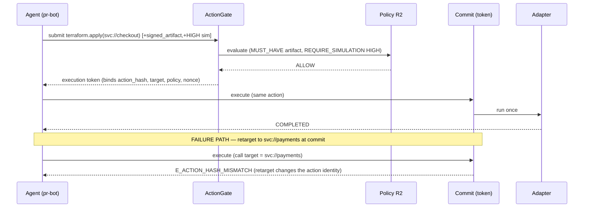
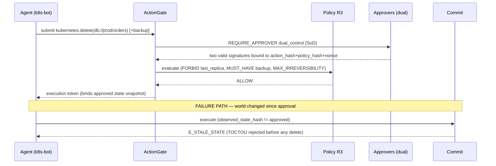
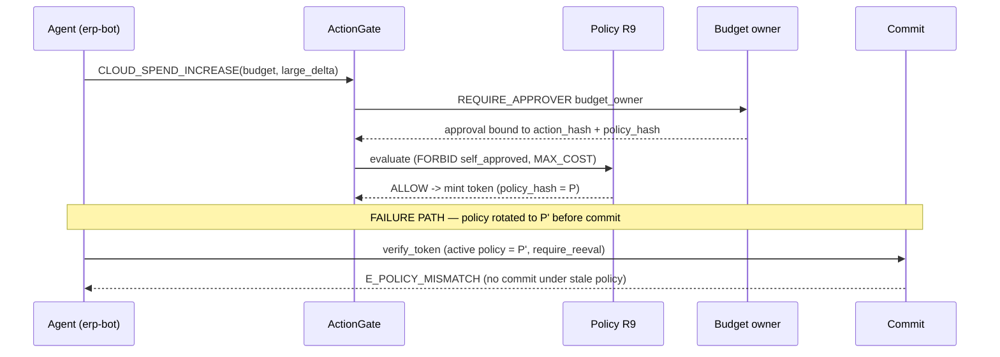
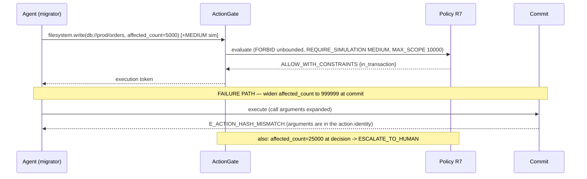

# ActionGate — Real-World Validation

**Evidence milestone.** Every result below is **measured** by running realistic agent workflows
through the **real** ActionGate modules (`action_gate_ref` + `action_gateway`) via
`real_world_validation.py`, and re-checked by `tests/test_real_world_validation.py`. No security
logic was changed. **[observed]** = produced by executing the code; **[interpretation]** = reading;
comparisons to other products are **[documented-role]** only (their public design, not tested here).

**Headline (measured):** 5 workflows, 5/5 happy paths committed, **12/12 injected attacks
detected**, each at a real detection point with a real error code (below).

Workflows are narratives mapped onto the frozen operation vocabulary — the engine is domain-free,
so only operation/policy/facts are data (see `../architecture_study/`). The mapping is stated per
workflow.

## 1. Workflows and their eight elements

For each workflow: original request → canonical action → policy → evidence → approvals → execution
token → commit state → completion. Values are **[observed]** from the run.

### W1 · GitHub coding agent — build+deploy a merged PR  ·  operation `DEPLOY`
- **request:** `terraform.apply target=svc://checkout` by `agent://pr-bot/1`, objective "deploy PR #1421".
- **canonical action:** `action_hash = projection.action_hash(envelope)` over the 24-field envelope.
- **policy:** R2 — `MUST_HAVE signed_artifact` + `REQUIRE_SIMULATION HIGH` → `ALLOW`.
- **evidence:** a `signed_artifact` (CI provenance) + a `HIGH`-fidelity deployment `simulation`, both
  `bound_to` the action_hash.
- **approvals:** none required by R2.
- **execution token:** minted on `ALLOW`, binding action_hash + operation + target + credential_scope
  + constraints + expiry + nonce + policy_hash + decision_record_hash.
- **commit state / completion:** `execute_action` → **COMPLETED** (adapter ran once).

### W2 · Kubernetes destructive rollout — delete a prod StatefulSet  ·  operation `DB_DELETE`
- **request:** `kubernetes.delete target=db://prod/orders`, `reversibility=REVERSIBLE_WITH_COST`.
- **policy:** R3 — `FORBID last_replica` + `MUST_HAVE verified_restorable_backup (hard)` +
  `MAX_IRREVERSIBILITY` + `REQUIRE_APPROVER dual_control` → `ALLOW`.
- **evidence:** `verified_restorable_backup` bound to the action.
- **approvals:** `dual_control` (security-lead + sre-lead), bound to action_hash + policy_hash + nonce, SoD-checked.
- **token / commit / completion:** minted → `execute_action` → **COMPLETED**.

### W3 · ERP purchase approval — over-threshold spend  ·  operation `CLOUD_SPEND_INCREASE`
*(driven over the real modules directly; this operation has no gateway tool mapping.)*
- **request:** spend on `budget://q3-marketing`, `large_delta=true`, `self_approved=false`.
- **policy:** R9 — `FORBID self_approved` + `MAX_COST` + `REQUIRE_APPROVER budget_owner (when large_delta)` → `ALLOW`.
- **evidence:** none required; **approvals:** `budget_owner`, bound to the action.
- **token / commit:** `token.build_token` → `token.verify_token(..., require_reeval=True)` → **verified**.

### W4 · Database schema migration  ·  operation `DB_MUTATION`
- **request:** `filesystem.write target=db://prod/orders`, `affected_count=5000`, `unbounded=false`.
- **policy:** R7 — `FORBID unbounded` + `REQUIRE_SIMULATION MEDIUM` + `MAX_SCOPE 10000` → `ALLOW_WITH_CONSTRAINTS {in_transaction}`.
- **evidence:** a `MEDIUM` `simulation`; **approvals:** none.
- **token / commit / completion:** minted → **COMPLETED**.

### W5 · Multi-agent software pipeline — build agent → migrate agent  ·  `DEPLOY` then `DB_MUTATION`
- **request:** agent A `terraform.apply` then agent B `filesystem.write`, sharing
  `correlation_id=pipe-42`, sequential `sequence_id`.
- **canonical action:** two distinct action_hashes; `delegation_chain` records who acted per step.
- **policy/evidence/approvals:** R2 for A (artifact+HIGH sim), R7 for B (MEDIUM sim).
- **commit / completion:** each step independently authorized and audited → **both COMPLETED** under
  one correlation id.

## 2. Failure matrix (measured)

| # | workflow | injected failure | detection point | ActionGate result **[observed]** | security property preserved |
|---|---|---|---|---|---|
| 1 | W1 GitHub | replay / duplicated execution | COMMIT | `E_NONCE_REPLAY` | single-use nonce → exactly-once |
| 2 | W1 GitHub | target substitution | COMMIT | `E_ACTION_HASH_MISMATCH` | exact-action binding (retarget rejected) |
| 3 | W2 K8s | approval reuse across actions | DECISION | `DENY` | approval binds one action_hash only |
| 4 | W2 K8s | stale state at decision | DECISION | `REQUEST_MORE_EVIDENCE` | freshness refusal |
| 5 | W2 K8s | TOCTOU state drift | COMMIT | `E_STALE_STATE` | commit-time state binding |
| 6 | W3 ERP | policy update after approval | COMMIT | `E_POLICY_MISMATCH` | token bound to policy_hash |
| 7 | W3 ERP | privilege / credential tamper | COMMIT | `E_ACTION_HASH_MISMATCH` | credential_scope in action_hash |
| 8 | W3 ERP | approval nonce replay | DECISION | `DENY` | approval nonce single-use |
| 9 | W4 migration | over-scope blast radius | DECISION | `ESCALATE_TO_HUMAN` | MAX_SCOPE blast-radius guard |
| 10 | W4 migration | argument expansion at commit | COMMIT | `E_ACTION_HASH_MISMATCH` | no post-approval argument tamper |
| 11 | W5 pipeline | cross-step replay of a committed action | COMMIT | `E_NONCE_REPLAY` | per-step exactly-once |
| 12 | W5 pipeline | cross-agent action confusion | COMMIT | `E_ACTION_HASH_MISMATCH` | a token binds its own action only |

**[observed]** All 12 detected; no attack produced a COMPLETED execution (asserted by the test).

## 3. Sequence diagrams

Legend: **Gate** = `gate.evaluate` (VALIDATE), **Commit** = `token.verify_token` / `gateway.execute`.

### W1 — GitHub deploy: success and target-substitution failure


### W2 — K8s destructive delete: success and TOCTOU failure


### W3 — ERP purchase: success and policy-update-after-approval failure


### W4 — Schema migration: success and argument-expansion failure


### W5 — Multi-agent pipeline: success and cross-agent confusion failure
```mermaid
sequenceDiagram
  participant B as Build agent
  participant M as Migrate agent
  participant G as ActionGate
  participant C as Commit
  B->>G: DEPLOY(svc://api)   %% correlation pipe-42:0001
  G-->>B: token_A ; B executes -> COMPLETED
  M->>G: DB_MUTATION(db://prod/api)  %% correlation pipe-42:0002
  G-->>M: token_B
  Note over M,C: FAILURE PATH — drive migrate slot with the build action
  M->>C: execute (call = build action, token = token_B)
  C-->>M: E_ACTION_HASH_MISMATCH (token_B binds only B's action)
  Note over B,C: replaying B's committed action -> E_NONCE_REPLAY
```

## 4. Comparative analysis (documented roles only)

**Disclaimer [documented-role]:** the columns below reflect each product's *documented role and
granularity*, not tests against their implementations. The claim is narrow — that certain failure
families are outside the **layer/granularity** these systems operate at — not that any product is
"broken." Legend: **no@layer** = not designed to catch this at the per-action-commit layer ·
**partial** = catches only if the substitute violates static permissions/thresholds, not because it
differs from an approved action · **adjacent** = a related control exists at a different granularity
(session/credential) · **diff-model** = handled differently, not as a stale-commit.

| failure family | ActionGate **[observed]** | AWS IAM | OPA | CyberArk |
|---|---|---|---|---|
| replay / duplicated execution (exactly-once) | `E_NONCE_REPLAY` @COMMIT | no@layer (stateless per-request auth; STS tokens reusable within validity) | no@layer (decision function; no nonce/commit) | adjacent (session OTP/one-time creds gate sessions, not a specific action's commit) |
| target substitution vs an *approved* action | `E_ACTION_HASH_MISMATCH` @COMMIT | partial (resource-scoped policy limits targets, but no binding to a prior approval) | partial (depends on supplied input; no canonical action identity) | no@layer (no per-action canonical binding) |
| approval reuse / single-use approval | `DENY` @DECISION | no@layer (no native multi-party approval primitive) | no@layer | adjacent (dual-control approves a *session*, not a nonce bound to an action_hash) |
| stale state at decision (freshness) | `REQUEST_MORE_EVIDENCE` @DECISION | no@layer (no state-snapshot/freshness concept in authz) | no@layer | no@layer |
| TOCTOU state drift at commit | `E_STALE_STATE` @COMMIT | no@layer (no decision-to-state binding rechecked at commit) | no@layer | no@layer |
| policy update after approval | `E_POLICY_MISMATCH` @COMMIT | diff-model (re-auths each call against current policy; has no prepared-commit token to go stale) | diff-model (re-evaluates each query) | adjacent (session policy applied continuously) |
| privilege / credential tamper vs approved | `E_ACTION_HASH_MISMATCH` @COMMIT | partial (denies only if tampered creds exceed static permissions; no bind to approved action) | partial | adjacent (session credential controls) |
| blast-radius / over-scope | `ESCALATE_TO_HUMAN` @DECISION | partial (policy conditions can cap; no evidence-gated human escalation) | yes-diff (a threshold rule can `deny`, but returns deny, not an evidence-backed escalation workflow) | no@layer |

**[interpretation]** The consistent pattern: IAM authorizes a *principal for a permission class*
per request; OPA returns a *decision* for a given input; CyberArk governs *privileged sessions and
credentials*. None of them, by their documented design, bind a decision to a **specific canonical
action instance** and **re-validate that exact action at commit against the live state** with a
**single-use token** — which is precisely where ActionGate detected failures 1, 2, 5, 7, 10, 11, 12
(commit-time) and 3, 4, 8, 9 (evidence/approval/state at decision). Where the other systems overlap
(resource scoping, threshold rules) they do so at a coarser granularity and without action-instance
binding.

## 5. Reproduce
```
cd cyber_security/action_gate_reference/real_world_validation
python3 real_world_validation.py      # prints the summary + per-attack detections; writes real_world_results.json
# regression:
cd .. && python3 -m pytest tests/test_real_world_validation.py -q
```
Deterministic (`FixedClock`, fixed nonces). Results artifact: `real_world_results.json`.
