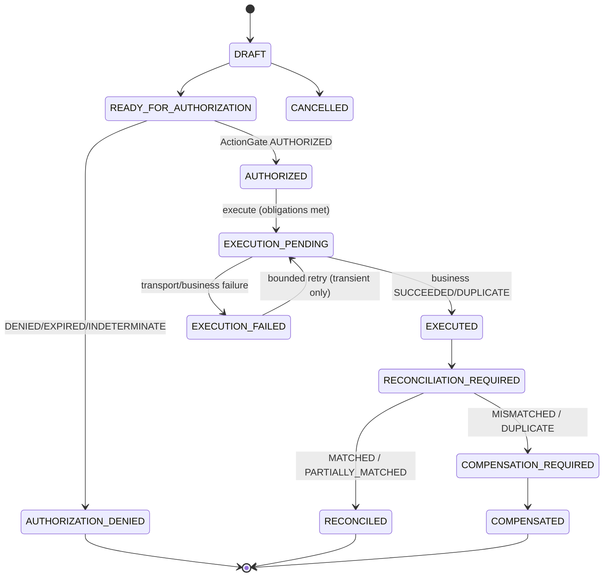

# H4 — Hiring Action Authorization, Execution & Reconciliation — Completion Report

Application-local, additive phase on the H3 baseline (`4f043b9`). A governed human
decision can now be converted into a **separately authorized** hiring action,
executed through a **replaceable external port**, and **reconciled** against what
actually occurred. **No frozen platform file was modified; no frozen API changed.**
All new code is under `ai_hiring/` and reaches the platform only through
`decision_governance.api` and `governance_providers.api`; ActionGate is used **only**
through the Action Governance Provider contract (never ActionGate internals), and
execution imports **no** HRIS/email/calendar/payroll/vendor SDKs.

## Invariant (preserved and enforced)

> Evidence → Recommendation → TAP evaluation → Human review → **Human decision** →
> Action proposal → **ActionGate authorization** → External execution → Receipt →
> Reconciliation → Remediation/compensation when required.
>
> Never `Recommendation → Action`; never `Human decision → Direct execution`.

**Outcome statement.** *The AI may recommend. A human decides. ActionGate authorizes.
External systems execute. Ugence verifies, reconciles, and preserves the accountable
record of what actually happened.*

Enforced by: a proposal requires a **DECIDED** H3 governance binding with a **human**
decision authority (`IneligibleActionSourceError`); execution requires a provider
authorization (`ActionNotAuthorizedError`) that is current, unexpired, parameter-bound,
and obligation-satisfied; and the services expose no grant/waive/expand/self-authorize
method (`test_h4_boundary.py`). `PREPARE_OFFER`/`PREPARE_REJECTION` are preparation only
— there is no `ISSUE_OFFER`/`SEND_REJECTION` action (deferred; separate authorization).

## Status

- **Implemented:** governed action proposals, DecisionCase-to-action binding, ActionGate
  authorization, obligation/constraint enforcement, a replaceable external-execution
  port with deterministic test adapters, execution attempts + receipts, bounded
  idempotent retries, reconciliation, compensation proposals, and end-to-end
  reconstruction + read models.
- **Tests:** **43 new H4 tests**; full AI Hiring suite **701 passed** (was 658);
  kernel+framework+TAP+ActionGate+AI-Hiring **840 passed**; freeze **PASS**;
  dependency-direction **0 violations**.

## Action-state lifecycle

## ActionGate integration map

`ai_hiring/actions/actiongate_integration.py` depends **only** on
`governance_providers.api`. For each proposed action:

1. build a neutral `ActionGovernanceRequest` (action_type, requested parameters, actor,
   authority_context = the human decision authority, target_resource, policy_refs,
   decision_refs, idempotency_key, correlation_id, `authorization_expired`);
2. `provider.authorize(request)` through the injected `ActionGovernanceProvider`
   (ActionGate, or the framework's deterministic reference provider in tests) — **no
   ActionGate internals**;
3. persist the exact `ActionGovernanceResult` as an immutable `ActionAuthorizationRecord`
   (outcome, constraints, obligations, expiry, authority_basis, trace, fingerprint), with
   the **binding** pinned (`bound_actor`, `bound_target`, `bound_parameter_hash`,
   idempotency_key);
4. `AUTHORIZED`/`AUTHORIZED_WITH_CONSTRAINTS` → executable; `DENIED`/`EXPIRED`/
   `INDETERMINATE` (and provider failure) → non-executable, fail-safe.

The provider **authorizes**; it never executes. No downstream adapter may relax its
constraints or obligations.

## Authorization, constraints & obligations

Authorization is treated as **exact and bounded**. It binds action type, actor, target,
tenant, candidate/application scope (via the proposal), permitted parameters
(`bound_parameter_hash`), temporal validity (`expiry`), obligations, and the source
DecisionCase + human decision. **Changing any material field requires a new
authorization** — the execution service recomputes the parameter hash and rejects a
changed proposal (`ActionConstraintViolationError`). Pre-execution **obligations** must
be satisfied or the action is non-executable (`ObligationUnmetError` +
`ACTION_OBLIGATION_UNMET` audit). Expiry is enforced at execution time
(`HiringAuthorizationExpiredError`).

## Execution & reconciliation architecture

Execution (`hiring_action_execution_service.py`) runs through the neutral
`ExternalExecutionProvider` port (dispatch / observe / cancel). **Transport is separate
from business outcome**: a `dispatch` acknowledgement never means "executed"; the
`observe` step yields the business outcome persisted as a normalized `ExecutionReceipt`.
Idempotency + bounded retries: one logical action per idempotency key, retry only for
classified **transient** failures, no retry after success or authorization expiry, and no
second external action. Reconciliation (`hiring_reconciliation_service.py`) compares the
human decision → authorized intent → execution receipt and classifies the outcome. **A
successful API response alone is never reconciled** — reconciliation is a distinct step.

## Failure & compensation matrix

| Condition | Behavior |
|---|---|
| No human decision / recommendation-only | `IneligibleActionSourceError` (proposal refused) |
| Decision outcome ≠ requested action | `DecisionActionMismatchError` |
| ActionGate DENIED / provider unavailable | proposal `AUTHORIZATION_DENIED`; non-executable |
| Authorization expired (exec time) | `HiringAuthorizationExpiredError` |
| Parameters changed since authorization | `ActionConstraintViolationError` (new auth required) |
| Unmet pre-execution obligation | `ObligationUnmetError` + audit; non-executable |
| Transport failure (retryable) | attempt `RETRYABLE`; proposal `EXECUTION_FAILED`; bounded retry |
| Transport failure (non-retryable) / permanent | `TERMINAL`; no retry |
| Malformed receipt | `MalformedReceiptError`; `EXECUTION_FAILED` (never EXECUTED) |
| Receipt target differs | `TargetMismatchError`; `EXECUTION_FAILED` |
| Already executed successfully | `DuplicateExecutionError` (no second action) |
| Reconciliation MATCHED / PARTIALLY_MATCHED | `RECONCILED` |
| Reconciliation MISMATCHED / DUPLICATE_EXECUTION | `COMPENSATION_REQUIRED` |
| Reconciliation NOT_EXECUTED / UNVERIFIABLE | stays `RECONCILIATION_REQUIRED` (visible, unresolved) |
| Compensation — reversible | separately-governed compensation proposed (`PROPOSED`) |
| Compensation — irreversible | **never auto-compensated** → `HUMAN_REMEDIATION_REQUIRED` |

No failure path silently marks an action executed or reconciled.

## Human authority

AI/system may propose actions consistent with the human decision, prepare parameters,
detect mismatches, and recommend remediation. AI **may not** create the binding human
decision (H3), grant/expand/waive authorization (ActionGate does; the services have no
such method), execute outside the approved adapter path, declare reconciliation complete
without a receipt, or authorize its own compensation (compensation actions are separately
governed).

## Audit planes (linked, not merged)

Hiring-domain audit (action proposed/revised, execution requested/attempted/failed,
reconciliation completed, remediation requested — hash-chained, hiring-owned) is linked
by **correlation and causation ids** to the DGM governance audit (decision, authority,
case lifecycle) and the provider records (the `ActionAuthorizationRecord` carries the
ActionGate outcome/constraints/obligations/expiry/trace). The new hiring event names are
disjoint from the frozen kernel `AuditEventType` (verified by `test_h1_boundary.py`).

## Reconstruction & read models

`HiringActionReconstructionService.reconstruct(proposal_id)` rebuilds the entire chain —
source recommendation + TAP claim evaluations, human decision, action proposal, ActionGate
authorization, execution attempts + receipts, reconciliation, compensation — cross-links
hiring + DGM audit, and verifies the hiring hash chain, link integrity, and tenant-scope
consistency. Read models (`actions/read_models.py`): authorization summary, pending
obligations, execution timeline, execution failures, reconciliation status, unresolved
mismatches, compensation queue, and the complete decision→outcome trace.

## Validation report

| Check | Result |
|---|---|
| AI Hiring suite (`pytest ai_hiring`) | **701 passed** (658 baseline + 43 H4) |
| Kernel + framework + TAP + ActionGate + AI Hiring | **840 passed** |
| Platform Freeze verification | **PASS** |
| Dependency-direction | **0 violations** |
| Frozen platform files modified | **none** (diff = `ai_hiring/` + `docs/ai-hiring/`) |
| H4 import surface | `decision_governance.api` + `governance_providers.api` only; no ActionGate/TAP-internal or vendor-SDK imports (`test_h4_boundary.py`) |

### H4 test coverage (43 tests)
valid decision→action flow · recommendation-to-action bypass rejection · missing human
decision · decision/action mismatch · duplicate proposal · ActionGate approval/denial/
constrained/unavailable · unmet obligation · expired authorization · modified parameters ·
tenant mismatch · successful execution · transient failure + bounded retry · permanent
failure · idempotent duplicate · duplicate external execution · malformed receipt · partial
execution · target mismatch · reconciliation matched/partial/mismatch/not-executed/duplicate ·
success-≠-reconciled · reversible compensation · irreversible → human remediation · resolve ·
end-to-end reconstruction · cross-audit linkage · tamper detection · read models · import
boundary · prepare≠issue.

**Baseline limitations carried forward** (unchanged, pre-existing, unrelated): the
`classify_change` freeze-tooling self-test failure and the whole-repository
`_SymboluFinder` collection errors in unrelated experimental modules. The H4 green
baseline is scoped to the platform-relevant packages, **not** the whole repository.

## Completion criteria — met

- No hiring action can execute without a governed human decision ✓.
- Every action is authorized through the Action Governance Provider ✓.
- Authorization constraints and obligations are enforced ✓.
- Execution uses a replaceable external port (no vendor SDKs) ✓.
- Retries are bounded and idempotent ✓.
- Actual outcomes reconciled against authorized intent; mismatches remain visible until
  handled ✓.
- Compensation is separately governed; irreversible actions are never auto-compensated ✓.
- The entire decision-to-outcome chain is reconstructable ✓.
- All prior + new tests pass; Platform Freeze passes; no frozen file changed ✓.

## Deferred to H5 / H6 (NOT implemented in H4)

- **H5 — Validation, Fairness Analysis & Shadow Pilot:** end-to-end scenario matrices, a
  bounded shadow pilot, fairness **analysis only** (no certification), audit-reconstruction
  reporting.
- **H6 — Packaging, Documentation & Product Wrap-up.**
- Also deferred: production HRIS/payroll/email/identity integrations (only replaceable
  ports + deterministic test adapters ship in H4); and the contractual `ISSUE_OFFER` /
  `SEND_REJECTION` steps, which are separately-authorized consequential actions beyond the
  H4 preparation actions.
