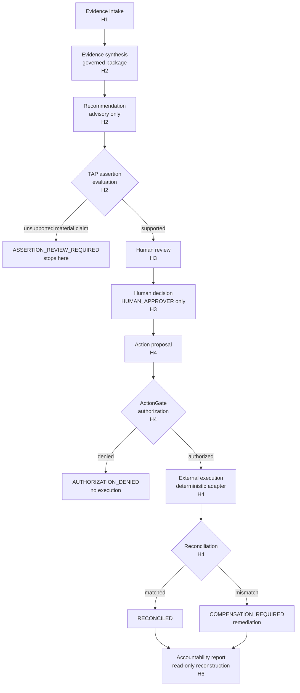

# Architecture

AI Hiring is a **consuming application** layered strictly on top of the frozen
Decision Governance Platform. The dependency direction is one-way and enforced by
the platform-freeze dependency check (0 violations):

```
applications / ai_hiring.product   (packaging & demo — H6)
        │
        ▼
ai_hiring  (hiring domain: intake, synthesis, recommendation, governance
        │   integration, action proposal/authorization/execution/reconciliation,
        │   hiring-owned hash-chained audit)                        [H1–H5]
        ▼
governance_providers.api / .contracts / .reference   (provider framework +
        │   deterministic provider implementations used only for validation)
        ▼
decision_governance.api   (frozen kernel: DecisionCase, recommendation &
            decision services, ActionGate authorization, external-execution
            port, kernel audit, identity, policy)               [Platform v1.0]
```

The reverse never holds: the kernel and providers know nothing about hiring, and
`ai_hiring.product` adds no governance, decision, authorization, or execution
semantics — it only packages what H0–H5 already shipped.

## The accountable lifecycle



### Invariants the structure enforces (not just documents)

- **Never** `Recommendation → Action`: an action proposal requires an eligible,
  review-ready recommendation **and** an authorized human decision.
- **Never** `Human decision → Direct execution`: execution requires a valid
  ActionGate authorization bound to the decision.
- **Human-only decisions**: only an authenticated `HUMAN_APPROVER` may record a
  binding decision; the AI actor is grant-denied `MAKE_DECISION` /
  `OVERRIDE_RECOMMENDATION`.
- **Transport ≠ outcome**: the execution adapter reports transport acceptance
  separately from business outcome; reconciliation compares the authorized request
  to what was actually observed.
- **Analysis-only blindness**: group labels / protected attributes never enter the
  operational pipeline; the governed evidence-package fingerprint is invariant to
  them (validated in H5).

## Audit: two chains, cross-linked

- **Hiring-owned domain audit** — hash-chained, with a `HiringDomainEventType` enum
  kept **disjoint** from the kernel's `AuditEventType` (enforced by a boundary test).
- **Kernel governance audit** — the platform's own record, correlated by
  correlation id.

The reconstruction service walks both, verifies the hiring hash chain, checks link
integrity and tenant scope, and reports any broken links or tampering. The
[accountability report](API_REFERENCE.md#accountability) is a read-only rendering of
that reconstruction.

## Composition roots

| Root | Purpose | Execution |
|---|---|---|
| `applications.ai_hiring.platform.build_in_memory_platform` | Canonical app wiring (H0–H4) | in-memory |
| `ai_hiring.validation.composition.build_validation_env` | Full H1–H4 lifecycle for validation (H5) | deterministic |
| `ai_hiring.product.build_dev_platform` / `build_demo_platform` | Product/demo wiring (H6) | deterministic |

All three are deterministic and perform no production external effect.
