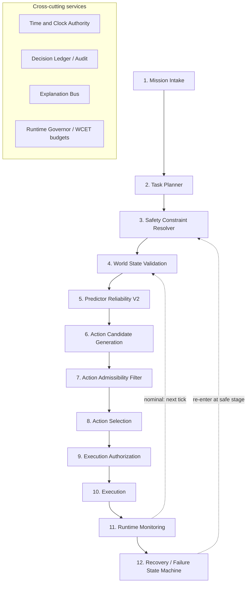

# Autonomous Control Plane (ACP) — V1 Architecture

**Status:** Design-first. Documentation only. No production code is modified by
this milestone.
**Predecessor evidence:** `ROBOTICS_BCVF_IMPLEMENTATION_AUDIT.md`,
`ROBOTICS_BCVF_INCREMENTAL_VALUE_RESULTS.md`,
`ROBOTICS_ACTIONGATE_ARCHITECTURE_MAPPING.md`.
**Design stance:** ACP is designed **as though BCVF never existed**. BCVF is not
a foundation; at most it is one optional predictor-disagreement *feature*
(§6, and `ACP_PREDICTOR_RELIABILITY_V2.md`).

This document defines the control plane (Task 1) and its runtime governance
(Task 6). Per-stage deterministic logic is in `ACP_RUNTIME_PIPELINE.md`; the
subsystem designs are in the sibling docs listed in §9.

---

## 1. What ACP is

ACP is the **deterministic decision-and-authorization runtime** that sits
between a robot's perception/prediction stack and its actuators. It answers one
question every control tick, with a defensible, replayable, explained answer:

> *Given the current mission, the validated world state, and the reliability of
> each predictor — what single action is authorized to execute right now, or is
> the correct answer "no safe action"?*

ACP is **not** perception, prediction, mapping, or control law design. It
consumes their outputs and governs the decision. It is the robotics analogue of
a control plane in distributed systems: it does not do the work, it decides and
authorizes what work is allowed to happen.

## 2. First-principles design axioms

Every stage of ACP is derived from these seven axioms. Where an axiom and a
convenience conflict, the axiom wins.

| # | Axiom | Concrete consequence in ACP |
|---|---|---|
| A1 | **Safety is non-compensatory** | Hard constraints are a *filter*, never a term in a score. No soft optimum can buy back a violated hard constraint. |
| A2 | **Deterministic execution** | Same inputs → same decision, bit-for-bit. No probabilistic scoring where a deterministic decision exists; all tie-breaks are explicit and total. |
| A3 | **Explainability is mandatory** | Every accept/reject/abstain emits a structured, human-legible reason bound to the evidence it used. No opaque scalar decides anything alone. |
| A4 | **Recoverability is a first-class state** | Failure is an expected input, not an exception. A defined failure state machine governs every degraded mode; there is always a defined safe posture. |
| A5 | **Predictable runtime** | Every stage has a worst-case execution time (WCET) budget and bounded memory. No unbounded loops, no allocation on the hot path in the production port. |
| A6 | **Bounded computation** | Fixed candidate counts, fixed horizons, fixed predictor counts. Nothing scales with unvalidated external input. |
| A7 | **Measurable confidence** | Confidence is a **deterministic, physical quantity** — margin-to-constraint (metres/seconds), trust state (enum), evidence completeness (fraction) — never an opaque probability. |

### 2.1 The confidence model (A7), stated once

ACP does **not** emit "trust = 0.87." It emits a tuple every tick:

```
confidence = (
    margin_m:            metres to nearest hard spatial boundary,
    margin_s:            seconds to nearest temporal/kinematic boundary,
    predictor_state:     {TRUSTED, DEGRADED, SUSPECT, FAILED, RECOVERING},
    evidence_complete:   fraction of required inputs that are fresh & valid,
    admissible_count:    number of hard-admissible actions this tick,
)
```

Each field is deterministic, bounded, physically meaningful, and explainable.
"Low confidence" is never a mood; it is "0.15 m margin, 2 of 4 predictors
SUSPECT, evidence 0.6." This is what makes a safety case and an operator
dashboard possible.

## 3. The control plane (Task 1)

Twelve sequential stages plus four cross-cutting services. The sequence is a
**runtime invariant**, not a configurable option (the ordering *is* the safety
argument — mirroring the previous milestone's finding that unguarded ranking
lets unsafe actions win).



### 3.1 Stage responsibilities

| # | Stage | Responsibility (one sentence) | Can emit refusal? |
|---|---|---|---|
| 1 | **Mission Intake** | Validate and admit a mission; reject malformed/over-scope missions at the boundary. | reject mission |
| 2 | **Task Planner** | Decompose the active mission into an ordered, bounded task/goal stack; deterministic (HTN / precedence), not learned. | fail-plan |
| 3 | **Safety Constraint Resolver** | Assemble the *active* hard-constraint set for the current context (geofence, speed law, kinematic limits, mission constraints) as data the rest of the pipeline filters against. | — |
| 4 | **World State Validation** | Certify the world model is fresh, complete, and internally consistent enough to decide on; else raise a typed insufficiency. | STALE_WORLD |
| 5 | **Predictor Reliability V2** | Reduce M predictor streams to a trusted consensus + per-predictor state, or ABSTAIN when no trusted quorum exists. | ABSTAIN |
| 6 | **Action Candidate Generation** | Produce a **bounded, fixed-size** set of candidate actions from primitives/planner for this tick. | empty-set |
| 7 | **Action Admissibility Filter** | Apply the non-compensatory hard gate; keep only candidates that violate *no* hard constraint. | — (may empty the set) |
| 8 | **Action Selection** | Deterministically choose one action among the admissible set by soft objective + total tie-break, or return `NO_SAFE_ACTION`. | NO_SAFE_ACTION |
| 9 | **Execution Authorization** | Canonicalize the chosen action, re-validate state at commit (TOCTOU), enforce single-use/replay protection, and mint a one-shot execution grant. | DENY_COMMIT |
| 10 | **Execution** | Hand the authorized command to the actuator adapter, once. | actuator-reject |
| 11 | **Runtime Monitoring** | Watch deadlines, invariants, and confidence during and after execution; detect divergence from the authorized intent. | trip-monitor |
| 12 | **Recovery / Failure SM** | On any refusal or tripped monitor, drive the deterministic failure state machine to a defined safe posture and re-entry point. | (is the handler) |

### 3.2 Cross-cutting services

- **Time & Clock Authority.** A single monotonic clock injected everywhere;
  freshness, deadlines, and replay windows all read it. No stage calls
  wall-clock directly (this is why the previous kernel audit found a
  clock-backwards mute bug — ACP forbids ambient time).
- **Decision Ledger / Audit.** Append-only, hash-chained record of every tick's
  inputs digest, decision, dispositive reason, and authorization grant. The
  incident-recall and safety-case artifact.
- **Explanation Bus.** Every stage publishes a structured `Explanation` (Task 8);
  the ledger and the operator surface subscribe to it.
- **Runtime Governor.** Owns the per-stage WCET budgets and the tick deadline;
  a stage that would blow its budget is preempted into a defined degraded
  decision, never allowed to run unbounded.

## 4. Data contracts (the spine)

Three canonical, validated envelopes flow through the plane. Everything is a
pure function of a validated envelope (A2).

```
WorldSnapshot   := { t, ego_state, obstacles[], map_ref, sensor_health[],
                     predictor_streams[], snapshot_hash }        # stage 4 output
CandidateAction := { id, primitive, params, predicted_traj,
                     hard_features{collision_margin, stability, feasible,
                     speed, geofence_ok, mission_ok},
                     soft_features{energy, distance, time, comfort} }
ExecutionGrant  := { action_id, snapshot_hash, constraint_set_hash,
                     nonce, issued_t, deadline_t, grant_sig }    # stage 9 output
```

`snapshot_hash` binds every downstream decision to the exact world state it was
computed on (evidence/state binding, borrowed from ActionGate architecture, not
its code — see `ACP_ACTIONGATE_ARCHITECTURE_MAPPING.md` in the prior milestone).

## 5. Runtime governance (Task 6)

ACP borrows **seven architectural properties** (patterns, not APIs, not
terminology) that genuinely transfer from ActionGate's decision machine. Each is
re-implemented for robotics.

| governance property | ACP mechanism | where |
|---|---|---|
| **Canonical action** | `CandidateAction` / `ExecutionGrant` envelopes; every decision is a pure function of a validated envelope | §4 |
| **Deterministic evaluation** | A2 everywhere; frozen tie-breaks; replayable ledger | all stages |
| **Commit authorization** | Stage 9 mints a one-shot `ExecutionGrant`; execution without a valid grant is impossible | stage 9→10 |
| **Replay prevention** | single-use `nonce` + monotonic `issued_t` + `deadline_t`; a re-sent or stale grant is rejected at the actuator boundary | stage 9/10 |
| **State validation** | Stage 4 up front + **commit-time re-validation** in stage 9 (world may have moved since stage 5) | stages 4, 9 |
| **Audit trail** | hash-chained Decision Ledger over every tick | cross-cutting |
| **Execution confirmation** | Stage 11 confirms the actuator did what the grant authorized; divergence trips recovery | stage 11 |

**Deliberately NOT borrowed:** ActionGate's operation enum, `extract_facts`
adapter, signed enterprise policy, human SoD/four-eyes approval, disclosure
modes, and the K8s broker. None map to robot control (justified in the prior
`ROBOTICS_ACTIONGATE_ARCHITECTURE_MAPPING.md`). ACP uses robotics-native terms,
not ActionGate's.

## 6. Where BCVF lives (if at all)

Designed-from-scratch, ACP has exactly one optional slot for BCVF: inside
Predictor Reliability V2 (stage 5), as **one disagreement-dynamics feature among
several**, off by default, permitted only to *shorten detection latency* on
accelerating/abrupt disagreement. It may never override an `ABSTAIN`, silence a
`SUSPECT`, or force a winner. This is the measured `AUGMENT_PREDICTOR_TRUST`
outcome, not a design assumption. See `ACP_PREDICTOR_RELIABILITY_V2.md` §5.

The action-selection path (stages 6–8) contains **no BCVF** — the
`REPLACE_ACTION_BCVF` verdict is honored by construction.

## 7. Non-goals

- ACP is not a planner replacement (it consumes a planner; stage 2 can wrap the
  existing HTN planner — see the reuse audit).
- ACP is not a perception/fusion layer.
- ACP does not claim certification; it is an architecture whose *properties* are
  designed to be certifiable, backed to date only by synthetic, decision-grade
  evidence.

## 8. Known architectural deficiencies (documented, not hidden)

Per the milestone instruction to document deficiencies separately, these are the
open risks in the V1 design:

- **D1 — Common-mode blindness.** Stages 5 is disagreement-based; common-mode
  predictor failure (all wrong together) is invisible to it. ACP requires an
  *independent reference* (map/GNSS/kinematic sanity) wired into stage 4/5 to
  cover this. V1 specifies the hook but not the reference source.
- **D2 — Constraint completeness is assumed.** Stage 7's safety guarantee is
  only as good as stage 3's constraint set. There is no formal proof the
  constraint set is complete for a given ODD; this needs a HARA-driven review.
- **D3 — WCET is asserted, not measured.** The budgets in
  `ACP_RUNTIME_PIPELINE.md` are design targets; a real WCET analysis on target
  hardware is pending.
- **D4 — Pure-Python reference vs real-time port.** The reference implementation
  (reusing the prior milestone's harness) is pure-Python; the no-allocation
  hard-real-time guarantee (A5) is only deliverable in a C++/Rust port.

## 9. Document set

| doc | task | content |
|---|---|---|
| `ACP_ARCHITECTURE.md` (this) | 1, 6 | control plane + governance |
| `ACP_RUNTIME_PIPELINE.md` | 2 | per-stage inputs/outputs/algorithm/complexity/failure modes |
| `ACP_PREDICTOR_RELIABILITY_V2.md` | 4 | predictor trust state machine |
| `ACP_ACTION_SELECTION_V2.md` | 5 | deterministic hard/soft action selection |
| `ACP_FAILURE_STATE_MACHINE.md` | 7 | failure handling + transition rules |
| `ACP_EXPLAINABILITY.md` | 8 | structured decision explanations |
| `ACP_MIGRATION_FROM_BCVF.md` | 3, 10 | reuse audit + migration roadmap + effort |
| `ACP_EXECUTIVE_SUMMARY.md` | 9, 10 | naming, simplification, readiness verdict |
