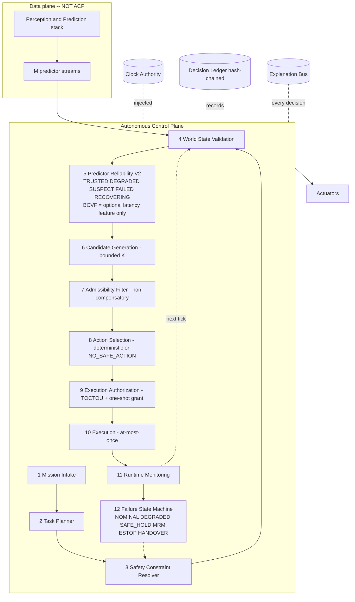

# Autonomous Control Plane — Executive Summary (Tasks 9 & 10)

**Milestone:** ACP V1 architecture. **Design-first; documentation only; no
production code modified.**

---

## 1. What was designed

A complete, deterministic robotics decision-and-authorization runtime — the
**Autonomous Control Plane (ACP)** — designed from first principles as though
BCVF never existed. Twelve sequential stages (mission → task planning → safety
constraints → world validation → predictor reliability → candidate generation →
admissibility → selection → execution authorization → execution → monitoring →
recovery) plus four cross-cutting services (clock authority, decision ledger,
explanation bus, runtime governor).

The design is grounded in the prior milestone's **measured** evidence
(`REPLACE_ACTION_BCVF`, `AUGMENT_PREDICTOR_TRUST`) and its already-validated
deterministic baselines, not in assumptions.

## 2. The architecture in one diagram

## 3. Naming recommendation (Task 9)

| candidate | verdict | reasoning |
|---|---|---|
| **Autonomous Control Plane (ACP)** | **RECOMMENDED** | "control plane" is the exact metaphor: it *governs and authorizes* but does not do the sensing/control-law work (that is the data plane). Aligns ACP with the platform's infrastructure positioning (ActionGate, Context Minimization, CSR Steering Controller). Scope-accurate: it also monitors and recovers, which is "control plane," not merely "decision." |
| Autonomous Decision Plane | strong runner-up | precise for stages 6–8, but understates authorization, monitoring, and recovery (stages 9–12) |
| Robotics Control Plane | accurate but | drops "Autonomous," which ties the product to the autonomy line; keep as an internal descriptor |
| Autonomous Execution Plane | reject | ACP does **not** execute — it authorizes; "execution plane" is the actuator/data side |
| Autonomous Runtime | reject | too generic; every subsystem is "a runtime" |

**Recommendation: keep "Autonomous Control Plane (ACP)".** It is the most
accurate and the most consistent with how the platform positions its other
pieces as infrastructure rather than algorithms.

## 4. Expected simplification vs the BCVF architecture

| dimension | BCVF-era | ACP | change |
|---|---|---|---|
| **action decision** | consistency Lagrangian + `exp(−βL)` + softmax + per-site post-multipliers; temperature/scale-sensitive; no hard gate; no abstain | boolean hard filter → fixed weighted sum → total tie-break → `NO_SAFE_ACTION` | opaque scalar → explainable predicate chain |
| **predictor trust** | softmin + EMA-centering + deadband + §6.6a exclusion + V2 Schmitt machine (`bcvf_autonomous/trust.py`) | 5-state threshold machine on bias/variance/freshness | fewer moving parts; directly targets harmful classes |
| **safety guarantee** | soft (safety as a subtraction / multiplier); unsafe action could win | non-compensatory hard filter; unsafe action structurally cannot win | qualitative safety upgrade |
| **explainability** | `normalized_weight = 0.42` (no reason) | one dispositive reason per decision, bound to evidence | black-box → auditable |
| **determinism** | β/scale-sensitive rankings; softmax | total orders, injected clock, no RNG on the path | reproducible bit-for-bit |
| **codebase** | BCVF across 3 call sites; learning/ + vision/ entangled with "smart" decisions | ~58% KEEP as-is, ~16% MODIFY (rewire), ~18% REMOVE from core (learning/vision), BCVF → optional feature | ~18% of tree off the safety path; decision logic collapses to filters + orders |
| **failure handling** | ad-hoc per-module recovery | one total failure state machine, fail-closed | scattered → single governed policy |

Net: the *decision* logic collapses from probabilistic scoring with hidden
temperature/scale sensitivity to **deterministic filters + total orders with a
named reason for every outcome**, and ~18% of the tree (learned/torch) leaves the
safety-critical path. BCVF shrinks from a product to an optional, bounded,
off-by-default latency feature.

## 5. Migration roadmap (summary)

0. Scaffolding + port the validated baselines into an ACP package (shadow only).
1. **Insert the hard-admissibility filter** at the 2 unguarded call sites — highest value, lowest risk, ships alone.
2. Replace action ranking with AS-V2, one site at a time (shadow-gated).
3. PR-V2 as primary predictor trust; BCVF demoted to optional S9 (off by default).
4. Failure state machine + governance (authorization, ledger, monitors).
5. Deprecate action BCVF; keep the kernel + tests (demoted, not deleted).

Full detail + gates in `ACP_MIGRATION_FROM_BCVF.md`.

## 6. Estimated implementation effort

**~14–19 engineering-weeks** plus a parallel real-sensor pilot, with Phases 1–2
(hard gate + AS-V2) being quick, high-value, independently shippable, and Phase 4
(failure SM + governance) the largest block. BCVF's action-path removal touches
only **3 call sites**.

## 7. Documented architectural deficiencies (open risks)

- **D1 Common-mode blindness** — disagreement-based PR-V2 cannot see all-
  predictors-wrong; needs an independent reference (map/GNSS/kinematic sanity)
  wired into stage 4/5. Hook specified; source not.
- **D2 Constraint completeness** — stage-7 safety is only as complete as stage-3's
  constraint set; needs a HARA-driven completeness review.
- **D3 WCET asserted, not measured** — per-stage budgets are design targets; real
  WCET analysis on target hardware is pending.
- **D4 Pure-Python reference vs RT port** — the no-allocation hard-real-time
  guarantee (axiom A5) is deliverable only in a C++/Rust port.

## 8. Readiness recommendation

# ⇒ READY WITH CHANGES

**Why READY:** the architecture is complete, internally consistent, and
first-principles; it is dominated by reuse (~58% KEEP, ~16% MODIFY); the two
hardest subsystems (deterministic action selection, deterministic predictor
trust) already have **validated reference implementations** from the prior
milestone; and it structurally fixes the measured BCVF defects (unsafe-action-can-
win, opaque decisions, false alarms, precise-bias miss).

**Why "WITH CHANGES," not "READY":** four documented deficiencies must be closed
before a production switch, none of which is a redesign:
1. **Specify the independent-reference source (D1)** so common-mode failure is
   covered, not just hooked.
2. **Run a HARA to certify constraint-set completeness (D2)** for the target ODD.
3. **Preregister PR-V2 dwell/threshold constants and run the gating real-sensor
   pilot** (the synthetic corpus and the 1,560-cell characterization do **not**
   discharge real-sensor safety) before any call-site switch.
4. **Commit to the RT port plan (D4)** for the hard-real-time guarantee.

**Not NOT-READY:** there is no architectural blocker — the open items are
scoping, validation, and a runtime-port decision, all sequenced in the roadmap.

Proceed to Phase 0 (scaffolding, shadow-mode) and Phase 1 (the hard-admissibility
filter — shippable on its own) immediately; gate Phases 2–5 on D1–D4 and the
pilot.

## 9. Deliverables index

| doc | task |
|---|---|
| `ACP_ARCHITECTURE.md` | 1, 6 — control plane + governance |
| `ACP_RUNTIME_PIPELINE.md` | 2 — deterministic per-stage logic |
| `ACP_PREDICTOR_RELIABILITY_V2.md` | 4 — predictor trust state machine |
| `ACP_ACTION_SELECTION_V2.md` | 5 — deterministic action selection |
| `ACP_FAILURE_STATE_MACHINE.md` | 7 — failure handling |
| `ACP_EXPLAINABILITY.md` | 8 — structured explanations |
| `ACP_MIGRATION_FROM_BCVF.md` | 3, 10 — reuse audit + roadmap + effort |
| `ACP_EXECUTIVE_SUMMARY.md` (this) | 9, 10 — naming, simplification, verdict |

**No production code was modified in this milestone.**
