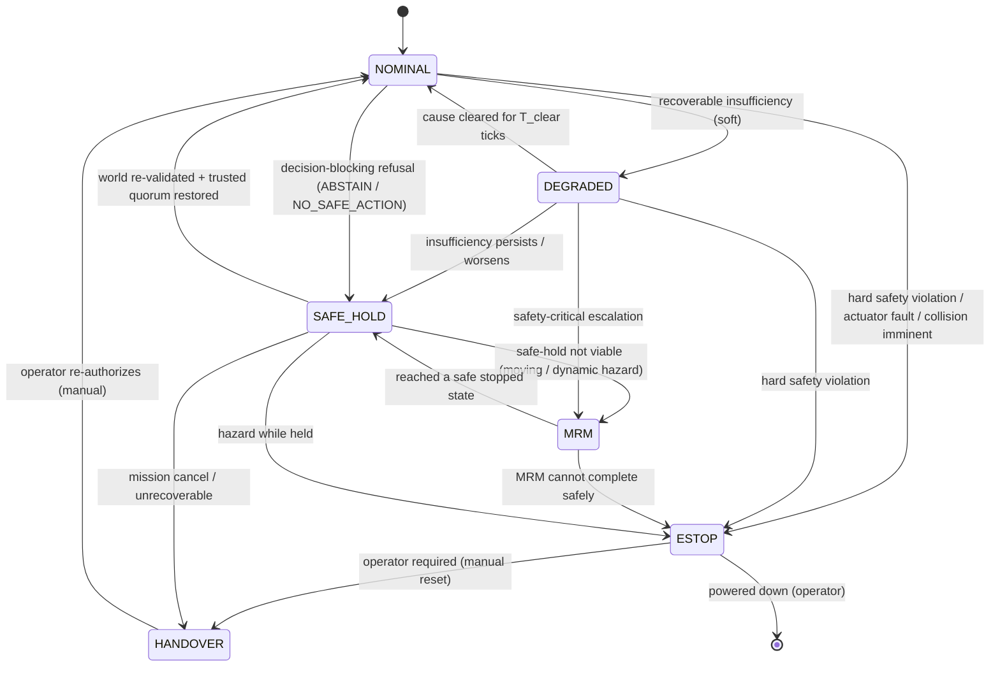

# ACP Failure State Machine (Task 7)

Recovery is **stage 12** of the Autonomous Control Plane and a first-class state
(axiom A4), not an exception path. Every refusal or tripped monitor from any
stage maps to exactly one transition into a defined **system posture** with a
defined safe behaviour and re-entry point. The handler is **total**: there is no
refusal without a defined transition; an unknown/aliased refusal defaults to the
most-restrictive posture (fail-closed).

This composes with — and supersedes the ad-hoc parts of — the existing
`recovery/` package (`fallback.py` tier-degradation R3→R2→R1, `watchdog.py`,
`sensor_recovery.py`), which become the mechanism layer beneath this policy.

---

## 1. System postures

| posture | behaviour | reversible? |
|---|---|---|
| `NOMINAL` | full pipeline runs | — |
| `DEGRADED` | reduced envelope (lower speed/accel caps), continues | auto, on dwell |
| `SAFE_HOLD` | controlled stop, hold position, keep monitoring | auto, on cause clear |
| `MRM` (minimum-risk maneuver) | execute a pre-authorized bring-to-safe-stop trajectory | → SAFE_HOLD on completion |
| `ESTOP` | immediate actuator-safe stop (reflexive tier) | **manual reset only** |
| `HANDOVER` | cede control to operator / teleop | **manual re-authorize** |

**ASIL-style decomposition** (mirroring the prior `SAFETY_STATE_MACHINE`):
NOMINAL↔DEGRADED and manual resets are lower-integrity (warnings/bookkeeping);
`→MRM`, `→ESTOP` are safety-critical, high-integrity transitions. **Direct jumps
that skip escalation are prohibited** except the hard-fault fast paths into ESTOP
(a hard fault must be able to reach ESTOP from anywhere in one transition).

## 2. Refusal → posture map

Every stage's refusal (from `ACP_RUNTIME_PIPELINE.md`) has one destination:

| origin | refusal | posture | rationale |
|---|---|---|---|
| Stage 1 | `REJECT_MISSION` | stay NOMINAL, no mission | boundary reject, not a runtime hazard |
| Stage 2 | `FAIL_PLAN` | DEGRADED → SAFE_HOLD if persists | no task to execute; hold |
| Stage 4 | `STALE_WORLD` | SAFE_HOLD (or MRM if moving) | cannot decide on invalid world |
| Stage 5 | `ABSTAIN` | SAFE_HOLD (or MRM if moving) | no trusted consensus to plan on |
| Stage 8 | `NO_SAFE_ACTION` | SAFE_HOLD → MRM if hazard closing | no admissible action exists |
| Stage 9 | `DENY_COMMIT` | re-enter stage 4; SAFE_HOLD if repeated | world moved since plan |
| Stage 10 | actuator-reject | ESTOP | actuation integrity lost |
| Stage 11 | `TRIP(watchdog)` | ESTOP or MRM per monitor | runtime invariant broken |

## 3. The seven required failure scenarios

### 3.1 Stale world model
- **Detected:** stage 4 freshness/consistency gate.
- **Transition:** NOMINAL/DEGRADED → **SAFE_HOLD** if stationary-safe; →**MRM** if
  in motion with dynamic hazards. Re-enter stage 4 each tick.
- **Recovery:** world re-validated + trusted quorum → NOMINAL after `T_clear`.

### 3.2 Sensor / predictor disagreement
- **Detected:** stage 5 PR-V2 (SUSPECT/FAILED per predictor).
- **Transition:** single culprit excluded, quorum holds → **DEGRADED** (continue on
  trusted consensus). No trusted quorum / correlated → **ABSTAIN → SAFE_HOLD**.
- **Recovery:** predictor RECOVERING→TRUSTED restores quorum → NOMINAL.

### 3.3 Planner disagreement
- **Definition:** two planners/plan sources yield materially divergent plans.
- **Detected:** a deterministic plan-consistency monitor (stage 2/11): compare
  committed plan vs shadow plan; divergence beyond tolerance = disagreement.
- **Transition:** → **DEGRADED**, prefer the more conservative plan (lower speed /
  larger margin) by a fixed rule; if neither is admissible → **SAFE_HOLD**.
- **Recovery:** plans re-converge for `T_clear` → NOMINAL. (Never average two
  plans; pick the conservative one deterministically.)

### 3.4 Communication loss
- **Detected:** `recovery/watchdog.py` heartbeat/liveness on the relevant link
  (teleop, swarm peer, mission uplink).
- **Transition:** non-critical link → **DEGRADED** (continue autonomously within a
  reduced envelope). Critical link (teleop-required mode) → **SAFE_HOLD**, then
  **HANDOVER** timeout escalation.
- **Recovery:** link restored + fresh state → NOMINAL.

### 3.5 Actuator failure
- **Detected:** stage 10 actuator-reject / stage 11 intent-divergence / energy &
  current bounds (`safety/energy_bounds.py`).
- **Transition:** → **ESTOP** (hard fast path) or **MRM** if a degraded-actuator
  bring-to-stop is still controllable. Reflexive tier (R1) owns the
  sub-millisecond cut.
- **Recovery:** **manual reset only** (latched); operator re-authorizes via
  HANDOVER → NOMINAL.

### 3.6 Unexpected obstacle
- **Detected:** stage 7 admissibility empties (`NO_SAFE_ACTION`) and/or stage 11
  margin-collapse monitor; reflexive `collision_guard.py` as the last line.
- **Transition:** obstacle avoidable with an admissible action → normal selection
  handles it (no posture change). No admissible action → **SAFE_HOLD**; closing
  hazard → **MRM**; imminent collision → **ESTOP** (reflexive).
- **Recovery:** obstacle clears, admissible action reappears → NOMINAL.

### 3.7 Mission cancellation
- **Detected:** stage 1 mission-control command.
- **Transition:** → **SAFE_HOLD** (controlled stop), then **HANDOVER** or idle per
  policy. Never an abrupt stop unless a hazard co-occurs.
- **Recovery:** new mission admitted at stage 1 → NOMINAL.

## 4. Transition rules (deterministic)

1. **Fixed precedence.** Each tick, refusals are evaluated in a frozen order;
   the most-restrictive applicable posture wins (ESTOP > MRM > SAFE_HOLD >
   DEGRADED > NOMINAL). Escalation always beats recovery on the same tick.
2. **No direct de-escalation across two levels.** Recovery steps one level at a
   time with a dwell (`ESTOP→HANDOVER→NOMINAL`, `MRM→SAFE_HOLD→NOMINAL`), so a
   transient does not bounce the system straight back to full autonomy.
3. **Latched terminals.** `ESTOP` and `HANDOVER` require an explicit operator
   reset with an audit-logged `(operator, reason)` (mirrors the prior safety
   state machine's manual-reset discipline).
4. **Hard-fault fast path.** A hard health/actuator/collision fault may transition
   to `ESTOP` from any posture in one step.
5. **Dwell before recovery.** Every de-escalation requires the cause clear for
   `T_clear`/`T_reinstate` ticks to prevent chatter (the thermostat pattern).
6. **Total & fail-closed.** Unmapped/aliased refusal → SAFE_HOLD (or ESTOP if the
   refusal is safety-critical). No refusal is ever ignored.

## 5. Composition with existing `recovery/`

| existing module | role under ACP |
|---|---|
| `recovery/fallback.py` (R3→R2→R1 tier degradation) | the **mechanism** for DEGRADED/SAFE_HOLD envelope reduction |
| `recovery/watchdog.py` (latency/heartbeat/resource) | feeds stage-11 monitors (comms loss, deadline trip) |
| `recovery/sensor_recovery.py` | mechanism behind predictor RECOVERING→TRUSTED reinstatement |

The **policy** (which posture, when, with what re-entry) lives in this state
machine; the existing modules become the actuating mechanisms. This is a MODIFY,
not a rebuild (see reuse audit).

## 6. Complexity & failure modes

- **Complexity:** `O(1)` posture transition (table lookup) + `O(#monitors)`.
- **Failure modes of the failure handler itself:** the only way to fail is an
  un-mapped refusal, which the total map + fail-closed default eliminate;
  posture chatter, eliminated by dwell timers; escalation/recovery race,
  eliminated by fixed precedence (escalation wins).
