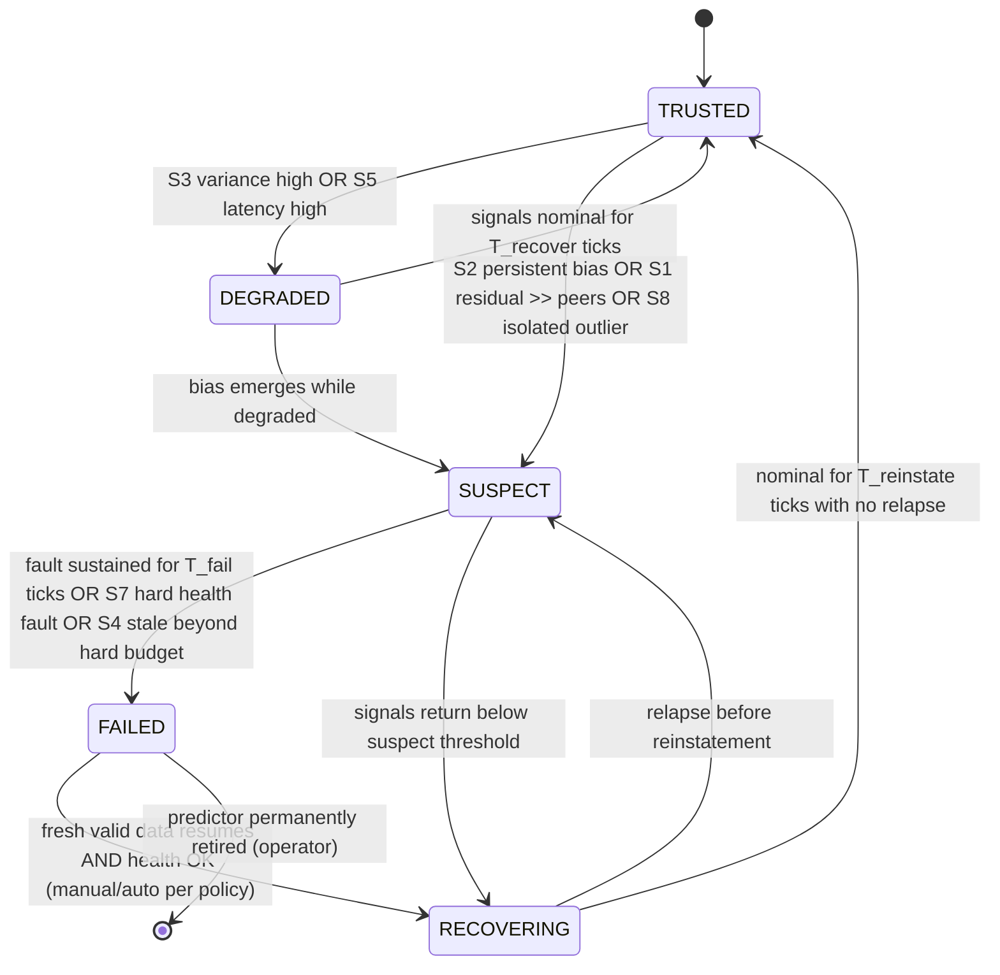

# ACP Predictor Reliability V2 (Task 4)

Predictor Reliability V2 (PR-V2) is **stage 5** of the Autonomous Control Plane.
It reduces `M` predictor streams to (a) a per-predictor **trust state**, (b) a
**trusted-consensus** trajectory the rest of the pipeline plans against, or (c) a
system-level **ABSTAIN** when no trusted quorum exists.

**Design stance:** built from deterministic estimation signals. BCVF-derived
disagreement is **one optional feature among several**, off by default, allowed
only to shorten detection latency. This is the measured `AUGMENT_PREDICTOR_TRUST`
outcome; the reference implementation is the deterministic detector already
validated in `robotics_reliability_bench/predictor_trust_baseline.py`
(recall 1.00, false-alarm 0.04, common-mode false-detection 0.00 vs BCVF's 0.90 /
0.67 / 0.86 — see `ROBOTICS_BCVF_INCREMENTAL_VALUE_RESULTS.md`).

---

## 1. Inputs / outputs

**Input** (per tick, from `WorldSnapshot`):
- `streams[M]`: each predictor's recent `(H,3)` SE(2) trajectory history.
- `health[M]`: sensor-health flags (from `safety/` + driver telemetry).
- `arrival_t[M]`, `valid_mask[M,H]`: freshness and per-tick validity.
- monotonic `clock`.

**Output** (`TrustReport`):
- `state[M] ∈ {TRUSTED, DEGRADED, SUSPECT, FAILED, RECOVERING}`.
- `consensus`: robust trajectory over the currently-TRUSTED set.
- `system ∈ {OK, DEGRADED, ABSTAIN}`.
- `explanation[M]`: the dispositive signal + value per predictor (Task 8).

## 2. Deterministic signals (no learned weights, no softmax)

Each signal is a bounded, physical quantity with a frozen threshold. All are
computed against a **robust consensus** (coordinate-wise median across
currently-trusted predictors) so a single outlier cannot define the reference.

| # | signal | definition | catches |
|---|---|---|---|
| S1 | **innovation residual** | ‖predictor − consensus‖ per tick (SE(2), lever-arm homogenised) | gross disagreement |
| S2 | **persistent bias** | windowed-mean residual significance (magnitude + z-test, sustained K ticks) | constant/linear/stuck/delayed bias — the classes BCVF is invariant to |
| S3 | **variance** | EWMA of standardized residual magnitude | noisy/degrading predictor (→ DEGRADED, not FAILED) |
| S4 | **freshness** | `clock − arrival_t` vs budget | stale/dropped predictor |
| S5 | **latency** | inter-arrival jitter vs budget | a predictor that is late but present |
| S6 | **dropout** | fraction of invalid ticks in window | intermittent sensor |
| S7 | **sensor health** | driver/BIST flags | hardware-reported fault |
| S8 | **cross-consistency** | agreement with the *other* trusted predictors | isolates the minority outlier |
| S9 *(optional)* | **BCVF 2nd-order disagreement** | acceleration-of-disagreement margin | *earlier* detection on accelerating/abrupt faults only |

**Why S2 is load-bearing.** The prior audit showed BCVF's headline invariance
protects a *harmful* class (constant position bias, linear drift) and is exact
only noiseless. S2 targets exactly that class directly and deterministically —
it is the reason PR-V2 detects `precise_biased` (which BCVF misses entirely) and
does not false-alarm on benign high-variance predictors.

**Channel separation (the key correctness property):** persistent **bias** (S2)
drives SUSPECT/FAILED; **variance** (S3) drives only DEGRADED. A noisy-but-
unbiased predictor is down-weighted, never excluded as a fault. This separation
is what gives the reference detector its ~0 false-alarm rate.

## 3. The state machine

### 3.1 State semantics

| state | meaning | consensus participation | escalation gate |
|---|---|---|---|
| `TRUSTED` | within noise of the trusted set | full weight | — |
| `DEGRADED` | noisy/late but unbiased | reduced weight | reversible on dwell |
| `SUSPECT` | persistent bias / isolated outlier detected | **excluded from consensus** | provisional (not yet failed) |
| `FAILED` | fault sustained, hard health fault, or hard-stale | excluded; counts toward quorum loss | latched; recovery gated |
| `RECOVERING` | data resumed, on probation | excluded until reinstated | requires clean dwell |

### 3.2 Transition rules (deterministic, frozen thresholds)

Rules are evaluated in a **fixed precedence** each tick; the first matching rule
fires (non-compensatory — a hard-health fault cannot be masked by a good
residual):

1. `S7 hard fault` OR `S4 age > hard_stale_budget` → **FAILED** (from any state).
2. `S2 persistent-bias sustained ≥ T_fail` OR `SUSPECT dwell ≥ T_fail` → **FAILED**.
3. `S2 persistent-bias` OR `S1 residual > r·peer_min` OR `S8 isolated` → **SUSPECT**.
4. `S3 variance ≥ degraded_z` OR `S5 latency > budget` → **DEGRADED**.
5. in `FAILED`/`RECOVERING`: fresh valid data + health OK → **RECOVERING**;
   clean dwell ≥ `T_reinstate` → **TRUSTED**; relapse → **SUSPECT**.
6. else → **TRUSTED**.

Thresholds are the frozen `TrustBaselineConfig` values
(`bias_window=12, bias_z=4.0, bias_min_m=0.20, bias_sustain=8, degraded_z=3.0,
stale_frac=0.3`) plus new dwell constants `T_fail, T_reinstate, T_recover`
(design defaults; to be pinned in a preregistration before any real-sensor
tuning, exactly as the prior milestone did).

## 4. System-level decision (quorum + ABSTAIN)

Never forces a winner. After per-predictor states are assigned:

- `trusted_set = {m : state[m] == TRUSTED}` (+ DEGRADED at reduced weight).
- If `|fresh predictors| < 2` → `ABSTAIN` (cannot cross-check).
- If `|SUSPECT ∪ FAILED| ≥ ⌈M/2⌉` → `ABSTAIN` (no trusted majority; correlated /
  common-mode guard — a single confident but wrong attribution is worse than an
  honest abstain).
- Else `consensus = robust_median(trusted_set)`; `system = OK` (or `DEGRADED` if
  any DEGRADED contributes).

`ABSTAIN` is a first-class output routed to the failure state machine
(`ACP_FAILURE_STATE_MACHINE.md`), which selects a safe posture — it is **not** a
silent fallback to a possibly-corrupt consensus.

## 5. The BCVF feature (optional, bounded)

S9 is the *only* place BCVF appears in ACP. Contract:

- **Off by default.** Enabled per deployment only after a real-sensor pilot shows
  a net latency benefit without a false-alarm regression.
- **Latency-only.** S9 may lower the tick at which an *already-agreed* SUSPECT
  transition fires (Fusion semantics from the prior milestone: delay 17→7 ticks).
- **No authority.** S9 may not move a predictor to TRUSTED, may not silence an
  S2/S7-driven SUSPECT/FAILED, may not affect the quorum/ABSTAIN logic.
- **Cost-bounded.** Computed on the same `(M,H)` window; `O(M·H)`; no extra state.

This is precisely the demoted role the evidence supports: a named internal
feature, not a decision-maker.

## 6. Complexity, runtime, failure modes

- **Complexity:** `O(M·H)` per tick (S1–S8), plus `O(M·H)` if S9 enabled. All
  bounded by fixed `M, H`.
- **Runtime:** no allocation on the hot path in the production port; the pure-
  Python reference is the validated behavioural spec, not the RT artifact.
- **Failure modes:**
  - all predictors fresh but agreeing-and-wrong (common-mode) → **undetectable
    here** → deficiency D1; requires the independent-reference hook (map/GNSS/
    kinematic sanity) feeding S8 as an extra "reference predictor."
  - 2-of-M correlated failure → `ABSTAIN` when it crosses the quorum threshold;
    below that it can mis-attribute (shared limitation of all disagreement
    methods; documented, not hidden).
  - threshold miscalibration → surfaced as either false-alarm (benign flagged) or
    miss (fault not flagged); both are measured by the frozen metric set before
    any deployment.

## 7. What PR-V2 deliberately drops from the old stack

- The BCVF kernel as the *primary* trust mechanism (demoted to S9).
- Softmin trust weighting, EMA-centered cost, deadband, and the V2 Schmitt
  chatter machine of `bcvf_autonomous/trust.py` — replaced by the explicit
  bias/variance/freshness state machine, which is simpler, directly targets the
  harmful fault classes, and is fully explainable per predictor.
