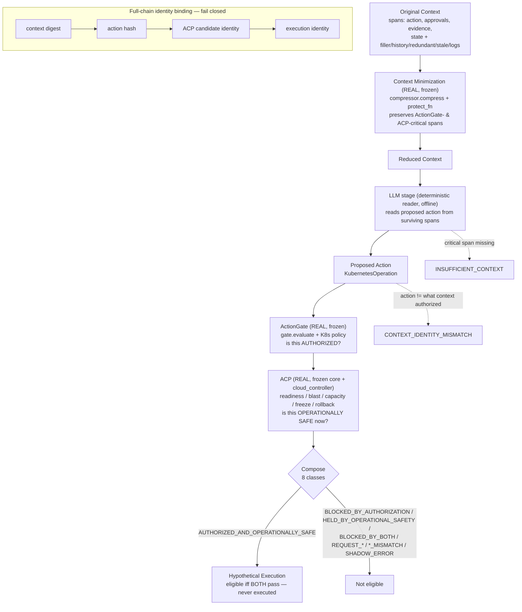
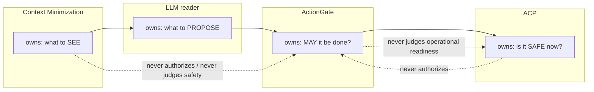

# AI Control Plane — Architecture Diagram (V2.2 §11.10)

The complete Ugence AI Control Plane: three frozen, independent layers on one
bound Kubernetes operation, shadow-only.

## Layer independence & ownership (disjoint)

## Key properties (measured)

- **Compression:** ~72 % avg token reduction; ActionGate- and ACP-critical spans
  preserved 100 %.
- **Downstream invariance under compression:** 100 % — compressed context yields
  the identical action, authorization, and operational verdict as the full context.
- **One bound identity** from context digest to hypothetical execution; fail-closed
  on any break.
- **Disjoint ownership:** 0 duplicated-logic, 0 ownership violations.
- **Shadow-only:** 0 cluster mutations, 0 authoritative behaviour changes, fully
  deterministic.

All layers are frozen and only invoked; nothing here modifies the Context
Minimization algorithm, the ActionGate runtime, or the ACP V1 core.
