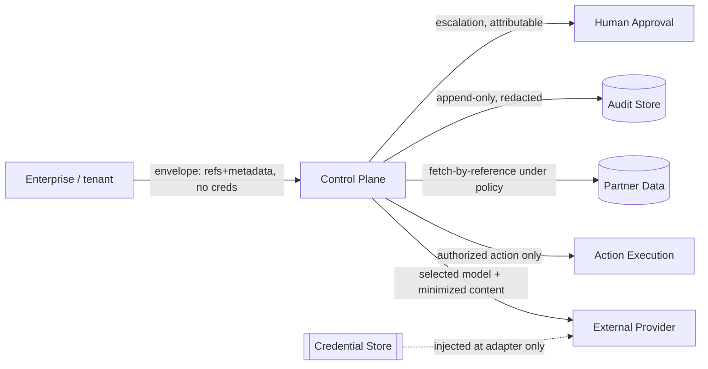

# Security and Trust Boundaries

*Phase 13. The trust boundaries the control plane crosses, what may cross each, and how.
Unresolved policy facts are marked **[UNRESOLVED]** — they are enterprise decisions, not
architectural defaults, and must not be silently assumed.*

## Boundaries

| Boundary | What may cross | Must NOT cross |
|---|---|---|
| Enterprise ↔ control plane | request envelope (references + metadata), pinned policy/registry versions | raw credentials, unrestricted payloads |
| Control plane ↔ external provider | selected model id, minimized content fetched by reference under policy | data for a provider not on the approved allowlist (invariant 16) |
| Control plane ↔ action execution | a single authorized action (disposition ALLOW), its scope, approval ref | any denied/escalated/approval-required action (invariant 7) |
| Control plane ↔ partner data | reference/hash + a policy-approved fetch | bulk duplication of partner data into the envelope or audit log |
| Control plane ↔ credential store | nothing outbound; credentials injected only at the provider adapter | credentials in the envelope, decision records, or telemetry |
| Control plane ↔ audit store | append-only redacted decision records | secrets, raw prompt/response, un-redacted confidential fields |
| Control plane ↔ human approval | attributable escalation with authority ref | anonymous or non-attributable overrides (invariant 8) |

## Controls per concern

- **Credential handling.** Credentials never enter the envelope (`REQUEST_ENVELOPE_SPEC.md`,
  class NP). They live only in the credential boundary and are injected at the provider
  adapter. `decisions.AuditLog` redacts any key matching `api_key|authorization|token|secret|
  password|bearer` before hashing/persisting.
- **Content minimization.** The envelope carries `content_ref` + `redaction_state`, not raw
  content. Raw prompt/response is never stored by default (`DECISION_RECORD_SPEC.md`). Adapters
  fetch content by reference only when policy permits.
- **Provider-specific data-flow approval.** A confidential/regulated request, or an
  irreversible task, requires an explicit approved provider allowlist; unknown → not approved
  (`POLICY.DATA_FLOW_NOT_APPROVED`, invariant 16). No new external data flow is created
  implicitly.
- **Logging restrictions.** Decision records hold references, states, and namespaced reason
  codes — never raw provider errors (only the provider adapter reads those, normalizing to
  `RUNTIME.*`, invariant 14) and never secrets.
- **Override authorization.** Human override requires an attributable `override_actor` plus a
  recorded `override_rationale`; missing either → `AUDIT.UNAUTHORIZED_OVERRIDE` (invariant 8).
- **Replay-data treatment.** Replay is read-only and uses only what the records already hold
  (references + pinned versions); it introduces no new content and emits no telemetry.
- **Evidence provenance.** Every eligibility decision cites evidence with source, timestamp,
  and TTL; stale evidence degrades to UNKNOWN and is re-probed, never treated as a pass.
- **Audit integrity.** Append-only hash chain; tampering breaks `verify_chain()`
  (`AUDIT.AUDIT_CHAIN_BROKEN`). In ENFORCEMENT, audit-write success gates execution
  (invariant 15).

## Unresolved policy facts

- **[UNRESOLVED]** Which providers are approved for which data classifications — enterprise
  policy input, not a control-plane default.
- **[UNRESOLVED]** Retention period and access model for the audit store.
- **[UNRESOLVED]** Whether `redaction_state: raw-permitted` is ever allowed, and under whose
  authority.
- **[UNRESOLVED]** Human-authority identity model (how `override_actor` / `human_authority_ref`
  map to real, attributable identities without storing PII).
- **[UNRESOLVED]** Cross-region audit replication and residency of the audit store itself.
