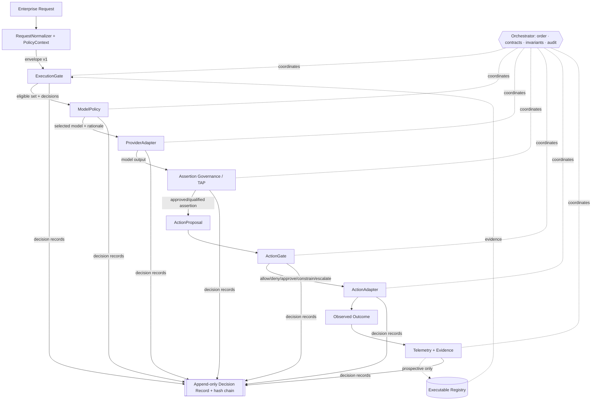
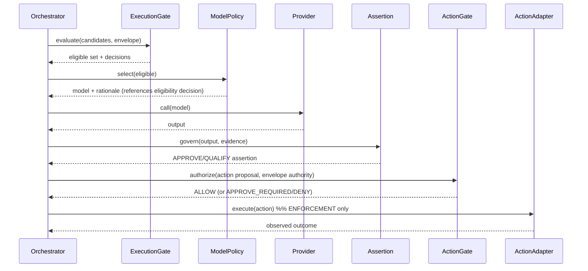
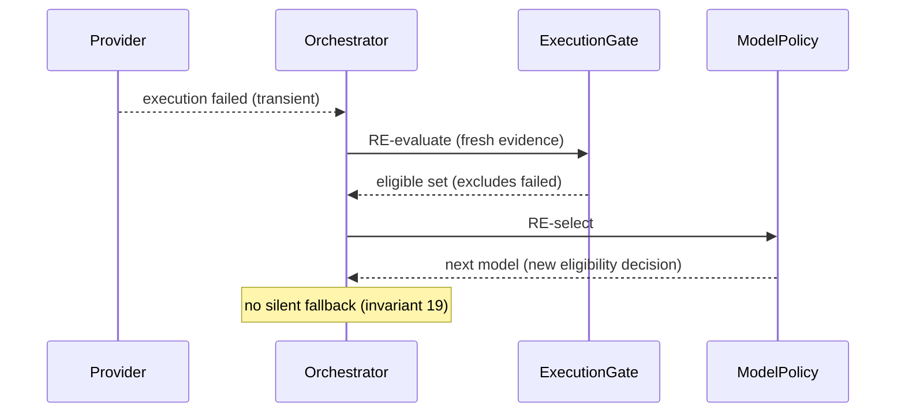
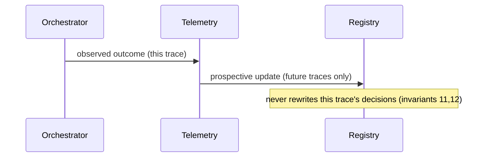
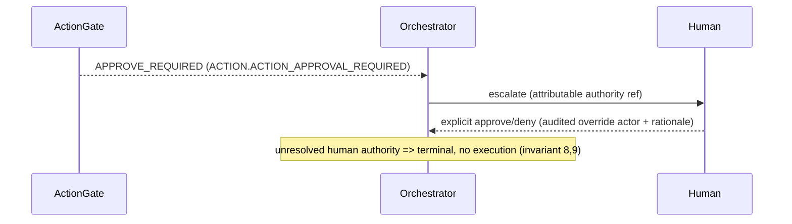

# Unified Enterprise AI Control Plane — System Architecture

*Phase 3. Canonical architecture. Distinguishes: what **can** execute · what **should** execute ·
what may be **asserted** · what may be **acted upon** · what actually **happened**.*

## 1. Purpose

Connect independently-validated governance/routing components through strict, versioned contracts
into one coherent, auditable control plane — without duplicating authority, creating circular
dependencies, conflating assertion vs action, or letting downstream components bypass upstream
exclusions.

## 2. Component boundaries (each owns one question)

| Layer | Component | Question |
|---|---|---|
| 1 Request/Policy | RequestNormalizer + PolicyContext | what is asked, under what policy? |
| 2 Execution eligibility | ExecutionGate | what **can** execute? |
| 3 Model selection | ModelPolicy | what **should** execute? |
| 4 Provider execution | ProviderAdapter | call the selected model |
| 5 Assertion governance | TAP (adapter) | what may be **asserted**? |
| 6 Action governance | ActionGate (adapter) | what may be **acted upon**? |
| 7 Action execution | ActionAdapter | execute an approved action |
| 8 Telemetry/evidence | Telemetry + Registry | what **happened** (prospective feedback) |

Orchestrator coordinates order + contracts + invariants + audit; it holds **no decision authority**.

## 3. Component architecture



## 4-7. Data / policy / evidence / telemetry flow

- **Data flow:** envelope carries *references + metadata*, not unrestricted payloads. Raw content stays
  behind the partner-data boundary; adapters fetch by reference under policy.
- **Policy flow:** `policy_context` (approved providers, residency, action policy, approval reqs,
  pinned policy/registry versions) is resolved once at layer 1 and pinned for the whole trace.
- **Evidence flow:** every decision cites evidence (source/timestamp/TTL); stale → UNKNOWN.
- **Telemetry feedback:** observations update the registry **prospectively only** (never rewrite a
  past decision; never affect the in-flight trace) → no circular dependency.

## 8. Trust boundaries

enterprise ↔ control-plane ↔ external-provider ↔ action-execution ↔ partner-data ↔ credential ↔
audit-store ↔ human-approval. See `SECURITY_AND_TRUST_BOUNDARIES.md`.

## 9. Sync vs async

- **Synchronous critical path:** normalize → EG → MP → provider → TAP → ActionGate → (action).
- **Asynchronous:** telemetry writes, registry updates, evidence refresh, non-blocking audit mirroring.

## 10. State ownership

PolicyContext owns policy/version pinning; Registry owns model records + verification; ExecutionGate/
ModelPolicy are pure (no persistent state); Audit owns the append-only chain; Telemetry owns
observations. No component writes another's state.

## 11-12. Failure & version boundaries

Each layer terminates a trace with a namespaced failure (Phase 7). Contract + policy + registry
versions are pinned per trace and mismatches fail closed (Phase 8).

## 13-14. Replay/shadow/enforcement positions

REPLAY/MOCK/SHADOW/ADVISORY are non-enforcing (no real provider calls, no action execution);
ENFORCEMENT (explicit config only) is the sole mode where ActionAdapter may execute. See
`EXECUTION_MODES.md`.

## 15-17. Human approval / provider / partner-data boundaries

Human approval points: assertion escalation, action approval-required, unauthorized-override refusal.
External-provider boundary at ProviderAdapter; partner-data boundary enforced by envelope references +
redaction; no new external data flow created implicitly (invariant 16).

## Required sequence diagrams

### Request lifecycle (happy path, action-producing)


### No-eligible-model path
```mermaid
sequenceDiagram
  Orchestrator->>ExecutionGate: evaluate
  ExecutionGate-->>Orchestrator: eligible set = {}
  Orchestrator->>Orchestrator: terminal EXEC.NO_ELIGIBLE_MODEL (fail-closed, audited)
  Note over Orchestrator: ModelPolicy NOT called; no provider call
```

### Model success but assertion rejected
```mermaid
sequenceDiagram
  Provider-->>Orchestrator: output (technically valid)
  Orchestrator->>Assertion: govern
  Assertion-->>Orchestrator: REJECT (ASSERT.ASSERTION_REJECTED)
  Orchestrator->>Orchestrator: terminal; no action proposed; audited
  Note over Orchestrator: technical success != permitted assertion (invariant 4)
```

### Assertion approved but action denied
```mermaid
sequenceDiagram
  Assertion-->>Orchestrator: APPROVE
  Orchestrator->>ActionGate: authorize
  ActionGate-->>Orchestrator: DENY (ACTION.ACTION_DENIED)
  Orchestrator->>Orchestrator: terminal; ActionAdapter NOT called
  Note over Orchestrator: assertion approval != action approval (invariant 5)
```

### Failure & fallback (fallback re-enters eligibility+policy)


### Telemetry feedback loop (prospective, non-circular)


### Human-approval path


### Assertion-only path (no action)
```mermaid
sequenceDiagram
  Assertion-->>Orchestrator: APPROVE/QUALIFY
  Orchestrator->>Orchestrator: deliver assertion; no ActionProposal; ActionGate skipped
```
