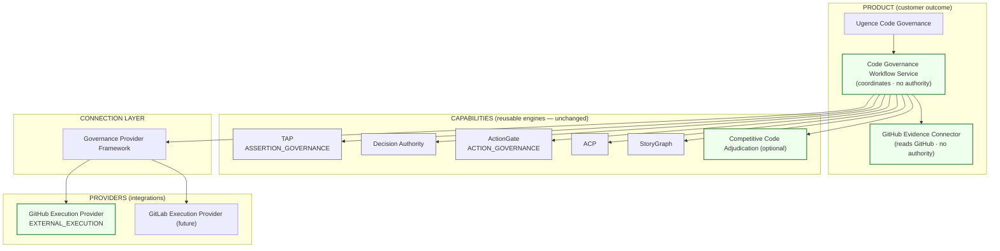
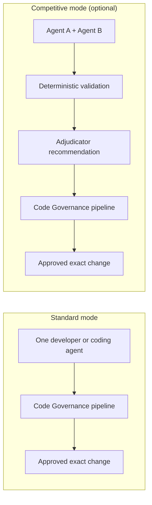
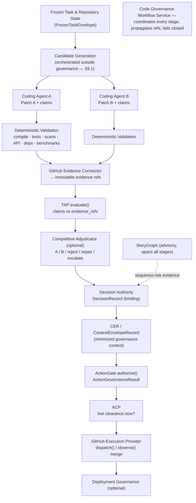
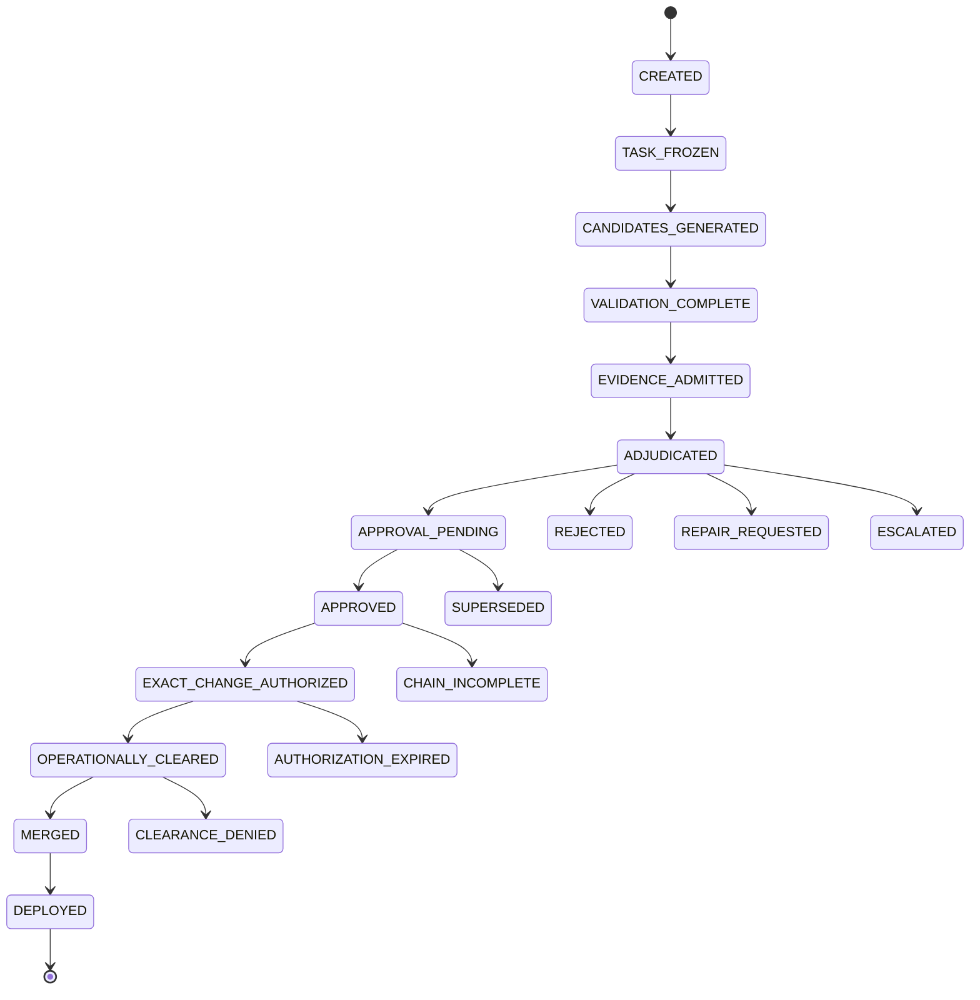

# Ugence Code Governance — Design Specification

**Status:** Draft design specification (**v0.2** — architecture correction) — for review.
**Scope:** product definition, architecture, contract mapping, phasing, and
recommended enhancements for a new customer-facing product that governs software
changes. **Documentation only** — no code, package, API, schema, or frozen artifact
is changed by this document.
**Canonical vocabulary:** this document follows
[`Project_documentation/repository/docs/architecture/ADR_UGENCE_DECISION_GOVERNANCE_TERMINOLOGY_AND_BOUNDARIES.md`](../../repository/docs/architecture/ADR_UGENCE_DECISION_GOVERNANCE_TERMINOLOGY_AND_BOUNDARIES.md)
and the
[`UGENCE_TERMINOLOGY_PRODUCT_CAPABILITY_BOUNDARY_AUDIT.md`](../../repository/architecture/UGENCE_TERMINOLOGY_PRODUCT_CAPABILITY_BOUNDARY_AUDIT.md).
**Competitive landscape & market positioning** (how Ugence differs from CodeRabbit,
Copilot, Snyk, GitHub Rulesets, Harness, etc., and which tools are evidence
producers rather than competitors) are intentionally **out of scope here** and live
in [`UGENCE_CODE_GOVERNANCE_COMPETITIVE_POSITIONING.md`](UGENCE_CODE_GOVERNANCE_COMPETITIVE_POSITIONING.md)
(with a one-page [`UGENCE_CODE_GOVERNANCE_BATTLECARD.md`](UGENCE_CODE_GOVERNANCE_BATTLECARD.md)).

> **One-line positioning.** *Ugence Code Governance governs AI-generated and
> human-written software changes from proposal through validation, approval,
> merge, and deployment — so an organization can let AI coding agents modify
> production software without letting the same agent write, validate, approve,
> and execute its own change.*

> **v0.2 architecture correction (what changed from v0.1).** v0.1 described GitHub
> as a single governance provider with three descriptors across the assertion,
> action, and execution families. That was wrong: those three `ProviderKind`s are
> **distinct, non-interchangeable capability families**, not generic integration
> roles — the assertion family *is* TAP and the action family *is* ActionGate. v0.2
> corrects the provider model (GitHub is an **evidence connector** + a product
> **mapping layer** + one **`EXTERNAL_EXECUTION` provider**; TAP and ActionGate keep
> their families), corrects the contract mapping (`evidence_refs`, `DecisionRecord`,
> CER/`ContextEnvelopeRecord`, `ActionGovernanceResult`), adds the **Code Governance
> Workflow Service**, strengthens **merge-artifact binding** (base/head/merge-method/
> merge-tree/merge-queue) and **governance-chain-proof-before-execution**, adds
> **competitive-adjudication integrity controls** and **P0 security controls**,
> corrects a persistence overstatement, refines **policy-conflict** handling, and
> restructures MVP 1 into **shadow → recommendation → enforced**. See §19 for the
> full change list. The next phase is a **Code Governance implementation-readiness
> audit**, not implementation.

---

## 0. How this fits the existing platform (read first)

This is **not a new platform**. It is a new **product** — a customer-facing
composition over capabilities that already exist in this repository — plus a small
amount of **new product-layer machinery** and one **optional** upstream capability.

Per the capability/product boundary already established in the terminology audit,
Ugence has one umbrella (**Ugence Decision Governance**), ten reusable
**capabilities**, and a small set of proposed **products** that compose those
capabilities over their public contracts (never new copies of the engines). The
audit proposes four products — **Assert, Decide, Act, Sequence**. This spec adds
a fifth:

| Product | Governs | Composes capabilities |
|---|---|---|
| Assert | what AI may claim | TAP, Context Minimization, LLM Steering |
| Decide | how recommendations become binding | Decision Authority, TAP |
| Act | what AI agents may execute | ActionGate, ACP, Agent Runtime |
| Sequence | risk across linked events | StoryGraph |
| **Code (this spec)** | **software changes → production** | **TAP · Decision Authority · ActionGate · ACP · StoryGraph**, over the **Governance Provider Framework**, with optional **Competitive Code Adjudication** |

**Code Governance invents no new authority.** It reuses the existing authority
boundaries verbatim: TAP admits evidence, Decision Authority binds the decision,
ActionGate authorizes the exact action, ACP clears it at execution time, StoryGraph
reports sequence risk. The only new *authorities* are none.

### The correct GitHub model (this is the central v0.2 correction)

The three framework provider families are **capability families**, not integration
roles. GitHub is therefore **not** three governance providers. It decomposes as:

```text
GitHub Evidence Connector           (product connector / adapter — NO authority)
    └── reads PR, commits, CI, reviews, scanners → immutable evidence refs
              ↓
TAP  (ASSERTION_GOVERNANCE provider) — evaluates claims against evidence
              ↓
Code Governance Workflow Service     (product component — NO authority)
    └── prepares the exact merge action (ActionGovernanceRequest)
              ↓
ActionGate  (ACTION_GOVERNANCE provider) — authorizes the prepared action
              ↓
GitHub Execution Provider            (EXTERNAL_EXECUTION provider)
    └── dispatches and observes the merge
```

So:

- **GitHub evidence ingestion** = a **product connector / adapter** (not an
  assertion-governance provider).
- **GitHub action construction** = a **product mapping layer** inside the Workflow
  Service (not an action-governance provider).
- **GitHub merge execution** = the one and only GitHub **`EXTERNAL_EXECUTION`**
  provider.
- **TAP** remains the **`ASSERTION_GOVERNANCE`** provider.
- **ActionGate** remains the **`ACTION_GOVERNANCE`** provider.

This requires **no new `ProviderKind`** and **avoids duplicating TAP and ActionGate**.

### What already exists that we build on

> **Canonical vs. legacy layout (important).** The real code now lives under
> `packages/`; the top-level directories (`governance_providers/`,
> `decision_governance/`, …) are **compatibility shims** that re-export the
> canonical packages (object identity preserved), scheduled for removal in a later
> major. New code imports the canonical package public surfaces (e.g.
> `ugence_governance_provider_framework.api`); the legacy paths still resolve.

| Building block | Canonical package (dist · version) | Public import | Reused for |
|---|---|---|---|
| Governance Provider Framework | `packages/governance-provider-framework/` (`ugence-governance-provider-framework` · 0.1.0, contract 1.0.0) — see [`docs/DGM_PROVIDER_FRAMEWORK.md`](../../../docs/DGM_PROVIDER_FRAMEWORK.md) | `ugence_governance_provider_framework.api` (legacy `governance_providers`) | registering + resolving the GitHub execution provider |
| Neutral provider contracts | `packages/governance-contracts/` (`ugence-governance-contracts`) | `ugence_governance_contracts` — `ProviderKind`, `AssertionGovernanceProvider`, `ActionGovernanceProvider`, `ExternalExecutionProvider` | the families TAP/ActionGate/GitHub-execution implement |
| Decision Authority (frozen kernel) | `packages/capabilities/decision-authority/` (`ugence-decision-authority` · 1.0.0, frozen API) | `ugence_decision_authority.api` (legacy `decision_governance.api`) | `DecisionRecord` + CER (`ContextEnvelopeRecord`) |
| TAP | `tap_provider/` (adapter) · `truth_assurance_pipeline/` (research, prototype) | `tap_provider` | claim → evidence admissibility (`ASSERTION_GOVERNANCE`) |
| ActionGate | `actiongate_provider/` (adapter) · `cyber_security/action_gate_reference/` | `actiongate_provider` | exact-action authorization (`ACTION_GOVERNANCE`) |
| ACP | `symbolu_robotics/autonomous_control_plane/` (shadow-only) · design in `acp/` | — | execution-time operational clearance |
| StoryGraph | `packages/capabilities/storygraph/` (`ugence-storygraph` · 2.0.0) | `ugence_storygraph` (incl. its own `policypack/` compiler) | control-erosion sequence risk |
| Policy compiler | [`POLICY_PACK_GOVERNED_WORKFLOW_COMPILER_SPEC.md`](../policy_pack/POLICY_PACK_GOVERNED_WORKFLOW_COMPILER_SPEC.md) | — | compiling repo policy packs into the pipeline |

**Maturity, stated honestly** (per [`UGENCE_PRODUCTIZATION_ROADMAP.md`](../../repository/ugence_platform/UGENCE_PRODUCTIZATION_ROADMAP.md) §1):
Decision Authority, ActionGate, and StoryGraph are reusable, frozen cores;
ActionGate/ACP are shadow-validated against fixtures; TAP is a partial prototype on
synthetic data. Code Governance must not overstate the readiness of what it composes.

### What is new in this spec

1. **GitHub Evidence Connector** — a product connector that reads PR / commit / CI /
   review / scanner state and turns it into **immutable, provenance-bound evidence
   references**. It holds **no governance authority**; it does not evaluate claims.
2. **Code Governance Workflow Service** — a narrow product component that coordinates
   the governed sequence (state, stage invocation, reference propagation,
   pause/resume, GitHub reconciliation, user-facing status). It **decides nothing**
   (§4A).
3. **GitHub Execution Provider** — the single GitHub `EXTERNAL_EXECUTION` provider
   (`dispatch`/`observe` the merge). No new provider family; stays inside
   `PLATFORM_FREEZE_V1`. A future GitLab/Gerrit execution provider slots in the same way.
4. **Competitive Code Adjudication** — an *optional* upstream capability
   (`packages/capabilities/competitive-adjudication/`, proposed) that compares two
   independently-generated validated candidates and emits a **recommendation**.

TAP, Decision Authority, ActionGate, ACP, and StoryGraph are **reused as-is** — this
spec adds nothing to their contracts.

---

## 1. Product / provider / capability separation



- **Product — Ugence Code Governance.** The complete customer outcome:
  code-change evidence, claims verification, approval authority, exact-change
  authorization, pre-merge / pre-deployment clearance, audit and reconstruction.
- **Product component — Code Governance Workflow Service.** Coordinates the governed
  sequence. **Owns no authority** (§4A).
- **Product connector — GitHub Evidence Connector.** Reads GitHub and produces
  evidence references. **Owns no authority.**
- **Provider — GitHub Execution Provider.** The `EXTERNAL_EXECUTION` provider that
  performs and observes the merge. A GitLab provider can be added later without
  changing the governance model.
- **Capability — Competitive Code Adjudication (optional).** The
  two-coding-agents-plus-adjudicator system. Optional upstream capability, **not**
  the whole product and **not** part of the Provider Framework.
- **Connection layer — Governance Provider Framework.** Registers, resolves,
  invokes, and reports readiness for providers. It does **not** approve code, select
  patches, or orchestrate candidates.

---

## 2. Should the two ideas be combined? Yes — as layered capabilities.

The core product governs **any** code change regardless of origin: one AI agent,
two competing agents, a human, an AI+human team, or an external coding platform.
Competitive adjudication is an **optional mode** for higher-risk changes.



Requiring two coding agents for **every** change would double or triple inference
cost, add latency, complicate simple fixes, produce more code to inspect, and
slow adoption. Competitive adjudication is therefore reserved (by policy scope)
for high-risk surfaces: authentication, authorization, payments, infrastructure,
security remediation, regulated software, database migrations, high-impact
production fixes, and architectural changes.

---

## 3. System architecture



In **standard mode** the two-candidate fan-out collapses to one candidate and the
adjudicator stage is skipped; everything downstream of TAP is identical. This is
what keeps the common path cheap. The **Workflow Service** (§4A) drives the sequence
but never substitutes its own judgment for any capability's.

---

## 4. Component responsibilities & authority boundaries

Authority boundaries are inherited unchanged from
[`UGENCE_TERMINOLOGY_PRODUCT_CAPABILITY_BOUNDARY_AUDIT.md`](../../repository/architecture/UGENCE_TERMINOLOGY_PRODUCT_CAPABILITY_BOUNDARY_AUDIT.md) §5.

### 4A. Code Governance Workflow Service (new product component — no authority)

MVP 1 still needs *something* to coordinate the governed sequence. That something is
a narrow product component, deliberately kept authority-free.

**Owns:** workflow state; stage invocation and ordering; reference propagation
between stages; pause/resume; GitHub reconciliation (branch/PR/check state);
user-facing workflow status; and **fail-closed enforcement of the governance chain**
(§4.7).

**Does NOT own:** claim judgment (TAP); approval authority (Decision Authority);
action authorization (ActionGate); operational clearance (ACP); patch-selection
authority (adjudicator); or execution permission (execution provider).

> **Workflow Service coordinates; governance capabilities decide within their own
> boundaries.** It is the analogue of the platform's Optional Orchestrator: it
> composes, it does not acquire authority from what it invokes.

### 4.1 TAP — claim verification (`ASSERTION_GOVERNANCE`)

TAP evaluates claims made by coding agents, developers, automated reviewers, and
the adjudicator. Example claims: *"all required tests passed"*, *"this patch fixes
the vulnerability"*, *"no public API changed"*, *"no production config modified"*,
*"the dependency upgrade has no known critical vulnerability"*, *"Patch A satisfies
the issue better than Patch B."*

TAP's output is **not** "safe to merge" — it is: *these claims are supported /
contradicted / incomplete / unsupported by the supplied evidence*, mapping onto the
existing `AssertionCoverage` = `SUPPORTED | UNSUPPORTED | INDETERMINATE |
CONSTRAINED`.

> **Contract mapping (corrected).** This is the `AssertionGovernanceProvider.evaluate`
> contract. Claims and their evidence are passed as
> **`AssertionGovernanceRequest.evidence_refs`** — a tuple of **immutable evidence
> identifiers**, *not* an `evidence` payload field (which does not exist). Large CI
> logs, scanner reports, and diffs stay **outside** the governance request; TAP
> receives references to them. The GitHub **Evidence Connector** stores the artifacts
> and produces the refs; **TAP** (not the connector) is the assertion-governance
> provider resolved for the repository.

```text
ValidationEvidenceBundle
        ↓ stored + provenance-bound (validator identity + tool version per item)
Immutable evidence identifiers
        ↓
AssertionGovernanceRequest.evidence_refs → TAP.evaluate() → AssertionGovernanceResult
```

### 4.2 Competitive Code Adjudication — candidate comparison (advisory)

The adjudicator compares **validated** candidates and returns one of:
`SELECT_PATCH_A`, `SELECT_PATCH_B`, `REJECT_BOTH`, `REQUEST_REPAIR`,
`ESCALATE_TO_HUMAN`. **It must not be forced to pick a winner.**

It evaluates requirement coverage, correctness/test/security evidence, API
compatibility, architectural consistency, unnecessary churn, performance effects,
maintainability, and unresolved risks. Its output is a **recommendation**.

The adjudicator **cannot**: approve a pull request; create a binding business
decision; waive hard-policy failures; override deterministic evidence (e.g. failing
tests); authorize a merge; invoke merge execution; authorize deployment; combine or
inherit any other authority; or become Decision Authority. Its only outputs are the
five recommendation outcomes above. This is enforced structurally: its output type
is a recommendation record with no reference to, and no path to producing, a
`DecisionRecord`, a CER, or an `ActionGovernanceResult`.

Integrity controls for the comparison itself are in §9.2.

### 4.3 Decision Authority — binding decision (`DecisionRecord` + CER)

Decision Authority decides whether the adjudicator's recommendation — **or** a
normal pull-request recommendation — may become the official, binding decision. It
evaluates approver authority, required reviewer roles, segregation of duties,
evidence completeness, required security/architecture approval, exception and
override handling, and repository-specific policy.

> **Contract mapping (corrected — no new record).** Decision Authority already owns
> the immutable binding record: **`DecisionRecord`** (`ugence_decision_authority`,
> `decisions/decision.py`). Do **not** invent a Code-Governance-specific
> `MergeDecisionRecord`. `DecisionRecord` deliberately carries no execution state; it
> records the authorized decider and the decision, referencing everything else:
>
> - `recommendation_refs` → selected candidate / adjudication recommendation
> - `assessment_refs` → TAP, CI, and security assessments
> - `policy_refs` → repository policies
> - `reason_codes`, `override_record_id`, `authority_type`, `outcome`,
>   `effective_status`, `supersedes_decision_id`
>
> The approved operation is conveyed through the existing **action request + CER**
> (`ContextEnvelopeRecord`, schema `cer.v1`, `actions/cer.py`) — a **minimized
> governance-context record, not an execution command** — carrying `decision_id`,
> `action_request_id`, `action_type`, `target_system`, authority / policy / decision
> contexts, `permitted_parameters`, `prohibited_parameters`, `required_controls`,
> `expires_at`, and `content_hash`.

> **A better statement of the flow:** *An authorized actor makes the merge decision.
> Decision Authority validates and records it using the existing `DecisionRecord`;
> the approved operation is conveyed through the existing action request and CER.*

> **Provider ≠ Decision Authority.** The GitHub Evidence Connector *supplies inputs*
> — repository identity, pull-request identity, commit SHA, reviews, branch state, CI
> evidence, merge-operation details — but it does **not** perform authority
> validation, evidence-completeness checks, segregation of duties, required-approval
> evaluation, exception/override handling, or the production of the binding record.
> Those remain Decision Authority's; the connector can neither manufacture nor widen
> that authority.

### 4.4 ActionGate — exact-change authorization (`ACTION_GOVERNANCE`)

ActionGate authorizes the **prepared merge action** (built by the Workflow Service as
an `ActionGovernanceRequest` and conveyed via the CER). Any material mutation of the
governed operation invalidates the authorization (see the binding set in §4.6). Maps
to `ActionGovernanceProvider.authorize` → `ActionGovernanceResult`
(`outcome ∈ AUTHORIZED | AUTHORIZED_WITH_CONSTRAINTS | DENIED | INDETERMINATE |
EXPIRED`, plus `constraints`, `obligations`, `expiry`, `authority_basis`,
`reason_codes`, `provider_trace_id`, `fingerprint`).

> **`ExactChangeAuthorization` is a product-level *concept*, not a new ActionGate
> contract (corrected).** The current `ActionGovernanceResult` does **not** emit an
> `ExactChangeAuthorization` object. Model it as a **product envelope** the Workflow
> Service composes and persists:
>
> ```text
> ExactChangeAuthorization (product envelope) =
>       CER (content_hash, expires_at)
>     + prepared ActionGovernanceRequest
>     + ActionGovernanceResult (outcome, constraints, obligations)
>     + result fingerprint
>     + expiry
> ```
>
> Only create a new ActionGate-owned contract if the **implementation-readiness
> audit** proves the existing types cannot safely represent the requirement.

### 4.5 ACP — live operational clearance

ACP checks conditions **immediately before** merge or deployment: is the head still
at the approved SHA and does the merge still produce the approved artifact (§4.6)?
are required CI jobs still green? has a scanner posted a new failure? is there an
active incident? is the environment in a change-freeze window? is the deployment
target correct? is the approved container digest unchanged? are required approvals
still active? has the authorization expired or already been consumed? ACP answers:
*even though this action was previously approved, is it operationally safe and valid
to perform now?*

> **`OperationalClearanceRecord` is conceptual (ACP-owned).** It denotes ACP's
> clearance result; the implementation-readiness audit maps it onto ACP's existing
> representation rather than defining a new contract here.

> **Cross-reference.** The neutral capability that performs this live operational
> clearance is specified in [`ACTION_CLEARANCE_V0_1_DESIGN_SPEC.md`](../action_clearance/ACTION_CLEARANCE_V0_1_DESIGN_SPEC.md)
> (namespace `ugence_action_clearance`; clear-only; consumes the GitHub exact-merge
> profile). Its full design lives under `docs/design/action_clearance/`; it is not
> duplicated here.

### 4.6 Bind the governed artifact, not just the source SHA — **P0**

The approved **source** SHA alone is insufficient, because the code that actually
lands can differ from what was reviewed when: the target branch advances; GitHub
creates a **merge commit**; **squash** merge is used; **rebase** merge is used; or a
**merge queue** produces a **merge-group** commit. The governed operation must bind
at least:

```text
repository identity
pull-request identity
source / head SHA
target / base SHA
merge method (merge | squash | rebase | merge-queue)
expected merge-tree or merge-group SHA
required-check set
policy version
decision reference (DecisionRecord id)
authorization expiry
```

For GitHub **merge queues**, authorize the *queue entry*, then clear the *exact
merge-group artifact* the queue produces:

```text
Authorize queue entry
        ↓
GitHub creates merge-group SHA
        ↓
Validate the merge group (re-run required checks against it)
        ↓
ACP clears that exact merge-group artifact
        ↓
Merge
```

These fields populate the CER `permitted_parameters` / `required_controls` and the
product `ExactChangeAuthorization` envelope; ACP re-verifies them at clearance time.

### 4.7 Execution must prove the governance chain — **P0**

The neutral execution request (`ExecutionDispatchRequest`) carries operation
parameters, idempotency, and correlation data, but does **not inherently** require a
Decision Authority reference, CER hash, ActionGate result, or ACP clearance. The
**Workflow Service therefore fails closed** unless, at dispatch time, it can
reconstruct the full chain:

```text
DecisionRecord
  → CER content_hash
    → ActionGovernanceRequest
      → ActionGovernanceResult fingerprint (AUTHORIZED / AUTHORIZED_WITH_CONSTRAINTS)
        → ACP clearance reference (cleared, unexpired, unconsumed)
          → ExecutionDispatchRequest  (GitHub Execution Provider)
```

Any missing or mismatched link → **no dispatch**; the workflow moves to a terminal
non-executed state and records why.

### 4.8 StoryGraph — sequence-risk evidence (advisory)

StoryGraph evaluates sequences whose individual steps look acceptable but
collectively form a dangerous pattern — e.g. *modify CI config → disable security
test → alter authentication logic → reduce reviewer requirement → merge to main →
deploy to production.* It reports the observed sequence, the policy-relevant
pattern, the contributing events, the missing legitimate explanation, and the
recommended escalation. **It does not infer malicious intent.** For Code
Governance we ship a dedicated **control-erosion pattern pack** (§16.3).

---

## 5. Authority hierarchy (must be preserved)

```text
Hard policy constraints
        ↓
Deterministic validation evidence
        ↓
TAP evidence admission
        ↓
Adjudicator recommendation        (advisory)
        ↓
Decision Authority approval       (binding — DecisionRecord)
        ↓
ActionGate exact-action authorization  (ActionGovernanceResult, bound via CER)
        ↓
ACP live clearance
        ↓
Execution (merge / deploy)        (GitHub Execution Provider; chain proven — §4.7)
```

A preferred adjudicator output must **never** override any of: failing mandatory
tests, security-policy failures, unavailable required evidence, invalid or missing
reviewers, segregation-of-duties violations, prohibited dependencies, a changed
source/target/merge-artifact SHA, an expired authorization, deployment-freeze
windows, active blocking incidents, or jurisdiction/regulatory restrictions. This is
enforced structurally — the adjudicator's output type is a recommendation object
with no path to an authorization; the pipeline requires a `DecisionRecord` from
Decision Authority before ActionGate will authorize; ACP re-checks the live
conditions immediately before execution; and the Workflow Service refuses to dispatch
unless the whole chain (§4.7) reconstructs.

---

## 6. Core data objects

These are **design concepts**. This phase adds **nothing** to
`ugence_governance_contracts` or any capability contract and defines no new frozen
types. Several concepts map directly onto **existing authoritative types** — those
are reused, not duplicated.

**New concepts (Competitive Adjudication / product layer):**

- **FrozenTaskEnvelope** — the exact problem both agents must solve (identical for A
  and B): `task_id · issue_id · repository · base_commit_sha · target_branch ·
  requirements · allowed_files · prohibited_changes · architecture_constraints ·
  required_tests · security_policy · evaluation_policy_version`.
- **PatchCandidate** — `candidate_id · producer_identity · model_and_version ·
  base_commit_sha · patch_commit_sha · changed_files · diff_digest · agent_claims ·
  generated_tests · generation_timestamp · tooling_environment · independence_profile`
  (§9.2).
- **ValidationEvidenceBundle** — `candidate_id · compile_result · unit_test_results ·
  integration_test_results · security_scan_results · dependency_scan_results ·
  api_compatibility_result · benchmark_results · policy_check_results ·
  changed_file_manifest · **evidence_refs** · validation_timestamp`. Stored by the
  Evidence Connector; its **`evidence_refs`** (immutable ids) are what flow into
  `AssertionGovernanceRequest.evidence_refs` — the bundle itself stays out of the
  governance request.
- **AdjudicationRecommendation** — `adjudication_id · candidate_ids · recommendation
  · requirement_comparison · evidence_refs · residual_risks · rejected_claims ·
  confidence · escalation_reason · adjudicator_identity · adjudicator_model_version`.
  Every material conclusion references evidence identifiers.
- **ExactChangeAuthorization** — a **product envelope** (§4.4), not a new ActionGate
  type: `CER (content_hash, expires_at) + ActionGovernanceRequest +
  ActionGovernanceResult + result fingerprint + expiry` plus the merge-artifact
  binding set (§4.6).

**Reused existing authoritative types (do not duplicate):**

| Concept | Existing type it binds to | Package |
|---|---|---|
| Binding merge decision | **`DecisionRecord`** | `ugence_decision_authority` `decisions/decision.py` |
| Governed operation context | **`ContextEnvelopeRecord`** (CER, `cer.v1`) | `ugence_decision_authority` `actions/cer.py` |
| Action authorization outcome | **`ActionGovernanceResult`** | `ugence_governance_contracts` `contracts/action.py` |
| Claim evaluation outcome | **`AssertionGovernanceResult`** | `ugence_governance_contracts` `contracts/assertion.py` |
| Merge dispatch / observation | **`ExecutionDispatchResult` / `ExecutionObservation`** | `ugence_governance_contracts` `contracts/execution.py` |
| Operational clearance | ACP's existing clearance representation (`OperationalClearanceRecord`, conceptual) | ACP |

> **Ownership rule.** The implementation-readiness audit must map each conceptual
> record onto an existing repository type **before** any new contract is introduced.
> Where a capability already owns a frozen authoritative type, the concept binds to
> it rather than spawning a duplicate.

> **Persistence (corrected — no overstatement).** Records **will be persisted through
> the planned shared durable audit service**; a production-ready, tamper-evident,
> hash-chained store is a roadmap item (see
> [`UGENCE_PRODUCTIZATION_ROADMAP.md`](../../repository/ugence_platform/UGENCE_PRODUCTIZATION_ROADMAP.md) §3), **not**
> something this document claims is available today. The implementation-readiness
> audit must verify the actual available persistence surface. Note that the CER
> already carries a `content_hash` field usable for chain reconstruction.

---

## 7. State machine



Alternative terminal states: `REJECTED · REPAIR_REQUESTED · ESCALATED ·
AUTHORIZATION_EXPIRED · CLEARANCE_DENIED · CHAIN_INCOMPLETE · SUPERSEDED`.
`CHAIN_INCOMPLETE` is the fail-closed terminal for a broken governance chain (§4.7).

**Re-entry rule.** Any modification to the selected patch after validation returns
the workflow to `CANDIDATES_GENERATED` (if it creates a new candidate) or
`VALIDATION_COMPLETE` (if it only re-runs validation on the same candidate). In
standard mode the state graph is identical with `ADJUDICATED` passed through
trivially (single candidate → recommendation is a no-op selection).

---

## 8. Combining two patches

The adjudicator must **not** splice Patch A and Patch B and approve the result. A
combined patch is a **new candidate**:

```text
Patch A + Patch B insights → Agent produces Patch C → new commit SHA →
compile & tests rerun → security & policy checks rerun → new adjudication or review
→ Decision Authority
```

This prevents unvalidated synthesis from bypassing the evidence process, and it is
enforced by the re-entry rule in §7: Patch C has a different `patch_commit_sha` and
`diff_digest`, so it cannot inherit A's or B's evidence refs.

---

## 9. Independence requirements

Competitive generation only works when independence is preserved:

- Agents A and B receive the **same** `FrozenTaskEnvelope`.
- Neither sees the other's hidden reasoning.
- Neither modifies the shared working tree directly; each works in an **isolated
  branch or git worktree**.
- Candidate identifiers and evidence refs remain separate.
- Different models or prompting strategies may be used (**model diversity is
  preferred for high-risk changes** — two instances of the same model share a
  failure mode).
- The adjudicator did **not** generate either candidate.
- The adjudicator receives **structured evidence**, not persuasive narratives
  alone (anti-gaming — see §16.1).
- The adjudicator cannot execute the merge.
- The same model instance must not write, adjudicate, approve, **and** merge.

### 9.1 Candidate-generation orchestration ownership (explicit design decision)

**Candidate-generation orchestration** — producing (or soliciting) one or more
candidate patches from a `FrozenTaskEnvelope`, in isolated worktrees, and handing the
validated results downstream — is **deliberately not owned by any governance
component.** It must **not** be hidden inside the Governance Provider Framework, and
it is **not** owned by Decision Authority, ActionGate, TAP, ACP, StoryGraph, the
GitHub Execution Provider, or the GitHub Evidence Connector. Folding orchestration
into any of these would collapse the write/validate/approve/execute separation the
product exists to enforce.

The **Code Governance Workflow Service** (§4A) *coordinates* the sequence but does
**not** generate candidates and holds no authority. Plausible **future** owners of
generation (none implemented in this phase; the choice is left open on purpose):

- **Agent Runtime** — the platform's digital execution runtime, the most natural home
  for supervised, worktree-isolated candidate generation.
- **Optional Orchestrator** — the bypassable workflow composer in the AI Control Plane.
- **A dedicated competitive-development workflow service** — a new, explicitly optional
  component.
- **An external coding-agent platform** — Ugence governs candidates produced entirely
  outside it (the MVP-1 posture: observe candidates arriving as branches/PRs).

Whichever owner is chosen, the governance authorities must remain **separately
invocable and independently authoritative**. In MVP 1 there is no generation
orchestration at all: a human or a single external agent produces one PR and Ugence
governs it.

### 9.2 Competitive adjudication integrity controls

- **Blind comparison.** Present Candidate X and Candidate Y **without model
  identity**; the producer's model/vendor is withheld from the adjudicator's judging
  input.
- **Order-bias testing.** Occasionally repeat adjudication with candidate order
  reversed and compare; divergence flags order bias and escalates.
- **Evidence-tier separation.** Candidate-**generated** tests **cannot alone** satisfy
  mandatory validation — mandatory checks come from the repository policy pack and
  independent validators.
- **Ambiguity escalation.** Unclear acceptance criteria produce
  `ESCALATE_TO_HUMAN`, never a guessed winner.
- **Independence profile.** Record model family, provider, prompt strategy,
  toolchain, and any shared context per candidate (`PatchCandidate.independence_profile`).
- **No direct synthesis.** A combined Patch C is a **new candidate** requiring
  complete validation (§8).

---

## 10. Policy model

Repository policy packs are authored, versioned, and published through the existing
policy service and compiled by the
[`POLICY_PACK_GOVERNED_WORKFLOW_COMPILER_SPEC.md`](../policy_pack/POLICY_PACK_GOVERNED_WORKFLOW_COMPILER_SPEC.md)
so that a policy deterministically configures which pipeline stages run, which
evidence is mandatory, and who may approve. Example:

```yaml
policy_id: auth-change-policy-v1
scope:
  paths: ["auth/**", "security/**"]
candidate_generation:
  competitive_mode_required: true
  minimum_candidates: 2
  independent_worktrees: true
required_evidence:
  unit_tests: pass
  integration_tests: pass
  secret_scan: pass
  dependency_scan: pass
  static_security_analysis: pass
  api_compatibility: pass_or_approved_exception
approval:
  minimum_human_approvals: 2
  required_roles: [code_owner, security_reviewer]
  author_may_finally_approve: false
  ai_may_approve: false
merge:
  approved_sha_must_match: true
  bind_merge_artifact: true        # base/head/merge-method/merge-tree (§4.6)
  authorization_single_use: true
  authorization_ttl_minutes: 30
deployment:
  separate_authorization_required: true
  block_during_change_freeze: true
  block_during_severity_one_incident: true
```

### 10.1 Policy conflict resolution

"Most restrictive wins" is **not** sufficient for every combination — two policies can
conflict without one being strictly more restrictive. Resolution is:

- **Compatible constraints → deterministic intersection.** Combine into the strictest
  compatible set.
- **Direct conflict (no strict ordering) → `POLICY_CONFLICT`.** Do not silently pick
  one.
- **Missing resolution rule → fail closed and escalate.** Never fail open.

Trusted policy is **always loaded from the approved base branch, never from the
candidate branch** (§16.1). Policy version is recorded in every `DecisionRecord`
(`policy_refs`).

---

## 11. GitHub integration components

GitHub is integrated as **three product/provider pieces**, none of which holds
governance authority beyond the single execution provider's dispatch role.

| Piece | Layer | Contract / role | Code-governance meaning |
|---|---|---|---|
| **GitHub Evidence Connector** | product connector | none (produces evidence refs) | ingest PR body, CI checks, scanner results, changed-file manifest, code-owner reviews; extract structured claims; store artifacts; emit **immutable evidence refs** for TAP |
| **Action mapping layer** | product (in Workflow Service) | builds `ActionGovernanceRequest` | prepare the exact `{repo, PR, head SHA, base SHA, merge method, merge-tree/merge-group, required checks}` operation for ActionGate |
| **GitHub Execution Provider** | `EXTERNAL_EXECUTION` provider | `dispatch()` / `observe()` | perform the merge via GitHub API; `observe` distinguishes transport-ack from merge business outcome (`ExecutionBusinessOutcome`) |

> **Design constraint — stay within the platform freeze.** The framework's three
> families (`ASSERTION_GOVERNANCE` · `ACTION_GOVERNANCE` · `EXTERNAL_EXECUTION`) are
> capability families; the assertion family is TAP and the action family is
> ActionGate. GitHub adds **only** one `EXTERNAL_EXECUTION` provider. Introducing a
> new family would be a MAJOR change against `platform/PLATFORM_FREEZE_V1.json`; this
> design needs none.

> **Implementation pattern — model the execution provider on `actiongate_provider/`.**
> That package is the worked reference for wrapping a native engine as a framework
> provider: a pure, offline `core` importing **neither** the kernel **nor** the
> framework; a thin `provider.py` adapter subclassing `BaseProvider`, building its own
> `ProviderDescriptor` (zero-arg `factory`, `features` frozenset, `vendor`,
> `default`); an `errors/translate_error` boundary; a versioned `mapping/`; and a
> `conformance/` suite against the execution-family conformance kit. The Evidence
> Connector and action mapping layer are **product code**, not framework providers.

Key behaviors:

- **Ingestion (Evidence Connector).** GitHub App installation; webhook + polling
  ingestion of PRs and commit SHAs; CI and security-check status; branch-protection
  state; reviews and code-owner approvals. Every evidence item is bound to the
  **validator identity + tool version** that produced it.
- **Claim extraction.** Parse **signed structured claim manifests** where available;
  PR prose is treated as **untrusted** (§16.1) and never as instructions.
- **Exact-artifact fidelity.** The Workflow Service presents the bound merge-artifact
  set (§4.6) to ActionGate; ACP re-verifies it (including merge-group for queues) at
  clearance time to catch a race.
- **Merge execution.** Only after `EXACT_CHANGE_AUTHORIZED` + `OPERATIONALLY_CLEARED`
  **and** a reconstructable governance chain (§4.7); single-use; authorization
  consumed atomically.
- **Failure normalization.** Provider exceptions normalize to fail-safe
  `INDETERMINATE`/`UNKNOWN` at the adapter boundary (framework invariant) — a GitHub
  outage never produces a spurious "authorized."

A **GitLab / Bitbucket / Gerrit** integration mirrors this shape: a provider-specific
evidence connector + one `EXTERNAL_EXECUTION` provider; TAP and ActionGate are
unchanged.

---

## 12. Product modes

- **Standard Governance Mode** (normal development): one patch → validation →
  approval → exact-change authorization → merge.
- **Competitive Validation Mode** (high-risk): two independent patches →
  deterministic comparison → adjudication → approval → exact-change authorization →
  merge.
- **Emergency Repair Mode** (incidents): one or more rapid patches → minimum
  mandatory evidence → emergency authority → short-lived exact authorization →
  monitored deployment → **mandatory post-event review**. Emergency mode is an
  explicit policy path, **not a bypass** (§16.6).
- **Shadow Mode** (rollout): the full pipeline runs and records decisions but never
  blocks or merges — for calibration before enforcement (§16.10). This mirrors the
  platform's shadow → recommendation → enforcement deployment ladder.

---

## 13. MVP phasing

Do **not** begin with autonomous merge execution. MVP 1 is delivered in three
enforcement rungs so trust is earned before any credential can merge.

**MVP 1A — Shadow mode.** GitHub App install; PR + commit-SHA ingestion via the
Evidence Connector; CI/security evidence collection; claim extraction; TAP claim
verification; repository approval policy; **simulate** Decision Authority decisions.
**No blocking, no merging.** Produces the calibration corpus (false-block/escalation/
override rates).

**MVP 1B — Recommendation mode.** Publish GitHub checks and recommendations (check-run
+ summary) while humans continue to use the existing merge path. Still no Ugence-driven
merge.

**MVP 1C — Enforced merge authorization.** Enable exact base/head/merge-tree (and
merge-group) binding (§4.6), Decision Authority (`DecisionRecord`), ActionGate
(`ActionGovernanceResult` + CER), ACP live clearance, governance-chain proof (§4.7),
and controlled execution via the GitHub Execution Provider. Immutable evidence +
decision trail. **Works with a single candidate** — competitive adjudication does not
block MVP 1.

**MVP 2 — Competitive Code Adjudication.** Frozen task envelopes; isolated agent
worktrees; two independent candidates; standardized validation harness;
evidence-grounded adjudicator with the §9.2 integrity controls;
select/reject/repair/escalate; new-candidate handling for combined solutions;
adjudication records linked to `DecisionRecord`. **Added only after the basic governed
merge path is measured and stable.**

**MVP 3 — Deployment Governance.** Signed build provenance; artifact-digest binding;
environment authorization; production freeze + incident checks; Kubernetes/cloud
deploy connectors (reuse the ACP + ActionGate Kubernetes surface — see
[`UGENCE_PRODUCTIZATION_ROADMAP.md`](../../repository/ugence_platform/UGENCE_PRODUCTIZATION_ROADMAP.md)); rollback
governance; post-deployment evidence.

Later-MVP features **do not silently become MVP-1 dependencies**: competitive
generation, build provenance/digest binding, and deploy connectors are all out of MVP 1.

---

## 14. Commercial differentiation

Most coding products optimize *generate more code faster*. Ugence Code Governance
optimizes *decide which change is trustworthy, establish who may approve it, and
ensure only the exact approved artifact reaches production.* The pieces reinforce
each other: governance provides control/authority/execution fidelity; competitive
adjudication improves candidate quality and surfaces disagreement; deterministic
validation stops the adjudicator substituting opinion for evidence; exact-artifact
binding stops post-review mutation; sequence analysis catches multi-step control
erosion. The moat accumulates through repository policy packs, security-sensitive
change taxonomies, approval-pattern libraries, CI evidence mappings, adjudication
benchmarks, legitimate-exception corpora, false-positive reduction, historical
patch/incident/rollback outcomes, and regulated-software control mappings.

---

## 15. Naming

- **Product:** Ugence Code Governance.
- **Initial integration:** GitHub Evidence Connector + GitHub Execution Provider.
- **Coordination:** Code Governance Workflow Service.
- **Optional advanced capability:** Ugence Competitive Code Adjudication.
- **Internal workflow name:** Governed Competitive Development Pipeline.

### 15.1 Positioning statements & claim discipline

**Product:** *Ugence Code Governance governs AI-generated and human-written software
changes from proposal through evidence validation, authorized approval, exact-change
merge authorization, and safe deployment.*

**Competitive mode:** *Competitive Code Adjudication independently generates or
receives multiple candidate patches, validates them through deterministic evidence,
and produces a non-binding recommendation for governed approval.*

**Claim discipline.** Ugence does **not** claim to prove code universally correct.
What it establishes about an approved change is that it is: **evidence-supported ·
policy-compliant · approved under declared controls · bound to the exact reviewed
artifact · reconstructable · operationally cleared.** Marketing and documentation
must stay within these claims.

---

## 16. Recommended additional enhancements

Proposed *additions* beyond the base definition. Each is scoped for independent
adoption; priority is the author's recommendation.

### 16.1 Anti-gaming & security controls — **P0 (mandatory design constraints)**

Not optional niceties — without them an AI can defeat its own governance, or a
compromised token can merge. AI-authored PRs and their descriptions are untrusted
input.

*Adjudication / evidence integrity:*
- **Untrusted content.** PR prose, comments, commit messages, and source-code text
  are treated as **untrusted content**, never as instructions.
- **Prompt-injection isolation.** The adjudicator and TAP consume *structured
  evidence records*; untrusted text is data with explicit provenance, never part of
  the judging instruction.
- **Test-tampering detection.** Flag candidates that *weaken or delete
  tests/assertions* to pass a claim (coverage/assertion/mutation-score deltas on
  touched code) — a contradiction TAP must catch, not admit.
- **Same-candidate policy-tampering detection.** Detect a candidate modifying CI,
  security-scan, or governance/branch-protection config **within the same change**
  (feeds StoryGraph, §16.3).
- **No self-governing candidates.** Effective policy is resolved from the repository
  policy pack on the **approved base branch**, never from files the candidate
  introduces or edits.
- **Evidence provenance binding.** Every evidence ref is bound to the **validator
  identity + tool version** that produced it; the adjudicator cannot cite evidence no
  admitted validator emitted.

*GitHub / platform security (elevated to P0):*
- **Webhook-signature verification** on every inbound GitHub event.
- **Least-privilege GitHub App installation tokens**, scoped per operation.
- **Repository and organization allowlists.**
- **No merge or production credentials inside coding-agent environments.**
- **Trusted policy from the base branch**, not the candidate branch (restated for
  emphasis).
- **Source-code privacy & residency policy** enforced **before** any external-model
  adjudication.
- **Signed structured claim manifests** rather than reliance on PR prose.
- **Merge-base freshness & merge-group validation** (§4.6).

### 16.2 Supply-chain provenance & attestation — **P0 (required before production deployment governance)**

Bind the approved artifact to verifiable provenance, not just a SHA string. Adopt as
a **progression**, so the pull-request MVP is not blocked on build infrastructure
that does not exist yet:

```text
Pull-request MVP:      exact commit-SHA + merge-artifact + admitted-evidence binding   (available now)
Production deployment: signed build provenance + artifact-digest binding               (MVP 3)
```

- **MVP 1 (now).** Exact commit/merge-artifact SHA binding plus admitted evidence is
  sufficient and is what ships first.
- **Signed commits / verified authorship** required by policy for high-risk paths.
- **Build provenance and image-digest binding (MVP 3).** Container image digest +
  signature, carried in the ACP deployment clearance so ACP clears the *exact* built
  artifact, closing the source→build→deploy gap. Frameworks such as **in-toto / SLSA /
  cosign are candidate mechanisms, not existing implementations** — none is
  implemented in this repository today, and this document does not claim otherwise.
- **SBOM diff as first-class evidence.** Dependency changes attach an SBOM delta +
  vulnerability-feed lookup, feeding the `dependency_scan_results` claim.

### 16.3 StoryGraph "control-erosion" pattern pack for code — **P1**

Ship a Code-Governance-specific StoryGraph pattern pack that detects governance
weakening across a PR series: CI-config edits that disable checks, branch-protection
downgrades, reviewer-requirement reductions, security-test deletions, self-approval
attempts, and policy-file edits by the same actor who benefits. Output remains
advisory sequence-risk evidence into Decision Authority; it never blocks on its own.

### 16.4 Incremental / delta re-validation — **P1**

Cache validation results keyed by `diff_digest` + toolchain fingerprint and re-run
only the affected subset, with a policy-set floor of always-run checks (secret scan,
security policy). This attacks the main cost/latency objection to competitive mode
(re-running the full harness on every new candidate, especially Patch C).

### 16.5 Governance cost & routing budget — **P1**

Add a per-repository / per-change **governance budget** and let the **Model
Selection** capability route candidate-generation and adjudication models within
policy (cheaper models for routine paths, model-diverse frontier models for
auth/payments). Record spend; surface cost-per-governed-change as a product metric.

### 16.6 Break-glass with auto-expiry & mandatory retrospective — **P1**

Emergency Repair Mode grants time-boxed elevated authority that **auto-expires**,
requires a named human sponsor, records a reduced-evidence justification, and opens a
**mandatory post-event review** that must close before the actor may use break-glass
again. Never a silent bypass; every waiver is an explicit, audited override
(`override_record_id` on the `DecisionRecord`).

### 16.7 Flaky-test & non-determinism handling — **P2**

Track per-test historical flake rate; require N-of-M reruns for flaky tests; represent
"passed after retry" honestly in evidence so TAP does not admit an over-strong claim
and the adjudicator can prefer the more deterministic candidate.

### 16.8 Human review UX & unified console integration — **P1**

Approvers need one place to see: the candidate diff(s), the side-by-side
`requirement_comparison`, admitted vs. contradicted claims, residual risks, and the
exact artifact they are authorizing. Integrate with the planned unified console
([`Project_documentation/control_plane/ACP/UGENCE_UNIFIED_CONSOLE_PLAN.md`](../../control_plane/ACP/UGENCE_UNIFIED_CONSOLE_PLAN.md)); render
the decision inline on the GitHub PR (check-run + summary) so reviewers stay in their
workflow. Segregation-of-duties (author ≠ final approver) is enforced in the UI, not
just the record.

### 16.9 Regulatory control mapping pack — **P2 (moat)**

Map evidence and approval records to change-management controls in SOC 2, ISO 27001,
PCI-DSS, and SOX (segregation of duties, change authorization, audit trail). The
`DecisionRecord` already carries decider, recommendation/assessment/policy refs, and
reason codes — expose a **compliance reconstruction report** auditors can consume
directly.

### 16.10 Shadow-mode calibration & outcome feedback loop — **P1**

Run the whole pipeline in shadow (record, don't block) to measure **false-block rate,
escalation rate, override rate, and time-to-merge** before enforcement. Then close the
loop: link post-merge incidents and rollbacks back to the adjudication and decision
that approved them, building the adjudication-benchmark and false-positive-reduction
corpus the moat depends on. Adjudicator **confidence thresholds** and
**TAP/adjudicator disagreement** both auto-escalate to a human.

### 16.11 Approver identity assurance — **P2**

Bind approvals to strong identity (enterprise OIDC / SSO); for the highest-risk
policies require hardware-backed / MFA-attested approval. Prevents a compromised token
from satisfying `required_roles`.

### Enhancement priority summary

| # | Enhancement | Priority | Rationale |
|---|---|---|---|
| 16.1 | Anti-gaming + GitHub/platform security | **P0** | Without it, AI or a token can defeat its own governance |
| 16.2 | Supply-chain provenance / attestation | **P0** | SHA string ≠ verified artifact reaching prod |
| 16.3 | Control-erosion StoryGraph pack | P1 | Detects the exact multi-step attack the product exists to stop |
| 16.4 | Incremental re-validation | P1 | Removes the main cost objection to competitive mode |
| 16.5 | Governance cost/routing budget | P1 | Makes competitive mode economically adoptable |
| 16.6 | Break-glass auto-expiry + retro | P1 | Emergency path stays a control, not a hole |
| 16.8 | Review UX + console + PR check-run | P1 | Adoption depends on reviewer experience |
| 16.10 | Shadow calibration + feedback loop | P1 | De-risks enforcement; builds the moat corpus |
| 16.7 | Flaky-test handling | P2 | Protects validation integrity |
| 16.9 | Regulatory control mapping | P2 | Moat for regulated buyers |
| 16.11 | Approver identity assurance | P2 | Hardens the approval gate |

---

## 17. Open questions

1. **Candidate generation ownership.** Does Ugence *invoke* coding agents (owning the
   `FrozenTaskEnvelope` → candidate step) or *observe* candidates produced externally?
   MVP 1 observes; MVP 2 needs a defined generation contract owned by a
   generation-orchestration component (Agent Runtime / optional orchestrator /
   dedicated workflow service), **not** by governance (§9.1).
2. **Adjudicator placement.** Confirm `packages/capabilities/competitive-adjudication/`
   as the home, peer to `storygraph` and `decision-authority`.
3. **CER fit for merge operations.** Confirm the existing `ContextEnvelopeRecord`
   (`cer.v1`) `permitted_parameters` / `required_controls` can carry the full
   merge-artifact binding set (§4.6), or whether the implementation-readiness audit
   finds a gap requiring a policy-approved extension.
4. **Evidence store.** Reuse the planned shared durable audit backend (roadmap §3);
   verify the actually-available persistence surface (§6) — do not assume it exists.
5. **Deployment scope for MVP3.** Kubernetes-first (aligns with the existing
   infrastructure-agent wedge) before broad multi-cloud.

---

## 18. Appendix — mapping to existing code

| Spec element | Existing/new home |
|---|---|
| Provider registration/resolution | `packages/governance-provider-framework/` |
| Provider contracts (`ProviderKind`, the three families) | `packages/governance-contracts/src/ugence_governance_contracts/` |
| TAP evaluation (assertion family) | `AssertionGovernanceProvider.evaluate` → `evidence_refs` (`tap_provider/`) |
| Binding decision | **`DecisionRecord`** (`ugence_decision_authority` `decisions/decision.py`) |
| Governed operation context | **`ContextEnvelopeRecord`** / CER `cer.v1` (`ugence_decision_authority` `actions/cer.py`) |
| ActionGate authorization (action family) | `ActionGovernanceProvider.authorize` → `ActionGovernanceResult` (`actiongate_provider/`) |
| ACP clearance | `acp/` + `symbolu_robotics/autonomous_control_plane/` |
| StoryGraph pattern pack | `packages/capabilities/storygraph/` |
| Merge execution (execution family) | `ExternalExecutionProvider.dispatch/observe` — **new GitHub Execution Provider** |
| GitHub evidence ingestion | **new product connector** (no authority) |
| Code Governance Workflow Service | **new product component** (no authority) |
| Competitive adjudication | `packages/capabilities/competitive-adjudication/` (**new, optional**) |
| Policy pack compilation | [`POLICY_PACK_GOVERNED_WORKFLOW_COMPILER_SPEC.md`](../policy_pack/POLICY_PACK_GOVERNED_WORKFLOW_COMPILER_SPEC.md) |
| Console / review UX | [`Project_documentation/control_plane/ACP/UGENCE_UNIFIED_CONSOLE_PLAN.md`](../../control_plane/ACP/UGENCE_UNIFIED_CONSOLE_PLAN.md) |

---

## 19. v0.2 change log (architecture correction)

1. **GitHub provider model corrected.** GitHub is no longer "three governance
   descriptors." It is a **GitHub Evidence Connector** (product, no authority) + an
   **action mapping layer** in the Workflow Service + **one `EXTERNAL_EXECUTION`
   GitHub Execution Provider**. TAP remains the assertion provider; ActionGate remains
   the action provider. (§0, §1, §3, §11, §18)
2. **TAP request mapping corrected** to `AssertionGovernanceRequest.evidence_refs`
   (immutable refs), with artifacts kept outside the governance request. (§4.1, §6)
3. **`MergeDecisionRecord` removed** in favor of the existing **`DecisionRecord`** +
   **CER / `ContextEnvelopeRecord`**. (§4.3, §6, §18)
4. **`ExactChangeAuthorization` redefined** as a product envelope composed from CER +
   `ActionGovernanceRequest` + `ActionGovernanceResult` + fingerprint + expiry — not a
   new ActionGate contract. (§4.4, §6)
5. **Merge-artifact binding added** (base/head/merge-method/merge-tree/merge-group),
   including the merge-queue flow — **P0**. (§4.6, §10)
6. **Code Governance Workflow Service** defined as the coordination component with no
   authority. (§4A, §9.1)
7. **Governance-chain-proof-before-execution** added; Workflow Service fails closed
   (`CHAIN_INCOMPLETE`). (§4.7, §7)
8. **Competitive adjudication integrity controls** added (blind, order-bias,
   evidence-tier, ambiguity escalation, independence profile, no synthesis). (§9.2)
9. **Security controls elevated to P0** (webhook signatures, least-privilege tokens,
   allowlists, no merge creds in agent envs, base-branch policy, residency, signed
   claim manifests). (§16.1)
10. **Persistence overstatement corrected** — durable tamper-evident store is planned,
    not present. (§6)
11. **Policy-conflict handling** refined (intersection / `POLICY_CONFLICT` / fail
    closed). (§10.1)
12. **MVP 1 restructured** into **1A shadow → 1B recommendation → 1C enforced**;
    competitive generation deferred to MVP 2. (§13)

---

*Companion to [`UGENCE_PLATFORM_OVERVIEW.md`](../../repository/ugence_platform/UGENCE_PLATFORM_OVERVIEW.md) and the
[`UGENCE_TERMINOLOGY_PRODUCT_CAPABILITY_BOUNDARY_AUDIT.md`](../../repository/architecture/UGENCE_TERMINOLOGY_PRODUCT_CAPABILITY_BOUNDARY_AUDIT.md).
Draft for review — no code, package, API, schema, or frozen artifact is changed by
this document. Next phase: Code Governance implementation-readiness audit (map every
conceptual object onto existing Decision Authority, CER, ActionGate, and execution
contracts before any implementation).*
