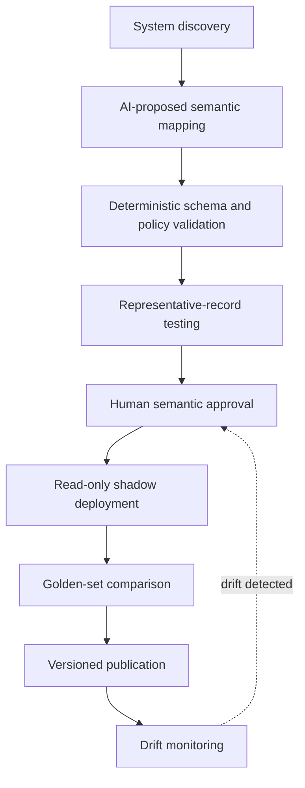
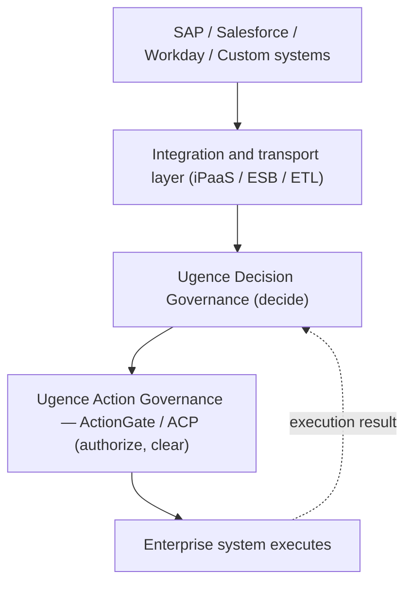
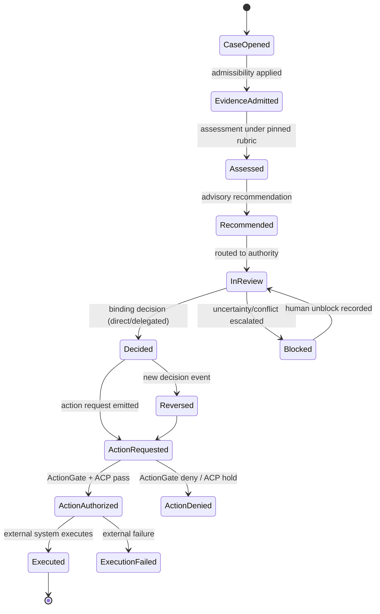

# Ugence Decision Governance Middleware

### Governing How Evidence and Policy Become Authorized Enterprise Decisions

| Field | Value |
|-------|-------|
| **Document** | Ugence Decision Governance Middleware |
| **Version** | **1.0 — Architecture Freeze** |
| **Author** | Rakesh Mohan |
| **Organization** | Ugence Labs |
| **Freeze date** | 2026-07-25 |
| **Reference implementation** | `ai_hiring` |
| **Reference implementation status** | Phases 1–3A implemented |
| **Next implementation phase** | Phase 3B — Deterministic Assessment Runtime |
| **Verified against commit** | `35c0d7f` |
| **Verified test count** | 293 passing (`ai_hiring`) |
| **Word count** | ~11,600 |

> *"Models generate possibilities. Enterprises remain accountable for decisions.
> Ugence governs the space between them."*

---

> **What this document is.** An enterprise-architecture definition of a distinct
> control layer — **Decision Governance Middleware (DGM)** — that governs the
> *lifecycle of a consequential enterprise decision*: which evidence was
> admitted, which policy version applied, what the evidence supported, what was
> recommended, who exercised authority, what was decided, what action was
> requested, and what actually executed. It is written for enterprise architects,
> technical executives, compliance leaders, and investors, and is grounded in a
> working reference implementation (the `ai_hiring` module) and in the existing
> Ugence portfolio.
>
> **Evidence discipline.** Every capability is labeled: **[IMPLEMENTED]** — built
> and tested in this repository; **[SPECIFIED]** — designed, not yet built;
> **[ROADMAP]** — planned, non-trivial; **[RESEARCH]** — an open problem with no
> production-proven answer. No capability is described as operational unless the
> repository supports it. Regulatory language is deliberately qualified: DGM
> provides technical controls and audit evidence that *may support* an
> organization's compliance program; it does not *ensure* compliance.
>
> **What this document is not.** Not a product brochure, not a benchmark report,
> not a claim that a multi-domain product ships today, and not a new market
> category asserted merely because a new label exists. The multi-domain and
> semantic-mapping vision is roadmap and research; the decision-contract core is
> implemented for one domain.

---

## How to read this whitepaper

This document contains two classes of content, and the distinction is
authoritative.

**Normative** statements define architectural requirements that a conforming
implementation *must* satisfy. They use the keywords **MUST**, **MUST NOT**,
**SHALL**, **SHALL NOT**, **REQUIRED**, and **PROHIBITED**. The normative core is
**§0 (Architecture Invariants)**; individual normative obligations also appear in
the phase-boundary text (§14) and are consolidated for review in **Appendix I
(Conformance Checklist)**.

**Explanatory** material provides rationale, examples, diagrams, implementation
options, comparisons, adoption guidance, and non-binding recommendations. The
bulk of this paper — the argument, the tables, the walkthroughs, the operating
modes, the competitive analysis — is explanatory. It illustrates the architecture;
it does not, by itself, add obligations.

> Where an explanatory example conflicts with a normative architectural
> invariant, the invariant governs.

The keywords are used **only where an architectural obligation is actually
intended**. Prose that merely explains is not made normative by proximity to a
MUST. Implementation status (what is built versus specified) is governed by the
**Claim and Maturity Register (Appendix H)**, not by prose.

---

## Table of contents

- How to read this whitepaper (normative vs. explanatory)
0. Architecture invariants *(normative)*
1. Executive summary
2. The enterprise decision problem
3. Falsifying the thesis
4. Position within the Ugence portfolio
5. Decision governance as a distinct control layer
6. The Canonical Decision Contract
7. Evidence governance
8. Policy and rubric governance
9. Assessment, recommendation, binding decision, and execution
10. Human and delegated authority
11. Action governance and ActionGate
12. Semantic decision mapping
13. Operating modes and latency
14. Reference implementation: AI hiring
15. Relationship to existing enterprise platforms
16. Relationship to GRC, BPM, MRM, and XAI
17. Regulatory support without compliance overclaiming
18. Deployment and adoption model
19. Security, privacy, and audit integrity
20. Limitations and open research questions
21. Product strategy and domain expansion
22. Conclusion
23. Version 1.0 architecture freeze *(normative)*
- Appendix A — Canonical decision schema
- Appendix B — Decision lifecycle state model
- Appendix C — Audit event model
- Appendix D — Semantic mapping example
- Appendix E — Capability maturity matrix
- Appendix F — Competitive comparison
- Appendix G — Glossary
- Appendix H — Claim and maturity register *(authoritative)*
- Appendix I — Implementation conformance checklist

---

## 0. Architecture invariants

**This section is normative.** It defines the rules a conforming implementation
MUST satisfy in every phase. The remainder of the paper explains, illustrates, and
sequences these invariants; it does not weaken them. An implementation that
violates any invariant below is non-conforming even if it preserves API
compatibility (§23).

**Invariant 1 — Recommendation is not decision.** A recommendation is advisory. A
recommendation MUST NOT become a binding enterprise decision merely because it was
produced by a model, agent, rules engine, or automated service. A binding decision
REQUIRES valid direct, delegated, escalated, or emergency authority (§10).

**Invariant 2 — Assessment is not recommendation.** An assessment records what
admitted evidence supports under a published contract; a recommendation proposes
an outcome. The architecture MUST preserve these as separate records (§9).

**Invariant 3 — Decision is not execution.** A binding decision does not prove
that the requested action was authorized or executed. Decision, action request,
action authorization, and execution result MUST remain independently represented
(§9, §11).

**Invariant 4 — DGM does not execute enterprise actions.** Decision Governance
Middleware governs the decision lifecycle and constructs governed action requests.
It MUST NOT claim that the enterprise operation has occurred merely because a
decision has been recorded (§11).

**Invariant 5 — ActionGate governs action authorization.** ActionGate is a
component within the AI Control Plane that determines whether and under what
constraints a proposed action may execute. DGM MUST NOT duplicate or silently
bypass this enforcement responsibility (§4, §11).

**Invariant 6 — External systems execute.** The system of record, operational
application, agent tool, or other external execution system performs the
authorized operation. Execution status MUST be returned separately to the decision
case (§9, §11).

**Invariant 7 — Published contracts are immutable.** Published capabilities,
ontology versions, rubric versions, policy bindings, semantic mappings, and
delegated-authority definitions MUST NOT be modified in place. A semantic or policy
change REQUIRES a new version (§6, §8).

**Invariant 8 — Historical records are append-only.** New evidence, corrections,
appeals, reversals, overrides, or execution outcomes MUST create new records or
events. Historical decision meaning MUST NOT be overwritten. *New facts create new
records; they do not rewrite historical meaning* (§6, Appendix A).

**Invariant 9 — Available information is not automatically admissible evidence.**
Evidence MUST pass the applicable admissibility policy before it influences an
assessment or recommendation. Technically accessible information MUST NOT be
treated as permissible evidence by default (§7).

**Invariant 10 — Evaluators cannot amend their constitution.** An evaluator,
including an LLM-based evaluator, MUST consume published ontology, rubric,
admissibility, scale, uncertainty, and reason-code contracts. It MUST NOT invent or
alter those contracts during evaluation (§8, §14).

**Invariant 11 — Missing evidence is not negative evidence.** Missing, quarantined,
redacted, unavailable, stale, prohibited, or insufficient evidence MUST NOT
automatically be converted into an adverse capability finding unless the published
contract explicitly permits that interpretation (§7, §9).

**Invariant 12 — Uncertainty must remain explicit.** An evaluator MUST NOT suppress
uncertainty, conflicts, missing evidence, or unresolved ambiguity merely to produce
a complete-looking output (§9, §14).

**Invariant 13 — Semantic mappings require accountable approval.** Consequential
semantic mappings MUST NOT be autonomously deployed solely on the basis of model
confidence. They REQUIRE versioned validation and accountable human approval
(§12).

**Invariant 14 — Auditability does not depend on chain-of-thought.** The
architecture MUST NOT depend on private chain-of-thought or hidden model reasoning
as the authoritative audit artifact. Auditability MUST derive from admitted
evidence, policy bindings, structured assessments, recommendations, authority
records, decisions, action authorizations, execution results, and append-only
events (§2, §16, §19).

**Invariant 15 — Human oversight includes delegated authority.** The architecture
MUST support both direct human decisions and bounded policy-delegated authority. It
MUST NOT equate human accountability with a mandatory human click on every
transaction (§10).

**Invariant 16 — Enforcement must fail closed where required.** Where policy,
authority, identity, contract validity, evidence eligibility, or action
authorization cannot be established, the applicable governed operation MUST fail
closed or escalate according to the published contract (§13, §19).

---

## 1. Executive summary

Enterprises are wiring AI into consequential decisions — hiring, lending, claims,
clinical review, procurement, trading, and security response. The prevailing
answer to *"can we trust it?"* has been **model explainability (XAI)**: make a
model's internal reasoning legible. That objective is valuable at the model
layer and remains necessary for model development, validation, and bias analysis.
It is insufficient as an *enterprise governance strategy*, for a structural
reason: a single consequential decision is rarely produced by a single model. It
emerges from a pipeline of foundation models, retrieval systems, rule engines,
external APIs, human reviewers, and evolving knowledge sources. No single
reasoning trace explains a distributed decision, and the number of internal
representations to explain grows faster than any interpretability method scales.

Ugence proposes a different boundary. **An enterprise does not need to reconstruct
every internal representation of an AI model to govern a consequential decision.
It must control and reconstruct the evidence admitted, the policy applied, the
recommendation produced, the authority exercised, the action authorized, and the
execution outcome.** The artifact that carries this is a **Decision Governance
Middleware**: a model-independent control layer that turns advisory
recommendations into governed, authorized, and reconstructable enterprise
decisions.

Two claims must be kept separate to keep this honest. First, the *decision
contract* — an assessment distinct from a recommendation distinct from a binding
human decision, over admissible evidence under a pinned policy, with an
append-only reconstructable audit — is **[IMPLEMENTED]** and tested in the
`ai_hiring` reference module for one domain. Second, the *multi-domain* platform
with automated semantic mapping across heterogeneous enterprise systems is
**[ROADMAP]/[RESEARCH]**; it is genuinely hard and is presented as such.

The word "governance" already names the Ugence **AI Control Plane** (which
governs the AI *interaction* boundary — what enters reasoning, what assertions
leave, what actions commit, whether execution is safe). DGM is not that layer
renamed. DGM governs a *different object at a higher altitude*: the **enterprise
decision** itself. §4 draws that boundary precisely, because a blurred boundary
would dissolve the category.

---

## 2. The enterprise decision problem

A consequential enterprise decision is an organizational act with legal and
operational effect: to hire or reject, to approve or decline credit, to pay or
deny a claim, to authorize or block a trade. The questions asked of such a
decision are not primarily about a model's internals. They are:

- Which information was *admitted* as evidence, and which was excluded, and why?
- Which policy — and which *version* — governed it?
- What did the admitted evidence *support* (the assessment), and what was
  *proposed* (the recommendation)?
- What uncertainty or conflict existed?
- *Who or what* had the authority to make it binding?
- What action was *authorized*, and what actually *executed*?

**Model interpretability versus decision explainability.** These are different
things, and the distinction is load-bearing:

- **Model interpretability** (attention maps, feature importance, SHAP, LIME,
  saliency, chain-of-thought) is useful for model development, debugging,
  validation, bias analysis, feature analysis, and scientific understanding. It
  explains *model behavior*.
- **Decision explainability** is the ability to reconstruct *what evidence was
  admitted, what was excluded, which policy version applied, what assessment was
  generated, what uncertainty or conflicts existed, what was recommended, who had
  authority, what binding decision was recorded, what action was authorized, and
  what ultimately executed*. It explains *organizational accountability*.

> Model interpretability can help explain model behavior, but it is neither
> sufficient nor always necessary to reconstruct why an enterprise action was
> authorized.

A regulator investigating an adverse hiring or lending decision does not
primarily want a saliency map; they want to know whether only permissible factors
were used, whether the stated policy was followed, who was accountable, and
whether the decision reconstructs. That is a decision-explainability question. A
chain-of-thought transcript is not an authoritative audit artifact: it is a
model output that can be plausible and wrong, is not a record of what evidence the
organization *admitted*, and must never be treated as the audit of record.

> Do not attempt to audit the model's entire mind. Audit the evidence admitted,
> the policy applied, the authority exercised, and the action executed.

---

## 3. Falsifying the thesis

The portfolio discipline is to try to kill a layer before building it. Six
attacks; each is taken seriously and none is a straw man.

**3.1 "GRC and policy engines already do this (OPA/Rego, ServiceNow GRC,
Archer)."** Open Policy Agent evaluates policy-as-code; GRC suites register
controls and attestations. Both cover part of the surface and DGM should *use*
them (OPA is a reasonable policy backend, §8). But they are policy *evaluators*
and control *registries*, not decision *governors*: they do not model the
**evidence-admissibility** boundary, do not separate an AI recommendation from a
binding human decision as a matter of type and authority, and do not emit a
**per-decision, reconstructable lifecycle**. **Falsification narrows the claim —
DGM is not a new policy engine — but does not kill it.**

**3.2 "Workflow/BPM already orchestrates approvals (Camunda, Pega, ServiceNow)."**
BPM routes tasks and records who clicked approve. That is orchestration, not
governance of *decision content*: BPM does not determine what evidence was
admissible, does not bind a policy *version* to the decision, and does not
distinguish assessment from recommendation from binding decision. A BPM approval
can be rubber-stamped with no record of what was considered. DGM can run on top of
BPM and supply the semantics BPM lacks. **Falsification fails.**

**3.3 "Model Risk Management already governs AI (SR 11-7, model inventories)."**
MRM governs *models as assets* — validation, monitoring, inventory. It is
upstream of, and orthogonal to, governing a *specific decision instance*. MRM
attests a model was validated; it does not reconstruct why *this* applicant was
rejected using *which* evidence under *which* policy version. DGM is the
per-decision complement to portfolio-level MRM. **Falsification fails.**

**3.4 "The Ugence AI Control Plane already governs AI — this is a rename."** This
is the sharpest attack because it is internal. The AI Control Plane governs the
**AI interaction boundary**: what may *enter* reasoning (Context Minimization),
what *assertions* may leave (Truth Assurance Platform), what *actions* may commit
(ActionGate), and whether *execution* is operationally safe now (Autonomous
Control Plane). Its unit is the AI system's interaction with the world. DGM
governs a different object: the **enterprise decision lifecycle** — evidence,
policy, assessment, recommendation, authority, binding decision, action request —
which may involve *multiple* AI assertions and actions, *and humans and rule
engines*. The relationship is compositional: a TAP-governed assertion can *enter*
DGM as an assessment input; a DGM binding decision *produces* an action request
that ActionGate authorizes. **The attack forces a precise object and altitude
separation (§4); it does not make DGM redundant.**

**3.5 "It's just an audit log with extra steps."** An append-only log is
necessary but not sufficient. The value is the *enforced contract the log
attests*: that evidence was screened for admissibility, that a policy version was
pinned, that no AI could author a binding decision, that the executed action
matched the authorization. A log without those invariants records whatever
happened, including ungoverned decisions. DGM is the enforced contract; the audit
is its by-product. **Falsification fails, but is a warning: without the enforced
invariants, DGM *would* be just a log.**

**3.6 "Frontier models will self-explain and self-govern."** Even a perfectly
self-explaining model does not resolve *who is accountable*, *which policy version
governed*, or *whether a prohibited factor influenced a multi-system pipeline*.
Accountability is an organizational property, not a model capability.
**Falsification fails.**

**Net.** The pass kills the "new policy engine" and "audit log" framings and
forces a precise separation from the AI Control Plane. What survives is specific:
**a model-independent control layer for the enterprise *decision* — admissible
evidence, pinned policy, assessment/recommendation/decision separation, explicit
authority, and reconstructable audit — distinct from action-level governance and
from model-level explainability.**

---

## 4. Position within the Ugence portfolio

Ugence already partitions AI governance by *object*. DGM must be positioned by
object too, or it reads as a rename.

The Ugence platform triad is **Specialized AI Systems · AI Control Plane · AI
Infrastructure** (`UGENCE_PLATFORM_OVERVIEW.md`). Within it, the **AI Control
Plane** governs the *AI interaction boundary* across four responsibilities —
**enter · assert · act · clear** — via four components:

| Control-Plane component | Governs (object) | Question |
|-------------------------|------------------|----------|
| Context Minimization | what may **enter** reasoning | "What may the reasoning process receive?" |
| Truth Assurance Platform (TAP) | the **assertion** — what the AI *says* | "Is the response sufficiently supported before delivery?" (DELIVER / QUALIFY / ABSTAIN) |
| ActionGate | the **action** — what the AI *does* | "May this exact action be executed?" (allow / deny / approve / escalate) |
| Autonomous Control Plane (ACP) | execution **safety now** | "Is execution operationally safe right now?" |

Two facts must not be misstated (they were, in earlier drafts): **ActionGate is a
component *inside* the AI Control Plane, not a synonym for it**, and the
**Canonical Execution Request (CER)** is the *object* that flows into the Control
Plane (the runtime's native output; a versioned interoperability contract, *not*
an industry standard already adopted by the market) — not itself a governor.

DGM governs a **fifth object at the organizational altitude: the enterprise
decision.** Placed against its neighbors:

```
  What the AI says        How a decision is made          Whether the action runs
  ┌─────────────────┐    ┌──────────────────────────┐    ┌──────────────────────┐
  │ TAP             │    │ Decision Governance       │    │ ActionGate  (do)     │
  │ (assert)        │──▶ │ Middleware (decide)       │──▶ │ + ACP       (clear)  │
  │ assertion       │    │ decision case             │    │ action / exec-safety │
  └─────────────────┘    └──────────────────────────┘    └──────────────────────┘
   AI Control Plane            THIS PAPER                    AI Control Plane
   component                   (new decision layer)          components
```

| Product | Governs | Unit | Canonical object |
|---------|---------|------|------------------|
| **TAP** | consequential **assertions** — what the AI *says* | a completed response | assertion |
| **Decision Governance Middleware** | consequential **decisions** — how evidence + policy become an authorized outcome | a **decision case** | Canonical Decision Contract |
| **ActionGate** (in AI Control Plane) | consequential **actions** — whether a proposed operation may execute | one exact action | action (hash) / CER |
| **Agent Runtime** (Specialized AI System) | permitted **work** — what an agent attempts within authorization | an execution loop | CER (produced) |

**Where the AI Control Plane sits relative to DGM.** The AI Control Plane is the
governance platform for the *AI interaction boundary*; DGM is a distinct layer for
the *enterprise decision*. They compose but do not overlap: an AI produces an
assertion → TAP governs the assertion → the governed assertion enters DGM as an
assessment/recommendation input → DGM governs the decision and, on a decision to
act, emits an **action request** → that action request is expressed as a CER →
**ActionGate** authorizes the exact action and **ACP** clears it against live
state → the external system executes → the outcome returns to the decision case.

Two portfolio invariants frame the seam and are preserved verbatim in spirit:

> The runtime decides what to do; the control plane decides whether it may do it.

> DGM governs the decision lifecycle; ActionGate governs execution.

DGM introduces no new "gate" (ActionGate and TAP's internal AssertionGate already
own that term) and claims no new "governance" of the AI interaction boundary. Its
claimed object — the decision case — is not one of the four boundary objects
(context, assertion, action, execution-safety); it is the organizational decision
that produces them.

**Boundary discipline (normative restatement of §0 Invariants 4–6).** To keep the
portfolio coherent, conforming descriptions and implementations MUST NOT:

- describe **ActionGate** as a peer of the AI Control Plane, as a synonym for the
  entire AI Control Plane, as an execution engine, or as the system that performs
  the business operation;
- describe **DGM** as an enforcement gate, as a new name for the AI Control Plane,
  or as the executor of enterprise actions;
- collapse **DGM, ActionGate, the AI Control Plane, TAP, or the external system of
  record** into a single responsibility.

The seven roles are fixed: **TAP** governs consequential assertions; **DGM**
governs consequential decision cases; the **Agent Runtime** plans and proposes
work; the **CER** carries the proposed action and control context; the **AI Control
Plane** governs the AI-interaction and execution-safety boundary; **ActionGate** is
the action-authorization and enforcement component *within* the AI Control Plane;
and the **external enterprise system** performs the operation and returns execution
status.

---

## 5. Decision governance as a distinct control layer

DGM is a **control layer**, not an integration or transport layer. The word
*middleware* here means "a control plane that sits between intelligent producers
and enterprise systems of record and governs decision meaning" — it does **not**
mean an **ESB** (message transport) or an **iPaaS** (integration flows). DGM
depends on those layers for connectivity; it governs what they carry (§15).

To keep the argument precise, these terms are defined once and used consistently
throughout (full glossary in Appendix G):

- **Assessment** — a structured statement of what admitted evidence supports under
  a *published evaluation contract* (rubric). It is not a decision.
- **Recommendation** — a *non-binding* proposed outcome produced by an AI model,
  rule engine, analyst, or other advisory source.
- **Binding decision** — the outcome *formally adopted* by an authorized human or
  an explicitly delegated policy authority.
- **Action request** — a request derived from a binding decision asking an
  external system to perform an operation.
- **Action authorization** — the control-plane determination (ActionGate/ACP)
  that the requested operation may execute, under specified constraints.
- **Execution** — the external system's actual attempt to perform the authorized
  action.
- **Decision case** — the versioned collection of subject, evidence, admissibility
  records, policy bindings, evaluation-contract version, assessment(s),
  recommendation(s), uncertainty, conflicts, authority, binding decision, action
  request, action-authorization reference, execution result, appeals/revisions,
  and an append-only audit timeline.

The layer's job is to construct and govern the **decision case**: admit evidence,
apply policy, host the assessment and recommendation, require the right authority,
record the binding decision, emit the action request, and keep the whole thing
reconstructable.

---

## 6. The Canonical Decision Contract

Every consequential decision — regardless of domain — can be represented with one
structure, the **DecisionCase**. The *aggregate type* is **[SPECIFIED]** (the
reference module implements its component records rather than a single umbrella
object); each component below is labeled with its real status.

```
DecisionCase                         [SPECIFIED aggregate]
├── case identity                    [IMPLEMENTED: ids across records]
├── tenant and jurisdiction          [IMPLEMENTED: tenant scope; jurisdiction SPECIFIED]
├── decision type                    [IMPLEMENTED: workflow/disposition types]
├── subject                          [IMPLEMENTED: candidate/role refs]
├── requirements                     [IMPLEMENTED: rubric/capability contracts]
├── evidence references              [IMPLEMENTED: provenance-linked evidence]
├── evidence-admissibility records   [IMPLEMENTED: admissibility + quarantine]
├── policy bindings                  [IMPLEMENTED for rubric; general policy SPECIFIED]
├── rubric / decision-contract version [IMPLEMENTED: pinned rubric_version]
├── assessment records               [IMPLEMENTED contract; producing runtime ROADMAP]
├── recommendation records           [IMPLEMENTED: advisory, actor_type=AI]
├── uncertainty records              [IMPLEMENTED: confidence + uncertainty contracts]
├── conflict records                 [IMPLEMENTED: represent, never resolve]
├── authority records                [IMPLEMENTED: named human; delegated SPECIFIED]
├── binding decision                 [IMPLEMENTED: actor_type=HUMAN, rationale, override]
├── action request                   [SPECIFIED]
├── action authorization reference   [SPECIFIED: CER→ActionGate binding]
├── execution result                 [SPECIFIED]
├── appeals or revisions             [IMPLEMENTED primitive: new versioned records]
└── append-only audit timeline       [IMPLEMENTED]
```

**Immutability and versioning within a case.** The DecisionCase is *not* a mutable
row that is updated in place. The governing principle (§ below and Appendix A):

> New facts create new records; they do not rewrite historical meaning.

Specifically: published requirement contracts and policy versions are immutable;
recommendations are append-only; a binding decision is not overwritten; a reversal
is a *new* decision event that references the prior one; an action authorization
and an execution result are *separate* records; and execution outcomes never
rewrite the original decision. The immutable spine is what makes the case
reconstructable and appeal-safe.

**The load-bearing invariant.** The type-level separation of `Recommendation`
(advisory, `actor_type = AI`) from `Decision` (binding, `actor_type = HUMAN`) is
enforced in the reference module in types, service logic, persistence, tests, and
API permissions — a `Decision` with `actor_type = AI` is *unrepresentable*, and an
AI or service principal attempting to author one is rejected and audited as a
security violation. **[IMPLEMENTED]** That enforcement is what turns
"human-in-the-loop" from a slogan into a checkable property.

**DecisionCase status.** The DecisionCase *aggregate* — a single object binding the
records above into one versioned, orchestrated lifecycle — is **[SPECIFIED]**, not
implemented. The reference module today provides several *constituent* contracts and
services (evidence, evaluation/assessment, recommendation, decision, audit) but not
the aggregate lifecycle. The existence of the component records MUST NOT be read as
the existence of the aggregate. Implementation of the DecisionCase aggregate and its
lifecycle orchestration is **Phase 4A** (§14).

---

## 7. Evidence governance

DGM distinguishes **available information** from **admissible evidence**. The
system does not merely collect records; it evaluates whether a record *may be
used* for a *particular decision* under a *particular policy and contract version*.

The reference module represents admissibility as an explicit outcome per evidence
unit — **[IMPLEMENTED]** as `EvidenceAdmissibility`:

`ADMISSIBLE` · `PROHIBITED` · `STALE` · `INSUFFICIENT` · `UNKNOWN`

plus a distinct missing-evidence vocabulary (`MissingEvidenceStatus`:
`NOT_SUBMITTED`, `NOT_REQUIRED`, `REDACTED`, `QUARANTINED`, `UNAVAILABLE`,
`INSUFFICIENT`), where `QUARANTINED` is produced by the ingestion quarantine
mechanism (prohibited/irrelevant fields are withheld, stored separately, never
exposed to evaluation, and audited *by count, never by value*). Admissibility may
depend on **decision type, capability or criterion, provenance, freshness,
collection procedure, assessor authorization, jurisdiction, consent, policy
version, and data classification**.

**A technically valid field that is still not permissible evidence.** A candidate
record may contain a syntactically valid `date_of_birth` field. It is a real,
well-typed value — and it is *not admissible evidence* for a hiring decision under
a job-relevant-only policy. DGM does not merely fail to display it; it quarantines
it at ingestion so no downstream evaluator can consume it, and records *that a
prohibited field was withheld* without recording the value. Availability is not
admissibility.

**Honest limit.** Blocking *explicit* prohibited attributes is tractable and
implemented. Blocking *proxies* (zip code, extracurriculars, name linguistics,
career gaps) is **[RESEARCH]** — unsolved, addressed only by defense-in-depth
(feature quarantine plus downstream adverse-impact monitoring). DGM makes
admissibility explicit, policy-bound, and auditable; it does **not** assert
bias-freedom, and overclaiming here would be a compliance liability.

---

## 8. Policy and rubric governance

Every enterprise decision sits under policy — HR policy, lending regulation
(ECOA/FCRA), clinical guidelines, trading restrictions (MiFID II/SEC), procurement
rules. DGM treats policy and evaluation contracts as **version-controlled
enterprise assets** and, per decision, records which policy applied, which
*version*, which exceptions were permitted, and whether the recommendation
complied.

Two artifacts, distinguished:

- **Evaluation contract (rubric).** *What* is assessed and *how*: capabilities,
  weights, admissible evidence per capability, scoring scale, permitted reason
  codes, uncertainty rule. **[IMPLEMENTED]** — the reference module's rubric and
  capability-ontology layer: contracts are immutable and versioned, move through
  an **author → reviewer → approver → publisher** lifecycle with segregation of
  duties, and **only a published contract may govern a decision**. A published
  rubric cannot be mutated; a content change creates a new version.
- **Policy (rule).** Broader admissibility, jurisdiction, and outcome
  constraints, ideally evaluated by a policy-as-code backend (OPA/Rego is a
  reasonable choice). DGM's addition is *pinning* the exact version to the
  decision (so the decision reconstructs even after the policy changes), an
  *approval workflow* for policy publication, and an *exception ledger*. General
  enterprise policy backends are **[SPECIFIED]**; the rubric/requirement contract
  layer is **[IMPLEMENTED]**.

Terminology note: a **policy** is a governed, versioned enterprise asset; a
**rule** is a single evaluable clause within a policy. DGM governs policies as
assets; it does not invent a universal policy language and does not replace OPA.

---

## 9. Assessment, recommendation, binding decision, and execution

A recurring failure in enterprise AI is to collapse *what the evidence supports*,
*what was proposed*, *what was decided*, and *what actually happened* into one
record. DGM keeps them as **distinct records**, because they routinely diverge.

- **Assessment record** — what the *admitted evidence supports* under the pinned
  rubric (per-capability scores, evidence links, gaps, uncertainty).
  **[IMPLEMENTED contract]** (`CandidateEvaluation` / `LayerScore`, with a
  `weighted_summary` pinned non-binding at the type level); the *runtime that
  produces* assessments is **[ROADMAP]** (Phase 3B).
- **Recommendation record** — the *proposed* outcome, advisory, `actor_type = AI`.
  **[IMPLEMENTED]**
- **Decision record** — what the *authorized decision-maker decided*, binding,
  `actor_type = HUMAN`, with rationale and — on divergence — an override.
  **[IMPLEMENTED]**
- **Execution record** — what the *external system actually did*. **[SPECIFIED]**

These are **four distinct records** (§0 Invariants 2 and 3). Assessment and
recommendation may be grouped conceptually as the *advisory layer* (neither is
binding), but they MUST remain semantically distinguishable: an assessment states
what the evidence supports; a recommendation proposes an outcome. A concrete
divergence, all four records coexisting, none overwriting another:

```yaml
assessment:                            # what the admitted evidence supports
  evidence_supports: ADVANCE
  uncertainty: MEDIUM
recommendation:                        # what an advisory source proposes
  proposed_outcome: ADVANCE
  source: ai_evaluator                 # actor_type = AI
decision:                              # what authorized authority formally adopts
  outcome: DO_NOT_ADVANCE
  authority: hiring_manager
  override_reason: ROLE_REQUIREMENT_CHANGED
execution:                             # what the operational system attempts/completes
  requested_action: REJECT_APPLICATION # sent to the ATS
  authorization: GRANTED               # ActionGate/ACP
  external_status: COMPLETED           # what actually happened
```

The recommendation is **not** a mandatory field inside the assessment. A decision
case may legitimately contain: an assessment *without* a recommendation; a
recommendation *without* a formal rubric assessment; *multiple competing*
recommendations; or a human decision that *rejects all* recommendations. The
records are independently present and independently versioned.

The separation is necessary for: **human overrides** (decision ≠ recommendation);
**failed execution** (execution ≠ decision — the ATS rejected the write);
**delayed execution** (decision now, execution later); **partial execution** (only
some downstream effects landed); **appeals** (contest the decision without
altering the assessment); **reversals** (a new decision event, not an edit);
**policy changes** (the pinned version still explains the historical decision);
**independent audit** (each record has a distinct owner and integrity); and
**outcome analysis** (comparing what was assessed, decided, and observed over
time). Merging them destroys exactly the information a regulator or an appeal
needs.

---

## 10. Human and delegated authority

Human authority is **not** the same as a mandatory human click on every event.
Requiring a live click on bounded, high-volume, low-risk decisions is both
impractical and a driver of automation bias. DGM defines four authority types:

- **Direct human authority** — a *named human* makes the binding decision.
  **[IMPLEMENTED]** for hiring (a `Decision` requires an authenticated human, a
  panel, a rationale, and an override on divergence).
- **Delegated policy authority** — an *approved policy* permits bounded automatic
  decisions within an explicit envelope. **[SPECIFIED]**
- **Escalated authority** — exceptions or uncertainty route to an authorized
  human. **[SPECIFIED]** (the reference module's `REVIEW_BLOCKED` gate is a
  primitive form: a flagged evaluation cannot proceed to a normal decision until a
  recorded human unblock).
- **Emergency authority** — a narrowly defined emergency rule permits or blocks
  action. **[SPECIFIED]**

**Delegated authority is only safe if it is itself governed.** A delegation must
specify, as a versioned, governed asset: **scope; the permitted decisions;
thresholds and conditions; expiration; an accountable owner; a version; override
rules; escalation conditions; and a revocation mechanism.** Without those, "the
policy decided" is indistinguishable from "no one decided." A delegated decision
must remain fully reconstructable — the decision case records *which* delegation
(and version) authorized it, exactly as a direct decision records *which* human.

The residual risk DGM cannot eliminate is **automation bias** — a human who
reflexively accepts every recommendation. Mitigations (force engagement with the
evidence, monitor override rates, surface uncertainty and gaps) reduce but do not
remove it; this is a limitation, not a solved problem (§20).

---

## 11. Action governance and ActionGate

A governed *decision* is not yet an *action*. Consequential actions — hire, reject,
disburse a loan, pay a claim, execute a trade, release a payment — often have
legal effect the instant a system of record executes them. DGM does not itself
enforce execution; it *emits an action request* derived from the binding decision
and hands it to the action layer.

This is exactly where DGM composes with the AI Control Plane. The realistic design
reuses the existing seam rather than inventing one: DGM's action request is
expressed as a **Canonical Execution Request (CER)**; **ActionGate** authorizes the
exact action (allow / deny / approve / escalate), **ACP** clears it against live
operational state, and only then does the external system execute — after which the
result returns to the decision case. Two portfolio invariants hold at this seam:
*an ActionGate denial is never overridden by ACP, and ACP can only hold — it can
never mint authorization; an action proceeds iff both pass.*

Status: **[SPECIFIED]**. The CER contract and ActionGate/ACP exist in the
portfolio; the *DGM → CER binding* is designed, not yet built. DGM governs *whether
this decision should authorize an action*; ActionGate/ACP govern *whether that
specific action may and safely can execute now*. The two responsibilities — and the
external system's actual execution — must never collapse into one.

---

## 12. Semantic decision mapping

The most ambitious element of the vision is that AI could read heterogeneous
enterprise systems (SAP, Salesforce, Workday, Oracle, ServiceNow, Greenhouse,
custom apps) and bind their records to the decision contract. This is the
highest-value and highest-risk part of the architecture and must be described
without illusion.

**Ordinary integration mapping** is `source field → target field` — a solved, if
tedious, problem owned by iPaaS/ETL tools. **Governed semantic mapping** is
different:

```
external record → meaning within a particular decision → admissibility conditions
              → rubric/policy binding → authority implications → permitted action
```

Inferring the *governed decision* behind a schema is under-determined, and done
wrong it silently governs the wrong thing — the worst possible failure for a
governance layer.

> Ugence does not claim that consequential semantic mappings can safely be
> inferred and deployed without accountable human approval.

The realistic mapping lifecycle — **AI proposes, humans approve, everything is
versioned and shadow-tested**:



**Failure modes to design against:** reversed scale direction (a 1–5 where 1 is
best in one system and worst in another); incorrect status interpretation (a
non-terminal status read as a rejection); proxy attributes admitted as evidence;
stale evidence treated as current; context-dependent meanings (the same field
means different things per record type); unauthorized assessors (evidence from a
source lacking assessment authority); semantic drift after a source-system change;
missing qualifiers (a conditional approval mapped as unconditional); and
mismatched policy scope (a mapping valid in one jurisdiction applied in another).
Every one of these argues for **human-approved, versioned, shadow-tested mappings**
— never fully autonomous mapping.

Status: **[RESEARCH]/[ROADMAP]**. No semantic mapping engine exists in the
reference implementation, and it is the part of the vision most likely to be
scoped down in practice.

---

## 13. Operating modes and latency

DGM is not one-size-fits-all. It supports at least three modes, and only the first
is fully realized in the reference implementation.

**1. Deliberative human-authority mode** — hiring, promotion, lending, claims,
contracts, medical review. Live human review may be required; latency is minutes
to days; decisions are individually reviewable. **[IMPLEMENTED for hiring]**.

**2. Policy-delegated mode** — bounded, repetitive decisions. No live human click;
authority is delegated in advance through an *approved, versioned* policy with
explicit thresholds and conditions; exceptions escalate to humans; every decision
remains reconstructable. **[SPECIFIED]**.

**3. Real-time enforcement mode** — high-frequency trading controls,
cybersecurity, agent tool calls, transaction limits, runtime safety. DGM
establishes the *decision contract and delegated authority* in advance; **ActionGate
performs the low-latency per-event enforcement**; not every event receives human
review; latency may be milliseconds. **[SPECIFIED / composition with ActionGate]**.

> Full deliberative DGM is not appropriate for every sub-second loop.

This is stated plainly because it is a real boundary: the human-authority model
fits consequential, reviewable decisions; sub-second enforcement belongs to the
action layer, with DGM setting the contract and delegated authority the action
layer enforces against.

---

## 14. Reference implementation: AI hiring

The `ai_hiring` module in this repository is a working DGM instance for one
domain, built in phases with tests. Claims are grounded here; nothing beyond it is
described as operational.

- **Phase 1 — Foundation.** Recommendation-vs-decision separation, workflow state
  machine, append-only audit. **[IMPLEMENTED]** — 51 tests.
- **Phase 2 — Evidence ingestion & normalization.** Immutable, provenance-linked
  evidence; job-relevance/prohibited-field quarantine; deterministic index.
  **[IMPLEMENTED]** — 57 tests.
- **Phase 2.5 — Evidence boundary hardening.** Explicit extraction outcomes,
  fail-closed eligibility, resource limits, tenant isolation, authorization-scoped
  access, quarantine non-leakage, reconstruction/hash integrity.
  **[IMPLEMENTED]** — 107 tests.
- **Phase 3A — Capability ontology & rubric contracts.** The immutable, versioned
  requirement/evaluation-contract layer with the author→approve→publish lifecycle
  and segregation of duties; it defines *what evaluation means before any
  evaluator exists*. **[IMPLEMENTED]** — 78 tests.
- **Phase 3B — Deterministic Assessment Runtime.** Executes the Phase-3A
  constitution *without model inference*. **[NEXT]** (§14.3).
- **Phase 3C — Contract-Bound Evidence Interpretation.** AI-assisted interpretation
  *within* the immutable contracts. **[ROADMAP]** (§14.4).
- **Phase 4A — DecisionCase aggregate & lifecycle orchestration.** **[ROADMAP]**.
- **Phase 4B — Action-request construction & CER binding.** **[ROADMAP]**.
- **Phase 4C — Action-authorization linkage, execution reconciliation, appeals &
  reversals.** **[ROADMAP]**.
- **Later research & productization** — human-approved semantic mapping and drift
  controls, additional domain packs, proxy detection, cross-domain validation, and
  enterprise connectors. **[ROADMAP]/[RESEARCH]**.

**Verified test totals (this repository):** 51 + 57 + 107 + 78 = **293 tests,
all passing.** See `ai_hiring/README.md`,
`docs/AI_ASSISTED_HIRING_FRAMEWORK_DESIGN.md`, and
`ai_hiring/docs/CAPABILITY_ONTOLOGY.md`.

Capability maturity (full matrix in Appendix E):

| Capability | Status | Evidence |
|-----------|--------|----------|
| Recommendation/decision separation | Implemented | Phase 1 contracts and services |
| Evidence normalization | Implemented | Phase 2 |
| Evidence-boundary hardening | Implemented | Phase 2.5 |
| Ontology and rubric constitution | Implemented | Phase 3A |
| Deterministic assessment runtime | Next | Phase 3B |
| Contract-bound AI interpretation | Roadmap | Phase 3C |
| Automated semantic mapping | Research/Roadmap | Not production-proven |
| Cross-domain deployment | Roadmap | Hiring is the reference implementation |

The sequencing discipline is itself a demonstration of the DGM philosophy: **the
constitution (ontology + rubric contracts) is frozen before any evaluator is
built.** The evaluator must consume the immutable contracts; it may not invent
capabilities, scales, admissibility rules, uncertainty semantics, or reason codes.
Policy and ontology first; execution engine second.

### 14.1 End-to-end walkthrough (hiring)

One consequential decision, from external system to reconstructable case. Each
step is labeled with its real status so the happy path is not overstated.

1. **External records.** An ATS supplies candidate and role records.
   *(integration layer — not DGM)*
2. **Transport.** An iPaaS/ESB moves the records to DGM. *(§15 — not DGM)*
3. **Semantic mapping.** External records are bound to the decision contract —
   AI-proposed, human-approved, versioned, shadow-tested. **[ROADMAP]**
4. **Evidence governance.** Each artifact is admitted or excluded; a
   `date_of_birth` field is **quarantined** (withheld, audited by count, never by
   value). **[IMPLEMENTED]**
5. **Requirement.** The *published* rubric version for the role is pinned to the
   case. **[IMPLEMENTED]**
6. **Assessment.** An assessment states what the admitted evidence supports per
   capability, with uncertainty. *(contract [IMPLEMENTED]; producing runtime
   [ROADMAP])*
7. **Recommendation.** An advisory `Recommendation(ADVANCE)` is produced —
   `actor_type = AI`, no workflow effect. **[IMPLEMENTED]**
8. **Binding decision.** A hiring manager (authenticated human, or an approved
   delegated policy authority) records `Decision(DO_NOT_ADVANCE)` with a rationale
   and an **override** (`ROLE_REQUIREMENT_CHANGED`). **[IMPLEMENTED]**
9. **Action request.** DGM derives an action request (`REJECT_APPLICATION`) from
   the binding decision. **[SPECIFIED]**
10. **Action authorization.** Expressed as a CER, **ActionGate** authorizes and
    **ACP** clears it. **[SPECIFIED]**
11. **Execution.** The ATS performs the operation. *(external system)*
12. **Result returns.** The execution result is recorded as a *separate* record on
    the case. **[SPECIFIED]**
13. **Reconstruction.** The full timeline — admitted/quarantined evidence → rubric
    version → assessment → recommendation → human override/decision → action
    request → authorization → execution — reconstructs from the append-only audit.
    **[IMPLEMENTED for steps 4–8; SPECIFIED for 9–12]**

**Failure branches (each fails closed and is recorded):**

- **Prohibited evidence detected** — the field is quarantined; the assessment
  proceeds without it; the exclusion is audited. **[IMPLEMENTED]**
- **Missing required evidence** — the capability is marked `INSUFFICIENT` /
  `NOT_SUBMITTED`; no fabricated score. **[IMPLEMENTED]**
- **Semantic mapping uncertain** — the mapping is not deployed; it stays in shadow
  pending human approval. **[ROADMAP]**
- **Human override** — decision diverges from recommendation; an override reason
  is mandatory (step 8). **[IMPLEMENTED]**
- **ActionGate denial** — the action request is not executed; the denial is
  recorded; the binding decision still stands as a record. **[SPECIFIED]**
- **External execution failure** — the execution record shows the failure; the
  decision is *not* rewritten (execution ≠ decision, §9). **[SPECIFIED]**

The point of the walkthrough: the *decision* (step 8) is governed and
reconstructable today for hiring; the *action* (steps 9–12) is governed by the
composition with ActionGate/ACP that is designed but not yet built.

### 14.2 Implementation sequence (aligned)

The whitepaper roadmap and the AI-hiring phase plan are one and the same. Each
phase states its architectural responsibility, what it consumes, what it produces,
what it explicitly does not do, and its status.

| Phase | Responsibility | Consumes | Produces | Does **not** do | Status |
|-------|----------------|----------|----------|-----------------|--------|
| 1 | Human decision boundary, immutable contracts, repositories, services, APIs, audit foundation | — | recommendation/decision contracts, workflow, audit | evaluate evidence | Implemented |
| 2 | Evidence ingestion, normalization, provenance, quarantine, chunking, lineage, reconstruction | raw submissions | normalized, provenance-linked evidence | score or interpret | Implemented |
| 2.5 | Evidence-boundary hardening, fail-closed eligibility, duplicate semantics, authorization-aware search, atomic ingestion | evidence | hardened, admissible evidence | score or interpret | Implemented |
| 3A | Capability ontology & rubric constitution | domain expertise | published, versioned contracts | evaluate | Implemented |
| **3B** | **Deterministic Assessment Runtime** | published contracts + authorized evidence refs | structured advisory assessments (no inference) | infer, rank, recommend, decide | **Next** |
| 3C | Contract-Bound Evidence Interpretation | 3A contracts + 3B runtime | AI-proposed, contract-bound observations | invent contracts, rank, decide | Roadmap |
| 4A | DecisionCase aggregate & lifecycle orchestration | all component records | the DecisionCase lifecycle | execute actions | Roadmap |
| 4B | Action-request construction & CER binding | binding decisions | action requests / CERs | authorize or execute | Roadmap |
| 4C | Action-authorization linkage, execution reconciliation, appeals & reversals | CERs + ActionGate/ACP + execution results | authorized/executed cases, appeals | perform the business operation | Roadmap |
| Later | Human-approved semantic mapping, drift controls, domain packs, proxy detection, cross-domain validation, connectors | — | new packs/controls | autonomous mapping | Roadmap / Research |

### 14.3 Phase 3B — Deterministic Assessment Runtime

**Purpose:** execute the Phase-3A constitution *without model inference*, proving
the evaluation constitution can run before any AI is permitted to interpret
evidence under it.

It **consumes**: published rubric versions; published capability versions;
admissibility rules; authorized evidence references; missing-evidence semantics;
scoring-scale shapes; uncertainty contracts; conflict contracts; reason-code
vocabularies.

It **produces**: assessment workspaces; evidence-to-capability bindings;
admissibility outcomes; missing-evidence records; conflict records; externally
supplied observations; observation-validation results; uncertainty records;
reason-code bindings; structured advisory assessments; reconstructable audit
events.

It **MUST NOT**: infer scores from free-form evidence; interpret résumés or
interview content using an LLM; rank candidates; compare candidates; generate a
hiring recommendation; make a binding hiring decision; resolve conflicts
autonomously; create new capabilities, scales, or reason codes; or alter published
contracts (§0 Invariants 10, 11, 12).

> Phase 3B proves that the evaluation constitution can execute before any AI system
> is permitted to interpret evidence under it.

### 14.4 Phase 3C — Contract-Bound Evidence Interpretation

Phase 3C **may** introduce AI-assisted interpretation, but **only** within the
immutable contracts established in Phase 3A and executed by Phase 3B.

The AI **may propose**: evidence-grounded observations; capability-specific
findings; structured explanations; uncertainty levels; approved reason codes.

The AI **MUST NOT**: introduce new evaluation criteria; change rubric weights;
alter scoring scales; use prohibited evidence; hide missing evidence; invent reason
codes; convert uncertainty into certainty; resolve conflicts without an approved
disposition path; rank candidates unless a later published contract explicitly
authorizes it; or issue a binding employment decision (§0 Invariants 1, 10, 11, 12).

Every proposed observation MUST remain linked to: evidence identifiers; evidence
spans or references where applicable; capability version; rubric version; model and
prompt version; uncertainty; reason codes; and validation outcome. An observation
that cannot be so linked is not admissible into the assessment.

---

## 15. Relationship to existing enterprise platforms

DGM does **not** replace, and depends on, the connectivity layer. It is not an
iPaaS and not an ESB.

Ugence does not replace **SAP Integration Suite, MuleSoft, Boomi, Workato,
Informatica**, native ERP/CRM connectors, or ETL/event-streaming systems. Those
provide **connectivity, transport, schema conversion, API mediation,
orchestration, and message transformation**. Ugence provides **decision meaning,
evidence admissibility, evaluation-contract binding, authority validation,
binding-decision separation, action-request governance, and reconstructable
decision audit**.



The disambiguation matters because "middleware" most often means transport
middleware. DGM is *decision* middleware — a control layer above transport. It
consumes what the integration layer delivers and governs what it *means* for a
decision.

---

## 16. Relationship to GRC, BPM, MRM, and XAI

For each adjacent category: what it solves well, why DGM is not a replacement, the
decision-lifecycle gap that remains, and how DGM composes with it. No straw men.

| Category | Solves well | Why DGM is not a replacement | Remaining gap | Composition |
|----------|-------------|------------------------------|---------------|-------------|
| **GRC** (ServiceNow GRC, Archer) | control registries, attestations, risk records | DGM does not manage the enterprise control catalog | no per-decision reconstructable lifecycle | DGM emits decision evidence GRC can attest against |
| **Policy engines** (OPA/Rego, Styra) | fast policy-as-code evaluation | DGM is not a policy language or evaluator | no evidence admissibility, no decision contract | DGM uses OPA as a policy backend (§8) |
| **BPM/workflow** (Camunda, Pega) | task routing, approvals | DGM does not orchestrate arbitrary processes | no governed decision *content* or version pinning | DGM runs on top of BPM steps |
| **MRM** (SR 11-7 tooling) | model inventory, validation | DGM is not model-level governance | not per-decision-instance | DGM records which model/version produced a recommendation |
| **XAI** (SHAP, LIME) | model interpretability | DGM does not explain model internals | model, not decision | XAI informs model validation upstream of DGM |

**On explainability specifically (reiterated because it is often conflated).** DGM
does not claim model interpretability is worthless — it is the right tool for model
development and bias analysis. DGM claims it is neither sufficient nor always
necessary to reconstruct *why an enterprise action was authorized*. A
chain-of-thought is not an audit artifact. The decision case is.

Ordinary application audit logs are insufficient here for the reason in §3.5: a
log records what happened; DGM records what happened *under an enforced contract*
(admissible evidence, pinned policy, no-AI-binding-decision, action matches
authorization). The enforcement is the product; the log is its by-product.

---

## 17. Regulatory support without compliance overclaiming

DGM does not *ensure* compliance. Compliance is an organizational determination
involving legal interpretation, external documentation, and jurisdictional
variation. The disciplined formulation:

> DGM provides technical controls and audit evidence that may support an
> organization's compliance program.

For each requirement class, DGM supplies a *technical control*; the
*organization* remains responsible for legal interpretation and program design.

| Requirement class | DGM support (technical control) |
|-------------------|---------------------------------|
| Traceability | versioned, reconstructable decision timeline |
| Human oversight | explicit authority and intervention records |
| Data governance | provenance and evidence admissibility |
| Risk controls | policy gates, uncertainty, escalation |
| Recordkeeping | append-only decision artifacts |
| Contestability | evidence references and reason codes for appeals |
| Execution control | ActionGate authorization linkage |

Illustrative regimes (technical control vs. organizational responsibility; not
legal advice): EU AI Act high-risk (traceability + human oversight records vs. the
deployer's conformity assessment); NYC Local Law 144 (audit evidence vs. the
employer's bias-audit and notice obligations); ECOA/FCRA (admissible-factor reason
codes vs. the lender's adverse-action determination); HIPAA (minimum-necessary
evidence handling vs. the covered entity's program); MiFID II/SEC (pre-trade
authority records, composing with pre-trade ActionGate, vs. the firm's supervision
obligations). Jurisdictional variation is the rule, not the exception; DGM
supplies controls and evidence, not legal conclusions.

Conforming descriptions of DGM MUST NOT state that it *ensures compliance*,
*guarantees fairness*, *eliminates bias*, *makes a decision legally defensible by
itself*, or *satisfies a regulation automatically*. Legal and regulatory outcomes
depend on factors outside the software: **jurisdiction; organizational procedures;
legal interpretation; policy validity; human behavior; operational controls;
external documentation; and system configuration.** DGM's contribution is technical
controls and reconstructable evidence that *may support* — never replace — an
organization's compliance program.

---

## 18. Deployment and adoption model

Risk is lowest when DGM begins by *reconstructing* decisions rather than *making*
them. A staged path:

1. **Read-only decision reconstruction** — DGM observes and reconstructs existing
   decisions from current systems. No behavior change; immediate audit value; it
   proves the contract fits the domain before anything is governed.
2. **Shadow assessment against historical cases** — run the assessment contract
   over past decisions; compare to actual outcomes; validate the rubric.
3. **Human-reviewed advisory recommendations** — recommendations surfaced to
   humans; humans still decide as before.
4. **Binding human decisions with governed action requests** — decisions recorded
   through DGM; action requests emitted (and, when the binding exists,
   ActionGate-authorized).
5. **Policy-delegated decisions within bounded scopes** — approved, versioned
   delegations handle bounded cases; exceptions escalate.
6. **Cross-domain decision governance** — additional domain packs.

Starting read-only de-risks adoption: the organization gains reconstructable audit
and validates the contract with *zero* change to how decisions are currently made.
The recommended landing domain stays narrow — **hiring** — before expanding, and
each new pack is a real, regulated build (§21).

---

## 19. Security, privacy, and audit integrity

A governance layer is a high-value target and a concentration of sensitive
evidence; its own integrity is part of the product.

- **Tenant isolation.** Evidence, provenance, index entries, and quarantine records
  are tenant-scoped; a governance layer that leaks across tenants is worse than
  none. **[IMPLEMENTED]** (Phase 2.5).
- **Authorization-scoped access.** Reads and searches are permission- and
  tenant-scoped; quarantine access requires a separate permission; denials are
  audited; result counts do not leak cross-tenant matches. **[IMPLEMENTED]**.
- **Quarantine non-leakage.** Prohibited values never appear in normalized
  evidence, chunks, search, lineage, audit payloads, or error messages; only the
  *fact and count* of quarantine is recorded. **[IMPLEMENTED]**.
- **Audit integrity.** Append-only events, a deterministic content hash per event,
  and correlation/causation IDs threading a full decision. A cryptographic
  hash-chain is designed-for (`previous_event_hash` reserved) but **[SPECIFIED]**,
  not built — stated plainly rather than implied.
- **Provenance & fail-closed ingestion.** Evidence carries provenance; ingestion
  fails closed on malformed/oversized/ambiguous input rather than admitting
  degraded evidence. **[IMPLEMENTED]**.
- **Retention & privacy.** Long-term retention of decision cases containing
  personal data raises minimization and right-to-erasure tensions with the
  immutable audit; reconciling them (e.g. crypto-shredding of evidence while
  retaining the anonymized decision spine) is **[SPECIFIED]/[RESEARCH]**.
- **Identity & authority compromise.** DGM's guarantees are only as strong as the
  identity provider behind human authority; compromised credentials or a
  compromised IdP are outside what the contract alone can control (§20).

---

## 20. Limitations and open research questions

Stated candidly. For each, what the architecture controls and what it does not.

- **Proxy discrimination.** Controls: explicit admissibility, feature quarantine,
  adverse-impact monitoring. Not controlled: guaranteeing no proxy influence.
  **[RESEARCH]**.
- **Flawed human-authored policies.** DGM enforces the policy faithfully; it does
  not make a biased or wrong policy correct. Auditability ≠ fairness.
- **Automation bias.** Controlled: forced evidence engagement, override-rate
  monitoring. Not controlled: guaranteeing genuine human judgment. **[RESEARCH]**.
- **Rubric validity.** DGM enforces a published rubric; whether the rubric
  *predicts* on-the-job performance is an empirical, domain-expert question.
- **Evidentiary completeness.** DGM records what was admitted; it cannot know what
  relevant evidence was never collected.
- **Semantic drift.** Mappings degrade as source systems change; drift monitoring
  detects, it does not prevent. **[RESEARCH]**.
- **Cross-jurisdiction conflicts.** A decision spanning jurisdictions may face
  contradictory rules; DGM records the conflict, it does not resolve law.
- **Contested decisions and appeals.** DGM makes contestation possible (evidence
  references, reason codes, new decision events); the adjudication is human.
- **Causal attribution.** In a multi-model pipeline, attributing an outcome to a
  specific contribution is hard; DGM records inputs and authority, not counterfactual
  causation. **[RESEARCH]**.
- **Model collusion / correlated error.** Multiple models sharing a bias will not
  disagree; DGM's conflict detection sees agreement, not shared blind spots.
- **Adversarial evidence.** Fabricated or manipulated evidence that passes
  admissibility is a real risk; provenance helps, it does not fully solve.
- **Identity and authority compromise.** Out of scope for the contract alone
  (§19).
- **Audit-log integrity.** Append-only + hashing is strong; without a hash-chain it
  is not tamper-*evident* end to end. **[SPECIFIED]**.
- **Long-term retention and privacy.** Immutable audit vs. minimization/erasure
  (§19). **[RESEARCH]**.
- **Emergency overrides.** Necessary and dangerous; DGM records them, and the risk
  is that "emergency" becomes routine.
- **Model-induced persuasive explanations.** A fluent, wrong recommendation
  rationale can bias a reviewer; this is why the recommendation is advisory and the
  chain-of-thought is not the audit.
- **Mapping errors.** §12's failure modes; mitigated by human approval and shadow
  testing, not eliminated.
- **Operational adoption.** Versioned policy-as-code with approval workflows is
  organizationally heavy; whether the burden is acceptable outside the most
  regulated domains is unproven.

---

## 21. Product strategy and domain expansion

The sober competitive claim is *not* that others cannot implement governed
decisions. It is that Ugence makes **the decision case and its governance
lifecycle the native abstraction**, standardized across heterogeneous systems.

Every platform has a primary abstraction:

| Platform | Primary abstraction |
|----------|---------------------|
| ERP | business process / transaction |
| CRM | customer record / workflow |
| iPaaS | integration flow |
| BPM | process instance |
| GRC | risk, control, policy, and compliance record |
| MRM | model inventory and validation |
| Action governance (ActionGate) | execution request |
| **DGM** | **consequential decision case** |

Existing platforms may *participate in or host* parts of the decision lifecycle;
none makes the decision case the native, reconstructable unit. The strategy is
**depth-first**: one deep, regulated pack (hiring) is worth more than ten shallow
ones; lending is the natural second (same adverse-action shape); each pack is a
real build, sequenced deliberately. The defensible asset is the *decision contract
and its enforcement*, not reinvented plumbing — DGM reuses ActionGate/CER for the
action layer, OPA for policy, the enterprise IdP for authority, and the iPaaS/ESB
for transport.

---

## 22. Conclusion

The central challenge of enterprise AI is not generating recommendations — it is
governing how those recommendations become authorized actions. Trying to fully
explain the internal cognition of every model in an increasingly distributed
pipeline is unlikely to become a practical governance strategy.

> The organization must audit the information admitted into the decision, not
> every possible source that may have influenced the model historically.

Governing the decision boundary itself — admissible evidence, pinned policy, an
assessment distinct from a recommendation distinct from a binding decision,
explicit and possibly-delegated authority, an action request handed to the action
layer, and a reconstructable audit — is tractable, durable, and unoccupied by a
purpose-built layer. Its decision-contract core is implemented and tested for the
hiring domain; its multi-domain and semantic-mapping ambitions are treated as
roadmap and research. It composes with, and does not rename, the rest of the
Ugence portfolio: TAP governs what an AI *says*, ActionGate and ACP govern whether
an action may and safely can *execute*, the Agent Runtime *performs* permitted
work — and Decision Governance Middleware governs how evidence and policy become an
authorized *decision* in between.

> *"Models generate possibilities. Enterprises remain accountable for decisions.
> Ugence governs the space between them."*

---

## 23. Version 1.0 architecture freeze

**This section is normative.**

Version 1.0 freezes the *architectural thesis*, the *governed-object boundaries*,
the *terminology*, the *canonical decision lifecycle*, and the *invariants* (§0)
defined in this whitepaper. It establishes the stable reference that subsequent
implementation phases must conform to.

**The freeze does not mean every specified capability is implemented.** It means:

- future implementations MUST conform to the invariants in §0;
- implementation status remains governed by the Claim and Maturity Register
  (Appendix H), not by prose;
- roadmap *sequencing* (§14.2) may be refined without violating the architecture;
- explanatory examples, diagrams, and non-binding guidance may evolve;
- domain-specific extensions and additional packs may be added;
- no implementation may silently collapse **DGM, ActionGate, the AI Control Plane,
  TAP, or the external system of record** into one responsibility.

### 23.1 Change control

| Category | Version | Permitted / required for |
|----------|---------|--------------------------|
| **Patch** | 1.0.x | typographical corrections; clarification without semantic change; corrected repository references; improved diagrams; non-normative examples |
| **Minor** | 1.x | additive domain patterns; additional operating modes; new non-breaking contract concepts; expanded security or deployment guidance; new appendices that do not alter invariants |
| **Major** | 2.0 | changing the governed-object boundaries; changing the meaning of assessment, recommendation, decision, authorization, or execution; permitting evaluators to alter published contracts; collapsing DGM into ActionGate or the AI Control Plane; changing the canonical authority model; abandoning append-only history; permitting autonomous deployment of consequential semantic mappings; changing any normative architecture invariant |

Any change in the **Major** column REQUIRES a new whitepaper version (2.0) and MUST
NOT be introduced under a patch or minor revision.

> Any implementation that violates a Version 1.0 invariant is non-conforming even
> if it preserves API compatibility.

### 23.2 Freeze metadata

| Field | Value |
|-------|-------|
| Version | 1.0 — Architecture Freeze |
| Freeze date | 2026-07-25 |
| Reference implementation | `ai_hiring` (Phases 1–3A implemented) |
| Verified against commit | `35c0d7f` |
| Verified test count | 293 passing |
| Word count | see the header table |
| Next conforming phase | Phase 3B — Deterministic Assessment Runtime *(status: NEXT)* |

**The Version 1.0 architecture is frozen. This freeze establishes required
boundaries and invariants; it does not represent completion of all specified
capabilities. The next conforming implementation phase is Phase 3B — Deterministic
Assessment Runtime.**

---

## Appendix A — Canonical decision schema

The DecisionCase aggregate (**[SPECIFIED]**; components labeled in §6). Immutability
rules:

**Immutable once written (a change creates a new versioned record, never an
overwrite):**
- published capability ontologies and rubrics (evaluation contracts);
- policy versions;
- evidence records and their provenance;
- assessment records, recommendation records;
- binding decision records;
- audit events.

**Separately recorded, never rewriting the original:**
- semantic mappings are versioned;
- reversals create a *new* decision event referencing the prior one;
- action authorizations are recorded separately from the decision;
- execution results are recorded separately and do not rewrite the decision.

Governing principle: **new facts create new records; they do not rewrite
historical meaning.** This is what makes a case appeal-safe and reconstructable
after policies change.

## Appendix B — Decision lifecycle state model



## Appendix C — Audit event model

The reference module emits append-only, hash-stamped, correlation/causation-linked
events across the lifecycle. Representative families (**[IMPLEMENTED]**):

- **Evidence:** `EVIDENCE_UPLOAD_RECEIVED`, `EVIDENCE_PROVENANCE_CAPTURED`,
  `EVIDENCE_NORMALIZED`, `EVIDENCE_PII_QUARANTINED`, `EVIDENCE_ELIGIBILITY_BLOCKED`,
  `EVIDENCE_ACCESS_DENIED`, `EVIDENCE_RECONSTRUCTION_VALIDATED`.
- **Assessment/recommendation/decision:** `RECOMMENDATION_CREATED`,
  `DECISION_CREATED` (with the enforced human-authority boundary).
- **Contracts:** `CAPABILITY_PUBLISHED`, `CAPABILITY_RETIRED`,
  `RUBRIC_CREATED`, `RUBRIC_APPROVED`, `RUBRIC_PUBLISHED`, `RUBRIC_DEPRECATED`.

Each event carries a deterministic content hash and correlation/causation IDs; a
cross-event cryptographic hash-chain is reserved (`previous_event_hash`) but
**[SPECIFIED]**, not built. Action-authorization and execution-result events are
**[SPECIFIED]** (they arrive with the CER/ActionGate binding).

## Appendix D — Semantic mapping example

A hiring example illustrating governed mapping and one failure mode:

```yaml
external_record:            # from an ATS
  system: greenhouse
  entity: application
  field: stage
  value: "Assessment"
proposed_mapping:           # AI proposal (advisory)
  decision_type: hiring.advance
  meaning: "candidate is at the assessment stage"
  admissibility: NOT_A_DECISION_EVENT   # a stage, not a decision
  action_implication: NONE
human_review:
  verdict: APPROVED
  note: "correctly identified as a stage, not a reject/advance decision"
deployment: read-only shadow, golden-set compared, versioned
# Failure mode avoided: a naive mapping might read 'Assessment' stage exit as a
# decision. Here it is explicitly NOT_A_DECISION_EVENT, so it governs nothing.
```

## Appendix E — Capability maturity matrix

| Capability | Status | Evidence |
|-----------|--------|----------|
| Recommendation vs. binding decision separation | Implemented | Phase 1 |
| Immutable domain contracts | Implemented | Phases 1, 3A |
| Evidence ingestion & normalization | Implemented | Phase 2 |
| Provenance | Implemented | Phase 2 |
| Prohibited-field quarantine (non-leakage) | Implemented | Phase 2 / 2.5 |
| Explicit extraction outcomes | Implemented | Phase 2.5 |
| Resource limits / fail-closed ingestion | Implemented | Phase 2.5 |
| Tenant isolation & scoped access | Implemented | Phase 2.5 |
| Reconstruction / hash integrity | Implemented | Phase 2.5 |
| Versioned capability ontology | Implemented | Phase 3A |
| Versioned rubric contracts + lifecycle | Implemented | Phase 3A |
| Segregation of duties (author≠approver) | Implemented | Phase 3A |
| Admissibility outcomes | Implemented | Phase 3A |
| Scoring-scale definitions (no scoring) | Implemented | Phase 3A |
| Missing-evidence semantics | Implemented | Phase 3A |
| Uncertainty contracts | Implemented | Phase 3A |
| Conflict representation (no resolution) | Implemented | Phase 3A |
| Append-only audit events | Implemented | Phases 1–3A |
| Deterministic assessment runtime | Roadmap | Phase 3B |
| Contract-bound AI interpretation | Roadmap | Phase 3C |
| Delegated / policy authority | Specified | design |
| Action request → CER → ActionGate binding | Specified | design |
| Execution record | Specified | design |
| Cryptographic audit hash-chain | Specified | reserved field |
| Automated semantic mapping | Research/Roadmap | not production-proven |
| Cross-domain deployment | Roadmap | hiring is reference |

## Appendix F — Competitive comparison

See §16 (capability comparison) and §21 (primary-abstraction comparison). Summary:
DGM is separable from policy engines (no decision contract), GRC (no per-decision
lifecycle), BPM (no governed content/version pinning), MRM (not per-instance), XAI
(decision not model), iPaaS/ESB (control not transport), and the AI Control Plane's
ActionGate (decision not action). It *composes* with each rather than replacing it.

## Appendix G — Glossary

- **Assessment** — a structured statement of what admitted evidence supports under
  a published evaluation contract. Not a decision.
- **Recommendation** — a non-binding proposed outcome from an advisory source (AI,
  rule engine, analyst).
- **Binding decision** — the outcome formally adopted by an authorized human or an
  explicitly delegated policy authority.
- **Action request** — a request derived from a binding decision asking an external
  system to perform an operation.
- **Action authorization** — the control-plane (ActionGate/ACP) determination that
  the requested operation may execute, under constraints.
- **Execution** — the external system's actual attempt to perform the authorized
  action.
- **Decision case** — the versioned collection of subject, evidence, admissibility
  records, policy bindings, contract version, assessments, recommendations,
  uncertainty, conflicts, authority, binding decision, action request,
  authorization reference, execution result, appeals/revisions, and audit timeline.
- **Evidence (admissible)** — information a policy permits to influence a specific
  decision, distinct from merely *available* information.
- **Policy** — a governed, versioned enterprise asset constraining admissibility
  and outcome. A **rule** is a single evaluable clause within a policy.
- **Authority** — the right to make a decision binding: *direct* (named human),
  *delegated* (approved policy), *escalated* (routed to a human), or *emergency*.
- **Control plane / middleware (here)** — a control layer governing decision
  meaning between intelligent producers and systems of record; **not** an ESB
  (transport) or iPaaS (integration).
- **AI Control Plane** — the Ugence governance platform for the AI *interaction*
  boundary (Context Minimization, TAP, ActionGate, ACP). DGM is a distinct layer at
  the decision altitude.
- **CER (Canonical Execution Request)** — the runtime's native, hashable execution
  contract governed by the AI Control Plane; a versioned interoperability contract,
  not an adopted industry standard.
- **TAP (Truth Assurance Platform)** — governs consequential assertions (what the
  AI says): DELIVER / QUALIFY / ABSTAIN.
- **ActionGate** — the AI Control Plane component that authorizes one exact action.
- **Audit (reconstructable)** — an append-only record from which a decision's full
  lifecycle can be replayed; not a chain-of-thought transcript.

## Appendix H — Claim and maturity register

**This appendix is authoritative** for implementation status; where prose and this
register disagree, the register governs. Statuses: **IMPLEMENTED** (verified in the
current repository), **SPECIFIED** (architecturally defined, not implemented),
**NEXT** (the immediately planned phase), **ROADMAP** (intended later),
**RESEARCH** (unresolved / not production-proven). Every IMPLEMENTED row was
verified against `ai_hiring` at commit `35c0d7f` (293 tests passing).

| Claim or capability | Status | Repository evidence | Whitepaper section | Next validation point |
|---------------------|--------|---------------------|--------------------|-----------------------|
| Recommendation/decision separation | IMPLEMENTED | Phase 1 contracts/services | §5, §6, §9 | maintained through 4A |
| Actor-type enforcement (no AI binding decision) | IMPLEMENTED | `domain/decision.py`, `recommendation.py` | §6, §0-Inv1 | maintained |
| Immutable domain contracts | IMPLEMENTED | Phases 1, 3A | §6, §8 | maintained |
| Evidence ingestion & normalization | IMPLEMENTED | Phase 2 | §7 | maintained |
| Provenance | IMPLEMENTED | Phase 2 | §7, §19 | maintained |
| Prohibited-field quarantine (non-leakage) | IMPLEMENTED | Phase 2 / 2.5 | §7, §19 | maintained |
| Extraction outcomes | IMPLEMENTED | Phase 2.5 (`ExtractionStatus`) | §7 | 3B consumes |
| Evidence eligibility (fail-closed) | IMPLEMENTED | Phase 2.5 | §7, §0-Inv16 | maintained |
| Authorization-aware search | IMPLEMENTED | Phase 2.5 | §19 | maintained |
| Lineage & reconstruction | IMPLEMENTED | Phase 2.5 | §11, §19 | maintained |
| Capability ontology | IMPLEMENTED | Phase 3A | §8 | 3B consumes |
| Capability versioning | IMPLEMENTED | Phase 3A | §8, §0-Inv7 | maintained |
| Rubric contracts | IMPLEMENTED | Phase 3A | §8 | 3B consumes |
| Rubric versioning | IMPLEMENTED | Phase 3A | §8, §0-Inv7 | maintained |
| Rubric approval workflow | IMPLEMENTED | Phase 3A | §8 | maintained |
| Segregation of duties (author≠approver) | IMPLEMENTED | Phase 3A | §8 | maintained |
| Admissibility outcomes | IMPLEMENTED | Phase 3A (`EvidenceAdmissibility`) | §7 | 3B consumes |
| Scoring-scale definitions (no scoring) | IMPLEMENTED | Phase 3A (`ScoringScale`) | §8 | 3B consumes |
| Missing-evidence semantics | IMPLEMENTED | Phase 3A (`MissingEvidenceStatus`) | §7, §0-Inv11 | 3B consumes |
| Uncertainty contracts | IMPLEMENTED | Phase 3A (`UncertaintyLevel`) | §9, §0-Inv12 | 3B consumes |
| Conflict representation (no resolution) | IMPLEMENTED | Phase 3A (`Conflict`) | §9 | 3B consumes |
| Append-only audit events | IMPLEMENTED | Phases 1–3A | §11, §19, App. C | maintained |
| Deterministic assessment runtime | NEXT | — | §14.3 | Phase 3B |
| Contract-bound AI interpretation | ROADMAP | — | §14.4 | Phase 3C |
| DecisionCase aggregate | SPECIFIED | component records only | §6 | Phase 4A |
| Semantic mapping | RESEARCH | — | §12 | not production-proven |
| Action-request construction | SPECIFIED | — | §11 | Phase 4B |
| CER binding | SPECIFIED | portfolio CER contract | §11 | Phase 4B |
| ActionGate authorization linkage | SPECIFIED | portfolio ActionGate | §11 | Phase 4C |
| Execution-result reconciliation | SPECIFIED | — | §9, §11 | Phase 4C |
| Appeals & reversals | SPECIFIED | append-only primitive exists | §9, App. A | Phase 4C |
| Cross-domain domain packs | ROADMAP | hiring is reference | §13, §21 | per-pack build |
| Cryptographic audit integrity | SPECIFIED | reserved `previous_event_hash` | §19 | hash-chain build |
| Proxy detection | RESEARCH | — | §7, §20 | unresolved |

## Appendix I — Implementation conformance checklist

A future phase review uses this checklist to determine whether an implementation
conforms to the frozen Version 1.0 architecture. A "no" to any question below
indicates non-conformance with the referenced invariant.

**Contract conformance**
- Does the implementation consume *published versions* rather than mutable drafts? *(Inv 7, 10)*
- Is a runtime *unable* to alter capability or rubric meaning? *(Inv 10)*
- Are version identifiers preserved in outputs? *(Inv 7, 8)*
- Are historical contracts retrievable? *(Inv 8)*

**Evidence conformance**
- Is evidence eligibility checked *before* evaluation? *(Inv 9, 16)*
- Are prohibited and quarantined evidence isolated? *(Inv 9)*
- Is missing evidence distinguished from *adverse* evidence? *(Inv 11)*
- Is every assessment traceable to admissible evidence? *(Inv 9, 14)*

**Decision conformance**
- Are assessment, recommendation, and binding decision *separate*? *(Inv 1, 2)*
- Is authority explicit? *(Inv 1, 15)*
- Is it *impossible* for a recommendation to become binding without authority? *(Inv 1)*
- Are overrides and reversals append-only? *(Inv 8)*

**Action conformance**
- Is the action request *separate* from the decision? *(Inv 3, 4)*
- Is ActionGate / the applicable AI Control Plane component responsible for runtime authorization? *(Inv 5)*
- Is execution status obtained from the external executing system? *(Inv 6)*
- Can an execution failure be represented *without* changing the original decision? *(Inv 3, 8)*

**AI conformance**
- Is the model *unable* to invent capabilities, scales, or reason codes? *(Inv 10)*
- Are outputs schema-validated? *(Inv 10, 12)*
- Are uncertainty and conflicts retained (not suppressed)? *(Inv 12)*
- Is chain-of-thought *excluded* as the authoritative audit record? *(Inv 14)*

**Mapping conformance**
- Are semantic mappings versioned? *(Inv 7, 13)*
- Were they tested against representative records? *(Inv 13)*
- Were they approved by accountable reviewers? *(Inv 13)*
- Can mapping drift be detected? *(Inv 13)*

**Audit conformance**
- Are events append-only? *(Inv 8)*
- Are actor, timestamp, version, and correlation identifiers present? *(Inv 14)*
- Can the decision lifecycle be reconstructed? *(Inv 14)*
- Does the implementation distinguish *audit completeness* from *cryptographic tamper evidence*? *(§19)*

---

*Document status: Version 1.0 — Architecture Freeze. Normative content is §0 and
§23 (plus the phase-boundary obligations in §14 and Appendix I); all other content
is explanatory. Implementation status is governed by Appendix H, verified against
`ai_hiring` at commit `35c0d7f` (293 tests passing). Roadmap and research items are
labeled as such and are not presented as operational.*
