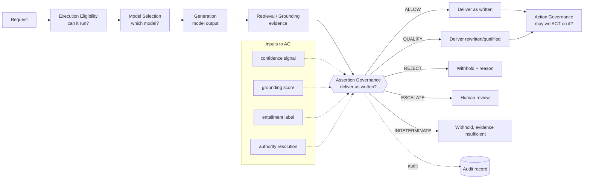

# Assertion Governance — Definition and Architectural Positioning

*Phase 2. A precise definition of Assertion Governance (AG), its formal signature, and its
distinction from every adjacent concept. Whether it *deserves* to be an independent layer is NOT
asserted here — that is decided in Phase 11 after evaluation.*

## Definition

> **Assertion Governance** is the function that, given a **generated model output**, its
> **supporting evidence**, a **policy**, and a **risk class**, decides *whether and how that
> assertion should be delivered to the user* — returning a **disposition** (ALLOW / QUALIFY /
> REJECT / ESCALATE / INDETERMINATE), an optional **transformed assertion** (for QUALIFY), and an
> **auditable reason**.

It operates **after generation** and **before delivery**. It does not generate, retrieve, select a
model, or execute an action. It governs the *epistemic delivery* of a claim: "should this be stated
as written, stated more weakly, withheld, or sent to a human?"

Formal signature:

```
govern(output, evidence, policy, risk_class, authority?) ->
    { disposition ∈ {ALLOW, QUALIFY, REJECT, ESCALATE, INDETERMINATE, UNKNOWN, NOT_SUPPORTED},
      delivered_text,          # == output for ALLOW; rewritten for QUALIFY; withheld for REJECT
      qualification?,          # the hedge/scope added
      reason_codes, evidence_refs, audit_record }
```

## Distinctions (what AG is NOT)

| Concept | Question it answers | vs Assertion Governance |
|---|---|---|
| **Model Selection** | *which model* should run? | AG runs after selection; indifferent to which model produced the output |
| **Execution Eligibility** | *can* this model execute? | AG is post-execution; eligibility is pre-execution |
| **Action Governance** | may the system *do* X (side-effecting act)? | AG governs *stating*, not *doing*; a delivered assertion is not an action |
| **Moderation** | is this content in a *prohibited category* (toxic/PII)? | AG is epistemic (supported?), not categorical (allowed class?) |
| **Safety** | could this output *cause harm*? | overlaps only where an unsupported claim is harmful; AG's axis is support, not harm |
| **Grounding** | is the output *supported by sources*? (score) | grounding is an *input signal*; AG is the *decision* over it |
| **Entailment** | does evidence *entail/contradict* the claim? (label) | entailment is an *input signal*; AG adds QUALIFY/ESCALATE/risk |
| **Fact Checking** | is the claim *true* against the world? | AG asks "supported by *this request's* evidence", not global truth |
| **Human Approval** | does a *person* authorize this? | AG *routes* to humans (ESCALATE) but is itself automated |

Crucial non-overloads:
- **AG ≠ ActionGate.** ActionGate governs side-effecting actions (deploy, delete, pay). AG governs
  *delivering a statement*. Delivering "the treatment is safe" is not an action in ActionGate's
  sense; it is an assertion. The vocabularies must not be conflated (this repo's Shadow Pilot kept
  them separate for exactly this reason).
- **AG ≠ TAP authority resolution.** TAP answers *which authority governs*; AG answers *is this
  claim supported enough to state*. The Shadow Pilot's documented semantic gap is the space AG
  claims to fill.
- **AG ≠ confidence estimation.** Confidence is about the *model*; AG is about the *claim's evidence
  support* — and its signature case is the confident-but-unsupported assertion.

## Positioning diagram



AG sits **after generation+grounding, before delivery, and before any action governance**. It
*consumes* confidence/grounding/entailment/authority as input signals and *emits* a delivery
disposition. The open question (Phase 9): does the box labeled "Assertion Governance" add value
over just thresholding the signals that feed it?

## The claim under test

AG is worth being a **layer** (not a feature of another component) iff its **decision function** —
the mapping from (evidence support × claim strength × risk) to a graded disposition with a qualify-
transform — produces outcomes that **no single input signal, and no naive combination of them,
reproduces**. If a tuned combination reproduces it, AG collapses into "a view over existing
signals" and should NOT be an independent layer. This is stated as a falsifiable claim, not a
result.
