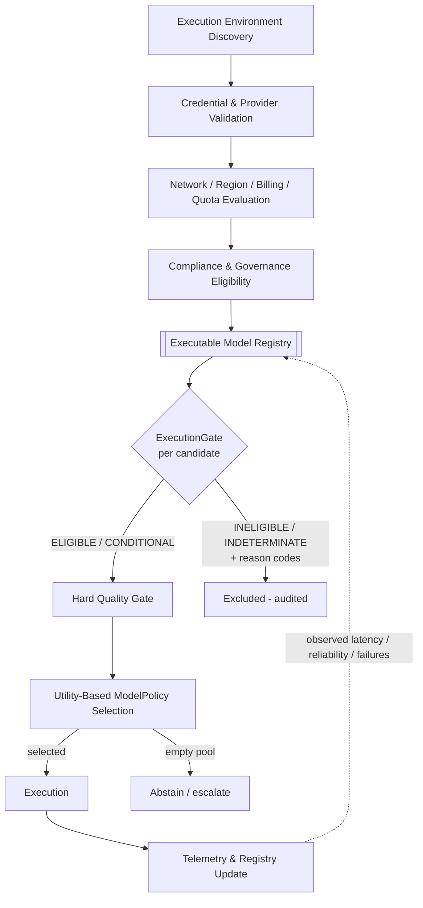

# Architecture — Execution Eligibility and Model Selection Engine

*Phase 13 deliverable. "Can execute" (ExecutionGate) is separated from "should execute"
(ModelPolicy). ExecutionGate never selects; ModelPolicy never routes to an ineligible model.*

## Pipeline



## Boundary of responsibility

```
        CAN EXECUTE?  (ExecutionGate)                 SHOULD EXECUTE?  (ModelPolicy)
   ─────────────────────────────────────────    ─────────────────────────────────────
   reachable? authenticated? billing? quota?     among ELIGIBLE only:
   model available? region? residency?           best quality / cost / latency trade-off
   enterprise-approved? features? context?        (never selects INELIGIBLE/INDETERMINATE)
   cost cap? latency? reliability?
        │  emits EligibilityDecision              │  emits Selection
        │  (state + reason codes + evidence)      │  (or abstain if pool empty)
        └──────────────► contract ◄───────────────┘
             reason codes, not raw provider errors
```

## State machine (per candidate)

```
              all required conditions PASS ─────────────► ELIGIBLE ──► selectable
   any CRITICAL-GOV != PASS ──────────────────────────► INELIGIBLE ─► excluded (fail-closed)
   any CRITICAL-OP FAIL / fail-closed UNKNOWN ────────► INELIGIBLE ─► excluded
   CRITICAL-OP UNKNOWN (billing/expiry) ──────────────► INDETERMINATE ► not selectable
   only OPERATIONAL UNKNOWN/degraded ─────────────────► CONDITIONALLY_ELIGIBLE ► selectable (ranked down)
```

## Evidence flow

Probes/telemetry/config/provider-declared → `Evidence{source, timestamp, confidence, ttl}`
→ condition verdict (stale ⇒ UNKNOWN) → aggregation (fixed precedence) → decision (TTL =
min evidence TTL) → cached until TTL → re-probed. Conflicts resolve by
`live_probe > telemetry > cache > config > provider_declared`.

## Placement relative to the frozen Model Selection Policy

ExecutionGate sits **upstream** of model selection: it produces the *executable, permitted*
candidate set; the frozen Model Selection Policy Engine (or the reference ModelPolicy here)
then chooses among them. The Hard Quality Gate remains between eligibility and utility
selection, unchanged. Nothing in the frozen experiments is modified.
