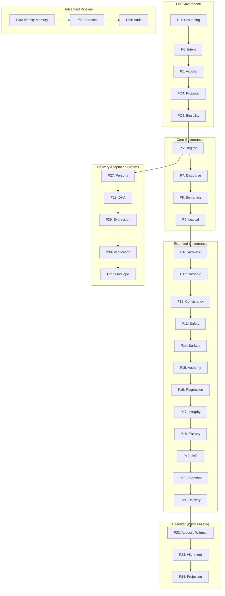

# Symbol-U Phase Architecture Comprehensive Audit Report

**Audit Date:** 2025-12-21
**Audit Version:** 1.2
**Auditor:** Claude Code Architecture Analysis
**Status:** COMPLETE

---

## Executive Summary

| Metric | Value |
|--------|-------|
| **Total Phases Implemented** | 52 |
| **Missing Phases** | P34, P37 (intentional gaps) |
| **Active Phases (in orchestrator)** | 10 (PO1-PO5, P27-P31) |
| **Dormant Phases** | 42 (implemented but not called) |
| **Deprecated Phases** | 3 (P11_controller, P11_prosodic, P15_interaction) |
| **Test Coverage - Good** | 23 phases (42.6%) |
| **Test Coverage - None** | 12 phases (22.2%) |
| **Boundary Violations** | 1 (P22 imports formulas - minor) |
| **Overall Health Score** | **72/100** |

### Phase Status Configuration

See `symbolu/mechanical/pipeline/PHASE_STATUS.yaml` for the authoritative phase status configuration.

### Key Findings

1. **Architecture is sound** - Clean three-tier separation (Core/Substrate → Observer → Governance)
2. **Significant dead code** - ~40 phases implemented but never called from orchestrator
3. **Deprecated phases** - P11_controller, P11_prosodic, P15_interaction marked for removal
4. **Missing phases** - P34 (Identity Harmonics) and P37 (Narrative Continuity) are referenced but not implemented
5. **Test coverage gaps** - 12 phases have zero tests, 14 have skeleton tests only

---

## Phase Catalog

### Directory to Phase ID Naming Convention

| Directory | Phase ID | Notes |
|-----------|----------|-------|
| `grounding/` (phase_minus_one_*) | PO1 (P-1) | Observer-Observed grounding |
| `phase_zero/` | PO2 (P0) | Intent envelope |
| `phase_one/` | PO3 (P1) | Allowed action set |
| `phase_po4/` | PO4 | Planner proposal |
| `phase_po5/` | PO5 | Execution gate |
| `phase_p6/` | P6 | Regime selection |
| `pN_*` | PN | Pattern for P7+ |

### Phase Classification

| Tier | Phases | Authority Level | Count |
|------|--------|-----------------|-------|
| **Pre-Governance** | PO1 (P-1), PO2 (P0), PO3 (P1), PO4, PO5 | FULL | 5 |
| **Core Governance** | P6-P9 | AUTHORITATIVE | 4 |
| **Extended Governance** | P10-P21 | AUTHORITATIVE | 12 |
| **Observer** | P22-P24 | ZERO (witness-only) | 3 |
| **Formula/Consciousness** | P25-P35 | OBSERVER | 10 |
| **Advanced Pipeline** | P36-P54 | OBSERVER | 18 |

### Pre-Governance Phases (PO1-PO5)

| Phase ID | Name | Location | Primary Responsibility | Status |
|----------|------|----------|----------------------|--------|
| **PO1 (P-1)** | Grounding | `grounding/` | Observer-Observed grounding, WHO is observed | ✓ Active |
| **PO2 (P0)** | Intent Envelope | `phase_zero/` | Intent inference, response posture | ✓ Active |
| **PO3 (P1)** | Allowed Action Set | `phase_one/` | Action permission constraints | ✓ Active |
| **PO4** | Planner Proposal | `phase_po4/` | Validate planner proposals | ✓ Active |
| **PO5** | Execution Gate | `phase_po5/` | Eligibility determination (non-actuating) | ✓ Active |

**Authority Flow:** `PO1 → PO2 → PO3 → PO4 → PO5`

### Core Governance Phases (P6-P9)

| Phase ID | Name | Location | Decision Type | Status |
|----------|------|----------|--------------|--------|
| **P6** | Regime Selection | `phase_p6/` | HOLD/STABILIZE/REFLECT/INFORM/CLARIFY | ⚠️ Dormant |
| **P7** | Discourse Act | `p7_discourse/` | QUESTION/REFLECTION/EXPLANATION/etc. | ⚠️ Dormant |
| **P8** | Semantic Slots | `p8_semantics/` | AGENT/TARGET/STATE/CAUSE/etc. | ⚠️ Dormant |
| **P9** | Lexical Selection | `p9_lexical/` | Word selection from curated pools | ⚠️ Dormant |

**Key Invariants:**
- Zero-LLM guarantee (pure deterministic)
- Authority flows downward only
- Conservative defaults (HOLD, DEFERRAL, empty slots)

### Extended Governance Phases (P10-P21)

| Phase ID | Name | Responsibility | Status |
|----------|------|----------------|--------|
| **P10** | Acoustic Parameterization | Acoustic parameter bounds | ⚠️ Dormant |
| **P11** | Prosodic Evidence | Witness prosodic patterns | ⚠️ Redundant (3 versions) |
| **P11b** | PPV Banding Controller | Structural generation | ⚠️ Dormant |
| **P12** | Consistency Validator | Audit acoustic-prosodic consistency | ⚠️ Dormant |
| **P13** | Acoustic Safety | Safety envelope bounds | ⚠️ Dormant |
| **P14** | Surface Realizer | Text expression plan | ⚠️ Dormant |
| **P15** | Authority Guard / Interaction | Dual implementation | ⚠️ Redundant (2 versions) |
| **P16** | Regression Guard | Hash snapshot validation | ⚠️ Dormant |
| **P17** | Semantic Integrity | Contradiction detection | ⚠️ Dormant |
| **P18** | Temporal Entropy | Stability tracking | ⚠️ Dormant |
| **P19** | Drift Fusion | Drift signal synthesis | ⚠️ Dormant |
| **P20** | Unified Snapshot | State aggregation | ⚠️ Dormant |
| **P21** | Delivery Mode | Channel permissions | ⚠️ Dormant |

### Observer Phases (P22-P24)

| Phase ID | Name | What It Witnesses | Authority |
|----------|------|-------------------|-----------|
| **P22** | Acoustic-Vṛtti Witness | Acoustic motion signatures | ZERO |
| **P23** | Alignment Observer | Inner-outer alignment | ZERO |
| **P24** | Projection Observer | Acoustic-ontology projection | ZERO |

**Critical Constraints:**
- `witness_only = True` / `observer_only = True` enforced
- FORBIDDEN_ATTRS blocks intent, regime, discourse, semantic access
- Outputs flow ONLY to allowed sinks (logs, snapshots, dashboards)

### Formula & Consciousness Phases (P25-P35)

| Phase ID | Name | Primary Output | Status |
|----------|------|----------------|--------|
| **P25** | Counterfactual Sandbox | Delta perturbation results | ✓ Observer |
| **P26** | Unified Consciousness (UCF) | COI/CSI/CIP indices | ✓ Observer |
| **P27** | Symbolic Harmonization | SHI index | ✓ **Active** |
| **P28** | Renderer Modulation | Bias + tags | ✓ **Active** |
| **P29** | Persona Resonance | Resonance profile | ✓ **Active** |
| **P30** | Cross-Layer Resonance | Mapping weights | ✓ **Active** |
| **P31** | Adaptive Persona Echo | Echo profile | ✓ **Active** |
| **P32** | Insight Window | Depth gating | ⚠️ Dormant |
| **P33** | Schema Adaptive Routing | Alignment scores | ⚠️ Dormant |
| **P34** | Identity Harmonics | **NOT IMPLEMENTED** | ❌ Missing |
| **P35** | Predictive Persona Drift | Drift prediction | ⚠️ Dormant |

### Advanced Pipeline Phases (P36-P54)

| Phase ID | Name | Status |
|----------|------|--------|
| **P36** | Identity Resonance Memory | ⚠️ Dormant |
| **P37** | Narrative Continuity | ❌ **Missing** |
| **P38** | Temporal Forecast | ⚠️ Dormant |
| **P39** | Multi-Horizon | ⚠️ Dormant |
| **P40** | Cross-Horizon Alignment | ⚠️ Dormant |
| **P41** | Scenario Regime Mapper | ⚠️ Dormant |
| **P42** | Scenario Fusion | ⚠️ Dormant |
| **P43** | Scenario What-If | ⚠️ Dormant |
| **P44** | Coherence Scenario Alignment | ⚠️ Dormant |
| **P45** | Multi-Trajectory Stability | ⚠️ Dormant |
| **P46** | Trajectory Convergence | ⚠️ Dormant |
| **P47** | Unified Trajectory Scenario | ⚠️ Dormant |
| **P48** | Macro Stability | ⚠️ Dormant |
| **P49** | Temporal Stability | ⚠️ Dormant |
| **P50** | Cognitive Consistency | ⚠️ Dormant |
| **P51** | Governance Readiness | ⚠️ Dormant |
| **P52** | Governance Adapter | ⚠️ Dormant |
| **P53** | Policy Binding | ⚠️ Dormant |
| **P54** | Audit Trace | ⚠️ Dormant |

---

## Phase Health Assessment

### Health Rating Scale

| Rating | Definition |
|--------|------------|
| 5 | Excellent - Well tested, documented, actively used |
| 4 | Good - Adequate tests, clear documentation |
| 3 | Moderate - Some tests, needs documentation |
| 2 | Poor - Skeleton tests, minimal documentation |
| 1 | Critical - No tests, potentially dead code |

### Health Scores by Phase Category

| Category | Code Quality | Test Coverage | Documentation | Arch Fit | Performance | Maintainability | **Avg** |
|----------|-------------|---------------|---------------|----------|-------------|-----------------|---------|
| Pre-Governance (PO1-5) | 5 | 5 | 5 | 5 | 5 | 5 | **5.0** |
| Core Governance (P6-9) | 5 | 4 | 5 | 5 | 5 | 4 | **4.7** |
| Extended Governance (P10-21) | 4 | 3 | 4 | 4 | 4 | 3 | **3.7** |
| Observer (P22-24) | 5 | 5 | 5 | 5 | 5 | 5 | **5.0** |
| Formula/Consciousness (P25-35) | 4 | 3 | 4 | 4 | 4 | 4 | **3.8** |
| Advanced Pipeline (P36-54) | 3 | 2 | 3 | 3 | 4 | 3 | **3.0** |

### Critical Issues

| Phase | Issue | Severity | Impact |
|-------|-------|----------|--------|
| P11 | 3 redundant implementations | HIGH | 5,708 LOC dead code |
| P15 | 2 redundant implementations | MEDIUM | Confusion over purpose |
| P34 | Missing (referenced but not implemented) | MEDIUM | Gracefully handled |
| P37 | Missing (referenced but not implemented) | MEDIUM | Gracefully handled |
| P22 | Imports from formulas/ (boundary violation) | LOW | Minor, documented |

---

## Obsolete/Redundant Phase Analysis

### P11 - THREE IMPLEMENTATIONS (Critical)

| Variant | Location | Lines | Usage | Recommendation |
|---------|----------|-------|-------|----------------|
| p11_controller | `p11_controller/` | 2,987 | 0 orchestrator calls | **REMOVE** |
| p11_prosodic | `p11_prosodic/` | ~500 | Internal only | **REMOVE** |
| p11b_controller | `p11b_controller/` | 2,721 | 0 orchestrator calls | **KEEP as replacement** |

**Migration Path:**
1. Archive p11_controller and p11_prosodic to `/restoration/experiments/`
2. If P11 needed, use p11b_controller as canonical implementation
3. Update documentation to reflect single implementation

### P15 - TWO IMPLEMENTATIONS (Medium)

| Variant | Purpose | Recommendation |
|---------|---------|----------------|
| p15_authority_guard | Regression guard, snapshot immutability | **KEEP** |
| p15_interaction | Interaction mode resolver | **MERGE into P15** |

**Migration Path:**
1. Rename p15_authority_guard to `p15/` (canonical)
2. Merge interaction mode into authority guard module
3. Single P15 with both capabilities

### Missing Phases (P34, P37)

| Phase | Referenced By | Status | Recommendation |
|-------|---------------|--------|----------------|
| P34 | P35, P36, formulas | Graceful degradation | **IMPLEMENT or DOCUMENT as deferred** |
| P37 | macro_stability_regulator.py | Graceful degradation | **IMPLEMENT or DOCUMENT as deferred** |

---

## Deep Dive: P12 (Consistency Validator) & P14 (Surface Realizer)

### P12 - Acoustic-Prosodic Consistency Validator

**Status:** DORMANT (fully implemented, not called from orchestrator)
**Location:** `symbolu/mechanical/pipeline/p12_consistency/`
**Lines of Code:** ~1,163 LOC
**Authority Level:** ZERO (audit-only, non-actuating)

#### Architecture

P12 is an **audit-only** phase that validates consistency between upstream phase outputs without modifying behavior. It operates as a truth-preserving audit layer.

```
Authority Model:
- Consumes ALL upstream phase outputs (read-only)
- Cannot mutate any upstream output
- Cannot block, redirect, alter regime, or alter discourse
- Produces P12ConsistencyReport (read-only, non-actuating)
- Violations reported upward, never corrected
```

#### Invariant Checks (17 total)

| Check Category | Description |
|----------------|-------------|
| Regime-Acoustic | Regime decisions match acoustic parameterization |
| Discourse-Prosody | Discourse acts align with prosodic patterns |
| Semantic-Lexical | Semantic slots consistent with lexical selection |
| Safety-Surface | Safety constraints respected in surface realization |
| Authority Flow | Downstream phases don't exceed upstream authority |

#### Integration API

```python
from .p12_consistency.p12_integration import maybe_run_p12

# After P11 stage
maybe_run_p12(ctx)
# ctx.p12_consistency now contains P12ConsistencyReport
```

#### LLM Governance Opportunity

P12 is strategically positioned to validate LLM outputs against Symbol-U governance constraints:
- Check if LLM-generated acoustic features respect regime bounds
- Validate prosodic consistency with discourse act decisions
- Report violations for upstream correction or rejection

#### Work Needed

| Item | Priority | Effort |
|------|----------|--------|
| Activate in orchestrator | P1 | Low |
| Add LLM output validation hooks | P2 | Medium |
| Expand violation types for LLM edge cases | P2 | Medium |
| Dashboard integration for violation metrics | P3 | Medium |

---

### P14 - Expression Surface Realizer

**Status:** DORMANT (fully implemented, not called from orchestrator)
**Location:** `symbolu/mechanical/pipeline/p14_surface/`
**Lines of Code:** ~640 LOC
**Authority Level:** AUTHORITATIVE (produces constraints, not text)

#### Architecture

P14 produces a **SurfacePlan**, NOT text. It is a pre-acoustic, pre-renderer phase that constrains how downstream renderers produce text.

```
Critical Principle:
- P14 produces a SurfacePlan, not text
- P14 is CONSTRAINED by P13 (safety envelope)
- Downstream renderers consume the SurfacePlan
```

#### SurfacePlan Policies

| Policy Type | Options |
|-------------|---------|
| **SurfaceStyle** | MINIMAL, DEFERRAL_MINIMAL, GENTLE, NEUTRAL, FORMAL |
| **PunctuationPolicy** | BASIC_PERIODS, STANDARD, EXPRESSIVE |
| **HedgePolicy** | NONE, LIGHT, STANDARD |
| **LengthPolicy** | ONE_SENTENCE, SHORT, MEDIUM, BULLETS_ALLOWED |
| **PersonaSignalPolicy** | NONE, SUBTLE, STANDARD |

#### Integration API

```python
from .p14_surface.p14_integration import maybe_run_p14

# After P13 stage (P14 is constrained by P13)
maybe_run_p14(ctx)
# ctx.p14_surface now contains SurfacePlan

# Style accessors
from .p14_surface.p14_integration import (
    is_minimal, is_formal, allows_exclamation,
    allows_bullets, get_max_sentences, get_forbidden_tokens
)
```

#### LLM Output Shaping

P14 is designed to constrain LLM outputs without modifying them directly:
- **Forbidden tokens**: Tokens the LLM must NOT emit (e.g., "certainly", "delighted")
- **Style constraints**: Formality level, hedging requirements
- **Length limits**: Maximum sentences, bullet permission
- **Punctuation bounds**: Whether exclamation marks/ellipsis allowed

#### Work Needed

| Item | Priority | Effort |
|------|----------|--------|
| Activate in orchestrator | P1 | Low |
| LLM token sampler integration | P2 | High |
| Add forbidden token enforcement layer | P2 | Medium |
| Expand style presets for domain-specific use | P3 | Medium |
| Renderer integration (consume SurfacePlan) | P2 | High |

---

### P12 + P14 Synergy for LLM Governance

Together, P12 and P14 form a governance sandwich for LLM outputs:

```
┌─────────────────────────────────────────────────────────────┐
│                    LLM OUTPUT GOVERNANCE                    │
├─────────────────────────────────────────────────────────────┤
│  P14 (Surface Realizer)                                     │
│  ├── Produces SurfacePlan with style/length/token policies  │
│  ├── Constrains what LLM CAN emit                           │
│  └── Pre-generation constraint layer                        │
├─────────────────────────────────────────────────────────────┤
│  LLM (External)                                             │
│  ├── Generates text within P14 constraints                  │
│  └── Output candidates for validation                       │
├─────────────────────────────────────────────────────────────┤
│  P12 (Consistency Validator)                                │
│  ├── Audits LLM output against governance rules             │
│  ├── Reports violations (never corrects)                    │
│  └── Post-generation validation layer                       │
└─────────────────────────────────────────────────────────────┘
```

**Integration Roadmap:**
1. Activate P14 → produce SurfacePlan for LLM prompting
2. Feed SurfacePlan constraints to LLM sampling (token bans, style guidance)
3. Activate P12 → validate LLM output against all upstream constraints
4. Report P12 violations to enable rejection/retry logic

---

## Gap Analysis

### Functional Gaps

| Gap | Description | Proposed Solution |
|-----|-------------|-------------------|
| **P34 Identity Harmonics** | Referenced but not implemented | Implement or remove references |
| **P37 Narrative Continuity** | Referenced but not implemented | Implement or remove references |
| **Orchestrator Integration** | 40+ phases not called | Document as deferred or add activation |
| **Test Coverage** | 12 phases with 0 tests | Establish minimum test requirements |

### Architectural Gaps

| Gap | Impact | Proposed Solution |
|-----|--------|-------------------|
| No phase activation framework | Can't enable/disable phases | Add phase_config.yaml |
| Missing phase version management | Version drift risk | Add semver to all phase schemas |
| No cross-phase metrics dashboard | Observability gap | Implement phase health dashboard |

### Missing Validation Layers

| Layer | Current State | Recommendation |
|-------|--------------|----------------|
| Schema validation | Per-phase, inconsistent | Standardize with Pydantic |
| Invariant enforcement | Code-based, scattered | Centralize in policy engine |
| Boundary enforcement | Tests exist | Add CI/CD gates |

---

## Recommendations

### Immediate (P0 - This Week)

1. **Document phase status** - Create PHASE_STATUS.md marking each phase as ACTIVE/DORMANT/DEFERRED
2. **Archive dead code** - Move p11_controller, p11_prosodic to restoration/experiments/
3. **Add test requirements** - Minimum 50 tests per active phase

### Short-term (P1 - This Month)

1. **Implement P34/P37** or remove references and document as deferred
2. **Consolidate P15** into single implementation
3. **Create phase activation config** - YAML-based enable/disable
4. **Expand test coverage** - Target 80%+ for active phases

### Medium-term (P2 - This Quarter)

1. **Add observability** - Phase health dashboard with metrics
2. **Standardize schemas** - Migrate all phases to consistent Pydantic models
3. **Document tier boundaries** - Formal specification with enforcement tests
4. **Create phase dependency graph** - Auto-generated from imports

### Long-term (P3 - This Year)

1. **Activate dormant phases** - Gradual rollout with feature flags
2. **Performance optimization** - Profile hot paths (P6-P9)
3. **API versioning** - Semantic versioning for phase contracts
4. **External governance integration** - Enable P51-P54 for external policy binding

---

## Phase Dependency Graph



---

## Invariant Catalog

### Phase-Level Invariants

| Invariant ID | Phase | Description | Enforcement |
|--------------|-------|-------------|-------------|
| INV-PO1-1 | P-1 | Authority flows downward | Code |
| INV-PO1-2 | P-1 | BLOCKED policy halts pipeline | Code |
| INV-P6-1 | P6 | HOLD always safe | Code |
| INV-P7-1 | P7 | DEFERRAL always safe | Code |
| INV-P8-1 | P8 | Never hallucinate slot values | Code |
| INV-P9-1 | P9 | Only select from curated pools | Code |
| INV-P22-1 | P22 | witness_only = True | Schema |
| INV-P23-1 | P23 | observer_only = True | Schema |
| INV-P24-1 | P24 | observer_only = True | Schema |

### System-Wide Invariants

| Invariant ID | Description | Enforcement |
|--------------|-------------|-------------|
| INV-B1 | No imports from observer in governance | Test |
| INV-B2 | Observer outputs only to allowed sinks | Test |
| INV-B3 | Behavioral non-interference | Test |
| INV-B4 | Boundary scanner in CI | CI/CD |

---

## Appendix A: File Paths Reference

### Active Components
```
symbolu/mechanical/pipeline/orchestrator.py
symbolu/mechanical/pipeline/grounding/
symbolu/mechanical/pipeline/phase_zero/
symbolu/mechanical/pipeline/phase_one/
symbolu/mechanical/pipeline/p27_persona/
symbolu/mechanical/pipeline/p28_dha/
symbolu/mechanical/pipeline/p29_expression/
symbolu/mechanical/pipeline/p30_verification/
symbolu/mechanical/pipeline/p31_envelope/
```

### Dormant Components
```
symbolu/mechanical/pipeline/phase_p6/
symbolu/mechanical/pipeline/p7_discourse/
symbolu/mechanical/pipeline/p8_semantics/
symbolu/mechanical/pipeline/p9_lexical/
symbolu/mechanical/pipeline/p10_acoustic/
... (P10-P54 except P27-P31)
```

### Redundant/Dead Code
```
symbolu/mechanical/pipeline/p11_controller/     # 2,987 LOC
symbolu/mechanical/pipeline/p11_prosodic/       # ~500 LOC
symbolu/mechanical/pipeline/p11b_controller/    # 2,721 LOC (keep as canonical)
symbolu/mechanical/pipeline/p15_authority_guard/
symbolu/mechanical/pipeline/p15_interaction/
```

---

## Appendix B: Test Coverage Summary

| Category | Good (50+) | Moderate (10-49) | Poor (1-9) | None |
|----------|------------|------------------|------------|------|
| Pre-Governance | 5 | 0 | 0 | 0 |
| Core Governance | 4 | 0 | 0 | 0 |
| Extended Governance | 8 | 2 | 2 | 0 |
| Observer | 3 | 0 | 0 | 0 |
| Formula/Consciousness | 3 | 2 | 3 | 3 |
| Advanced Pipeline | 0 | 2 | 9 | 9 |
| **Total** | **23** | **6** | **14** | **12** |

---

## Appendix C: LLM Integration Proposal Analysis

### Overview

This section analyzes external recommendations for LLM integration contracts and provides Symbol-U-aligned counter-recommendations.

---

### Proposal 1: LLM Adapter Contract

#### External Recommendation Summary

An `PHASE_LLM_ADAPTER_CONTRACT.md` that:
- Translates SurfacePlan (P14) + minimal context into LLM requests
- Returns candidate text + trace for P12 validation
- Enforces determinism, non-selection, no semantics injection
- Produces `LLMRequestEnvelope` + `LLMAdapterTrace`

#### Analysis

| Aspect | Assessment | Notes |
|--------|------------|-------|
| **Determinism requirement** | ✓ Aligned | Matches Symbol-U zero-LLM guarantee philosophy |
| **Trace completeness** | ✓ Good | Enables P12 post-validation |
| **"No Selection" invariant** | ⚠️ Imprecise | References "Phase-7 scores/ranks" but P7 is discourse act selection, not ranking |
| **Authority model** | ❌ Missing | No mention of Symbol-U's three-tier authority (FULL/AUTHORITATIVE/ZERO) |
| **Boundary semantics** | ❌ Missing | Should enforce witness_only/observer_only at adapter level |
| **Failure modes** | ✓ Good | Covers key failure cases |

#### Claude Recommendation

```
PHASE_LLM_ADAPTER_CONTRACT.md should be restructured to:

1. AUTHORITY ALIGNMENT
   - Adapter operates at ZERO authority (non-actuating)
   - Cannot mutate upstream context
   - Cannot block, redirect, or alter governance decisions
   - Produces LLMAdapterTrace (read-only, witness semantics)

2. INPUT BOUNDARY ENFORCEMENT
   - Explicit allowlist of consumed context attributes
   - Type-level enforcement: adapter receives ImmutableSurfacePlan
   - Hash upstream inputs for audit trail

3. OUTPUT BOUNDARY ENFORCEMENT
   - CandidateText is UNTRUSTED until P12 validation
   - Adapter must NOT post-process LLM output
   - All outputs flow to P12 for gating decision

4. INVARIANTS (Symbol-U aligned)
   - INV-ADAPTER-1: Adapter is deterministic (same inputs → same request)
   - INV-ADAPTER-2: Adapter is non-actuating (cannot modify pipeline state)
   - INV-ADAPTER-3: Adapter preserves authority bounds (respects upstream decisions)
   - INV-ADAPTER-4: Adapter traces are immutable and hashable
   - INV-ADAPTER-5: No forbidden token leakage (adapter cannot bypass P14 constraints)

5. MISSING FROM EXTERNAL PROPOSAL
   - Integration with P13 (Safety Envelope) - adapter should validate
     request stays within safety bounds BEFORE sending to LLM
   - Regime-aware request shaping (P6 regime affects prompt framing)
   - Discourse-act alignment (P7 discourse constrains response type)
```

---

### Proposal 2: SurfacePlan → System Prompt Compiler

#### External Recommendation Summary

A `surfaceplan_prompt_compiler.py` that:
- Deterministically compiles SurfacePlan into system prompts
- Maps style/punctuation/hedging/length/forbidden_tokens
- Uses canonical template with `[CONSTRAINT_UNSATISFIABLE]` fallback

#### Analysis

| Aspect | Assessment | Notes |
|--------|------------|-------|
| **Deterministic compilation** | ✓ Good | Essential for reproducibility |
| **Policy mappings** | ⚠️ Incomplete | Missing PersonaSignalPolicy from P14 |
| **Template approach** | ✓ Good | Structured, auditable |
| **CONSTRAINT_UNSATISFIABLE output** | ❌ Problematic | Leaks internal state to LLM output; should be handled pre-generation |
| **Hash-based trace** | ✓ Good | Enables P12 validation |
| **Test cases** | ✓ Good | Covers key determinism tests |

#### Claude Recommendation

```
SURFACEPLAN_PROMPT_COMPILER_SPEC.md should be enhanced:

1. COMPLETE POLICY MAPPINGS
   Add missing PersonaSignalPolicy:
   - NONE → "Do not signal persona traits."
   - SUBTLE → "Persona may be implied but not stated."
   - STANDARD → "Persona traits may be expressed naturally."

2. PRE-GENERATION CONSTRAINT VALIDATION
   Replace [CONSTRAINT_UNSATISFIABLE] with:
   - Compiler validates constraints are satisfiable BEFORE generating prompt
   - If unsatisfiable → return CompilerError, do NOT proceed to LLM
   - Example: ONE_SENTENCE + requires_question + HEDGING_REQUIRED may conflict

3. P13 SAFETY INTEGRATION
   Compiler should consume P13SafetyEnvelope and embed:
   - Maximum acoustic intensity bounds
   - Forbidden emotional amplification flags
   - Certainty suppression requirements
   These become additional system prompt constraints.

4. REGIME-AWARE FRAMING
   If P6 regime is available, compiler should adjust framing:
   - HOLD → "Respond minimally. Avoid new commitments."
   - CLARIFY → "Ask clarifying questions. Do not assume."
   - INFORM → "Provide factual information only."
   - REFLECT → "Mirror user's concern. Do not advise."

5. CANONICAL TEMPLATE (revised)
   ```
   You are a constrained surface realizer operating under Symbol-U governance.

   REGIME: <regime_label>
   DISCOURSE: <discourse_act>

   HARD CONSTRAINTS (violation = rejection):
   - STYLE: <style_rule>
   - LENGTH: <length_rule>
   - PUNCTUATION: <punct_rule>
   - HEDGING: <hedge_rule>
   - QUESTION_REQUIRED: <true/false>
   - PERSONA_SIGNAL: <persona_rule>

   FORBIDDEN TOKENS (case-insensitive):
   <sorted_token_list>

   SAFETY BOUNDS (from P13):
   - Max emotional intensity: <bound>
   - Certainty allowed: <true/false>
   - Emphasis allowed: <true/false>

   OUTPUT RULES:
   - Comply with ALL constraints above.
   - Do not explain or reference constraints.
   - Do not add content beyond user request.
   ```

6. COMPILER INVARIANTS
   - INV-COMPILER-1: Deterministic (same SurfacePlan → identical prompt bytes)
   - INV-COMPILER-2: Stable ordering (forbidden tokens sorted alphabetically)
   - INV-COMPILER-3: Complete (all SurfacePlan fields mapped to prompt lines)
   - INV-COMPILER-4: Bounded (prompt length < MAX_PROMPT_TOKENS)
   - INV-COMPILER-5: Traceable (compiler emits hash of all inputs + output)
```

---

### Proposal 3: P6-P7 Minimal Activation Plan

#### External Recommendation Summary

Activate P6 (Regime) + P7 (Discourse) first:
- Keep P8 (Semantics) + P9 (Lexical) dormant initially
- Feature flags: ENABLE_P6, ENABLE_P7, ENABLE_P14, ENABLE_P12
- Fail-safe defaults: P6 errors → HOLD, P7 errors → DEFERRAL

#### Analysis

| Aspect | Assessment | Notes |
|--------|------------|-------|
| **P6+P7 first** | ✓ Sound | Minimal upstream governance for P14 meaningfulness |
| **P8+P9 dormant** | ✓ Reasonable | Avoids semantic slot complexity initially |
| **Feature flags** | ✓ Good | Gradual rollout capability |
| **Fail-safe defaults** | ⚠️ Incomplete | Should specify authority preservation |
| **P10 consideration** | ❌ Missing | P10 (Acoustic) bridges governance to P11b/P12/P13 |
| **P11b integration** | ❌ Missing | Canonical P11b should be part of activation path |
| **Test requirements** | ✓ Good | Covers key scenarios |

#### Claude Recommendation

```
P6_P7_MINIMAL_ACTIVATION_PLAN.md should be revised:

1. ACTIVATION SEQUENCE (recommended)

   Phase 1 (Core Governance):
   ├── P6 (Regime Selection) - ACTIVATE
   └── P7 (Discourse Act) - ACTIVATE

   Phase 2 (Acoustic Bridge):
   ├── P10 (Acoustic Parameterization) - ACTIVATE
   └── P11b (PPV Banding Controller) - ACTIVATE (canonical)

   Phase 3 (Validation Layer):
   ├── P12 (Consistency Validator) - ACTIVATE
   ├── P13 (Acoustic Safety) - ACTIVATE
   └── P14 (Surface Realizer) - ACTIVATE

   Phase 4 (Semantic Depth - deferred):
   ├── P8 (Semantic Slots) - KEEP DORMANT
   └── P9 (Lexical Selection) - KEEP DORMANT

   Rationale: P10/P11b provide acoustic context that P12/P13/P14 need
   to produce meaningful constraints. Without P10, SurfacePlan lacks
   acoustic grounding.

2. AUTHORITY PRESERVATION INVARIANTS
   - If P6 fails → regime = HOLD (minimum authority, maximum safety)
   - If P7 fails → discourse_act = DEFERRAL (no commitment)
   - If P10 fails → acoustic = SUPPRESSED_ALL (no intensity)
   - If P11b fails → prosodic = NEUTRAL (no prosodic features)
   - If P14 fails → surface_plan = DEFERRAL_MINIMAL (one clarifying question)

   Key: Failures always reduce authority, never increase it.

3. FEATURE FLAGS (expanded)
   ```yaml
   phase_activation:
     # Phase 1
     ENABLE_P6: true
     ENABLE_P7: true
     # Phase 2
     ENABLE_P10: true
     ENABLE_P11B: true
     # Phase 3
     ENABLE_P12: true
     ENABLE_P13: true
     ENABLE_P14: true
     # Phase 4 (deferred)
     ENABLE_P8: false
     ENABLE_P9: false
     # LLM Integration
     ENABLE_LLM_ADAPTER: false  # Requires P12+P14 stable first
   ```

4. ORCHESTRATOR WIRING (revised)
   ```
   PO1 → PO2 → PO3 → PO4 → PO5 (existing, active)
        ↓
   maybe_run_p6(ctx)  → ctx.regime
        ↓
   maybe_run_p7(ctx)  → ctx.discourse_act
        ↓
   maybe_run_p10(ctx) → ctx.p10_acoustic
        ↓
   maybe_run_p11b(ctx) → ctx.p11_prosodic (canonical)
        ↓
   maybe_run_p13(ctx) → ctx.p13_safety_envelope
        ↓
   maybe_run_p14(ctx) → ctx.p14_surface_plan
        ↓
   [LLM ADAPTER - future] → candidate_text
        ↓
   maybe_run_p12(ctx) → ctx.p12_consistency_report
        ↓
   gating_decision(ctx) → ACCEPT / REJECT / FALLBACK
   ```

5. INTEGRATION TESTS (minimum set)
   - test_p6_hold_propagates_to_p14_minimal_style
   - test_p7_deferral_forces_question_required
   - test_p10_suppression_bounds_p13_safety
   - test_p11b_neutral_preserves_acoustic_bounds
   - test_p12_violation_triggers_gating_reject
   - test_p14_surfaceplan_deterministic
   - test_end_to_end_governance_chain
   - test_failure_cascade_reduces_authority
   - test_existing_p27_p31_unaffected

6. ROLLBACK PLAN
   - Each phase has independent feature flag
   - Rollback order: P14 → P13 → P12 → P11b → P10 → P7 → P6
   - Rollback trigger: >1% of requests hitting unexpected failure mode
   - Monitoring: P12 violation rate, gating rejection rate, latency P95
```

---

### Summary: Claude vs External Recommendations

| Deliverable | External Approach | Claude Recommendation |
|-------------|-------------------|----------------------|
| **LLM Adapter** | Deterministic, trace-complete | Add authority model, boundary enforcement, P13 integration |
| **Prompt Compiler** | Template-based, hash-traced | Add PersonaSignalPolicy, pre-validation, regime framing, P13 bounds |
| **Activation Plan** | P6+P7 first, flags | Add P10/P11b to initial slice, explicit authority preservation, expanded test matrix |

### Key Divergences

1. **Authority Model**: External proposals don't address Symbol-U's three-tier authority system. All contracts should explicitly state their authority level (FULL/AUTHORITATIVE/ZERO).

2. **P10/P11b Inclusion**: Activating P6+P7 without P10/P11b leaves P12/P13/P14 without acoustic context. The "minimal slice" should include the acoustic bridge.

3. **Pre-Validation vs Post-Fallback**: External proposals use `[CONSTRAINT_UNSATISFIABLE]` as LLM output. Symbol-U principle: validate BEFORE generation, not after.

4. **Boundary Semantics**: Symbol-U's `witness_only`/`observer_only` patterns should extend to the LLM adapter layer.

---

## Document Certification

This audit report constitutes a comprehensive analysis of the Symbol-U pipeline architecture. All findings are based on static code analysis, test coverage analysis, and import dependency scanning performed on 2025-12-21.

**Recommendations Priority:**
- P0 (Immediate): 3 items
- P1 (Short-term): 4 items
- P2 (Medium-term): 4 items
- P3 (Long-term): 4 items

**Next Steps:**
1. Review this report with engineering team
2. Prioritize P0 recommendations
3. Create tracking issues for P1-P3 items
4. Schedule quarterly re-audit

---

*End of Audit Report*
