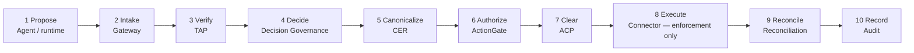
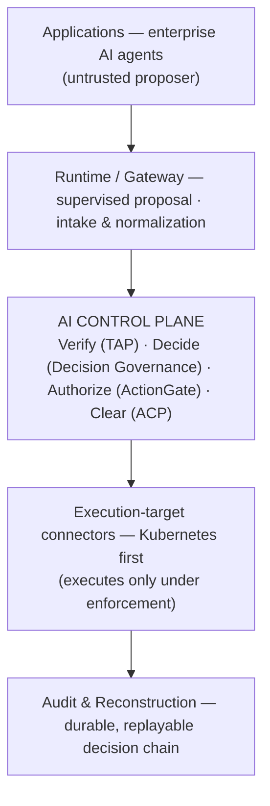

<!--
  BUILD NOTE. This markdown is the authoritative source for the styled Word
  document. Rendering/styling guidance (palette, fonts, header/footer, badges,
  page setup, and a suggested build command) is in "Appendix B — Document
  Production Notes" at the end. Diagrams are provided as Mermaid (renders on
  GitHub and in Mermaid-aware pipelines) with a descriptive table beside each so
  the content survives any converter that does not render Mermaid.

  This document is the commercial productization plan. The internal engineering
  source it draws on — ACP/UGENCE_UNIFIED_CONSOLE_PLAN.md — is preserved
  separately and is NOT superseded by this document.
-->

# Ugence AI Control Plane
## Productization and Unified Console Plan

> **Consolidating implemented governance technologies into one enterprise-deployable product**

*Confidential — shared for investor and design-partner evaluation.*

### Positioning

**Today.** Implemented governance kernels, runtime contracts, controlled evidence,
and a working **action-control vertical slice**.

**After the pre-seed round.** One secure, repeatable, **enterprise-deployable
Ugence AI Control Plane** — with a unified console, stable APIs, enterprise
connectors, durable audit, human review, and controlled enforcement.

> Agent runtimes determine what an AI wants to do. **Ugence governs whether that
> exact proposed action may proceed** — under evidence, policy, human authority,
> and current operational state.

**Maturity legend (used throughout):**
`[BUILT]` implemented and verified in the repository ·
`[PLANNED]` scoped, not yet built ·
`[PILOT-READY]` packaged for shadow-mode evaluation ·
`[PRODUCTION-REQUIRED]` required before production.

---

## Executive summary

**What Ugence is building.** One enterprise-deployable product — the **Ugence AI
Control Plane** — that governs what enterprise AI agents may claim, recommend,
decide, and do. It is not fourteen separate research modules; it is a single
governed-execution layer with a unified console, stable APIs, enterprise
connectors, durable audit, human review, and controlled enforcement.

**The problem it solves.** Enterprises can build an AI agent in an afternoon, but
cannot let it act on a payment system, a production database, or a Kubernetes
cluster with confidence. The runtime that proposes an action should not also be
the authority that approves it.

**What exists today.** Implemented governance kernels and runtime contracts,
controlled internal evidence, and a **working action-control vertical slice**: a
dedicated backend service and a separate console app that run a proposed
Kubernetes action through verification, authorization, and operational clearance —
threaded end-to-end and recorded for reconstruction.

**What the current prototype demonstrates.** That the governance modules compose
into one governed loop with a single auditable trail, and that the loop is
**fail-closed and non-compensatory** — a clean authorization cannot buy back an
unsupported assertion or an operational hold.

**What Phase 1 is — and is not.** Phase 1 is an **action-control vertical slice**,
not the complete production product. It evaluates and records; it does not yet
carry multi-tenant identity, human authority binding, durable audit, live
execution connectors, or reconciliation.

**What remains to be productized.** The connective tissue that turns
modules-that-pass-tests into one product a customer runs: tenant identity and
isolation, policy and authority services, durable tamper-evident audit, a human
review queue, runtime and execution connectors, controlled enforcement, and
reconciliation.

**What the pre-seed capital funds.** Building that connective tissue into one
secure, repeatable, enterprise-deployable v1, and running a paid design-partner
pilot on the Kubernetes infrastructure-agent wedge.

**The milestone the round achieves.** A first enterprise **Ugence Agent Control
Pilot** progressing from shadow to selected controlled enforcement, with
preregistered success criteria and a complete, reconstructable audit trail.

---

## 1 · The problem and positioning

Modern AI has excellent parts and a missing middle. Foundation models reason;
orchestration frameworks wire; clouds host. None of them governs execution, and
none supervises it independently of the runtime that proposes it.

Security systems determine *who may access* a system. Agent runtimes determine
*what an AI wants to do*. **Ugence governs whether that exact proposed action may
proceed** — under evidence, policy, human authority, and current operational
state — and records a reconstructable decision trail. Monitoring tools report what
an agent *did*, after the fact, and hold no authority to stop it. Ugence sits
*before* commit and can allow, constrain, escalate, or deny.

The risk enterprises now face has shifted from *output quality* to *enterprise
consequence*: a wrong database write, an unauthorized payment, a deleted resource,
an unsupported claim presented as fact. That is the risk Ugence is built to
govern.

---

## 2 · What exists today

Ugence has substantial software proof today; the round buys business proof. Two
things are true at once and are kept distinct throughout this document:

- **The governance mechanisms exist.** Implemented governance kernels (action
  authorization, assertion verification, operational clearance), runtime contracts
  (the Canonical Execution Request), and controlled internal evidence.
- **The product does not yet exist.** There is no multi-tenant identity, no durable
  audit, no live execution against customer systems, and no external pilot result.

The current prototype — the **action-control vertical slice** — is the first proof
that the mechanisms compose into one operable loop. It runs the platform's primary
commercial wedge, an enterprise Kubernetes / infrastructure-agent action, through
verification, authorization, and operational clearance in shadow mode, and records
the chain for reconstruction.

> **Stage discipline.** No capability in this document is claimed as
> production-validated. Metrics that exist today are from internal repositories and
> synthetic or internally-authored scenarios. That gap — from repository-proven to
> pilot-proven — is precisely what the round closes.

### Today → Productization → Commercial outcome

> **[INSERT FIGURE 1 — "Today → Productization → Commercial outcome" transition
> graphic.]** Render the three-column table below as a styled graphic (three
> colored columns: muted / blue / green headers, left→right arrows between them).
> The table carries the content if no image is produced.

| Today | After the pre-seed round | Commercial outcome |
|---|---|---|
| Implemented governance kernels | Unified enterprise console | First paid design-partner pilot |
| Runtime contracts (CER) | Stable, versioned APIs | Shadow → selected enforcement |
| Controlled internal evidence | Enterprise connectors | Preregistered success criteria |
| Action-control vertical slice | Durable audit + human review | Reconstructable audit trail |
|  | Controlled enforcement |  |

*Figure 1. Today → Productization → Commercial outcome.*

---

## 3 · Product scope — one product, not fourteen

The enterprise buys **one** platform. Beneath it, a defined set of components
covers the "what AI says, recommends, decides, and does" boundary. Adjacent
research and infrastructure assets exist but are **not** customer-facing v1
surfaces.

### Live v1 product components

| Component | Role in the product |
|---|---|
| Agent Runtime / runtime connector layer | Supervised proposal of actions as a governable request |
| Truth Assurance Platform (TAP) | Verify whether an assertion is supported by evidence |
| Decision Governance | Confirm who holds binding authority to decide |
| ActionGate | Authorize whether this exact action may execute |
| Autonomous Control Plane (operational clearance) | Confirm the authorized action is operationally safe now |
| Audit and Reconstruction | Preserve the complete, replayable decision chain |

### Optional product accelerators

| Accelerator | Role |
|---|---|
| Context Minimization | Reduce and normalize admitted context without changing authorization |
| Governed Model Selection | Choose an eligible model under policy and evidence obligation |

### Excluded from customer-facing v1 (adjacent IP · infrastructure · future accelerators)

Hybrid LLM (research interface) · LLM Steering (research interface) · BCVF
physical-autonomy runtime · KVPro · CTM+/PCAM · Cloud Scaling Controller · PSE.

These are valuable IP and infrastructure assets. They are **not** primary console
navigation items and are not part of the v1 commercial boundary. They may become
future accelerators or separately-positioned assets.

> Note the deliberate distinction: the **Autonomous Control Plane** (operational
> clearance) is in v1; the **BCVF physical-autonomy runtime** is not. They are
> different components with different roles.

---

## 4 · The governed product lifecycle

The current prototype demonstrates a simplified loop. The productized lifecycle is
longer and more explicit:

> **Propose → Intake → Verify → Decide → Canonicalize → Authorize → Clear →
> Execute → Reconcile → Record**

> **[INSERT FIGURE 2 — governed-loop diagram.]** Render the Mermaid block below as
> a horizontal ten-stage flow image. If your pipeline does not render Mermaid,
> export it to PNG/SVG and place the image here; the stage table beneath carries
> the same content as a fallback.



*Figure 2. The ten-stage governed product lifecycle.*

| # | Stage | Owner | What happens |
|---|---|---|---|
| 1 | Propose | Agent / runtime | An assertion, recommendation, or action is proposed |
| 2 | Intake | Gateway | Normalize tenant, workflow, identity, evidence references, and action data |
| 3 | Verify | Truth Assurance Platform | Verify assertions and evidence before reliance |
| 4 | Decide | Decision Governance | Confirm who holds binding authority to decide |
| 5 | Canonicalize | Control plane | Convert the exact action into a Canonical Execution Request (CER) |
| 6 | Authorize | ActionGate | Determine whether that exact action is authorized |
| 7 | Clear | Autonomous Control Plane | Determine whether the authorized action is operationally safe now |
| 8 | Execute | Execution connector | Perform the action **only when enforcement is enabled** |
| 9 | Reconcile | Reconciliation | Verify that execution matched authorization |
| 10 | Record | Audit | Preserve the complete chain |

**Context Minimization is an optional accelerator at intake, not the gateway
itself.** The gateway is the normalization and identity boundary; Context
Minimization, when enabled, reduces admitted context inside that boundary without
altering authorization.

---

## 5 · Current implementation evidence

Built today, stated conservatively. "Verification artifact" refers to internal
repository code and tests, not third-party validation.

| Capability | Status | Verification artifact | Known limitation | Next productization requirement |
|---|---|---|---|---|
| Dedicated console API service | `[BUILT]` (Phase 0/1) | `ugence_console_api/` FastAPI factory; `/health` module probes | In-process calls; no auth; in-memory state | Multi-tenant identity; secure versioned APIs |
| Separate console frontend | `[BUILT]` | `apps/console/` (Vite/React); Governed-Loop, Modules, Audit views | Engineering-oriented navigation; no RBAC | Enterprise workflow navigation; review queue; RBAC |
| Truth & Evidence (TAP) | `[BUILT]` wired — emerging | `truth_evidence` adapter → real TAP engine; `/v1/assertions/evaluate` | Synthetic evaluation; single prototype layer | Human validation; multi-layer hardening |
| Action Control (ActionGate) | `[BUILT]` wired — real engine | `action_control` adapter → real ActionGate; CER identity computed | No kernel-bound CER; no JIT credential or enforcement | Kernel CER binding; exact-action credentials; commit-time recheck |
| Operational clearance (ACP, digital sibling) | `[BUILT]` wired — deterministic gate | `operational_safety` adapter; CLEAR / HOLD verdicts | Digital sibling, not the robotics ACP engine; fixed thresholds | Policy-driven signals; ACP engine integration |
| Agent Gateway accelerator (Context Minimization) | `[BUILT]` wired — structural path | `context_gateway` adapter → `structural_compress` | Model-free structural dedup only | Authorization-preserving compressor; intake normalization |
| Decision Governance | `[PLANNED]` not yet in loop | `decision_governance` kernel (frozen public API) exists | Not surfaced in the console loop | Authority-binding stage (Phase 2) |
| Governed-loop orchestration | `[BUILT]` (shadow) | Orchestrator; three Kubernetes scenarios; non-compensatory gates | Evaluation-only; no execution or reconciliation | Execution connector; reconciliation; receipts |
| Audit and Reconstruction | `[BUILT]` (in-memory) | Audit store; `/v1/audit/{correlation_id}` | Not durable or tamper-evident | Durable append-only hash-chained audit |
| Automated test suite | `[BUILT]` passing locally | `ugence_console_api/tests/` | CI integration and exact counts `TO VERIFY FROM REPOSITORY` | CI gating; coverage targets |

The three deterministic scenarios on the Kubernetes wedge
(`k8s_rollout_restart_clean`, `k8s_delete_during_freeze`,
`k8s_unsupported_claim`) exercise the gates: a clean allow; an authorized action
held on operational state; and an action blocked because its supporting assertion
is unsupported.

---

## 6 · Data and identity model

A durable product requires a precise identity model. Today the prototype threads
two of these (`cer_id`, `correlation_id`); the remainder are the productized data
model introduced in Phase 2.

| Identifier | Identifies | Status |
|---|---|---|
| `tenant_id` | The enterprise tenant / organization boundary | `[PLANNED]` (Phase 2) |
| `workflow_id` | A configured governed workflow | `[PLANNED]` (Phase 2) |
| `case_id` | One decision case (may span many proposals) | `[PLANNED]` (Phase 2) |
| `proposal_id` | One proposed assertion / recommendation / action | `[PLANNED]` (Phase 2) |
| `cer_id` | The **immutable exact action** (Canonical Execution Request) | `[BUILT]` (Phase 1) |
| `evaluation_id` | One governance evaluation of a proposal | `[PLANNED]` (Phase 2) |
| `correlation_id` | One distributed processing flow across services | `[BUILT]` (Phase 1) |
| `execution_id` | One execution attempt against a target | `[PLANNED]` (Phase 4) |
| `reconciliation_id` | One reconciliation of execution against authorization | `[PLANNED]` (Phase 4) |

Distinctions the product must never blur:

- **`cer_id` identifies the immutable exact action.** The same action always
  yields the same CER identity; it is the join key for authorization and audit.
- **`correlation_id` traces one distributed processing flow.** It spans services
  for a single run and is **not** a substitute for the action's identity.
- **One `case_id` can contain multiple proposals, evaluations, and CERs.** The
  hierarchy is case → proposals → evaluations / CERs.
- **Retries must not create duplicate execution.** Execution is keyed by `cer_id`
  and `execution_id` with idempotency, so a retried flow re-authorizes but does not
  double-execute.

---

## 7 · Fail-Closed Governance Semantics

The product's safety rests on one rule:

> **A missing required control can never be interpreted as approval.**

### Required controls

Truth Assurance (where assertion support is mandatory), Decision Governance (where
binding authority is required), ActionGate, and the Autonomous Control Plane are
**required** controls for their configured workflows.

> If a required control is unavailable or returns indeterminate, the workflow may
> not return ALLOW. It must return **HOLD, ESCALATE, INDETERMINATE, or BLOCK**
> according to configured policy.

### Optional accelerators

Context Minimization and Governed Model Selection are **optional** accelerators.

> If an optional accelerator is unavailable, the platform may continue through the
> unaccelerated path while **recording degraded operation**.

The proposing agent and its runtime are treated as **untrusted** with respect to
authorization and policy modification. Governance is external by construction: the
loop that produced a proposal never approves it.

---

## 8 · The enterprise console

The console is redesigned around enterprise workflows, not engineering internals.

**Primary navigation (customer-facing):**

1. **Overview** — tenant posture, active workflows, recent decisions
2. **Governed Actions** — proposals, verdicts, and their decision chains
3. **Human Review Queue** — escalations awaiting authorized reviewers
4. **Policies and Authority** — policy versions and who may decide
5. **Audit and Reconstruction** — replay a complete decision chain
6. **Integrations** — runtime, execution-target, and enterprise-service connectors
7. **Pilot Metrics** — the measurable outcomes below
8. **Administration** — tenants, identity, roles, and deployment configuration

The **Modules Registry** (the current engineering view) remains available as an
administrator / technical-diagnostics surface, **not** a primary product surface.

**Deployment mode is not a casual global switch.** Shadow, recommendation, and
enforcement are configured per **tenant**, **workflow**, **environment**,
**action type**, and **policy/control**. A mode change requires **authorization, a
reason, a timestamp, the policy version, and an immutable audit event** — so that
"who turned enforcement on for this action type, and under which policy" is always
reconstructable.

---

## 9 · Productization roadmap

Pilot-critical capabilities are pulled forward. Research and infrastructure modules
(Hybrid LLM, Steering, BCVF, KVPro, CTM+/PCAM, Cloud Scaling, PSE) are **outside**
this roadmap.

> **[INSERT FIGURE 4 — roadmap timeline (optional).]** The phase table below may be
> rendered as a left-to-right timeline (Phase 0/1 marked BUILT, Phases 2–5
> PLANNED). If no image is produced, the table stands on its own.

| Phase | Commercial deliverable | Status |
|---|---|---|
| Phase 0 | Separate console and dedicated API foundation | `[BUILT]` |
| Phase 1 | Action-control vertical slice — TAP, ActionGate, ACP, CER trace, Kubernetes scenarios | `[BUILT]` |
| Phase 2 | Product kernel — tenant identity, workflow configuration, Decision Governance, policy versions, human review, durable audit | `[PLANNED]` |
| Phase 3 | Pilot integration — two runtime connectors, Kubernetes execution connector, identity integration, review queue, pilot metrics | `[PLANNED]` |
| Phase 4 | Controlled enforcement — exact-action credentials, commit-time recheck, execution receipts, reconciliation, promotion controls | `[PLANNED]` |
| Phase 5 | Enterprise hardening — security testing, observability, deployment packaging, audit export, backup and recovery | `[PLANNED]` |

---

## 10 · Enterprise-deployable v1 — a measurable boundary

v1 is complete when, for the Kubernetes infrastructure-agent wedge, all of the
following hold:

- Multi-tenant identity and isolation
- OIDC or SAML integration
- Durable, tamper-evident audit
- Secure, versioned APIs
- Two runtime connectors
- One enterprise identity integration
- One governed execution-target connector (initially Kubernetes)
- Workflow-specific shadow mode
- Human review and escalation
- Controlled enforcement for selected actions
- Execution receipt and reconciliation
- Pilot metrics and audit export

This is an **enterprise-deployable v1** — not a claim of universal production
readiness for every regulated industry. Full regulated-industry certification is
explicitly out of v1 scope.

### Reference architecture

> **[INSERT FIGURE 3 — reference-architecture diagram.]** Render the Mermaid block
> below as a vertical stack of layer bands, with the "AI CONTROL PLANE" band
> emphasized (solid navy, white text). Export to PNG/SVG if your pipeline does not
> render Mermaid.



*Figure 3. Reference architecture — one governed layer between applications and execution.*

---

## 11 · Connector architecture

Three connector classes, each with a defined contract. The proposing agent and
runtime are untrusted; failure behavior follows the fail-closed rule — a connector
that cannot confirm a required control never yields ALLOW.

| Attribute | Runtime connectors | Execution-target connectors | Enterprise-service connectors |
|---|---|---|---|
| **v1 scope** | Ugence Agent Runtime + one enterprise runtime (LangGraph or OpenAI Agents) | Kubernetes | Identity provider, policy store, evidence source, system of record |
| **Later** | Additional agent frameworks | GitHub, Terraform, AWS, databases, enterprise APIs | Additional systems of record |
| **Supported action types** | Proposed assertions, recommendations, actions | Concrete target operations (e.g. K8s rollout / scale / delete) | Identity, policy, evidence, and record lookups |
| **Shadow capability** | Yes — submit without execution | Yes — evaluate, do not execute | Read-only by nature |
| **Enforcement capability** | N/A (proposer only) | Yes — executes only when enforcement is enabled | No — never executes actions |
| **Authentication model** | Service auth / signed submission | Scoped just-in-time, exact-action credential | OIDC/SAML or service credentials |
| **Receipt support** | Proposal receipt | Execution receipt | Query/response record |
| **Reconciliation support** | N/A | Yes — execution vs. authorization | N/A |
| **Failure behavior** | Fail-closed; no ALLOW on failure | Fail-closed; no execution on unconfirmed authorization | Unavailable required source → control indeterminate → HOLD/ESCALATE |
| **Version compatibility** | Contract-versioned adapter | Contract-versioned adapter | Contract-versioned adapter |

---

## 12 · Ugence Agent Control Pilot

The commercial offer is a paid design-partner pilot:

- **One enterprise agent** and **one high-consequence workflow**
- **Four to eight weeks**, **shadow mode first**
- Customer-specific policy and authority configuration
- The Kubernetes / infrastructure-action wedge
- A paid design-partner structure
- Progression from **shadow → recommendation → selected enforcement**

**Measured pilot outputs:**

- Unauthorized-action detection rate
- False-block rate
- Human-escalation rate
- Policy-owner agreement
- Audit completeness
- Governance latency at **p50, p95, and p99**
- Module-unavailability rate
- Integration effort
- Time to reconstruct one decision
- Duplicate-execution detection
- Customer readiness to move selected controls into enforcement

> **Success thresholds are not asserted here.** They will be **preregistered with
> the design partner before the pilot begins**, so results are measured against
> criteria agreed in advance rather than chosen after the fact.

---

## 13 · Security, deployment, and operations

### Security and tenancy

OIDC/SAML; tenant isolation; role-based permissions; service authentication;
secrets management; encryption in transit and at rest; replay protection; evidence
redaction; data-retention controls; approval integrity; and audit-access control.
The proposing agent and runtime are **untrusted** with respect to authorization and
policy modification.

### Deployment

Separate console and API processes; Docker images; local Docker Compose for
evaluation; Kubernetes/Helm for pilot deployment; PostgreSQL or an equivalent
durable store; database migrations; environment configuration; and external
secrets.

### Observability

OpenTelemetry tracing; structured logs; Prometheus metrics; readiness and liveness
checks; governance-latency metrics; module-health metrics; and decision- and
enforcement-outcome metrics.

---

## 14 · Today → Productization → Commercial outcome

**Today.** Implemented governance kernels, runtime contracts, controlled evidence,
and a working action-control vertical slice on the Kubernetes wedge.

**After the pre-seed round.** One secure, repeatable, enterprise-deployable Ugence
AI Control Plane — unified console, stable APIs, enterprise connectors, durable
audit, human review, and controlled enforcement.

**Commercial outcome.** A first enterprise Ugence Agent Control Pilot advancing
from shadow to selected enforcement, with preregistered success criteria, a
reconstructable audit trail, and a customer positioned to expand controlled
enforcement across workflows.

---

## Appendix A · Technical Implementation Notes

*For technical reviewers. Not part of the commercial narrative.*

- **Services.** Backend: `ugence_console_api/` — a FastAPI `create_app()` factory,
  separate from the Symbol-U research server, importing each module only through its
  frozen public API surface. Frontend: `apps/console/` — a Vite + React + TypeScript
  app.
- **Representative endpoints (Phase 1).** `GET /health`; `GET /v1/modules`;
  `GET /v1/scenarios`; `POST /v1/gateway/minimize`; `POST /v1/assertions/evaluate`;
  `POST /v1/actions/authorize`; `POST /v1/actions/clear`;
  `POST /v1/governed-loop/shadow`; `POST /v1/governed-loop/scenario/{id}`;
  `GET /v1/audit/{correlation_id}`.
- **Module adapters (Phase 1).** Context Minimization via `structural_compress`;
  Truth Assurance via the real TAP provider; ActionGate via the real engine with a
  computed CER identity; operational clearance via a deterministic CLEAR/HOLD gate
  (the digital sibling of the robotics ACP).
- **Verdict vocabularies (fail-closed).** ActionGate: `AUTHORIZED` /
  `AUTHORIZED_WITH_CONSTRAINTS` / `DENIED` / `INDETERMINATE` / `EXPIRED`. TAP:
  `SUPPORTED` / `UNSUPPORTED` / `CONSTRAINED` / `INDETERMINATE`. Clearance: `CLEAR`
  / `HOLD`.
- **Detailed contract.** Field-by-field DTO ↔ module-type mappings, the CER
  identity computation, and the non-compensatory gate logic are documented in
  `ACP/PHASE1_GOVERNED_LOOP_DTO_CONTRACT.md`. Local run instructions are in the
  service and console READMEs.
- **Open items requiring founder confirmation.** Choice of the second runtime
  connector (LangGraph vs. OpenAI Agents); durable-audit backing store; and the
  exact v1 identity-provider integration. CI test counts and build status are
  `TO VERIFY FROM REPOSITORY`.

---

## Appendix B · Document Production Notes

*How to produce the styled Word document from this markdown. Not part of the
commercial narrative — remove before external circulation if desired.*

**Format target.** US Letter (8.5 × 11 in); margins ~1 in top/bottom, 0.75 in
left/right; body font Calibri ~10.5 pt; headings navy, bold.

**Palette (hex).** Navy `#14294A` (titles, table headers) · Navy-2 `#1F3A5F`
(subheads) · Blue `#2E5A88` (subtitle, accents) · Accent `#3E6FA5` (rules, arrows)
· Light fill `#EAF0F7` (callouts) · Zebra `#F5F8FC` (table rows) · Border `#C7D3E2`
· Text `#1A2330` · Muted `#5A6B7B`.

**Maturity badge colors.** `[BUILT]` green `#1E7A46` · `[PLANNED]` slate `#5A6B7B`
· `[PILOT-READY]` amber `#9A6A00` · `[PRODUCTION-REQUIRED]` red `#9A3B3B` (white
bold text on a filled chip).

**Cover page.** "UGENCE LABS" eyebrow; navy title *Ugence AI Control Plane*; blue
subtitle *Productization and Unified Console Plan*; the positioning line as an
accent callout; confidentiality line near the foot.

**Running header.** Right-aligned "Ugence Labs" with a thin bottom rule.
**Running footer.** Left: document title. Right: "Page N". Second line, centered
and muted: *Confidential — shared for investor and design-partner evaluation*.
Suppress header/footer on the cover.

**Callouts.** The blockquotes marked as positioning / stage-discipline /
fail-closed render as shaded boxes with a left accent bar (use the red accent
`#9A3B3B` for the "missing required control" rule).

**Diagrams / figures to insert.** Four figures are flagged inline with
`[INSERT FIGURE N …]` markers; produce an image for each (or let the accompanying
table stand in):

- **Figure 1** — Today → Productization → Commercial outcome (three colored columns).
- **Figure 2** — Governed-loop diagram (ten-stage horizontal flow; render the Mermaid block).
- **Figure 3** — Reference architecture (vertical layer bands; emphasize the "AI CONTROL PLANE" band in solid navy, white text).
- **Figure 4** — Roadmap timeline (optional; left-to-right, BUILT vs PLANNED).

If your pipeline does not render Mermaid, export each Mermaid block to PNG/SVG and
place the image at its `[INSERT FIGURE …]` marker.

**Suggested build command (pandoc + reference doc).**

```bash
# Create ugence-reference.docx once (Letter, Calibri, navy heading styles),
# then style headings/tables to match the palette above.
pandoc UGENCE_AI_CONTROL_PLANE_PRODUCTIZATION_PLAN.md \
  --reference-doc=ugence-reference.docx \
  -o UGENCE_AI_CONTROL_PLANE_PRODUCTIZATION_PLAN.docx
# Mermaid -> image requires a filter (e.g. mermaid-filter) or pre-rendered PNGs;
# otherwise replace the two mermaid code blocks with exported images at build time.
```

**Note.** A styled `.docx` built with docx-js already exists in the repository as a
visual reference; this appendix lets you regenerate or restyle it in any toolchain.
