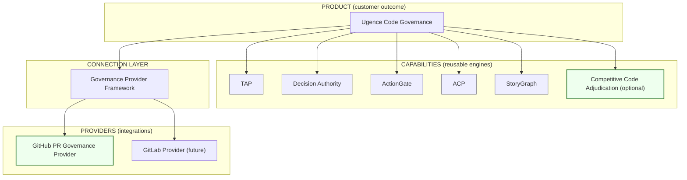
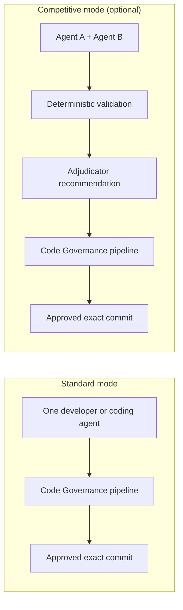
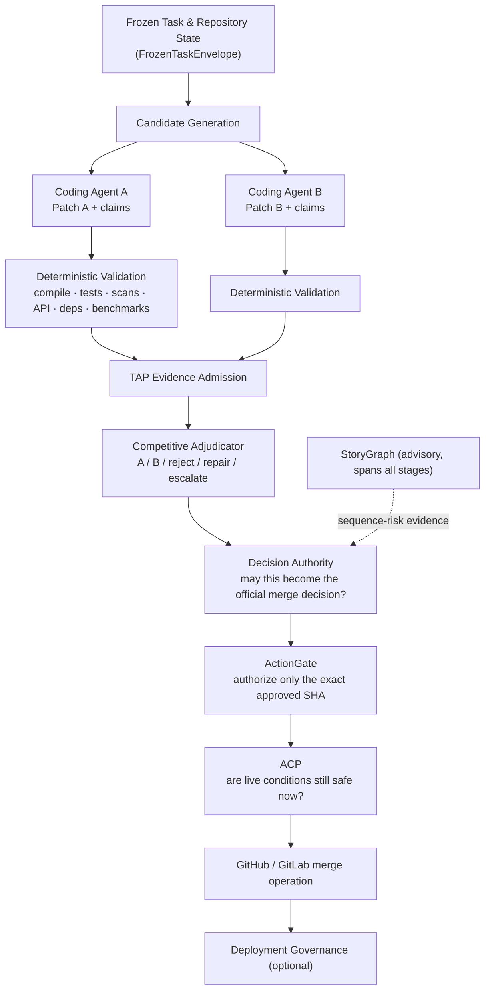
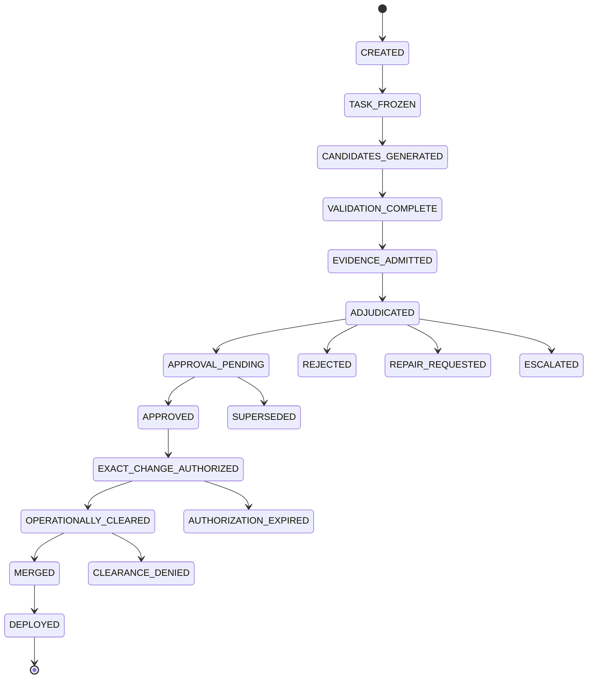

# Ugence Code Governance — Design Specification

**Status:** Draft design specification (v0.1) — for review.
**Scope:** product definition, architecture, contracts, phasing, and recommended
enhancements for a new customer-facing product that governs software changes.
**Canonical vocabulary:** this document follows
[`docs/architecture/ADR_UGENCE_DECISION_GOVERNANCE_TERMINOLOGY_AND_BOUNDARIES.md`](docs/architecture/ADR_UGENCE_DECISION_GOVERNANCE_TERMINOLOGY_AND_BOUNDARIES.md)
and the
[`UGENCE_TERMINOLOGY_PRODUCT_CAPABILITY_BOUNDARY_AUDIT.md`](UGENCE_TERMINOLOGY_PRODUCT_CAPABILITY_BOUNDARY_AUDIT.md).

> **One-line positioning.** *Ugence Code Governance governs AI-generated and
> human-written software changes from proposal through validation, approval,
> merge, and deployment — so an organization can let AI coding agents modify
> production software without letting the same agent write, validate, approve,
> and execute its own change.*

---

## 0. How this fits the existing platform (read first)

This is **not a new platform**. It is a new **product** — a customer-facing
composition over capabilities that already exist in this repository — plus **two
genuinely new pieces**: a **GitHub Pull Request Governance Provider** and an
optional **Competitive Code Adjudication** capability.

Per the capability/product boundary already established in the terminology audit,
Ugence has one umbrella (**Ugence Decision Governance**), ten reusable
**capabilities**, and a small set of proposed **products** that compose those
capabilities over their public contracts (never new copies of the engines). The
audit proposes four products — **Assert, Decide, Act, Sequence**. This spec adds
a fifth:

| Product | Governs | Composes capabilities |
|---|---|---|
| Assert | what AI may claim | TAP, Context Minimization, LLM Steering |
| Decide | how recommendations become binding | Decision Authority, TAP |
| Act | what AI agents may execute | ActionGate, ACP, Agent Runtime |
| Sequence | risk across linked events | StoryGraph |
| **Code (this spec)** | **software changes → production** | **TAP · Decision Authority · ActionGate · ACP · StoryGraph**, over the **Governance Provider Framework**, with optional **Competitive Code Adjudication** |

**Code Governance invents no new authority.** It reuses the existing authority
boundaries verbatim: TAP admits evidence, Decision Authority binds the merge
decision, ActionGate authorizes the exact commit, ACP clears it at commit time,
StoryGraph reports sequence risk. The only new *authorities* are none; the only
new *machinery* is (a) a provider that maps a GitHub pull request onto the three
existing provider families, and (b) an optional upstream candidate-comparison
capability whose output is explicitly a **recommendation, not a decision**.

### What already exists that we build on

> **Canonical vs. legacy layout (important).** The real code now lives under
> `packages/`; the top-level directories (`governance_providers/`,
> `decision_governance/`, …) are **compatibility shims** that re-export the
> canonical packages (object identity preserved), scheduled for removal in a later
> major. New code imports the canonical package public surfaces (e.g.
> `ugence_governance_provider_framework.api`); the legacy paths still resolve.

| Building block | Canonical package (dist · version) | Public import | Reused for |
|---|---|---|---|
| Governance Provider Framework | `packages/governance-provider-framework/` (`ugence-governance-provider-framework` · 0.1.0, contract 1.0.0) — see [`docs/DGM_PROVIDER_FRAMEWORK.md`](docs/DGM_PROVIDER_FRAMEWORK.md) | `ugence_governance_provider_framework.api` (legacy `governance_providers`) | registering + resolving the GitHub provider |
| Neutral provider contracts | `packages/governance-contracts/` (`ugence-governance-contracts`) | `ugence_governance_contracts` — `ProviderKind`, `AssertionGovernanceProvider`, `ActionGovernanceProvider`, `ExternalExecutionProvider` | the three families the GitHub provider serves |
| Decision Authority (frozen kernel) | `packages/capabilities/decision-authority/` (`ugence-decision-authority` · 1.0.0, frozen API) | `ugence_decision_authority.api` (legacy `decision_governance.api`) | binding merge decision record; CER binding |
| TAP | `tap_provider/` (adapter) · `truth_assurance_pipeline/` (research, prototype) | `tap_provider` | claim → evidence admissibility |
| ActionGate | `actiongate_provider/` (adapter) · `cyber_security/action_gate_reference/` | `actiongate_provider` | exact-SHA authorization |
| ACP | `symbolu_robotics/autonomous_control_plane/` (shadow-only) · design in `acp/` | — | commit-time operational clearance |
| StoryGraph | `packages/capabilities/storygraph/` (`ugence-storygraph` · 2.0.0) | `ugence_storygraph` (incl. its own `policypack/` compiler) | control-erosion sequence risk |
| Policy compiler | [`POLICY_PACK_GOVERNED_WORKFLOW_COMPILER_SPEC.md`](POLICY_PACK_GOVERNED_WORKFLOW_COMPILER_SPEC.md) | — | compiling repo policy packs into the pipeline |

**Maturity, stated honestly** (per [`UGENCE_PRODUCTIZATION_ROADMAP.md`](UGENCE_PRODUCTIZATION_ROADMAP.md) §1):
Decision Authority, ActionGate, and StoryGraph are reusable, frozen cores;
ActionGate/ACP are shadow-validated against fixtures; TAP is a partial prototype on
synthetic data. Code Governance must not overstate the readiness of what it composes.

### What is new in this spec

1. **GitHub Pull Request Governance Provider** — a provider bundle (three
   descriptors sharing one GitHub App/API client): an `EXTERNAL_EXECUTION` provider
   (merge = dispatch/observe), plus PR/CI/commit evidence + claim feeds into the
   `ASSERTION_GOVERNANCE` (TAP) and `ACTION_GOVERNANCE` (ActionGate) families. It
   introduces **no new provider family**, so it stays inside `PLATFORM_FREEZE_V1`. A
   future GitLab/Gerrit provider slots in the same way.
2. **Competitive Code Adjudication** — an *optional* upstream capability
   (`packages/capabilities/competitive-adjudication/`, proposed) that compares two
   independently-generated validated candidates and emits a recommendation.
3. **Code Governance product composition** — the orchestrated pipeline, state
   machine, data objects, and policy model that tie the above together.

---

## 1. Product / provider / capability separation

These three remain distinct, matching the platform's existing discipline.



- **Product — Ugence Code Governance.** The complete customer outcome:
  code-change evidence, claims verification, approval authority, exact-commit
  authorization, pre-merge / pre-deployment clearance, audit and reconstruction.
- **Provider — GitHub Pull Request Governance Provider.** Connects Ugence to
  repositories, pull requests, commit SHAs, branch protections, reviews, CI
  checks, and merge operations. A GitLab provider can be added later without
  changing the governance model.
- **Capability — Competitive Code Adjudication (optional).** The
  two-coding-agents-plus-adjudicator system. It is an optional upstream capability,
  **not** the whole product and **not** part of the Provider Framework.
- **Connection layer — Governance Provider Framework.** Registers, resolves,
  invokes, and reports readiness for providers. It does **not** approve code or
  select patches.

---

## 2. Should the two ideas be combined? Yes — as layered capabilities.

The core product governs **any** code change regardless of origin: one AI agent,
two competing agents, a human, an AI+human team, or an external coding platform.
Competitive adjudication is an **optional mode** for higher-risk changes.



Requiring two coding agents for **every** change would double or triple inference
cost, add latency, complicate simple fixes, produce more code to inspect, and
slow adoption. Competitive adjudication is therefore reserved (by policy scope)
for high-risk surfaces: authentication, authorization, payments, infrastructure,
security remediation, regulated software, database migrations, high-impact
production fixes, and architectural changes.

---

## 3. System architecture



In **standard mode** the two-candidate fan-out collapses to one candidate and the
adjudicator stage is skipped; everything downstream of TAP evidence admission is
identical. This is what keeps the common path cheap.

---

## 4. Component responsibilities & authority boundaries

Authority boundaries are inherited unchanged from
[`UGENCE_TERMINOLOGY_PRODUCT_CAPABILITY_BOUNDARY_AUDIT.md`](UGENCE_TERMINOLOGY_PRODUCT_CAPABILITY_BOUNDARY_AUDIT.md) §5.

### 4.1 TAP — claim verification (`ASSERTION_GOVERNANCE`)

TAP evaluates claims made by coding agents, developers, automated reviewers, and
the adjudicator. Example claims: *"all required tests passed"*, *"this patch fixes
the vulnerability"*, *"no public API changed"*, *"no production config modified"*,
*"the dependency upgrade has no known critical vulnerability"*, *"Patch A satisfies
the issue better than Patch B."*

Each claim must reference **admitted evidence**: CI job identifiers, test reports,
scanner outputs, benchmark results, changed-file manifests, API compatibility
reports, dependency analysis, code-owner reviews. TAP's output is **not** "safe to
merge" — it is: *these claims are supported / contradicted / incomplete /
unsupported by the supplied evidence*, mapping onto the existing
`AssertionCoverage` = `SUPPORTED | UNSUPPORTED | INDETERMINATE | CONSTRAINED`.

> Implementation note: this is exactly the `AssertionGovernanceProvider.evaluate`
> contract (`ugence_governance_contracts.contracts.assertion`). The GitHub
> provider supplies the evidence bundle; TAP is the assertion-governance provider
> resolved for the repository.

### 4.2 Competitive Code Adjudication — candidate comparison (advisory)

The adjudicator compares **validated** candidates and returns one of:
`SELECT_PATCH_A`, `SELECT_PATCH_B`, `REJECT_BOTH`, `REQUEST_REPAIR`,
`ESCALATE_TO_HUMAN`. **It must not be forced to pick a winner.**

It evaluates requirement coverage, correctness/test/security evidence, API
compatibility, architectural consistency, unnecessary churn, performance effects,
maintainability, and unresolved risks. Its output is a **recommendation**.

The adjudicator **cannot**: approve a pull request; create a binding business
decision; waive hard-policy failures; override deterministic evidence (e.g. failing
tests); authorize a merge; invoke merge execution; authorize deployment; combine or
inherit any other authority; or become Decision Authority. Its only outputs are the
five recommendation outcomes above. This is enforced structurally: its output type
is a recommendation record with no reference to, and no path to producing, a
`MergeDecisionRecord` or an `ExactChangeAuthorization`.

### 4.3 Decision Authority — binding merge decision

Decision Authority decides whether the adjudicator's recommendation — **or** a
normal pull-request recommendation — may become the official merge decision. It
evaluates approver authority, required reviewer roles, segregation of duties,
evidence completeness, required security/architecture approval, exception and
override handling, and repository-specific policy. It emits an **immutable
`MergeDecisionRecord`** (§6). The coding agent, adjudicator, and merge executor
cannot grant themselves this authority. This is the frozen Decision Authority
kernel (v1.0.0) reached via `ugence_decision_authority.api` (legacy
`decision_governance.api`). The approved decision binds to a **Canonical Execution
Request (CER)** — the kernel's existing hand-off object — which is what ActionGate
authorizes and ACP clears, matching the platform's governed loop
(Decision → CER → ActionGate → ACP → execution → reconciliation).

> **Provider ≠ Decision Authority.** The GitHub provider *supplies inputs* to
> Decision Authority — repository identity, pull-request identity, commit SHA,
> reviews, branch state, CI evidence, merge-operation details — but it does **not**
> perform authority validation, evidence-completeness checks, segregation of duties,
> required-approval evaluation, exception/override handling, or the production of the
> immutable binding merge-decision record. Those remain Decision Authority's, and the
> provider can neither manufacture nor widen that authority.

### 4.4 ActionGate — exact-change authorization (`ACTION_GOVERNANCE`)

ActionGate binds the approval to the precise operation (repository, PR, source
branch, exact commit SHA, target branch, action=merge, single-use, expiry). Any
material mutation — changed commit, rebased branch, altered target, added files,
modified deployment artifact, changed parameters, or expiry — invalidates the
authorization. This closes the gap between *"the reviewed code was approved"* and
*"the code being merged is exactly what was reviewed."* Maps to
`ActionGovernanceProvider.authorize` → `ActionGovernanceOutcome`.

### 4.5 ACP — live operational clearance

ACP checks conditions **immediately before** merge or deployment: is the branch
still at the approved SHA? are required CI jobs still green? has a scanner posted a
new failure? is there an active incident? is the environment in a change-freeze
window? is the deployment target correct? is the approved container digest
unchanged? are required approvals still active? has the authorization expired or
already been consumed? ACP answers: *even though this action was previously
approved, is it operationally safe and valid to perform now?*

### 4.6 StoryGraph — sequence-risk evidence (advisory)

StoryGraph evaluates sequences whose individual steps look acceptable but
collectively form a dangerous pattern — e.g. *modify CI config → disable security
test → alter authentication logic → reduce reviewer requirement → merge to main →
deploy to production.* It reports the observed sequence, the policy-relevant
pattern, the contributing events, the missing legitimate explanation, and the
recommended escalation. **It does not infer malicious intent.** For Code
Governance we ship a dedicated **control-erosion pattern pack** (§16.3).

---

## 5. Authority hierarchy (must be preserved)

```
Hard policy constraints
        ↓
Deterministic validation evidence
        ↓
TAP evidence admission
        ↓
Adjudicator recommendation        (advisory)
        ↓
Decision Authority approval       (binding)
        ↓
ActionGate exact-action authorization
        ↓
ACP live clearance
        ↓
Execution (merge / deploy)
```

A preferred adjudicator output must **never** override any of: failing mandatory
tests, security-policy failures, unavailable required evidence, invalid or missing
reviewers, segregation-of-duties violations, prohibited dependencies, a changed
commit SHA, an expired authorization, deployment-freeze windows, active blocking
incidents, or jurisdiction/regulatory restrictions. This is enforced structurally —
the adjudicator's output type is a recommendation object with no path to an
authorization; the pipeline requires a `MergeDecisionRecord` from Decision Authority
before ActionGate will mint an `ExactChangeAuthorization`; and ACP re-checks the live
conditions (SHA, CI, security, incident, freeze, expiry) immediately before
execution.

---

## 6. Core data objects

Field lists below are the logical contract; concrete dataclasses live in
`packages/capabilities/competitive-adjudication/` and the GitHub provider package.
Where an object maps onto an existing kernel/contract type it is noted.

**FrozenTaskEnvelope** — the exact problem both agents must solve (identical for
A and B):
`task_id · issue_id · repository · base_commit_sha · target_branch · requirements
· allowed_files · prohibited_changes · architecture_constraints · required_tests ·
security_policy · evaluation_policy_version`.

**PatchCandidate**:
`candidate_id · producer_identity · model_and_version · base_commit_sha ·
patch_commit_sha · changed_files · diff_digest · agent_claims · generated_tests ·
generation_timestamp · tooling_environment`.

**ValidationEvidenceBundle**:
`candidate_id · compile_result · unit_test_results · integration_test_results ·
security_scan_results · dependency_scan_results · api_compatibility_result ·
benchmark_results · policy_check_results · changed_file_manifest · evidence_ids ·
validation_timestamp`. → feeds `AssertionGovernanceRequest.evidence`.

**AdjudicationRecommendation**:
`adjudication_id · candidate_ids · recommendation · requirement_comparison ·
evidence_references · residual_risks · rejected_claims · confidence ·
escalation_reason · adjudicator_identity · adjudicator_model_version`. Every
material conclusion references evidence identifiers.

**MergeDecisionRecord** (immutable; Decision Authority output):
`decision_id · repository · pull_request · approved_candidate ·
approved_commit_sha · evidence_bundle · adjudication_reference ·
required_approvers · actual_approvers · policy_version · exceptions ·
override_record · decision_status · decision_timestamp`.

**ExactChangeAuthorization** (ActionGate output):
`authorization_id · repository · source_branch · approved_commit_sha ·
target_branch · operation · expiry · single_use · policy_reference ·
decision_reference`.

**OperationalClearanceRecord** (ACP output):
`clearance_id · authorization_id · current_commit_sha · current_ci_state ·
current_security_state · incident_state · freeze_window_state · deployment_target
· clearance_result · clearance_timestamp`.

All records are written to the platform's durable, tamper-evident, hash-chained
audit store (a shared platform service — see
[`UGENCE_PRODUCTIZATION_ROADMAP.md`](UGENCE_PRODUCTIZATION_ROADMAP.md) §3) so a
complete decision chain is reconstructable on demand.

### 6.1 Ownership — these are design concepts, not new contracts (this phase)

The objects above are **design concepts**. This phase adds **nothing** to
`ugence_governance_contracts` and defines no new frozen types. Several concepts map
onto types that already exist and are authoritative; duplicating them is prohibited.
Likely eventual ownership (to be settled by the implementation-readiness audit, not
here):

| Object | Likely owner | Note |
|---|---|---|
| FrozenTaskEnvelope | Competitive Adjudication / workflow layer | new concept |
| PatchCandidate | Competitive Adjudication | new concept |
| ValidationEvidenceBundle | Code Governance product/app layer | composes **existing** evidence references, does not replace them |
| AdjudicationRecommendation | Competitive Adjudication | new concept |
| MergeDecisionRecord | **Decision Authority** | map onto its existing decision / CER model — do **not** create a parallel record |
| ExactChangeAuthorization | **ActionGate** | ActionGate's existing authorization representation |
| OperationalClearanceRecord | **ACP** | ACP's existing clearance representation |

> The implementation-readiness audit must map each conceptual record onto an existing
> repository type **before** any new contract is introduced. Where a capability
> already owns a frozen authoritative type, the concept binds to it rather than
> spawning a duplicate.

---

## 7. State machine



Alternative terminal states: `REJECTED · REPAIR_REQUESTED · ESCALATED ·
AUTHORIZATION_EXPIRED · CLEARANCE_DENIED · SUPERSEDED`.

**Re-entry rule.** Any modification to the selected patch after validation returns
the workflow to `CANDIDATES_GENERATED` (if it creates a new candidate) or
`VALIDATION_COMPLETE` (if it only re-runs validation on the same candidate). In
standard mode the state graph is identical with `ADJUDICATED` passed through
trivially (single candidate → recommendation is a no-op selection).

---

## 8. Combining two patches

The adjudicator must **not** splice Patch A and Patch B and approve the result. A
combined patch is a **new candidate**:

```
Patch A + Patch B insights → Agent produces Patch C → new commit SHA →
compile & tests rerun → security & policy checks rerun → new adjudication or review
→ Decision Authority
```

This prevents unvalidated synthesis from bypassing the evidence process, and it is
enforced by the re-entry rule in §7: Patch C has a different `patch_commit_sha` and
`diff_digest`, so it cannot inherit A's or B's evidence bundle.

---

## 9. Independence requirements

Competitive generation only works when independence is preserved:

- Agents A and B receive the **same** `FrozenTaskEnvelope`.
- Neither sees the other's hidden reasoning.
- Neither modifies the shared working tree directly; each works in an **isolated
  branch or git worktree**.
- Candidate identifiers and evidence remain separate.
- Different models or prompting strategies may be used (**model diversity is
  preferred for high-risk changes** — two instances of the same model share a
  failure mode).
- The adjudicator did **not** generate either candidate.
- The adjudicator receives **structured evidence**, not persuasive narratives
  alone (anti-gaming — see §16.1).
- The adjudicator cannot execute the merge.
- The same model instance must not write, adjudicate, approve, **and** merge.

### 9.1 Candidate-generation orchestration ownership (explicit design decision)

**Candidate-generation orchestration** — the act of producing (or soliciting) one or
more candidate patches from a `FrozenTaskEnvelope`, in isolated worktrees, and
handing the validated results downstream — is **deliberately not owned by any
governance component.** It must **not** be hidden inside the Governance Provider
Framework, and it is **not** owned by Decision Authority, ActionGate, TAP, ACP,
StoryGraph, or the GitHub provider. Folding orchestration into any of these would
collapse the write/validate/approve/execute separation the product exists to
enforce.

Plausible **future** owners (none implemented in this phase; the choice is left
open on purpose):

- **Agent Runtime** — the platform's digital execution runtime, the most natural
  home for supervised, worktree-isolated candidate generation.
- **Optional Orchestrator** — the bypassable workflow composer in the AI Control
  Plane (it coordinates but acquires no authority from what it invokes).
- **A dedicated competitive-development workflow service** — a new, explicitly
  optional component.
- **An external coding-agent platform** — Ugence governs candidates produced
  entirely outside it (the MVP-1 posture: observe candidates arriving as branches/PRs).

Whichever owner is chosen, the governance authorities must remain **separately
invocable and independently authoritative** — orchestration coordinates them; it
never speaks for them. In MVP 1 there is no orchestration at all: a human or a
single external agent produces one PR and Ugence governs it.

---

## 10. Policy model

Repository policy packs are authored, versioned, and published through the
existing policy service and compiled by the
[`POLICY_PACK_GOVERNED_WORKFLOW_COMPILER_SPEC.md`](POLICY_PACK_GOVERNED_WORKFLOW_COMPILER_SPEC.md)
so that a policy deterministically configures which pipeline stages run, which
evidence is mandatory, and who may approve. Example:

```yaml
policy_id: auth-change-policy-v1
scope:
  paths: ["auth/**", "security/**"]
candidate_generation:
  competitive_mode_required: true
  minimum_candidates: 2
  independent_worktrees: true
required_evidence:
  unit_tests: pass
  integration_tests: pass
  secret_scan: pass
  dependency_scan: pass
  static_security_analysis: pass
  api_compatibility: pass_or_approved_exception
approval:
  minimum_human_approvals: 2
  required_roles: [code_owner, security_reviewer]
  author_may_finally_approve: false
  ai_may_approve: false
merge:
  approved_sha_must_match: true
  authorization_single_use: true
  authorization_ttl_minutes: 30
deployment:
  separate_authorization_required: true
  block_during_change_freeze: true
  block_during_severity_one_incident: true
```

Policy resolution is scoped by changed-path globs; when multiple policies match, the
**most restrictive** wins (fail-closed). Policy version is recorded in every
`MergeDecisionRecord`.

---

## 11. The GitHub Pull Request Governance Provider

The provider is a bundle that registers with the Governance Provider Framework and
implements/serves the three existing families. It never holds governance authority
— it is an integration surface.

> **Design constraint — stay within the platform freeze.** The framework defines
> exactly three provider families (`ProviderKind` = `ASSERTION_GOVERNANCE` ·
> `ACTION_GOVERNANCE` · `EXTERNAL_EXECUTION`). Introducing a *new* family would be a
> MAJOR change against `platform/PLATFORM_FREEZE_V1.json`. The GitHub provider is
> deliberately designed to need **no new family** — it maps entirely onto the three
> that already exist. This is a hard requirement, not an accident of convenience.

> **Implementation pattern — model on `actiongate_provider/`.** That package is the
> worked reference for wrapping a native engine as a framework provider: a pure,
> offline `core.py` that imports **neither** the kernel **nor** the framework; a thin
> `provider.py` adapter subclassing `BaseProvider`, building its own
> `ProviderDescriptor` (with a zero-arg `factory`, a `features` frozenset, `vendor`,
> `default`); an `errors/translate_error` boundary so no native exception escapes; a
> `mapping/` layer with a versioned `MAPPING_VERSION`; and a `conformance/` suite run
> against the family's conformance kit. The GitHub provider replicates this shape
> (`github_pr_governance_provider/` with `core/`, `provider.py`, `mapping/`,
> `client/` (GitHub App/API), `errors/`, `conformance/`, `tests/`).

| Provider role | `ProviderKind` | Contract method | Code-governance meaning |
|---|---|---|---|
| Evidence + claim source | `ASSERTION_GOVERNANCE` (feeds TAP) | supplies `AssertionGovernanceRequest.evidence` | ingest PR body, CI checks, scanner results, changed-file manifest, code-owner reviews; extract agent claims |
| Merge pre-authorization | `ACTION_GOVERNANCE` | `authorize(...)` inputs | present the exact `{repo, PR, source_branch, SHA, target_branch, merge}` tuple to ActionGate |
| Merge executor | `EXTERNAL_EXECUTION` | `dispatch()` / `observe()` | perform the merge via GitHub API; `observe` distinguishes transport-ack from merge business outcome |

Key behaviors:

- **Ingestion.** GitHub App installation; webhook + polling ingestion of PRs and
  commit SHAs; CI and security-check status; branch-protection state; reviews and
  code-owner approvals.
- **Claim extraction.** Parse structured coding-agent claims from PR
  body/metadata into `agent_claims` for TAP; PR prose is treated as **untrusted**
  (§16.1).
- **Exact-action fidelity.** The SHA presented to ActionGate is the SHA read back
  from GitHub at authorization time; ACP re-reads it again at clearance time to
  catch a race (a push between authorization and merge).
- **Merge execution.** Only after `EXACT_CHANGE_AUTHORIZED` + `OPERATIONALLY_CLEARED`;
  the merge is single-use and the authorization is consumed atomically.
- **Failure normalization.** Provider exceptions normalize to fail-safe
  `INDETERMINATE`/`UNKNOWN` at the adapter boundary (framework invariant) — a
  GitHub outage never produces a spurious "authorized."

A **GitLab / Bitbucket / Gerrit provider** implements the same three roles and
registers identically; the governance model is unchanged (the framework's central
acceptance test).

---

## 12. Product modes

- **Standard Governance Mode** (normal development): one patch → validation →
  approval → exact-SHA authorization → merge.
- **Competitive Validation Mode** (high-risk): two independent patches →
  deterministic comparison → adjudication → approval → exact-SHA authorization →
  merge.
- **Emergency Repair Mode** (incidents): one or more rapid patches → minimum
  mandatory evidence → emergency authority → short-lived exact authorization →
  monitored deployment → **mandatory post-event review**. Emergency mode is an
  explicit policy path, **not a bypass** (§16.6).
- **Shadow Mode** (rollout): the full pipeline runs and records decisions but never
  blocks or merges — for calibration before enforcement (§16.10). This mirrors the
  platform's shadow → recommendation → enforcement deployment ladder.

---

## 13. MVP phasing

**MVP 1 — GitHub Pull Request Governance (single-candidate).** GitHub App install;
PR + commit-SHA ingestion; CI/security evidence collection; coding-agent claim
extraction; TAP claim verification; repository approval policy; Decision Authority
merge record; ActionGate authorization tied to the exact SHA; immediate pre-merge
condition check (ACP); immutable evidence + decision trail. **Works with one
candidate — competitive adjudication does not block the initial product.**

**MVP 2 — Competitive Code Adjudication.** Frozen task envelopes; isolated agent
worktrees; two independent candidates; standardized validation harness;
evidence-grounded adjudicator; select/reject/repair/escalate; new-candidate
handling for combined solutions; adjudication records linked to merge decisions.

**MVP 3 — Deployment Governance.** Artifact-digest binding; environment
authorization; Kubernetes/cloud deploy connectors (reuse the ACP + ActionGate
Kubernetes surface already proven — see
[`UGENCE_PRODUCTIZATION_ROADMAP.md`](UGENCE_PRODUCTIZATION_ROADMAP.md)); production
freeze checks; incident-state integration; rollback authorization; post-deployment
evidence.

---

## 14. Commercial differentiation

Most coding products optimize *generate more code faster*. Ugence Code Governance
optimizes *decide which change is trustworthy, establish who may approve it, and
ensure only the exact approved artifact reaches production.* The pieces reinforce
each other: governance provides control/authority/execution fidelity; competitive
adjudication improves candidate quality and surfaces disagreement; deterministic
validation stops the adjudicator substituting opinion for evidence; exact-commit
binding stops post-review mutation; sequence analysis catches multi-step control
erosion. The moat accumulates through repository policy packs, security-sensitive
change taxonomies, approval-pattern libraries, CI evidence mappings, adjudication
benchmarks, legitimate-exception corpora, false-positive reduction, historical
patch/incident/rollback outcomes, and regulated-software control mappings.

---

## 15. Naming

- **Product:** Ugence Code Governance.
- **Initial provider:** GitHub Pull Request Governance Provider.
- **Optional advanced capability:** Ugence Competitive Code Adjudication.
- **Internal workflow name:** Governed Competitive Development Pipeline.

> Customer-facing message: *Ugence governs AI-generated software from competing
> implementation through evidence-based selection, authorized merge, and safe
> deployment.*

### 15.1 Positioning statements & claim discipline

**Product:** *Ugence Code Governance governs AI-generated and human-written software
changes from proposal through evidence validation, authorized approval, exact-change
merge authorization, and safe deployment.*

**Competitive mode:** *Competitive Code Adjudication independently generates or
receives multiple candidate patches, validates them through deterministic evidence,
and produces a non-binding recommendation for governed approval.*

**Claim discipline.** Ugence does **not** claim to prove code universally correct.
What it establishes about an approved change is that it is: **evidence-supported ·
policy-compliant · approved under declared controls · bound to the exact reviewed
artifact · reconstructable · operationally cleared.** Marketing and documentation
must stay within these claims.

---

## 16. Recommended additional enhancements

These are proposed *additions* beyond the base definition. Each is scoped so it can
be adopted independently; priority is the author's recommendation.

### 16.1 Adjudicator & TAP anti-gaming hardening — **P0 (mandatory design constraint)**

These are **not optional niceties** — they are mandatory constraints without which an
AI can defeat its own governance. AI-authored PRs and their descriptions are
untrusted input. Concrete controls:
- **Untrusted content.** Pull-request prose, comments, commit messages, and
  source-code text are treated as **untrusted content**, never as instructions.
- **Prompt-injection isolation.** The adjudicator and TAP consume *structured
  evidence records*; untrusted text is passed as data with explicit provenance and
  can never become part of the judging instruction.
- **Test-tampering detection.** A differential check flags candidates that *weaken
  or delete tests/assertions* to make a claim pass (coverage delta, assertion
  count delta, mutation-score delta on touched code). Emitting a green
  `unit_tests: pass` while removing the test that covered the changed line is a
  contradiction TAP must catch, not admit.
- **Same-candidate policy-tampering detection.** Detect a candidate that modifies
  CI configuration, security-scan configuration, or governance/branch-protection
  policy **within the same change** it is trying to land (feeds StoryGraph's
  control-erosion pack, §16.3).
- **No self-governing candidates.** A candidate must not be able to control its own
  validation policy — the effective policy is resolved from the repository policy
  pack, never from files the candidate introduces or edits.
- **Evidence provenance binding.** Every evidence id is signed by the validator
  that produced it; the adjudicator cannot cite evidence that no admitted
  validator emitted.

### 16.2 Supply-chain provenance & attestation — **P0 (required before production deployment governance)**

Bind the approved artifact to verifiable provenance, not just a SHA string. Adopt as
a **progression**, so the pull-request MVP is not blocked on build infrastructure
that does not exist yet:

```text
Pull-request MVP:      exact commit-SHA + admitted-evidence binding   (available now)
Production deployment: signed build provenance + artifact-digest binding  (MVP 3)
```

- **MVP 1 (now).** Exact commit-SHA binding plus admitted evidence is sufficient and
  is what ships first.
- **Signed commits / verified authorship** required by policy for high-risk paths.
- **Build provenance and image-digest binding (MVP 3).** Container image digest +
  signature, carried in `OperationalClearanceRecord.deployment_target` so ACP clears
  the *exact* built artifact, closing the source→build→deploy gap. Frameworks such as
  **in-toto / SLSA / cosign are candidate mechanisms, not existing implementations** —
  none is implemented in this repository today, and this document does not claim
  otherwise.
- **SBOM diff as first-class evidence.** Dependency changes attach an SBOM delta +
  vulnerability-feed lookup, feeding the `dependency_scan_results` claim.

### 16.3 StoryGraph "control-erosion" pattern pack for code — **P1**

Ship a Code-Governance-specific StoryGraph pattern pack that detects governance
weakening across a PR series: CI-config edits that disable checks, branch-protection
downgrades, reviewer-requirement reductions, security-test deletions, self-approval
attempts, and policy-file edits by the same actor who benefits. Output remains
advisory sequence-risk evidence into Decision Authority; it never blocks on its own.

### 16.4 Incremental / delta re-validation — **P1**

Re-running the full validation harness on every new candidate (especially Patch C)
is the main cost driver after competitive generation itself. Cache validation
results keyed by `diff_digest` + toolchain fingerprint and re-run only the affected
subset, with a policy-set floor of always-run checks (secret scan, security policy).
This directly attacks the cost/latency objection to competitive mode.

### 16.5 Governance cost & routing budget — **P1**

Competitive mode multiplies inference cost. Add a per-repository / per-change
**governance budget** and let the **Model Selection** capability route candidate
generation and adjudication models within policy (e.g. cheaper models for routine
paths, model-diverse frontier models for auth/payments). Record spend in the audit
trail; surface cost-per-governed-change as a product metric.

### 16.6 Break-glass with auto-expiry & mandatory retrospective — **P1**

Emergency Repair Mode grants time-boxed elevated authority that **auto-expires**,
requires a named human sponsor, records a reduced-evidence justification, and opens
a **mandatory post-event review task** that must close before the actor may use
break-glass again. Never a silent bypass; every waiver is an explicit, audited
`override_record`.

### 16.7 Flaky-test & non-determinism handling — **P2**

Deterministic validation must not be defeated by flaky tests. Track per-test
historical flake rate; require N-of-M reruns for tests marked flaky; represent
"passed after retry" honestly in evidence so TAP does not admit an over-strong
claim, and so the adjudicator can prefer the more deterministic candidate.

### 16.8 Human review UX & unified console integration — **P1**

Approvers need one place to see: the candidate diff(s), the side-by-side
`requirement_comparison`, admitted vs. contradicted claims, residual risks, and the
exact SHA they are authorizing. Integrate with the planned unified console
([`ACP/UGENCE_UNIFIED_CONSOLE_PLAN.md`](ACP/UGENCE_UNIFIED_CONSOLE_PLAN.md)); render
the decision inline on the GitHub PR (check-run + summary comment) so reviewers stay
in their workflow. Segregation-of-duties (author ≠ final approver) is enforced in
the UI, not just the record.

### 16.9 Regulatory control mapping pack — **P2 (moat)**

Map evidence and approval records to change-management controls in SOC 2, ISO
27001, PCI-DSS, and SOX (segregation of duties, change authorization, audit trail).
The `MergeDecisionRecord` already carries approvers, evidence, and policy version —
expose a **compliance reconstruction report** that auditors can consume directly.
This is high-value differentiation for regulated buyers.

### 16.10 Shadow-mode calibration & outcome feedback loop — **P1**

Run the whole pipeline in shadow (record, don't block) to measure **false-block
rate, escalation rate, override rate, and time-to-merge** before enforcement. Then
close the loop: link post-merge incidents and rollbacks back to the adjudication
and decision that approved them, building the adjudication-benchmark and
false-positive-reduction corpus that the moat depends on. Adjudicator **confidence
thresholds** and **TAP/adjudicator disagreement** both auto-escalate to a human.

### 16.11 Approver identity assurance — **P2**

Bind approvals to strong identity (enterprise OIDC / SSO), and for the highest-risk
policies require hardware-backed / MFA-attested approval. Prevents a compromised
token from satisfying `required_roles`.

### Enhancement priority summary

| # | Enhancement | Priority | Rationale |
|---|---|---|---|
| 16.1 | Anti-gaming (injection + test-tampering) | **P0** | Without it, AI can defeat its own governance |
| 16.2 | Supply-chain provenance / attestation | **P0** | SHA string ≠ verified artifact reaching prod |
| 16.3 | Control-erosion StoryGraph pack | P1 | Detects the exact multi-step attack the product exists to stop |
| 16.4 | Incremental re-validation | P1 | Removes the main cost objection to competitive mode |
| 16.5 | Governance cost/routing budget | P1 | Makes competitive mode economically adoptable |
| 16.6 | Break-glass auto-expiry + retro | P1 | Emergency path stays a control, not a hole |
| 16.8 | Review UX + console + PR check-run | P1 | Adoption depends on reviewer experience |
| 16.10 | Shadow calibration + feedback loop | P1 | De-risks enforcement; builds the moat corpus |
| 16.7 | Flaky-test handling | P2 | Protects validation integrity |
| 16.9 | Regulatory control mapping | P2 | Moat for regulated buyers |
| 16.11 | Approver identity assurance | P2 | Hardens the approval gate |

---

## 17. Open questions

1. **Candidate generation ownership.** Does Ugence *invoke* coding agents (owning
   the FrozenTaskEnvelope → candidate step) or *observe* candidates produced
   externally and pushed as branches/PRs? MVP 1 observes; MVP 2 needs a defined
   generation contract (recommend: Ugence orchestrates via a coding-agent adapter
   so independence and worktree isolation are enforceable).
2. **Adjudicator placement.** Confirm `packages/capabilities/competitive-adjudication/`
   as the home, peer to `storygraph` and `decision-authority`.
3. **Provider family fit.** Confirmed against the framework: a single `Provider`
   has exactly one `ProviderKind`, so the GitHub bundle registers **three
   descriptors** (assertion-evidence, action-authorization surface, execution)
   that **share one GitHub App/API client**, rather than one multi-kind provider.
   This keeps each descriptor conformance-testable by its family's kit and needs no
   new provider family (stays inside `PLATFORM_FREEZE_V1`).
4. **Evidence store.** Reuse the platform's durable tamper-evident audit backend
   (roadmap §3) rather than a Code-Governance-specific store.
5. **Deployment scope for MVP3.** Kubernetes-first (aligns with the existing
   infrastructure-agent wedge) before broad multi-cloud.

---

## 18. Appendix — mapping to existing code

| Spec element | Existing/new home |
|---|---|
| Provider registration/resolution | `packages/governance-provider-framework/` |
| Provider contracts (`ProviderKind`, the three families) | `packages/governance-contracts/src/ugence_governance_contracts/` |
| TAP evaluation | `AssertionGovernanceProvider.evaluate` (`tap_provider/`) |
| Decision Authority record | `decision_governance.api` (frozen kernel) |
| ActionGate authorization | `ActionGovernanceProvider.authorize` (`actiongate_provider/`) |
| ACP clearance | `acp/` + `symbolu_robotics/autonomous_control_plane/` |
| StoryGraph pattern pack | `packages/capabilities/storygraph/` |
| Merge execution | `ExternalExecutionProvider.dispatch/observe` (new GitHub provider) |
| Competitive adjudication | `packages/capabilities/competitive-adjudication/` (**new**) |
| Policy pack compilation | [`POLICY_PACK_GOVERNED_WORKFLOW_COMPILER_SPEC.md`](POLICY_PACK_GOVERNED_WORKFLOW_COMPILER_SPEC.md) |
| Console / review UX | [`ACP/UGENCE_UNIFIED_CONSOLE_PLAN.md`](ACP/UGENCE_UNIFIED_CONSOLE_PLAN.md) |

---

*Companion to [`UGENCE_PLATFORM_OVERVIEW.md`](UGENCE_PLATFORM_OVERVIEW.md) and the
[`UGENCE_TERMINOLOGY_PRODUCT_CAPABILITY_BOUNDARY_AUDIT.md`](UGENCE_TERMINOLOGY_PRODUCT_CAPABILITY_BOUNDARY_AUDIT.md).
Draft for review — no code, package, API, schema, or frozen artifact is changed by
this document.*
