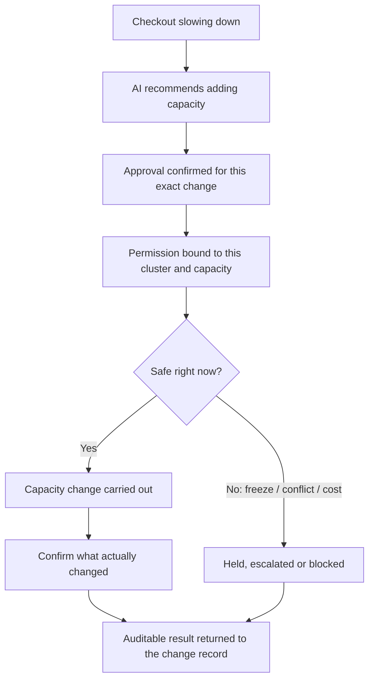
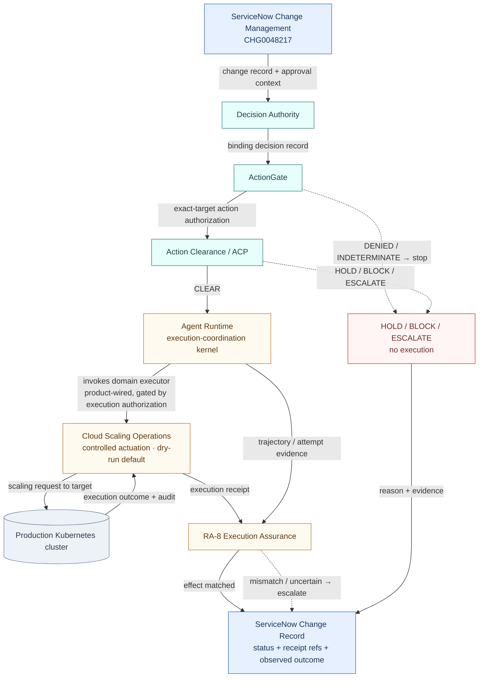
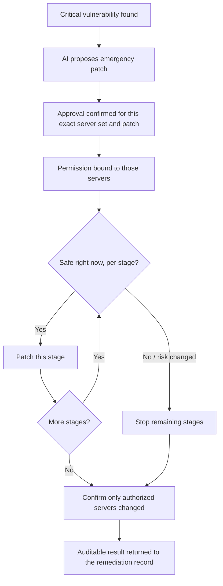
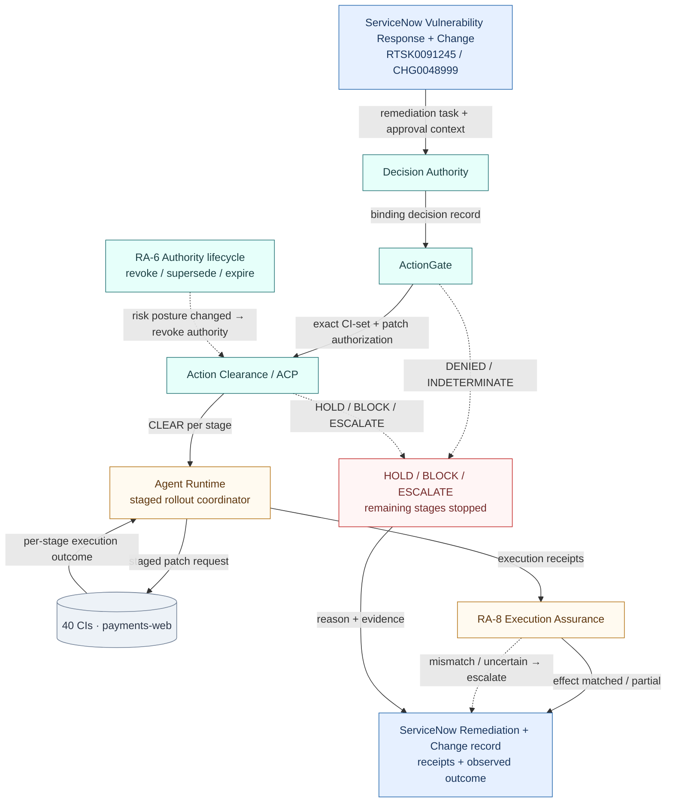
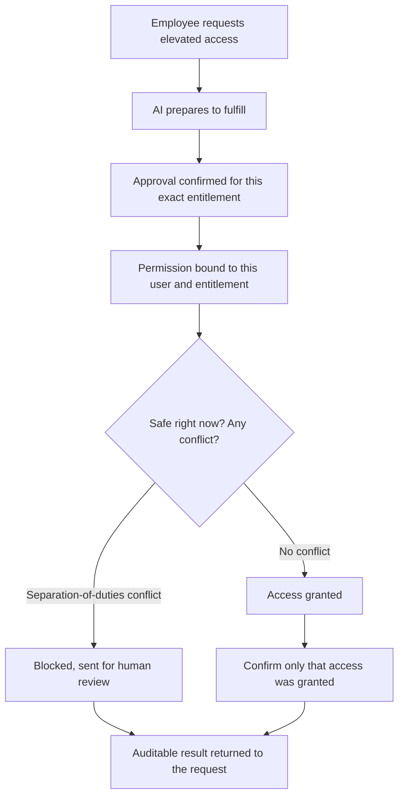
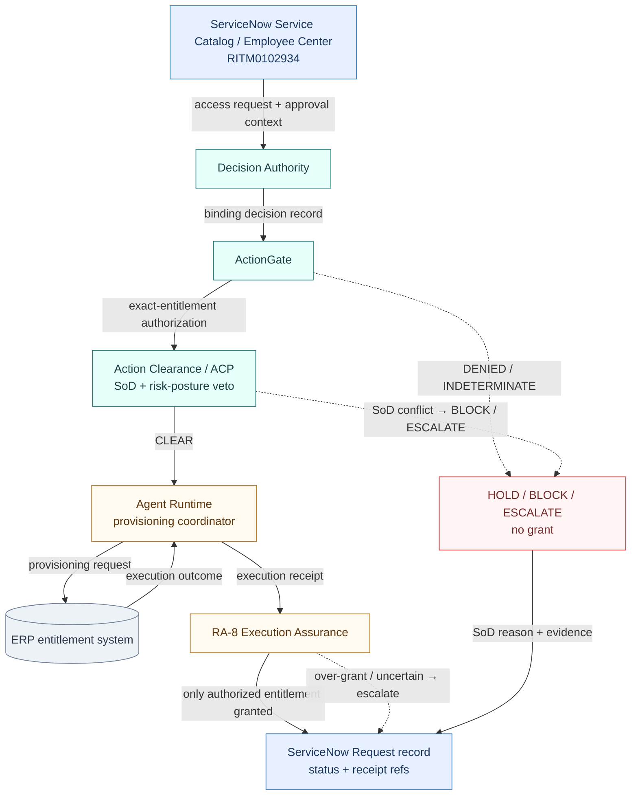
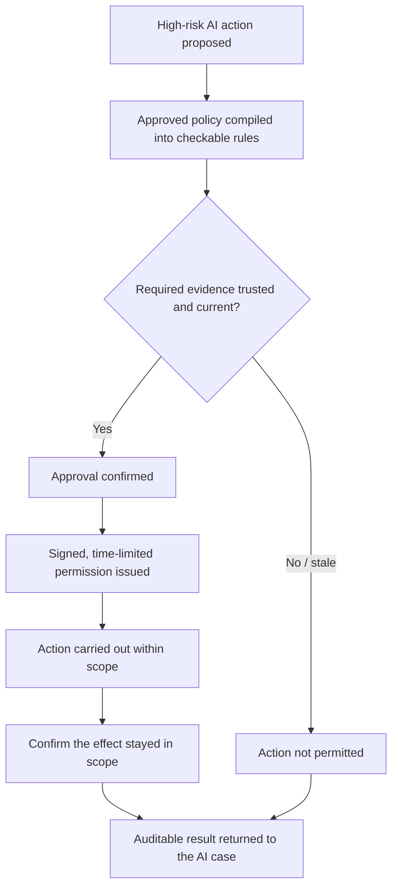
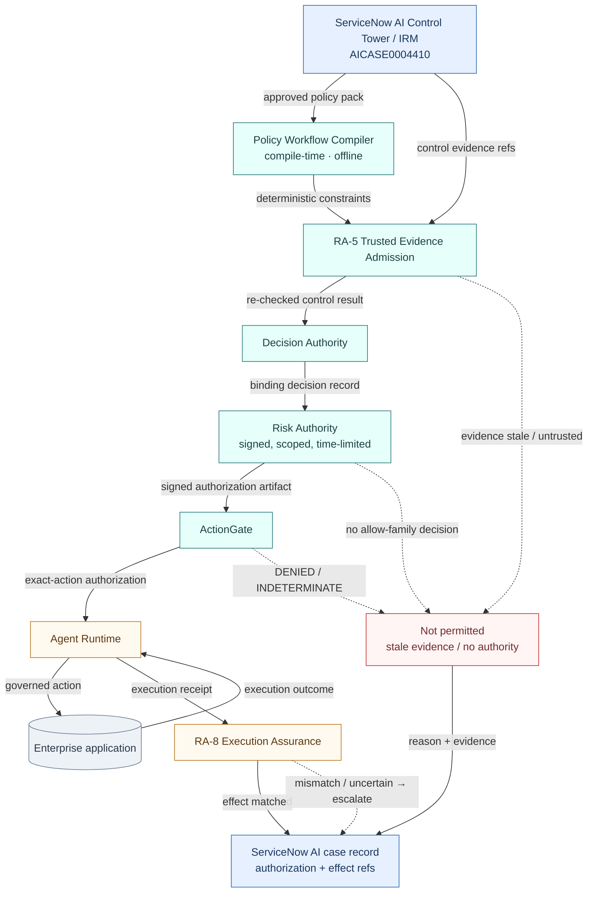
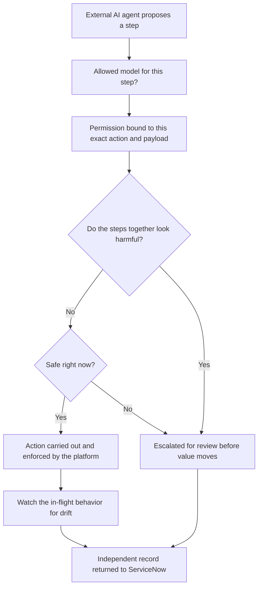
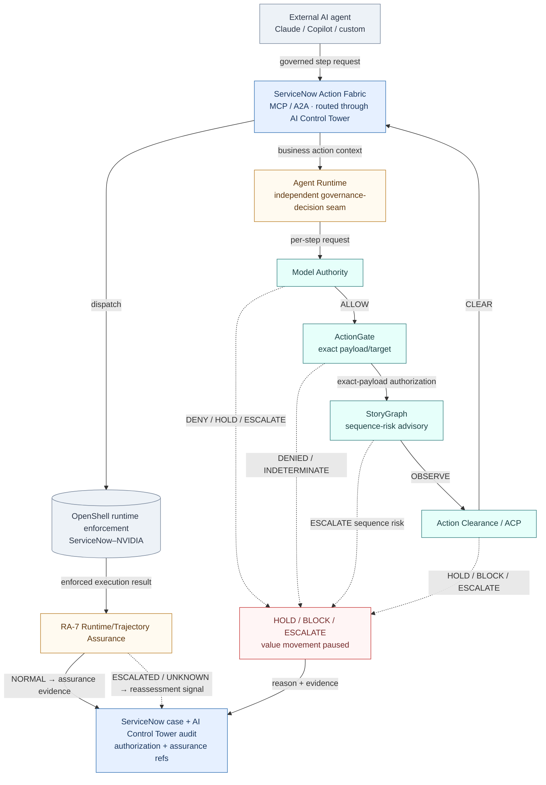

# Ugence + ServiceNow: Use-Case Walkthroughs (Layman-First Companion)

## A plain-language guide to what happens to enterprise data as it moves through governed agentic execution

**Version:** 1.0
**Companion to:** `UGENCE_SERVICENOW_PRODUCT_ANCHORED_USE_CASES.md` v1.1 (the factual & technical
source of record). This document does **not** replace or weaken v1.1; it makes the same use cases
understandable to four readers — a **ServiceNow representative**, an **enterprise executive**, an
**operational owner**, and a **solution architect** — without revealing any Ugence source code,
proprietary algorithm, or security-sensitive detail.
**Audience note:** every section starts in ordinary business language and introduces a technical
term only after the problem is clear.

**The one question this document answers:**

> *What happens to the data as it moves from a ServiceNow record, through the Ugence governance
> pipeline, into execution, and back into an auditable outcome?*

**Illustrative-only notice.** Every scenario below uses **fictional but credible** enterprise
details (record numbers, clusters, amounts). **None is an actual Ugence customer deployment.** Each
is an *illustrative example of how the proposed integration would work.* **Every ServiceNow
integration described here is PROPOSED — no ServiceNow connector ships today.**

---

## 0. How to read this — the four kinds of data (critical conceptual rule)

The single most important idea: **not every Ugence module modifies the original ServiceNow business
record.** Most modules *read or reference* business context and *emit a separate governance
artifact* alongside it. Keep four kinds of data distinct:

| Kind of data | What it is | Examples | Who owns it |
|---|---|---|---|
| **Original business data** | The facts of the request | incident, change, CI, user, entitlement, control evidence, purchase request, amount, target system, requested action | **ServiceNow** (system of record) |
| **Derived governance artifacts** | *New* records Ugence produces about a decision | decision record, model authorization, action authorization, risk authorization, clearance verdict, execution request, execution receipt, effect-assurance result, revocation/reassessment signal | **Ugence** (each artifact separate from the business record) |
| **Observed operational data** | Live conditions read at runtime | current infrastructure condition, blackout window, dependency state, account status, execution result, changed resource state, service health | ServiceNow + operational telemetry |
| **ServiceNow records** | The system-of-record context | the change/incident/request record and its statuses | **ServiceNow** — receives *references, statuses, receipts, or summarized outcomes* through the **PROPOSED** integration |

> **The rule, stated once and applied everywhere:** *A module reads or references the required
> business context and emits a separate governance artifact. It does not silently rewrite the
> originating ServiceNow record.* When a ServiceNow record is updated, it is updated with a
> **reference, status, or receipt** through the proposed integration — never by a module quietly
> editing the business truth.

**Honest framing of ServiceNow.** ServiceNow already provides deep AI governance and runtime
control: approval workflows, **AI Control Tower** (asset governance, enforcement, adoption/ROI
measurement), **Action Fabric** (a governed system of action over MCP/A2A), and — with **NVIDIA
OpenShell** — central policy enforced at runtime on every file, command, and network call. Nothing
here says ServiceNow "lacks" or "cannot"; where a Ugence differentiation is unconfirmed, it is
written as a **discovery question** to explore with the customer's architects, not as a gap. Ugence
**composes with** these capabilities; it does not sit above, replace, or correct them.

---

## 1. Module glossary (each Ugence module defined once, in two layers)

Every module is defined here the first time; scenarios then reference it. Each has a **layman** line
(for business stakeholders) and an **architecture** line (interface-level: inputs, decision meaning,
output artifact, and explicit non-responsibility). No internal mechanics are disclosed.

**Decision Authority** *(shipped; frozen API)*
- *Layman:* Confirms that a properly **delegated** authority — not the AI agent itself — approved
  this exact class of decision.
- *Architecture:* References the proposed action, the delegating authority, approval context and
  applicable constraints; decides whether a **binding decision** exists within permitted scope;
  emits a **separate, immutable decision record**. It is the **sole owner of execution and
  reconciliation records**. It does **not** execute anything, inspect live conditions, or let an AI
  grant itself authority (AI is structurally barred as an authorizing principal).

**ActionGate — exact-action authorization** *(shipped)*
- *Layman:* Converts an approval into permission for **one exact action against one exact target**.
- *Architecture:* References the decision record, target identity and the proposed action; decides
  whether the action presented is the **same** action authorized and whether the authorization is
  still valid; emits an action-level result — **AUTHORIZED / authorized-with-constraints / DENIED /
  INDETERMINATE**. Uncertainty or failure maps to **INDETERMINATE**, never to AUTHORIZED. It does
  **not** decide whether execution is operationally safe right now, and it owns no execution.

**Action Clearance (ACP) — operational clearance** *(shipped)*
- *Layman:* The final **"is it safe right now?"** check.
- *Architecture:* References an *already-authorized* exact action plus current operational
  conditions; decides on live veto conditions (blackout window, conflicting change, unhealthy
  dependency, operational hold); emits **CLEAR / HOLD / BLOCK / ESCALATE** (precedence BLOCK >
  ESCALATE > HOLD > CLEAR). It is **subtractive** — it may preserve, narrow, hold, escalate, or
  block, but may **never create or broaden authority, replace ActionGate, or dispatch execution.**

**Cloud Scaling Operations — controlled infrastructure actuation** *(see maturity below)*
- *Layman:* Carries out a **bounded** infrastructure change (e.g. scaling) under strict execution
  controls, only when properly authorized.
- *Architecture:* Consumes an advisory scaling recommendation; **requires an externally minted
  execution authorization** (a recommendation, an approval boolean, or a confidence score is *not*
  execution authority); emits an execution outcome plus audit. Default posture is **fail-closed**
  and **dry-run by default** — installation alone does not authorize live execution. It does **not**
  mint its own authority.
- **Four-dimensional maturity (preserved from v1.1 — do not conflate):** **(1) Core controller:
  IMPLEMENTED. (2) Production validation: PILOT PENDING. (3) Additional agentic-AI capabilities:
  UNDER ACTIVE DEVELOPMENT. (4) ServiceNow integration: PROPOSED; no connector ships.** It is **not**
  described as unfinished merely because pilot validation and additional capabilities remain
  pending — the core is implemented and awaiting pilot validation.

**Agent Runtime — execution-coordination kernel** *(shipped; v0.7.0)*
- *Layman:* The neutral **coordinator** that carries a governed request into execution and drives its
  lifecycle (retry, timeout, cancellation, durable recovery).
- *Architecture:* A domain-neutral execution-coordination kernel and the canonical owner of
  execution-**trajectory** identity; it **invokes providers/tools** to perform work within one
  governed quantum. It **fails closed** — with no governance boundary wired, consequential
  transitions are blocked (reason: governance-not-configured). It **never** creates authority,
  authors policy, authorizes actions, or mints clearance. *(Note: Agent Runtime is the
  execution-coordination kernel; it is **not** the "context-envelope record / CER" — those records
  belong to Decision Authority. See §8, Ambiguity A2.)*

**RA-8 — Execution / effect assurance** *(shipped; reference-grade)*
- *Layman:* Checks whether **reality matched what was authorized**, after the fact.
- *Architecture:* Runs **strictly after** an action executes; references the authorized action, the
  execution receipt/attempt and the observed post-action state; decides whether **only the intended
  target changed** and whether the observed effect stayed within authorized scope; emits an
  effect-assurance verdict (**matched / mismatch / partial / unknown / manual-review**) and, only
  when material, a **neutral reassessment signal** — *never authority*. It **observes**; it
  introduces no second authority artifact and no third execution ledger; **Decision Authority remains
  the sole owner of execution/reconciliation records.** It does **not** retroactively legitimize an
  unauthorized action.

**RA-6 — Authority lifecycle** *(shipped; reference-grade)*
- *Layman:* Keeps authority **current** — revokes, supersedes, or expires it when circumstances
  change.
- *Architecture:* The **sole writer** of authority lifecycle consequences (revoke / supersede /
  expire / epoch propagation). Observers *signal*, Risk Authority *reassesses*, this module *mutates*
  lifecycle state, and enforcement stays **read-only**. Revocation bites at the **next pre-effect
  recheck** (bounded-latency, not instantaneous). It does **not** execute or authorize.

**Model Authority — per-request model authorization** *(shipped)*
- *Layman:* Decides **which model** is allowed to handle *this specific request*, right now.
- *Architecture:* References the request context and approved model policy; emits a per-request
  decision — **ALLOW / DENY / HOLD / ESCALATE** — with governed fallback and expiry. It does **not**
  execute the request or replace platform-level provider approval.

**Policy Workflow Compiler (PWC) — compile-time policy tooling** *(shipped)*
- *Layman:* Turns approved written policy into **deterministic, machine-checkable constraints** so a
  model never re-interprets policy prose differently each time.
- *Architecture:* Compile-time only; consumes an approved, structured policy pack; emits a
  digest-addressed governed-workflow artifact. It makes **no binding decision, authorizes nothing,
  clears nothing, and runs nothing.**

**RA-5 — Trusted evidence admission** *(shipped; reference-grade)*
- *Layman:* Ensures a required control is satisfied by **trusted, re-checked evidence** — a
  caller-asserted "pass" is inert.
- *Architecture:* Supplies trusted evidence admission + control assurance upstream of authority
  issuance; emits an evidence-derived, re-checked control result. It adds **no** second
  machine-authority signature.

**Risk Authority — signed executable authority** *(shipped; reference-grade)*
- *Layman:* Converts an approved risk decision into a **signed, time-limited, scoped** permission
  that a downstream gate can verify.
- *Architecture:* The **sole issuer** of a signed, scoped, time-bound machine-authority artifact
  (a **tamper-evident, signed authorization** whose scope can never exceed the decision's scope).
  Only an allow-family risk decision produces one. It does **not** execute; downstream authorization
  (ActionGate) verifies and enforces it.

**StoryGraph — sequence-risk advisory** *(shipped)*
- *Layman:* Flags when a series of individually-harmless steps **adds up to** a harmful capability.
- *Architecture:* Advisory only; emits **OBSERVE / ESCALATE / UNAVAILABLE** over a multi-step
  trajectory. It authorizes and executes nothing.

**RA-7 — Runtime / trajectory assurance** *(shipped; reference-grade)*
- *Layman:* Watches an in-flight execution and raises a flag if it **drifts** from expected behavior.
- *Architecture:* Observes execution via a neutral event contract; emits a trajectory assessment
  (**NORMAL / ESCALATED / UNKNOWN**) → a **neutral reassessment signal** into the authority lifecycle
  (RA-6). Evidence, **never authority**; it mints nothing.

---

# Part I — Five detailed walkthroughs

Detailed scenarios: **UC-5, UC-11, UC-6, UC-3, UC-4.** (The remaining seven use cases have short
layman summaries in Part II.)

---

## UC-5 — Autonomous change execution

### A. The problem — in plain English

An AI operations agent believes an online-shopping service needs more computing capacity because
customers are experiencing slow checkouts. Adding capacity may prevent an outage — but scaling the
**wrong** cluster, using **stale** information, **during a change freeze**, or **beyond an approved
cost ceiling** could raise cost or disrupt a different service. The enterprise wants the speed of
autonomy **and** the assurance that the change that actually runs is the one that was approved, for
the target that was approved, at a moment that is safe.

### B. Why existing approval alone may not be enough

ServiceNow already provides strong controls here: Change Management owns approvals, change/blackout
windows, and conflict detection; ITOM provides change-impact analysis and auto-remediation; AI
Control Tower governs and can enforce. The open questions to **explore with the customer's
architects** (discovery hypotheses, *not* claimed gaps) are:

- Was the approval for **this exact** cluster, service, and capacity change — or for a *class* of
  change?
- Is the approval **still valid** at the moment of execution?
- Did the **target or requested payload change** after approval?
- Have **live conditions** (freeze window, dependency health, projected cost) changed since approval?
- Did the change affect **only** what was authorized?
- Can the enterprise later **connect the observed outcome back** to the original authority?

### C. One realistic illustrative scenario

*This is an illustrative enterprise scenario showing how the proposed integration would work — not a
customer deployment.*

- **ServiceNow change record:** CHG0048217
- **Business service:** online checkout
- **Target:** production Kubernetes cluster (`prod-checkout-euw1`)
- **Proposed action:** increase the `checkout-api` service from **12 to 18** instances
- **Reason:** sustained demand and latency pressure
- **Constraints:** approved cost ceiling, an open change window, healthy dependencies, and a rollback
  requirement

### D. Data entering the workflow

| Data category | Example | Source |
|---|---|---|
| Business record | Change request CHG0048217 and its approval state | ServiceNow Change Management |
| Target context | Cluster `prod-checkout-euw1`, `checkout-api`, 12 → 18 instances | CMDB / ITOM / cloud platform |
| Live conditions | Freeze window status, dependency health, service health | ServiceNow + operational telemetry |
| Governance context | Delegated production-scaling authority, cost/risk limits, expiry | Approved enterprise policy |
| Intended outcome | Lower checkout latency without exceeding cost/risk limits | Business objective |

### E. What each Ugence module does to or with the data

| Module | Receives / references | Checks / decides | Emits | Does **not** do |
|---|---|---|---|---|
| **Decision Authority** | Proposed change, delegated authority, approval context, constraints | Is there a binding decision within permitted scope, made by a delegated principal (not the AI)? | A separate **decision record** | Execute; inspect live cluster; let the AI self-authorize |
| **ActionGate** | Decision record, target identity, proposed action | Is the presented action the *same* authorized action, still valid? | An **exact-target action authorization** (AUTHORIZED / DENIED / INDETERMINATE) | Judge operational safety at this moment |
| **Action Clearance (ACP)** | The valid authorization + current operational conditions | Blackout? conflict? unhealthy dependency? projected cost over limit? | **CLEAR / HOLD / BLOCK / ESCALATE** | Rewrite the business approval; compensate for missing authority |
| **Cloud Scaling Operations** | The governed scaling instruction + an externally minted execution authorization | Readiness and bounded execution under its controls (dry-run by default) | An **execution outcome + audit record** | Mint its own authority |
| **Agent Runtime** | The governed request; coordinates and **invokes** the domain executor | Lifecycle: retry/timeout/cancellation/durable recovery within one governed quantum | An **execution receipt** (trajectory identity) | Create authority, authorize actions, or mint clearance |
| **RA-8 Execution Assurance** | Authorized action, execution receipt, observed post-action state | Did only `prod-checkout-euw1` change, within authorized scope? | **matched / mismatch / partial / unknown / manual-review** | Retroactively legitimize an unauthorized action |

> Reminder: each module **reads or references** the required business context and **emits a separate
> governance artifact**. None silently rewrites CHG0048217.

**Ordering note (contract-verified).** Agent Runtime and Cloud Scaling Operations are **peers at the
execution layer**: the runtime is the coordination kernel that **invokes** the scaling executor
within one governed quantum. The runtime does **not** run "after" Cloud Scaling Operations. (This is
the verified repository contract; see §8, Ambiguity A1.)

### F. The data journey (with example information added at each stage)

- **Business record:** "CHG0048217 approved — scale checkout capacity"
- **Proposed action:** "Scale `checkout-api` from 12 to 18 instances on `prod-checkout-euw1`"
- **Decision:** "Approved under delegated production-scaling authority"
- **Authorization:** "Valid only for this cluster, this service, this capacity change, this time
  window"
- **Clearance:** "No blackout; dependencies healthy; projected cost within limit → CLEAR"
- **Controlled execution:** "Execution authorization present; live mode; bounded scaling performed"
- **Execution receipt:** "Target accepted request; operation completed"
- **Observed effect:** "18 instances active; no unrelated cluster changed"
- **Final result:** "Execution matched authorization"
- **Returned to ServiceNow:** "CHG0048217 updated with status + receipt references + observed
  outcome" *(via the PROPOSED integration)*

### Diagram 1 — Layman workflow (plain English)

### Diagram 2 — Technical module workflow (verified ordering)

**Numbered walkthrough of every arrow:**
1. ServiceNow passes the **change record + approval context** to Decision Authority.
2. Decision Authority emits a **binding decision record** to ActionGate.
3. ActionGate emits an **exact-target action authorization** to Action Clearance.
4. If ActionGate returns **DENIED/INDETERMINATE**, the flow **stops** (no execution).
5. On **CLEAR**, Action Clearance passes control to Agent Runtime.
6. On **HOLD/BLOCK/ESCALATE**, the flow diverts to the stop branch — no execution.
7. Agent Runtime **invokes** Cloud Scaling Operations as the domain executor (product-wired; gated by
   an externally minted execution authorization). *This is an invocation, not a hand-off "after"
   scaling.*
8. Cloud Scaling Operations issues the **bounded scaling request** to the cluster.
9. The cluster returns an **execution outcome + audit** to Cloud Scaling Operations.
10. Cloud Scaling Operations emits an **execution receipt** to RA-8.
11. Agent Runtime contributes **trajectory/attempt evidence** to RA-8.
12. RA-8 returns **effect-matched** (success path) to the ServiceNow change record.
13. RA-8 returns a **mismatch/uncertain → escalate** result on the failure/uncertainty path.
14. The stop branch returns its **reason + evidence** to the ServiceNow change record.

### G. What ServiceNow retains and what Ugence contributes

| ServiceNow remains responsible for | Ugence contributes through the proposed integration |
|---|---|
| Workflow, record and enterprise context (CHG0048217) | Independently verifiable decision and authorization artifacts |
| CMDB and operational relationships | Exact-action / exact-target binding |
| Approval workflows and platform governance | Independent clearance semantics (CLEAR/HOLD/BLOCK/ESCALATE) |
| Action Fabric and platform execution | Execution-to-effect reconciliation |
| AI Control Tower governance and monitoring | Cross-stage authority and evidence lineage |

### H. Human-control boundary

- **May be autonomous:** evaluating the approval, binding the exact action, checking live safety,
  performing the bounded scaling **inside** the approved window/cost ceiling.
- **Forces HOLD/ESCALATE:** active freeze, conflicting change, unhealthy dependency, projected cost
  over the ceiling, an expired or superseded authorization.
- **Remains human-binding:** the delegation of scaling authority itself, and any change outside the
  approved class/scope.
- **Limits:** cost ceiling, capacity delta bounds, blast radius (one named cluster/service),
  reversibility (rollback requirement).
- **Fail-closed:** *If a mandatory approval, evidence item, live-safety check, or execution
  confirmation is missing, the workflow does not treat uncertainty as permission.*

### I. Business outcome

- **Operational benefit:** latency relief without waiting on a human at 2 a.m.
- **Risk prevented:** scaling the wrong cluster, during a freeze, or past the cost ceiling.
- **Evidence produced:** decision record, exact-action authorization, clearance verdict, execution
  receipt, effect-match result — one lineage per change.
- **Possible pilot metric:** change success rate; rollback frequency; unauthorized-target attempts
  blocked; % of executions whose observed effect matched authorization.
- **Possible governed-value metric (developing capability — see §7):** infrastructure cost held
  within ceiling; service availability; latency improvement **attributed** to the governed action.

### J. Discovery questions for ServiceNow

1. Which ServiceNow records and runtime events (Change, CMDB, ITOM telemetry) would provide the
   authoritative inputs?
2. At what integration point could an independent **action-level authorization** and **clearance**
   result be evaluated before actuation?
3. What bounded customer workflow (e.g. one service's autonomous scaling) would suit a **30–60-day
   pilot**?

---

## UC-11 — Vulnerability remediation / emergency patching

### A. The problem — in plain English

A critical vulnerability is found on production servers. An AI agent proposes to deploy an emergency
patch immediately. Speed matters — but patching the **wrong** set of servers, or patching a
business-critical system **during peak trading**, or continuing after the **risk picture changes
mid-rollout**, can cause the very outage the patch was meant to prevent.

### B. Why existing approval alone may not be enough

ServiceNow Vulnerability Response already creates remediation tasks, links them to change requests
for approval and tracking, and can initiate emergency response workflows for critical
vulnerabilities. Discovery questions to explore (not claimed gaps):

- Is the patch authorization bound to **this exact set** of configuration items and this exact patch?
- Is it **still valid** at rollout time?
- Have **live conditions** (business-criticality, maintenance window) changed?
- If the **risk posture changes mid-rollout**, can authority be **revoked** before the next server is
  touched?
- Did the rollout touch **only** the authorized systems?

### C. One realistic illustrative scenario

*Illustrative example of how the proposed integration would work — not a customer deployment.*

- **ServiceNow vulnerability / remediation:** VUL0007731 → RTSK0091245 (remediation task) → CHG0048999
- **Vulnerability:** critical remote-code-execution CVE on a web tier
- **Target:** 40 CIs in the `payments-web` group
- **Proposed action:** deploy emergency patch `patch-2026-08-CVE`
- **Constraints:** CMDB business-criticality, maintenance window, staged rollout, ability to stop
  mid-flight

### D. Data entering the workflow

| Data category | Example | Source |
|---|---|---|
| Business record | VUL0007731 / RTSK0091245 / CHG0048999 and approval state | ServiceNow Vulnerability Response + Change |
| Target context | 40 CIs in `payments-web`, patch `patch-2026-08-CVE` | CMDB / Security Operations |
| Live conditions | Business-criticality, maintenance window, current risk posture | ServiceNow + telemetry |
| Governance context | Delegated emergency-patch authority, expiry, revocability | Approved enterprise policy |
| Intended outcome | Close the vulnerability without disrupting payments | Business objective |

### E. What each Ugence module does to or with the data

| Module | Receives / references | Checks / decides | Emits | Does **not** do |
|---|---|---|---|---|
| **Decision Authority** | Remediation task, delegated emergency authority, constraints | Binding decision within scope, by a delegated principal | A **decision record** | Execute; self-authorize |
| **ActionGate** | Decision record, the exact CI set, the exact patch | Same authorized action, still valid? | An **exact CI-set + patch authorization** | Judge live safety |
| **Action Clearance (ACP)** | Authorization + live conditions | Maintenance window? business-criticality hold? | **CLEAR / HOLD / BLOCK / ESCALATE** | Broaden authority |
| **Agent Runtime** | Governed request; coordinates staged rollout, invokes the patch executor | Lifecycle across the staged rollout; durable recovery | **Execution receipts** per stage | Authorize or clear |
| **RA-6 Authority lifecycle** | A reassessment signal if risk posture changes mid-rollout | Whether to **revoke / supersede / expire** authority | A lifecycle mutation; revocation bites at the **next pre-effect recheck** | Execute |
| **RA-8 Execution Assurance** | Authorized action, receipts, observed state | Did only the 40 authorized CIs change, within scope? | **matched / mismatch / partial / unknown** | Legitimize an unauthorized patch |

> Each module references business context and emits a separate governance artifact; none rewrites
> VUL0007731 or CHG0048999.

**Mid-flight control.** Because RA-6 is the **sole authority-lifecycle writer**, a risk-posture
change during the staged rollout can **revoke** authority; the **next** pre-effect recheck
(ActionGate/Action Clearance) then blocks further stages. Revocation is **bounded-latency, not
instantaneous** — it stops the *next* server, not one already in progress.

### F. The data journey

- **Business record:** "RTSK0091245 — emergency patch approved"
- **Proposed action:** "Deploy `patch-2026-08-CVE` to 40 CIs in `payments-web`"
- **Decision:** "Approved under delegated emergency-patch authority"
- **Authorization:** "Valid only for these 40 CIs, this patch, this window"
- **Clearance (per stage):** "Not peak trading; criticality hold clear → CLEAR"
- **Execution receipt:** "Stage 1 (10 CIs) patched; stage 2 pending"
- **Lifecycle event:** "Risk posture worsened → authority revoked → stage 3 blocked at recheck"
- **Observed effect:** "30 of 40 CIs patched; no out-of-scope CI touched; 10 deferred by revocation"
- **Final result:** "Partial — matched authorization for completed stages; remainder safely stopped"
- **Returned to ServiceNow:** "Remediation task + change record updated with receipts and outcome"
  *(PROPOSED integration)*

### Diagram 1 — Layman workflow

### Diagram 2 — Technical module workflow

**Numbered walkthrough:**
1. ServiceNow passes the **remediation task + approval context** to Decision Authority.
2. Decision Authority emits a **binding decision record** to ActionGate.
3. ActionGate emits the **exact CI-set + patch authorization** to Action Clearance.
4. A **DENIED/INDETERMINATE** authorization stops the flow.
5. Per stage, on **CLEAR**, Action Clearance passes control to Agent Runtime.
6. **HOLD/BLOCK/ESCALATE** diverts to the stop branch.
7. Agent Runtime issues the **staged patch request** to the CI set.
8. The targets return **per-stage execution outcomes** to Agent Runtime.
9. Agent Runtime emits **execution receipts** to RA-8.
10. If risk posture changes, **RA-6 revokes authority**; the *next* Action Clearance recheck blocks
    remaining stages (bounded-latency, side branch into ACP).
11. RA-8 returns **matched/partial** to ServiceNow (success path).
12. RA-8 returns **mismatch/uncertain → escalate** on the failure path.
13. The stop branch returns **reason + evidence** to ServiceNow.

### G. What ServiceNow retains and what Ugence contributes

| ServiceNow remains responsible for | Ugence contributes through the proposed integration |
|---|---|
| Vulnerability/remediation workflow and records | Independently verifiable decision and authorization artifacts |
| CMDB business-criticality and CI relationships | Exact CI-set + patch binding |
| Change approval and platform governance | Independent per-stage clearance |
| Platform execution | Mid-rollout authority revocation + effect reconciliation |
| AI Control Tower governance and monitoring | Cross-stage authority and evidence lineage |

### H. Human-control boundary

- **May be autonomous:** per-stage clearance and patching **inside** the authorized CI set and window.
- **Forces HOLD/ESCALATE:** peak-trading/criticality hold, window closed, expired authority, a
  revocation signal.
- **Remains human-binding:** the emergency-patch authority delegation; any CI outside the authorized
  set.
- **Limits:** blast radius (named CI set), staged rollout, reversibility, revocability mid-flight.
- **Fail-closed:** *missing approval, evidence, clearance, or execution confirmation is never treated
  as permission.*

### I. Business outcome

- **Operational benefit:** faster mean-time-to-remediation for critical vulnerabilities.
- **Risk prevented:** patching out-of-scope or business-critical systems at the wrong moment;
  runaway rollout after the risk picture worsens.
- **Evidence produced:** per-stage authorization, clearance, receipts, revocation record,
  effect-match.
- **Possible pilot metric:** mean-time-to-remediation; unauthorized-target attempts blocked; % of
  stages stopped correctly on revocation.
- **Possible governed-value metric (developing — §7):** exposure-window reduction **attributed** to
  governed remediation, with preserved availability constraints.

### J. Discovery questions for ServiceNow

1. Which Vulnerability Response and Change records/events would be the authoritative inputs?
2. Where could a per-stage **exact-CI authorization + clearance** and a **mid-rollout revocation** be
   evaluated?
3. What single critical-vulnerability workflow would suit a 30–60-day pilot?

---

## UC-6 — Access provisioning with segregation-of-duties controls

### A. The problem — in plain English

An employee asks a self-service assistant for elevated access — say, the ability to both **create**
and **approve** payments. An AI agent could fulfill it in seconds. But granting an entitlement that
**breaks segregation of duties**, or that the requester's current risk posture should block, can
create fraud exposure that is hard to unwind.

### B. Why existing approval alone may not be enough

ServiceNow already provides Service Catalog request fulfillment, entitlement management, and — with
the Veza-based identity capabilities in the Autonomous Security portfolio — least-privilege and AI
Agent Access Security. Discovery questions to explore:

- Is the grant authorization bound to the **exact entitlement** requested?
- Does the grant create a **segregation-of-duties conflict** with what the user already holds?
- Has the requester's **risk posture** changed since approval?
- Did the AI **grant itself** any authority in the process?
- Did fulfillment provision **only** the authorized entitlement?

### C. One realistic illustrative scenario

*Illustrative example of how the proposed integration would work — not a customer deployment.*

- **ServiceNow request:** RITM0102934 (from Employee Center)
- **Requester:** finance analyst who already holds "create payment"
- **Requested action:** grant "approve payment" entitlement in the ERP
- **Constraint:** an SoD rule prohibits one person holding both "create" and "approve" payment

### D. Data entering the workflow

| Data category | Example | Source |
|---|---|---|
| Business record | RITM0102934 and approval state | ServiceNow Service Catalog / Employee Center |
| Target context | User identity, requested "approve payment" entitlement, ERP system | Identity/entitlement store (e.g. Veza) / CMDB |
| Live conditions | Existing entitlements, current risk posture, account status | Identity telemetry |
| Governance context | Delegated access-grant authority, SoD policy, expiry | Approved enterprise policy |
| Intended outcome | Give needed access without breaking SoD | Business objective |

### E. What each Ugence module does to or with the data

| Module | Receives / references | Checks / decides | Emits | Does **not** do |
|---|---|---|---|---|
| **Decision Authority** | Access request, delegated grant authority, constraints | Binding decision within scope, by a delegated principal — never the AI granting itself | A **decision record** | Provision access; self-authorize |
| **ActionGate** | Decision record, exact entitlement, target system | Same authorized entitlement, still valid? | An **exact-entitlement authorization** | Judge SoD/live safety |
| **Action Clearance (ACP)** | Authorization + current identity conditions | **SoD conflict?** risk-posture hold? account disabled? | **CLEAR / HOLD / BLOCK / ESCALATE** | Broaden the grant |
| **Agent Runtime** | Governed request; invokes the provisioning executor | Lifecycle of the provisioning action | An **execution receipt** | Authorize or clear |
| **RA-8 Execution Assurance** | Authorized entitlement, receipt, observed access state | Was **only** the authorized entitlement granted? | **matched / mismatch / partial / unknown** | Legitimize an over-grant |

> Each module references the request and emits a separate governance artifact; none rewrites
> RITM0102934.

### F. The data journey

- **Business record:** "RITM0102934 — request 'approve payment' access"
- **Proposed action:** "Grant 'approve payment' to finance analyst in ERP"
- **Decision:** "Approved under delegated access-grant authority"
- **Authorization:** "Valid only for this user, this entitlement, this system"
- **Clearance:** "Requester already holds 'create payment' → **SoD conflict → BLOCK**"
- **Execution receipt:** *(none — blocked before execution)*
- **Observed effect:** "No entitlement changed"
- **Final result:** "Access-policy violation prevented; routed for human review"
- **Returned to ServiceNow:** "RITM0102934 updated: blocked with SoD reason" *(PROPOSED integration)*

### Diagram 1 — Layman workflow

### Diagram 2 — Technical module workflow

**Numbered walkthrough:**
1. ServiceNow passes the **access request + approval context** to Decision Authority.
2. Decision Authority emits a **binding decision record** to ActionGate.
3. ActionGate emits the **exact-entitlement authorization** to Action Clearance.
4. A **DENIED/INDETERMINATE** authorization stops the flow.
5. On **CLEAR**, Action Clearance passes control to Agent Runtime.
6. On an **SoD conflict**, Action Clearance **BLOCKs/ESCALATEs** — the flow diverts (this is the
   decisive branch in this scenario).
7. Agent Runtime issues the **provisioning request** to the ERP.
8. The ERP returns an **execution outcome** to Agent Runtime.
9. Agent Runtime emits an **execution receipt** to RA-8.
10. RA-8 returns **only-authorized-entitlement-granted** (success) to ServiceNow.
11. RA-8 returns **over-grant/uncertain → escalate** on the failure path.
12. The stop branch returns the **SoD reason + evidence** to ServiceNow.

### G. What ServiceNow retains and what Ugence contributes

| ServiceNow remains responsible for | Ugence contributes through the proposed integration |
|---|---|
| Request workflow, records, catalog | Independently verifiable decision and authorization artifacts |
| Identity/entitlement relationships (incl. Veza) | Exact-entitlement binding |
| Approval and platform governance | Independent SoD/risk clearance semantics |
| Platform provisioning execution | Grant-to-effect reconciliation |
| AI Control Tower governance/monitoring | Cross-stage authority and evidence lineage |

### H. Human-control boundary

- **May be autonomous:** fulfilling entitlements with **no** SoD conflict and a clear risk posture.
- **Forces HOLD/ESCALATE/BLOCK:** any SoD conflict, elevated risk posture, disabled account, expired
  authority.
- **Remains human-binding:** the access-grant authority delegation; any entitlement outside scope.
- **Limits:** exactly one entitlement per authorization; reversibility; SoD rule as a hard veto.
- **Fail-closed:** *if SoD state or approval cannot be established, the request is not treated as
  permitted.*

### I. Business outcome

- **Operational benefit:** fast self-service access without a queue.
- **Risk prevented:** SoD violations and fraud exposure; silent AI self-grant.
- **Evidence produced:** decision, exact-entitlement authorization, SoD clearance, effect-match (or a
  clean "no change" on block).
- **Possible pilot metric:** access-policy violations prevented; % of grants with matched effect;
  time saved per request.
- **Possible governed-value metric (developing — §7):** fraud-exposure reduction **attributed** to
  blocked SoD conflicts, with preserved compliance constraints.

### J. Discovery questions for ServiceNow

1. Which request, identity, and entitlement records/events would be authoritative inputs?
2. Where could an **exact-entitlement authorization + SoD clearance** be evaluated before
   provisioning?
3. What entitlement class (e.g. finance SoD-sensitive) would suit a 30–60-day pilot?

---

## UC-3 — High-risk AI action enforcement (regulatory)

### A. The problem — in plain English

An enterprise runs an AI use case that regulators classify as **high-risk** (for example, under the
EU AI Act). The policy is approved and the controls are on file. But at the **moment** the AI acts,
is every required control actually **satisfied by trusted evidence** — or is the system relying on a
stale, self-asserted "pass"? Acting on out-of-date compliance evidence is exactly what audits punish.

### B. Why existing approval alone may not be enough

ServiceNow AI Control Tower and Integrated Risk Management already classify high-risk AI, map
controls across frameworks (EU AI Act, NIST AI RMF, and more), and can enforce. Discovery questions:

- Is each required control satisfied by **trusted, re-checked** evidence — not a caller-asserted
  pass?
- Is the resulting permission a **signed, scoped, time-limited** artifact a downstream gate can
  verify?
- Did the action that ran stay **within** the authorized scope?

### C. One realistic illustrative scenario

*Illustrative example of how the proposed integration would work — not a customer deployment.*

- **ServiceNow governance context:** AI use case AICASE0004410, classified high-risk
- **Required controls:** bias evaluation current; human-oversight control active; data-provenance
  check passed
- **Proposed action:** allow the AI to issue a consequential automated eligibility decision
- **Constraint:** action permitted only while all required controls are currently, trustedly
  satisfied

### D. Data entering the workflow

| Data category | Example | Source |
|---|---|---|
| Business record | AICASE0004410 and control assessments | ServiceNow AI Control Tower / IRM |
| Target context | The consequential action and its subject | Enterprise application |
| Live conditions | Current control-evidence state (fresh vs stale) | Evidence sources, re-checked |
| Governance context | Approved policy (compiled), delegated authority, validity window | Approved enterprise policy |
| Intended outcome | Act only within an evidence-backed, approved authority | Business/compliance objective |

### E. What each Ugence module does to or with the data

| Module | Receives / references | Checks / decides | Emits | Does **not** do |
|---|---|---|---|---|
| **Policy Workflow Compiler (PWC)** | Approved, structured policy pack *(compile-time, offline)* | Compiles policy to deterministic constraints | A digest-addressed governed-workflow artifact | Decide, authorize, clear, or run anything |
| **RA-5 Trusted Evidence Admission** | Control evidence references | Is each control satisfied by **trusted, re-checked** evidence? (a caller "pass" is inert) | An evidence-derived, re-checked **control result** | Add a second authority signature |
| **Decision Authority** | The case, delegated authority, admitted controls | Binding decision within scope, by a delegated principal | A **decision record** | Execute; self-authorize |
| **Risk Authority** | The allow-family risk decision | Whether to mint authority; scope ≤ decision scope | A **signed, scoped, time-limited authorization** (tamper-evident) | Execute |
| **ActionGate** | The signed authorization + the exact action | Same authorized action, authorization still valid? | An **exact-action authorization** | Judge live safety |
| **Agent Runtime** | Governed request; invokes the executor | Execution lifecycle | An **execution receipt** | Authorize or clear |
| **RA-8 Execution Assurance** | Authorized action, receipt, observed effect | Effect within authorized scope? | **matched / mismatch / partial / unknown** | Legitimize an unauthorized action |

> Each module references context and emits a separate governance artifact; none rewrites
> AICASE0004410.

### F. The data journey

- **Business record:** "AICASE0004410 — high-risk AI use case, controls on file"
- **Compiled policy:** "Required controls expressed as deterministic constraints"
- **Trusted evidence:** "Bias eval current; oversight active; provenance passed — **re-checked**"
- **Decision:** "Approved under delegated authority"
- **Signed authorization:** "Valid for this action, this subject, this validity window"
- **Authorization at the action:** "Same action, still valid → AUTHORIZED"
- **Execution receipt:** "Decision issued"
- **Observed effect:** "Only the authorized decision was produced"
- **Final result:** "Execution matched an evidence-backed, signed authority"
- **Returned to ServiceNow:** "AICASE0004410 updated with authorization + effect references"
  *(PROPOSED integration)*

### Diagram 1 — Layman workflow

### Diagram 2 — Technical module workflow

**Numbered walkthrough:**
1. ServiceNow provides the **approved policy pack** to PWC (compile-time, offline).
2. PWC emits **deterministic constraints** to RA-5.
3. ServiceNow provides **control-evidence references** to RA-5.
4. RA-5 emits a **re-checked control result** to Decision Authority.
5. If evidence is **stale/untrusted**, the flow stops (not permitted).
6. Decision Authority emits a **binding decision record** to Risk Authority.
7. Risk Authority emits a **signed authorization artifact** to ActionGate.
8. If there is **no allow-family decision**, the flow stops.
9. ActionGate emits an **exact-action authorization** to Agent Runtime.
10. A **DENIED/INDETERMINATE** authorization stops the flow.
11. Agent Runtime issues the **governed action** to the application.
12. The application returns an **execution outcome** to Agent Runtime.
13. Agent Runtime emits an **execution receipt** to RA-8.
14. RA-8 returns **effect-matched** (success) to ServiceNow.
15. RA-8 returns **mismatch/uncertain → escalate** on the failure path.
16. The stop branch returns **reason + evidence** to ServiceNow.

### G. What ServiceNow retains and what Ugence contributes

| ServiceNow remains responsible for | Ugence contributes through the proposed integration |
|---|---|
| Risk register, control mappings, AI cases | Trusted evidence admission before authority is minted |
| Multi-framework compliance workflows | A signed, scoped, time-limited authorization artifact |
| Approval and platform governance | Exact-action binding at the moment of execution |
| Platform execution | Execution-to-effect reconciliation |
| AI Control Tower governance/monitoring | Cross-stage authority and evidence lineage |

### H. Human-control boundary

- **May be autonomous:** acting **only** while all required controls are trustedly satisfied and the
  signed authority is valid.
- **Forces HOLD/ESCALATE/stop:** stale/untrusted evidence, no allow-family decision, expired
  authorization.
- **Remains human-binding:** the authority delegation and the policy approval itself.
- **Limits:** validity window; scope of the signed authorization; blast radius of the action.
- **Fail-closed:** *stale or self-asserted evidence is never treated as a satisfied control.*

### I. Business outcome

- **Operational benefit:** high-risk automation that stays inside an evidence-backed, approved
  boundary.
- **Risk prevented:** acting on stale compliance evidence; unbounded high-risk actions.
- **Evidence produced:** re-checked control result, signed authorization, exact-action authorization,
  effect-match — an audit-ready chain.
- **Possible pilot metric:** % of high-risk actions with fresh-evidence backing; stale-evidence
  blocks; effect-match rate.
- **Possible governed-value metric (developing — §7):** audit-finding reduction **attributed** to
  evidence-fresh enforcement, with preserved compliance constraints.

### J. Discovery questions for ServiceNow

1. Which AI Control Tower / IRM control records and evidence sources would be authoritative inputs?
2. Where could a **trusted-evidence check + signed authorization** be evaluated before a high-risk
   action?
3. Which single high-risk use case would suit a 30–60-day pilot?

---

## UC-4 — External-agent governance through Action Fabric / MCP / A2A

### A. The problem — in plain English

Enterprises now let **external** AI agents (for example, Claude or Copilot) take real actions on
enterprise systems. ServiceNow **Action Fabric** opens its system of action to these agents over open
protocols, routes every action through **AI Control Tower**, and — with **NVIDIA OpenShell** —
enforces policy at runtime on every file, command, and network call. The remaining question is
narrow: for each business action an external agent takes, is there an **independent, verifiable
record** that *this exact action* was authorized — and does anything notice when a series of
individually-allowed steps **adds up** to something that should not be allowed?

### B. Why existing approval alone may not be enough

ServiceNow governs and enforces these actions thoroughly, and OpenShell enforces execution across
form factors. So Ugence claims **neither** a governance gap **nor** unique cross-runtime enforcement.
Discovery questions confine the differentiation to **artifact properties**:

- Is each business action backed by a **signed, exact-payload** authorization that is **independently
  verifiable** (by a party other than the executor)?
- Is it **re-checked at commit** and **reconciled against the observed effect**?
- Does anything flag when a **sequence** of allowed steps assembles a disallowed capability?

Ugence here is a governance-decision and evidence layer that **composes with** Action Fabric, AI
Control Tower and OpenShell — it does not replace kernel-level enforcement.

### C. One realistic illustrative scenario

*Illustrative example of how the proposed integration would work — not a customer deployment.*

- **ServiceNow system of action:** Action Fabric MCP endpoint for case actions
- **External agent:** a third-party assistant resolving a customer case
- **Proposed multi-step plan:** read case → update entitlement → issue account credit → send notice
- **Concern:** each step is individually reasonable, but together they could move value in a way no
  single step reveals

### D. Data entering the workflow

| Data category | Example | Source |
|---|---|---|
| Business record | The case and the external agent's requested actions | ServiceNow (via Action Fabric) |
| Target context | The exact MCP tool call + payload per step | Action Fabric / MCP Server |
| Live conditions | Identity, permission scope, session, operational state | AI Control Tower / OpenShell / telemetry |
| Governance context | Approved model policy, action policy, sequence-risk policy | Approved enterprise policy |
| Intended outcome | Resolve the case without an unauthorized value movement | Business objective |

### E. What each Ugence module does to or with the data

| Module | Receives / references | Checks / decides | Emits | Does **not** do |
|---|---|---|---|---|
| **Agent Runtime** | The external agent's governed step *(as an independent decision seam)* | Coordinates governed evaluation of the step | A governed-step **evidence/attempt record** | Replace OpenShell/kernel enforcement; create authority |
| **Model Authority** | Request context, approved model policy | Which model may handle this step? | **ALLOW / DENY / HOLD / ESCALATE** (per request) | Execute the request |
| **ActionGate** | The exact MCP tool call + payload | Same authorized action/payload, still valid? | An **exact-payload authorization** | Judge sequence or live safety |
| **StoryGraph** | The multi-step plan across steps | Do benign steps assemble a harmful capability? | **OBSERVE / ESCALATE** (advisory) | Authorize or execute |
| **Action Clearance (ACP)** | Authorization + live conditions | Live veto before dispatch | **CLEAR / HOLD / BLOCK / ESCALATE** | Broaden authority |
| **RA-7 Runtime/Trajectory Assurance** | The in-flight execution (neutral observation) | Is the trajectory drifting? | **NORMAL / ESCALATED / UNKNOWN** → neutral reassessment signal | Mint authority |

> Each module references context and emits a separate governance artifact; the ServiceNow action
> record and AI Control Tower audit remain the system-of-record truth.

**Composition note.** Execution and kernel-level enforcement are performed by **ServiceNow Action
Fabric + AI Control Tower + OpenShell**. Ugence adds an **independent, signed, exact-payload
authorization record** per business action, a **sequence-risk** signal, and **trajectory assurance**
— evidence and authority-decision artifacts that *compose with* the platform, not a substitute for
it.

### F. The data journey

- **Business action:** "External agent: issue a $500 account credit on case CS0231144"
- **Model authorization:** "Approved model for this step → ALLOW"
- **Exact-payload authorization:** "Valid only for this account, this $500 credit"
- **Sequence check:** "Read + entitlement change + credit + notice → **ESCALATE** for review"
- **Clearance:** "Pending sequence review → HOLD"
- **Trajectory assurance:** "Step pattern flagged → ESCALATED (evidence, not a block)"
- **Observed via platform:** "Action Fabric/AI Control Tower record the identity-verified action"
- **Final result:** "Independent authorization on record; sequence escalated before value moved"
- **Returned to ServiceNow:** "Case + AI Control Tower audit updated with authorization + assurance
  references" *(PROPOSED integration)*

### Diagram 1 — Layman workflow

### Diagram 2 — Technical module workflow

**Numbered walkthrough:**
1. The external agent sends a **governed step request** to ServiceNow Action Fabric.
2. Action Fabric passes the **business action context** to Agent Runtime (independent decision seam).
3. Agent Runtime sends the **per-step request** to Model Authority.
4. Model Authority **ALLOW**s → passes to ActionGate; **DENY/HOLD/ESCALATE** diverts to the stop
   branch.
5. ActionGate emits an **exact-payload authorization** to StoryGraph; **DENIED/INDETERMINATE** stops.
6. StoryGraph **OBSERVE**s → passes to Action Clearance; an **ESCALATE** on sequence risk diverts to
   stop.
7. Action Clearance **CLEAR**s → returns control to Action Fabric for dispatch; **HOLD/BLOCK/ESCALATE**
   diverts to stop.
8. Action Fabric **dispatches** the action; **OpenShell enforces** it at runtime.
9. OpenShell returns the **enforced execution result** to RA-7.
10. RA-7 returns **NORMAL → assurance evidence** (success) to the ServiceNow case + AI Control Tower
    audit.
11. RA-7 returns **ESCALATED/UNKNOWN → reassessment signal** on the drift path.
12. The stop branch returns **reason + evidence** to ServiceNow.

### G. What ServiceNow retains and what Ugence contributes

| ServiceNow remains responsible for | Ugence contributes through the proposed integration |
|---|---|
| Action Fabric system of action (MCP/A2A) | Independent, signed, exact-payload authorization records |
| AI Control Tower identity/permission/audit | Sequence-risk advisory across a multi-step plan |
| OpenShell runtime enforcement | Independent trajectory assurance |
| Platform execution and monitoring | Cross-stage authority and evidence lineage |
| System-of-record case context | Independently verifiable evidence (by a party other than the executor) |

### H. Human-control boundary

- **May be autonomous:** individual steps that clear model, exact-payload, sequence, and live checks.
- **Forces HOLD/ESCALATE:** a disallowed model, a payload mismatch, an escalated sequence pattern, a
  live veto.
- **Remains human-binding:** the policies for model, action, and sequence risk; any value movement
  the sequence check escalates.
- **Limits:** per-payload scope; sequence-risk thresholds as an advisory brake; reversibility of value
  movements.
- **Fail-closed:** *an unverified step, an unauthorized payload, or an unresolved sequence risk is
  never treated as permission.*

### I. Business outcome

- **Operational benefit:** external agents get real work done under a verifiable, independent
  authorization trail.
- **Risk prevented:** an unauthorized payload, or a harmful **combination** of individually-allowed
  steps, moving value unnoticed.
- **Evidence produced:** model authorization, exact-payload authorization, sequence-risk signal,
  trajectory assurance — independently verifiable.
- **Possible pilot metric:** unauthorized-payload attempts blocked; sequence escalations caught; % of
  actions with an independent authorization record.
- **Possible governed-value metric (developing — §7):** prevented-loss **attributed** to sequence and
  payload controls, with preserved service constraints.

### J. Discovery questions for ServiceNow

1. Which Action Fabric / AI Control Tower events would provide the authoritative per-action inputs?
2. At what point could an **independent, signed exact-payload authorization** and a **sequence-risk**
   signal be evaluated alongside Action Fabric + OpenShell?
3. Which external-agent workflow (e.g. case actions with value movement) would suit a 30–60-day pilot?

---

# Part II — Portfolio appendix: the remaining seven use cases (short layman summaries)

Each is a one-paragraph plain-language summary. Detailed treatment can follow on request. Every
ServiceNow integration is **PROPOSED**.

**UC-1 — Autonomous security-incident containment · ANNOUNCED / FUTURE (Dec 2026 anchor).**
*The ServiceNow anchor — the **Tier 2 SOC AI Specialist** that autonomously performs containment and
blocking — is **ANNOUNCED, expected December 2026**; it has not shipped.* When it ships, an AI
specialist could isolate a compromised host or disable an account autonomously. The proposed Ugence
value: bind the containment to the **exact host/account** requested, add an **independent live-safety
clearance** (don't isolate a business-critical asset in a freeze), and **reconcile** that only the
intended target changed. Present strictly as a **December 2026 opportunity**, not a capability
available today.

**UC-2 — Runtime model authorization for regulated data.** When a skill or agent is about to send a
request touching regulated data to a model, ServiceNow AI Control Tower already governs which
providers/models are approved. The proposed Ugence extension: a **per-request** decision (allow /
deny / hold / escalate) with **governed fallback and expiry**, evaluated against *this request's*
data rather than a configuration allowlist.

**UC-7 — Autonomous customer refunds / credits.** In Customer Service Management, an AI agent may
issue a refund. The proposed Ugence value: bind authorization to the **exact amount + account**
(approving "issue a refund" is not approving any amount), confirm the delegated dollar threshold, and
**reconcile** that the executed refund equalled the authorized amount.

**UC-8 — Autonomous procurement / purchase-order issuance.** In Sourcing & Procurement Operations, an
AI agent may place a purchase order. The proposed Ugence value: compile the approved buying policy
("above a threshold → CFO"), check that supplier-certification **evidence supports** the claim, bind
the action to the exact vendor/amount/line items, and reconcile the effect.

**UC-9 — Governed multi-agent workforce.** When ServiceNow's AI Agent Orchestrator assembles a team
of agents, the proposed Ugence value is a **least-privilege team plan that grants nothing** — each
agent action still requires its own exact-action authorization — plus a **sequence-risk** signal
across the team so aggregated privilege is caught.

**UC-10 — Agentic hiring with human-binding decisions.** In HR Service Delivery / Recruitment
Workspace, AI agents assist screening and scheduling. The proposed Ugence value: keep the **binding
hire/reject decision human** (the AI is structurally barred as the deciding principal) and produce an
**immutable decision record** suited to adverse-action and audit defensibility.

**UC-12 — Data-boundary governance for agentic workflows.** When agents pull enterprise data into
model context (e.g. via Workflow Data Fabric), the proposed Ugence value: govern **exactly what data
crosses the model boundary**, account for token usage, and **fail closed** when a minimized context
cannot be shown equivalent to the full one.

---

# Part III — Reference material

## Module-to-scenario coverage matrix (detailed scenarios)

| Ugence module | UC-5 | UC-11 | UC-6 | UC-3 | UC-4 |
|---|:--:|:--:|:--:|:--:|:--:|
| Policy Workflow Compiler (PWC) | | | | ● | |
| RA-5 Trusted Evidence Admission | | | | ● | |
| Decision Authority | ● | ● | ● | ● | |
| Risk Authority (signed authorization) | | | | ● | |
| Model Authority | | | | | ● |
| ActionGate (exact-action) | ● | ● | ● | ● | ● |
| StoryGraph (sequence risk) | | | | | ● |
| Action Clearance / ACP | ● | ● | ● | | ● |
| Cloud Scaling Operations | ● | | | | |
| Agent Runtime | ● | ● | ● | ● | ● |
| RA-6 Authority lifecycle | | ● | | | |
| RA-7 Runtime/Trajectory Assurance | | | | | ● |
| RA-8 Execution Assurance | ● | ● | ● | ● | |

*Notes:* UC-4 ends in **RA-7** (in-flight trajectory assurance) rather than RA-8 (post-effect
reconciliation), because execution/enforcement is performed by ServiceNow Action Fabric + OpenShell.
UC-11 uniquely exercises **RA-6** for mid-rollout revocation. UC-5 uniquely exercises **Cloud Scaling
Operations** as the domain executor.

## Enterprise Governed Value (developing, cross-cutting — not an authorization gate)

Referenced in each scenario's outcome as a *developing* capability. It is **not** a gate in any
pipeline. **ServiceNow AI Control Tower already measures AI adoption, business impact, realized value
and ROI** — this document does not claim otherwise. The proposed Ugence contribution is
**evidence-backed attribution** that connects, per workflow: approved objectives and baselines; the
governed-execution evidence these pipelines already emit (decision records, authorizations, clearance
verdicts, receipts, assurance results); attributable model and infrastructure cost; observed
outcomes; attribution rules; and preserved risk, compliance, quality and service constraints — so a
*specific governed action* can be tied to a *specific outcome* without trading away those
constraints.

## Safe-to-share technical boundary (what this document deliberately does not disclose)

This document explains **what guarantee each mechanism provides**, not how the code produces it. It
does **not** disclose source code; class/function/method names; internal database schemas; complete
API payload schemas; proprietary algorithms or scoring formulas; policy-compilation internals;
canonicalization procedures; byte-level digest construction; signing-key handling or cryptographic
implementation details; detection thresholds; test fixtures; or any bypass/attack/failure-exploitation
detail. Permitted, guarantee-level language used here includes: *tamper-evident fingerprint · signed
authorization · bound to the exact target and requested action · time-limited · independently checked
· fail-closed · execution receipt · observed-effect reconciliation.*

## §8 — Architectural ambiguities flagged for confirmation before deck generation

- **A1 — Agent Runtime ↔ Cloud Scaling Operations ordering (UC-5).** The repository contracts show
  these as **peers at the execution layer with no direct reference** between them; the coordination
  kernel **invokes** a domain executor within one governed quantum, so drawing "Cloud Scaling
  Operations → Agent Runtime" (as the v1.1 pipeline shorthand does) is not contract-accurate. This
  document draws **Agent Runtime invokes Cloud Scaling Operations** and labels the edge
  "product-wired." *Confirm this is the intended representation before the deck.*
- **A2 — "Agent Runtime (CER)" label in v1.1.** The contracts show Agent Runtime owns **Canonical
  Execution State**, while **CER (context-envelope records) belongs to Decision Authority.** v1.1
  labels the runtime "Agent Runtime (CER)"; this companion avoids that equation. *Consider a small
  v1.1 erratum to decouple the CER label from Agent Runtime.*
- **A3 — Agent Runtime version prose.** Authoritative version is **0.7.0**; some v1.1 references and
  the package README prose are internally inconsistent (0.5.0 vs 0.7.0). *Confirm 0.7.0 as the
  citation.*
- **A4 — UC-4 execution ownership.** This document attributes execution/kernel enforcement to
  ServiceNow Action Fabric + OpenShell and confines Ugence to authority/evidence artifacts. *Confirm
  this composition framing is acceptable for representative-facing use.*

## Sources (primary: ServiceNow Docs; then release notes, Newsroom, Community)

Per the v1.1 research method, product behavior is grounded first in **ServiceNow product
documentation (`docs.servicenow.com`)**, then release notes (availability), Newsroom (announcements/
future availability), and Community (supporting material). Direct fetches were egress-blocked in this
environment; pages were reached via search of these ServiceNow-owned sources and **should be
spot-checked live before customer use.** Ugence module behavior is grounded in the repository
contracts (READMEs/CHANGELOGs) at interface level only.

- Change Management / ITOM (UC-5) — `servicenow.com/products/change-management.html`;
  `servicenow.com/products/it-operations-management.html`; Newsroom: Fully Autonomous IT.
- Vulnerability Response (UC-11) — `docs.servicenow.com` Security Management → Vulnerability Response
  (remediation tasks; change-request linkage; emergency response).
- Service Catalog request fulfillment / entitlements / identity (UC-6) — `docs.servicenow.com`
  Service Catalog request fulfillment; Autonomous Security (Veza-based AI Agent Access Security).
- AI Control Tower / IRM (UC-3) — `servicenow.com/products/ai-control-tower.html`; AI Control Tower
  solution brief; IRM.
- Action Fabric / AI Agent Fabric / OpenShell (UC-4) — Newsroom: "opens its full system of action";
  Community: Action Fabric MCP/A2A; Community + NVIDIA: OpenShell trust layer (enforcement via
  seccomp + Landlock LSM + network namespaces — not eBPF).
- Full URL list: see v1.1 §9 source legend.

---

## Consistency & acceptance check (self-verified)

1. A nontechnical leader can follow each **problem (A)** and **outcome (I)**. ✅
2. An architect can identify **proposed integration boundaries (G, J, diagrams)**. ✅
3. Every module has input/reference, decision/check, output artifact, and explicit
   non-responsibility (E + glossary). ✅
4. Original ServiceNow records are distinguished from derived governance artifacts (§0, applied
   throughout). ✅
5. No proprietary code-level mechanism is disclosed (safe-to-share boundary). ✅
6. UC-5 retains **Cloud Scaling Operations** and its **four-dimensional maturity**. ✅
7. Enterprise Governed Value is **developing and cross-cutting**, not a gate. ✅
8. Every scenario is labeled **illustrative**, not a customer deployment. ✅
9. Current ServiceNow capability is acknowledged honestly; no "lacks/cannot/above/replacement." ✅
10. Consistent with v1.1, with divergences from v1.1 *shorthand* explicitly flagged (§8 A1–A3). ✅
