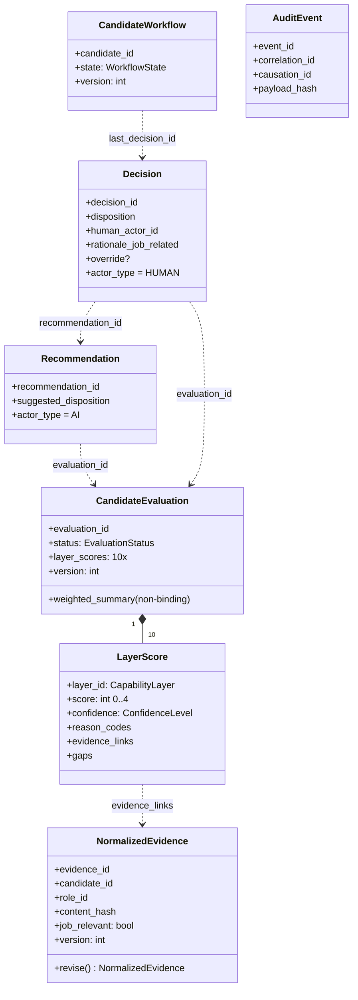
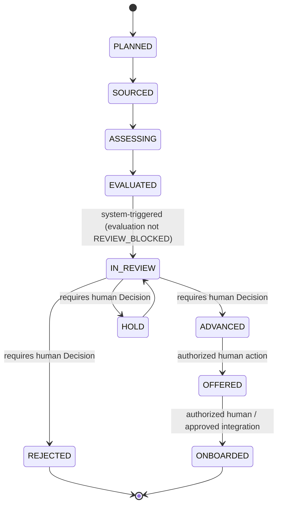
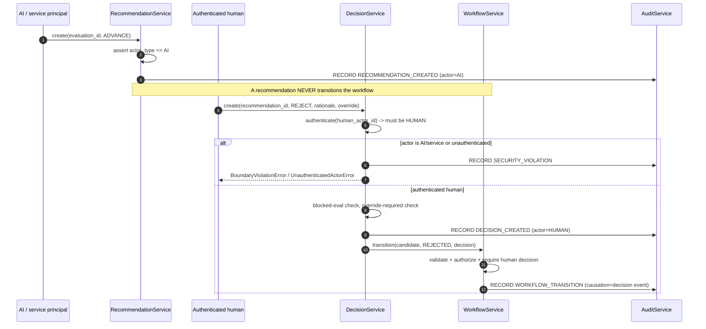

# AI-Hiring Module — Architecture Notes (Phase 1)

This document describes the *implemented* foundation. It is deliberately narrow:
the broader framework (scoring, fairness, governance surfaces) is specified in
[`../../docs/design/AI_ASSISTED_HIRING_FRAMEWORK_DESIGN.md`](../../Project_documentation/repository/docs/design/AI_ASSISTED_HIRING_FRAMEWORK_DESIGN.md)
but not built in this phase.

## Layering

```
api/            depends on -> services, policies, domain, errors
services/       depends on -> policies, repositories(ports), domain, common, errors
policies/       depends on -> domain, errors
repositories/   depends on -> domain, errors           (ports + in-memory adapters)
domain/         depends on -> common, errors            (pydantic only; no frameworks)
common.py       depends on -> stdlib only
errors.py       depends on -> nothing
```

The domain layer never imports services, repositories, or a web framework.
Dependencies point inward; persistence and identity are injected.

## Domain model (class diagram)



## Workflow state machine



* AI actors may drive **no** transition.
* SYSTEM actors may drive only process transitions (`SOURCED`, `ASSESSING`,
  `EVALUATED`, `IN_REVIEW`, `ONBOARDED`).
* `ADVANCED`/`HOLD`/`REJECTED` require a valid human `Decision`.
* A `REVIEW_BLOCKED` evaluation cannot enter `IN_REVIEW` until an explicit
  `EvaluationService.unblock(...)` is recorded.

## Recommendation vs Decision (sequence)



## Audit-event flow

* Every record creation and workflow transition emits an `AuditEvent`.
* Every **denied** boundary/policy action emits a `POLICY_DENIED` or
  `SECURITY_VIOLATION` event before the error is re-raised.
* Events are **append-only**: the repository exposes `append` + read queries and
  no update/delete.
* `payload_hash` is a deterministic SHA-256 over the event payload (sorted
  keys), giving each event a stable content fingerprint.
* `correlation_id` ties a whole request chain together; `causation_id` links
  each event to the one that caused it
  (recommendation → decision → transition). `previous_event_hash` is reserved
  for a future cryptographic hash-chain.

## Security & trust boundaries

| Boundary | Where enforced |
|----------|----------------|
| AI output is advisory, never binding | `Recommendation.actor_type == AI` (domain); `authorize_actor_for_target` refuses AI transitions (policy) |
| Only authenticated humans decide | `assert_human_actor_is_authenticated` via `IdentityProvider` (policy + `DecisionService` + API hook) |
| A `Decision` cannot be AI-authored | `Decision.actor_type` pinned to `HUMAN` (domain) |
| Binding transitions need a human decision | `WorkflowService.transition` + `requires_human_decision` (policy) |
| Divergence from AI needs an override | `assert_override_present_when_required` (policy) |
| Blocked evaluations can't be decided | `assert_blocked_evaluation_cannot_be_decided` (policy) |
| Immutability / no silent overwrite | frozen domain models + versioned repositories |
| Tamper-resistant record of actions | append-only `AuditRepository` + deterministic hashes |
| API-surface authorization | `HiringAPI._authorize` hook per endpoint |
