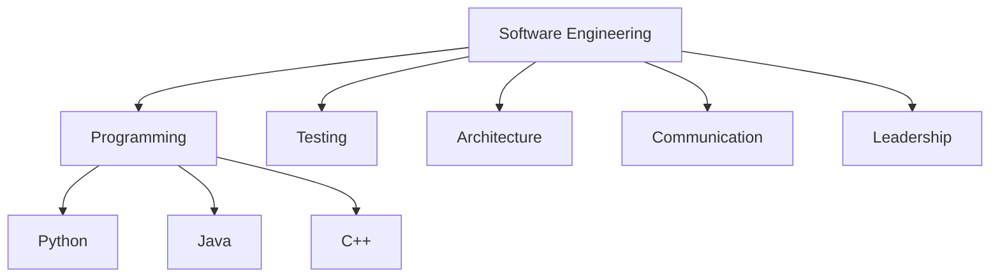
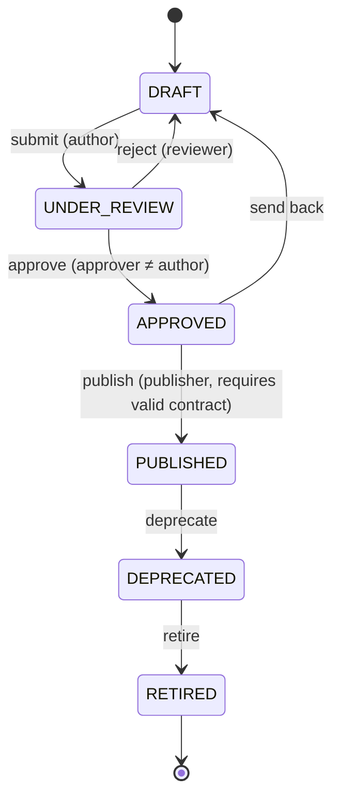
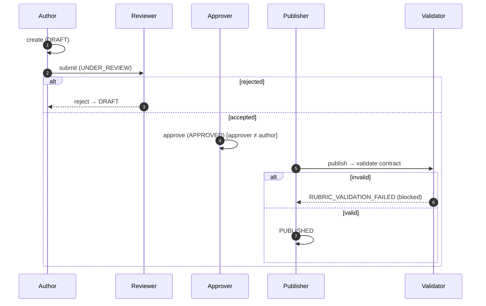
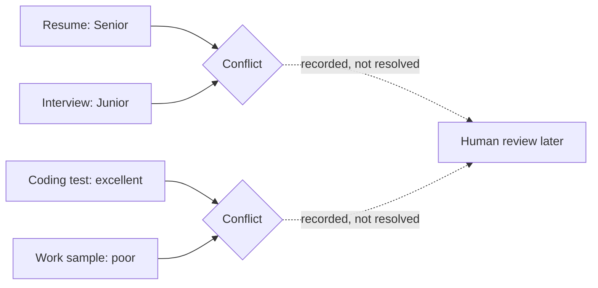

# Capability Ontology & Rubric Contracts (Phase 3A)

The **constitution of evaluation** — immutable contracts that define *what*
evaluation means, frozen before any evaluator is built. This phase does **not**
evaluate candidates, score, rank, or run any model. A future evaluator (Phase 3B)
must consume only these contracts; it may not invent capabilities, scales,
admissibility rules, uncertainty semantics, or reason codes.

## Capability hierarchy

Capabilities form an arbitrary-depth ontology. Each is immutable and versioned.

A `Capability` carries: `capability_id`, `name`, `description`, `category`,
`parent_id`, `child_ids`, `required_evidence_types`, `allowed_evidence_types`,
`minimum_evidence_count`, `status`, `version`, `created_at`, `supersedes`,
`deprecated`. It holds **no scores**. Hierarchy integrity (parent existence, no
cycles) is validated at publish time (`CapabilityGraph`).

## Rubric lifecycle

Only **PUBLISHED** rubrics may later be used for evaluation. Lifecycle is an
append-only snapshot history; every transition records an `ApprovalRecord`.

## Approval workflow

Segregation of duties is enforced: the approver and publisher must differ from
the author.

## Versioning

* **Capabilities** are immutable; retire/supersede create a **new version**
  (the prior version is retained). A published version can never be overwritten.
* **Rubrics** are immutable after publication; a content change creates a new
  DRAFT at `version + 1` (`supersedes` links to the prior rubric). Pre-publication
  lifecycle transitions append immutable snapshots at the same version.

## Evidence rules & admissibility

Each capability/rubric-capability defines an `EvidenceRule`: `allowed_types`,
`required_types`, `prohibited_types`, `minimum_count`, `maximum_count`,
`freshness_days`. A deterministic `AdmissibilityPolicy` classifies a hypothetical
evidence *descriptor* (not candidate data):

| Outcome | Meaning |
|---------|---------|
| ADMISSIBLE | allowed type, fresh, meets minimum |
| INSUFFICIENT | fewer admissible items than `minimum_count` |
| PROHIBITED | a forbidden evidence type is present |
| STALE | older than `freshness_days` |
| UNKNOWN | type neither allowed nor prohibited |

Example — Programming **accepts** Resume/Portfolio/GitHub/Coding Test/Interview
and **rejects** Reference Letter/Photo.

## Missing-evidence semantics

Absence is represented explicitly, never inferred: `NOT_SUBMITTED`,
`NOT_REQUIRED`, `REDACTED`, `QUARANTINED`, `UNAVAILABLE`, `INSUFFICIENT`.

## Scoring scales (no scores)

Only scale *shapes* are defined — never a candidate score. `ScaleType`:
`ONE_TO_FIVE`, `ZERO_TO_TEN`, `PERCENTAGE`, `BINARY`, `PASS_FAIL`, `CUSTOM`. Each
`ScoringScale` stores `minimum`, `maximum`, `labels`, `precision`,
`interpretation`. Standard scales are provided; a rubric may declare custom scales
inline (which must carry labels).

## Reason-code taxonomy

Frozen, documented taxonomy a future evaluator must draw from:
`MISSING_REQUIRED_EVIDENCE`, `STALE_EVIDENCE`, `INSUFFICIENT_SAMPLE`,
`CONFLICTING_EVIDENCE`, `PROHIBITED_EVIDENCE`, `QUARANTINED_CONTENT`,
`LOW_CONFIDENCE`, `NOT_APPLICABLE`. Every code has a `ReasonCodeSpec`
(summary, description, category) in `REASON_CODE_CATALOG`.

## Uncertainty model

Uncertainty is expressed independently of any score. Levels: `HIGH`, `MEDIUM`,
`LOW`, `UNKNOWN`. An `UncertaintyRule` per capability defines the default level
and the allowed levels a future evaluator may use. This phase defines the
contract only; the evaluator fills the values.

## Conflict model

Contradictory evidence is **recorded, never resolved** in this phase. A
`Conflict` has `conflict_id`, `capability_id`, ≥2 `sources` (each a
source + claim), `severity` (LOW/MEDIUM/HIGH/CRITICAL), `reason`, and `status`
(OPEN/ACKNOWLEDGED/ESCALATED — deliberately **no** RESOLVED).

## Rubric validation

`RubricValidationService.validate` runs deterministic checks (returns issues,
does not raise): no capabilities, duplicate capability, weight total ≠ 1.0,
unknown capability, capability version mismatch, unpublished capability, unknown
scoring scale, circular ontology, and per-capability reason code not in the
rubric's allowed set. Publication requires a valid result.

## Architectural rule

> This phase defines the **constitution of evaluation, not the evaluator**.

The Phase-3B evaluator must consume only these immutable contracts — it may not
invent capability definitions, scoring scales, admissibility rules, uncertainty
semantics, or reason codes. Policy and ontology are defined first; execution
engines operate strictly within them.

## Known limitations

* In-memory repositories; no production persistence.
* Placeholder human-governance authorization (Phase-1 identity provider); a real
  role/policy store is future work.
* Weight-total validation requires a sum of 1.0 (tolerance 1e-6); alternative
  weighting schemes are a future extension.
* No cryptographic signing of published contracts yet.
