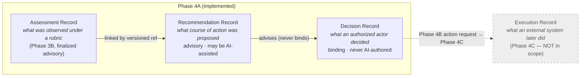
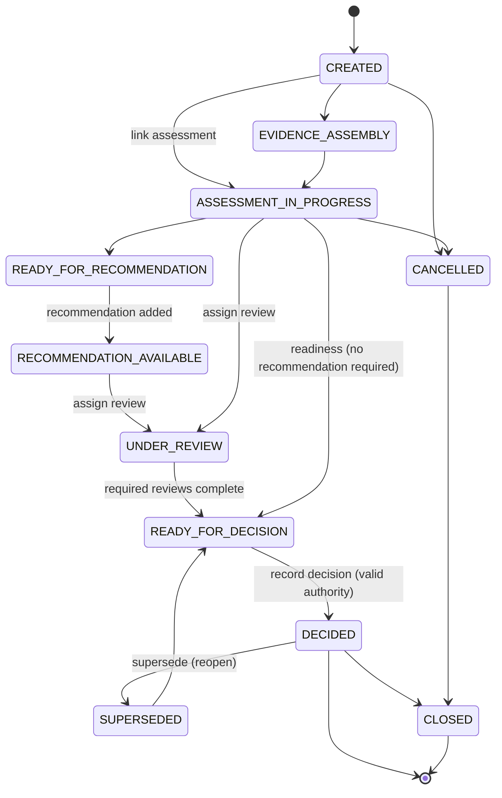
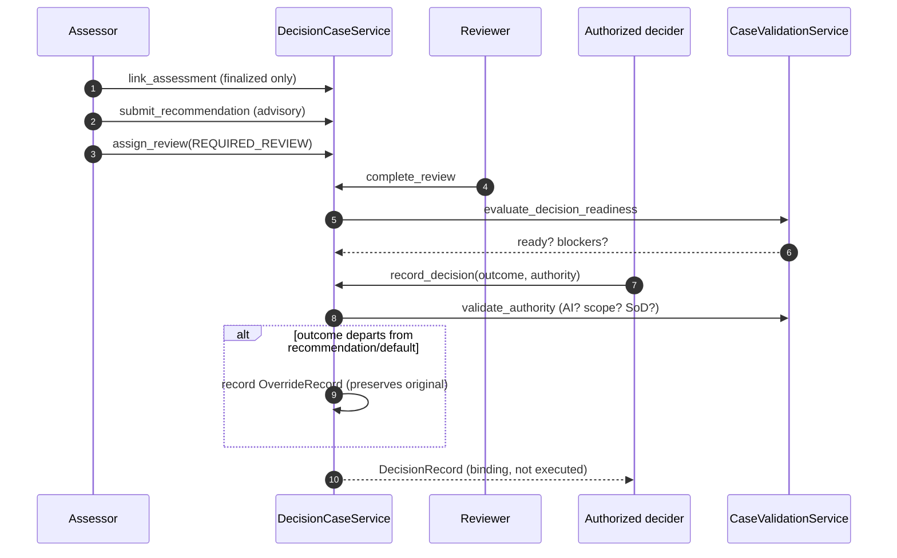
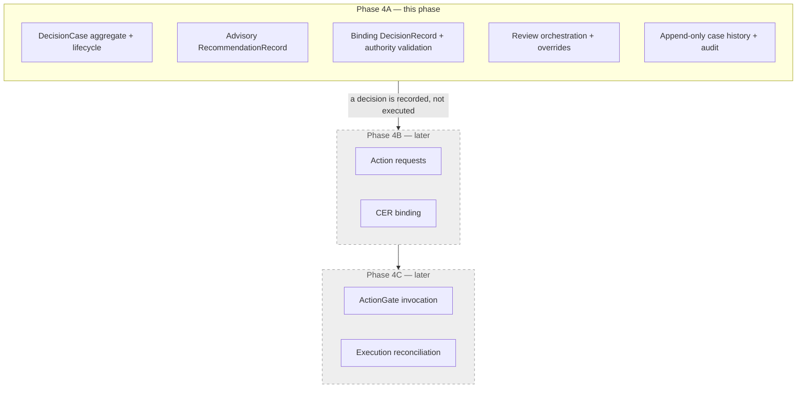

# DecisionCase Aggregate & Lifecycle Orchestration (Phase 4A)

The governed **case container** that links evidence, assessments, recommendations,
human authority, and decisions — without collapsing them into one object.

> **Core principle.** Assessment, recommendation, decision, authorization, and
> execution are **distinct records with distinct authority**. Phase 4A implements
> the first three relationships. It does not execute enterprise actions, construct
> production CERs, invoke the ActionGate, reconcile execution, generate
> recommendations from evidence, reinterpret evidence, rank candidates, or allow
> an AI to make a binding decision.

## Aggregate purpose

A `DecisionCase` is an **immutable, versioned aggregate root**. It references the
records that belong to a decision by id **and explicit version**; it never embeds
them and never carries execution state. Every material change appends a new
snapshot (`version` + a fresh `case_version_id`) that points back at its
predecessor via `supersedes_case_version_id`. The latest version never overwrites
a prior one, so the full history is reconstructable.

## Four-record separation

The whole point of the aggregate is to keep four kinds of record apart. Phase 4A
owns the first three; execution is deferred to Phases 4B/4C.

Enforced separations (tested):

* an assessment carries no recommendation or decision field;
* a recommendation carries no binding-decision field and cannot bind the case;
* a decision carries no execution state;
* rejected recommendations remain visible (rejection appends, never deletes);
* multiple — including conflicting — recommendations coexist;
* a decision may be made with no recommendation and no AI involvement.

## Authority model

Authority is a first-class, validated concept — **not** an attribute of the actor.
No `AuthorityType` is an AI model, and the service boundary additionally rejects
any AI-authenticated principal.

| Authority type | Who | Requirement |
| --- | --- | --- |
| `HUMAN_REVIEWER` / `HUMAN_APPROVER` / `COMMITTEE` | a person | authenticated **human** actor |
| `DELEGATED_POLICY` | a deterministic, published policy (service principal) | granting policy ref **and** explicit scope/limits |
| `EXTERNAL_AUTHORITY` | an external decision system | recorded, non-AI |

> Human oversight does not always mean synchronous human approval; it may include
> **explicitly delegated and bounded** authority. Delegated policy is never
> unrestricted AI discretion — it must name a granting policy and stay within a
> stated scope, and an AI principal can never exercise it.

## Operating modes

* **Deliberative** — a human reviews the case and issues the decision.
* **Delegated Policy** — a bounded, published policy issues the decision within
  explicit limits.
* **Real-Time Preparation** — the case may *prepare* a decision request for later
  enforcement, but Phase 4A never authorizes or executes an action.

## Lifecycle

Rules: case creation does not require a recommendation; only finalized assessments
may be linked; blocking assessment conditions and outstanding required reviews
prevent decision readiness; a recommendation is optional unless policy requires it;
a decision requires valid authority; **`DECIDED` is not `executed`** — there is no
transition to any execution state; cancellation and supersession preserve history.

## Review tasks and overrides

Review tasks make required human steps explicit (`REQUIRED_REVIEW`,
`SECONDARY_APPROVAL`, `CONFLICT_REVIEW`, `EVIDENCE_GAP_REVIEW`,
`RECOMMENDATION_REVIEW`, `DECISION_REVIEW`). A task is immutable; completing it
appends a new revision.

An **override** is created when a decision departs materially from a recommendation
or a policy default. It preserves the original proposal, the final outcome, the
authorizing actor, structured reason codes, optional notes, a timestamp, and the
permitting policy. **It never rewrites the recommendation** — the original record
stays intact and visible.

## Append-only history

Case snapshots, recommendations, decisions, overrides, and review-task revisions
are append-only and immutable. Nothing is overwritten or deleted; supersession
chains and full version history are retrievable and deterministically
reconstructable.

## Authorization & segregation of duties

Every operation is authenticated and authorized against a grant-based policy
(`CREATE_DECISION_CASE`, `LINK_ASSESSMENT`, `SUBMIT_RECOMMENDATION`,
`VIEW_DECISION_CASE`, `ASSIGN_REVIEW`, `COMPLETE_REVIEW`, `MAKE_DECISION`,
`OVERRIDE_RECOMMENDATION`, `SUPERSEDE_DECISION_CASE`, `CANCEL_DECISION_CASE`,
`CLOSE_DECISION_CASE`). Repository access alone confers no authority. Segregation
of duties is enforced where required: the author of a recommendation may not also
be the sole decision authority. Denied actions are audited as
`DECISION_CASE_ACCESS_DENIED`.

## Phase 4A vs Phase 4B / 4C

## Explicit non-goals (out of scope for Phase 4A)

* Executing enterprise actions; constructing production CERs; invoking the
  ActionGate; reconciling downstream execution; creating placeholder execution
  records.
* Generating recommendations from evidence; reinterpreting evidence; ranking or
  comparing candidates; replacing Phase 3B validation.
* Allowing an AI to make (or hold authority for) a binding decision.
* Erasing prior records when a decision changes — changes always supersede.
