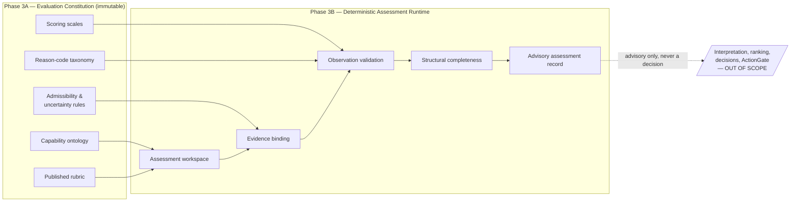
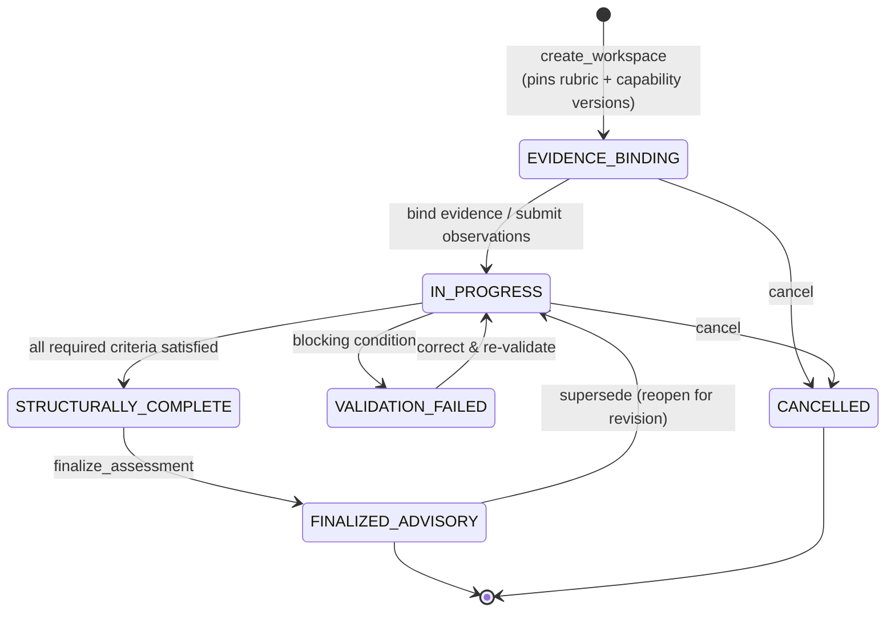
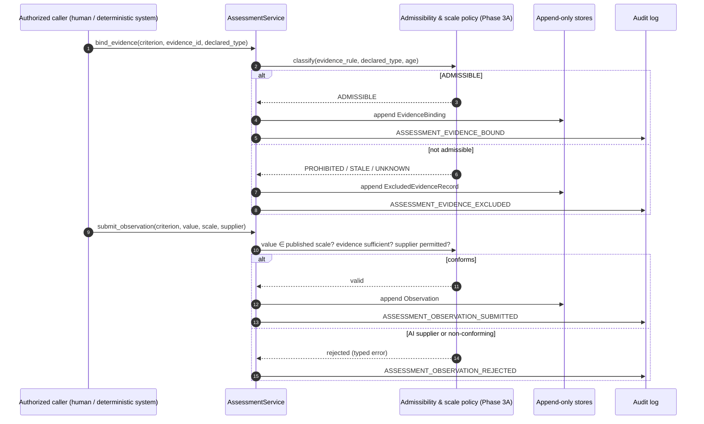
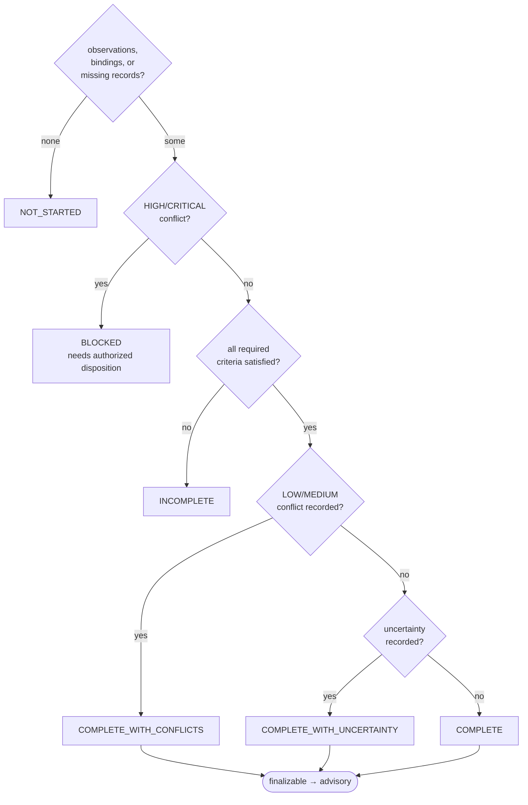

# Deterministic Assessment Runtime (Phase 3B)

The runtime that **executes** the immutable Phase-3A evaluation constitution —
deterministically, and with **no AI inference of any kind**. Phase 3B proves that
the evaluation constitution can execute before any AI system is permitted to
interpret evidence under it.

> **No LLM inference in Phase 3B.** This runtime contains no model call, no text
> interpretation, no embedding, no similarity scoring, and no free-form
> reasoning. It binds, validates, records, and assembles. Every value it stores
> is *supplied by an authorized non-AI source* and *checked for conformance* —
> never computed, inferred, or ranked.

## What this phase does and does not do

**It MAY:** create assessment workspaces; resolve published rubric/capability
versions; bind eligible evidence to rubric criteria; apply deterministic
admissibility rules; record missing evidence explicitly; accept externally
supplied observations; validate observations against published scales; record
uncertainty and conflicts; bind approved reason codes; compute *structural*
completeness; produce advisory assessment records; maintain append-only history;
and emit audit events.

**It MUST NOT:** call an LLM; interpret text; infer findings; generate scores
from free-form evidence; generate recommendations; rank or compare candidates;
make or authorize decisions; construct CERs or invoke the ActionGate; create or
modify capabilities, rubrics, scales, or reason codes; resolve conflicts
autonomously; or mutate any published contract.

## Position in the pipeline

The runtime sits strictly *downstream* of the frozen constitution and strictly
*upstream* of any interpretation or decision layer.

## Workspace lifecycle

A workspace is the mutable scratch space in which one subject is assessed against
one published rubric version. It moves through explicit states; finalization
produces an immutable advisory `Assessment`. The workspace itself is versioned
and append-only — `with_status` always mints a new version, never mutating the
prior one.

`create_workspace` resolves the **published** rubric, pins its version, and for
every `RubricCapability` pins the referenced **published** capability version. A
criterion is *required* when its evidence rule demands at least one item
(`minimum_count >= 1`) or names required types. Nothing about a criterion is
inferred — it is copied from the frozen contract.

## Binding, observing, and validating

Evidence is bound to a specific criterion only after deterministic, fail-closed
checks. The evidence **type is declared by an authorized caller** — it is never
guessed from content — and admissibility is decided by the Phase-3A
`AdmissibilityPolicy`. An observation carries a value supplied by an authorized
**non-AI** source; the runtime only checks that the value is a member of the
published scale and that the contract's evidence, uncertainty, and reason-code
requirements are met.

Key boundaries enforced here:

* **AI-supplied observations are rejected** before the value is even considered
  (`SupplierType.AI_MODEL` is not in `PERMITTED_SUPPLIERS`).
* An **explanation reference never substitutes for required evidence** — the
  minimum admissible-evidence count is checked against real bindings.
* A **declared scale must match** the criterion's published scale; values are
  validated by pure membership only.

## Structural completeness (never a judgement of quality)

Completeness is *structural*: it asks whether the constitution has been executed,
not whether the candidate is good. A supported low value is `COMPLETE`; a
favourable value with missing required evidence is `INCOMPLETE`; a HIGH/CRITICAL
unresolved conflict is `BLOCKED`.

The deterministic conflict policy for Phase 3B: **HIGH/CRITICAL conflicts block
finalization** (they require a later authorized disposition that is out of this
phase's scope); LOW/MEDIUM conflicts are recorded and surface as
`COMPLETE_WITH_CONFLICTS`. The runtime **never resolves a conflict itself**.

## Append-only advisory records

Finalization writes an immutable `Assessment` whose `advisory_only` field is a
`Literal[True]` that cannot be constructed as anything else. It carries no score,
rank, recommendation, or decision field. A superseding revision reopens the
workspace, and re-finalization **appends** a new version pointing back at the
prior one via `supersedes_assessment_id`; the earlier record is never rewritten.
New facts create new records; they do not rewrite historical meaning.

## Contracts and services

| Layer | Artifacts |
| --- | --- |
| Contracts (`ai_hiring/assessments/`) | `AssessmentWorkspace`, `CapabilityBinding`, `EvidenceBinding`, `ExcludedEvidenceRecord`, `MissingEvidenceRecord`, `Observation`, `Conflict` (Phase-3A), `CompletenessResult`, `CapabilityAssessment`, `Assessment` |
| Services (`ai_hiring/services/`) | `EvidenceBindingService`, `AssessmentValidationService`, `AssessmentCompletenessService`, `AssessmentService` |
| Repositories (`ai_hiring/repositories/`) | `AssessmentWorkspaceRepository`, `AssessmentRepository` (+ in-memory adapters) |
| API (`ai_hiring/api/assessment_routes.py`) | `AssessmentAPI` facade + optional FastAPI router — **no** score/rank/recommend/approve/reject/hire endpoints |

Every state-changing operation is authenticated, authorized against an
`EvidenceAccessPolicy` grant, and recorded in the append-only audit log with the
workspace correlation id.
