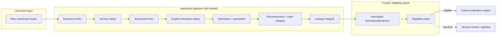
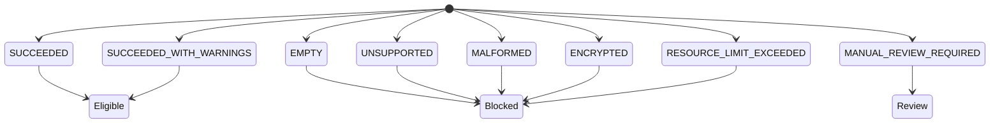
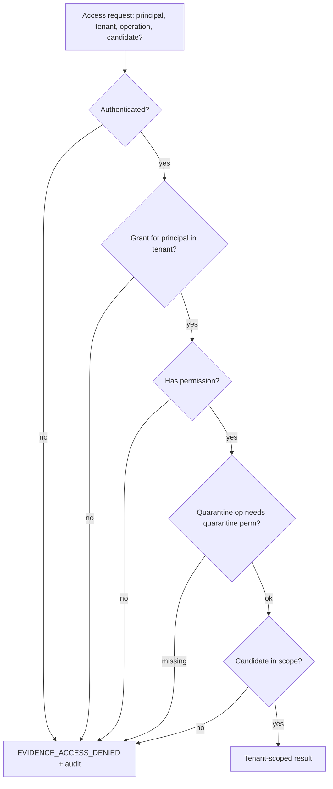
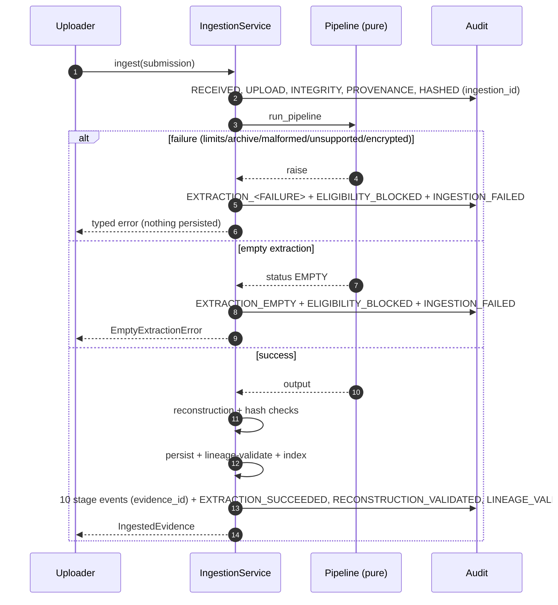
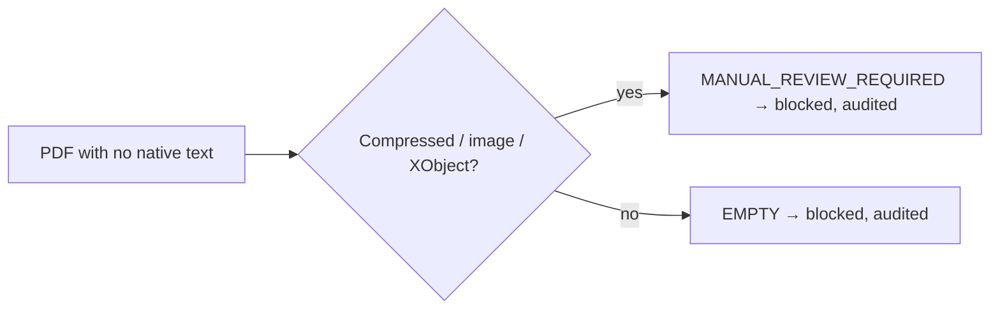

# Evidence Boundary Hardening (Phase 2.5)

A narrow hardening phase that strengthens the evidence boundary **before** any
rubric scoring, capability evaluation, embeddings, semantic extraction, LLM
inference, ranking, or recommendation generation exists.

> **No hiring evaluation or scoring logic was introduced in Phase 2.5.**

## Objective

Enforce the invariant:

> Only successfully extracted, authorized, provenance-linked, non-quarantined,
> structurally valid evidence may become **evaluation-eligible**.

Malformed, unsupported, oversized, ambiguous, unauthorized, or incompletely
extracted evidence must fail **closed** — blocked, quarantined, or routed for
human review — and must never silently degrade into empty or partially trusted
evidence that a future evaluation engine could consume.

## Trust boundary

## Extraction-status state model

Success is never inferred from a returned string; the `ExtractionResult` sets
`status` and `evaluation_eligible` deliberately, and `evaluation_eligible` can
only be true for `SUCCEEDED` / `SUCCEEDED_WITH_WARNINGS` with non-empty content.

## Evaluation-eligibility decision table

Eligible **only when every** condition holds (fail-closed; defaults unsafe):

| Condition | Reason code if false |
|-----------|----------------------|
| status ∈ {SUCCEEDED, SUCCEEDED_WITH_WARNINGS} | EXTRACTION_EMPTY / FORMAT_UNSUPPORTED / DOCUMENT_MALFORMED / DOCUMENT_ENCRYPTED / RESOURCE_LIMIT_EXCEEDED / MANUAL_REVIEW_REQUIRED |
| normalized content non-empty | EXTRACTION_EMPTY |
| provenance complete | PROVENANCE_INCOMPLETE |
| integrity hashes valid | HASH_MISMATCH |
| lineage valid | LINEAGE_INVALID |
| not quarantined | QUARANTINED_CONTENT |
| tenant consistent | TENANT_MISMATCH |
| application consistent | APPLICATION_MISMATCH |
| caller authorized | ACCESS_DENIED |

The policy returns typed reason codes, not a bare boolean. A future evaluation
service must call it and must not bypass it by reading a repository directly.

## Resource-limit table (configurable via `EvidenceLimits`)

| Domain | Limits |
|--------|--------|
| Global | max_input_bytes |
| Text / source | max_characters, max_lines, max_line_length, max_null_bytes, max_invalid_utf_ratio |
| Archive (DOCX/ZIP) | max_archive_entries, max_entry_bytes, max_total_uncompressed_bytes, max_compression_ratio, max_path_depth, max_xml_bytes |
| JSON | max_json_bytes, max_json_depth, max_json_fields, max_json_array_length, max_json_total_scalars, max_json_string_length |
| CSV | max_csv_bytes, max_csv_rows, max_csv_columns, max_csv_cell_length, max_csv_total_cells, max_csv_header_length |

## PDF capability limitation

PDF support is **LIMITED — bounded native-text extraction from uncompressed
streams only**. No OCR, no scanned/image-only pages, no encrypted PDFs, no
FlateDecode/compressed streams, no complex layouts. Encrypted PDFs → `ENCRYPTED`;
empty text → `EMPTY` (blocked, never accepted); ambiguous compressed/image-only
→ `MANUAL_REVIEW_REQUIRED`. The README and API must never claim blanket "PDF
supported".

## DOCX archive-safety model

DOCX is a ZIP container; `archive_safety.inspect_archive` performs bounded,
in-memory-only checks (no filesystem extraction): entry count, per-entry size,
total uncompressed size, compression ratio (ZIP-bomb), absolute/traversal/deep
paths, encrypted entries, and an XML-byte ceiling on the read of
`word/document.xml`. Structural failures → `ContentExtractionError`; abuse →
`ArchiveSafetyError`.

## Structured-format limits

JSON is parsed with byte, depth, field-count, array-length, scalar-count, and
string-length limits, and **duplicate keys are rejected** (an attacker cannot
shadow a field past quarantine). CSV enforces byte, row, column, cell-length,
total-cell, and header-length limits deterministically. Any limit failure yields
no partially-accepted evidence.

## Duplicate classifications

A matching hash never automatically means the same record; identity includes the
full context (tenant, candidate, application, role, assessment, uploader).

| Classification | Behavior |
|----------------|----------|
| EXACT_BINARY_DUPLICATE (same bytes, same stage) | blocked (idempotency) |
| NORMALIZED_CONTENT_DUPLICATE (diff bytes, same normalized, same stage) | new raw artifact preserved |
| NEW_VERSION (declared revision) | new immutable version |
| CROSS_CONTEXT_REUSE (same candidate, other assessment) | new record, explicit cross-context |
| CROSS_CANDIDATE_DUPLICATE | never merges ownership/provenance |
| CROSS_TENANT_DUPLICATE | never disclosed; no information leak |

## Lineage integrity rules

No self-parenting; no cycles; parents must exist; parent/child share tenant and
compatible candidate/application; version ancestry is monotonic; no conflicting
immediate predecessors; persisted nodes immutable. Typed errors: `LineageCycleError`,
`LineageParentNotFoundError`, `LineageContextMismatchError`,
`LineageVersionRegressionError`, `LineageConflictingParentError`.

## Authorization model

Permissions: `EVIDENCE_READ`, `EVIDENCE_SEARCH`, `EVIDENCE_LINEAGE_READ`,
`EVIDENCE_VERSION_READ`, `QUARANTINE_READ`, `QUARANTINE_ADMIN`. Repositories never
decide authorization; the access service authenticates (Phase-1 identity
provider), authorizes, and scopes every read/search to the caller's tenant.
Results are filtered before return so unauthorized matches never affect counts;
cross-tenant search is denied; quarantine needs a separate permission; denials
are audited.

## Quarantine non-leakage model

Quarantined values never appear in normalized evidence, chunks, keyword/metadata
search, lineage payloads, audit payloads, duplicate reports, API error messages,
version comparisons, or debug representations. Audit records the **fact** of
quarantine with safe identifiers/classifications only. Raw values are preserved
(never deleted) in the quarantine store and reachable solely via a quarantine
permission.

## Reconstruction verification

`verify_reconstruction` checks contiguous offsets, no overlap/gaps, correct
order, declared length == content length, per-chunk hash, single evidence
version, and reconstructed-normalized-hash == evidence `normalized_hash`. Corrupt,
missing, reordered, duplicated, or foreign chunks fail closed. No silent repair.

## Failure and retry behavior (atomic ingestion)

Ingestion simulates transaction-like behavior: the pure pipeline runs and its
output is integrity-validated **before** anything is persisted or indexed. On any
failure there is no searchable/completed evidence and no evaluation-eligible
artifact; the lifecycle is audited and a typed error is raised. Retries are
deterministic; an exact same-context duplicate retry is blocked (idempotency)
rather than creating uncontrolled copies.

## Audit-outcome matrix

| Outcome | Present (by correlation) | Absent |
|---------|--------------------------|--------|
| Success | UPLOAD…VERSION_CREATED, INDEXED, EXTRACTION_SUCCEEDED/WARNING, RECONSTRUCTION_VALIDATED, LINEAGE_VALIDATED, INGESTION_COMPLETED | INGESTION_FAILED |
| Empty | UPLOAD…CONTENT_HASHED, EXTRACTION_EMPTY, ELIGIBILITY_BLOCKED, INGESTION_FAILED | INDEXED, INGESTION_COMPLETED |
| Malformed/limit/unsupported/encrypted | UPLOAD…CONTENT_HASHED, EXTRACTION_<FAILURE>, ELIGIBILITY_BLOCKED, INGESTION_FAILED | INDEXED, INGESTION_COMPLETED |
| Manual review | …, MANUAL_REVIEW_REQUIRED, ELIGIBILITY_BLOCKED | INDEXED, INGESTION_COMPLETED |
| Duplicate (exact) | DUPLICATE_DETECTED, INGESTION_FAILED | INDEXED, INGESTION_COMPLETED |
| Access denied | ACCESS_DENIED | — |

## Format capability matrix

Machine-readable in `normalization/capability_matrix.py`
(`CAPABILITY_MATRIX` / `get_capability`). Support levels: FULL, LIMITED,
STRUCTURED_ONLY, TEXT_ONLY, UNSUPPORTED.

| Format | Support | Notes |
|--------|---------|-------|
| TEXT / MARKDOWN / SOURCE_CODE | FULL | binary rejected; code-safe normalization preserves indentation |
| INTERVIEW_TRANSCRIPT / WORK_SAMPLE / PORTFOLIO_ARTIFACT | TEXT_ONLY | text only; no audio/video/binary |
| JSON / CSV / STRUCTURED_RESPONSE | STRUCTURED_ONLY | bounded; duplicate JSON keys rejected |
| DOCX | LIMITED | archive-safe zip+xml; images/encrypted unsupported; empty → EMPTY |
| PDF | LIMITED | bounded native text only; no OCR/scanned/encrypted/compressed |

## Manual-review path

## Known residual limitations

* PDF extraction is native-text only (no OCR/compressed/encrypted).
* In-memory repositories/index; single-process; atomicity is simulated (no real
  DB transaction).
* Quarantine classifies field **identity** (names/aliases), not free-text
  semantics — a protected attribute embedded in prose is not detected (semantic
  PII detection is explicitly out of scope).
* Authorization uses a placeholder grant store + the Phase-1 identity provider;
  a production IdP/policy store is future work.
* Hash comparisons use `hmac.compare_digest`; there is no cryptographic audit
  hash-chain yet (`AuditEvent.previous_event_hash` remains reserved).
