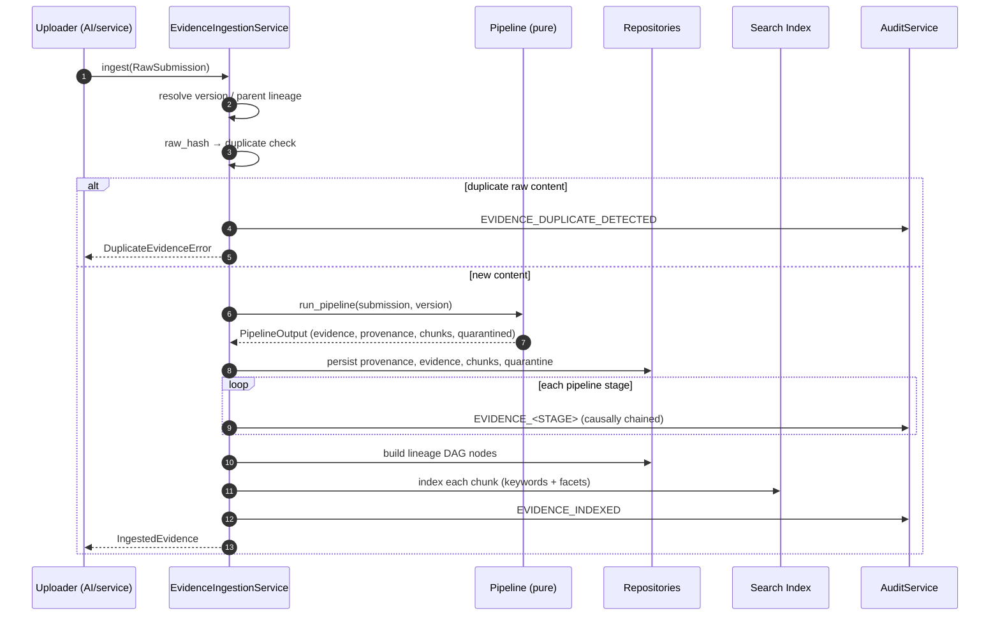
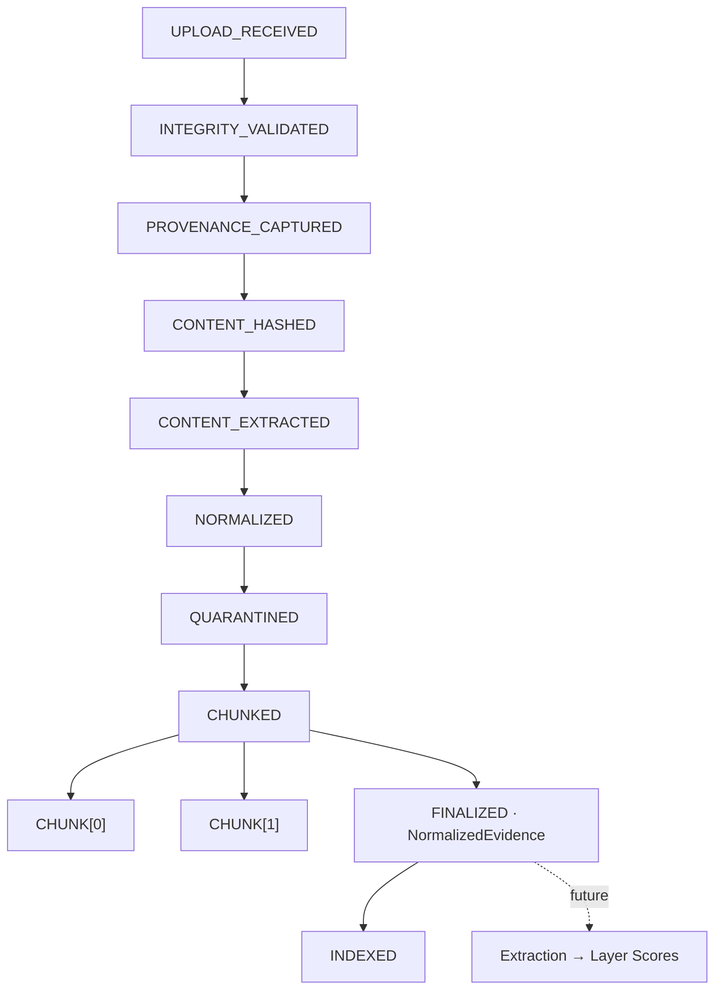

# Evidence Ingestion & Normalization — Pipeline (Phase 2)

Implements **Layer 3.3 — Evidence Ingestion & Normalization** of the design
specification: the immutable evidence substrate later AI modules consume. This
phase contains **no** scoring, extraction-of-meaning, ranking, fairness, or LLM
inference — only deterministic ingestion, normalization, quarantine, chunking,
indexing, lineage, and audit.

## Pipeline

```
Raw Submission
   ↓ Integrity Validation        (size ceiling, non-empty)
   ↓ Provenance Capture          (source metadata)
   ↓ Hash Generation             (raw_hash over raw bytes)
   ↓ Content Extraction          (format parser → text / fields)
   ↓ Normalization               (Unicode/whitespace/encoding; profile-aware)
   ↓ PII / Non-job-Relevant Quarantine   (structured fields classified)
   ↓ Evidence Chunking           (contiguous windows; exact reconstruction)
   ↓ Immutable NormalizedEvidence (normalized_hash; version)
   ↓ Search Index                (per-chunk, deterministic)
   ↓ Audit Event                 (one per stage, append-only)
```

Every stage emits its own append-only audit event and appends a transformation
step to provenance. The pure transformation lives in
`normalization/pipeline.py`; persistence, audit, indexing, and lineage are
applied by `services/evidence_ingestion_service.py`.

## Ingestion sequence



## Lineage DAG



Nodes are immutable and store only `parent_ids`; children are derived at read
time. Downstream phases attach as further children of the `FINALIZED` evidence
node — no scoring node exists yet.

## Versioning model

* A new upload → a new evidence object (`evidence_id`, `version = 1`).
* A revision (`ingest(parent_evidence_id=...)`) → the **same** `evidence_id`
  with `version = latest + 1`; prior versions are never overwritten
  (the Phase-1 versioned repository rejects re-adding an existing version).
* Provenance records `version`, `parent_version`, `ancestor_version`,
  `created_from`, and the full `transformation_history`.
* `ProvenanceService.versions()` / `.ancestry()` reconstruct the version chain;
  `EvidenceRepository.get_version()` returns any specific immutable version.

## Content hashing

| Hash | Over | Purpose |
|------|------|---------|
| `raw_hash` | exact raw submission bytes | duplicate detection; two byte-identical uploads share it |
| `normalized_hash` | normalized text (UTF-8) | canonical identity; whitespace/encoding-only differences converge |

Both are SHA-256 and stored on `Provenance`. The Phase-1 `NormalizedEvidence.content_hash`
carries the `normalized_hash`.

## Quarantine rules

Operates on the **named fields** of structured evidence (JSON/CSV/STRUCTURED_RESPONSE).

| Class | Trigger | Outcome |
|-------|---------|---------|
| PROHIBITED | matches a protected-attribute rule/alias (age→dob, gender→sex, …) | withheld; stored separately; audited |
| NON_JOB_RELEVANT | configured not-relevant field | quarantined |
| JOB_RELEVANT | on the allowlist, or (no allowlist) any non-prohibited field | proceeds downstream |
| UNKNOWN | not on the allowlist when one is configured | quarantined |

Quarantined values are **never deleted** — they are stored in the
`QuarantineRepository` and never appear in the normalized text, chunks, or index.
Prohibited categories (configurable via `QuarantinePolicy`): age, race, gender,
religion, pregnancy, national origin, political affiliation, medical history,
disability, sexual orientation, marital status. Unstructured free text has no
discrete fields, so its semantic content is never altered.

## Search architecture

Deterministic keyword-and-metadata retrieval only — **no** embeddings, vector
search, or semantic ranking.

* One `IndexEntry` per **chunk**, carrying evidence-level facets (candidate,
  role, assessment item/type, document type, filename) plus a tokenized keyword
  set and metadata.
* `SearchQuery` filters are conjunctive (AND); keyword match is exact-token over
  a deterministic tokenization (lowercase, split on non-alphanumeric).
* Results are ordered by `(evidence_id, version, chunk_index)` — fully
  reproducible.

## Audit flow

Append-only, one event per stage, causally chained:

```
EVIDENCE_UPLOAD_RECEIVED → EVIDENCE_INTEGRITY_VALIDATED →
EVIDENCE_PROVENANCE_CAPTURED → EVIDENCE_CONTENT_HASHED →
EVIDENCE_CONTENT_EXTRACTED → EVIDENCE_NORMALIZED →
EVIDENCE_PII_QUARANTINED → EVIDENCE_CHUNK_CREATED →
EVIDENCE_VERSION_CREATED → EVIDENCE_INDEXED
```

Plus `EVIDENCE_DUPLICATE_DETECTED` when identical raw content is re-submitted.
Each event carries a deterministic `payload_hash` and `correlation_id`/
`causation_id`, so the whole pipeline for an `evidence_id` reconstructs from
`AuditService.history(evidence_id)`. Audit remains append-only (Phase-1 semantics
unchanged).

## Supported formats & documented limitations

TEXT · MARKDOWN · SOURCE_CODE · INTERVIEW_TRANSCRIPT · WORK_SAMPLE ·
PORTFOLIO_ARTIFACT (text decode) · JSON · CSV · STRUCTURED_RESPONSE (field
extraction) · DOCX (stdlib zipfile + XML) · PDF (uncompressed text operators).

* **PDF**: only uncompressed `(...) Tj`/`TJ` text; no OCR, no FlateDecode. Scanned
  or compressed PDFs extract empty text.
* **Video/audio** are not decoded — transcripts are ingested as text.
* Normalization is **profile-aware**: prose formats collapse tabs/repeated
  spaces; code/structured formats use a code-safe profile that preserves
  indentation and internal spacing (semantic content is never altered).
