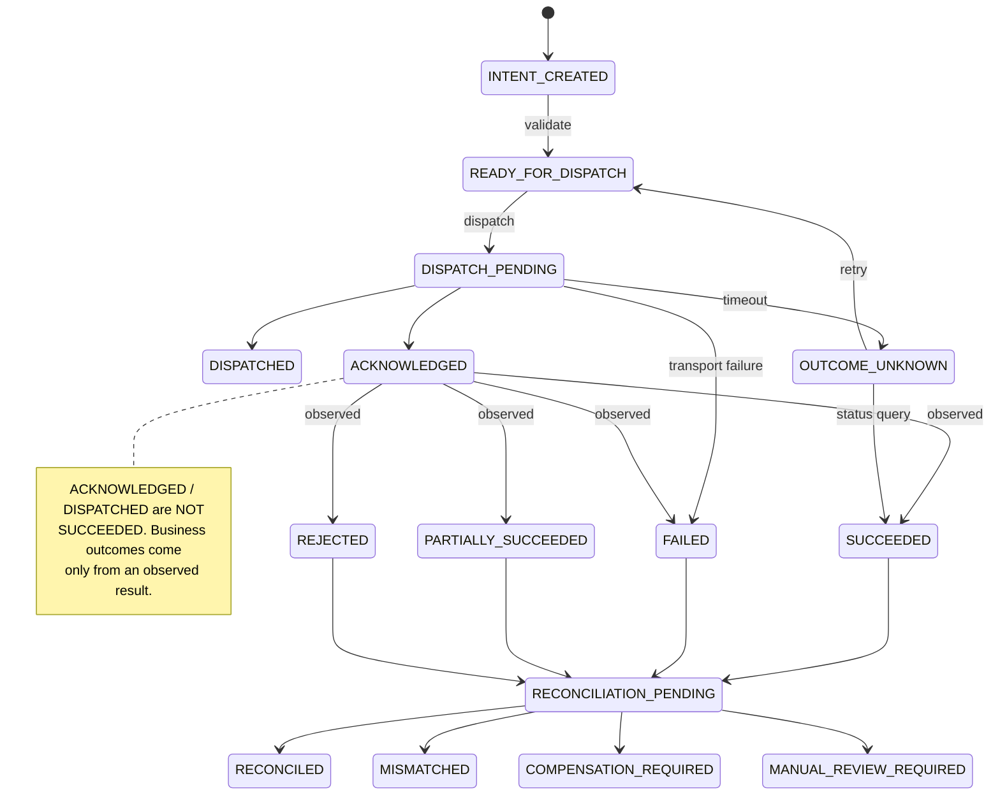
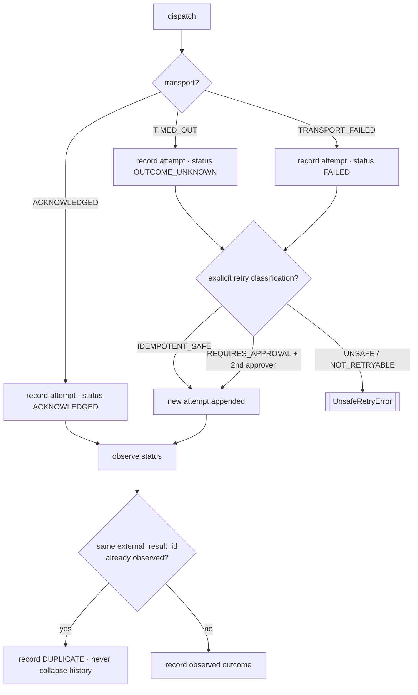
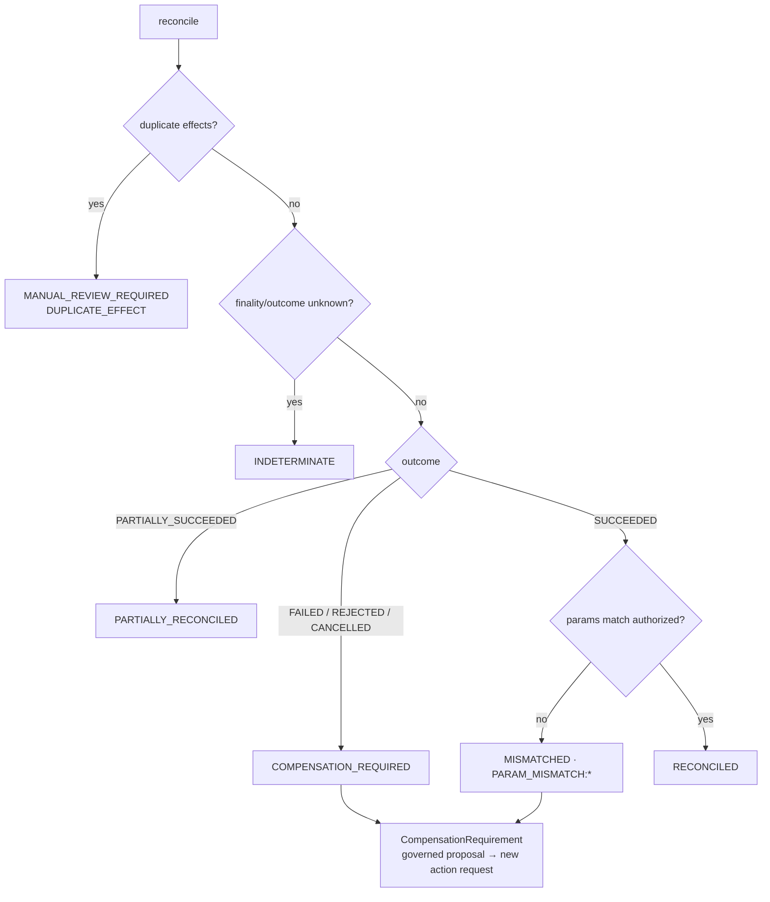

# External Execution, Immutable Execution Records & Reconciliation (Phase 4C)

Phase 4C takes a valid, unexpired, **control-plane-authorized** ``ActionRequest``,
dispatches it through a provider-neutral external-execution port, records every
attempt immutably, and reconciles the *observed* external result against the
authorized intent.

> **Phase 4C records what was attempted and what the external system actually did.
> Dispatch, acknowledgement, authorization, and business success are distinct
> states.**

## Authorization vs execution

> Authorization permits an execution *attempt*. It does not prove that execution
> occurred, succeeded, or produced the intended external result.

Phase 4B answered *may this proposed action execute under runtime controls?*
Phase 4C answers *what happened when we attempted it?* — and keeps the two apart.

## Transport outcome vs business outcome

Two independent axes, never conflated:

* **Transport** (from ``dispatch``): `DISPATCHED` / `ACKNOWLEDGED` /
  `TRANSPORT_FAILED` / `TIMED_OUT` / `UNKNOWN`. A transport acknowledgement means
  the request was *received*, not that the business action *happened*.
* **Business** (from an *observed* status query or callback): `SUCCEEDED` /
  `FAILED` / `PARTIALLY_SUCCEEDED` / `REJECTED` / `CANCELLED_EXTERNALLY` /
  `DUPLICATE` / `UNKNOWN`. Business outcomes create execution records; dispatch
  alone never does.

## Authorized request → reconciliation

```mermaid
flowchart LR
    AR[Authorized ActionRequest<br/>AUTHORIZED / …_WITH_CONSTRAINTS] --> EI[ExecutionIntent<br/>immutable · params ⊆ authorized]
    EI --> EA[ExecutionAttempt<br/>transport only]
    EA --> EXT[[ExternalExecutionPort]]
    EXT --> ER[ExecutionRecord<br/>observed business outcome]
    ER --> RR[ReconciliationResult<br/>authorized vs observed]
    RR --> OUT{Closed | Mismatched |<br/>Compensation required |<br/>Manual review}
    RR -.->|if needed| CR[CompensationRequirement<br/>governed proposal]
```

## ExecutionIntent

An immutable intent references **one exact authorized ``ActionRequest`` version**
and one valid, executable authorization response. Its parameters are a **subset**
of what was authorized — no new business parameters, target, or action type may be
introduced. Constrained authorizations carry their constraints and obligations
into the intent exactly. The intent stores no external result; its
``content_hash`` covers only the authorized content, so it is stable across
lifecycle transitions (a correction is a new intent). Execution idempotency is
distinct from action-request idempotency.

Only `AUTHORIZED` and `AUTHORIZED_WITH_CONSTRAINTS` outcomes may create an intent.

## Execution lifecycle



## Attempts, timeout, retry, and duplicates

Each dispatch creates a new immutable ``ExecutionAttempt`` with a monotonic number,
recording only the transport result and external request id (the payload is
hashed, not logged). A **timeout yields `OUTCOME_UNKNOWN`, never automatic
failure.** No retry happens without an explicit ``RetryClassification``; a
non-idempotent retry (`REQUIRES_APPROVAL`) needs a distinct second approver, and
`UNSAFE` / `NOT_RETRYABLE` retries are refused.



## Reconciliation

Reconciliation compares the authorized intent (action type, target, subject,
authorized/constrained parameters, quantity/amount) against the observed effects
(business outcome, observed parameters, finality, duplicates) and produces an
immutable ``ReconciliationResult``. It **never mutates the source records.**



## Compensation

A ``CompensationRequirement`` is a **proposal or obligation, never an automatic
rollback.** Rollback is not assumed possible; any compensating action must pass
through the normal governance chain (a new Phase-4B governed action request).
Resolution appends a new immutable revision and never mutates the original
execution outcome; closing preserves history.

## Retries and idempotency

Execution idempotency (`execution_idempotency_key`) is distinct from action-request
idempotency: identical re-creation returns the existing intent; a different payload
under the same key is a conflict. Retries are explicit, classified, and
append-only — there is **no silent retry**.

## Security boundary

Every operation is authenticated, tenant-scoped, and authorized against a
grant-based policy. Having authorized the action request (4B) or made the decision
(4A) grants **no** automatic dispatch privilege; adapter management is a separate
permission from dispatch; non-idempotent retry may require a second approver. Audit
events record hashes and references (payload hash, observed-result hash, external
request id, transport status, business outcome, mismatch codes, reconciliation
status, compensation references) — never credentials, unrestricted downstream
payloads, raw sensitive evidence, or chain-of-thought.

## Explicit non-goals (out of scope for Phase 4C)

* Reinterpreting evidence; changing assessments, recommendations, or decisions.
* Altering the original ``ActionRequest``, CER, or authorization response.
* Ranking candidates; introducing autonomous AI decision authority.
* Treating dispatch, an HTTP 2xx / transport ack, or authorization as business
  completion.
* Silent retries of non-idempotent operations; fabricating downstream outcomes.
* Overwriting execution history; calling a concrete vendor SDK from the domain
  layer; implementing Phase 3C or any policy discovery/generation.

## Known limitations

* In-memory repositories; a single offline deterministic execution adapter.
* Reconciliation compares action type, target, parameters, finality, and duplicate
  effects; richer quantity/amount arithmetic and obligation-fulfilment checks are
  left for a later iteration.
* Compensation routing to a new governed action request is represented as an
  obligation type; the automatic hand-off into Phase 4B is intentionally manual.

## Recommended next step (DGM extraction)

After Phase 4C passes, **do not begin Phase 3C automatically.** The recommended
next step is to *extract the proven domain-neutral governance kernel* (decision
case → action request → CER → authorization → execution → reconciliation), migrate
AI Hiring onto it, validate the kernel with a second domain, and only then add
contract-bound AI interpretation as an optional upstream producer.
