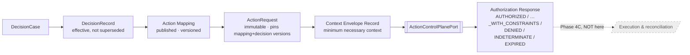
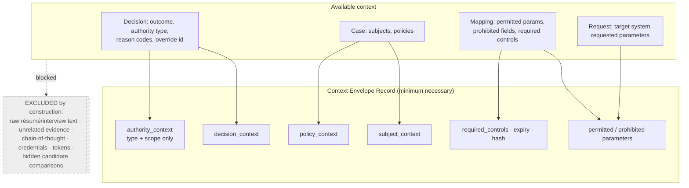
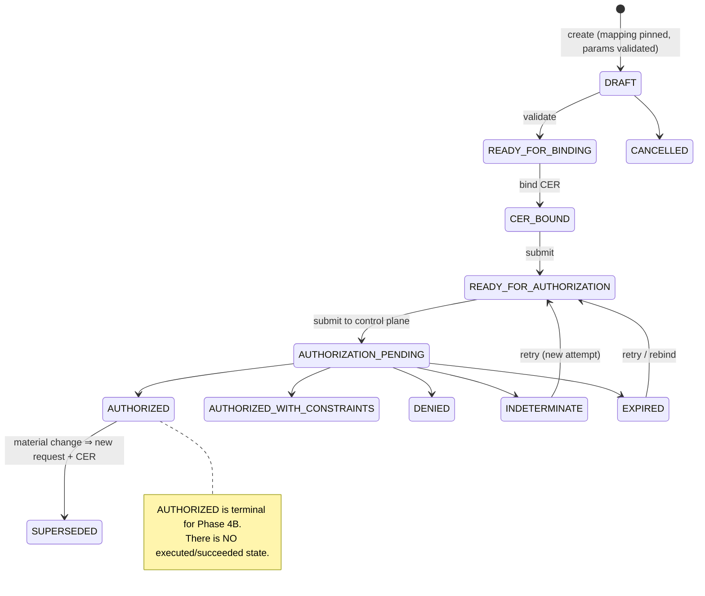
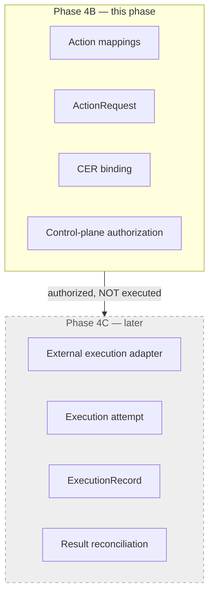

# Governed Action Request & CER Binding (Phase 4B)

Phase 4B converts an authorized ``DecisionRecord`` into a **governed action
request**, binds the runtime context the AI Control Plane needs as a **Context
Envelope Record (CER)**, and submits it through a provider-neutral control-plane
port for authorization.

> **Phase 4B prepares and authorizes a proposed action. It does not execute the
> action and does not claim that authorization produced an external-world
> result.**

## Decision Governance vs the AI Control Plane

Two distinct questions, two distinct layers:

* **Decision Governance (DGM)** establishes *why* an action is authorized by an
  enterprise decision — the recorded, human-or-delegated decision and its context.
* **The AI Control Plane** determines *whether* that proposed action may execute
  under current runtime controls — rate limits, jurisdiction, obligations,
  segregation of duties, live policy.

Phase 4B is the seam between them. It never answers the third question — *did the
action actually happen?* — that is Phase 4C.

## Decision → ActionRequest → CER → authorization

## Action mappings

An ``ActionMapping`` is a **versioned, immutable, pre-approved** rule binding a
``(decision_type, decision_outcome)`` to a ``permitted_action_type`` on a
``target_system_type``, with a declarative ``ParameterSchema`` and explicit
``prohibited_fields``. Rules:

* only **PUBLISHED** mappings may be used; drafts fail closed;
* a mapping binds an outcome to an action type — it never creates a decision;
* mappings carry no executable credentials (credential-like field names are
  rejected at construction);
* the exact version is **pinned at request creation** — "latest" is never
  re-resolved afterwards;
* an unsupported decision outcome (no matching published mapping) is **not
  action-producing** and fails closed.

Example hiring action types: ``CREATE_OFFER_DRAFT``, ``ADVANCE_WORKFLOW_STAGE``,
``SEND_FOR_BACKGROUND_CHECK``, ``CLOSE_CANDIDATE_WORKFLOW``,
``REQUEST_ADDITIONAL_REVIEW`` — all *proposed* external-system actions, never an
immediate execution command.

## ActionRequest

An immutable request referencing exactly one **effective** decision, pinning the
decision-case version and the mapping version. It carries explicit, schema-
conformant parameters and a declared target system, and **no execution result and
no inferred evidence**. It is immutable after submission; correction creates a
**superseding** request with a new CER. Idempotency: an active request for a given
``idempotency_key`` is returned as-is on identical re-creation, and a *different*
payload under the same key is rejected.

## CER construction and minimization

The CER is a **governance context record, not an execution command**. It holds
only typed, allowlisted governance fields — raw evidence and credentials cannot
even be represented, and credential-like parameter names are rejected defensively
at bind time. Its ``content_hash`` is deterministic: identical governance context
yields an identical hash; any material change yields a different one.

## Authorization lifecycle

* ``AUTHORIZED_WITH_CONSTRAINTS`` preserves the imposed constraints and
  obligations;
* ``DENIED`` never mutates the underlying decision;
* ``INDETERMINATE`` is never treated as approval;
* authorization expiry is explicit; a resubmission appends a **new attempt**;
* the domain depends on ``ActionControlPlanePort`` — never a concrete ActionGate
  SDK — and all tests run against an offline deterministic adapter;
* provider errors and malformed/mismatched responses are rejected, never coerced
  into an approval.

## Append-only history

Request snapshots form a version chain; CERs and authorization responses are
immutable and append-only, stored separately from the request chain. Authorization
attempts and outcomes are both recorded. Nothing is overwritten or deleted, so the
full history is deterministically reconstructable.

## Authorization & segregation of duties

Every operation is authenticated and authorized against a grant-based policy
(``CREATE_ACTION_REQUEST``, ``VIEW_ACTION_REQUEST``, ``BIND_CER``,
``VALIDATE_ACTION_REQUEST``, ``SUBMIT_FOR_AUTHORIZATION``,
``VIEW_AUTHORIZATION_RESPONSE``, ``CANCEL_ACTION_REQUEST``,
``SUPERSEDE_ACTION_REQUEST``, ``MANAGE_ACTION_MAPPING``). Repository access confers
no authority, and **having authored the decision grants no automatic action-request
privilege**. Denied operations are audited as ``ACTION_REQUEST_ACCESS_DENIED``.

## Security boundary

The CER carries the minimum necessary context and never raw sensitive data or
credentials. Audit events record hashes and references (parameter hash, CER hash,
mapping version, policy references, reason codes, constraints, obligations) — never
credentials, unrestricted parameters, raw sensitive evidence, or chain-of-thought.

## Phase 4B vs Phase 4C

Phase 4C will preserve the distinction among: *decision recorded → action
requested → action authorized → execution attempted → execution succeeded or
failed → outcome reconciled.*

## Explicit non-goals (out of scope for Phase 4B)

* Executing enterprise actions or calling downstream business systems.
* Creating an ``ExecutionRecord`` or reconciling downstream outcomes.
* Invoking a concrete ActionGate implementation from the domain layer.
* Treating decision creation as execution permission, or control-plane
  authorization as a successful execution.
* Reinterpreting evidence, generating assessments or recommendations, ranking
  candidates, or mutating the underlying decision.

## Known limitations

* In-memory repositories; a single offline deterministic control-plane adapter.
* Mapping selection is by explicit ``mapping_id`` (with version pinned at
  creation); a registry keyed purely on ``(decision_type, outcome)`` is left for a
  later iteration.
* CER ``required_controls`` are carried from the mapping's declared context fields
  but not yet evaluated against a live control catalog.
* Delegated-policy and jurisdiction fields are represented and preserved but not
  yet evaluated against an external policy engine.
