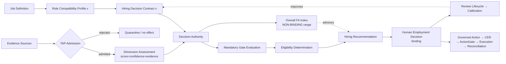
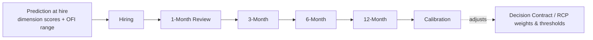
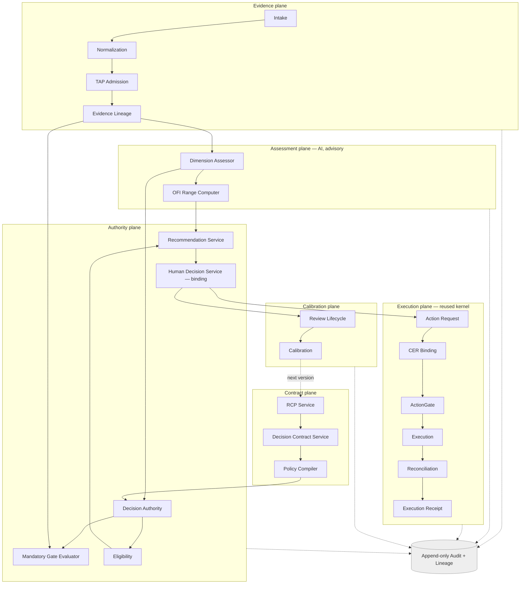
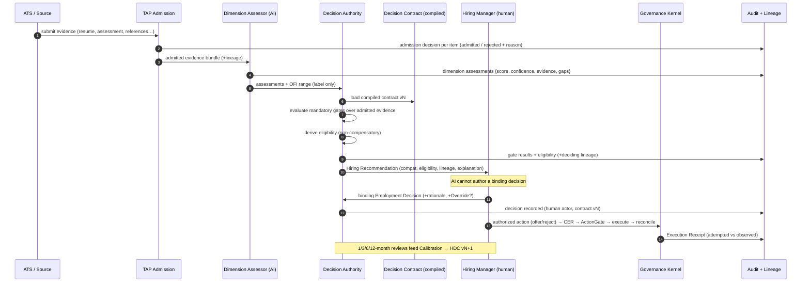
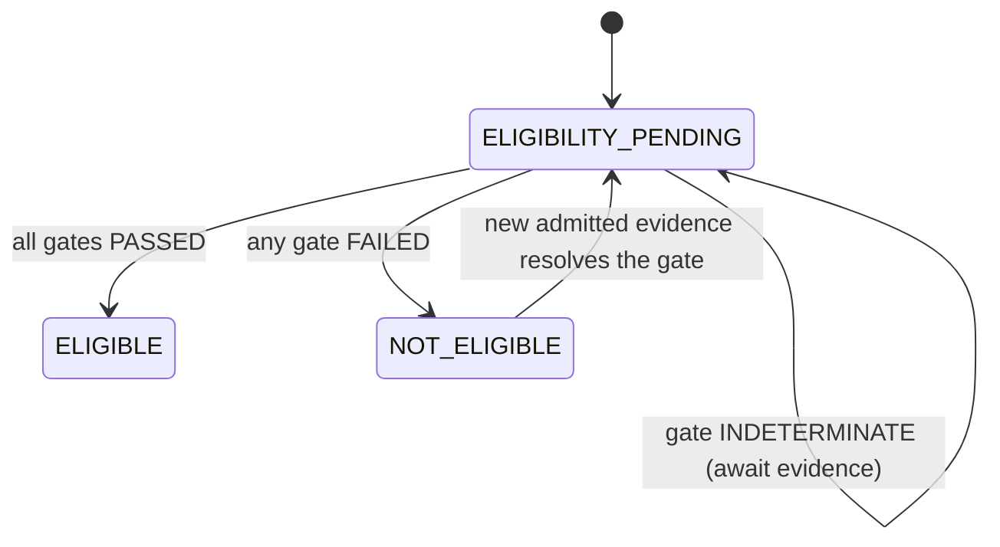
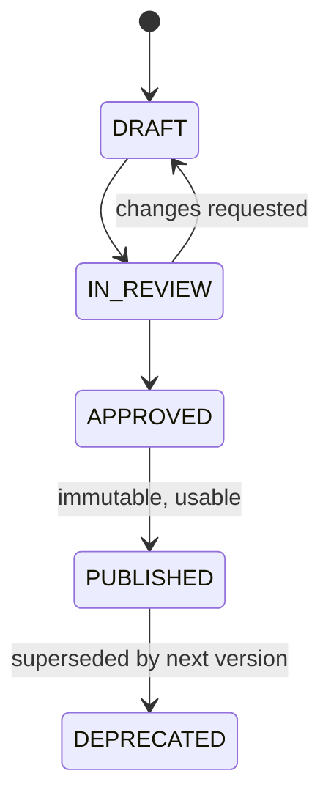

# Hiring Decision Authority — Enterprise Design Specification

**Status:** Design specification (implementation-ready)
**Supersedes:** the "AI Hiring" / universal candidate-scoring framing
**Governance alignment:** Ugence Decision Governance — Decision Authority,
ActionGate, Truth Assurance Pipeline (TAP), Runtime Assurance, Decision
Contracts, Evidence Lineage, Reconciliation, Execution Receipt, Policy
Compiler, RiskDecisionCase.

---

## 0. Reading guide

This document is the reconstruction specification for the hiring vertical. It
is **not** an incremental edit of the prior "AI Hiring" module; it re-founds the
module as an **Enterprise Hiring Decision Authority** and states the contracts,
components, flows, schemas, and controls needed to implement it.

Machine-readable contracts live beside this file in
[`schemas/`](schemas/) and are the normative source for field names, types,
and required-ness. Where prose and schema disagree, the schema wins.

| Section | What it establishes |
|---|---|
| 1 | Product reframe and the one architectural invariant |
| 2 | Concept model: Compatibility ≠ Eligibility ≠ Decision |
| 3 | Role Compatibility Profile (per-role, versioned) |
| 4 | Dimensions — including the two replacements (Operating Environment, Role Sustainability) |
| 5 | Evidence model + TAP admission |
| 6 | Non-compensatory Mandatory Gates (ActionGate parity) |
| 7 | Overall Fit Index — non-binding by construction |
| 8 | Hiring Decision Contract |
| 9 | Decision Authority and the Hiring Recommendation |
| 10 | Review lifecycle + closed-loop calibration |
| 11 | Component architecture |
| 12 | Runtime flow (sequence) |
| 13 | State machines |
| 14 | API design |
| 15 | Audit model, Evidence Lineage, Execution Receipt |
| 16 | Governance alignment map |
| 17 | Security model |
| 18 | Enterprise deployment |
| 19 | Migration from the current module |
| 20 | Glossary |

---

## 1. Product reframe

### 1.1 Rename

> **AI Hiring → Hiring Decision Authority** (product surface: *Hiring Decision
> Governance*).

The rename is not cosmetic. It changes the unit of value from *a score about a
person* to *a governed, auditable hiring recommendation produced under an
explicit decision contract*. AI **assists**; the Decision Authority **decides**
what the governed recommendation is; a human **holds** binding authority.

### 1.2 The one invariant

> **AI interprets admitted evidence into structured, explainable, confidence-
> qualified dimension assessments. The Decision Authority evaluates a versioned
> Hiring Decision Contract over that evidence to produce a governed
> recommendation. Only an authenticated human actor may record a binding
> employment decision.**

Everything below is a consequence of this invariant. Three collapses are
explicitly forbidden:

1. **Score → policy.** No path may read `overall_fit > T ⇒ hire`.
2. **Compatibility → eligibility.** High fit can never satisfy a mandatory gate.
3. **AI → authority.** No AI or service principal may author a binding decision
   or drive a binding workflow transition.

### 1.3 What is removed

The **Universal Candidate Scoring** model is removed:

```
        REMOVED (universal, role-agnostic, compensatory)
        Resume → [Technical, Behavior, Leadership, Industry,
                  Growth, Culture, Resilience] → Overall Score → Hire
```

It is replaced by the pipeline in §2.4. There is no fixed, role-agnostic set of
weighted layers feeding a single decisive score.

---

## 2. Concept model

### 2.1 Three distinct questions

The platform keeps three questions in three different objects, decided by three
different authorities:

| Question | Object | Decided by | Compensatory? |
|---|---|---|---|
| *How well does the evidence fit this role's operating reality?* | **Compatibility Assessment** | AI (advisory) | within a dimension only |
| *Are the non-negotiable requirements met?* | **Eligibility Determination** | Decision Authority over Mandatory Gates | **never** |
| *What should we do?* | **Hiring Recommendation** → **Employment Decision** | Decision Authority (recommend) / Human (bind) | n/a |

### 2.2 Compatibility ≠ Eligibility

Compatibility is a graded, evidence-backed, confidence-qualified statement of
*fit*. Eligibility is a boolean conjunction of **mandatory gates** that a
graded fit can never buy back. A candidate can be *highly compatible* and
*not eligible*; the recommendation must then be **NOT_ELIGIBLE**.

### 2.3 Evidence in the middle

The prior model went `Compatibility → Decision`. The reconstruction inserts the
governed spine:

```
Compatibility  →  Evidence (admitted, lineage-tracked)
               →  Decision Authority (evaluates the Decision Contract)
               →  Eligibility (mandatory gates)
               →  Recommendation (governed, explainable)
```

### 2.4 Canonical pipeline



---

## 3. Role Compatibility Profile (RCP)

### 3.1 Purpose

Every **Job Definition owns a versioned Role Compatibility Profile.** There is
**no universal weighting model.** The RCP is the role-specific parameterization
of what "fit" means and which evidence is required to claim it.

### 3.2 Contents

An RCP contains exactly:

- **`dimension_weights`** — weights over the role's *compatibility* dimensions
  (must sum to 1.0). Weights shape the **advisory** Overall Fit Index only; they
  never gate.
- **`mandatory_gates`** — the non-compensatory requirements (defined once,
  referenced by the Decision Contract). See §6.
- **`required_evidence`** — per dimension, the evidence types that must be
  *admitted* before a dimension may be scored at all.
- **`minimum_confidence`** — per dimension, the confidence floor below which the
  dimension is reported as **INSUFFICIENT_EVIDENCE** rather than scored.
- **`decision_contract_version`** — the Hiring Decision Contract version this
  profile binds to.

### 3.3 Role divergence is the norm

Two roles, deliberately different weightings (illustrative):

```
Software Architect                    Sales Executive
  Technical            0.35             Behavior             0.25
  Leadership           0.20             Domain               0.20
  Domain               0.15             Operating Env.       0.20
  Behavior             0.10             Leadership           0.15
  Learning             0.10             Learning             0.10
  Operating Env.       0.05             Technical            0.05
  Role Sustainability  0.05             Role Sustainability  0.05
```

The weights are **role property, not platform property.** They live in the RCP,
are versioned, are reviewed/approved before publication (§3.4), and are cited by
every recommendation that used them.

### 3.4 RCP lifecycle

RCPs move through the same author→review→approve→publish lifecycle as rubrics
and Decision Contracts. Only a **PUBLISHED** RCP may parameterize a live
assessment; published RCPs are immutable; a change is a new version. See §13.3.

**Schema:** [`schemas/role_compatibility_profile.schema.json`](schemas/role_compatibility_profile.schema.json)

---

## 4. Dimensions

Dimensions are **role-scoped compatibility axes**, not universal layers. The RCP
selects and weights them. Two dimensions from the legacy model are explicitly
replaced.

### 4.1 Replace *Culture Fit* → **Operating Environment Compatibility**

Culture Fit is **deleted.** It measured *personal similarity*, which is neither
job-related nor defensible. Its replacement measures **operating-model
compatibility**: can this person operate effectively in *this environment's
operating reality?*

| Environment | Operating reality evaluated (examples) |
|---|---|
| Startup | ambiguity tolerance, rapid change, experimentation |
| Bank | governance, documentation discipline, regulatory controls |
| Healthcare | patient safety, evidence orientation, compliance |

This is **operating model compatibility, not personal similarity.** Evidence is
behavioral and situational (worked-samples, structured-interview behavioral
probes, references keyed to operating conditions) — never affinity or
demographic proxy.

### 4.2 Replace *Resilience* → **Role Sustainability & Adaptation**

Resilience (a psychological inference) is **deleted.** Its replacement is
**Role Sustainability & Adaptation**, and it is **primarily measured *after*
hiring** against observed outcomes, not inferred pre-hire:

```
Hiring → 1-Month → 3-Month → 6-Month → 12-Month  (§10)
```

Evidence: onboarding progress, manager reviews, performance-goal attainment,
collaboration signals, delivery, retention. **No psychological inference.**
Pre-hire, this dimension is typically `INSUFFICIENT_EVIDENCE` and contributes a
small advisory weight at most; its real signal is the calibration loop.

### 4.3 Every dimension carries evidence and confidence

There are no bare scores. Each dimension assessment is the tuple:

```
{ dimension, score, confidence, evidence[], reason_codes[], gaps[] }
```

Example:

```
Technical    score 92  confidence 0.97  evidence[Assessment, Portfolio, Projects, Certifications]
Leadership   score 81  confidence 0.54  evidence[Structured Interview, Manager References]
```

The Decision Authority reasons over **(evidence, confidence)**, not over score
alone. A high score at low confidence is a *request for more evidence*, never a
license to decide. Confidence below the RCP floor ⇒ `INSUFFICIENT_EVIDENCE`.

**Schema:** [`schemas/dimension_assessment.schema.json`](schemas/dimension_assessment.schema.json)

---

## 5. Evidence model and TAP admission

### 5.1 Admission gate

Evidence enters scoring **only if admitted** by the Truth Assurance Pipeline.
Admission is per-item and produces an **admission decision** with reason. Only
admitted evidence may influence any dimension; **rejected evidence must have no
effect on any assessment, gate, index, or recommendation**, and its rejection is
itself recorded.

Evidence classes (admissible set is role-configurable):

```
Resume · Portfolio · Interview · Coding Assessment · Reference Check ·
Background Check · Certification · Employment History
```

### 5.2 TAP stages (reused, not reinvented)

The hiring vertical reuses the platform TAP stages rather than defining its own:

| TAP stage | Hiring meaning |
|---|---|
| E1 Intent | what claim the evidence is offered to support |
| E2 Trusted Retrieval | source authenticity / chain-of-custody |
| E3 Relationship Truth | does the evidence actually support the claimed dimension |
| E4 Governance Resolution | admissibility under the RCP's `required_evidence` + prohibited-field policy |
| E5 Evidence Assembly | assemble the admitted bundle with lineage |

### 5.3 Evidence Lineage

Every admitted item is a node in an append-only **Evidence Lineage DAG**:
`raw submission → normalization → admission → dimension citation`. Every
dimension score cites the exact lineage node IDs it consumed, so any score is
reconstructable to its sources (§15.2).

### 5.4 Prohibited fields

Protected-attribute and other prohibited fields are quarantined at admission and
can never reach a dimension, a gate, or the index. Quarantine is fail-closed and
audited.

**Schema:** [`schemas/evidence_record.schema.json`](schemas/evidence_record.schema.json)

---

## 6. Mandatory Gates — non-compensatory

### 6.1 Principle (ActionGate parity)

Mandatory gates mirror the platform **ActionGate**: a conjunction of hard
predicates that must **all** pass. **Failure of any one gate cannot be
compensated by high compatibility, high confidence, or a high Overall Fit
Index.** This is the eligibility firewall.

```
Overall Fit 96 · Security Clearance FAILED  ⇒  NOT_ELIGIBLE
```

### 6.2 Gate catalog (examples)

```
Required Skills · Required Certifications · Work Authorization ·
Security Clearance · Interview Completed · Assessment Completed ·
Required Experience
```

Each gate is a typed predicate over **admitted evidence** with an explicit
`unknown` outcome (fail-closed): a gate whose deciding evidence was never
admitted is `INDETERMINATE`, and an `INDETERMINATE` mandatory gate blocks
eligibility exactly as a `FAILED` gate does (it may be resolved by admitting the
missing evidence, never by fit).

### 6.3 Evaluation semantics

```
eligibility = ELIGIBLE          iff  ∀ g ∈ mandatory_gates: g.status == PASSED
            = NOT_ELIGIBLE      if   ∃ g: g.status == FAILED
            = ELIGIBILITY_PENDING if ∃ g: g.status == INDETERMINATE  (and none FAILED)
```

Gates are evaluated by the Decision Authority against the Decision Contract, are
independent of dimension weights, and each gate result carries the evidence
lineage that decided it.

**Schema:** [`schemas/mandatory_gate.schema.json`](schemas/mandatory_gate.schema.json)

---

## 7. Overall Fit Index — non-binding

### 7.1 Construction

The **Overall Fit Index (OFI)** is the RCP-weighted aggregation of *scored*
dimensions. It exists for triage and communication and is **NON-BINDING by
construction.** It is surfaced only as a **range**:

```
OFI 91 → HIGH        OFI 62 → MEDIUM        OFI 38 → LOW
```

### 7.2 Hard prohibitions

- No policy, gate, or recommendation rule may read the numeric OFI.
- The Decision Authority receives the **range label only**, never the number, on
  its decision path (the number is display metadata).
- `overall_fit > T ⇒ ADVANCE` is a **forbidden construction** and is blocked in
  the Policy Compiler (§16) — a Decision Contract that references OFI in a gate
  or eligibility rule fails compilation.

### 7.3 Confidence-aware ranges

The range is qualified by aggregate confidence: an OFI computed largely from
low-confidence dimensions is reported as e.g. `MEDIUM (low confidence)` so a
reviewer never reads a crisp band off soft evidence.

---

## 8. Hiring Decision Contract (HDC)

### 8.1 Role

The Decision Authority evaluates a **Decision Contract, not scores.** The HDC is
the versioned, compiled, auditable policy object for a role. It is the hiring
specialization of the platform's Decision Contract / RiskDecisionCase pattern.

### 8.2 Contents

```
Hiring Decision Contract
├── role_ref                 (job definition + RCP version it binds)
├── mandatory_gates[]        (references into the RCP gate catalog; §6)
├── dimension_weights        (references RCP; advisory OFI only; §7)
├── evidence_requirements[]  (per dimension required + admissibility; §5)
├── confidence_thresholds    (per dimension minimum_confidence; §4.3)
├── review_schedule          (1/3/6/12-month cadence; §10)
├── approval_chain           (who may approve the recommendation → binding decision)
└── version                  (immutable once PUBLISHED)
```

### 8.3 Compilation and enforcement

The HDC is compiled by the **Policy Compiler** into an executable evaluation
plan. Compilation **rejects** any contract that (a) references the numeric OFI in
a gate/eligibility rule, (b) makes a mandatory gate compensable, (c) omits
required evidence for a weighted dimension, or (d) permits an AI principal in the
approval chain. A recommendation always cites the exact HDC version it was
produced under.

**Schema:** [`schemas/hiring_decision_contract.schema.json`](schemas/hiring_decision_contract.schema.json)

---

## 9. Decision Authority and the Hiring Recommendation

### 9.1 Decision Authority

The Decision Authority is the policy-driven evaluator. Given `(admitted evidence,
dimension assessments, HDC version)` it produces the **Hiring Recommendation** —
deterministically, explainably, and without any black-box ranking. It never
mutates evidence or assessments; it *reads* them and *evaluates the contract.*

### 9.2 Recommendation payload

A Hiring Recommendation contains, and an audit consumer can reconstruct from it:

```
Hiring Recommendation
├── compatibility_assessment   (dimension tuples; §4.3)
├── eligibility                (ELIGIBLE / NOT_ELIGIBLE / ELIGIBILITY_PENDING)
├── mandatory_gates[]          (per-gate status + deciding lineage; §6)
├── evidence_lineage           (DAG node refs backing every claim; §15.2)
├── confidence                 (per-dimension + aggregate; §4.3)
├── decision_contract_version  (§8)
├── approval_chain             (required approvers; §8.2)
├── overall_fit_range          (label only; §7)
├── recommendation             (ADVANCE / HOLD / DECLINE / NOT_ELIGIBLE)
└── explanation                (structured reason tree, human-readable)
```

The `recommendation` value is **advisory**. `NOT_ELIGIBLE` is forced whenever
eligibility ≠ ELIGIBLE regardless of fit. `ADVANCE/HOLD/DECLINE` are only
proposed among eligible candidates.

### 9.3 Binding decision

A binding **Employment Decision** is recorded only by an **authenticated human**
in the HDC's approval chain. The decision references the recommendation and HDC
version, carries a job-related rationale, and — if it departs from the
recommendation — an explicit **Override** that *preserves* (never rewrites) the
recommendation. An AI/service principal attempting to author a decision is
rejected and audited as a security violation.

**Schema:** [`schemas/hiring_recommendation.schema.json`](schemas/hiring_recommendation.schema.json)

---

## 10. Review lifecycle and closed-loop calibration

### 10.1 Every decision becomes a prediction

A hiring decision is a **prediction** to be measured against observed outcomes:



### 10.2 Predicted vs observed

At each review, observed outcomes are recorded and compared to prediction:

```
Technical   predicted 92   observed 95    Δ +3   (well-calibrated)
Growth      predicted 86   observed 62    Δ -24  (over-predicted → recalibrate)
```

### 10.3 What calibration changes

Calibration improves **explicit, versioned artifacts** — RCP weights,
confidence thresholds, evidence requirements, gate definitions — via the
governed author→approve→publish path. It **never** tunes hidden neural weights,
and it never edits a past recommendation (history is immutable; calibration
produces the *next* contract version).

**Schema:** [`schemas/review_and_calibration.schema.json`](schemas/review_and_calibration.schema.json)

---

## 11. Component architecture



The **Execution plane** is the already-proven, domain-neutral governance kernel
(action request → CER → ActionGate → execution → reconciliation → receipt). The
hiring vertical **produces decisions into it**, it does not re-implement it.

---

## 12. Runtime flow



---

## 13. State machines

### 13.1 Candidate workflow

```mermaid
stateDiagram-v2
    [*] --> PLANNED
    PLANNED --> SOURCED
    SOURCED --> EVIDENCE_ADMITTED : TAP admission
    EVIDENCE_ADMITTED --> ASSESSED : AI dimension assessment
    ASSESSED --> AUTHORITY_EVALUATED : Decision Authority (gates+eligibility)
    AUTHORITY_EVALUATED --> RECOMMENDED : recommendation produced
    RECOMMENDED --> IN_REVIEW : routed to approval chain
    IN_REVIEW --> ADVANCED : human decision (eligible only)
    IN_REVIEW --> HOLD : human decision
    IN_REVIEW --> DECLINED : human decision
    AUTHORITY_EVALUATED --> NOT_ELIGIBLE : any mandatory gate FAILED
    HOLD --> IN_REVIEW
    ADVANCED --> OFFERED --> ONBOARDED
    ONBOARDED --> IN_LIFECYCLE_REVIEW : 1/3/6/12-month
    NOT_ELIGIBLE --> [*]
    DECLINED --> [*]
    IN_LIFECYCLE_REVIEW --> [*]
```

- AI drives **no** binding transition.
- `NOT_ELIGIBLE` is reachable directly from authority evaluation and is terminal
  for the requisition (re-entry requires new admitted evidence resolving the
  gate).
- Only a human decision drives `ADVANCED/HOLD/DECLINED`.

### 13.2 Eligibility sub-state



### 13.3 Contract / RCP publication lifecycle



Only `PUBLISHED` RCPs/HDCs may parameterize a live assessment or recommendation.

---

## 14. API design

Resource-oriented, versioned (`/v1`), every write audited, every read
authorization-scoped by tenant/requisition. Illustrative surface:

| Method & path | Purpose | Authority |
|---|---|---|
| `POST /v1/roles/{role}/compatibility-profiles` | create RCP draft | author |
| `POST /v1/compatibility-profiles/{id}:publish` | publish RCP version | approver |
| `POST /v1/roles/{role}/decision-contracts` | create HDC draft | author |
| `POST /v1/decision-contracts/{id}:compile` | Policy Compiler validation | system |
| `POST /v1/decision-contracts/{id}:publish` | publish HDC version | approver |
| `POST /v1/candidates/{id}/evidence` | submit evidence → TAP admission | service |
| `GET  /v1/candidates/{id}/assessment` | dimension assessments (advisory) | reviewer |
| `POST /v1/candidates/{id}/recommendation` | Decision Authority evaluation | system |
| `GET  /v1/candidates/{id}/recommendation` | recommendation (+lineage +explanation) | reviewer |
| `POST /v1/candidates/{id}/decision` | **binding** employment decision | **human** in approval chain |
| `POST /v1/candidates/{id}/reviews` | record 1/3/6/12-month observed outcome | manager |
| `GET  /v1/candidates/{id}/audit` | evidence lineage + audit trail | auditor |

**Enforcement rules baked into the API:**

- The `decision` endpoint rejects any non-human principal (401/403 + audited
  security event) and requires the actor to be in the HDC approval chain.
- The `recommendation` response carries the OFI **range label only**; the number
  is a separate display field never consumed by policy.
- Every mutating endpoint emits a correlation-/causation-linked audit event.

**Schema:** request/response envelopes in
[`schemas/api_contracts.schema.json`](schemas/api_contracts.schema.json)

---

## 15. Audit model, lineage, receipts

### 15.1 Append-only audit

Every stage (admission, assessment, gate evaluation, eligibility, recommendation,
decision, action, reconciliation, review, calibration) emits an immutable
`AuditEvent` with `correlation_id`, `causation_id`, `actor`, and a
`payload_hash`. Events are hash-chainable (`previous_event_hash`) for tamper
evidence.

### 15.2 Evidence Lineage

The Evidence Lineage DAG lets any claim be reconstructed: given a recommendation,
an auditor can walk each dimension score → cited lineage nodes → admission
decision → normalized artifact → raw submission. Rejected evidence appears in
lineage as rejected-with-reason and provably influenced nothing downstream.

### 15.3 Execution Receipt

When a binding decision drives an enterprise action (offer, reject letter, ATS
status change) through the kernel, the **Execution Receipt** records *attempted
vs observed* outcome. Authorization ≠ execution; a timeout is `OUTCOME_UNKNOWN`,
not success; compensation is a governed proposal, never an automatic rollback.

---

## 16. Governance alignment map

| Ugence artifact | Hiring Decision Authority usage |
|---|---|
| **Decision Authority** | evaluates the HDC to produce the governed recommendation |
| **ActionGate** | pattern for non-compensatory mandatory gates; and the runtime gate for the resulting action |
| **Decision Contract / RiskDecisionCase** | the Hiring Decision Contract is the hiring specialization |
| **TAP** | evidence admission (E1–E5) |
| **Evidence Lineage** | per-claim reconstructable DAG |
| **Runtime Assurance** | guards the AI assessor's outputs (schema-valid, in-range, confidence-qualified) before the Authority consumes them |
| **Policy Compiler** | compiles/validates the HDC; blocks the forbidden `OFI→policy` construction |
| **Reconciliation** | attempted-vs-observed for post-decision actions |
| **Execution Receipt** | immutable record of action outcome |

Same terminology, same artifacts, same authority boundaries as the rest of the
platform — the hiring vertical is a *producer of governed decisions into the
shared kernel*, not a parallel stack.

---

## 17. Security model

- **Authority separation.** AI principal type can hold `RECOMMEND` capability
  but never `DECIDE`; the type system and the API both enforce it.
- **Fail-closed evidence.** Unadmitted/ambiguous evidence never scores; missing
  gate evidence ⇒ `INDETERMINATE` ⇒ blocks eligibility.
- **Prohibited-field quarantine.** Protected attributes are stripped at
  admission and cannot reach any dimension, gate, or index.
- **Tenant isolation.** Evidence, assessments, and recommendations are scoped by
  tenant/requisition; search is authorization-aware and non-leaking.
- **Immutability.** Published contracts, recommendations, decisions, audit events
  are immutable; changes are new versions.
- **Tamper evidence.** Hash-chained audit; lineage reconstruction for every claim.
- **Least authority in the approval chain.** Only named human approvers can bind;
  the chain is part of the compiled, versioned contract.

---

## 18. Enterprise deployment

- **Isolation.** The module deploys as an isolated vertical over the shared
  governance kernel; no hard dependency on the platform's research code paths.
- **Persistence.** Ports are defined for evidence artifacts, lineage, contracts,
  recommendations, decisions, reviews; in-memory adapters for dev/test, durable
  adapters (RDBMS + object store for artifacts) for production.
- **Integrations.** ATS/HRIS attach as evidence *sources* (into TAP) and action
  *sinks* (out of the kernel via provider-neutral ports); no vendor SDK in the
  core.
- **Configuration.** RCPs and HDCs are data, authored per role/tenant; no code
  change to onboard a new role.
- **Observability.** Every plane emits audit + metrics; calibration dashboards
  compare predicted vs observed across cohorts.
- **Rollout.** Shadow mode first (assessments + recommendations produced, no
  binding path enabled), then human-in-the-loop binding, then calibration loop
  activation.

---

## 19. Migration from the current module

The existing module already implements the governed spine (advisory/binding
separation, evidence pipeline, decision cases, action requests, CER,
reconciliation, TAP hooks). Reconstruction is therefore a **re-founding of the
assessment and contract planes on top of the kept kernel**, not a rewrite of the
kernel.

| Current | Target |
|---|---|
| Fixed 10 `CapabilityLayer` universal layers | role-scoped RCP dimensions; no universal set |
| `LayerScore` (score+confidence+evidence) | `DimensionAssessment` — kept and generalized |
| `weighted_summary (non-binding)` | Overall Fit Index **range** (label-only on policy path) |
| implicit eligibility | explicit **Mandatory Gates** + `Eligibility` object |
| `DecisionCase` aggregate | retained; gains HDC-version + gate/eligibility records |
| `Recommendation`/`Decision` split | retained (this is already the invariant) |
| n/a | **Role Compatibility Profile**, **Hiring Decision Contract**, **Calibration** planes (new) |

**Sequencing:** (1) land RCP + HDC contracts and the Policy Compiler checks;
(2) generalize `LayerScore`→`DimensionAssessment` and remove the universal layer
enum in favor of RCP-selected dimensions; (3) add the Mandatory Gate evaluator +
Eligibility object; (4) make OFI range-only on the policy path; (5) add the
review/calibration plane; (6) deprecate the universal-scoring surfaces.

---

## 20. Glossary

- **Compatibility Assessment** — advisory, evidence-backed, per-dimension fit.
- **Eligibility** — boolean conjunction of mandatory gates; non-compensatory.
- **Role Compatibility Profile (RCP)** — versioned, per-role weights + required
  evidence + confidence floors + gate refs + HDC version.
- **Hiring Decision Contract (HDC)** — versioned, compiled policy the Decision
  Authority evaluates.
- **Mandatory Gate** — hard, non-compensatory requirement predicate.
- **Overall Fit Index (OFI)** — advisory, non-binding, surfaced as a range.
- **Decision Authority** — policy-driven evaluator that produces the governed
  recommendation.
- **Employment Decision** — the binding, human-authored outcome.
- **Evidence Lineage** — append-only DAG making every claim reconstructable.
- **Calibration** — governed adjustment of RCP/HDC from predicted-vs-observed.

---

*This specification reconstructs the hiring vertical as a Hiring Decision
Authority: AI produces structured, explainable, evidence-backed recommendations,
while a policy-driven Decision Authority makes the governed hiring recommendation
through explicit, auditable decision contracts, and only a human holds binding
authority. It is intended to be read alongside the machine-readable schemas in
[`schemas/`](schemas/).*
