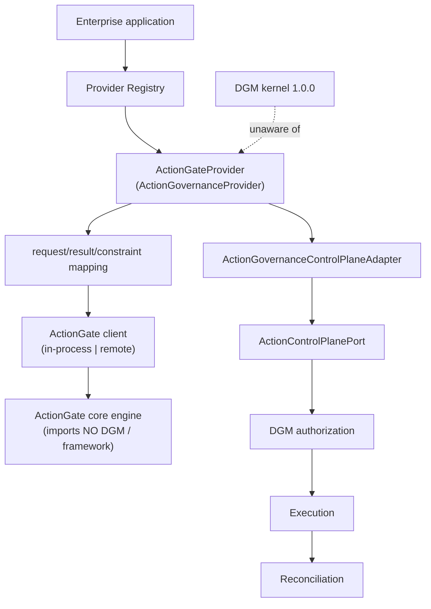
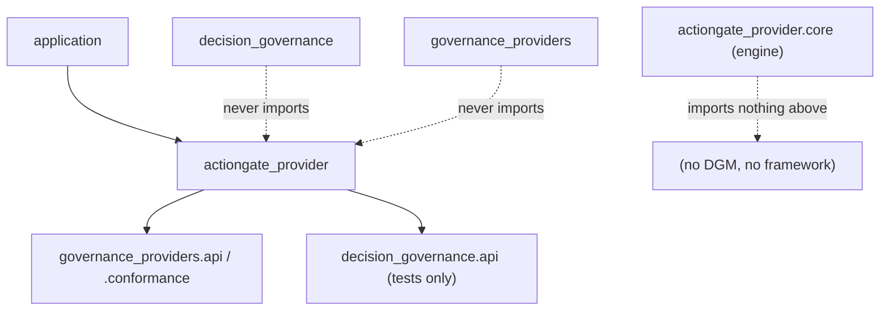

# ActionGate Provider (Phase 5G)

ActionGate is the **first real provider** on the DGM Provider Framework — an
**action-governance** provider (authorization only). It plugs into DGM through
the neutral `ActionGovernanceProvider` contract and the framework's
control-plane adapter, leaving the **frozen kernel completely unaware** of
ActionGate. It never performs execution, and TAP is entirely out of scope.

> Kernel remains **1.0.0** and byte-identical; the Provider Framework remains
> **0.1.0** unchanged. Baseline 657 tests preserved; **30** ActionGate tests added.

## Architecture



The ActionGate **core** is the vendor engine — pure, importing neither the kernel
nor the framework. The **provider** wraps it, implements the neutral contract,
and owns every translation. The framework **adapter** bridges to the frozen port.

## Dependency direction



Enforced by tests: the kernel and the framework never import ActionGate;
ActionGate consumes only public APIs; the ActionGate core (and client seam) import
neither DGM nor the framework; no cycles; no monorepo-editable dependence.

## Request mapping

`ActionGovernanceRequest` → native `ActionGateRequest`, deterministic and total:

| Neutral field | ActionGate field |
| --- | --- |
| `action_type` | `action_type` |
| `requested_parameters` | `parameters` |
| `actor` | `principal` |
| `authority_context` | `authority` |
| `target_resource` | `resource` |
| `policy_refs` | `policy_context` |
| `risk_context` | `risk_context` |
| `evidence_refs` | `evidence_refs` |
| `decision_refs` | `decision_refs` |
| `correlation_id` | `correlation_id` |
| `idempotency_key` | `idempotency_key` |

**Intentionally lossy:** the neutral contract carries no `tenant` (the kernel
adapter does not propagate it), so ActionGate's `tenant` is left empty;
`risk_context` / `evidence_refs` are preserved when present but the current kernel
adapter does not populate them.

## Result mapping

Native outcome → neutral outcome (**unknown never authorizes**):

| ActionGate | Neutral |
| --- | --- |
| `ALLOW` | `AUTHORIZED` |
| `ALLOW_WITH_CONSTRAINTS` | `AUTHORIZED_WITH_CONSTRAINTS` |
| `DENY` | `DENIED` |
| `UNKNOWN` (or any unmapped) | `INDETERMINATE` |

Preserved: constraints, obligations, expiry, authority basis, reason codes, trace
id, plus a deterministic result fingerprint.

## Constraint vocabulary

Typed ActionGate constraints are encoded as `type=value` strings so no supported
control is discarded; unknown types are preserved as `ext:type=value`.

Known constraint types: `maximum_amount`, `execution_deadline`, `required_approval`,
`allowed_region`, `parameter_restriction`, `rate_limit`, `single_use`.

## Obligation vocabulary

Known obligation types: `notification`, `logging`, `human_review` (encoded the same
way; unknown → `ext:`).

## Lifecycle & health

Provider lifecycle: `REGISTERED → INITIALIZING → AVAILABLE ↔ DEGRADED →
UNAVAILABLE → STOPPING → STOPPED` (deterministic, no background threads). Health
verifies provider **availability**, **configuration**, **protocol compatibility**,
and **policy availability**; when the engine is unreachable while the provider is
otherwise up, health reports `DEGRADED`.

## Registry configuration

```yaml
providers:
  action_governance:
    default: actiongate
    registered:
      - id: actiongate
        implementation: actiongate
        enabled: true
        contract_version: "1.0"
        settings:
          mode: in_process     # or: remote
```

Registration/config reject duplicate ids, incompatible contract/kernel versions,
unsupported modes, and contradictory defaults. Two client modes are supported:
`in_process` (engine local) and `remote` (client abstraction; no real network in
tests).

## Error translation

No ActionGate exception crosses the provider boundary:

| ActionGate failure | Provider error | Class |
| --- | --- | --- |
| config | `ProviderConfigurationError` | configuration |
| compatibility | `ProviderCompatibilityError` | compatibility |
| timeout | `ProviderTimeoutError` | retryable |
| malformed response | `ProviderResultValidationError` | terminal |
| unavailable | `ProviderUnavailableError` | retryable |
| unknown | `ProviderError` | terminal |

The control-plane adapter normalizes any provider error to a fail-safe
`INDETERMINATE` authorization — so a failing or unknown result **never
authorizes** and **never dispatches**.

## Audit & observability

`ActionGateInvocationRecord` captures the provider id, provider version, mapping
version, mode, compatibility, outcome, trace id, policy version, and error/failure
classification — **distinct from DGM kernel audit events**, and carrying **no
secrets or vendor payloads**.

## Conformance

- **Shared** framework kit (`run_action_provider_conformance`) — passes unchanged.
- **ActionGate-specific** (`run_actiongate_conformance`) — request/result/
  constraint/obligation/expiry/authority mapping, denied, constrained, timeout,
  unavailable, malformed, deterministic fingerprints, repeated-request idempotency.

## End-to-end

Three lifecycle fixtures on the unchanged kernel:

1. **Authorized** → `AUTHORIZED` → dispatch → **RECONCILED**.
2. **Authorized with constraints** → constraints + obligations preserved into the
   kernel authorization response; audit milestones preserved; **RECONCILED**.
3. **Denied / Indeterminate** (incl. a normalized provider failure) → **no
   dispatch, no execution, no reconciliation**.

## Packaging

Independent **private** distribution `dgm-actiongate-provider` (import package
`actiongate_provider`), depending on `decision-governance==1.0.0` and
`dgm-provider-framework==0.1.0`, owning **no** kernel or framework files (one
canonical source tree, packaged via symlink). An isolated 3-wheel install runs
both conformance suites with no consuming layer / TAP / monorepo path present.

> Packaging note (as for the framework): the build uses a symlink; symlink
> handling varies by OS, so CI should validate the built source archives on every
> supported OS.

## Limitations

- ActionGate governs **authorization only**; it never executes or dispatches.
- The core engine is deterministic and offline (policy-rule based); a production
  ActionGate would implement the same client seam over its real engine/service.
- `tenant` is not propagated by the current kernel adapter (documented lossy).
- Structured native constraints are flattened to strings on the neutral contract
  (kept complete via `type=value` / `ext:` encoding).

## Dependency direction (summary)

`decision_governance` and `governance_providers` never import
`actiongate_provider`; ActionGate imports only public APIs; the ActionGate **core**
imports neither DGM nor the framework. No circular imports.

## The acceptance question

*Can ActionGate authorize DGM action requests through the generic
`ActionGovernanceProvider` contract while preserving ActionGate's native
governance semantics, remaining completely independent of TAP, and requiring no
changes to the frozen DGM kernel or Provider Framework?* — **Yes**, proven by the
shared + specific conformance suites, the three end-to-end fixtures, the
dependency-boundary tests, and the isolated 3-wheel install.
