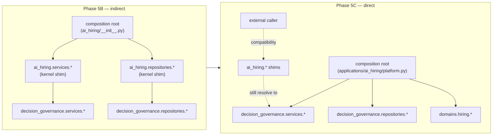
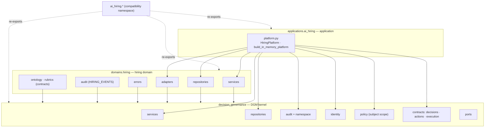
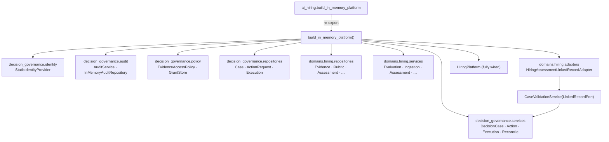
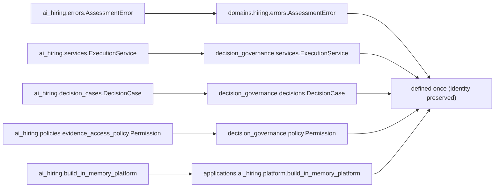
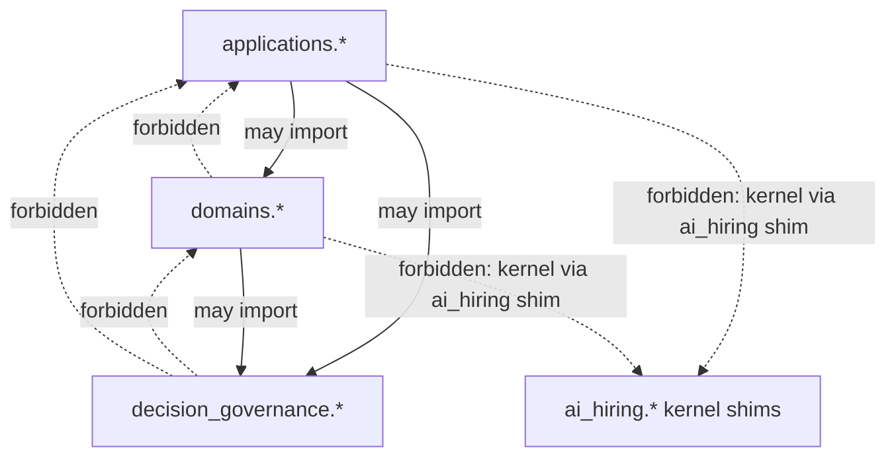

# AI Hiring — Direct Kernel Adoption & Compatibility-Surface Cleanup (Phase 5C)

**Phase 5C** makes the AI Hiring implementation consume the Decision Governance
kernel (`decision_governance`) **directly** throughout its active code and its
composition root, while keeping every historical `ai_hiring.*` path working as a
**compatibility namespace**. It also formalizes the canonical package layout
(`applications.ai_hiring`, `domains.hiring`), adds a domain-neutral
`subject_id` / `subject_ids` policy alias, partitions the audit-event namespace,
and gives the hiring error taxonomy a canonical home.

> Baseline: 534 tests. After 5C: **552** (534 unchanged + 18 direct-adoption
> guarantees). Hashes, serialization, lifecycle, typed-error identity, and audit
> event *values* are all preserved. No contract was redesigned, no status value
> or persisted event value renamed, and no public method signature changed.

## What changed vs. Phase 5B

| | Phase 5B | Phase 5C |
| --- | --- | --- |
| Kernel lives in | `decision_governance` | unchanged |
| Composition root | `ai_hiring/__init__.py`, importing kernel via `ai_hiring.*` shims | **`applications/ai_hiring/platform.py`, importing `decision_governance.*` directly** |
| `ai_hiring.*` | mixed (impl + shims) | **primarily a compatibility namespace** (re-exports the canonical root) |
| Hiring domain surface | `domains.hiring` (contracts only) | `domains.hiring` (+ `services`, `repositories`, `adapters`, `errors`, `audit`) |
| Policy subject field | `candidate_id` / `candidate_ids` only | canonical `subject_id` / `subject_ids` aliases (compat-first serialization) |
| Audit catalog | one flat enum | partitioned into `KERNEL` / `DOMAIN` / `LEGACY` (no value renamed) |

## 1. Legacy path vs. direct kernel adoption

Before, active hiring code reached kernel concepts *through* the `ai_hiring`
compatibility shims. Now it imports them straight from the kernel; the shims
remain only so external callers keep working.

## 2. Canonical package ownership

Three layers, one direction of dependency. Each concept has exactly one
canonical home; `ai_hiring.*` mirrors them for backward compatibility.

## 3. Composition root wiring

`applications/ai_hiring/platform.py` is the single canonical composition root.
Its **module-scope imports are only `decision_governance.*` and
`domains.hiring.*`** — governance services, repositories, audit, identity,
policy, and the control-plane / execution ports come from the kernel; hiring
services, repositories, and the linked-record adapter come from the domain.

## 4. Compatibility-namespace resolution

Every historical `ai_hiring.*` import still resolves — to the *identical* object
now owned by the kernel or the domain. The composition entry points re-export
the canonical root; the kernel-shim modules alias or re-export the kernel; the
domain vocabulary re-exports the hiring implementation.

Guarantee (tested): `ai_hiring.X is <canonical>.X` for the composition root,
every extracted service/repository, the hiring error families, and the policy
types — `isinstance`, `except`, and serialization behavior are unchanged.

## 5. Import & dependency constraints (enforced by tests)

The dependency direction is one-way and machine-checked
(`test_direct_kernel_adoption.py`):

Rules asserted:

1. **Kernel is a leaf.** `decision_governance.*` imports nothing from
   `ai_hiring`, `domains`, or `applications`.
2. **Domains never depend on applications.** `domains.*` imports nothing from
   `applications`.
3. **Canonical code adopts the kernel directly.** No module under
   `applications/` or `domains/` imports a governance concept through an
   `ai_hiring.*` kernel-compat shim (real hiring modules that physically live
   under `ai_hiring` are exempt — they are the hiring domain implementation).
4. **API facades adopt the kernel directly.** The `ai_hiring.api.*` facades
   import governance contracts and services from `decision_governance.*`.
5. **The composition root** imports only `decision_governance.*` and
   `domains.hiring.*` at module scope.

## Subject-scope naming (compatibility-first)

`AccessRequest` and `AccessGrant` keep their historical `candidate_id` /
`candidate_ids` fields as the **stored, serialized** representation, and add the
domain-neutral canonical aliases `subject_id` / `subject_ids`:

- either spelling may be supplied at construction;
- both are readable (the canonical name is a read accessor over the stored one);
- supplying both with **different** values raises `DomainValidationError`;
- **serialization is compatibility-first** — `dataclasses.asdict` still emits
  only `candidate_id` / `candidate_ids`; no new key appears on the wire.

This lets new code speak the neutral vocabulary without breaking any persisted
form, stored grant, or existing test.

## Audit namespace partitioning (no value renamed)

`decision_governance.audit.namespace` classifies every `AuditEventType` into a
disjoint, total partition **without changing any string value**:

- **`KERNEL`** — events the governance kernel emits (the
  DecisionCase → ActionRequest → Execution → Reconciliation chain plus the
  cross-cutting policy/security events);
- **`LEGACY`** — the pre-kernel foundation vocabulary (workflow / evaluation /
  recommendation / decision);
- **`DOMAIN`** — consuming-domain runtime events (evidence / capability /
  rubric / assessment).

The hiring domain names its slice in `domains.hiring.audit`
(`HIRING_EVENTS = DOMAIN ∪ LEGACY`), and a test proves the **neutral governance
lifecycle emits only `KERNEL` events** — the kernel never writes a hiring event.

## Error taxonomy

- **Kernel** (`decision_governance.errors`) owns `GovernanceError` /
  `DomainValidationError` and the neutral repository + governance-chain families.
- **Hiring** families are defined in the hiring layer and re-exported from the
  canonical `domains.hiring.errors`.
- **`ai_hiring.errors`** re-exports **both** families, and `HiringError` remains
  an alias of the kernel `GovernanceError`, so every `except HiringError` and
  `isinstance` check is unchanged. Identity is preserved across all three
  surfaces.

## Compatibility & unsupported areas

- **Every historical import path still works** and yields identical objects.
- **Serialization / hashing unchanged.** All contracts subclass the one
  `DomainModel`; the pinned Phase-5A reference hashes still pass. Policy dataclass
  serialization stays compatibility-first (`candidate_*`).
- **Pickle / fully-qualified module-path persistence remains unsupported** (as in
  Phase 5B): the canonical `__module__` of moved classes is `decision_governance.*`.
  Nothing in this codebase persists objects by dotted class path.
- **Not in scope (deliberately):** no contract redesign, no status/enum value
  changes, no persisted audit-event renames, no public signature changes, no
  procurement domain, no Phase-3C, no AI inference, no policy discovery.

## Verification

- `python -m pytest ai_hiring/tests -p no:cacheprovider -q` → **552 passed**
  (534 preserved + 18 new).
- Kernel purity (no forbidden domain term) and kernel standalone-import
  independence both hold.
- Wheel build includes `decision_governance*`, `domains*`, `applications*`, and
  `ai_hiring*`; a clean install outside the source tree imports all four and
  builds a platform.
