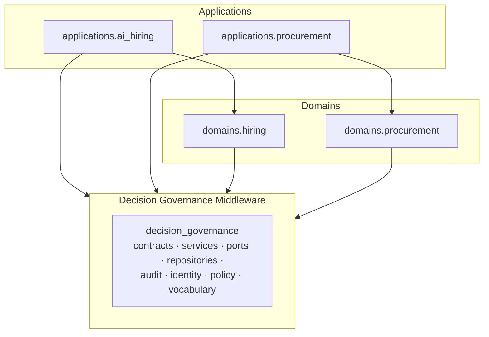
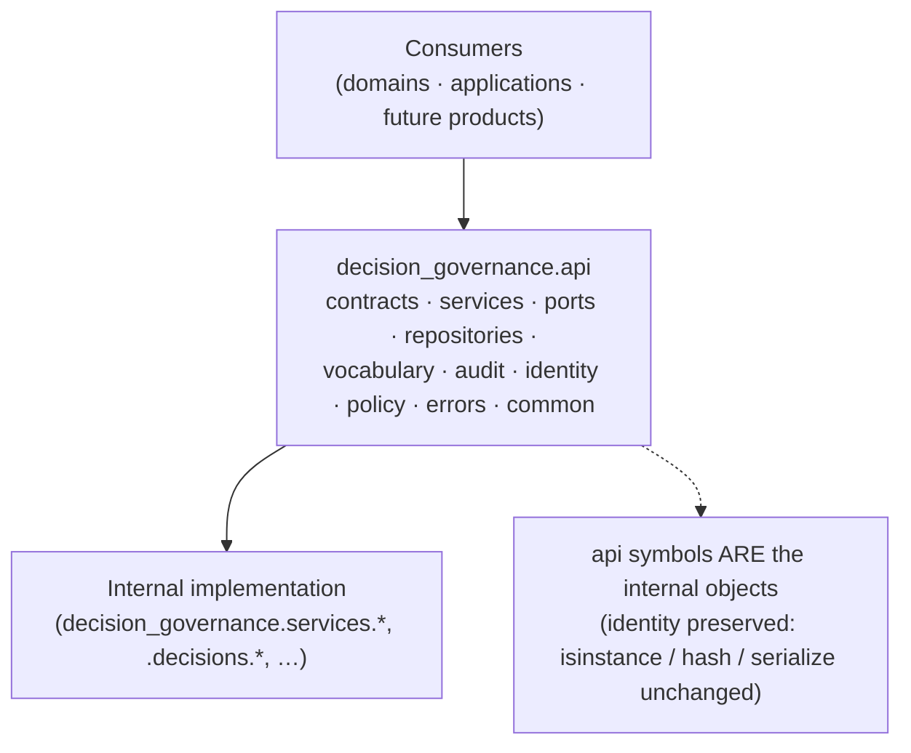
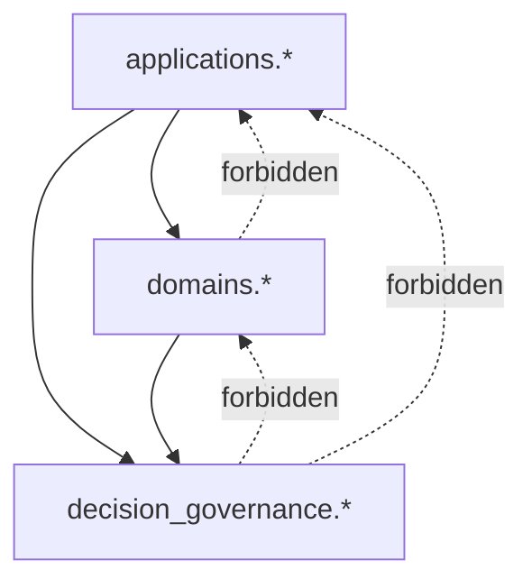
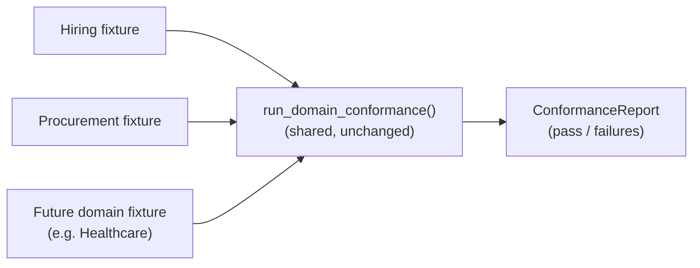
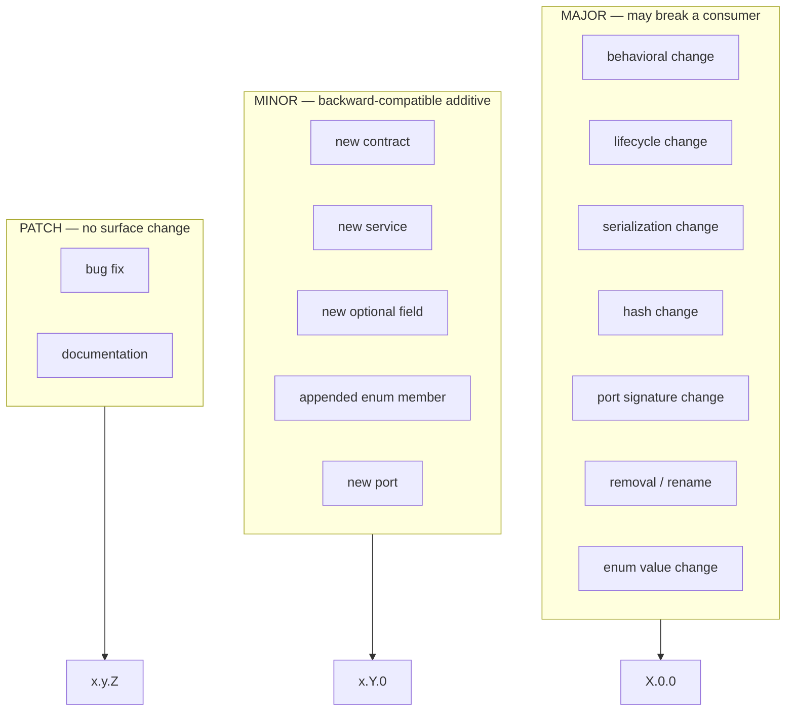

# Decision Governance Middleware — Platform Reference (Phase 5E)

**Phase 5E** turns `decision_governance/` from a successful shared package into a
**stabilized middleware product**: an explicit public API, a semantic-versioning
and compatibility policy, a frozen governance vocabulary, a reusable conformance
kit, and automated dependency/packaging enforcement. It adds **no governance
capability** and changes **no behavior** — it defines and validates the contract
that future products (ActionGate, TAP, and further domains) will build on.

> Baseline: 584 tests (Phase 5D). After 5E: **609** — the 584 preserved
> unchanged, plus 25 stabilization tests (public-surface, frozen vocabulary,
> conformance runs for both domains, dependency, packaging, compatibility). The
> only modified kernel file is `__init__.py` (it now sources `__version__` from
> `version.py`); every other kernel change is a new, additive module.

## Kernel version

`decision_governance` is at **1.0.0** — the stabilization freeze. The public API,
lifecycle, serialization shapes, content hashes, and audit vocabulary are now
contractual. See `decision_governance/version.py`.

## 1. Kernel architecture

Three layers, one direction of dependency. Applications compose domains and the
kernel; domains specialize the kernel; the kernel knows nothing of either.

## 2. Public API

Consumers import from `decision_governance.api.*` — the stable, versioned surface.
Internal implementation modules remain importable (compatibility) but are not
contractual.

The public surface is pinned (187 symbols across 10 modules) and guarded against
accidental additions/removals by `test_public_surface.py`.

### Surface classification

| Category | Meaning | Example |
| --- | --- | --- |
| **PUBLIC** | reachable via `decision_governance.api.*`; covered by versioning guarantees | `api.services.DecisionCaseService` |
| **INTERNAL** | implementation modules; may change in a MINOR release | `decision_governance.services.case_decision_service` |
| **COMPATIBILITY** | historical paths kept for stability, resolve to identical objects | `ai_hiring.services.ExecutionService` |
| **DEPRECATED** | scheduled for removal in a future MAJOR (currently none) | — |

## 3. Dependency rules

Enforced automatically (`test_platform_boundaries.py`, the conformance
`dependency_rules` dimension):

* the kernel imports nothing from `ai_hiring` / `domains` / `applications`;
* the kernel and its `api` import standalone (the third-party-consumer condition);
* no circular imports across kernel modules.

## 4. Conformance kit

`decision_governance.conformance` is a reusable, domain-agnostic battery. A domain
supplies a `DomainConformanceFixture` (how to build its platform and run one
lifecycle); `run_domain_conformance(fixture)` validates ten dimensions —
lifecycle, contracts, repositories, audit, authorization, execution,
reconciliation, serialization, hashes, dependency rules.

The same kit validates AI Hiring (31/31) and Procurement (31/31) without
modification, and is the acceptance gate any future domain runs.

## 5. Versioning model

Semantic versioning with an explicit change taxonomy (`decision_governance.version`):

**Frozen contracts** (guarded by pinned fingerprints in `test_frozen_vocabulary.py`
and `test_compatibility.py`):

* controlled enums — statuses, decision/proposed outcomes, authority types, audit
  namespaces, the full 110-name audit catalog, permissions, actor types, reason
  codes (one `canonical_hash` fingerprint);
* lifecycle transition tables for all three chains (one fingerprint);
* port Protocol signatures (one fingerprint);
* serialization shapes — the field-name set of every public contract (one
  fingerprint);
* content hashes — the pinned Phase-5A reference hashes (still enforced by the
  reference-domain suite).

Any change to a frozen contract breaks a pin, forcing an intentional, versioned
decision.

## Compatibility verification

- **AI Hiring** — all 552 baseline tests pass unchanged; identical lifecycle,
  hashes, audit events, serialization, and repository behavior. Passes the
  conformance kit 31/31.
- **Procurement** — all 32 baseline tests pass unchanged; identical behavior,
  authorization, and reconciliation. Migrated to consume `decision_governance.api.*`
  exclusively (proving the public surface is sufficient for a real consumer) with
  no behavior change. Passes the conformance kit 31/31.

## Packaging

The kernel is declared for independent distribution and imports as a third-party
package: a clean wheel install outside the source tree imports
`decision_governance`, `decision_governance.api`, and
`decision_governance.conformance` with **no** consuming layer on the path, and
both domains build against the installed package.

## Abstraction gaps / improvements identified

- **No behavioral gaps.** Two independent domains and the conformance kit run the
  frozen surface with zero kernel changes.
- **Corrective only:** `__version__` is now single-sourced from `version.py`
  (previously duplicated in `__init__.py`).
- **Observation:** the "emits only KERNEL events" property is domain-specific
  (true for Procurement, whose assessment is silent; not universal — a domain that
  audits its own upstream stages, like Hiring, also emits DOMAIN events). The
  conformance kit therefore asserts the *universal* invariant (governance
  milestones are KERNEL-classified; every event classifies cleanly) rather than
  the stricter per-domain one.

## Recommended Phase 5F — TAP & ActionGate Provider Interfaces (not implemented here)

With the kernel frozen at 1.0.0 and a conformance gate in place, Phase 5F should
define **provider interfaces** for the two external control points behind the
existing ports, without adding governance stages:

1. **ActionGate provider** — a concrete `ActionControlPlanePort` provider contract
   (capabilities, health, obligation/constraint vocabulary, error taxonomy) plus a
   provider conformance sub-kit, so any ActionGate implementation can be certified
   against the frozen port.
2. **TAP (Trusted Action Provider) provider** — a concrete `ExternalExecutionPort`
   provider contract (dispatch idempotency keys, callback/observation schema,
   retry/finality semantics) with its own conformance sub-kit.
3. **Provider registry & selection** in the application layer only (never the
   kernel), wiring named providers into a platform via configuration.
4. **Versioned provider compatibility** — extend the semantic-versioning policy to
   provider contracts, so ActionGate/TAP implementations declare the kernel port
   version they satisfy.

These are additive at the application/domain layer and consume the unchanged
frozen ports — the kernel stays at 1.0.0 unless a proven abstraction gap requires
a versioned, MINOR extension.
