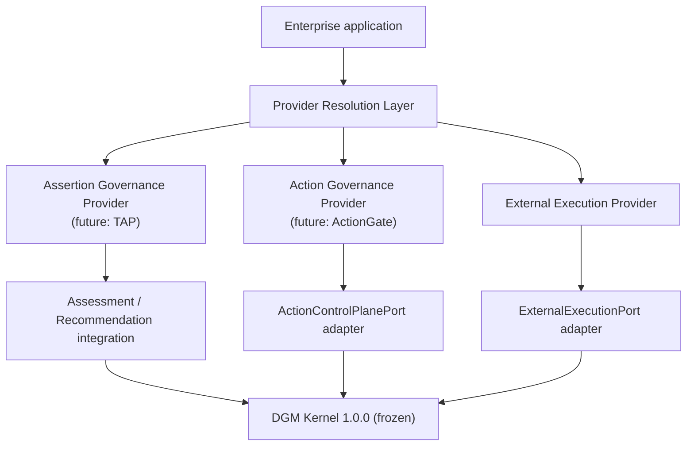
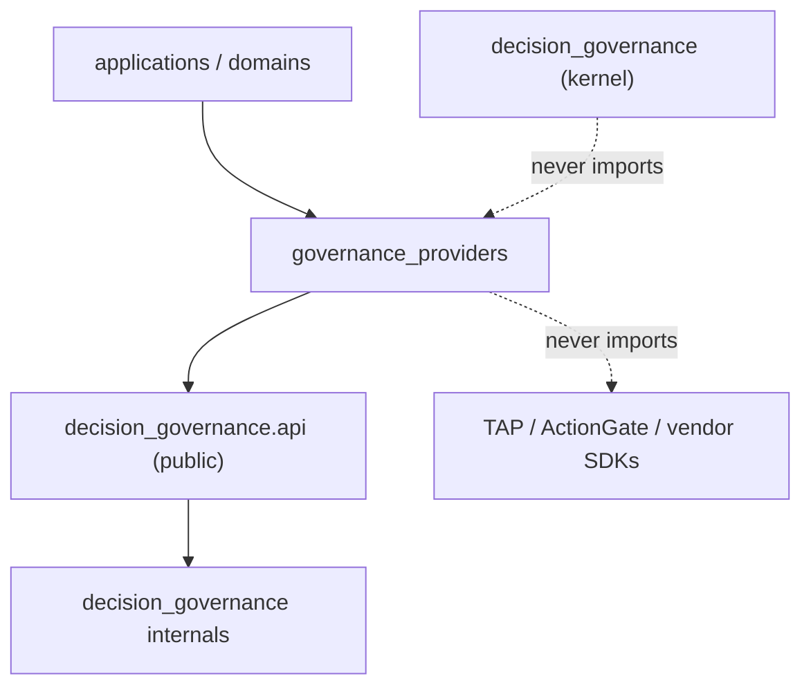
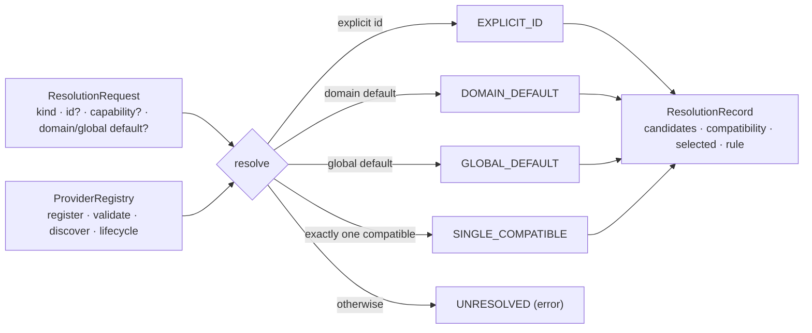
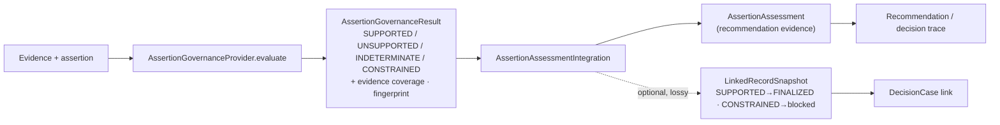
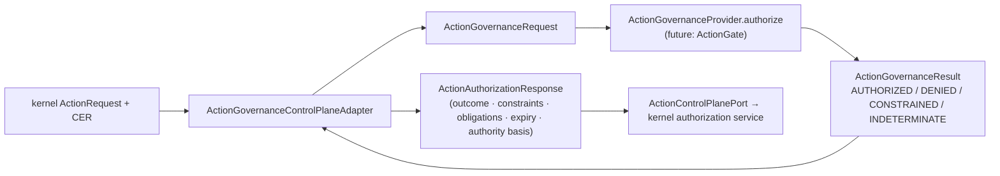
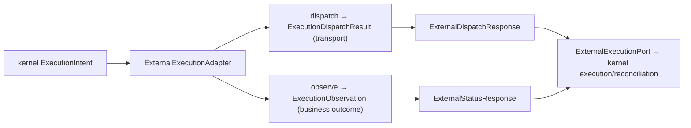
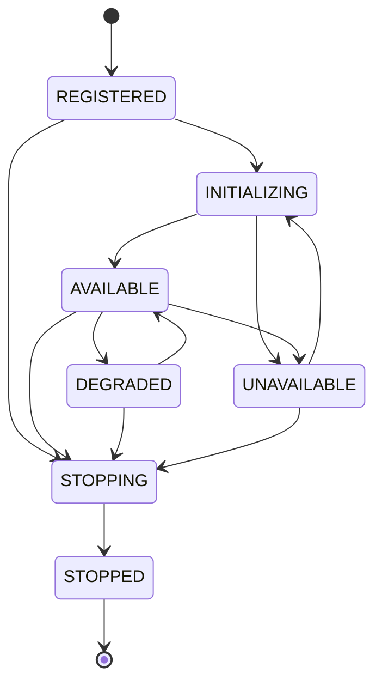
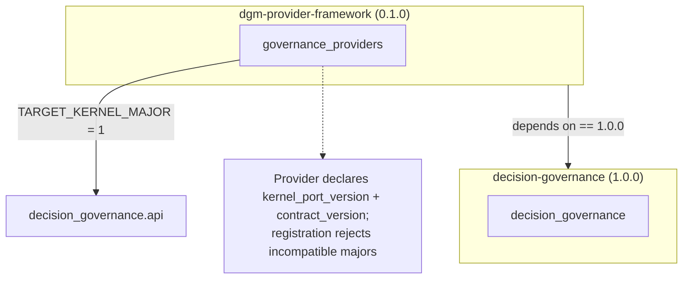

# DGM Governance Provider Framework (Phase 5F)

An **application-layer** framework that lets specialized governance capabilities
plug into DGM as **interchangeable peer providers**, with no dependency from the
kernel to any vendor implementation. This phase defines and validates the
provider architecture only — it implements deterministic **reference** providers,
**not** TAP or ActionGate.

The framework hosts **three distinct, non-interchangeable** provider families:

| Family (`ProviderKind`) | Evaluates / does | Kernel integration | Future implementation |
| --- | --- | --- | --- |
| `ASSERTION_GOVERNANCE` | whether an assertion is **supported by evidence** | assessment / recommendation workflow (optional `LinkedRecordPort` projection) | **TAP** |
| `ACTION_GOVERNANCE` | **authorize** a prepared action | `ActionControlPlanePort` adapter | **ActionGate** |
| `EXTERNAL_EXECUTION` | **dispatch to / observe** an external system | `ExternalExecutionPort` adapter | — |

> **Assertion governance is not external execution.** TAP evaluates evidence
> support; it is never routed through the execution port. ActionGate maps to the
> control-plane port. These are peers.

> Kernel remains frozen at **1.0.0** and byte-identical. Everything here is
> additive and lives above the kernel. Baseline 615 tests preserved; **42** new
> framework tests added.

## 1. Provider architecture

## 2. Dependency direction

Enforced by tests: the kernel never imports the framework; the framework consumes
**only** `decision_governance.api`; it never imports a consuming layer or a
product; the generic contracts contain no domain or product vocabulary; no
circular imports; no dependence on a monorepo editable install.

## 3. Registry & deterministic resolution

Providers are registered **explicitly** (or via configuration) — the registry
never scans arbitrary modules. Resolution is deterministic and auditable; it
never guesses among equally-eligible providers.

Registration rejects duplicate ids, incompatible contract/kernel versions,
unsupported kinds, invalid descriptors, and ambiguous defaults.

## 4. Assertion-provider integration (NOT execution)

Assertion governance evaluates evidence support and feeds the **assessment /
recommendation** workflow. It is not forced through a kernel port; an optional
`LinkedRecordPort` projection is offered where semantically sufficient.

**Optional projection — preserved vs. lost:** preserved = identity, finalized/
blocked status, subject, and (as metadata strings) evidence-coverage ratio and
trace id. Lost = the structured evidence breakdown (covered/unsupported elements,
omitted qualifiers, explanations) — those stay on the assessment for the
recommendation to cite; the kernel never sees them. `UNSUPPORTED`/`INDETERMINATE`
project to a non-finalized status so the kernel fails closed.

## 5. Action-provider → kernel adapter

Provider failures are **normalized** at the adapter boundary to a fail-safe
`INDETERMINATE` — a vendor exception never leaks into the kernel.

## 6. External-execution adapter

The transport-ack ≠ business-outcome invariant is preserved; a dispatch failure
maps to a transport failure, an observation failure to `UNKNOWN`.

## 7. Provider lifecycle

Provider lifecycle is deterministic and entirely separate from DGM business-record
lifecycles. No background threads are used.

## 8. Packaging & version compatibility

The framework ships as its own **private** distribution `dgm-provider-framework`
(import package `governance_providers`), depending on `decision-governance==1.0.0`
and owning no kernel files (one canonical source tree, packaged via symlink). An
isolated 2-wheel install verifies the registry imports, reference providers
register, the action adapter drives a neutral DGM lifecycle to reconciliation, an
assertion is evaluated, and no consuming layer / TAP / ActionGate / monorepo path
is present. Not published publicly.

> Packaging note: the build uses a symlink to the canonical package. Symlink
> handling varies by OS, so CI should validate the built **source archives** on
> every supported OS.

## Error taxonomy & observability

Errors are normalized at adapter boundaries (`ProviderError` hierarchy with a
`FailureClass`: retryable / terminal / indeterminate / configuration /
compatibility). Provider operations produce structured `ProviderInvocationRecord`
entries (provider, kind, operation, outcome, trace id, error/failure class,
fallback) — **distinct** from DGM kernel milestone audit events, and carrying no
vendor payloads or secrets.

## Configuration

Declarative, neutral `ProvidersConfiguration` (parseable from a mapping): provider
id, kind, enabled state, default assignment, contract version, provider-specific
settings, and **secret references** (never embedded secrets). Unknown kinds and
contradictory defaults are rejected. No secret-management system is implemented.

## Principles (explicit)

* **TAP and ActionGate are future peer provider implementations** — assertion and
  action governance respectively — that will register against this framework
  without either knowing about the other and without changing DGM 1.0.0.
* **Assertion governance is not external execution.**
* **Providers live above the kernel**; the kernel stays provider-neutral and never
  imports the framework.
* **Provider selection is configuration-driven** and deterministic.
* **Domain logic stays outside providers** unless explicitly domain-specific; the
  generic contracts carry no domain vocabulary.

## The central acceptance test

*Can a future TAP and a future ActionGate plug in as independent peer providers,
without either knowing about the other and without changing DGM 1.0.0?* — Yes:
each implements its family's contract, declares metadata/compatibility, registers
a descriptor, is selected by configuration, and is certified by its family's
conformance kit — with no kernel change and no framework change.

## What Phase 5F did not change

No kernel behavior, ports, contracts, serialization, hashes, or audit values; no
TAP; no ActionGate; no vendor network clients; no new domains; no DGM version
change; no public publication.
