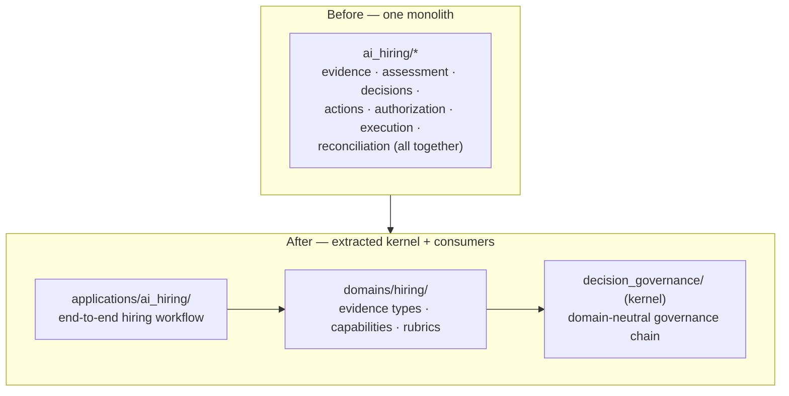
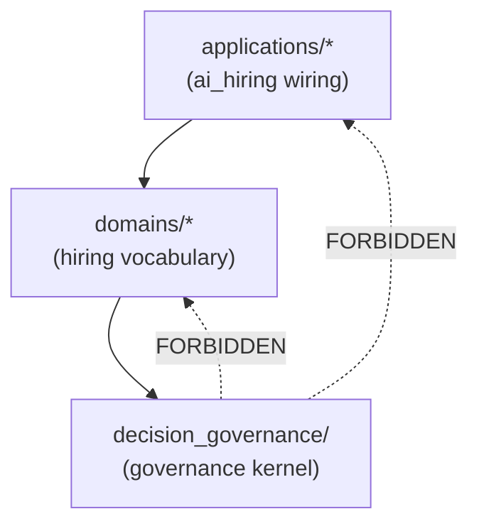
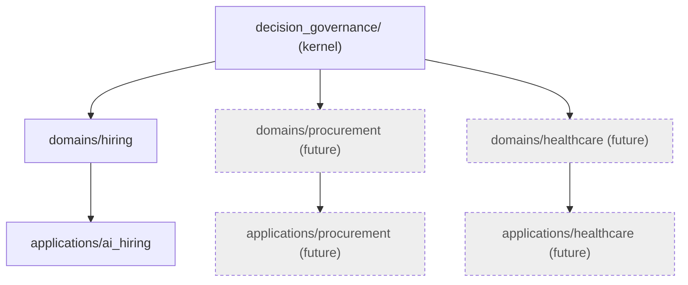

# Decision Governance Middleware (DGM) — Kernel Architecture

**Phase 5A — Kernel Extraction.** The reusable governance kernel was extracted
from the completed AI-Hiring reference implementation **without changing runtime
behavior**. AI Hiring is now a *consumer* of the kernel. This was an architectural
extraction only: no functional redesign, no behavioral regression, no governance
semantics changed.

> Baseline: 517 tests. After extraction: 528 tests (517 unchanged + 11 extraction
> guarantees). No existing assertion required modification.

## Why extract

The AI-Hiring vertical proved a full governance chain — decision cases →
recommendations → decisions → action requests → context envelopes → authorization
→ execution → reconciliation. That chain is **domain-neutral**: nothing in it is
intrinsically about hiring. Extracting it as a kernel lets the same governance
machinery serve other domains (procurement, healthcare, …) while each domain
supplies only its own vocabulary and adapters.



## Package boundaries

```
decision_governance/            # the kernel — domain-neutral
    base.py                     #   DomainModel (frozen, extra=forbid)
    common.py                   #   clock, id factory, canonical_hash
    errors.py                   #   GovernanceError, DomainValidationError
    vocabulary.py               #   ReasonCode, UncertaintyLevel/Rule
    decisions/                  #   DecisionCase, RecommendationRecord,
                                #   DecisionRecord, OverrideRecord, ReviewTask,
                                #   AuthorityContext, SubjectRef/VersionedRef
    actions/                    #   ActionRequest, ActionMapping, CER,
                                #   AuthorizationResponse, control-plane port
    execution/                  #   ExecutionIntent/Attempt/Record,
                                #   ReconciliationResult, CompensationRequirement,
                                #   external-execution port
    ports/                      #   provider-neutral Protocols (extension points)

domains/hiring/                 # hiring domain vocabulary over the kernel
applications/ai_hiring/         # composes hiring domain + kernel end to end
```

## Dependency graph

The only permitted direction is downward:



Enforced and tested: the kernel contains **no** hiring terminology (Candidate,
Resume, Interview, Hiring, Employee, Recruiter, Offer, ATS, Job, Applicant) and
imports **no** `ai_hiring`, `domains`, or `applications` package. A fresh
interpreter imports the kernel with none of those modules loaded.

## Extension model (ports)

The kernel depends only on abstract **ports**; domains/applications inject
adapters at composition time. Nothing hiring-specific is baked in:

| Port | Kernel Protocol | Hiring adapter (application) |
| --- | --- | --- |
| Control plane | `actions.control_plane.ActionControlPlanePort` | offline / real AI Control Plane |
| External execution | `execution.external_system.ExternalExecutionPort` | ATS / ERP / offline adapter |
| Evidence source | (domain) | hiring evidence ingestion |
| Policy / Authority | (domain) | hiring policies & authority provider |
| Action mapping | `actions.ActionMapping` (data) | hiring decision→action mappings |
| Persistence / Audit / Clock / Identity | injected | in-memory / production adapters |

Every contract in the system is classified as exactly one of:

* **Kernel** — DecisionCase, RecommendationRecord, DecisionRecord, ActionRequest,
  CER, AuthorizationResponse, ExecutionIntent, ExecutionAttempt, ExecutionRecord,
  ReconciliationResult, CompensationRequirement, ReasonCode, UncertaintyLevel.
* **Hiring domain** — EvidenceType (RESUME/INTERVIEW/…), Capability, Rubric,
  ScoringScale, EvidenceRule, candidate evidence ingestion, ATS-style actions.
* **Extension point** — evidence adapters, policy/authority providers, external
  execution adapters, action mappings, domain validators.

## Migration strategy (how behavior was preserved)

The extraction is an **identity-preserving move**: the neutral modules were
physically relocated into `decision_governance/`, and every historical
`ai_hiring.*` import path is a thin shim that re-exports the *same* kernel objects
(via `sys.modules` aliasing for whole packages). Because callers receive the
identical class objects:

* `canonical_hash` and every contract `.compute_hash()` produce byte-identical
  digests (pinned in tests);
* `model_dump()`/serialization is unchanged;
* `isinstance` and shared base class (`DomainModel`) are preserved — `HiringError`
  is now an alias of the kernel's `GovernanceError`, so every `class X(HiringError)`
  and `isinstance(e, HiringError)` behaves exactly as before;
* lifecycle transition tables are the same objects.

No service logic, validation, audit behavior, or public API changed.

## Domain responsibilities

A **domain** (e.g. `domains/hiring`) owns:

* its controlled vocabulary (evidence types, capability ontology, rubrics);
* domain validators and admissibility rules;
* the mapping data from decision outcomes to permitted action types.

## Application responsibilities

An **application** (e.g. `applications/ai_hiring`) owns:

* composing kernel services with domain adapters into an end-to-end workflow;
* wiring persistence, identity, audit, control-plane, and execution adapters;
* domain-specific orchestration and API composition.

## Future multi-domain strategy



A second domain (procurement) validates neutrality: it should reuse the kernel
unchanged, supplying only its vocabulary (purchase requisition, vendor, PO) and
adapters (ERP execution). Only after a second domain proves the kernel is truly
reusable should contract-bound AI interpretation be added as an *optional upstream
producer* of evidence/recommendations — never as decision authority.

## Known limitations (extraction scope)

Phase 5A extracted the **kernel contracts, foundation, and vocabulary** plus the
extension-point ports, and established the consumption direction. The neutral
governance **services** and **repositories** currently still live physically under
`ai_hiring/services` and `ai_hiring/repositories` (they already consume the kernel
contracts via the shims). Relocating those service/repository *implementations*
into `decision_governance/services` and `decision_governance/repositories` — behind
the same ports and with no behavior change — is the mechanical remainder, planned
for **Phase 5B**. One coupling to resolve there: `CaseValidationService` reads a
finalized *assessment* to validate linkage; that dependency should move behind a
`LinkedRecordPort` so the decision-case services become fully kernel-resident.

## Recommended Phase 5B

1. Relocate the neutral services/repositories into `decision_governance/`, behind a
   `LinkedRecordPort` for assessment linkage, keeping the `ai_hiring.services.*` /
   `ai_hiring.repositories.*` paths as shims (identity-preserving, as in 5A).
2. Move the neutral audit/identity/policy infrastructure into
   `decision_governance/{audit,identity,policy}` with kernel-neutral naming.
3. Stand up a second domain (`domains/procurement`) against the unchanged kernel to
   prove reuse, then converge the two applications on the shared kernel API.
