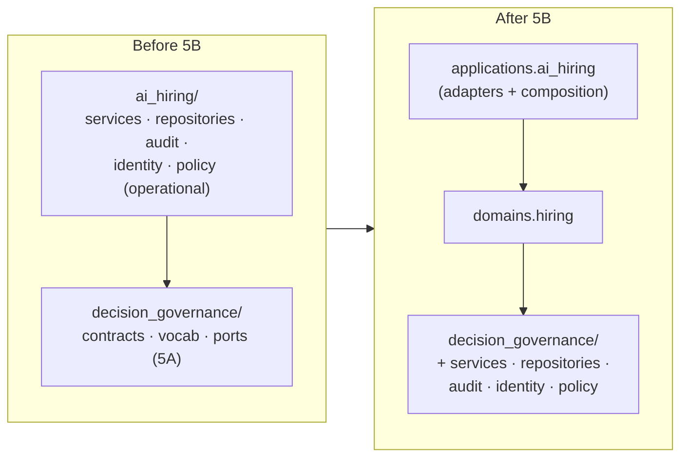
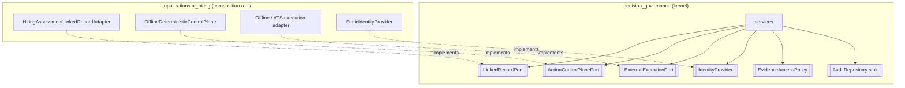
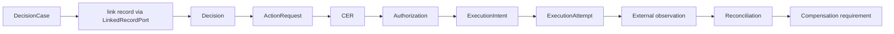
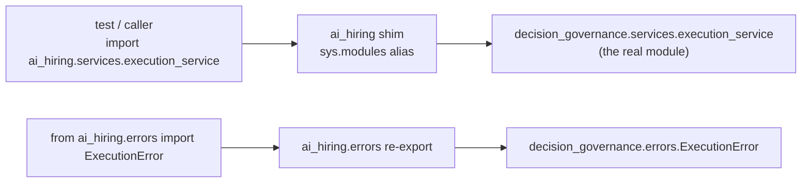
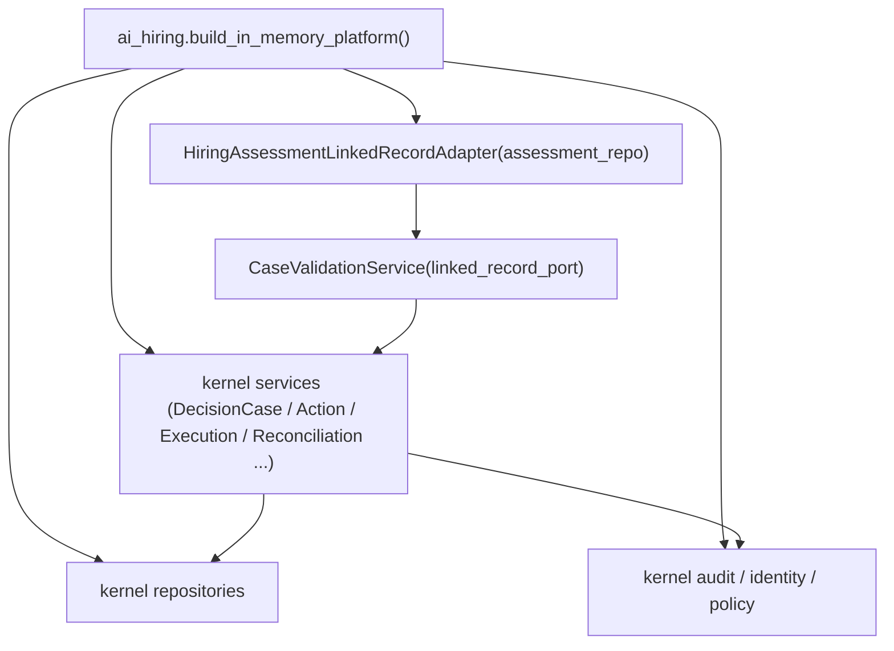

# Operational DGM Kernel Extraction (Phase 5B)

**Phase 5B** moved the domain-neutral *operational behavior* — services,
repositories, validation, lifecycle engines, audit, identity enforcement, and
generic policy/authority infrastructure — into `decision_governance/`, behind
domain-neutral ports. AI Hiring remained a consumer through adapters and
compatibility shims. **No observable behavior changed.**

> Baseline: 528 tests. After 5B: 534 (528 unchanged + 6 operational-extraction
> guarantees). Hashes, serialization, lifecycle, typed errors, audit events, and
> authorization semantics are all preserved.

## Phase 5A vs Phase 5B

| | Phase 5A | Phase 5B |
| --- | --- | --- |
| Extracted | contracts, foundation, vocabulary, ports | **services, repositories, audit, identity, policy** |
| Kernel could... | model the governance chain | **execute** the full governance lifecycle standalone |
| Coupling removed | hiring terms out of contracts | hiring assessment linkage → `LinkedRecordPort` |

## Before / after operational extraction

## Extracted operational components

- **Services** → `decision_governance/services/`: `DecisionCaseService`,
  `CaseRecommendationService`, `CaseDecisionService`, `CaseValidationService`,
  `ActionRequestService`, `CERBindingService`, `ActionAuthorizationService`,
  `ActionRequestValidationService`, `ExecutionService`,
  `ExecutionValidationService`, `ReconciliationService`, `CompensationService`,
  plus the shared authorization helpers.
- **Repositories** → `decision_governance/repositories/`:
  `DecisionCaseRepository`, `ActionRequestRepository`, `ExecutionRepository` and
  their in-memory adapters (append-only, tenant-aware, idempotency + external-id
  indexes, deterministic reconstruction — all preserved).
- **Audit** → `decision_governance/audit/`: the immutable `AuditEvent` contract,
  the full `AuditEventType` catalog (every name/payload preserved verbatim),
  `AuditRepository` port, `InMemoryAuditRepository` sink, and `AuditService`.
- **Identity** → `decision_governance/identity/`: `ActorType`, `ActorIdentity`,
  `IdentityProvider`, `StaticIdentityProvider`.
- **Policy** → `decision_governance/policy/`: `Permission`, `AccessRequest`,
  `AccessGrant`, `AccessDecision`, `GrantStore`, `EvidenceAccessPolicy`.
- **Errors** → `decision_governance/errors.py`: the neutral repository +
  Phase-4A/4B/4C typed-error families (68 classes).

## Port architecture and domain adapters

The kernel depends only on ports; the application injects hiring adapters.

## Linked-record abstraction

The one hiring coupling in the neutral services — `CaseValidationService` reading
a finalized *assessment* to validate linkage — was replaced by the neutral
`LinkedRecordPort`:

* the kernel sees only a `LinkedRecordSnapshot` (record type, id, version, tenant,
  a neutral finalized status, subject reference, blocked flag, opaque metadata);
* the hiring domain resolves its assessment records behind the port
  (`HiringAssessmentLinkedRecordAdapter`);
* the kernel never interprets assessment content; version/status requirements are
  unchanged; missing records fail closed. No evidence crosses the boundary.

## Full domain-neutral lifecycle

The kernel runs the entire chain with no hiring imports (proven by
`test_full_governance_lifecycle_runs_without_the_hiring_domain`):

## Compatibility-shim resolution

Legacy `ai_hiring.*` paths resolve to the identical kernel objects. Service shims
use `sys.modules` aliasing so even `module.__file__` inspection sees the kernel
source; repository/audit/identity/policy/error shims re-export the same classes.

Guarantee (tested): `ai_hiring.services.X is decision_governance.services.X` for
every extracted service, repository, audit/identity/policy class, and typed error.

## AI Hiring composition root

The application remains the composition root; the kernel never constructs hiring
adapters itself.

## Serialization and schema compatibility

- **Model serialization / hashing:** unchanged. All contracts still subclass the
  one `DomainModel`; `canonical_hash` and every `.compute_hash()` are byte-identical
  (pinned reference hashes from Phase 5A still pass).
- **Audit event payloads:** every `AuditEventType` name and payload shape is
  preserved verbatim (the enum moved wholesale, no member renamed/merged).
- **Repository snapshots / reconstruction / idempotency:** unchanged (same classes).
- **Fully-qualified type identifiers (`__module__`):** the *canonical* module path
  of the moved classes is now `decision_governance.*` rather than `ai_hiring.*`.
  This is **not** a supported serialized form in this codebase — no pickle or
  fully-qualified-path persistence is used — so it changes nothing observable. See
  *Unsupported compatibility areas* below.

## Unsupported compatibility areas

- **Pickle / fully-qualified module-path persistence is not supported.** Objects
  are never pickled or persisted by dotted class path; `cls.__module__` for the
  extracted classes now reads `decision_governance.*`. If an external consumer had
  pickled these classes by path (they had not — everything is in-memory), those
  pickles would not resolve. This limitation is documented rather than worked
  around.
- **JSON Schema / OpenAPI `$defs` names** are derived from class names (unchanged),
  not module paths; no component name changed.

## Remaining hiring-specific components (still in `ai_hiring`)

Evidence ingestion/normalization, the ontology (`EvidenceType`, capabilities),
rubrics, the Phase-3B assessment runtime, hiring-specific API orchestration, the
Phase-1 evaluation/workflow/recommendation/decision domain models, and the
`HiringAssessmentLinkedRecordAdapter`. These are the hiring **domain** and
**application**; they consume the kernel.

## Known limitations

- The access-policy scope field retains its historical name `candidate_id` /
  `candidate_ids` on `AccessRequest` / `AccessGrant` to preserve the frozen public
  API and the unchanged test suite. It is a generic "subject-scope" field; a
  rename to `subject_id` is deferred to Phase 5C when consumers can migrate.
- `AuditEventType` moved wholesale, so the kernel catalog includes event names
  coined during hiring phases (e.g. `EVIDENCE_*`, `ASSESSMENT_*`, `RUBRIC_*`).
  They are string-valued and domain-neutral in form (no forbidden hiring term) and
  were kept verbatim to preserve audit compatibility; partitioning the event
  namespace is deferred.
- Services/repositories physically live in the kernel, but the `ai_hiring`
  platform (`build_in_memory_platform`) is still the composition root that imports
  them via the shims; migrating the application to import the kernel directly
  throughout is Phase 5C.

## Recommended Phase 5C

Remove active reliance on the legacy `ai_hiring.*` compatibility imports: make AI
Hiring consume `decision_governance.*` directly throughout its implementation and
composition root, prove application-level conformance (including a `subject_id`
policy-field rename and audit-namespace partitioning), and only then introduce a
second domain (procurement) against the unchanged kernel.
