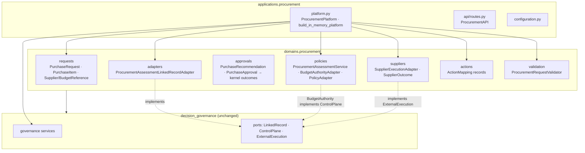
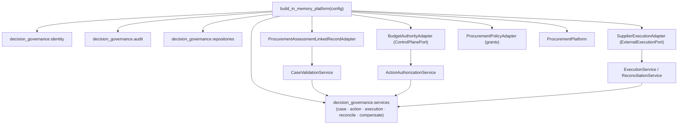
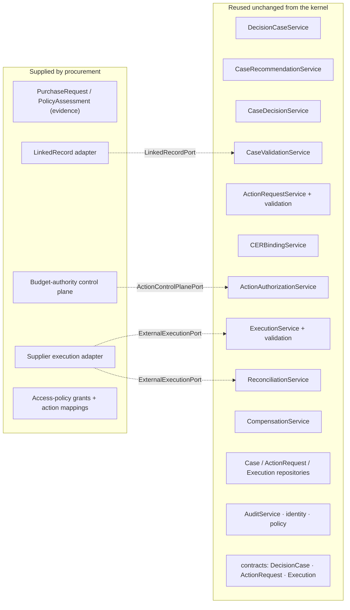
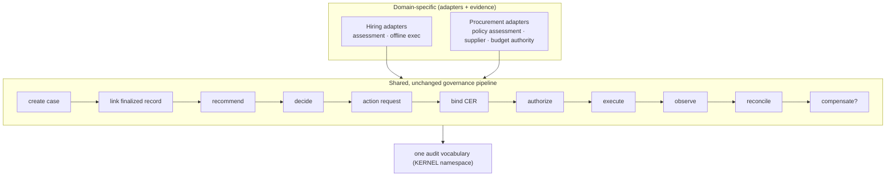

# Procurement Reference Domain on the Unchanged DGM Kernel (Phase 5D)

**Phase 5D** builds a small but complete **procurement approval** domain on the
Decision Governance Middleware (DGM) kernel — the first *non-hiring* reference
domain. Its purpose is not the procurement functionality itself; it is to prove
that the kernel was **not accidentally optimized for hiring**: a structurally
different enterprise workflow runs the same governance lifecycle through the same
unchanged kernel services.

> Baseline: 552 tests (Phase 5C). After 5D: **584** (552 hiring, unchanged + 32
> procurement). **Zero kernel changes were required** — the `decision_governance`
> tree is byte-for-byte identical to the Phase-5C baseline.

## Headline result

```
        AI Hiring                 Procurement
            │                          │
            ▼                          ▼
        ┌─────────────────────────────────┐
        │  Decision Governance Middleware  │   ← unchanged
        │  (identical kernel services)     │
        └─────────────────────────────────┘
```

Two materially different domains — evaluating people vs. approving purchases —
drive **the identical kernel service classes** (`DecisionCaseService`,
`ActionRequestService`, `ExecutionService`, `ReconciliationService`, …). They
differ only in the **adapters** they plug into the kernel ports.

## Architecture

The procurement domain and application mirror the hiring layering exactly:

- `domains/procurement/` — domain contracts + port adapters (no governance engine).
- `applications/procurement/` — composition root, API facade, configuration.

The kernel is consumed as a third-party library: procurement imports
`decision_governance.*` directly and never modifies it.



## Procurement lifecycle

The procurement workflow is a straight projection of the governance chain:

| Procurement stage | Kernel stage |
| --- | --- |
| Purchase Request | domain evidence (never seen by the kernel) |
| Policy Assessment | finalized linked record (via `LinkedRecordPort`) |
| Approval Recommendation | `RecommendationRecord` (`DETERMINISTIC_POLICY`) |
| Approval Decision | `DecisionRecord` (`HUMAN_APPROVER`) |
| Purchase Action Request | `ActionRequest` (from an `ActionMapping`) |
| Authorization | `CER` + `ActionAuthorizationService` + budget control plane |
| Supplier Dispatch | `ExecutionService` + supplier `ExternalExecutionPort` |
| Supplier Outcome | observed `ExecutionRecord` |
| Reconciliation | `ReconciliationService` |
| Compensation | `CompensationRequirement` (when required) |


## Composition root

`applications/procurement/platform.py` wires the **unchanged kernel services**
with the **procurement adapters**. Governance services, repositories, audit, and
identity come from `decision_governance.*`; the three port seams are filled by
procurement adapters.



## Kernel reuse

Every governance capability is reused as-is. Procurement contributes only
domain data and three port adapters.



## Domain adapters (kernel ports reused)

| Procurement adapter | Kernel port | Role |
| --- | --- | --- |
| `ProcurementAssessmentLinkedRecordAdapter` | `LinkedRecordPort` | projects a finalized policy assessment onto a neutral `LinkedRecordSnapshot` |
| `BudgetAuthorityAdapter` | `ActionControlPlanePort` | enforces spending limits / approval thresholds / supplier & budget restrictions |
| `SupplierExecutionAdapter` | `ExternalExecutionPort` | deterministic offline supplier dispatch + observed outcome |
| `ProcurementPolicyAdapter` | (composes `EvidenceAccessPolicy`/`GrantStore`) | configures the kernel access policy with procurement grants |

No port was extended. Each adapter satisfies the existing `runtime_checkable`
Protocol (asserted by `isinstance` in the tests).

## Comparison with hiring

| | AI Hiring | Procurement |
| --- | --- | --- |
| Evidence | résumés, artifacts, normalized evidence | purchase requests, line items, budget refs |
| Assessment | Phase-3B deterministic assessment runtime | deterministic policy checks |
| Recommendation generator | human / AI-assisted / deterministic | deterministic policy |
| Decision authority | hiring manager (human) | approver (human) |
| Action mappings | advance stage, etc. | create PO, cancel, route-to-senior, request-info |
| Control plane | offline deterministic | budget authority (spending limits) |
| External system | offline / ATS-style | supplier |
| **Governance engine** | **kernel** | **the same kernel** |
| **Kernel service classes** | `decision_governance.services.*` | **identical objects** |

The cross-domain conformance suite asserts
`type(hiring.decision_case_service) is type(procurement.decision_case_service)`
(and the same for every governance service), and that both emit only
`KERNEL`-namespace audit events.

## Shared governance pipeline



## Kernel reuse analysis

**Abstractions that generalized cleanly (no change):**

- **`LinkedRecordPort`** — the neutral finalized/blocked projection fit a
  procurement policy assessment with no strain; the kernel never interprets
  purchase content, exactly as it never interprets assessment content.
- **`ActionControlPlanePort`** — spending limits, an approval threshold requiring
  conditions, and supplier/budget restrictions all expressed as an ordinary
  `authorize(request, cer) → response`. The `AUTHORIZED_WITH_CONSTRAINTS` outcome
  models "approved, senior sign-off required" naturally.
- **`ExternalExecutionPort`** — the `dispatch` / `query_status` split with
  "transport ack ≠ business outcome" mapped directly onto a supplier: accepted →
  `SUCCEEDED`, rejected → `REJECTED` (→ compensation), timeout → transport
  `TIMED_OUT`, unknown → `UNKNOWN` (→ `INDETERMINATE`).
- **`DecisionOutcome` / `ProposedOutcome`** — the neutral ADVANCE/HOLD/REJECT/DEFER
  vocabulary absorbed approve/escalate/reject/needs-review with a small mapping
  table; no new outcomes were needed.
- **Authority & segregation-of-duties** — `AuthorityType.HUMAN_APPROVER`, the
  "AI cannot decide" rule, and the optional SoD flag applied unchanged to
  purchase approvals.
- **Audit namespace** — every procurement run emits only `KERNEL`-namespace
  events; the Phase-5C partition already holds for a second domain.

**Abstraction failures:** none. No case required extending or modifying a kernel
port, contract, service, or enum.

**Justification for kernel changes:** not applicable — **no kernel change was
made**. The only non-procurement edit in this phase is an app-layer fix
(`ai_hiring/__init__.py`): the Phase-5C composition root re-exported the platform
eagerly, which formed an import cycle *only* when `applications.ai_hiring` was
imported before `ai_hiring` (a path first exercised by the cross-domain test).
The re-export is now lazy (PEP 562); identity and all 552 hiring tests are
unchanged. This touched no kernel code.

## Known limitations

- Procurement is intentionally minimal: no inventory, ERP, invoices, accounting,
  vendor onboarding, or AI — as scoped.
- The supplier and control-plane adapters are deterministic and offline (for
  tests); real integrations would implement the same ports.
- Budget "amount" flows through the action request's string `requested_parameters`
  (the kernel's neutral parameter map); a domain that needed typed monetary
  parameters would model them in its own contracts, as done here.
- Procurement has its own assessment record and repository (mirroring hiring);
  there is deliberately no shared "assessment" concept in the kernel — the seam
  is the neutral `LinkedRecordPort`.

## Recommended Phase 5E

With two conformant domains on one unchanged kernel, the kernel's neutrality is
demonstrated. Phase 5E options:

1. **Kernel API hardening & versioning** — freeze the port/contract surface as a
   published, semver'd interface now that two domains depend on it, with a
   conformance test-kit any new domain can run.
2. **A third, more divergent domain** (e.g. access-request / entitlement
   approvals) to stress the ports further — especially multi-step or
   partially-succeeding executions and richer compensation chains.
3. **Cross-domain policy/authority composition** — shared approver directories or
   delegated-policy authorities exercised by both domains, to probe the identity
   and policy seams under real multi-tenant configurations.

## Verification

- `python -m pytest ai_hiring/tests domains/procurement/tests -p no:cacheprovider -q`
  → **584 passed** (552 hiring unchanged + 32 procurement).
- `git diff decision_governance/` → empty (kernel unchanged).
- Kernel still imports standalone with no `ai_hiring` / `domains` / `applications`
  dependency.
- Wheel build includes `domains.procurement*` and `applications.procurement*`
  alongside the existing packages.
