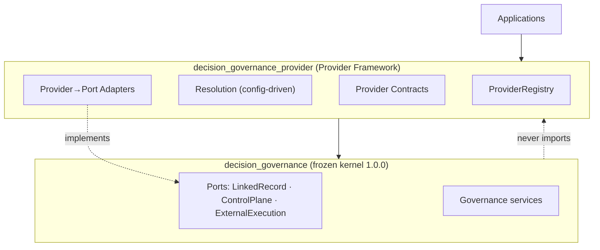
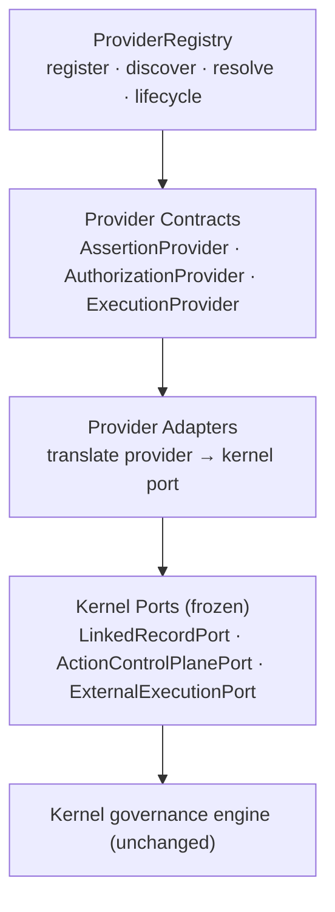
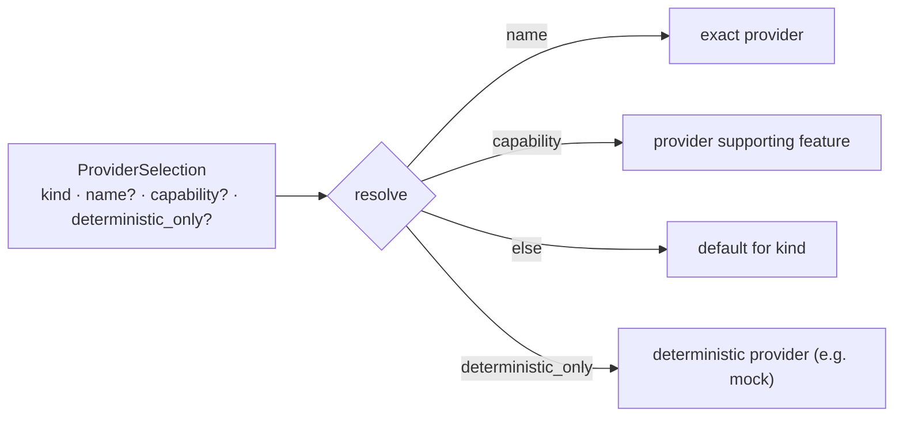
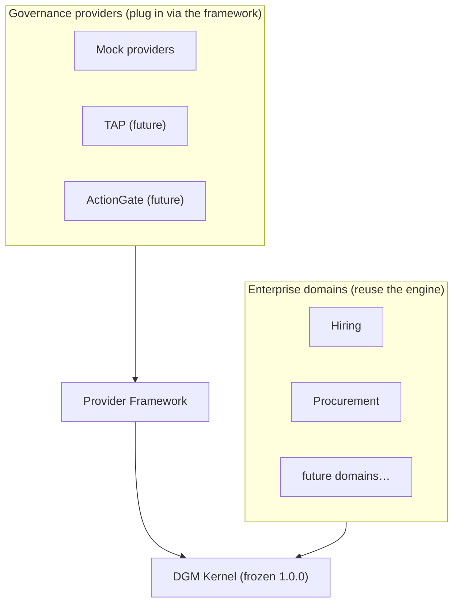

# DGM Provider Framework (Phase 5F)

The Provider Framework is an **application-layer** extension that lets DGM consume
external governance capabilities — *assertion*, *authorization*, and *execution*
providers — **without depending on any specific implementation**. It is the
architecture into which TAP, ActionGate, and future providers will later plug as
first-class, interchangeable components.

> This phase implements the framework and deterministic **mock** providers only.
> It does **not** implement TAP or ActionGate. The kernel remains frozen at
> **1.0.0** and is byte-unchanged; everything here is additive and lives above
> the kernel.

> Baseline: 615 tests. After 5F: **644** (615 preserved unchanged + 29
> provider-framework tests). No kernel file was modified.

## Where it sits



Dependency direction: `applications` → `decision_governance_provider` →
`decision_governance` (via its public `decision_governance.api` only). The kernel
never imports the framework — enforced by `test_dependency_boundaries.py`.

## The stack: registry → contracts → adapters → kernel ports



Each provider kind maps to exactly one kernel port:

| Provider kind | Provider contract | Adapter | Kernel port |
| --- | --- | --- | --- |
| `ASSERTION` | `AssertionProvider.resolve_assertion` | `AssertionProviderLinkedRecordAdapter` | `LinkedRecordPort` |
| `AUTHORIZATION` | `AuthorizationProvider.authorize` | `AuthorizationProviderControlPlaneAdapter` | `ActionControlPlanePort` |
| `EXECUTION` | `ExecutionProvider.dispatch`/`observe` | `ExecutionProviderExternalSystemAdapter` | `ExternalExecutionPort` |

Provider contracts are **kernel-free** (they speak neutral provider-layer types);
the adapter owns all translation to kernel contract shapes. The kernel stays
unaware that a provider exists.

## Registration

Applications register providers as descriptors (identity + capabilities + a
factory), by composition/configuration — never by the framework importing a
concrete provider.

```python
registry = ProviderRegistry()
registry.register(ProviderDescriptor(p.metadata(), p.capabilities(), factory=lambda: p, default=True))
```

Registration validates: name uniqueness (`ProviderConflictError`), metadata/
capabilities kind agreement, and **kernel version compatibility** — a provider
declaring an incompatible `kernel_port_version` is rejected
(`IncompatibleProviderVersionError`).

## Resolution (configuration-driven)

Selection is data, resolved against the registry — no static imports of concrete
providers:



`ProviderConfiguration` is a per-kind selection map — the application's provider
wiring expressed as data — resolved by `resolve_configuration`.

## Version compatibility

The framework declares `TARGET_KERNEL_MAJOR` (currently `1`). A provider is
compatible when its `kernel_port_version` shares that major. Compatibility is
checked at registration and re-checked by `ProviderRegistry.validate()` and the
conformance kit. Because the kernel ports are frozen at 1.0.0, every 1.x provider
is compatible; a 2.x-only provider would be rejected until the framework advances.

## Mock providers

Deterministic mocks (`MockAssertionProvider`, `MockAuthorizationProvider`,
`MockExecutionProvider`) exist only to validate the framework — no TAP, no
ActionGate. They exercise every path (found/blocked/not-found; authorized/denied/
constrained/expired; accepted/timeout/transport-fail; succeeded/rejected/unknown).

## Provider conformance kit

`decision_governance_provider.conformance.run_provider_conformance(registry)`
validates any populated registry across eight dimensions — **registration,
resolution, configuration, capability reporting, error propagation, version
compatibility, lifecycle**, and a full **integration** run that wires the
provider adapters into the kernel governance services and drives a lifecycle to
`RECONCILED` (emitting only KERNEL-namespace audit events). The same kit will
later certify TAP, ActionGate, and third-party providers **without modification**.

## Packaging

The framework ships as its own distribution, `decision-governance-provider`
(version `0.1.0`), that depends on the kernel distribution
`decision-governance==1.0.0`. It packages the canonical
`decision_governance_provider/` directly via a symlink (one source tree, no copy),
excludes its tests, and installs cleanly into a fresh environment alongside the
kernel — proving applications can consume **both** distributions independently.

## Two independent extension axes

With domains proven reusable (5A–5E) and governance capabilities now pluggable,
DGM has two orthogonal extension axes:



New business domains and new governance technologies can now evolve
independently, both against the same unchanged kernel.

## Future extension (how TAP / ActionGate plug in)

A concrete provider (e.g. ActionGate for authorization, TAP for execution) will:

1. implement the relevant provider contract (`AuthorizationProvider` /
   `ExecutionProvider`), declaring `ProviderMetadata` (with its
   `kernel_port_version`) and `ProviderCapabilities`;
2. be registered as a `ProviderDescriptor` by the application;
3. be selected by configuration (name/capability/default);
4. be certified by the provider conformance kit — no framework change required.

No kernel change and no framework change are needed to add a provider — that is
the point of this phase.

## What Phase 5F did not change

No kernel behavior, ports, contracts, serialization, hashes, or audit values; no
new governance stages; no TAP, no ActionGate, no new domains. The kernel tree is
byte-identical to the 5E baseline.
