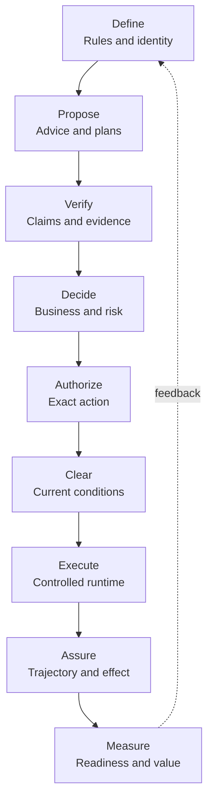
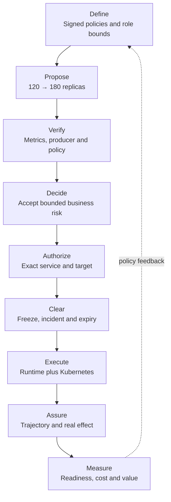
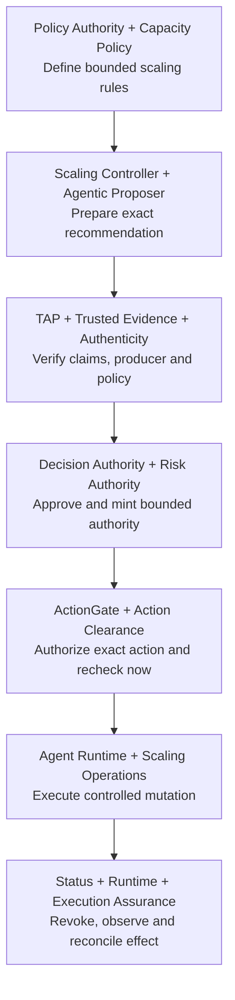
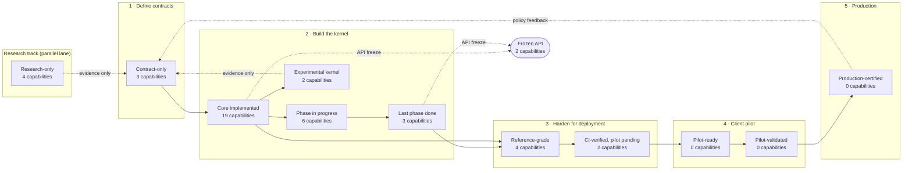

# Ugence Enterprise AI Governance Capability Pipeline

**Repository-based capability map**  
**Architecture sequence:** Define → Propose → Verify → Decide → Authorize → Clear → Execute → Assure → Measure

## 1. Purpose and scope

This document explains how the enterprise AI governance capabilities found under the repository's `packages/` directory fit into one understandable operating sequence. It is intended for business leaders, governance teams, architects, risk officers and engineers.

The inspected repository snapshot contains **47 installable packages**. This document intentionally excludes the two packaged business-solution examples and covers the remaining **45 platform capabilities**. Cloud-scaling packages remain included because they are capability and integration modules that demonstrate how the general governance architecture can govern a consequential operational domain.

The package set is not uniformly production-ready. It includes implemented kernels, integration components, experimental or research-only capabilities, and contract-only foundations. A package's presence in the sequence identifies its architectural responsibility; it does not by itself establish production deployment readiness.

## 2. Platform operating principle

The architecture separates nine questions that should not be answered by one agent or one model:

1. **Define:** What policies, identities, boundaries and objectives govern the system?
2. **Propose:** What does the AI recommend doing, and how was the proposal prepared?
3. **Verify:** Are the proposal's claims, evidence, policy references and benchmarks trustworthy?
4. **Decide:** Has an accountable authority made the binding business and risk decision?
5. **Authorize:** Does that decision permit this exact action, actor, scope and time window?
6. **Clear:** Is the already-authorized action still safe and operationally valid immediately before execution?
7. **Execute:** How is the permitted action carried out reliably without expanding its authority?
8. **Assure:** Did execution remain within its authority, and did the intended real-world effect occur?
9. **Measure:** Was the governed system ready, and what value did the authorized action create?

The central rule is:

> **Agents and models may propose. Independent governance components verify, decide, authorize and clear. The runtime executes only within that authority, while assurance observes the trajectory and outcome.**

## 3. Layman architecture sequence



Three shared foundations support the whole sequence:

- **Common contracts and identity:** all components use stable, machine-verifiable meanings.
- **Provider and integration boundaries:** modules can be composed without collapsing their responsibilities.
- **Fail-closed authority separation:** absence, ambiguity, expiry or mismatch does not silently become permission.

## 4. Shared foundations across the sequence

These packages do not represent a single business step. They provide the common language, identities and interoperability needed across multiple steps.

### 1. Governance Contracts

**Package:** `packages/governance-contracts`  
**Sequence alignment:** Cross-cutting foundation for **Verify → Decide → Authorize → Execute → Assure**.  
**Pipeline role:** Defines provider-neutral request, result, evidence, execution and system-binding contracts so independently built capabilities exchange the same typed facts without inheriting one another's authority.

**Why it is necessary:**

1. Prevents each governance module from inventing incompatible meanings for actions, assertions, evidence and execution results.
2. Preserves authority boundaries by making the contracts neutral rather than embedding policy or decision power in shared data structures.
3. Enables audit, replay and substitution of providers because requests and results have stable, testable shapes.

### 2. Governance Provider Framework

**Package:** `packages/governance-provider-framework`  
**Sequence alignment:** Cross-cutting composition layer for **Verify → Authorize → Execute**.  
**Pipeline role:** Supplies provider registry, resolution, lifecycle and conformance mechanics through which evidence, action-governance and execution providers can be discovered and invoked without the framework becoming an authority.

**Why it is necessary:**

1. Allows TAP, ActionGate and future providers to plug into a common mechanism while remaining independent peers.
2. Separates provider operations from the governance meaning owned by each capability.
3. Makes provider compatibility, health and failure handling explicit instead of burying them inside application code.

### 3. JSON Canonicalization Scheme

**Package:** `packages/jcs`  
**Sequence alignment:** Identity foundation across **Define → Propose → Verify → Authorize → Assure**.  
**Pipeline role:** Produces deterministic canonical bytes and hashes for already-parsed data, allowing the platform to prove that different components are referring to the exact same policy, proposal, evidence object or action representation.

**Why it is necessary:**

1. Makes tampering or accidental semantic drift mechanically detectable through stable digests.
2. Supports exact-action authorization because logically identical inputs receive reproducible identities.
3. Enables cross-system verification and replay without depending on incidental JSON formatting or field order.

### 4. Benchmark Registry Contracts

**Package:** `packages/benchmark-registry`  
**Sequence alignment:** Foundation for **Define → Verify → Measure**.  
**Pipeline role:** Defines exact, digest-bound benchmark identities, lifecycle vocabulary and typed refusals; it makes floating references such as an unspecified “latest benchmark” structurally avoidable. The current package is contract-only and does not itself operate a registry.

**Why it is necessary:**

1. Prevents favorable benchmarks from being silently substituted across tenants, geographies, populations, metrics or time periods.
2. Gives readiness and value assessments an exact comparison target that can later be independently resolved and audited.
3. Separates benchmark identity from benchmark trust, avoiding the false assumption that possessing a benchmark makes it valid.

### 5. UVI Policy Contracts

**Package:** `packages/uvi-policy-contracts`  
**Sequence alignment:** Foundation for **Define → Measure**.  
**Pipeline role:** Defines immutable policy and assessment-context shapes for Ugence Value Intelligence, including policy references, thresholds, gates, intended outcomes, geography, domain, valuation and readiness context. It creates no policy authority by itself.

**Why it is necessary:**

1. Ensures value and readiness evaluations are tied to an explicit business, geographic and intended-outcome context.
2. Prevents caller-controlled value multipliers and floating policy references from gaming an assessment.
3. Gives Policy Authority and downstream evaluators a stable contract boundary without merging policy issuance with measurement.

## 5. Define — establish policies, identities and boundaries

### 6. Policy Authority

**Package:** `packages/policy-authority`  
**Sequence alignment:** **Define**, with continuing control over **Verify** and **Authorize** through trusted resolution and revocation.  
**Pipeline role:** Issues, signs, registers, resolves and revokes versioned policies used across the platform. It establishes which exact policy artifact is currently trusted without deciding a business case or executing an action.

**Why it is necessary:**

1. Converts policy from editable prose or configuration into signed, versioned and revocable governance artifacts.
2. Prevents agents and applications from selecting whichever policy version is most convenient at runtime.
3. Provides a common platform authority for multiple policy families while keeping business decisions and execution authority separate.

### 7. Policy Workflow Compiler

**Package:** `packages/tooling/policy-workflow-compiler`  
**Sequence alignment:** **Define → Propose**.  
**Pipeline role:** Compiles a reviewed structured policy pack into deterministic Workflow IR, assurance specifications, capability requirements, audit schemas and content-addressed artifacts. It describes how governance must be composed but does not exercise authority.

**Why it is necessary:**

1. Translates human-approved policy into a machine-readable workflow without relying on runtime prompt interpretation.
2. Makes governance structure reproducible, diffable and testable before an agent operates.
3. Creates the workflow and assurance artifacts consumed by proposers, workforce planning and downstream governance controls.

### 8. Agent Constitution Policy

**Package:** `packages/integration/agent-constitution-policy`  
**Sequence alignment:** **Define**.  
**Pipeline role:** Introduces an issuable Policy Authority family that states the signed structural bounds of governed roles, including permitted candidate dispositions, review actions and tool scopes.

**Why it is necessary:**

1. Gives each governed role a durable constitutional ceiling that cannot be expanded by the agent itself.
2. Separates organizational role constraints from transient prompts and model behavior.
3. Makes role bounds signable, versioned, resolvable and revocable through the shared Policy Authority.

### 9. Agent Constitution Activation

**Package:** `packages/integration/agent-constitution-activation`  
**Sequence alignment:** **Define → Propose**.  
**Pipeline role:** Provides the composition root, preflight checks, governed reference-map derivation and key-material-free receipts needed to issue and activate a constitution through Policy Authority.

**Why it is necessary:**

1. Turns a constitution definition into an explicitly activated, deployment-consumable governance relationship.
2. Ensures configuration and reference mappings are checked before governed proposals are produced.
3. Keeps key material out of activation receipts while retaining evidence that the activation path was completed.

### 10. Cloud Scaling Capacity-Bounds Policy

**Package:** `packages/integration/cloud-scaling-capacity-bounds-policy`  
**Sequence alignment:** **Define → Authorize**.  
**Pipeline role:** Defines the Policy Authority family and adapter for signed, digest-bound cloud capacity ceilings that later constrain scaling recommendations and authorization candidates.

**Why it is necessary:**

1. Encodes business or operational capacity limits as governed policy rather than controller tuning.
2. Prevents a scaling recommender or executor from unilaterally increasing its permitted range.
3. Demonstrates how domain-specific constraints attach to a shared enterprise policy authority.

### 11. Agentic Proposer Strategy-Permission Policy

**Package:** `packages/integration/agentic-proposer-strategy-permission-policy`  
**Sequence alignment:** **Define → Propose**.  
**Pipeline role:** Defines an issuable Policy Authority family specifying which declared reasoning strategies a governed role is permitted to use. Permission constrains proposal preparation but grants no compute, tool or execution authority.

**Why it is necessary:**

1. Lets an organization govern reasoning procedures independently of a model's self-selected behavior.
2. Makes strategy permission signed, versioned and revocable rather than a mutable local setting.
3. Prevents permission to reason in a certain way from being confused with permission to act.

## 6. Propose — prepare advice, plans and candidates

### 12. Agent Constitution Conformance

**Package:** `packages/integration/agent-constitution-conformance`  
**Sequence alignment:** **Define → Propose → Verify**.  
**Pipeline role:** Resolves an issued constitution through Policy Authority and checks whether presented role facts remain within its signed structural bounds. It returns structural conformance, not an operational permission or denial.

**Why it is necessary:**

1. Makes the constitution enforceably checkable rather than merely issuable documentation.
2. Fails closed when the exact constitution, tenant, role binding, approval or lifecycle state cannot be trusted.
3. Prevents a proposal from silently relying on role declarations broader than the organization authorized.

### 13. Agentic Proposer

**Package:** `packages/capabilities/agentic-proposer`  
**Sequence alignment:** **Propose**.  
**Pipeline role:** Produces identity-bound advisory candidates and a structured advisory using bounded context, role contracts, observations, eligibility and declared reasoning strategy. It may propose, request evidence, abstain or escalate; it does not decide or authorize.

**Why it is necessary:**

1. Converts opaque agent intent into a typed, inspectable proposal that governance components can evaluate.
2. Preserves the crucial separation between generating options and granting permission to act.
3. Creates deterministic identities and replay checks around proposal artifacts even though private model reasoning is not exposed or claimed deterministic.

### 14. Strategy-Permission Runtime Resolver

**Package:** `packages/integration/agentic-proposer-strategy-permission-runtime`  
**Sequence alignment:** **Define → Propose → Verify**.  
**Pipeline role:** Resolves the exact signed strategy-permission policy for the proposer through Policy Authority and returns permitted strategy tokens only after tenant, scope, reference, approval and lifecycle checks succeed.

**Why it is necessary:**

1. Bridges the deliberately separate Proposer and Policy Authority packages without causing either to absorb the other's responsibility.
2. Prevents an agent from treating an unsigned configuration value as governed reasoning permission.
3. Ensures expired, revoked, mismatched or unresolved strategy policy produces no degraded permissive answer.

### 15. Agent Workforce Composer

**Package:** `packages/capabilities/agent-workforce-composer`  
**Sequence alignment:** **Define → Propose**.  
**Pipeline role:** Converts Workflow IR roles into capability requirements, determines eligible agents under hard constraints, ranks eligible candidates, composes a bounded team and proposes least-privilege permissions and fallbacks. It grants and schedules nothing.

**Why it is necessary:**

1. Ensures agent assignment is based on explicit capability and enterprise constraints rather than informal selection.
2. Produces complete explanations for both selected and eliminated candidates.
3. Limits proposed team permissions before runtime governance, reducing the authority surface that later stages must evaluate.

### 16. Reasoning Method Governance

**Package:** `packages/capabilities/reasoning-method-governance`  
**Sequence alignment:** **Define → Propose → Measure**.  
**Pipeline role:** Supplies research-only shared contracts for reasoning-method catalogs, task classes, execution records, fit assessments, evidence views, comparison requests and research plans. It defines the vocabulary but performs no comparison or approval.

**Why it is necessary:**

1. Creates a stable language for comparing reasoning methods without coupling contracts to an experimental runtime.
2. Separates observed telemetry, evidence status and fit assessment so none is mistaken for authority.
3. Allows advisor, comparison and pilot packages to evolve independently while remaining interoperable.

### 17. Reasoning Method Advisor

**Package:** `packages/capabilities/reasoning-method-advisor`  
**Sequence alignment:** **Propose**.  
**Pipeline role:** Provides research-only, deterministic, rule-derived advice about which reasoning methods qualify for a governed task profile. It explains inclusions, exclusions and trade-offs and names a primary method only when exactly one qualifies.

**Why it is necessary:**

1. Makes reasoning-method selection explainable and replayable rather than an ungoverned model preference.
2. Preserves ambiguity by returning zero, one or many qualifying methods instead of manufacturing a winner.
3. Establishes a design-time control point for matching reasoning approach to consequence, reversibility and task characteristics.

### 18. Readiness Comparison

**Package:** `packages/capabilities/readiness-comparison`  
**Sequence alignment:** **Propose → Measure**.  
**Pipeline role:** Executes a research-only pure comparison over reasoning-method fit and resource outcomes. It does not fetch benchmarks, infer authority or create approval-bearing results.

**Why it is necessary:**

1. Separates empirical comparison from the advisor's rule-derived recommendation.
2. Makes comparison logic deterministic, timestamp-explicit and reproducible.
3. Provides evidence that can improve future method choice without prematurely converting research results into deployment authority.

### 19. Trusted Workflow-Fit Pilot

**Package:** `packages/capabilities/workflow-fit-pilot`  
**Sequence alignment:** **Propose → Verify → Measure**.  
**Pipeline role:** Runs a research-only preregistered workflow-fit study with separate-process capture, recomputed telemetry, declared evaluator scoring, comparison and lineage tracking. Its current judgments remain explicitly unverified and non-approval-bearing.

**Why it is necessary:**

1. Tests whether recommended reasoning methods actually fit representative workflows under a declared study design.
2. Reduces self-reporting risk by capturing and recomputing telemetry at a controlled boundary.
3. Creates an evidence path from design-time advice toward future governed readiness without overstating research maturity.

### 20. Model Selection

**Package:** `packages/capabilities/model-selection`  
**Sequence alignment:** **Define → Propose**.  
**Pipeline role:** Selects an eligible model and provider from an approved set under deterministic policy constraints. It owns eligibility and selection, not request routing or provider execution.

**Why it is necessary:**

1. Prevents agents from choosing unapproved models solely for convenience, performance or cost.
2. Makes model eligibility a governed, replayable decision rather than a hidden runtime heuristic.
3. Separates approved model choice from the operational mechanics of routing and invoking it.

### 21. LLM Steering Controller

**Package:** `packages/capabilities/llm-steering-controller`  
**Sequence alignment:** **Propose**.  
**Pipeline role:** Produces advisory LLM-routing recommendations through candidate discovery, hard-constraint filtering, scoring and fallback or escalation guidance. It does not invoke providers.

**Why it is necessary:**

1. Allows performance, cost, latency and policy constraints to be considered before an LLM call is routed.
2. Keeps routing recommendations explainable and independent of provider execution.
3. Provides controlled fallbacks and escalation when no candidate safely satisfies the request.

### 22. Context Minimization

**Package:** `packages/capabilities/context-minimization`  
**Sequence alignment:** **Propose → Execute → Assure**.  
**Pipeline role:** Deterministically removes unnecessary context while protecting required units and preserving a caller-defined equivalence condition, with token accounting and fail-closed behavior.

**Why it is necessary:**

1. Reduces sensitive-data exposure by limiting what an agent or model receives.
2. Lowers token cost and latency without treating compression as acceptable when required meaning would change.
3. Produces measurable context and token records for later budget assurance and governance audit.

### 23. StoryGraph

**Package:** `packages/capabilities/storygraph`  
**Sequence alignment:** **Propose → Verify**.  
**Pipeline role:** Analyzes proposed event or action sequences for deterministic, policy-defined sequence risk and emits advisory evidence.

**Why it is necessary:**

1. Detects harms that emerge from a sequence of individually acceptable steps.
2. Supplies structured risk evidence before a binding decision or authorization is made.
3. Makes temporal and causal workflow patterns inspectable instead of evaluating every action in isolation.

### 24. Cloud Scaling Controller

**Package:** `packages/capabilities/cloud-scaling-controller`  
**Sequence alignment:** **Propose**.  
**Pipeline role:** Converts normalized workload observations into deterministic, explainable and provider-neutral scaling recommendations. It contains no actuation capability.

**Why it is necessary:**

1. Demonstrates a real operational proposer that remains strictly separate from authorization and execution.
2. Produces explainable capacity recommendations and evidence for risk evaluation.
3. Allows shadow evaluation and replay before the organization permits live infrastructure changes.

## 7. Verify — establish trust in claims, evidence and references

### 25. TAP Assertion Governance Provider

**Package:** `packages/providers/tap`  
**Sequence alignment:** **Verify**.  
**Pipeline role:** Evaluates whether a material assertion is supported, unsupported, constrained or indeterminate by supplied evidence. TAP governs claims in the assessment path and never authorizes an action.

**Why it is necessary:**

1. Stops recommendations from being treated as trustworthy merely because an AI stated them confidently.
2. Preserves uncertainty and infrastructure failure as indeterminate rather than promoting them to support.
3. Keeps evidence judgment independent from ActionGate's action-authorization responsibility.

### 26. Trusted Evidence Authority

**Package:** `packages/trusted-evidence-authority`  
**Sequence alignment:** **Verify → Assure**.  
**Pipeline role:** Defines canonical evidence identity and verifies trust anchors, signatures, key entitlement, revocation and scope before issuing signed evidence-verification receipts. A receipt proves verification under configured trust but authorizes nothing.

**Why it is necessary:**

1. Distinguishes evidence authenticity and provenance from the truth of a claim or permission to act.
2. Prevents signatures from being trusted without checking key entitlement, validity window and revocation.
3. Creates independently re-verifiable receipts that downstream risk and audit components can rely upon.

### 27. Benchmark Registry Authority

**Package:** `packages/benchmark-registry-authority`  
**Sequence alignment:** **Verify → Measure**.  
**Pipeline role:** Defines registry lifecycle, exact resolution, trust-anchor and verified-result contracts above benchmark identity. In the inspected snapshot it remains a contract and non-authoritative lifecycle surface: it has no operational store, verifier, clock or authority-issued result.

**Why it is necessary:**

1. Establishes how a benchmark can eventually be admitted, resolved, revoked and trusted without weakening exact identity.
2. Prevents benchmark possession or retrieval from being confused with verified validity.
3. Provides the authority boundary required for credible readiness, comparison and value measurement.

### 28. Risk Authority Evidence Runtime

**Package:** `packages/integration/risk-authority-evidence-runtime`  
**Sequence alignment:** **Verify → Decide**.  
**Pipeline role:** Composes trusted evidence admission and TAP-based control assurance to produce trusted control results for Risk Authority.

**Why it is necessary:**

1. Converts raw evidence references into control results that have passed explicit trust and assertion checks.
2. Prevents Risk Authority from relying directly on caller-asserted evidence quality.
3. Preserves non-compensatory control semantics so one passing control cannot erase a mandatory failure.

### 29. Cloud Scaling Producer Attestation

**Package:** `packages/integration/cloud-scaling-producer-attestation`  
**Sequence alignment:** **Verify**.  
**Pipeline role:** Verifies the authenticity of the producer that created a cloud-scaling recommendation and binds that attestation to an authorization candidate. The attestation grants no authority.

**Why it is necessary:**

1. Prevents an untrusted or substituted controller from injecting a recommendation into the governance path.
2. Binds provenance to the exact candidate rather than trusting a generic producer label.
3. Separates producer authenticity from policy validity, risk acceptance and action authorization.

### 30. Cloud Scaling Policy Authenticity

**Package:** `packages/integration/cloud-scaling-policy-authenticity`  
**Sequence alignment:** **Define → Verify → Authorize**.  
**Pipeline role:** Verifies that the capacity policy attached to a scaling candidate is the exact trusted Policy Authority artifact expected for the tenant, scope and time. Its proof grants nothing by itself.

**Why it is necessary:**

1. Prevents an expired, revoked, mismatched or fabricated capacity ceiling from governing a live action.
2. Keeps policy authenticity distinct from the decision that the proposed scaling action is acceptable.
3. Makes the domain policy reference independently auditable before exact-action authorization.

## 8. Decide — make accountable business and risk determinations

### 31. Decision Authority

**Package:** `packages/capabilities/decision-authority`  
**Sequence alignment:** **Decide**.  
**Pipeline role:** Owns the bounded binding business decision. It determines whether an accountable, delegated authority approves the governed case; it does not execute or replace exact-action authorization.

**Why it is necessary:**

1. Ensures consequential business outcomes are owned by an explicit accountable authority rather than an advisory agent.
2. Records the scope, conditions and validity of the binding decision for downstream enforcement.
3. Prevents a model recommendation, evidence result or risk score from silently becoming organizational approval.

### 32. Risk Authority

**Package:** `packages/risk_authority`  
**Sequence alignment:** **Verify → Decide → Authorize**.  
**Pipeline role:** Applies non-compensatory control evaluation and converts an approved governance decision into cryptographically bound, scoped, time-bound and revocable machine authority for exact-action enforcement.

**Why it is necessary:**

1. Bridges human or organizational approval to machine-enforceable authority without widening the original decision.
2. Fails closed when mandatory controls are missing, stale, unknown or failed.
3. Makes runtime authority scoped, expiring and revocable rather than a permanent blanket permission.

### 33. Cloud Scaling Risk Integration

**Package:** `packages/integration/cloud-scaling-risk-integration`  
**Sequence alignment:** **Propose → Decide**.  
**Pipeline role:** Projects an advisory cloud-scaling recommendation into a Risk Authority subject-risk evaluation without executing or authorizing the recommendation.

**Why it is necessary:**

1. Translates domain-specific recommendation facts into the common enterprise risk model.
2. Preserves one-way dependency so the scaling controller remains advisory and unaware of authority internals.
3. Allows capacity, workload and operational risks to influence governance before infrastructure mutation.

## 9. Authorize — permit one exact consequential action

### 34. Cloud Scaling Authorization Contracts

**Package:** `packages/integration/cloud-scaling-authorization-contracts`  
**Sequence alignment:** **Propose → Verify → Authorize**.  
**Pipeline role:** Binds a scaling recommendation, risk result, producer identity and relevant references into a non-authoritative capacity-action candidate that downstream authority can evaluate. The candidate itself grants nothing.

**Why it is necessary:**

1. Creates one exact object linking the recommendation to the evidence and risk context being authorized.
2. Prevents downstream authorization from acting on an ambiguous or reconstructed version of the proposal.
3. Maintains the distinction between an authorization candidate and actual machine authority.

### 35. Risk Authority Runtime Composition

**Package:** `packages/integration/risk-authority-runtime`  
**Sequence alignment:** **Decide → Authorize**.  
**Pipeline role:** Provides a fail-closed composition of Risk Authority, the canonical Decision Authority and ActionGate so the binding decision, machine-authority envelope and exact action are evaluated together.

**Why it is necessary:**

1. Connects separately owned authorities without merging their responsibilities into one opaque engine.
2. Ensures an action cannot bypass the chain from business decision to scoped authority to exact-action check.
3. Centralizes fail-closed integration behavior at the point where mismatches would otherwise become dangerous.

### 36. ActionGate

**Package:** `packages/providers/actiongate`  
**Sequence alignment:** **Authorize**.  
**Pipeline role:** Evaluates whether the exact proposed action is authorized by the supplied authority, policy, risk, evidence and decision context. It returns an authorization outcome but never dispatches or executes the action.

**Why it is necessary:**

1. Stops a valid general decision from being reused for a different action, resource, scope or actor.
2. Provides a deterministic enforcement point immediately before operational clearance and execution.
3. Preserves separation between authorization and actuation, limiting the consequences of an ActionGate defect or integration error.

## 10. Clear — recheck present conditions immediately before execution

### 37. Action Clearance

**Package:** `packages/capabilities/action-clearance`  
**Sequence alignment:** **Clear**.  
**Pipeline role:** Evaluates whether an already-authorized exact action remains operationally clear under trusted current-state signals. It may preserve, narrow, hold, escalate or block existing authority, but can never create or broaden it.

**Why it is necessary:**

1. Handles the gap between authorization time and execution time, when environment conditions may change.
2. Stops stale authorization from overriding freezes, incidents, conflicts, expired dependencies or other current constraints.
3. Adds a last safe checkpoint without duplicating Decision Authority or ActionGate.

## 11. Execute — perform only the permitted operation

### 38. Agent Runtime

**Package:** `packages/runtime/agent-runtime`  
**Sequence alignment:** **Propose → Authorize → Execute → Assure**.  
**Pipeline role:** Coordinates task and workflow lifecycles, provider invocation, retry, timeout, cancellation, budgets, concurrency, checkpoints and recovery. Consequential transitions cross an external governance boundary and fail closed when governance is not configured.

**Why it is necessary:**

1. Provides a canonical execution state and controlled lifecycle rather than letting every agent improvise orchestration.
2. Keeps governance checks inside the indivisible transition from proposal to exact provider action.
3. Produces durable execution and telemetry records needed for recovery, audit and post-action assurance.

### 39. Cloud Scaling Operations

**Package:** `packages/capabilities/cloud-scaling-operations`  
**Sequence alignment:** **Execute**.  
**Pipeline role:** Performs controlled Kubernetes or ArgoCD scaling operations after external authorization, with dry-run as the default posture. It is the domain actuation layer and does not create its own authority.

**Why it is necessary:**

1. Demonstrates how governance reaches a real consequential infrastructure mutation.
2. Prevents the advisory controller from containing hidden execution capability.
3. Supports safer adoption through dry-run behavior and explicit authorization-gated mutation.

## 12. Assure — monitor authority, trajectory and real-world effect

### 40. Risk Authority Status Runtime

**Package:** `packages/integration/risk-authority-status-runtime`  
**Sequence alignment:** **Authorize → Assure**.  
**Pipeline role:** Manages post-issuance machine-authority lifecycle, including revocation and epoch propagation, around the Risk Authority authorization artifact.

**Why it is necessary:**

1. Ensures issued authority can be invalidated after approval when policy, risk or organizational conditions change.
2. Propagates revocation state so distributed consumers do not continue using stale authority.
3. Treats authorization as a living lifecycle object rather than a one-time permanent token.

### 41. Risk Authority Runtime Assurance

**Package:** `packages/integration/risk-authority-runtime-assurance`  
**Sequence alignment:** **Execute → Assure → Decide**.  
**Pipeline role:** Observes runtime trajectory and can cause previously valid machine authority to be reassessed through the post-issuance intake. It observes and assesses but never mints, widens or mutates authority itself.

**Why it is necessary:**

1. Detects when actual execution behavior drifts from the trajectory assumed during authorization.
2. Creates a governed feedback route from runtime observations back to authority reassessment.
3. Prevents an initially valid authorization from remaining unquestioned throughout a changing workflow.

### 42. Risk Authority Execution Assurance

**Package:** `packages/integration/risk-authority-execution-assurance`  
**Sequence alignment:** **Execute → Assure → Decide**.  
**Pipeline role:** Reconciles the authorized action with the observed execution and real-world effect, composes Decision Authority reconciliation, and can trigger reassessment of previously valid authority.

**Why it is necessary:**

1. Distinguishes “the command ran” from “the authorized and intended effect occurred.”
2. Detects partial, divergent, failed or unexpected effects that pre-action checks cannot see.
3. Closes the governance loop by turning post-effect evidence into a reason for renewed risk and decision evaluation.

### 43. Context-Minimization Token-Accounting Runtime

**Package:** `packages/integration/context-minimization-token-accounting-runtime`  
**Sequence alignment:** **Execute → Assure → Measure**.  
**Pipeline role:** Converts Agent Runtime provider-attempt telemetry into Context Minimization accounting records and settles runtime budgets using measured token usage.

**Why it is necessary:**

1. Replaces caller estimates with observed consumption when enforcing shared runtime budgets.
2. Connects context minimization to measurable cost, efficiency and governance outcomes.
3. Supports tenant isolation, reconciliation and audit of token use across attempts and workflows.

## 13. Measure — evaluate readiness and governed value

### 44. Agent Value Readiness

**Package:** `packages/capabilities/agent-value-readiness`  
**Sequence alignment:** **Define → Verify → Measure**.  
**Pipeline role:** Produces a deterministic, advisory and non-financial readiness determination across intelligence fitness, capability readiness and adoption readiness, under governed policy and system-binding context.

**Why it is necessary:**

1. Tests whether an agent is ready for an intended business outcome before jumping directly to ROI claims.
2. Keeps readiness multidimensional so strength in one area cannot automatically compensate for a mandatory weakness elsewhere.
3. Separates advisory readiness from deployment authorization, preserving accountability for the actual deployment decision.

### 45. Governed Value

**Package:** `packages/governed-value`  
**Sequence alignment:** **Measure → Define**.  
**Pipeline role:** Calculates net governed value per authorized action using explicit evidence, authority and outcome classifications. It measures value after governance rather than treating an unverified forecast as realized ROI.

**Why it is necessary:**

1. Connects governance controls to measurable business value instead of presenting governance only as compliance overhead.
2. Distinguishes reported, forecast and observed outcomes so weak evidence is not promoted into financial truth.
3. Feeds cost, loss, benefit and authorization outcomes back into policy revision and future investment decisions.

## 14. End-to-end interpretation

The 45 capabilities form four complementary layers:

1. **Governance definition layer:** establishes policies, constitutions, identities, benchmarks and machine-readable workflow rules.
2. **Agent intelligence layer:** prepares candidates, teams, reasoning-method advice, model selection, context and domain recommendations without owning authority.
3. **Authority and execution layer:** verifies claims and evidence, makes the binding decision, mints bounded machine authority, checks the exact action, clears current conditions and executes.
4. **Assurance and value layer:** observes authority status, runtime trajectory, real-world effect, resource consumption, readiness and governed value.

The platform's differentiation is therefore not any single gate. It is the **non-collapsible chain of accountability**:

```text
Policy authors define what is allowed
        ↓
Agents prepare inspectable proposals
        ↓
Evidence authorities establish what can be trusted
        ↓
Decision authority owns the binding business outcome
        ↓
Risk authority converts that decision into bounded machine authority
        ↓
ActionGate matches authority to the exact action
        ↓
Action Clearance checks the present operational world
        ↓
Agent Runtime and domain operations execute without expanding authority
        ↓
Assurance reconciles trajectory and real-world effect
        ↓
Readiness and governed value inform the next policy cycle
```

## 15. Why the complete pipeline is necessary

1. **No self-authorization:** the component proposing an action is not the component permitted to approve or execute it.
2. **No trust by assertion:** claims, evidence, policies, benchmarks and producer identity have distinct verification paths.
3. **No floating authority:** decisions and permissions are tied to exact identities, versions, scopes, actors, times and actions.
4. **No one-time governance:** revocation, runtime trajectory, effects, budgets and outcomes remain governed after authorization.
5. **No compliance-value trade-off:** readiness and governed-value measurement show whether controlled execution produces defensible business outcomes.

---

**Repository interpretation note:** This document describes the architectural responsibility visible in each package's metadata, README and boundaries in the inspected codebase snapshot. Contract-only and research-only packages are described according to their intended position while their present limitations are stated explicitly.

# Appendix A — Enterprise Use Case: Governed Autonomous Cloud Scaling

## A.1 Purpose of the appendix

This appendix tests the architecture against one concrete enterprise situation rather than assuming that all 45 capabilities must participate in every transaction. Its purpose is to show:

- which capabilities are essential to the live governance path;
- which are specifically required by the cloud-scaling domain;
- which improve safety, efficiency or governance depth but are optional for an initial deployment;
- which belong to design-time evaluation rather than the live action path; and
- which are unnecessary when the use case uses one preassigned scaling agent and a fixed execution method.

The scenario is illustrative. Names, thresholds, times and financial figures are examples, not values found in the repository or claims about a real deployment.

## A.2 Scenario narrative

### A.2.1 Enterprise setting

Northstar Digital Bank operates a regulated customer-facing payments platform on Kubernetes. The service normally runs 120 application replicas across two availability zones. A product launch and a national sales event are expected to produce a sharp traffic increase between 18:00 and 22:00 UTC.

The bank wants AI-assisted capacity management because manual scaling is slow, reactive and expensive. However, it does not want a forecasting model or operations agent to possess unrestricted production credentials or the ability to convert its own recommendation into an infrastructure change.

The organization establishes these illustrative requirements:

- maintain payment API latency below the governed service objective;
- preserve an operational reserve in both availability zones;
- never exceed 200 replicas without separate executive approval;
- restrict ordinary autonomous changes to a maximum increase of 60 replicas;
- require trusted workload observations and a known recommendation producer;
- refuse autonomous mutation during a declared change freeze or active severity-one incident;
- require the binding business decision and machine authorization to expire after a short window;
- execute only the exact authorized Kubernetes or ArgoCD operation; and
- verify both that the command completed and that capacity, latency and error-rate effects matched the authorized intent.

### A.2.2 Define: governance is established before the traffic spike

Operations, finance, security and risk owners first agree on a structured scaling policy. Policy Authority issues the approved capacity-bounds policy as a signed, versioned and revocable artifact. The Policy Workflow Compiler translates the reviewed policy pack into deterministic Workflow IR and assurance requirements.

The policy states the permitted replica range, environment, service identity, validity interval, approval requirements, required evidence and escalation conditions. The scaling agent may recommend capacity changes, but its role does not include business approval, machine-authorization issuance or direct infrastructure mutation.

If the deployment adopts Agent Constitution controls, the role is additionally bound to a signed constitution limiting its candidate dispositions, review actions and tool scopes. Constitution activation and conformance then establish that the presented role remains inside those bounds. These controls are valuable for a reusable multi-agent estate, but they are not indispensable to a first single-agent scaling pilot when equivalent identity and role restrictions are already imposed by the deployment environment.

### A.2.3 Propose: the AI prepares an inspectable recommendation

At 17:42 UTC, the Cloud Scaling Controller consumes normalized workload and infrastructure observations. CPU utilization, memory pressure, request queue depth and latency trend indicate that 120 replicas are unlikely to maintain the governed service objective during the predicted surge.

The controller recommends increasing capacity from 120 to 180 replicas. It produces an explanation and component evidence but performs no actuation. Agentic Proposer can wrap the domain recommendation into a structured advisory bound to the agent role, context, observations, candidate set, declared strategy and constitution reference where configured.

Context Minimization may reduce the operational context sent to an LLM or agent while protecting the policy, current capacity, change-freeze state and critical service signals. Model Selection and LLM Steering are useful only when the workflow dynamically chooses among models or providers. If the scaling controller is deterministic and the deployment fixes the model/provider, these two packages are optional.

Agent Workforce Composer is not required for the minimum scenario because one preassigned scaling agent owns proposal preparation. It becomes relevant when separate forecasting, cost, reliability and operations agents must be selected and composed into a governed team. The reasoning-method governance, advisor, comparison and workflow-fit pilot packages likewise belong to design-time research: they can help determine how the agent should reason, but they should not delay every live scaling transaction.

### A.2.4 Verify: the platform asks whether the recommendation can be trusted

TAP evaluates the material claims behind the recommendation: whether the supplied observations support the forecasted capacity shortfall and whether the recommended increase is constrained or indeterminate. Missing evidence, malformed results or provider failure must not become “supported.”

Trusted Evidence Authority can validate evidence identity, signatures, key entitlement, validity and revocation before producing independently verifiable receipts. Cloud Scaling Producer Attestation checks that the recommendation came from the expected producer. Cloud Scaling Policy Authenticity verifies that the cited capacity policy is the exact trusted Policy Authority artifact for this tenant, scope and time.

The Benchmark Registry packages are useful if the bank compares the recommendation or later results against formally governed workload, reliability or cost benchmarks. They are not required for the immediate live action when the decision relies on current trusted observations and literal governed thresholds. The inspected Benchmark Registry Authority package is also not yet an operational authoritative registry, so it must not be represented as one.

### A.2.5 Decide: an accountable authority accepts or refuses the business risk

Risk Authority Evidence Runtime turns admitted evidence and control-assurance results into trusted control inputs. Cloud Scaling Risk Integration projects the recommendation into the enterprise risk case without authorizing or executing it.

Decision Authority then owns the binding business determination: for example, approve the increase to 180 replicas for the production payments service, subject to the stated policy, evidence, time window and conditions. The model recommendation is not the decision. TAP support is not the decision. A risk score is not the decision.

Risk Authority evaluates mandatory controls non-compensatorily. A strong forecast cannot compensate for a failed change-freeze control, an untrusted producer or a missing required approval. If controls and the binding decision are valid, Risk Authority creates scoped, time-bound and revocable machine authority that cannot exceed the decision.

### A.2.6 Authorize: the exact proposed mutation must match the authority

Cloud Scaling Authorization Contracts bind the exact recommendation, risk result, producer and policy references into a capacity-action candidate. Risk Authority Runtime composes the canonical Decision Authority, Risk Authority and ActionGate path.

ActionGate checks the exact action: the authorized actor, service, environment, operation, present replica count, target replica count, constraints and validity window. Authority to increase the payments service from 120 to 180 replicas cannot be reused to scale another service, change a different environment, increase to 240 replicas or perform an unrelated infrastructure operation.

An `ALLOW` outcome means the exact action matches supplied authority. It does not mean the operation has been dispatched, remains safe under changing conditions or has succeeded.

### A.2.7 Clear: the platform rechecks the live operational world

Seconds before execution, Action Clearance evaluates trusted current-state signals. It checks whether a change freeze began after authorization, a severity-one incident is active, the service state changed, the authorization expired or another controller already altered capacity.

If the action remains valid, clearance is `CLEAR`. If information is temporarily incomplete, it can be held. If a human decision is needed, it can be escalated. If a prohibiting condition exists, it is blocked. Action Clearance can narrow or stop existing authority but cannot create or broaden it.

This stage prevents a previously valid authorization from overriding the world as it exists at execution time.

### A.2.8 Execute: runtime coordination and domain actuation remain separate

Agent Runtime coordinates the workflow transition, governance call, provider invocation, timeout, retry, cancellation, budget, checkpoint and recovery behavior. It preserves one canonical execution state and fails closed for consequential transitions when governance is absent.

Cloud Scaling Operations performs the permitted Kubernetes or ArgoCD change. It receives external authorization and should execute only the operation that was authorized. Dry-run can be used during pilot and assurance testing before production mutation is enabled.

The separation matters: the controller recommends, authority components permit, the runtime coordinates and the operations package mutates infrastructure. No single component owns the entire chain.

### A.2.9 Assure: successful dispatch is not assumed to be successful governance

Risk Authority Status Runtime continues to propagate revocation and authority-epoch changes. Runtime Assurance observes whether the workflow trajectory remains consistent with what governance approved. Execution Assurance reconciles the command, execution record and real-world effect.

For example, the Kubernetes API may report success while only 165 of the 180 requested replicas become ready. Latency may remain above the service objective because the bottleneck is a downstream database. Execution Assurance distinguishes command completion from intended effect and can trigger reassessment rather than allowing the system to assume success.

Context-Minimization Token-Accounting Runtime is relevant if LLM token consumption participates in workflow budgets. It is optional when the scaling decision path is entirely deterministic and uses no material model context.

### A.2.10 Measure: readiness and value close the feedback loop

Agent Value Readiness can assess whether the governed scaling agent is ready for broader autonomy across intelligence fitness, capability readiness and organizational adoption. This is an advisory deployment input, not permission for the individual scaling action.

Governed Value can compare the authorized action's observed reliability benefit, avoided incident loss and incremental infrastructure cost. The result should distinguish modeled, reported and observed values. If the added capacity cost ₹400,000 while avoiding a verified outage exposure materially larger than that amount, the action may show positive governed value. If the predicted surge never occurred, the platform should not quietly report the forecast benefit as realized value.

These findings feed the next policy cycle: modify capacity limits, evidence requirements, readiness controls, escalation thresholds or model-selection policy based on observed outcomes rather than intuition alone.

## A.3 Nine-stage walkthrough

| Stage | Question answered | Scenario event | Primary output |
|---|---|---|---|
| **Define** | What rules and authority boundaries apply? | Issue scaling policy, compile Workflow IR and optionally bind the agent constitution. | Signed policy references and governed workflow |
| **Propose** | What should the AI recommend? | Recommend scaling the payments service from 120 to 180 replicas. | Identity-bound advisory and capacity recommendation |
| **Verify** | Can the claims, producer, evidence and policy be trusted? | Validate workload observations, producer identity and policy authenticity. | Evidence/control results and verification receipts |
| **Decide** | Has an accountable authority approved the business outcome? | Approve the bounded capacity increase for a limited period. | Binding decision and risk determination |
| **Authorize** | Does the authority permit this exact action? | Match actor, service, environment, operation and target replica count. | Exact-action authorization outcome |
| **Clear** | Is the action still safe now? | Recheck freeze, incident, current capacity and expiry immediately before mutation. | `CLEAR`, `HOLD`, `ESCALATE` or `BLOCK` |
| **Execute** | How is the permitted operation performed? | Coordinate and apply the exact Kubernetes or ArgoCD scaling change. | Canonical execution state and provider result |
| **Assure** | Did execution remain in bounds and produce the intended effect? | Reconcile requested, applied and ready replicas plus latency and errors. | Runtime/effect assessment and possible reassessment trigger |
| **Measure** | Was the system ready and was governed value created? | Evaluate autonomy readiness, reliability improvement and incremental cost. | Readiness determination and governed-value record |



## A.4 Applicability classifications

| Classification | Meaning in this appendix |
|---|---|
| **Core required** | Necessary for the high-assurance live governance path described here. |
| **Domain required** | Required because the example performs cloud-scaling analysis or mutation. |
| **Optional enhancement** | Adds useful control, intelligence or efficiency but can be omitted from the first bounded deployment. |
| **Evaluation only** | Used in design, testing, readiness or retrospective analysis rather than every live scaling transaction. |
| **Not applicable** | Unnecessary for the stated single-agent, fixed-execution scenario; it becomes relevant only if the scenario changes. |

## A.5 Complete 45-capability applicability matrix

| # | Capability | Primary stage | Applicability | How it contributes—or why it is not needed |
|---:|---|---|---|---|
| 1 | Governance Contracts | Foundation | Core required | Gives evidence, action, authority and execution components stable shared contracts. |
| 2 | Governance Provider Framework | Foundation | Core required | Composes TAP, ActionGate and provider boundaries without merging their authority. |
| 3 | JSON Canonicalization Scheme | Foundation | Core required | Creates deterministic identities for exact policy, proposal, evidence and action matching. |
| 4 | Benchmark Registry Contracts | Verify / Measure | Evaluation only | Useful when results are compared against governed benchmarks; not needed for a literal-threshold live decision. |
| 5 | UVI Policy Contracts | Define / Measure | Evaluation only | Supports governed readiness and value assessment rather than the immediate scaling mutation. |
| 6 | Policy Authority | Define | Core required | Issues, signs, resolves and revokes the exact scaling policy. |
| 7 | Policy Workflow Compiler | Define | Core required | Converts reviewed scaling policy into deterministic workflow and assurance artifacts. |
| 8 | Agent Constitution Policy | Define | Optional enhancement | Adds signed role bounds; an initial single-agent pilot may use externally enforced role restrictions. |
| 9 | Agent Constitution Activation | Define | Optional enhancement | Activates and maps the constitution when constitution governance is adopted. |
| 10 | Cloud Scaling Capacity-Bounds Policy | Define | Domain required | Expresses signed replica ceilings and scaling constraints. |
| 11 | Strategy-Permission Policy | Define / Propose | Optional enhancement | Governs declared reasoning strategies but grants no action authority. |
| 12 | Agent Constitution Conformance | Propose / Verify | Optional enhancement | Checks presented role facts against the signed constitution. |
| 13 | Agentic Proposer | Propose | Core required | Produces an inspectable identity-bound advisory rather than a direct command. |
| 14 | Strategy-Permission Runtime Resolver | Propose / Verify | Optional enhancement | Resolves the exact signed strategy policy when strategy governance is enabled. |
| 15 | Agent Workforce Composer | Propose | Not applicable | One scaling agent is preassigned; required only for governed multi-agent team selection. |
| 16 | Reasoning Method Governance | Propose / Measure | Evaluation only | Supplies research contracts for method selection and comparison. |
| 17 | Reasoning Method Advisor | Propose | Evaluation only | Advises on reasoning methods during design, not on every live scaling event. |
| 18 | Readiness Comparison | Propose / Measure | Evaluation only | Compares method fit experimentally and produces no approval. |
| 19 | Trusted Workflow-Fit Pilot | Propose / Measure | Evaluation only | Tests reasoning workflows before production; current outputs remain research-only. |
| 20 | Model Selection | Propose | Optional enhancement | Needed only if more than one approved model/provider may be selected. |
| 21 | LLM Steering Controller | Propose | Optional enhancement | Adds dynamic routing, fallback and escalation when the workflow uses multiple LLM targets. |
| 22 | Context Minimization | Propose / Assure | Optional enhancement | Reduces sensitive context, latency and token use when an LLM participates. |
| 23 | StoryGraph | Propose / Verify | Optional enhancement | Detects sequence-level risk in a multi-step operational plan. |
| 24 | Cloud Scaling Controller | Propose | Domain required | Produces the explainable, non-executing scaling recommendation. |
| 25 | TAP | Verify | Core required | Evaluates whether claims behind the recommendation are supported by supplied evidence. |
| 26 | Trusted Evidence Authority | Verify | Core required | Establishes cryptographic evidence trust and independently verifiable receipts. |
| 27 | Benchmark Registry Authority | Verify / Measure | Evaluation only | Required for authoritative governed benchmark resolution when that future operational path is used; current package is not an authoritative live registry. |
| 28 | Risk Authority Evidence Runtime | Verify / Decide | Core required | Converts admitted evidence and control assurance into trusted Risk Authority inputs. |
| 29 | Cloud Scaling Producer Attestation | Verify | Domain required | Proves the recommendation came from the expected producer. |
| 30 | Cloud Scaling Policy Authenticity | Verify | Domain required | Proves the candidate cites the exact current trusted capacity policy. |
| 31 | Decision Authority | Decide | Core required | Owns the binding business decision; the agent does not approve itself. |
| 32 | Risk Authority | Decide / Authorize | Core required | Applies mandatory controls and mints bounded, expiring and revocable machine authority. |
| 33 | Cloud Scaling Risk Integration | Decide | Domain required | Projects scaling facts into the enterprise risk case without executing them. |
| 34 | Cloud Scaling Authorization Contracts | Authorize | Domain required | Binds recommendation, risk, producer and references into one exact authorization candidate. |
| 35 | Risk Authority Runtime Composition | Authorize | Core required | Connects Decision Authority, Risk Authority and ActionGate fail-closed. |
| 36 | ActionGate | Authorize | Core required | Matches the exact actor, service, operation and target to supplied authority. |
| 37 | Action Clearance | Clear | Core required | Rechecks live freezes, incidents, state and expiry immediately before execution. |
| 38 | Agent Runtime | Execute | Core required | Coordinates the governed lifecycle, provider invocation, checkpoint and recovery. |
| 39 | Cloud Scaling Operations | Execute | Domain required | Applies the authorized Kubernetes or ArgoCD mutation. |
| 40 | Risk Authority Status Runtime | Assure | Core required | Propagates revocation and post-issuance authority status. |
| 41 | Risk Authority Runtime Assurance | Assure | Core required | Detects trajectory drift and can trigger authority reassessment. |
| 42 | Risk Authority Execution Assurance | Assure | Core required | Reconciles authorization, execution and actual effect. |
| 43 | Context-Minimization Token-Accounting Runtime | Assure / Measure | Optional enhancement | Settles measured LLM-token use when model calls participate in the workflow budget. |
| 44 | Agent Value Readiness | Measure | Evaluation only | Assesses whether the agent is ready for broader autonomy; it does not authorize this action. |
| 45 | Governed Value | Measure | Optional enhancement | Connects observed reliability benefit and cost to the authorized action. |

## A.6 Minimum production path

The minimum path deliberately excludes research evaluation, dynamic model routing, multi-agent team composition and post-hoc value analytics. It contains only the governance and domain components required to move one consequential scaling proposal safely from policy to verified effect.



Required supporting foundations are Governance Contracts, Governance Provider Framework and deterministic canonical identity. The Policy Workflow Compiler and cloud-scaling integration contracts prepare the governed artifacts and domain bindings used by the path.

## A.7 Capability-by-capability problem, solution and competitor analogue

### A.7.1 Governance Contracts

**The problem:** Independent governance components can assign different meanings to the same action, evidence item or execution result, making composition and audit unreliable.

**What it solves:** Supplies neutral, reusable request/result and evidence/execution contracts without granting authority to the shared layer.

**Competitor analogue:**

### A.7.2 Governance Provider Framework

**The problem:** Evidence, authorization and execution providers need common discovery, lifecycle and failure mechanics, but a generic framework must not become the decision-maker.

**What it solves:** Provides provider registration, resolution, conformance and health mechanics while preserving each provider's authority boundary.

**Competitor analogue:** [Portkey AI Gateway](https://docs.portkey.ai/docs/product/ai-gateway) provides a partial analogue for provider routing, fallbacks and gateway controls; it is not equivalent to Ugence's separated evidence and action-authority contracts.

### A.7.3 JSON Canonicalization Scheme

**The problem:** Equivalent JSON can serialize differently, breaking exact identity, signatures, comparison and replay.

**What it solves:** Produces deterministic canonical bytes and bare hashes so all stages can bind to the same exact artifact.

**Competitor analogue:**

### A.7.4 Benchmark Registry Contracts

**The problem:** A benchmark can be silently changed, loosely referenced or applied outside its tenant, population, metric or time context.

**What it solves:** Makes benchmark identity exact and digest-bound while keeping trust and authoritative resolution separate.

**Competitor analogue:** [LangSmith Evaluation](https://docs.langchain.com/langsmith/evaluation) provides datasets, experiment comparison and evaluation workflows, but not the same digest-bound benchmark-authority model.

### A.7.5 UVI Policy Contracts

**The problem:** Readiness and value claims become incomparable or gameable when geography, intended outcome, evidence requirements and thresholds are implicit.

**What it solves:** Provides immutable governed context and policy shapes for later readiness and value engines.

**Competitor analogue:** [IBM watsonx.governance](https://www.ibm.com/products/watsonx-governance) partially overlaps through AI lifecycle, risk, control and accountability records.

### A.7.6 Policy Authority

**The problem:** Editable policies and local configuration cannot prove which approved version governed an action or whether it was revoked.

**What it solves:** Issues, signs, registers, resolves and revokes exact policy artifacts shared across the platform.

**Competitor analogue:** [Credo AI Policy Packs](https://docs.sdk.credo.ai/core-concepts/policy-packs) translate governance requirements into reusable policy controls; [Open Policy Agent](https://openpolicyagent.org/) provides policy-as-code evaluation. Neither source establishes the same signed multi-family issuance and revocation architecture described here.

### A.7.7 Policy Workflow Compiler

**The problem:** Runtime interpretation of prose policies is nondeterministic and difficult to test before deployment.

**What it solves:** Compiles reviewed structured policy into deterministic Workflow IR, assurance specifications and content-addressed artifacts.

**Competitor analogue:** [Credo AI](https://www.credo.ai/) advertises policy-to-code translation, automated workflows and audit-ready evidence; [OPA's Rego](https://openpolicyagent.org/docs/policy-language) expresses policy decisions over structured data. These are partial rather than exact compiler analogues.

### A.7.8 Agent Constitution Policy

**The problem:** Agent roles can expand their declared actions, dispositions or tool scopes when boundaries live only in prompts or mutable configuration.

**What it solves:** Makes the role's structural ceiling an issuable, signed, versioned and revocable policy artifact.

**Competitor analogue:** [Amazon Bedrock AgentCore Identity](https://aws.amazon.com/blogs/machine-learning/introducing-amazon-bedrock-agentcore-identity-securing-agentic-ai-at-scale/) and [AgentCore Policy](https://docs.aws.amazon.com/bedrock-agentcore/latest/devguide/policy.html) partially overlap through agent identity and externalized fine-grained permissions, but do not document the same signed constitution vocabulary.

### A.7.9 Agent Constitution Activation

**The problem:** An issued constitution is not operationally useful until its exact references and composition dependencies are activated safely.

**What it solves:** Performs preflight, derives governed reference mappings and records key-material-free activation receipts.

**Competitor analogue:**

### A.7.10 Cloud Scaling Capacity-Bounds Policy

**The problem:** A controller can otherwise treat replica limits as adjustable tuning rather than organization-approved ceilings.

**What it solves:** Makes capacity ceilings signed, versioned and resolvable through Policy Authority.

**Competitor analogue:** [Sedai Kubernetes Optimization](https://sedai.io/platform/kubernetes) describes safe optimization against workload behavior and SLOs, while [Open Policy Agent](https://openpolicyagent.org/docs/policy-language) can express infrastructure constraints. The Ugence module specifically binds capacity ceilings to its policy-authority path.

### A.7.11 Strategy-Permission Policy

**The problem:** An agent may select an inappropriate reasoning procedure without an organization-governed permission boundary.

**What it solves:** Defines the signed set of reasoning strategies a governed role may declare, without authorizing tools, compute or action.

**Competitor analogue:**

### A.7.12 Agent Constitution Conformance

**The problem:** Issuing a constitution does not prove that the current presented role remains inside its signed bounds.

**What it solves:** Resolves the exact constitution and performs a fail-closed subset check over governed role facts.

**Competitor analogue:** [AgentCore Policy](https://docs.aws.amazon.com/bedrock-agentcore/latest/devguide/policy.html) externally checks fine-grained permissions for identity and tool-input parameters, a partial runtime-control analogue rather than a constitution-conformance verifier.

### A.7.13 Agentic Proposer

**The problem:** Free-form agent output is difficult to govern and may be mistaken for a decision or command.

**What it solves:** Produces typed, identity-bound candidates and advisories with explicit evidence needs, abstention and escalation states.

**Competitor analogue:**

### A.7.14 Strategy-Permission Runtime Resolver

**The problem:** A proposer cannot safely trust a local list of permitted reasoning strategies or resolve policy by an unsigned floating reference.

**What it solves:** Resolves the exact signed policy through Policy Authority and fails closed on tenant, scope, lifecycle, approval or reference mismatch.

**Competitor analogue:**

### A.7.15 Agent Workforce Composer

**The problem:** Multi-agent workflows can assign roles based on availability or model preference without hard capability, evidence and least-privilege constraints.

**What it solves:** Determines eligibility, ranks qualified agents, composes bounded teams and proposes least-privilege permissions and fallbacks.

**Competitor analogue:**

### A.7.16 Reasoning Method Governance

**The problem:** Reasoning-method experiments use inconsistent task, telemetry, evidence and fit vocabularies.

**What it solves:** Supplies shared research-only contracts so advice, comparison and pilot evidence remain distinguishable and interoperable.

**Competitor analogue:** [LangSmith Evaluation](https://docs.langchain.com/langsmith/evaluation-concepts) provides a framework for measuring agent quality from predeployment testing through production monitoring, a partial analogue for evaluation vocabulary and workflow.

### A.7.17 Reasoning Method Advisor

**The problem:** Developers may choose reasoning methods by fashion, intuition or an LLM's unexamined preference.

**What it solves:** Deterministically identifies zero, one or many qualifying methods from governed task characteristics and explains every inclusion and exclusion.

**Competitor analogue:**

### A.7.18 Readiness Comparison

**The problem:** Rule-derived advice alone does not establish that one reasoning method performs better for the task.

**What it solves:** Provides a deterministic research comparison over declared quality and resource dimensions without manufacturing authority.

**Competitor analogue:** [LangSmith Evaluation](https://docs.langchain.com/langsmith/evaluation) supports experiment comparison, datasets and regression evaluation, but does not document Ugence's authority-separated readiness contract.

### A.7.19 Trusted Workflow-Fit Pilot

**The problem:** Workflow-method evaluations can be biased by post-hoc case selection, self-reported telemetry or undeclared evaluator behavior.

**What it solves:** Preregisters the study, isolates capture, recomputes telemetry and preserves research-only evidence lineage.

**Competitor analogue:** [LangSmith's CI/CD evaluation pattern](https://docs.langchain.com/langsmith/cicd-pipeline-example) shows agent evaluation in deployment pipelines; the Ugence pilot adds its own preregistration and authority-label separation.

### A.7.20 Model Selection

**The problem:** Agents can route work to models that are unapproved, incompatible with policy or unsuitable for the task.

**What it solves:** Deterministically selects only from the approved eligible model/provider set without performing routing or execution.

**Competitor analogue:** [Portkey AI Gateway](https://docs.portkey.ai/docs/product/ai-gateway) supports a model catalog, conditional routing and provider fallbacks, partially overlapping selection and routing.

### A.7.21 LLM Steering Controller

**The problem:** Static model routing creates cost, latency, reliability and policy failures when conditions change.

**What it solves:** Produces explainable provider-neutral routing, fallback and escalation recommendations after hard-constraint filtering.

**Competitor analogue:** [Portkey Conditional Routing](https://docs.portkey.ai/docs/product/ai-gateway/conditional-routing) routes requests to provider targets under custom conditions and supports fallbacks through its gateway.

### A.7.22 Context Minimization

**The problem:** Agents often receive more sensitive, costly and distracting context than the task requires.

**What it solves:** Removes unnecessary context while protecting required units and preserving a declared equivalence condition, with measurable token accounting.

**Competitor analogue:**

### A.7.23 StoryGraph

**The problem:** A sequence of individually permitted actions can create a collectively prohibited or unsafe outcome.

**What it solves:** Evaluates sequence-level risk and emits advisory evidence before binding authorization.

**Competitor analogue:** [Amazon Bedrock AgentCore's multi-action policy controls](https://aws.amazon.com/blogs/machine-learning/control-agent-behaviors-and-cost-beyond-a-single-action-new-capabilities-in-amazon-bedrock-agentcore/) describe controls over agent behavior and cost beyond one stateless action, a partial analogue to sequence-aware control.

### A.7.24 Cloud Scaling Controller

**The problem:** Reactive manual scaling is slow, while an autonomous optimizer that also executes creates excessive authority concentration.

**What it solves:** Generates deterministic, explainable scaling advice with no mutation capability.

**Competitor analogue:** [Sedai](https://sedai.io/) provides autonomous cloud and Kubernetes optimization; [CAST AI](https://cast.ai/kubernetes-cost-optimization/) provides Kubernetes cost optimization and autoscaling. Both overlap the operational domain, while Ugence deliberately separates recommendation from authorization and execution.

### A.7.25 TAP

**The problem:** Confident model assertions and incomplete evidence can be accepted as facts by downstream decision systems.

**What it solves:** Classifies whether an assertion is supported, unsupported, constrained or indeterminate without granting action authority.

**Competitor analogue:** [Portkey Guardrails](https://docs.portkey.ai/docs/product/guardrails) can verify LLM inputs and outputs against configured checks; [Credo AI](https://www.credo.ai/) records governance evidence. These partially overlap but do not document TAP's separate assertion-governance outcome model.

### A.7.26 Trusted Evidence Authority

**The problem:** A signature, evidence reference or claimed provenance is not enough to establish current trust.

**What it solves:** Verifies evidence identity, trust anchors, key entitlement, revocation, scope and signing frames and issues independently re-verifiable receipts.

**Competitor analogue:**

### A.7.27 Benchmark Registry Authority

**The problem:** Benchmark retrieval can be mistaken for authoritative admission, approval and exact resolution.

**What it solves:** Defines the lifecycle and trust boundary for future authoritative benchmark handling while honestly withholding capabilities not yet implemented.

**Competitor analogue:**

### A.7.28 Risk Authority Evidence Runtime

**The problem:** Risk decisions cannot safely consume caller-asserted evidence status or disconnected control results.

**What it solves:** Composes evidence admission and assertion assurance into trusted, non-compensatory control inputs.

**Competitor analogue:** [Credo AI](https://www.credo.ai/) combines policy controls, automated workflows and audit-ready evidence; this is a partial governance-process overlap rather than an equivalent runtime authority input.

### A.7.29 Cloud Scaling Producer Attestation

**The problem:** A valid-looking scaling candidate may have been created by an unknown, replaced or unauthorized producer.

**What it solves:** Binds verified producer authenticity to the exact scaling authorization candidate without granting permission.

**Competitor analogue:** [Amazon Bedrock AgentCore Identity](https://aws.amazon.com/blogs/machine-learning/introducing-amazon-bedrock-agentcore-identity-securing-agentic-ai-at-scale/) provides agent identity and controlled resource access, a partial producer-identity analogue.

### A.7.30 Cloud Scaling Policy Authenticity

**The problem:** A recommendation can cite an expired, revoked, mismatched or fabricated capacity policy.

**What it solves:** Verifies that the referenced policy is the exact trusted Policy Authority artifact applicable to the candidate.

**Competitor analogue:**

### A.7.31 Decision Authority

**The problem:** Recommendations, risk scores and evidence results are often allowed to become de facto business approvals without a clearly accountable owner.

**What it solves:** Owns the bounded binding business decision and its delegation, scope, conditions and validity.

**Competitor analogue:** [IBM watsonx.governance Model Risk Governance](https://dataplatform.cloud.ibm.com/docs/content/svc-watsonxgov/wxgov_mrg_example_workflow.html?audience=wdp&context=wx) documents staged model-governance workflows through deployment approval, a partial governance-approval analogue.

### A.7.32 Risk Authority

**The problem:** Human approval is not directly machine-enforceable and can be broadened or reused after conditions change.

**What it solves:** Converts an approved decision into scoped, time-bound, revocable and cryptographically bound machine authority after mandatory controls pass.

**Competitor analogue:** [AgentCore Policy](https://docs.aws.amazon.com/bedrock-agentcore/latest/devguide/policy.html) provides fine-grained permissions based on identity and tool-input parameters. It overlaps runtime policy enforcement but does not document the same decision-derived authorization-envelope chain.

### A.7.33 Cloud Scaling Risk Integration

**The problem:** Domain controller outputs do not naturally fit a general enterprise risk case.

**What it solves:** Projects scaling observations and recommendations into Risk Authority's governed risk representation without importing authority into the controller.

**Competitor analogue:** [IBM watsonx.governance](https://www.ibm.com/products/watsonx-governance) and [Credo AI](https://www.credo.ai/) provide broader AI risk and control workflows, but neither cited source establishes this exact scaling-to-machine-authority adapter.

### A.7.34 Cloud Scaling Authorization Contracts

**The problem:** Authorization can drift if the recommendation, producer, risk result and policy references are reconstructed separately.

**What it solves:** Binds them into one exact, digestible capacity-action candidate that explicitly grants nothing.

**Competitor analogue:**

### A.7.35 Risk Authority Runtime Composition

**The problem:** Separate decision, risk and action components can be wired inconsistently or bypassed by application code.

**What it solves:** Provides a fail-closed composition of Decision Authority, Risk Authority and ActionGate.

**Competitor analogue:** [Amazon Bedrock AgentCore](https://aws.amazon.com/bedrock/agentcore/) combines identity, gateway and policy controls for agent tool access, a partial platform-level analogue; Ugence additionally separates the binding business decision and machine-authority artifact.

### A.7.36 ActionGate

**The problem:** A legitimate general approval can be replayed for a different actor, tool, resource, input or operation.

**What it solves:** Evaluates whether the exact proposed action matches supplied authority and context without executing it.

**Competitor analogue:** [AgentCore Policy](https://docs.aws.amazon.com/bedrock-agentcore/latest/devguide/policy.html) intercepts agent tool calls and evaluates fine-grained permissions outside the reasoning loop; [OPA](https://openpolicyagent.org/docs/philosophy) provides general action/resource authorization policy. These are the closest documented overlaps.

### A.7.37 Action Clearance

**The problem:** Conditions can change after authorization but before execution.

**What it solves:** Rechecks trusted current-state signals and may hold, escalate or block without creating or broadening authority.

**Competitor analogue:** [OPA external-data guidance](https://openpolicyagent.org/docs/external-data) supports context-aware policy decisions using current external state, a partial analogue; the cited source does not describe Ugence's separate post-authorization clearance stage.

### A.7.38 Agent Runtime

**The problem:** Agent workflows need reliable lifecycle, retries, cancellation, budgets, concurrency, checkpointing and recovery without allowing orchestration to become governance authority.

**What it solves:** Coordinates governed execution and maintains canonical execution state while delegating consequential authorization to an external boundary.

**Competitor analogue:** [Amazon Bedrock AgentCore](https://aws.amazon.com/bedrock/agentcore/) provides managed agent runtime, identity, gateway and observability capabilities; the Ugence package is a domain-neutral kernel with an explicitly external governance boundary.

### A.7.39 Cloud Scaling Operations

**The problem:** A recommendation requires controlled domain actuation, but embedding credentials and mutation inside the recommender defeats governance separation.

**What it solves:** Executes externally authorized Kubernetes or ArgoCD changes with a dry-run-first posture.

**Competitor analogue:** [Sedai Kubernetes Optimization](https://sedai.io/platform/kubernetes) performs autonomous production optimization; [CAST AI](https://cast.ai/kubernetes-cost-optimization/) automates Kubernetes optimization and scaling.

### A.7.40 Risk Authority Status Runtime

**The problem:** Once issued, machine authority can remain usable after revocation or policy/risk changes unless status propagates.

**What it solves:** Manages post-issuance revocation and authority-epoch propagation.

**Competitor analogue:** [AgentCore Identity](https://aws.amazon.com/blogs/machine-learning/introducing-amazon-bedrock-agentcore-identity-securing-agentic-ai-at-scale/) provides agent access control and identity infrastructure, a partial lifecycle analogue; the cited material does not establish the same authorization-epoch design.

### A.7.41 Risk Authority Runtime Assurance

**The problem:** A workflow can diverge from the authorized trajectory even when individual provider calls succeed.

**What it solves:** Observes trajectory and routes material drift back into authority reassessment without minting authority itself.

**Competitor analogue:** [LangSmith Observability](https://docs.langchain.com/langsmith/observability) records agent traces for debugging, quality monitoring and evaluation; [AgentCore Observability](https://docs.aws.amazon.com/bedrock-agentcore/latest/devguide/observability-configure.html) emits runtime traces and metrics. These overlap observation, not the full authority-reassessment path.

### A.7.42 Risk Authority Execution Assurance

**The problem:** Dispatch success does not prove that the authorized real-world effect occurred or remained within bounds.

**What it solves:** Reconciles authorization, execution evidence and observed effect and can trigger a new risk/decision assessment.

**Competitor analogue:** [Sedai Kubernetes Optimization](https://sedai.io/platform/kubernetes) tracks workload behavior, application performance, cost drivers and SLO impact, a partial operational-effect analogue; Ugence binds effect reconciliation back to authority.

### A.7.43 Context-Minimization Token-Accounting Runtime

**The problem:** Estimated token use can understate actual provider consumption and weaken shared budget enforcement.

**What it solves:** Converts provider-attempt telemetry into reconciled context/token records and settles budgets from measured use.

**Competitor analogue:** [Portkey's agent gateway controls](https://docs.portkey.ai/docs/product/coding-agent) log cost, tokens, latency and actor and support budget/rate limits, a close operational accounting overlap.

### A.7.44 Agent Value Readiness

**The problem:** Organizations can confuse technical capability or a successful demo with readiness for an intended enterprise outcome.

**What it solves:** Produces a governed, non-financial and multidimensional readiness determination covering intelligence, capability and adoption.

**Competitor analogue:** [IBM watsonx.governance](https://www.ibm.com/products/watsonx-governance/model-governance) tracks model facts, lifecycle performance and risk management, a partial readiness-governance overlap.

### A.7.45 Governed Value

**The problem:** Forecast savings, reported benefits and observed realized value are often collapsed into one optimistic ROI figure.

**What it solves:** Attributes net governed value to authorized actions while preserving evidence, authority and outcome classifications.

**Competitor analogue:** [Sedai Cloud Cost Optimization](https://sedai.io/solution/cloud-cost-optimization) ties cloud savings to optimization actions and audit receipts, a close domain overlap; Ugence's capability is intended as a cross-domain governance accounting kernel.

## A.8 Essential deployment stack versus later enhancements

### A.8.1 Essential platform controls

The high-assurance production path requires:

- Governance Contracts, Governance Provider Framework and canonical identity;
- Policy Authority and the Policy Workflow Compiler;
- Agentic Proposer;
- TAP and Trusted Evidence Authority;
- Risk Authority Evidence Runtime;
- Decision Authority and Risk Authority;
- Risk Authority Runtime Composition, ActionGate and Action Clearance;
- Agent Runtime; and
- Risk Authority Status, Runtime Assurance and Execution Assurance.

These capabilities implement the platform's non-collapsible accountability chain. Removing one requires an explicit alternative control; otherwise the system risks confusing policy, recommendation, evidence, decision, authorization, execution or observed effect.

### A.8.2 Essential cloud-scaling adapters and operations

The scenario additionally requires:

- Cloud Scaling Controller;
- Cloud Scaling Capacity-Bounds Policy;
- Cloud Scaling Risk Integration;
- Cloud Scaling Authorization Contracts;
- Cloud Scaling Producer Attestation;
- Cloud Scaling Policy Authenticity; and
- Cloud Scaling Operations.

These do not redefine enterprise governance. They translate the general platform into the language of replicas, workload observations, capacity limits and Kubernetes or ArgoCD operations.

### A.8.3 Optional production enhancements

The following deepen control or operational efficiency but need not block the first bounded single-agent deployment:

- Agent Constitution Policy, Activation and Conformance;
- Strategy-Permission Policy and Runtime Resolver;
- Model Selection and LLM Steering Controller;
- Context Minimization and its token-accounting integration;
- StoryGraph; and
- Governed Value.

They should be enabled when the deployment introduces dynamic model choice, sensitive context, complex multi-step behavior, reusable agent roles, token budgets or a formal value-realization program.

### A.8.4 Evaluation and future-governance capabilities

The following should operate outside the per-action critical path:

- Benchmark Registry Contracts and the present Benchmark Registry Authority surface;
- UVI Policy Contracts and Agent Value Readiness;
- Reasoning Method Governance, Reasoning Method Advisor and Readiness Comparison; and
- Trusted Workflow-Fit Pilot.

They support research, benchmark governance, readiness and system improvement. Their evidence can influence later policies and deployment decisions, but research-only or contract-only outputs must not be promoted into live action authority.

### A.8.5 Not required in the stated minimum scenario

Agent Workforce Composer is not required because the scenario uses one preassigned scaling agent. It becomes valuable if the enterprise later composes forecasting, finance, reliability and operations agents dynamically under capability, evidence and least-privilege constraints.

## A.9 Competitive interpretation

The cited products demonstrate that parts of the Ugence architecture have market analogues:

- Credo AI and IBM watsonx.governance overlap policy, risk, lifecycle and evidence-management functions.
- Amazon Bedrock AgentCore overlaps agent identity, tool-call policy enforcement, runtime and observability.
- Open Policy Agent overlaps policy-as-code and context-aware authorization.
- Portkey overlaps model routing, gateway guardrails, observability and token/cost controls.
- LangSmith overlaps agent tracing, evaluation, datasets and deployment-pipeline testing.
- Sedai and CAST AI overlap autonomous cloud or Kubernetes optimization and execution.

The comparison should not claim that a blank competitor field proves uniqueness. It means only that no sufficiently close analogue was established from the limited official-source review used for this appendix. The more defensible Ugence distinction is architectural: the repository separates proposal, assertion verification, binding business decision, risk-derived machine authority, exact-action authorization, operational clearance, execution coordination, runtime assurance, effect reconciliation and governed-value measurement into explicit non-collapsible responsibilities.

# Appendix B — Development Status of the 45 Capabilities

## B.1 Purpose and evidence basis

This appendix answers one question per capability: **where does development stand today?** Each row is derived from the package as it exists under `packages/` in the inspected snapshot: the distribution version, the package README's own status, maturity, phase and scope statements, and the size of its test suite. It does not restate architectural role (Sections 4–13) or scenario applicability (Appendix A).

Evidence labels follow the repository working agreement: `[V]` verified against the package itself, `[I]` inferred from adjacent repository material. Unless a row is marked `[I]`, every statement in it is `[V]` from the package's README and metadata.

The single most important finding is stated first: **no package among the 45 declares itself pilot-validated, shadow-deployed or production-certified.** Many READMEs disclaim it explicitly; the rest simply make no such claim. The closest pilot evidence in the repository sits outside these packages: the legacy Enterprise Validation Pilot (Phase 5I, `docs/ENTERPRISE_VALIDATION_PILOT.md`) exercised the predecessor distributions of Decision Authority, TAP and ActionGate together, and the excluded AI Hiring product declares `PACKAGE_READY_FOR_CONTROLLED_PILOT`. Both are noted as `[I]` where relevant.

## B.2 Stage tags

| Tag | Meaning |
|---|---|
| **Contract-only** | Typed contracts, vocabulary or validation only; no operational engine, store, verifier or clock. |
| **Research-only** | Experimental study path whose every output is labelled non-approval-bearing by construction. |
| **Experimental kernel** | A working calculation or determination kernel that the package itself marks experimental and advisory. |
| **Core implemented** | Deterministic kernel implemented and unit-tested; no phase ladder pending inside the package; no pilot or production claim. |
| **Phase in progress** | Part of a numbered phase ladder whose later phases are named and still pending. |
| **Last phase done** | The package's own phase sequence is complete; any remaining work is assigned to a different package or milestone. |
| **Reference-grade** | Operative logic shipped with in-memory or reference adapters that are refused when `production_mode` is set; production adapters delegated. |
| **CI-verified, pilot pending** | Implemented and CI-verified, and the README itself states that pilot or production validation remains pending. |
| **Frozen** | Public API frozen at a major version; no phase ladder; validation described as synthetic or legacy-lineage. |
| **Pilot-ready** | The package declares readiness to **start** a bounded or controlled pilot with a client. **No capability currently carries this tag.** |
| **Pilot-validated** | A pilot has **run** against this package lineage and its results are recorded. No capability carries it; several READMEs state the negative (`pilot_validated=false`, "Not pilot-validated"). |
| **Production-certified** | Formal certification beyond pilot. No capability carries it; every README that mentions it states the negative. |

## B.3 Canonical development pipeline

The stage tags are not an arbitrary list. They sit at fixed points on one development cycle that every capability is expected to travel: contracts first, then an implemented kernel, then hardening, then a client pilot, then production. The research track runs beside that cycle and feeds evidence back into definition; it never enters the pilot band on its own. **Frozen** is an API-stability state that can be reached at any point from the kernel band onward, so it is drawn as a side state rather than a band.



How to read it against the table in B.4:

- **Bands 1–3 hold all 45 capabilities.** Nothing has crossed into band 4, which is the finding stated in B.1.
- **Band 2 is where a package's own phase ladder lives.** "Phase in progress" and "Last phase done" describe position on that ladder; "Core implemented" means the package has no ladder left inside it. The cloud-scaling thread is the clearest example of a ladder that spans several packages, with Phases 1–5B landed and 5B-2, 5C, 5X, 5D and 6 still unbuilt.
- **Band 3 is the step the Risk Authority runtimes and Agent Runtime have reached.** Reference-grade means the logic is operative but its production adapters are delegated; CI-verified, pilot pending means the README itself names pilot or production validation as the next step.
- **Band 4 has two rungs.** Pilot-ready means the package declares fitness to start a controlled pilot with a client. Pilot-validated means a pilot has run and its results are recorded. The legacy Enterprise Validation Pilot sits near the second rung but ran over predecessor distributions, so it is cited as inferred and not counted.
- **The research lane is not a shortcut.** Research-only and Experimental-kernel outputs reach the main cycle only as evidence for policy and contract revision, never as authority to deploy.

## B.4 Status table

Test counts are `def test_` occurrences under each package's `tests/` tree at the inspected commit; they indicate suite size, not coverage or pass state.

| # | Capability | Version | Stage tag | Phase position | Where development stands | Tests |
|---:|---|---|---|---|---|---:|
| 1 | Governance Contracts | 0.3.1 | Core implemented | Extraction, GV-2E-a, M-3R.3 and 0.3.1 canonicalization done; contract-evolution phase pending | Neutral contracts extracted verbatim from the frozen core; authenticity fields stay permanently `STRUCTURAL_UNVERIFIED` because no ratified system-binding verifier exists yet. | 104 |
| 2 | Governance Provider Framework | 0.1.0 | Core implemented | Contract version 1.0.0; no phase ladder | Provider registry, resolution and conformance mechanics are in place with reference providers for framework validation only; the README makes no maturity statement. Predecessor distribution was exercised by the legacy Enterprise Validation Pilot `[I]`. | 57 |
| 3 | JSON Canonicalization Scheme | 0.2.0 | Core implemented | Alpha; extracted from `cer_v0_3/cleanroom` | Byte-exact RFC 8785 canonicalizer with a single consumer; README states alpha, not pilot-validated, not production-certified, and other packages' canonicalizers are not yet converged on it. | 31 |
| 4 | Benchmark Registry Contracts | 0.1.0 | Contract-only | BR-1 done; BR-2 (registry, trusted resolver, revocation) not started | Digest-bound benchmark identities and typed refusals exist; every identity reports `trusted_resolution_performed = False` until BR-2 lands. | 242 |
| 5 | UVI Policy Contracts | 0.1.0 | Contract-only | M-2C.1 done; authority, registry and evaluator milestones deferred | Immutable policy and assessment-context shapes with structural fail-closed binding; lifecycle labels and digests remain caller-supplied inputs until a registry exists. | 76 |
| 6 | Policy Authority | 0.2.0 | Core implemented | ADR P-1 to P-11 ratified; v0.1 semantics; structured supersession pending | Issues, signs, registers, resolves and revokes policies with three external families now registered; production persistence and distributed concurrency are deferred. | 279 |
| 7 | Policy Workflow Compiler | 0.2.0 | Last phase done | Phase 1 and Phase 2 (`workflow_ir.v2`) complete; downstream adoption in AWC P2.1 done | Deterministic offline compiler from reviewed policy pack to Workflow IR and assurance artifacts; not pilot-validated, not production-certified; document ingestion excluded by design. | 151 |
| 8 | Agent Constitution Policy | 0.2.0 | Phase in progress | First-slice family half done (ACC-S1); first release stated to await the OD-C1=B ballot | Constitutions are issuable, signable and resolvable; README says end-to-end conformance is not yet made true, although Agentic Proposer 0.4.0 already records the OD-C1=B binding `[I]`. | 120 |
| 9 | Agent Constitution Activation | 0.1.0 | Core implemented | ACC-IA-1 to ACC-IA-5 done with an end-to-end issue-activate-resolve-bind-conform proof | Composition root and preflight are complete; proof runs on ephemeral in-process keys and no signing key or trust root exists in the repository. | 89 |
| 10 | Cloud Scaling Capacity-Bounds Policy | 0.1.0 | Core implemented | Family adapter and rejection vocabulary done; reconciliation against Phase 5A candidates deferred | Capacity ceilings are issuable and resolvable through Policy Authority, but no composition root calls the family yet; it is not wired into any runtime path. | 70 |
| 11 | Strategy-Permission Policy | 0.1.0 | Core implemented | Artifact half done; concrete resolver shipped separately as capability 14 | Signed strategy-permission family issued and resolved across a package boundary; a resolution proves integrity, not provenance, and authorizes no runtime action. | 81 |
| 12 | Agent Constitution Conformance | 0.1.0 | Phase in progress | Second ACC-S1-Q2 change set done; first release awaits the OD-C1=B round | Resolver and structural verifier run end to end with the family package; reference-map population remains a disclosed ungoverned gap. | 103 |
| 13 | Agentic Proposer | 0.4.0 | Core implemented | S0, S1, S2, S2-B and 0.4.0 constitution binding done; concrete evaluators and semantic auditor deferred | Contracts, identity equations and constitution binding are implemented against stubbed resolvers; classifier is pre-alpha and nothing has been exercised against a real workload. | 521 |
| 14 | Strategy-Permission Runtime Resolver | 0.1.0 | Core implemented | Ratified surface under owner rulings SURFACE=B and ROLE_LOOKUP=A | Resolves the exact signed strategy policy end to end, verified in a clean offline venv against a genuinely issued policy; role lookup exemption is test-tree-only. | 90 |
| 15 | Agent Workforce Composer | 0.2.1 | Core implemented | P1, P2 and P2.1 done; permission granting, scheduling and runtime adapters listed as next phases | Eligibility, ranking, bounded team composition and least-privilege proposals implemented offline; README records `pilot_validated=false`, `production_certified=false`. | 178 |
| 16 | Reasoning Method Governance | 0.1.0 | Research-only | Slice 1 (contracts) done | Shared research-only contracts for methods, task classes, telemetry and fit; issues no envelope and defines no approval or pilot state. | 54 |
| 17 | Reasoning Method Advisor | 0.1.0 | Research-only | Slice 2 done | Deterministic rule-derived advisor; every advisory is `RESEARCH_ONLY` with comparison evidence absent, and the shipped rule set is a test fixture only. | 42 |
| 18 | Readiness Comparison | 0.2.0 | Research-only | Slice 1 engine done; spec correction 30 applied | Pure comparison function with no I/O; every result is requester-asserted and research-scoped, nothing approval-bearing. | 45 |
| 19 | Trusted Workflow-Fit Pilot | 0.1.0 | Research-only | Phase 4A shipped; Phase 4C slices 1–2 landed, slice 3A/3B split in commissioning `[I]` | Preregistered study harness with separate-process capture and recomputed telemetry; preregistration and evaluator independence remain `DECLARED_UNVERIFIED` and approval status is constant `NONE`. | 83 |
| 20 | Model Selection | 0.1.0 | Core implemented | Model Authority rename and contract migration done; quality-floor gap from audit still open | Deterministic eligibility and selection kernel; the release is a behavior-preserving migration whose evidence remains primarily synthetic. | 18 |
| 21 | LLM Steering Controller | 0.1.0 | Core implemented | No phase ladder; provider execution outside the distribution | Advisory routing recommendations with hard-constraint filtering and reproducible evidence; README makes no claim of routing performance or production readiness. | 85 |
| 22 | Context Minimization | 0.2.0 | Core implemented | v0.1 core plus CM-TA1 token accounting done; Agent Runtime wiring in a separate package | Structural and oracle-verified minimization modes with fail-closed equivalence; carries no live-enterprise validation claim. | 199 |
| 23 | StoryGraph | 2.0.0 | Frozen | Frozen-but-working; legacy shim removal targeted for 3.0.0 | Sequence-risk analysis with one implemented harmful graph domain; synthetic-only validation and advisory findings only. | 304 |
| 24 | Cloud Scaling Controller | 0.4.0 | Phase in progress | Phases 1–3 done in shadow mode; Phases 4–6 assigned to other packages | Canonical, predictive and cost-aware recommendations that never feed a live controller; not live-cluster validated, not production-certified. | 788 |
| 25 | TAP Assertion Governance Provider | 0.1.0 | Core implemented | Beta classifier; outcome-safety release gate in place | Working assertion-governance provider whose uncertainty-never-promoted invariant is CI-enforced; README says not production certified. Predecessor distribution was exercised by the legacy Enterprise Validation Pilot `[I]`. | 60 |
| 26 | Trusted Evidence Authority | 0.3.0 | Core implemented | TEV-1 and TEV-2 done; BR-2, RA-5 port alignment and DD-10 production posture deferred | Verification orchestration, trust anchors, revocation, signed receipts and independent re-verification implemented; exactly one consumer imports it and production persistence and HSM posture are deferred. | 530 |
| 27 | Benchmark Registry Authority | 0.2.3 | Contract-only | BR-2A, BR-2B and BR-2C-0 done; BR-2C, BR-2D and BR-2E blocked on verifier design and DD-10 | Lifecycle contracts and pure validation only; every result permanently derives `authority_verified is False` and authority-bearing types are reserved and undefined. | 550 |
| 28 | Risk Authority Evidence Runtime | 0.1.0 | Reference-grade | RA-5 complete; RA-6 to RA-8 out of this milestone | Production implementations behind Risk Authority's two ports with explicit reference versus production mode; caller-supplied PASS is inert in production mode, and HSM/KMS is excluded. | 67 |
| 29 | Cloud Scaling Producer Attestation | 0.2.0 | Last phase done | Phase 5B-0A complete; policy authenticity handed to 5B-0B | Producer attestations are mintable and verifiable with a gate-removal mutation sweep; `production_mode` defaults to `False` everywhere and only a reference signer ships. | 324 |
| 30 | Cloud Scaling Policy Authenticity | 0.9.0 | Phase in progress | 5B-0B, 5B-1 and 5B-3 done; residual R-2 (trusted time source) left to 5B-2 | Verifies the exact trusted capacity policy for tenant, scope and time; README warns that `as_of` is injected and unvalidated until envelope issuance settles the clock. | 309 |
| 31 | Decision Authority | 1.0.0 | Frozen | Public API, lifecycle, serialization and hashes frozen at 1.0.0 | Bounded binding-decision kernel with no maturity caveat in its README; its legacy `decision_governance` lineage was exercised end to end by the Enterprise Validation Pilot `[I]`. | 33 |
| 32 | Risk Authority | 0.5.0 | Phase in progress | RA-1 to RA-4 spine plus Phase 4A/4B done; Phase 5 envelope issuance and Phase 6 not implemented | Non-compensatory evaluation and v2 subject-context seam are live behind fail-closed production mode; integration stops at a non-executable `RiskDecision` and uses a reference Ed25519 implementation. | 330 |
| 33 | Cloud Scaling Risk Integration | 0.1.0 | Last phase done | Phase 4C complete; Phase 5 and 6 excluded | One-way projection into Risk Authority with recommendation-content authenticity; a fully self-consistent forgery still passes because it is not a signature. | 248 |
| 34 | Cloud Scaling Authorization Contracts | 0.7.0 | Phase in progress | Phase 5A done; 5B, 5C, 5X, 5D and 6 not implemented | Non-authoritative capacity-action candidate with measured mutation coverage; live execution remains structurally blocked until the Credential Broker phase 5X. | 309 |
| 35 | Risk Authority Runtime Composition | 0.1.0 | CI-verified, pilot pending | RA-4.5 composition implemented; F-D enforcement open as issue #1397 | Fail-closed composition of Risk Authority, Decision Authority and ActionGate; README states production deployment validation remains pending. | 62 |
| 36 | ActionGate | 0.1.0 | Core implemented | Beta classifier; outcome-safety release gate in place | Exact-action authorization provider with CI-enforced authority invariants; README says not production certified. Predecessor distribution was exercised by the legacy Enterprise Validation Pilot `[I]`. | 57 |
| 37 | Action Clearance | 0.1.0 | Core implemented | v0.1 core; next phases documented under the package `docs/` | Stateless pure-function clearance with CLEAR, HOLD, ESCALATE and BLOCK; no persistence, execution, network or domain adapters yet. | 67 |
| 38 | Agent Runtime | 0.7.0 | CI-verified, pilot pending | H22-A through H22-D done through 0.6.0; 0.7.0 current | `IMPLEMENTED_AND_CI_VERIFIED` lifecycle, coordination, durability and bounded concurrency; README states not live-verified, pilot-validated, distributed-safe or production-ready. | 339 |
| 39 | Cloud Scaling Operations | 0.1.2 | Core implemented | No phase ladder; DRY_RUN, SIMULATION, SHADOW and LIVE modes present | Real Kubernetes and ArgoCD actuation behind dry-run default and disabled live mode; not live-cluster validated and idempotency stores are in-memory only. | 129 |
| 40 | Risk Authority Status Runtime | 0.1.0 | Reference-grade | RA-6 operative against the ratified spec; Postgres persistence and signal transport delegated | Revocation and epoch propagation work in-process with a reference in-memory adapter; not globally consistent or zero-window revocation. | 72 |
| 41 | Risk Authority Runtime Assurance | 0.1.0 | Reference-grade | RA-7 done with as-built record; RA-8 handled by capability 42 | Event-driven trajectory assurance that mints nothing and blocks the hot path only when opted in; reference authenticator and evaluator are refused in production mode. | 96 |
| 42 | Risk Authority Execution Assurance | 0.1.0 | Reference-grade | RA-8 done including the M-1 non-compensatory closure; last milestone of the RA-5 to RA-8 ladder | Post-effect reconciliation emitting evidence and a neutral reassessment signal; content-hash integrity only, with no signed external receipts or third-party gateway. | 143 |
| 43 | Context-Minimization Token-Accounting Runtime | 0.1.0 | Core implemented | CM-TA1 integration; no numbered successor | One-way bridge from Agent Runtime telemetry to accounting records and budget settlement; no real provider adapter and only an in-memory reference sink. | 65 |
| 44 | Agent Value Readiness | 0.4.1 | Experimental kernel | M-3R.1 to M-3R.3 done plus Trusted Readiness Orchestration; ROI, forecasting and deployment authorization deferred | Deterministic three-dimension readiness determination marked experimental, internal, advisory and non-financial; no allow-all verifier ships by design. | 542 |
| 45 | Governed Value | 0.2.0 | Experimental kernel | GV-0 and GV-1 done; GV-2 evidence and GV-4 authority layers do not exist | Reported-value calculation kernel over caller-reported inputs; every figure carries `REPORTED` evidence status and `UNVERIFIED` authority status. | 42 |

## B.5 Distribution by stage

| Stage tag | Count | Capabilities |
|---|---:|---|
| Core implemented | 19 | 1, 2, 3, 6, 9, 10, 11, 13, 14, 15, 20, 21, 22, 25, 26, 36, 37, 39, 43 |
| Phase in progress | 6 | 8, 12, 24, 30, 32, 34 |
| Reference-grade | 4 | 28, 40, 41, 42 |
| Research-only | 4 | 16, 17, 18, 19 |
| Contract-only | 3 | 4, 5, 27 |
| Last phase done | 3 | 7, 29, 33 |
| CI-verified, pilot pending | 2 | 35, 38 |
| Experimental kernel | 2 | 44, 45 |
| Frozen | 2 | 23, 31 |
| Pilot-ready | 0 | none |
| Pilot-validated | 0 | none |
| Production-certified | 0 | none |

## B.6 Reading the table

1. **The accountability chain is implemented but not piloted.** Every Core-required capability from Appendix A is at least Core implemented, and the four Risk Authority runtime packages are reference-grade with production adapters delegated rather than absent. What is missing is a bounded pilot of the current package lineage; the only pilot evidence is the legacy Enterprise Validation Pilot over predecessor distributions.
2. **Cloud scaling is the deepest phase ladder and the clearest gap.** Phases 1–5B are landed across six packages, but envelope issuance (5B-2), production ActionGate admission (5C), the Credential Broker (5X), bounded execution (5D) and effect verification (6) are all named and unbuilt. Live infrastructure mutation is structurally blocked until 5X.
3. **Three capabilities are contracts without engines.** Benchmark Registry Contracts, UVI Policy Contracts and Benchmark Registry Authority ship typed shapes whose authority fields are permanently false by construction. They should not be presented as operational registries or authorities.
4. **The reasoning-method thread is research-only end to end.** Capabilities 16–19 are commissioned under an owner-ratified research ballot and label every output non-approval-bearing; Phase 4C of the workflow-fit pilot is actively landing but does not change that label.
5. **Version numbers and README phase text drift in places.** Cloud Scaling Authorization Contracts is at 0.7.0 while its README narrates 0.1.0 to 0.2.0; Cloud Scaling Controller's header says 0.3.0 while its Phase 3 section says 0.4.0; Agent Runtime's Status section stops at 0.5.0 while its Maturity block reaches 0.6.0 and the distribution is 0.7.0. The Version column above reports the distribution's `__version__` at the inspected commit.
