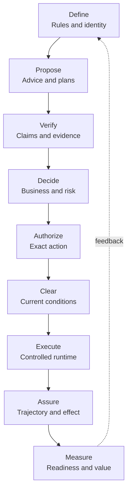
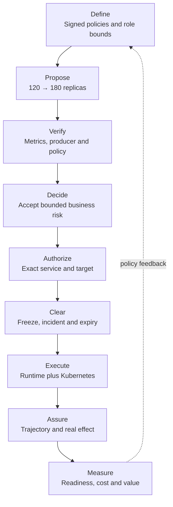
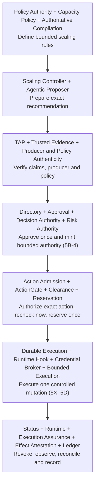

# Ugence Enterprise AI Governance Capability Pipeline

**Repository-based capability map**  
**Architecture sequence:** Define → Propose → Verify → Decide → Authorize → Clear → Execute → Assure → Measure

## 1. Purpose and scope

This document explains how the enterprise AI governance capabilities found under the repository's `packages/` directory fit into one understandable operating sequence. It is intended for business leaders, governance teams, architects, risk officers and engineers.

The inspected repository snapshot (default branch at commit `6ef1f724`, 9 September 2026) contains **72 installable packages**. This document intentionally excludes the two packaged business-solution examples and covers the remaining **70 platform capabilities**. Cloud-scaling packages remain included because they are capability and integration modules that demonstrate how the general governance architecture can govern a consequential operational domain.

Capability identifiers are stable across revisions. Revision 1.1 numbered the 45 capabilities present on 4 September 2026 in sequence order; revision 2.0 adds the 24 packages merged since as capabilities 46 to 69, each placed in the stage section it belongs to, so numbering inside a section is no longer contiguous. The module map published on 6 September 2026 counted 66 packages including the two products; five further packages landed between that map and this snapshot (Authoritative Policy Compilation, Procurement Policy Compilation, Reasoning-Method Result Attestation, Clearance Export and Console API). Appendix C.4 cross-references every capability to that map's module identifiers.

The package set is not uniformly production-ready. It includes implemented kernels, integration components, experimental or research-only capabilities, and contract-only foundations. A package's presence in the sequence identifies its architectural responsibility; it does not by itself establish production deployment readiness.

## 2. Platform operating principle

The architecture separates nine questions that should not be answered by one agent or one model:

1. **Define:** What policies, identities, boundaries and objectives govern the system?
2. **Propose:** What does the AI recommend doing, and how was the proposal prepared?
3. **Verify:** Are the proposal's claims, evidence, policy references and benchmarks trustworthy?
4. **Decide:** Has an accountable authority made the binding business and risk decision?
5. **Authorize:** Does that decision permit this exact action, actor, scope and time window?
6. **Clear:** Is the already-authorized action still safe and operationally valid immediately before execution?
7. **Execute:** How is the permitted action carried out reliably without expanding its authority?
8. **Assure:** Did execution remain within its authority, and did the intended real-world effect occur?
9. **Measure:** Was the governed system ready, and what value did the authorized action create?

The central rule is:

> **Agents and models may propose. Independent governance components verify, decide, authorize and clear. The runtime executes only within that authority, while assurance observes the trajectory and outcome.**

## 3. Layman architecture sequence



Three shared foundations support the whole sequence:

- **Common contracts and identity:** all components use stable, machine-verifiable meanings.
- **Provider and integration boundaries:** modules can be composed without collapsing their responsibilities.
- **Fail-closed authority separation:** absence, ambiguity, expiry or mismatch does not silently become permission.

## 4. Shared foundations across the sequence

These packages do not represent a single business step. They provide the common language, identities and interoperability needed across multiple steps.

### 1. Governance Contracts

**Package:** `packages/governance-contracts`  
**Sequence alignment:** Cross-cutting foundation for **Verify → Decide → Authorize → Execute → Assure**.  
**Pipeline role:** Defines provider-neutral request, result, evidence, execution and system-binding contracts so independently built capabilities exchange the same typed facts without inheriting one another's authority.

**Why it is necessary:**

1. Prevents each governance module from inventing incompatible meanings for actions, assertions, evidence and execution results.
2. Preserves authority boundaries by making the contracts neutral rather than embedding policy or decision power in shared data structures.
3. Enables audit, replay and substitution of providers because requests and results have stable, testable shapes.

### 2. Governance Provider Framework

**Package:** `packages/governance-provider-framework`  
**Sequence alignment:** Cross-cutting composition layer for **Verify → Authorize → Execute**.  
**Pipeline role:** Supplies provider registry, resolution, lifecycle and conformance mechanics through which evidence, action-governance and execution providers can be discovered and invoked without the framework becoming an authority.

**Why it is necessary:**

1. Allows TAP, ActionGate and future providers to plug into a common mechanism while remaining independent peers.
2. Separates provider operations from the governance meaning owned by each capability.
3. Makes provider compatibility, health and failure handling explicit instead of burying them inside application code.

### 3. JSON Canonicalization Scheme

**Package:** `packages/jcs`  
**Sequence alignment:** Identity foundation across **Define → Propose → Verify → Authorize → Assure**.  
**Pipeline role:** Produces deterministic canonical bytes and hashes for already-parsed data, allowing the platform to prove that different components are referring to the exact same policy, proposal, evidence object or action representation.

**Why it is necessary:**

1. Makes tampering or accidental semantic drift mechanically detectable through stable digests.
2. Supports exact-action authorization because logically identical inputs receive reproducible identities.
3. Enables cross-system verification and replay without depending on incidental JSON formatting or field order.

### 4. Benchmark Registry Contracts

**Package:** `packages/benchmark-registry`  
**Sequence alignment:** Foundation for **Define → Verify → Measure**.  
**Pipeline role:** Defines exact, digest-bound benchmark identities, lifecycle vocabulary and typed refusals; it makes floating references such as an unspecified “latest benchmark” structurally avoidable. The current package is contract-only and does not itself operate a registry.

**Why it is necessary:**

1. Prevents favorable benchmarks from being silently substituted across tenants, geographies, populations, metrics or time periods.
2. Gives readiness and value assessments an exact comparison target that can later be independently resolved and audited.
3. Separates benchmark identity from benchmark trust, avoiding the false assumption that possessing a benchmark makes it valid.

### 5. UVI Policy Contracts

**Package:** `packages/uvi-policy-contracts`  
**Sequence alignment:** Foundation for **Define → Measure**.  
**Pipeline role:** Defines immutable policy and assessment-context shapes for Ugence Value Intelligence, including policy references, thresholds, gates, intended outcomes, geography, domain, valuation and readiness context. It creates no policy authority by itself.

**Why it is necessary:**

1. Ensures value and readiness evaluations are tied to an explicit business, geographic and intended-outcome context.
2. Prevents caller-controlled value multipliers and floating policy references from gaming an assessment.
3. Gives Policy Authority and downstream evaluators a stable contract boundary without merging policy issuance with measurement.

### 46. Console API

**Package:** `packages/integration/console-api`  
**Sequence alignment:** Cross-cutting shadow surface over **Propose → Verify → Authorize → Clear**, with audit reads for **Assure**.  
**Pipeline role:** Packages the consolidated control plane's governed loop as an installable service that runs one proposed action through context minimization, TAP, ActionGate and clearance in shadow, records the trail and serves it back. It exposes four routes the studio's frozen allowlist names and withholds six others by ruling; nothing it serves grants, authorizes, clears or executes.

**Why it is necessary:**

1. Gives the studio and console one bounded HTTP surface whose governance dependencies are required, so the service cannot answer while the governance it advertises is absent.
2. Publishes its own ceiling on every answer through an audit-ceiling header and body field, so a consumer can never mistake a shadow verdict for enforcement.
3. Keeps a capability from becoming public API merely because the function exists; restoring a withheld route takes an owner ruling.

## 5. Define — establish policies, identities and boundaries

### 6. Policy Authority

**Package:** `packages/policy-authority`  
**Sequence alignment:** **Define**, with continuing control over **Verify** and **Authorize** through trusted resolution and revocation.  
**Pipeline role:** Issues, signs, registers, resolves and revokes versioned policies used across the platform. It establishes which exact policy artifact is currently trusted without deciding a business case or executing an action.

**Why it is necessary:**

1. Converts policy from editable prose or configuration into signed, versioned and revocable governance artifacts.
2. Prevents agents and applications from selecting whichever policy version is most convenient at runtime.
3. Provides a common platform authority for multiple policy families while keeping business decisions and execution authority separate.

### 7. Policy Workflow Compiler

**Package:** `packages/tooling/policy-workflow-compiler`  
**Sequence alignment:** **Define → Propose**.  
**Pipeline role:** Compiles a reviewed structured policy pack into deterministic Workflow IR, assurance specifications, capability requirements, audit schemas and content-addressed artifacts. It describes how governance must be composed but does not exercise authority.

**Why it is necessary:**

1. Translates human-approved policy into a machine-readable workflow without relying on runtime prompt interpretation.
2. Makes governance structure reproducible, diffable and testable before an agent operates.
3. Creates the workflow and assurance artifacts consumed by proposers, workforce planning and downstream governance controls.

### 8. Agent Constitution Policy

**Package:** `packages/integration/agent-constitution-policy`  
**Sequence alignment:** **Define**.  
**Pipeline role:** Introduces an issuable Policy Authority family that states the signed structural bounds of governed roles, including permitted candidate dispositions, review actions and tool scopes.

**Why it is necessary:**

1. Gives each governed role a durable constitutional ceiling that cannot be expanded by the agent itself.
2. Separates organizational role constraints from transient prompts and model behavior.
3. Makes role bounds signable, versioned, resolvable and revocable through the shared Policy Authority.

### 9. Agent Constitution Activation

**Package:** `packages/integration/agent-constitution-activation`  
**Sequence alignment:** **Define → Propose**.  
**Pipeline role:** Provides the composition root, preflight checks, governed reference-map derivation and key-material-free receipts needed to issue and activate a constitution through Policy Authority.

**Why it is necessary:**

1. Turns a constitution definition into an explicitly activated, deployment-consumable governance relationship.
2. Ensures configuration and reference mappings are checked before governed proposals are produced.
3. Keeps key material out of activation receipts while retaining evidence that the activation path was completed.

### 10. Cloud Scaling Capacity-Bounds Policy

**Package:** `packages/integration/cloud-scaling-capacity-bounds-policy`  
**Sequence alignment:** **Define → Authorize**.  
**Pipeline role:** Defines the Policy Authority family and adapter for signed, digest-bound cloud capacity ceilings that later constrain scaling recommendations and authorization candidates.

**Why it is necessary:**

1. Encodes business or operational capacity limits as governed policy rather than controller tuning.
2. Prevents a scaling recommender or executor from unilaterally increasing its permitted range.
3. Demonstrates how domain-specific constraints attach to a shared enterprise policy authority.

### 11. Agentic Proposer Strategy-Permission Policy

**Package:** `packages/integration/agentic-proposer-strategy-permission-policy`  
**Sequence alignment:** **Define → Propose**.  
**Pipeline role:** Defines an issuable Policy Authority family specifying which declared reasoning strategies a governed role is permitted to use. Permission constrains proposal preparation but grants no compute, tool or execution authority.

**Why it is necessary:**

1. Lets an organization govern reasoning procedures independently of a model's self-selected behavior.
2. Makes strategy permission signed, versioned and revocable rather than a mutable local setting.
3. Prevents permission to reason in a certain way from being confused with permission to act.

### 47. Authority Directory

**Package:** `packages/integration/authority-directory`  
**Sequence alignment:** **Define**, consumed by **Decide** and **Authorize**.  
**Pipeline role:** Reports role grants: who may approve what, over which scope, until when, with one-hop narrowing delegation and committee membership. It never authenticates, approves or mints authority; a reported grant is an input to somebody else's decision.

**Why it is necessary:**

1. Closes the gap the approval-workflow design left open, an eligibility port with no production adapter.
2. Refuses silent breadth: a grant that covers everything must name the root it covers, and delegation narrows by exactly one hop.
3. Keeps identity proof with the identity provider, so the directory reports organizational truth without attesting that it should exist.

### 48. AI System Registry

**Package:** `packages/integration/ai-system-registry`  
**Sequence alignment:** **Define**, record for **Assure** and **Measure**.  
**Pipeline role:** Records what an administrator asserted about an AI system: a bounded registration over the borrowed system identity, keyed by the binding's own digest, owner and validity window. It never admits, promotes, gates, resolves or attests.

**Why it is necessary:**

1. Gives every downstream receipt a registered system to point at without minting a second identity.
2. Derives the registration id from content, so a collection keyed by id can never silently lose a registration.
3. Treats a lapsed registration as absent from every answer, so it cannot be argued around downstream.

### 49. Data-Use Admission

**Package:** `packages/integration/data-use-admission`  
**Sequence alignment:** **Define**, upstream of **Propose**.  
**Pipeline role:** Records declared data use at the admission seam Context Minimization disclaims: what data a subject says it will use, under an opaque label and a residency value that is metadata, never a verdict. It never inspects, classifies, redacts, admits or governs egress.

**Why it is necessary:**

1. Fills the seam upstream of context minimization without letting a label be interpreted, so a query can be neither widened nor narrowed by reasoning about what a label means.
2. Keeps the distribution structurally unable to reach data, a context, a model or a network.
3. Separates data-use declaration from action authorization so a data question is never answered by an action verdict.

### 50. Vendor Dependency

**Package:** `packages/integration/vendor-dependency`  
**Sequence alignment:** **Define**, record for **Verify** and **Measure**.  
**Pipeline role:** Records declared vendor dependencies with an opaque posture label, append-only and tenant-bound. It never resolves, verifies, scores, ranks, approves or contacts a vendor; a declaration is a record, not a permission.

**Why it is necessary:**

1. Covers the third-party AI and vendor-risk gap without becoming the Third-Party Gateway that Risk Authority reserves as a connector milestone.
2. Refuses to invent a risk taxonomy: no grade, score, severity or implied eligibility travels with the record.
3. Makes declarations immutable and tenant-fixed so a vendor posture cannot be quietly rewritten.

### 51. Authoritative Policy Compilation

**Package:** `packages/integration/authoritative-policy-compilation`  
**Sequence alignment:** **Define → Propose**.  
**Pipeline role:** The composition root between Policy Authority and the Policy Workflow Compiler: it resolves a policy through Policy Authority, re-verifies the body digest with Policy Authority's own framing, and derives the authoritative-source reference for a compiled release from that verified resolution. It issues, revokes and approves nothing and holds no key material.

**Why it is necessary:**

1. Binds a compiled release to an issuance that was actually resolved rather than one a caller asserted.
2. Refuses in five distinct ways before compiling, so drift between the two authorities surfaces as a typed failure rather than a valid-looking release.
3. Stays out of the approval seam by ruling, so human approval of the pack digest remains a separate act.

### 52. Procurement Policy Compilation

**Package:** `packages/integration/procurement-policy-compilation`  
**Sequence alignment:** **Define**, for the procurement family.  
**Pipeline role:** The procurement family's deterministic mapping from a resolved policy artifact to a policy pack, the builder the authoritative compilation root requires and deliberately does not ship. The parser is strict and total: an unknown key is a refusal, and identical artifacts produce identical packs byte for byte.

**Why it is necessary:**

1. Keeps the compiler a leaf with no Policy Authority coupling and keeps the product from inverting the boundary.
2. Refuses rather than drops unknown content, so a pack never governs less than the policy says.
3. Never authors an authoritative source; a builder that supplied one would be refused.

### 70. Workflow Converters

**Package:** `packages/tooling/workflow-converters`  
**Sequence alignment:** **Define**, ahead of the Policy Workflow Compiler.  
**Pipeline role:** Converts a third-party workflow export offline into a DRAFT policy pack, a content-addressed conversion report and a preview Workflow IR labelled `PREVIEW_UNAPPROVED`. It is tooling, not a governance authority, and makes exactly one claim: constructs were translated per the mapping table and nothing more.

**Why it is necessary:**

1. Gives an organization already running workflows elsewhere an entry path that does not begin by hand-rewriting them, without letting the import assert governance it never had.
2. Records what did **not** translate — unsupported constructs, semantic-loss codes and governance gaps such as `CONSEQUENTIAL_ACTION_WITHOUT_AUTHORITY` and `HUMAN_STEP_WITHOUT_AUTHORITY` — so the gaps a foreign export leaves are visible before review rather than after deployment.
3. Fabricates nothing: an action whose authority the export does not declare yields no `ActionConstraint`, and code-defined workflows are deferred rather than imported, because converting them would mean executing customer code.

## 6. Propose — prepare advice, plans and candidates

### 12. Agent Constitution Conformance

**Package:** `packages/integration/agent-constitution-conformance`  
**Sequence alignment:** **Define → Propose → Verify**.  
**Pipeline role:** Resolves an issued constitution through Policy Authority and checks whether presented role facts remain within its signed structural bounds. It returns structural conformance, not an operational permission or denial.

**Why it is necessary:**

1. Makes the constitution enforceably checkable rather than merely issuable documentation.
2. Fails closed when the exact constitution, tenant, role binding, approval or lifecycle state cannot be trusted.
3. Prevents a proposal from silently relying on role declarations broader than the organization authorized.

### 13. Agentic Proposer

**Package:** `packages/capabilities/agentic-proposer`  
**Sequence alignment:** **Propose**.  
**Pipeline role:** Produces identity-bound advisory candidates and a structured advisory using bounded context, role contracts, observations, eligibility and declared reasoning strategy. It may propose, request evidence, abstain or escalate; it does not decide or authorize.

**Why it is necessary:**

1. Converts opaque agent intent into a typed, inspectable proposal that governance components can evaluate.
2. Preserves the crucial separation between generating options and granting permission to act.
3. Creates deterministic identities and replay checks around proposal artifacts even though private model reasoning is not exposed or claimed deterministic.

### 14. Strategy-Permission Runtime Resolver

**Package:** `packages/integration/agentic-proposer-strategy-permission-runtime`  
**Sequence alignment:** **Define → Propose → Verify**.  
**Pipeline role:** Resolves the exact signed strategy-permission policy for the proposer through Policy Authority and returns permitted strategy tokens only after tenant, scope, reference, approval and lifecycle checks succeed.

**Why it is necessary:**

1. Bridges the deliberately separate Proposer and Policy Authority packages without causing either to absorb the other's responsibility.
2. Prevents an agent from treating an unsigned configuration value as governed reasoning permission.
3. Ensures expired, revoked, mismatched or unresolved strategy policy produces no degraded permissive answer.

### 15. Agent Workforce Composer

**Package:** `packages/capabilities/agent-workforce-composer`  
**Sequence alignment:** **Define → Propose**.  
**Pipeline role:** Converts Workflow IR roles into capability requirements, determines eligible agents under hard constraints, ranks eligible candidates, composes a bounded team and proposes least-privilege permissions and fallbacks. It grants and schedules nothing.

**Why it is necessary:**

1. Ensures agent assignment is based on explicit capability and enterprise constraints rather than informal selection.
2. Produces complete explanations for both selected and eliminated candidates.
3. Limits proposed team permissions before runtime governance, reducing the authority surface that later stages must evaluate.

### 16. Reasoning Method Governance

**Package:** `packages/capabilities/reasoning-method-governance`  
**Sequence alignment:** **Define → Propose → Measure**.  
**Pipeline role:** Supplies research-only shared contracts for reasoning-method catalogs, task classes, execution records, fit assessments, evidence views, comparison requests and research plans. It defines the vocabulary but performs no comparison or approval.

**Why it is necessary:**

1. Creates a stable language for comparing reasoning methods without coupling contracts to an experimental runtime.
2. Separates observed telemetry, evidence status and fit assessment so none is mistaken for authority.
3. Allows advisor, comparison and pilot packages to evolve independently while remaining interoperable.

### 17. Reasoning Method Advisor

**Package:** `packages/capabilities/reasoning-method-advisor`  
**Sequence alignment:** **Propose**.  
**Pipeline role:** Provides research-only, deterministic, rule-derived advice about which reasoning methods qualify for a governed task profile. It explains inclusions, exclusions and trade-offs and names a primary method only when exactly one qualifies.

**Why it is necessary:**

1. Makes reasoning-method selection explainable and replayable rather than an ungoverned model preference.
2. Preserves ambiguity by returning zero, one or many qualifying methods instead of manufacturing a winner.
3. Establishes a design-time control point for matching reasoning approach to consequence, reversibility and task characteristics.

### 18. Readiness Comparison

**Package:** `packages/capabilities/readiness-comparison`  
**Sequence alignment:** **Propose → Measure**.  
**Pipeline role:** Executes a research-only pure comparison over reasoning-method fit and resource outcomes. It does not fetch benchmarks, infer authority or create approval-bearing results.

**Why it is necessary:**

1. Separates empirical comparison from the advisor's rule-derived recommendation.
2. Makes comparison logic deterministic, timestamp-explicit and reproducible.
3. Provides evidence that can improve future method choice without prematurely converting research results into deployment authority.

### 19. Trusted Workflow-Fit Pilot

**Package:** `packages/capabilities/workflow-fit-pilot`  
**Sequence alignment:** **Propose → Verify → Measure**.  
**Pipeline role:** Runs a research-only preregistered workflow-fit study with separate-process capture, recomputed telemetry, declared evaluator scoring, comparison and lineage tracking. Its current judgments remain explicitly unverified and non-approval-bearing.

**Why it is necessary:**

1. Tests whether recommended reasoning methods actually fit representative workflows under a declared study design.
2. Reduces self-reporting risk by capturing and recomputing telemetry at a controlled boundary.
3. Creates an evidence path from design-time advice toward future governed readiness without overstating research maturity.

### 20. Model Selection

**Package:** `packages/capabilities/model-selection`  
**Sequence alignment:** **Define → Propose**.  
**Pipeline role:** Selects an eligible model and provider from an approved set under deterministic policy constraints. It owns eligibility and selection, not request routing or provider execution. The package now brands itself **Model Authority**: its canonical public contract is a `ModelAuthorizationDecision` with dispositions `ALLOW`, `DENY`, `HOLD` and `ESCALATE`, and the selection-era names survive only as deprecated aliases.

**Why it is necessary:**

1. Prevents agents from choosing unapproved models solely for convenience, performance or cost.
2. Makes model eligibility a governed, replayable decision rather than a hidden runtime heuristic.
3. Separates approved model choice from the operational mechanics of routing and invoking it.

### 21. LLM Steering Controller

**Package:** `packages/capabilities/llm-steering-controller`  
**Sequence alignment:** **Propose**.  
**Pipeline role:** Produces advisory LLM-routing recommendations through candidate discovery, hard-constraint filtering, scoring and fallback or escalation guidance. It does not invoke providers.

**Why it is necessary:**

1. Allows performance, cost, latency and policy constraints to be considered before an LLM call is routed.
2. Keeps routing recommendations explainable and independent of provider execution.
3. Provides controlled fallbacks and escalation when no candidate safely satisfies the request.

### 22. Context Minimization

**Package:** `packages/capabilities/context-minimization`  
**Sequence alignment:** **Propose → Execute → Assure**.  
**Pipeline role:** Deterministically removes unnecessary context while protecting required units and preserving a caller-defined equivalence condition, with token accounting and fail-closed behavior.

**Why it is necessary:**

1. Reduces sensitive-data exposure by limiting what an agent or model receives.
2. Lowers token cost and latency without treating compression as acceptable when required meaning would change.
3. Produces measurable context and token records for later budget assurance and governance audit.

### 23. StoryGraph

**Package:** `packages/capabilities/storygraph`  
**Sequence alignment:** **Propose → Verify**.  
**Pipeline role:** Analyzes proposed event or action sequences for deterministic, policy-defined sequence risk and emits advisory evidence.

**Why it is necessary:**

1. Detects harms that emerge from a sequence of individually acceptable steps.
2. Supplies structured risk evidence before a binding decision or authorization is made.
3. Makes temporal and causal workflow patterns inspectable instead of evaluating every action in isolation.

### 24. Cloud Scaling Controller

**Package:** `packages/capabilities/cloud-scaling-controller`  
**Sequence alignment:** **Propose**.  
**Pipeline role:** Converts normalized workload observations into deterministic, explainable and provider-neutral scaling recommendations. It contains no actuation capability.

**Why it is necessary:**

1. Demonstrates a real operational proposer that remains strictly separate from authorization and execution.
2. Produces explainable capacity recommendations and evidence for risk evaluation.
3. Allows shadow evaluation and replay before the organization permits live infrastructure changes.

## 7. Verify — establish trust in claims, evidence and references

### 25. TAP Assertion Governance Provider

**Package:** `packages/providers/tap`  
**Sequence alignment:** **Verify**.  
**Pipeline role:** Evaluates whether a material assertion is supported, unsupported, constrained or indeterminate by supplied evidence; the provider's native outcome set carries a fifth `UNKNOWN` state that is mapped fail-safe to indeterminate. TAP governs claims in the assessment path and never authorizes an action.

**Why it is necessary:**

1. Stops recommendations from being treated as trustworthy merely because an AI stated them confidently.
2. Preserves uncertainty and infrastructure failure as indeterminate rather than promoting them to support.
3. Keeps evidence judgment independent from ActionGate's action-authorization responsibility.

### 26. Trusted Evidence Authority

**Package:** `packages/trusted-evidence-authority`  
**Sequence alignment:** **Verify → Assure**.  
**Pipeline role:** Defines canonical evidence identity and verifies trust anchors, signatures, key entitlement, revocation and scope before issuing signed evidence-verification receipts. A receipt proves verification under configured trust but authorizes nothing.

**Why it is necessary:**

1. Distinguishes evidence authenticity and provenance from the truth of a claim or permission to act.
2. Prevents signatures from being trusted without checking key entitlement, validity window and revocation.
3. Creates independently re-verifiable receipts that downstream risk and audit components can rely upon.

### 27. Benchmark Registry Authority

**Package:** `packages/benchmark-registry-authority`  
**Sequence alignment:** **Verify → Measure**.  
**Pipeline role:** Defines registry lifecycle, exact resolution, trust-anchor and verified-result contracts above benchmark identity. In the inspected snapshot it remains a contract and non-authoritative lifecycle surface: it has no operational store, verifier, clock or authority-issued result.

**Why it is necessary:**

1. Establishes how a benchmark can eventually be admitted, resolved, revoked and trusted without weakening exact identity.
2. Prevents benchmark possession or retrieval from being confused with verified validity.
3. Provides the authority boundary required for credible readiness, comparison and value measurement.

### 28. Risk Authority Evidence Runtime

**Package:** `packages/integration/risk-authority-evidence-runtime`  
**Sequence alignment:** **Verify → Decide**.  
**Pipeline role:** Composes trusted evidence admission and TAP-based control assurance to produce trusted control results for Risk Authority.

**Why it is necessary:**

1. Converts raw evidence references into control results that have passed explicit trust and assertion checks.
2. Prevents Risk Authority from relying directly on caller-asserted evidence quality.
3. Preserves non-compensatory control semantics so one passing control cannot erase a mandatory failure.

### 29. Cloud Scaling Producer Attestation

**Package:** `packages/integration/cloud-scaling-producer-attestation`  
**Sequence alignment:** **Verify**.  
**Pipeline role:** Verifies the authenticity of the producer that created a cloud-scaling recommendation and binds that attestation to an authorization candidate. The attestation grants no authority.

**Why it is necessary:**

1. Prevents an untrusted or substituted controller from injecting a recommendation into the governance path.
2. Binds provenance to the exact candidate rather than trusting a generic producer label.
3. Separates producer authenticity from policy validity, risk acceptance and action authorization.

### 30. Cloud Scaling Policy Authenticity

**Package:** `packages/integration/cloud-scaling-policy-authenticity`  
**Sequence alignment:** **Define → Verify → Authorize**.  
**Pipeline role:** Verifies that the capacity policy attached to a scaling candidate is the exact trusted Policy Authority artifact expected for the tenant, scope and time. Its proof grants nothing by itself.

**Why it is necessary:**

1. Prevents an expired, revoked, mismatched or fabricated capacity ceiling from governing a live action.
2. Keeps policy authenticity distinct from the decision that the proposed scaling action is acceptable.
3. Makes the domain policy reference independently auditable before exact-action authorization.

### 53. Agent Assurance Evidence

**Package:** `packages/integration/agent-assurance-evidence`  
**Sequence alignment:** **Verify**, evidence provider into **Decide**.  
**Pipeline role:** Records what a declarer asserted an assurance exercise found: one system binding tied to one existing evidence reference under an uninterpreted label. It never runs a probe, scores a finding, admits evidence or decides.

**Why it is necessary:**

1. Fills the evidence-provider slot for adversarial and security assurance without becoming a decision authority.
2. Gives a finding a single evidence identity so no competing reference is minted.
3. Refuses a finding whose tenant, evidence tenant and subject disagree, rather than reconciling them.

### 54. Reasoning-Method Result Attestation

**Package:** `packages/integration/reasoning-method-result-attestation`  
**Sequence alignment:** **Verify → Propose** (provenance of the evidence behind a reasoning-method advisory).  
**Pipeline role:** Wraps a reasoning-method comparison result in a signed attestation under Trusted Evidence Authority custody, recomputing the result digest through the contract at every read. It never runs a comparison, admits an advisory or judges fit, and a verified signature never means the comparison is correct.

**Why it is necessary:**

1. Closes the provenance requirement of the first admission study structurally rather than by policy.
2. Reuses Trusted Evidence Authority anchors as identical objects, so no second trust store appears.
3. Keeps factual correctness permanently unestablished by the signature, preventing provenance from being read as validity.

## 8. Decide — make accountable business and risk determinations

### 31. Decision Authority

**Package:** `packages/capabilities/decision-authority`  
**Sequence alignment:** **Decide**.  
**Pipeline role:** Owns the bounded binding business decision. It determines whether an accountable, delegated authority approves the governed case; it does not execute or replace exact-action authorization.

**Why it is necessary:**

1. Ensures consequential business outcomes are owned by an explicit accountable authority rather than an advisory agent.
2. Records the scope, conditions and validity of the binding decision for downstream enforcement.
3. Prevents a model recommendation, evidence result or risk score from silently becoming organizational approval.

### 32. Risk Authority

**Package:** `packages/risk_authority`  
**Sequence alignment:** **Verify → Decide → Authorize**.  
**Pipeline role:** Applies non-compensatory control evaluation and converts an approved governance decision into cryptographically bound, scoped, time-bound and revocable machine authority for exact-action enforcement. Envelope issuance, Ed25519 signing, expiry and revocation are implemented on the reference path; with `production_mode` set, issuance and exact-action authorization fail closed as unimplemented Phase 5 work, so production integration currently stops at a non-executable `RiskDecision`.

**Why it is necessary:**

1. Bridges human or organizational approval to machine-enforceable authority without widening the original decision.
2. Fails closed when mandatory controls are missing, stale, unknown or failed.
3. Makes runtime authority scoped, expiring and revocable rather than a permanent blanket permission.

### 33. Cloud Scaling Risk Integration

**Package:** `packages/integration/cloud-scaling-risk-integration`  
**Sequence alignment:** **Propose → Decide**.  
**Pipeline role:** Projects an advisory cloud-scaling recommendation into a Risk Authority subject-risk evaluation without executing or authorizing the recommendation.

**Why it is necessary:**

1. Translates domain-specific recommendation facts into the common enterprise risk model.
2. Preserves one-way dependency so the scaling controller remains advisory and unaware of authority internals.
3. Allows capacity, workload and operational risks to influence governance before infrastructure mutation.

### 55. Approval Workflow

**Package:** `packages/integration/approval-workflow`  
**Sequence alignment:** **Decide**, feeding **Authorize**.  
**Pipeline role:** The canonical approval and exception queue: forward-only request states, read-time expiry, an exception path and exactly-once consumption of a granted approval. It never approves, authenticates, mints authority or executes; a granted approval is an input to a governed decision.

**Why it is necessary:**

1. Gives the platform the sink that HOLD, DEFER and ESCALATE outcomes previously lacked.
2. Keeps the record in Ugence by ruling, with ServiceNow and Jira as mirrors rather than the system of record.
3. Converges in any arrival order and never walks a decision back.

### 56. Approver Identity

**Package:** `packages/integration/approver-identity-jwt`  
**Sequence alignment:** **Decide** (proof of who decided).  
**Pipeline role:** Validates locally an RFC 9068 access token it did not issue and returns verified claims to the review service's identity port. It mints no identity, holds no credential beyond public keys, never logs or stores a token, and fails closed when the key set cannot be fetched.

**Why it is necessary:**

1. Turns a presented approver reference into a proof from an issuer, the missing half of every recorded decision.
2. Fails closed on unavailable or symmetric keys so an unverifiable identity blocks rather than passes.
3. Takes time from an injected clock and never infers actor type from token claims.

### 57. Governed Review

**Package:** `packages/integration/governed-review`  
**Sequence alignment:** **Decide**, between **Verify** and **Authorize**.  
**Pipeline role:** Binds a human approval to a parked governed proposal and consumes it exactly once before the durable engine advances, releasing only the Decision Authority hold it satisfied. It never approves, authenticates, mints authority, signals, resumes or executes.

**Why it is necessary:**

1. Is the ESCALATE sink the durable engine lacked; only a hold that carries required approvals is reviewable.
2. Makes approval use crash-safe and exactly-once, so the action runs once and the approval is spent once.
3. Changes one field only, the veto, and leaves every other tightening restriction in place.

### 58. Governed Review Service

**Package:** `packages/integration/governed-review-service`  
**Sequence alignment:** **Decide**, with audit linkage into **Assure**.  
**Pipeline role:** Lists the review queue joined to each instance's durable checkpoint, renders a run, records a human's decision under a presented identity, re-arms the parked instance and appends the completed round trip's linkage to the audit ledger once. It never approves, authenticates, mints authority, clears or executes.

**Why it is necessary:**

1. Makes a parked instance visible to a human, closing the durability matrix's blind row.
2. Re-arms rather than resumes, so the decision is still made in the next governed quantum.
3. Appends the linkage non-blocking, once and named, so an incomplete round trip is a typed not-yet rather than a silent gap.

## 9. Authorize — permit one exact consequential action

### 34. Cloud Scaling Authorization Contracts

**Package:** `packages/integration/cloud-scaling-authorization-contracts`  
**Sequence alignment:** **Propose → Verify → Authorize**.  
**Pipeline role:** Binds a scaling recommendation, risk result, producer identity and relevant references into a non-authoritative capacity-action candidate that downstream authority can evaluate. The candidate itself grants nothing.

**Why it is necessary:**

1. Creates one exact object linking the recommendation to the evidence and risk context being authorized.
2. Prevents downstream authorization from acting on an ambiguous or reconstructed version of the proposal.
3. Maintains the distinction between an authorization candidate and actual machine authority.

### 35. Risk Authority Runtime Composition

**Package:** `packages/integration/risk-authority-runtime`  
**Sequence alignment:** **Decide → Authorize**.  
**Pipeline role:** Provides a fail-closed composition of Risk Authority, the canonical Decision Authority and ActionGate so the binding decision, machine-authority envelope and exact action are evaluated together.

**Why it is necessary:**

1. Connects separately owned authorities without merging their responsibilities into one opaque engine.
2. Ensures an action cannot bypass the chain from business decision to scoped authority to exact-action check.
3. Centralizes fail-closed integration behavior at the point where mismatches would otherwise become dangerous.

### 36. ActionGate

**Package:** `packages/providers/actiongate`  
**Sequence alignment:** **Authorize**.  
**Pipeline role:** Evaluates whether the exact proposed action is authorized by the supplied authority, policy, risk, evidence and decision context. It returns one of four outcomes through the neutral action-governance contract (authorized, authorized with constraints, denied, indeterminate) but never dispatches or executes the action.

**Why it is necessary:**

1. Stops a valid general decision from being reused for a different action, resource, scope or actor.
2. Provides a deterministic enforcement point immediately before operational clearance and execution.
3. Preserves separation between authorization and actuation, limiting the consequences of an ActionGate defect or integration error.

### 59. Cloud Scaling Envelope Issuance

**Package:** `packages/integration/cloud-scaling-envelope-issuance`  
**Sequence alignment:** **Authorize** (cloud-scaling Phase 5B-4).  
**Pipeline role:** Composes the ladder's verified facts, candidate, producer attestation and policy authenticity, into one call on Risk Authority's Phase 5 issuance seam, which signs. The seam refuses unless all five bindings report verified; a verifier that raises is unavailable, never a pass. An envelope is authority, not execution.

**Why it is necessary:**

1. Turns the previously contained Phase 5 into a real issuance path while keeping every key and clock inside Risk Authority.
2. Refuses in production any reference-mode application or signer that has not opted in as production-authoritative.
3. Lifts the same-instance restriction so any application over the decision store may issue.

### 60. Cloud Scaling Action Admission

**Package:** `packages/integration/cloud-scaling-action-admission`  
**Sequence alignment:** **Authorize** (cloud-scaling Phase 5C).  
**Pipeline role:** Decides whether a presented capacity action is the action a signed envelope was issued for, and stops there. It implements Risk Authority's action-gate port after the kernel has verified signature, window, tenant, session, revocation and epoch; magnitude is bounded by the target scope and the envelope's execution-target binding. An authorization is admission, not execution.

**Why it is necessary:**

1. Provides the production-authoritative exact-action check for the cloud-scaling domain that the generic gate cannot express.
2. Returns a stored verdict as replayed for the same triple, so downstream references stay stable.
3. Reports executable as permanently false, so admission can never be mistaken for dispatch.

### 61. Agent Runtime Governance Hook

**Package:** `packages/integration/agent-runtime-governance`  
**Sequence alignment:** **Authorize → Clear → Execute** (the hook at the runtime boundary).  
**Pipeline role:** The production governance hook for Agent Runtime: composes Risk Authority, Decision Authority and ActionGate through the runtime composition engine and projects the resulting execution decision onto the runtime's governance evaluation, binding proposal fingerprint and correlation. It contains no composition logic, no authority and no credentials, and never raises; anything but a grant defaults to block.

**Why it is necessary:**

1. Is the fourth hook, the one a deployment actually uses; the runtime shipped only unconfigured, allow-all and deprecated hooks.
2. Closes three widening paths: enum look-alikes, self-reported executability and exceptions read as permission.
3. Makes the disposition faithful to the authority chain without making it actionable, so a credential is still required to act.

## 10. Clear — recheck present conditions immediately before execution

### 37. Action Clearance

**Package:** `packages/capabilities/action-clearance`  
**Sequence alignment:** **Clear**.  
**Pipeline role:** Evaluates whether an already-authorized exact action remains operationally clear under trusted current-state signals. It may preserve, narrow, hold, escalate or block existing authority, but can never create or broaden it.

**Why it is necessary:**

1. Handles the gap between authorization time and execution time, when environment conditions may change.
2. Stops stale authorization from overriding freezes, incidents, conflicts, expired dependencies or other current constraints.
3. Adds a last safe checkpoint without duplicating Decision Authority or ActionGate.

### 62. Execution Reservation

**Package:** `packages/integration/execution-reservation`  
**Sequence alignment:** **Clear → Execute** (one-time reservation and clearance receipts).  
**Pipeline role:** One durable adapter that backs Decision Authority's execution ledger and adds the reservation and receipt tables it lacked: exactly one acquired reservation per execution key decided inside one write transaction, forward-only observations, and durable clearance receipts. It never dispatches, observes an external system or mints authority; clear plus acquired is still not execution.

**Why it is necessary:**

1. Keeps the Decision Authority ledger the only ledger, so no third canonical execution record appears.
2. Guarantees a cleared action can be executed once and only once across retries.
3. Converges observations in any arrival order and never downgrades a terminal success.

### 63. Clearance Export

**Package:** `packages/integration/clearance-export`  
**Sequence alignment:** **Clear** (portable read of a received clearance).  
**Pipeline role:** Serializes a clearance somebody else evaluated into a portable artifact that carries its own ceilings inside the fingerprint preimage, and reports what a reader can check about it. Verification returns a report, not a boolean, and what the artifact confers is nothing. It never clears, authorizes, signs, stores or decides.

**Why it is necessary:**

1. Lets an external runtime consume a clearance without reaching the package that owns the receipt.
2. Refuses a payload that dropped a ceiling label rather than defaulting it.
3. Keeps compile-shaped keys out of the reconstruction path so a policy pack can never masquerade as a clearance.

## 11. Execute — perform only the permitted operation

### 38. Agent Runtime

**Package:** `packages/runtime/agent-runtime`  
**Sequence alignment:** **Propose → Authorize → Execute → Assure**.  
**Pipeline role:** Coordinates task and workflow lifecycles, provider invocation, retry, timeout, cancellation, budgets, concurrency, checkpoints and recovery. Consequential transitions cross an external governance boundary and fail closed when governance is not configured.

**Why it is necessary:**

1. Provides a canonical execution state and controlled lifecycle rather than letting every agent improvise orchestration.
2. Keeps governance checks inside the indivisible transition from proposal to exact provider action.
3. Produces durable execution and telemetry records needed for recovery, audit and post-action assurance.

### 39. Cloud Scaling Operations

**Package:** `packages/capabilities/cloud-scaling-operations`  
**Sequence alignment:** **Execute**.  
**Pipeline role:** Performs controlled Kubernetes or ArgoCD scaling operations after external authorization, with dry-run as the default of four execution modes (dry-run, simulation, shadow, live). It is the domain actuation layer and does not create its own authority.

**Why it is necessary:**

1. Demonstrates how governance reaches a real consequential infrastructure mutation.
2. Prevents the advisory controller from containing hidden execution capability.
3. Supports safer adoption through dry-run behavior and explicit authorization-gated mutation.

### 64. Durable Execution

**Package:** `packages/integration/durable-execution`  
**Sequence alignment:** **Execute** (scheduling and recovery only).  
**Pipeline role:** Lets an external durable-execution engine, DBOS as ratified, drive Agent Runtime transitions without holding any governance state: every retry re-enters the same transition and re-crosses the governance boundary, and the engine never learns whether governance said hold or escalate. It schedules no retries of its own, authors no policy, mints no authority, holds no credential and interprets no Workflow IR.

**Why it is necessary:**

1. Gives the runtime crash recovery, retry and resume from a proven engine while Ugence keeps ownership of Workflow IR and governance state.
2. Makes a retry re-clear rather than replay, because the hook runs inside the durable step.
3. Ties the maturity claim to evidence: all eleven durability-matrix rows pass against a real PostgreSQL in CI, and a skipped row is not a passing row.

### 65. Cloud Scaling Credential Broker

**Package:** `packages/integration/cloud-scaling-credential-broker`  
**Sequence alignment:** **Authorize → Execute** boundary (cloud-scaling Phase 5X).  
**Pipeline role:** Exchanges an admitted and reserved capacity action for an opaque, short-lived credential handle through a broker port, deriving a least-privilege role from the target scope and capping the window by authorization, reservation lease, envelope and a fifteen-minute ceiling. It holds no provider secret, key, clock or execution surface; the operating-system, network and cloud modules are banned from its code. A grant is a handle, not execution.

**Why it is necessary:**

1. Makes an authorized action and an unauthorized one use different credentials, which nothing in the platform guaranteed before.
2. Keeps custody outside the repository by design, so the package can never leak what it never holds.
3. Lets a broker narrow a role and never widen it, with the window as the strict minimum of four bounds.

### 66. Cloud Scaling Bounded Execution

**Package:** `packages/integration/cloud-scaling-bounded-execution`  
**Sequence alignment:** **Execute → Assure** (cloud-scaling Phase 5D).  
**Pipeline role:** The only path from a credential grant to the executor: it re-derives the credential request through the broker's minter, requires a reserved reservation, dispatches exactly one bounded capacity change through the controlled executor and mints the effect observation for reconciliation. LIVE runs only under six proven preconditions; any absence resolves to dry-run, never simulation. It holds no credential and builds no backend.

**Why it is necessary:**

1. Proves the grant rather than trusting it before anything runs.
2. Narrows blast radius both ways, taking the minimum of configured and role ceilings, and treats rollback as a new admission, reservation and grant.
3. Hands the observed effect to execution assurance so success is reconciled, not assumed.

## 12. Assure — monitor authority, trajectory and real-world effect

### 40. Risk Authority Status Runtime

**Package:** `packages/integration/risk-authority-status-runtime`  
**Sequence alignment:** **Authorize → Assure**.  
**Pipeline role:** Manages post-issuance machine-authority lifecycle, including revocation and epoch propagation, around the Risk Authority authorization artifact.

**Why it is necessary:**

1. Ensures issued authority can be invalidated after approval when policy, risk or organizational conditions change.
2. Propagates revocation state so distributed consumers do not continue using stale authority.
3. Treats authorization as a living lifecycle object rather than a one-time permanent token.

### 41. Risk Authority Runtime Assurance

**Package:** `packages/integration/risk-authority-runtime-assurance`  
**Sequence alignment:** **Execute → Assure → Decide**.  
**Pipeline role:** Observes runtime trajectory and can cause previously valid machine authority to be reassessed through the post-issuance intake. It observes and assesses but never mints, widens or mutates authority itself.

**Why it is necessary:**

1. Detects when actual execution behavior drifts from the trajectory assumed during authorization.
2. Creates a governed feedback route from runtime observations back to authority reassessment.
3. Prevents an initially valid authorization from remaining unquestioned throughout a changing workflow.

### 42. Risk Authority Execution Assurance

**Package:** `packages/integration/risk-authority-execution-assurance`  
**Sequence alignment:** **Execute → Assure → Decide**.  
**Pipeline role:** Reconciles the authorized action with the observed execution and real-world effect, composes Decision Authority reconciliation, and can trigger reassessment of previously valid authority.

**Why it is necessary:**

1. Distinguishes “the command ran” from “the authorized and intended effect occurred.”
2. Detects partial, divergent, failed or unexpected effects that pre-action checks cannot see.
3. Closes the governance loop by turning post-effect evidence into a reason for renewed risk and decision evaluation.

### 43. Context-Minimization Token-Accounting Runtime

**Package:** `packages/integration/context-minimization-token-accounting-runtime`  
**Sequence alignment:** **Execute → Assure → Measure**.  
**Pipeline role:** Converts Agent Runtime provider-attempt telemetry into Context Minimization accounting records and settles runtime budgets using measured token usage.

**Why it is necessary:**

1. Replaces caller estimates with observed consumption when enforcing shared runtime budgets.
2. Connects context minimization to measurable cost, efficiency and governance outcomes.
3. Supports tenant isolation, reconciliation and audit of token use across attempts and workflows.

### 67. Risk Authority Effect Attestation

**Package:** `packages/integration/risk-authority-effect-attestation`  
**Sequence alignment:** **Assure → Verify** (signed external-effect evidence).  
**Pipeline role:** Signed external-effect verification, contracts first: an executing provider and an independent observer are two non-interchangeable attester roles, and an anchor for one never satisfies the other. It never produces, fetches, reconciles or admits an observation, and a verified signature never means the effect is true.

**Why it is necessary:**

1. Is the successor to execution assurance's non-cryptographic trust in effect sources.
2. Types the independence thesis: provider self-attestation is not independent effect verification.
3. Keeps four trust-state refusals distinguishable because an operator must act on each differently.

### 68. Incident Response

**Package:** `packages/integration/incident-response`  
**Sequence alignment:** **Assure**, feeding **Decide**.  
**Pipeline role:** Records an incident and proposes containment: it builds the neutral authority-reassessment signal and never delivers it, and closing an incident does not lift containment. It never revokes, executes, rolls back or lifts its own containment; a recorded incident is an input to somebody else's decision.

**Why it is necessary:**

1. Every actor that could act already exists, so the package holds no writer and no client and cannot mutate authority even by mistake.
2. Makes the close-versus-lift asymmetry structural, because an incident that silently restores service turns containment into theatre.
3. Enforces its rules as invariants re-run on construction and deserialization, with subclassing refused.

### 69. Control-Plane Root

**Package:** `packages/integration/control-plane-root`  
**Sequence alignment:** Record for **Assure** and **Measure**; composition root for the control plane.  
**Pipeline role:** Appends one entry, at one caller-supplied instant, into one tenant's tamper-evident audit chain and returns the audit reference naming it. Update and delete are refused by database triggers. It decides nothing, owns no policy, issues no envelope, brokers no credential, and unifies no existing audit store; it is deliberately an eighth store rather than a migration of seven.

**Why it is necessary:**

1. Gives evidence and audit, the one shared service the roadmap names as unowned, a composable owner.
2. Makes durability structural, not conventional.
3. Refuses to become the AI Control Plane product; it is a root under it and never the thing itself.

## 13. Measure — evaluate readiness and governed value

### 44. Agent Value Readiness

**Package:** `packages/agent-value-readiness`  
**Sequence alignment:** **Define → Verify → Measure**.  
**Pipeline role:** Produces a deterministic, advisory and non-financial readiness determination across intelligence fitness, capability readiness and adoption readiness, under governed policy and system-binding context.

**Why it is necessary:**

1. Tests whether an agent is ready for an intended business outcome before jumping directly to ROI claims.
2. Keeps readiness multidimensional so strength in one area cannot automatically compensate for a mandatory weakness elsewhere.
3. Separates advisory readiness from deployment authorization, preserving accountability for the actual deployment decision.

**Consumers (recorded 2026-09-09).** Nothing in the repository imports
`ugence_agent_value_readiness`. `ADR_UGENCE_STUDIO_FRONT_DOOR_SCOPING.md` row 7
names this package as the readiness artifact behind the Simulate screen, but that
screen BLOCKs by design in P3E and `console-api` does not import the package, so
the consumer is **intended, not existing**. The 2026-09-09 ruling names the
**Studio Simulate / front-door workstream** as that future consumer.
What gates any end-to-end use: `assess_readiness` ships only deny-all verifiers, so
with a working policy resolver any policy carrying an applicable gate cannot reach a
headline classification. A conforming `GateResultVerifier` composes three
independently owned legs — trusted evidence verification, benchmark resolution and
the **governed-threshold-evaluation leaf commissioned on 2026-09-09** (UVI ADR
§26.10; §25 M-GTE.1 and M-GVR.1) — and may not ship until all three are releasable,
which requires `benchmark-registry-authority` at `0.3.0` with its reviews complete.

**Ruled 2026-09-09:** wiring is deferred until §26.10 is resolved *in
implementation* and that whole chain is releasable. Wiring sooner would expose a
capability that can only return `NOT_EVALUATED`, misleading users into treating a
deliberately incomplete path as a functioning simulation; the honest BLOCK the
screen shows today is the better state. The future consumer is the **Studio
Simulate / front-door workstream**, which owns the wiring and the screen but not
readiness semantics and not verification. `agent-value-readiness` is an **intended**
consumer-reachable capability and is expressly **not** a terminal leaf — it reaches
users through UVI, the one customer-facing capability, while the package itself
stays an internal engine (UVI ADR §4, D-18).

### 45. Governed Value

**Package:** `packages/governed-value`  
**Sequence alignment:** **Measure → Define**.  
**Pipeline role:** Calculates net governed value per governed action along explicit evidence, authority and outcome classification axes. The current kernel scores caller-reported inputs, fixes every result at `REPORTED` evidence status and `UNVERIFIED` authority status, and does not yet bind to an authorization artifact. It is designed to measure value after governance rather than treat an unverified forecast as realized ROI.

**Why it is necessary:**

1. Connects governance controls to measurable business value instead of presenting governance only as compliance overhead.
2. Distinguishes reported, forecast and observed outcomes so weak evidence is not promoted into financial truth.
3. Feeds cost, loss, benefit and authorization outcomes back into policy revision and future investment decisions.

**Consumers (recorded 2026-09-09).** Nothing in the repository imports
`governed_value`, and unlike Agent Value Readiness it is named by **no** screen row
in `ADR_UGENCE_STUDIO_FRONT_DOOR_SCOPING.md`. It is a **terminal leaf today** — deliberately unlike
Agent Value Readiness above, which the 2026-09-09 ruling expressly declined to
declare terminal: a kernel that computes correctly, is verified end to end from an
isolated wheel, and that no product calls. That is a deliberate stopping point rather than an
oversight — the kernel scores caller-reported inputs and pins every result at
`REPORTED` / `UNVERIFIED`, so wiring it into a product surface would put unverified
figures in front of users under a governance banner. **Whether to name a consuming
workstream is an open owner ruling.**

## 14. End-to-end interpretation

The 70 capabilities form four complementary layers:

1. **Governance definition layer:** establishes policies, constitutions, identities, benchmarks and machine-readable workflow rules.
2. **Governed proposal layer:** prepares candidates, teams, admitted reasoning-method advice, model selection, context and domain recommendations as typed inputs that own no authority.
3. **Authority and execution layer:** verifies claims and evidence, records who may decide and consumes their approval once, makes the binding decision, mints bounded machine authority, admits the exact action, clears current conditions, reserves execution once, brokers a short-lived credential and executes one bounded change under a durable engine.
4. **Assurance, record and value layer:** observes authority status, runtime trajectory and real-world effect, attests effects by role, records incidents, appends every step to a tamper-evident ledger, and measures resource consumption, readiness and governed value.

The platform's differentiation is therefore not any single gate. It is the **non-collapsible chain of accountability**:

```text
Policy authors define what is allowed
        ↓
Agents prepare inspectable proposals
        ↓
Evidence authorities establish what can be trusted
        ↓
Decision authority owns the binding business outcome
        ↓
Risk authority converts that decision into bounded machine authority
        ↓
ActionGate matches authority to the exact action
        ↓
Action Clearance checks the present operational world and reserves execution once
        ↓
A credential broker issues a short-lived handle for that reservation only
        ↓
Agent Runtime and domain operations execute one bounded change without expanding authority
        ↓
Assurance reconciles trajectory and real-world effect
        ↓
Readiness and governed value inform the next policy cycle
```

## 15. Why the complete pipeline is necessary

1. **No self-authorization:** the component proposing an action is not the component permitted to approve or execute it.
2. **No trust by assertion:** claims, evidence, policies, benchmarks and producer identity have distinct verification paths.
3. **No floating authority:** decisions and permissions are tied to exact identities, versions, scopes, actors, times and actions.
4. **No one-time governance:** revocation, runtime trajectory, effects, budgets and outcomes remain governed after authorization.
5. **No compliance-value trade-off:** readiness and governed-value measurement show whether controlled execution produces defensible business outcomes.

---

**Repository interpretation note:** This document describes the architectural responsibility visible in each package's metadata, README and boundaries in the inspected codebase snapshot. Contract-only and research-only packages are described according to their intended position while their present limitations are stated explicitly.

# Appendix A — Enterprise Use Case: Governed Autonomous Cloud Scaling

## A.1 Purpose of the appendix

This appendix tests the architecture against one concrete enterprise situation rather than assuming that all 70 capabilities must participate in every transaction. Its purpose is to show:

- which capabilities are essential to the live governance path;
- which are specifically required by the cloud-scaling domain;
- which improve safety, efficiency or governance depth but are optional for an initial deployment;
- which belong to design-time evaluation rather than the live action path; and
- which are unnecessary when the use case uses one preassigned scaling agent and a fixed execution method.

The scenario is illustrative. Names, thresholds, times and financial figures are examples, not values found in the repository or claims about a real deployment.

## A.2 Scenario narrative

### A.2.1 Enterprise setting

Northstar Digital Bank operates a regulated customer-facing payments platform on Kubernetes. The service normally runs 120 application replicas across two availability zones. A product launch and a national sales event are expected to produce a sharp traffic increase between 18:00 and 22:00 UTC.

The bank wants AI-assisted capacity management because manual scaling is slow, reactive and expensive. However, it does not want a forecasting model or operations agent to possess unrestricted production credentials or the ability to convert its own recommendation into an infrastructure change.

The organization establishes these illustrative requirements:

- maintain payment API latency below the governed service objective;
- preserve an operational reserve in both availability zones;
- never exceed 200 replicas without separate executive approval;
- restrict ordinary autonomous changes to a maximum increase of 60 replicas;
- require trusted workload observations and a known recommendation producer;
- refuse autonomous mutation during a declared change freeze or active severity-one incident;
- require the binding business decision and machine authorization to expire after a short window;
- execute only the exact authorized Kubernetes or ArgoCD operation; and
- verify both that the command completed and that capacity, latency and error-rate effects matched the authorized intent.

### A.2.2 Define: governance is established before the traffic spike

Operations, finance, security and risk owners first agree on a structured scaling policy. Policy Authority issues the approved capacity-bounds policy as a signed, versioned and revocable artifact. The Policy Workflow Compiler translates the reviewed policy pack into deterministic Workflow IR and assurance requirements.

The policy states the permitted replica range, environment, service identity, validity interval, approval requirements, required evidence and escalation conditions. The scaling agent may recommend capacity changes, but its role does not include business approval, machine-authorization issuance or direct infrastructure mutation.

If the deployment adopts Agent Constitution controls, the role is additionally bound to a signed constitution limiting its candidate dispositions, review actions and tool scopes. Constitution activation and conformance then establish that the presented role remains inside those bounds. These controls are valuable for a reusable multi-agent estate, but they are not indispensable to a first single-agent scaling pilot when equivalent identity and role restrictions are already imposed by the deployment environment.

### A.2.3 Propose: the AI prepares an inspectable recommendation

At 17:42 UTC, the Cloud Scaling Controller consumes normalized workload and infrastructure observations. CPU utilization, memory pressure, request queue depth and latency trend indicate that 120 replicas are unlikely to maintain the governed service objective during the predicted surge.

The controller recommends increasing capacity from 120 to 180 replicas. It produces an explanation and component evidence but performs no actuation. Agentic Proposer can wrap the domain recommendation into a structured advisory bound to the agent role, context, observations, candidate set, declared strategy and constitution reference where configured.

Context Minimization may reduce the operational context sent to an LLM or agent while protecting the policy, current capacity, change-freeze state and critical service signals. Model Selection and LLM Steering are useful only when the workflow dynamically chooses among models or providers. If the scaling controller is deterministic and the deployment fixes the model/provider, these two packages are optional.

Agent Workforce Composer is not required for the minimum scenario because one preassigned scaling agent owns proposal preparation. It becomes relevant when separate forecasting, cost, reliability and operations agents must be selected and composed into a governed team. The reasoning-method governance, advisor, comparison and workflow-fit pilot packages likewise belong to design-time research: they can help determine how the agent should reason, but they should not delay every live scaling transaction.

### A.2.4 Verify: the platform asks whether the recommendation can be trusted

TAP evaluates the material claims behind the recommendation: whether the supplied observations support the forecasted capacity shortfall and whether the recommended increase is constrained or indeterminate. Missing evidence, malformed results or provider failure must not become “supported.”

Trusted Evidence Authority can validate evidence identity, signatures, key entitlement, validity and revocation before producing independently verifiable receipts. Cloud Scaling Producer Attestation checks that the recommendation came from the expected producer. Cloud Scaling Policy Authenticity verifies that the cited capacity policy is the exact trusted Policy Authority artifact for this tenant, scope and time.

The Benchmark Registry packages are useful if the bank compares the recommendation or later results against formally governed workload, reliability or cost benchmarks. They are not required for the immediate live action when the decision relies on current trusted observations and literal governed thresholds. The inspected Benchmark Registry Authority package is also not yet an operational authoritative registry, so it must not be represented as one.

### A.2.5 Decide: an accountable authority accepts or refuses the business risk

Risk Authority Evidence Runtime turns admitted evidence and control-assurance results into trusted control inputs. Cloud Scaling Risk Integration projects the recommendation into the enterprise risk case without authorizing or executing it.

Decision Authority then owns the binding business determination: for example, approve the increase to 180 replicas for the production payments service, subject to the stated policy, evidence, time window and conditions. The model recommendation is not the decision. TAP support is not the decision. A risk score is not the decision.

Where the policy requires a human, the Authority Directory says who may approve and until when, the Approval Workflow holds the request and its expiry, Approver Identity proves the approver authenticated, and Governed Review binds the granted approval to the exact parked proposal and consumes it once before the durable engine advances. An approval recorded in a ticketing system is a mirror; the consumed approval in Ugence is the record.

Risk Authority evaluates mandatory controls non-compensatorily. A strong forecast cannot compensate for a failed change-freeze control, an untrusted producer or a missing required approval. If controls and the binding decision are valid, Risk Authority creates scoped, time-bound and revocable machine authority that cannot exceed the decision.

### A.2.6 Authorize: the exact proposed mutation must match the authority

Cloud Scaling Authorization Contracts bind the exact recommendation, risk result, producer and policy references into a capacity-action candidate. Cloud Scaling Envelope Issuance presents the verified candidate, producer attestation and policy authenticity to Risk Authority's Phase 5 seam, which signs the envelope. Cloud Scaling Action Admission then checks that the presented action is the one the envelope was issued for, and Risk Authority Runtime composes the canonical Decision Authority, Risk Authority and ActionGate path. Inside the runtime, the Agent Runtime Governance Hook projects that composed decision onto every consequential transition.

ActionGate checks the exact action: the authorized actor, service, environment, operation, present replica count, target replica count, constraints and validity window. Authority to increase the payments service from 120 to 180 replicas cannot be reused to scale another service, change a different environment, increase to 240 replicas or perform an unrelated infrastructure operation.

An `AUTHORIZED` outcome (the provider's native `ALLOW`, mapped through the neutral action-governance contract alongside `AUTHORIZED_WITH_CONSTRAINTS`, `DENIED` and `INDETERMINATE`) means the exact action matched the supplied authority and context. It does not mean the operation has been dispatched, remains safe under changing conditions or has succeeded.

### A.2.7 Clear: the platform rechecks the live operational world

Seconds before execution, Action Clearance evaluates trusted current-state signals. It checks whether a change freeze began after authorization, a severity-one incident is active, the service state changed, the authorization expired or another controller already altered capacity.

If the action remains valid, clearance is `CLEAR`. If information is temporarily incomplete, it can be held. If a human decision is needed, it can be escalated. If a prohibiting condition exists, it is blocked. Action Clearance can narrow or stop existing authority but cannot create or broaden it.

This stage prevents a previously valid authorization from overriding the world as it exists at execution time. Once clear, Execution Reservation acquires the action exactly once per execution key, so a durable retry can re-clear but never re-apply.

### A.2.8 Execute: runtime coordination and domain actuation remain separate

Agent Runtime coordinates the workflow transition, governance call, provider invocation, timeout, retry, cancellation, budget, checkpoint and recovery behavior. It preserves one canonical execution state and fails closed for consequential transitions when governance is absent.

Durable Execution drives the runtime transitions under the ratified engine, so a crash mid-workflow resumes at the same governed step. The Cloud Scaling Credential Broker exchanges the admitted, reserved action for a short-lived, least-privilege credential handle, and Cloud Scaling Bounded Execution re-verifies that handle and reservation before dispatching exactly one bounded change through Cloud Scaling Operations, which performs the permitted Kubernetes or ArgoCD change. Dry-run is the default and the fallback whenever any live precondition is absent.

The separation matters: the controller recommends, authority components permit, the runtime coordinates and the operations package mutates infrastructure. No single component owns the entire chain.

### A.2.9 Assure: successful dispatch is not assumed to be successful governance

Risk Authority Status Runtime continues to propagate revocation and authority-epoch changes. Runtime Assurance observes whether the workflow trajectory remains consistent with what governance approved. Execution Assurance reconciles the command, execution record and real-world effect.

For example, the Kubernetes API may report success while only 165 of the 180 requested replicas become ready. Latency may remain above the service objective because the bottleneck is a downstream database. Execution Assurance distinguishes command completion from intended effect and can trigger reassessment rather than allowing the system to assume success.

Risk Authority Effect Attestation lets an independent observer, not the executing provider, sign the observed effect once wired into reconciliation. Incident Response records a severity-one incident and proposes containment without lifting it itself. Every decision, clearance, execution and effect is appended to the Control-Plane Root's tamper-evident ledger, which is what an auditor reads afterwards.

Context-Minimization Token-Accounting Runtime is relevant if LLM token consumption participates in workflow budgets. It is optional when the scaling decision path is entirely deterministic and uses no material model context.

### A.2.10 Measure: readiness and value close the feedback loop

Agent Value Readiness can assess whether the governed scaling agent is ready for broader autonomy across intelligence fitness, capability readiness and organizational adoption. This is an advisory deployment input, not permission for the individual scaling action.

Governed Value can compare the authorized action's observed reliability benefit, avoided incident loss and incremental infrastructure cost. The result should distinguish modeled, reported and observed values. If the added capacity cost ₹400,000 while avoiding a verified outage exposure materially larger than that amount, the action may show positive governed value. If the predicted surge never occurred, the platform should not quietly report the forecast benefit as realized value.

These findings feed the next policy cycle: modify capacity limits, evidence requirements, readiness controls, escalation thresholds or model-selection policy based on observed outcomes rather than intuition alone.

## A.3 Nine-stage walkthrough

| Stage | Question answered | Scenario event | Primary output |
|---|---|---|---|
| **Define** | What rules and authority boundaries apply? | Issue scaling policy, compile Workflow IR and optionally bind the agent constitution. | Signed policy references and governed workflow |
| **Propose** | What should the AI recommend? | Recommend scaling the payments service from 120 to 180 replicas. | Identity-bound advisory and capacity recommendation |
| **Verify** | Can the claims, producer, evidence and policy be trusted? | Validate workload observations, producer identity and policy authenticity. | Evidence/control results and verification receipts |
| **Decide** | Has an accountable authority approved the business outcome? | Approve the bounded capacity increase for a limited period. | Binding decision and risk determination |
| **Authorize** | Does the authority permit this exact action? | Match actor, service, environment, operation and target replica count. | Exact-action authorization outcome |
| **Clear** | Is the action still safe now? | Recheck freeze, incident, current capacity and expiry immediately before mutation. | `CLEAR`, `HOLD`, `ESCALATE` or `BLOCK` |
| **Execute** | How is the permitted operation performed? | Coordinate and apply the exact Kubernetes or ArgoCD scaling change. | Canonical execution state and provider result |
| **Assure** | Did execution remain in bounds and produce the intended effect? | Reconcile requested, applied and ready replicas plus latency and errors. | Runtime/effect assessment and possible reassessment trigger |
| **Measure** | Was the system ready and was governed value created? | Evaluate autonomy readiness, reliability improvement and incremental cost. | Readiness determination and governed-value record |



## A.4 Applicability classifications

| Classification | Meaning in this appendix |
|---|---|
| **Core required** | Necessary for the high-assurance live governance path described here. |
| **Domain required** | Required because the example performs cloud-scaling analysis or mutation. |
| **Optional enhancement** | Adds useful control, intelligence or efficiency but can be omitted from the first bounded deployment. |
| **Evaluation only** | Used in design, testing, readiness or retrospective analysis rather than every live scaling transaction. |
| **Not applicable** | Unnecessary for the stated single-agent, fixed-execution scenario; it becomes relevant only if the scenario changes. |

## A.5 Complete 70-capability applicability matrix

| # | Capability | Primary stage | Applicability | How it contributes—or why it is not needed |
|---:|---|---|---|---|
| 1 | Governance Contracts | Foundation | Core required | Gives evidence, action, authority and execution components stable shared contracts. |
| 2 | Governance Provider Framework | Foundation | Core required | Composes TAP, ActionGate and provider boundaries without merging their authority. |
| 3 | JSON Canonicalization Scheme | Foundation | Core required | Creates deterministic identities for exact policy, proposal, evidence and action matching. |
| 4 | Benchmark Registry Contracts | Verify / Measure | Evaluation only | Useful when results are compared against governed benchmarks; not needed for a literal-threshold live decision. |
| 5 | UVI Policy Contracts | Define / Measure | Evaluation only | Supports governed readiness and value assessment rather than the immediate scaling mutation. |
| 6 | Policy Authority | Define | Core required | Issues, signs, resolves and revokes the exact scaling policy. |
| 7 | Policy Workflow Compiler | Define | Core required | Converts reviewed scaling policy into deterministic workflow and assurance artifacts. |
| 8 | Agent Constitution Policy | Define | Optional enhancement | Adds signed role bounds; an initial single-agent pilot may use externally enforced role restrictions. |
| 9 | Agent Constitution Activation | Define | Optional enhancement | Activates and maps the constitution when constitution governance is adopted. |
| 10 | Cloud Scaling Capacity-Bounds Policy | Define | Domain required | Expresses signed replica ceilings and scaling constraints. |
| 11 | Strategy-Permission Policy | Define / Propose | Optional enhancement | Governs declared reasoning strategies but grants no action authority. |
| 12 | Agent Constitution Conformance | Propose / Verify | Optional enhancement | Checks presented role facts against the signed constitution. |
| 13 | Agentic Proposer | Propose | Core required | Produces an inspectable identity-bound advisory rather than a direct command. |
| 14 | Strategy-Permission Runtime Resolver | Propose / Verify | Optional enhancement | Resolves the exact signed strategy policy when strategy governance is enabled. |
| 15 | Agent Workforce Composer | Propose | Not applicable | One scaling agent is preassigned; required only for governed multi-agent team selection. |
| 16 | Reasoning Method Governance | Propose / Measure | Evaluation only | Supplies research contracts for method selection and comparison. |
| 17 | Reasoning Method Advisor | Propose | Evaluation only | Advises on reasoning methods during design, not on every live scaling event. |
| 18 | Readiness Comparison | Propose / Measure | Evaluation only | Compares method fit experimentally and produces no approval. |
| 19 | Trusted Workflow-Fit Pilot | Propose / Measure | Evaluation only | Tests reasoning workflows before production; current outputs remain research-only. |
| 20 | Model Selection | Propose | Optional enhancement | Needed only if more than one approved model/provider may be selected. |
| 21 | LLM Steering Controller | Propose | Optional enhancement | Adds dynamic routing, fallback and escalation when the workflow uses multiple LLM targets. |
| 22 | Context Minimization | Propose / Assure | Optional enhancement | Reduces sensitive context, latency and token use when an LLM participates. |
| 23 | StoryGraph | Propose / Verify | Optional enhancement | Detects sequence-level risk in a multi-step operational plan. |
| 24 | Cloud Scaling Controller | Propose | Domain required | Produces the explainable, non-executing scaling recommendation. |
| 25 | TAP | Verify | Core required | Evaluates whether claims behind the recommendation are supported by supplied evidence. |
| 26 | Trusted Evidence Authority | Verify | Core required | Establishes cryptographic evidence trust and independently verifiable receipts. |
| 27 | Benchmark Registry Authority | Verify / Measure | Evaluation only | Required for authoritative governed benchmark resolution when that future operational path is used; current package is not an authoritative live registry. |
| 28 | Risk Authority Evidence Runtime | Verify / Decide | Core required | Converts admitted evidence and control assurance into trusted Risk Authority inputs. |
| 29 | Cloud Scaling Producer Attestation | Verify | Domain required | Proves the recommendation came from the expected producer. |
| 30 | Cloud Scaling Policy Authenticity | Verify | Domain required | Proves the candidate cites the exact current trusted capacity policy. |
| 31 | Decision Authority | Decide | Core required | Owns the binding business decision; the agent does not approve itself. |
| 32 | Risk Authority | Decide / Authorize | Core required | Applies mandatory controls and mints bounded, expiring and revocable machine authority. |
| 33 | Cloud Scaling Risk Integration | Decide | Domain required | Projects scaling facts into the enterprise risk case without executing them. |
| 34 | Cloud Scaling Authorization Contracts | Authorize | Domain required | Binds recommendation, risk, producer and references into one exact authorization candidate. |
| 35 | Risk Authority Runtime Composition | Authorize | Core required | Connects Decision Authority, Risk Authority and ActionGate fail-closed. |
| 36 | ActionGate | Authorize | Core required | Matches the exact actor, service, operation and target to supplied authority. |
| 37 | Action Clearance | Clear | Core required | Rechecks live freezes, incidents, state and expiry immediately before execution. |
| 38 | Agent Runtime | Execute | Core required | Coordinates the governed lifecycle, provider invocation, checkpoint and recovery. |
| 39 | Cloud Scaling Operations | Execute | Domain required | Applies the authorized Kubernetes or ArgoCD mutation. |
| 40 | Risk Authority Status Runtime | Assure | Core required | Propagates revocation and post-issuance authority status. |
| 41 | Risk Authority Runtime Assurance | Assure | Core required | Detects trajectory drift and can trigger authority reassessment. |
| 42 | Risk Authority Execution Assurance | Assure | Core required | Reconciles authorization, execution and actual effect. |
| 43 | Context-Minimization Token-Accounting Runtime | Assure / Measure | Optional enhancement | Settles measured LLM-token use when model calls participate in the workflow budget. |
| 44 | Agent Value Readiness | Measure | Evaluation only | Assesses whether the agent is ready for broader autonomy; it does not authorize this action. |
| 45 | Governed Value | Measure | Optional enhancement | Connects observed reliability benefit and cost to the authorized action. |
| 46 | Console API | Foundation | Optional enhancement | Runs the pilot's governed loop in shadow and serves the audit chain; not needed once the runtime hook is wired directly. |
| 47 | Authority Directory | Define | Core required | Names who may approve the bounded capacity increase and the executive who may exceed it. |
| 48 | AI System Registry | Define | Optional enhancement | Registers the scaling agent as a governed system for the audit chain; the pilot can run on a single known system without it. |
| 49 | Data-Use Admission | Define | Not applicable | The scaling decision uses workload metrics, not personal or classified data; becomes relevant when an LLM sees customer context. |
| 50 | Vendor Dependency | Define | Evaluation only | Declares the cloud provider, ArgoCD and model vendors the pilot depends on for the audit record. |
| 51 | Authoritative Policy Compilation | Define | Core required | Binds the compiled scaling workflow to the exact resolved capacity policy rather than to a caller-supplied reference. |
| 52 | Procurement Policy Compilation | Define | Not applicable | Procurement-family mapping; the cloud-scaling family would need its own builder. |
| 70 | Workflow Converters | Define | Not applicable | Offline import path for foreign workflow exports; the scaling scenario's policy is authored in the platform, not imported. |
| 53 | Agent Assurance Evidence | Verify | Optional enhancement | Records red-team or injection findings against the scaling agent as evidence for Risk Authority once a probe runner exists. |
| 54 | Reasoning-Method Result Attestation | Verify | Evaluation only | Attests the comparison evidence behind any reasoning-method advisory used at design time. |
| 55 | Approval Workflow | Decide | Core required | Holds the executive approval needed above 200 replicas and the exception path when the controller escalates. |
| 56 | Approver Identity | Decide | Core required | Proves the executive who approved the increase is who the directory says may approve it. |
| 57 | Governed Review | Decide | Core required | Consumes the executive approval against the exact parked proposal fingerprint before execution resumes. |
| 58 | Governed Review Service | Decide | Optional enhancement | Gives operators the queue and run detail; a pilot can record decisions through the API without the screens. |
| 59 | Cloud Scaling Envelope Issuance | Authorize | Domain required | Issues the signed envelope for the exact 120 to 180 replica change once producer and policy are verified. |
| 60 | Cloud Scaling Action Admission | Authorize | Domain required | Admits the exact replica change against the envelope's target scope and ceilings. |
| 61 | Agent Runtime Governance Hook | Authorize | Core required | Wires the authority chain into every consequential runtime transition so a retry re-clears. |
| 62 | Execution Reservation | Clear | Core required | Reserves the cleared scaling action once so a durable retry cannot apply it twice. |
| 63 | Clearance Export | Clear | Optional enhancement | Hands the clearance to an external runtime or ticketing system in a verifiable form. |
| 64 | Durable Execution | Execute | Core required | Makes the scaling workflow survive a crash mid-run and re-clear the mutation on retry. |
| 65 | Cloud Scaling Credential Broker | Execute | Domain required | Issues the short-lived handle the Kubernetes change runs under, scoped to the exact service and namespace. |
| 66 | Cloud Scaling Bounded Execution | Execute | Domain required | Applies the single bounded replica change under the brokered handle and records the effect for reconciliation. |
| 67 | Risk Authority Effect Attestation | Assure | Optional enhancement | Lets an independent observer sign the replica and latency effect once wired into reconciliation. |
| 68 | Incident Response | Assure | Optional enhancement | Records a severity-one incident and proposes containment of the scaling agent for a human to act on. |
| 69 | Control-Plane Root | Assure | Core required | Holds the append-only audit chain for the decision, clearance, execution and effect of the scaling action. |

## A.6 Minimum production path

The minimum path deliberately excludes research evaluation, dynamic model routing, multi-agent team composition and post-hoc value analytics. It contains only the governance and domain components required to move one consequential scaling proposal safely from policy to verified effect.



Required supporting foundations are Governance Contracts, Governance Provider Framework and deterministic canonical identity. The Policy Workflow Compiler and cloud-scaling integration contracts prepare the governed artifacts and domain bindings used by the path. Since revision 2.0 the path is closed end to end in shadow: approval consumption (55 to 57), envelope issuance and admission (59, 60), the runtime hook (61), reservation (62), durable execution (64), credential brokering (65), bounded execution (66) and the ledger (69) all exist as packages, each at reference-grade or last-phase-done and none pilot-validated.

## A.7 Capability-by-capability problem, solution and competitor analogue

### A.7.1 Governance Contracts

**The problem:** Independent governance components can assign different meanings to the same action, evidence item or execution result, making composition and audit unreliable.

**What it solves:** Supplies neutral, reusable request/result and evidence/execution contracts without granting authority to the shared layer.

**Competitor analogue:** [Model Context Protocol](https://modelcontextprotocol.io/specification/) standardizes tool, resource and prompt contracts between LLM applications and servers, and [Agent2Agent](https://a2a-protocol.org/latest/) (Linux Foundation) standardizes agent discovery and task exchange. Both are open protocol standards rather than products, and neither defines evidence, decision, authority or execution-result contracts.

### A.7.2 Governance Provider Framework

**The problem:** Evidence, authorization and execution providers need common discovery, lifecycle and failure mechanics, but a generic framework must not become the decision-maker.

**What it solves:** Provides provider registration, resolution, conformance and health mechanics while preserving each provider's authority boundary.

**Competitor analogue:** [Portkey AI Gateway](https://docs.portkey.ai/docs/product/ai-gateway) provides a partial analogue for provider routing, fallbacks and gateway controls; it is not equivalent to Ugence's separated evidence and action-authority contracts.

**Additional analogues (cross-check supplement):** [Cloudflare AI Gateway](https://developers.cloudflare.com/ai-gateway/) fronts multiple model providers with rate limits, caching and cost budgets, a gateway-level analogue for provider composition rather than for evidence or action-governance provider contracts.

### A.7.3 JSON Canonicalization Scheme

**The problem:** Equivalent JSON can serialize differently, breaking exact identity, signatures, comparison and replay.

**What it solves:** Produces deterministic canonical bytes and bare hashes so all stages can bind to the same exact artifact.

**Competitor analogue:** [Sigstore](https://docs.sigstore.dev/logging/overview/) signs artifact digests and records them in a tamper-evident log, and [OPA signed bundles](https://www.openpolicyagent.org/docs/management-bundles) hash bundle files into a `.signatures.json`. Both depend on stable digests but neither is a canonicalization scheme for parsed JSON; no commercial product analogue was established.

### A.7.4 Benchmark Registry Contracts

**The problem:** A benchmark can be silently changed, loosely referenced or applied outside its tenant, population, metric or time context.

**What it solves:** Makes benchmark identity exact and digest-bound while keeping trust and authoritative resolution separate.

**Competitor analogue:** [LangSmith Evaluation](https://docs.langchain.com/langsmith/evaluation) provides datasets, experiment comparison and evaluation workflows, but not the same digest-bound benchmark-authority model.

**Additional analogues (cross-check supplement):** [Stanford HELM](https://crfm.stanford.edu/helm/) standardizes scenarios and metrics across models, and [W&B Registry](https://docs.wandb.ai/models/registry) assigns immutable versions and lineage to artifacts; neither binds a benchmark identity to tenant, population, metric and period coordinates.

### A.7.5 UVI Policy Contracts

**The problem:** Readiness and value claims become incomparable or gameable when geography, intended outcome, evidence requirements and thresholds are implicit.

**What it solves:** Provides immutable governed context and policy shapes for later readiness and value engines.

**Competitor analogue:** [IBM watsonx.governance](https://www.ibm.com/products/watsonx-governance) partially overlaps through AI lifecycle, risk, control and accountability records.

**Additional analogues (cross-check supplement):** [OneTrust AI Governance](https://www.onetrust.com/solutions/ai-governance/) and [Holistic AI](https://www.holisticai.com/ai-governance-platform) inventory AI systems and assess them against frameworks such as the NIST AI RMF and the EU AI Act, partial overlaps for assessment context rather than immutable value-policy shapes.

### A.7.6 Policy Authority

**The problem:** Editable policies and local configuration cannot prove which approved version governed an action or whether it was revoked.

**What it solves:** Issues, signs, registers, resolves and revokes exact policy artifacts shared across the platform.

**Competitor analogue:** [Credo AI Policy Packs](https://docs.sdk.credo.ai/core-concepts/policy-packs) translate governance requirements into reusable policy controls; [Open Policy Agent](https://openpolicyagent.org/) provides policy-as-code evaluation. Neither source establishes the same signed multi-family issuance and revocation architecture described here.

**Additional analogues (cross-check supplement):** [Amazon Verified Permissions](https://aws.amazon.com/verified-permissions/) centralizes Cedar policy management with versioned policy stores, and [Cerbos](https://www.cerbos.dev/features-benefits-and-use-cases/agentic-authorization) manages policies through a policy administration plane; both are partial analogues for issuance and resolution without the signed multi-family revocation model.

### A.7.7 Policy Workflow Compiler

**The problem:** Runtime interpretation of prose policies is nondeterministic and difficult to test before deployment.

**What it solves:** Compiles reviewed structured policy into deterministic Workflow IR, assurance specifications and content-addressed artifacts.

**Competitor analogue:** [Credo AI](https://www.credo.ai/) advertises policy-to-code translation, automated workflows and audit-ready evidence; [OPA's Rego](https://openpolicyagent.org/docs/policy-language) expresses policy decisions over structured data. These are partial rather than exact compiler analogues.

### A.7.8 Agent Constitution Policy

**The problem:** Agent roles can expand their declared actions, dispositions or tool scopes when boundaries live only in prompts or mutable configuration.

**What it solves:** Makes the role's structural ceiling an issuable, signed, versioned and revocable policy artifact.

**Competitor analogue:** [Amazon Bedrock AgentCore Identity](https://aws.amazon.com/blogs/machine-learning/introducing-amazon-bedrock-agentcore-identity-securing-agentic-ai-at-scale/) and [AgentCore Policy](https://docs.aws.amazon.com/bedrock-agentcore/latest/devguide/policy.html) partially overlap through agent identity and externalized fine-grained permissions, but do not document the same signed constitution vocabulary.

**Additional analogues (cross-check supplement):** [Auth0 for AI Agents](https://www.okta.com/newsroom/press-releases/auth0-platform-innovation/) (Okta) adds agent authentication, fine-grained authorization and asynchronous approval to the identity layer, a partial analogue for role bounds expressed as identity permissions.

### A.7.9 Agent Constitution Activation

**The problem:** An issued constitution is not operationally useful until its exact references and composition dependencies are activated safely.

**What it solves:** Performs preflight, derives governed reference mappings and records key-material-free activation receipts.

**Competitor analogue:** [Microsoft Entra Agent ID](https://learn.microsoft.com/en-us/entra/agent-id/what-is-microsoft-entra-agent-id) provisions agent identities from blueprints with lifecycle governance, and [Workday Agent System of Record](https://www.workday.com/en-us/artificial-intelligence/agent-system-of-record.html) registers, configures, activates and deactivates agents. Both are partial analogues for the activation lifecycle; neither derives governed reference maps from a signed constitution or issues key-material-free activation receipts.

### A.7.10 Cloud Scaling Capacity-Bounds Policy

**The problem:** A controller can otherwise treat replica limits as adjustable tuning rather than organization-approved ceilings.

**What it solves:** Makes capacity ceilings signed, versioned and resolvable through Policy Authority.

**Competitor analogue:** [Sedai Kubernetes Optimization](https://sedai.io/platform/kubernetes) describes safe optimization against workload behavior and SLOs, while [Open Policy Agent](https://openpolicyagent.org/docs/policy-language) can express infrastructure constraints. The Ugence module specifically binds capacity ceilings to its policy-authority path.

**Additional analogues (cross-check supplement):** [Kyverno](https://kyverno.io/docs/policy-types/cluster-policy/verify-images/sigstore/) enforces Kubernetes admission policies, including signed-artifact checks, a partial analogue for cluster-side limits expressed as policy.

### A.7.11 Strategy-Permission Policy

**The problem:** An agent may select an inappropriate reasoning procedure without an organization-governed permission boundary.

**What it solves:** Defines the signed set of reasoning strategies a governed role may declare, without authorizing tools, compute or action.

**Competitor analogue:** [NVIDIA NeMo Guardrails](https://docs.nvidia.com/nemo/guardrails/latest/user-guides/guardrails-process.html) constrains dialog flows and actions through Colang rails, and [DSPy](https://dspy.ai/) makes reasoning modules such as chain-of-thought and ReAct explicit program choices. Neither expresses a signed, versioned and revocable permission over which reasoning strategies a governed role may declare.

### A.7.12 Agent Constitution Conformance

**The problem:** Issuing a constitution does not prove that the current presented role remains inside its signed bounds.

**What it solves:** Resolves the exact constitution and performs a fail-closed subset check over governed role facts.

**Competitor analogue:** [AgentCore Policy](https://docs.aws.amazon.com/bedrock-agentcore/latest/devguide/policy.html) externally checks fine-grained permissions for identity and tool-input parameters, a partial runtime-control analogue rather than a constitution-conformance verifier.

### A.7.13 Agentic Proposer

**The problem:** Free-form agent output is difficult to govern and may be mistaken for a decision or command.

**What it solves:** Produces typed, identity-bound candidates and advisories with explicit evidence needs, abstention and escalation states.

**Competitor analogue:** [HumanLayer](https://www.humanlayer.dev/) gates tool calls behind human approval routed over Slack or email, and [LangGraph human-in-the-loop](https://docs.langchain.com/oss/python/langchain/human-in-the-loop) interrupts let a reviewer approve, edit or reject a proposed tool call. Both implement propose-then-approve at the tool-call layer without typed candidates, evidence requests, abstention states or identity-bound advisories.

### A.7.14 Strategy-Permission Runtime Resolver

**The problem:** A proposer cannot safely trust a local list of permitted reasoning strategies or resolve policy by an unsigned floating reference.

**What it solves:** Resolves the exact signed policy through Policy Authority and fails closed on tenant, scope, lifecycle, approval or reference mismatch.

**Competitor analogue:** [Cerbos](https://www.cerbos.dev/features-benefits-and-use-cases/agentic-authorization) and [Amazon Verified Permissions](https://docs.aws.amazon.com/verifiedpermissions/latest/userguide/what-is-avp.html) (Cedar) resolve externalized policy at runtime for agent actions. They are partial analogues for runtime policy resolution, but they answer allow or deny on an action rather than resolve a signed set of permitted reasoning strategies with tenant, scope and lifecycle checks.

### A.7.15 Agent Workforce Composer

**The problem:** Multi-agent workflows can assign roles based on availability or model preference without hard capability, evidence and least-privilege constraints.

**What it solves:** Determines eligibility, ranks qualified agents, composes bounded teams and proposes least-privilege permissions and fallbacks.

**Competitor analogue:** [CrewAI](https://crewai.com/) composes role-based agent crews, [Microsoft Agent Framework](https://learn.microsoft.com/en-us/agent-framework/overview/) supplies sequential, concurrent, handoff and group-chat orchestration patterns, and [Workday Agent System of Record](https://www.workday.com/en-us/artificial-intelligence/agent-system-of-record.html) registers and governs an agent workforce. None documents hard-constraint eligibility with complete elimination accounting or least-privilege permission proposals.

### A.7.16 Reasoning Method Governance

**The problem:** Reasoning-method experiments use inconsistent task, telemetry, evidence and fit vocabularies.

**What it solves:** Supplies shared research-only contracts so advice, comparison and pilot evidence remain distinguishable and interoperable.

**Competitor analogue:** [LangSmith Evaluation](https://docs.langchain.com/langsmith/evaluation-concepts) provides a framework for measuring agent quality from predeployment testing through production monitoring, a partial analogue for evaluation vocabulary and workflow.

**Additional analogues (cross-check supplement):** [Braintrust](https://www.braintrust.dev/docs/platform/experiments) records experiments as immutable, comparable eval runs, a partial analogue for the evidence and comparison vocabulary.

### A.7.17 Reasoning Method Advisor

**The problem:** Developers may choose reasoning methods by fashion, intuition or an LLM's unexamined preference.

**What it solves:** Deterministically identifies zero, one or many qualifying methods from governed task characteristics and explains every inclusion and exclusion.

**Competitor analogue:** [DSPy](https://dspy.ai/) optimizers search over instructions and demonstrations for a declared module, and [Braintrust experiments](https://www.braintrust.dev/docs/platform/experiments) compare configurations empirically. Both are optimization or evaluation tools, not a deterministic rule-derived advisor that explains every inclusion and exclusion and refuses to manufacture a winner.

### A.7.18 Readiness Comparison

**The problem:** Rule-derived advice alone does not establish that one reasoning method performs better for the task.

**What it solves:** Provides a deterministic research comparison over declared quality and resource dimensions without manufacturing authority.

**Competitor analogue:** [LangSmith Evaluation](https://docs.langchain.com/langsmith/evaluation) supports experiment comparison, datasets and regression evaluation, but does not document Ugence's authority-separated readiness contract.

**Additional analogues (cross-check supplement):** [Braintrust experiments](https://www.braintrust.dev/docs/platform/experiments) and [Datadog LLM Observability](https://docs.datadoghq.com/llm_observability/) evaluations compare configurations on quality and operational metrics without an authority-separated readiness contract.

### A.7.19 Trusted Workflow-Fit Pilot

**The problem:** Workflow-method evaluations can be biased by post-hoc case selection, self-reported telemetry or undeclared evaluator behavior.

**What it solves:** Preregisters the study, isolates capture, recomputes telemetry and preserves research-only evidence lineage.

**Competitor analogue:** [LangSmith's CI/CD evaluation pattern](https://docs.langchain.com/langsmith/cicd-pipeline-example) shows agent evaluation in deployment pipelines; the Ugence pilot adds its own preregistration and authority-label separation.

### A.7.20 Model Selection

**The problem:** Agents can route work to models that are unapproved, incompatible with policy or unsuitable for the task.

**What it solves:** Deterministically selects only from the approved eligible model/provider set without performing routing or execution.

**Competitor analogue:** [Portkey AI Gateway](https://docs.portkey.ai/docs/product/ai-gateway) supports a model catalog, conditional routing and provider fallbacks, partially overlapping selection and routing.

**Additional analogues (cross-check supplement):** [Not Diamond](https://docs.notdiamond.ai/docs/what-is-model-routing), [Amazon Bedrock Intelligent Prompt Routing](https://docs.aws.amazon.com/bedrock/latest/userguide/prompt-routing.html) and the [Microsoft Foundry model router](https://learn.microsoft.com/en-us/azure/foundry/openai/concepts/model-router) select a model per request, with the Foundry router supporting model subsets that restrict routing to approved models. All three combine selection with routing and execution, which the Ugence capability deliberately separates.

### A.7.21 LLM Steering Controller

**The problem:** Static model routing creates cost, latency, reliability and policy failures when conditions change.

**What it solves:** Produces explainable provider-neutral routing, fallback and escalation recommendations after hard-constraint filtering.

**Competitor analogue:** [Portkey Conditional Routing](https://docs.portkey.ai/docs/product/ai-gateway/conditional-routing) routes requests to provider targets under custom conditions and supports fallbacks through its gateway.

**Additional analogues (cross-check supplement):** [Not Diamond](https://docs.notdiamond.ai/docs/what-is-model-routing), [Amazon Bedrock Intelligent Prompt Routing](https://docs.aws.amazon.com/bedrock/latest/userguide/prompt-routing.html) and the [Microsoft Foundry model router](https://learn.microsoft.com/en-us/azure/foundry/openai/concepts/model-router) are learned or managed routers that also execute the call; the Ugence controller produces only an advisory recommendation.

### A.7.22 Context Minimization

**The problem:** Agents often receive more sensitive, costly and distracting context than the task requires.

**What it solves:** Removes unnecessary context while protecting required units and preserving a declared equivalence condition, with measurable token accounting.

**Competitor analogue:** [LLMLingua](https://www.microsoft.com/en-us/research/project/llmlingua/) (Microsoft Research) compresses prompts with a small language model, and [Private AI](https://docs.private-ai.com/privategpt/pgpt-headless/) and [Presidio](https://microsoft.github.io/presidio/) detect and redact personal data before LLM calls. These are partial analogues for token reduction and sensitive-data removal; none preserves a caller-declared equivalence condition with fail-closed refusal.

### A.7.23 StoryGraph

**The problem:** A sequence of individually permitted actions can create a collectively prohibited or unsafe outcome.

**What it solves:** Evaluates sequence-level risk and emits advisory evidence before binding authorization.

**Competitor analogue:** [Amazon Bedrock AgentCore's multi-action policy controls](https://aws.amazon.com/blogs/machine-learning/control-agent-behaviors-and-cost-beyond-a-single-action-new-capabilities-in-amazon-bedrock-agentcore/) describe controls over agent behavior and cost beyond one stateless action, a partial analogue to sequence-aware control.

**Additional analogues (cross-check supplement):** [Lakera Guard](https://www.lakera.ai/prompt-defense) detects direct and indirect prompt injection across agent interactions, and [Zenity](https://zenity.io/platform) and [Noma Security](https://noma.security/platform/runtime-protection/) monitor and enforce on agent tool calls at runtime; these overlap threat detection on behavior sequences rather than policy-defined sequence-risk evidence.

### A.7.24 Cloud Scaling Controller

**The problem:** Reactive manual scaling is slow, while an autonomous optimizer that also executes creates excessive authority concentration.

**What it solves:** Generates deterministic, explainable scaling advice with no mutation capability.

**Competitor analogue:** [Sedai](https://sedai.io/) provides autonomous cloud and Kubernetes optimization; [CAST AI](https://cast.ai/kubernetes-cost-optimization/) provides Kubernetes cost optimization and autoscaling. Both overlap the operational domain, while Ugence deliberately separates recommendation from authorization and execution.

**Additional analogues (cross-check supplement):** [StormForge Optimize Live](https://stormforge.io/) and [PerfectScale by DoiT](https://www.doit.com/perfectscale-kubernetes/) rightsize Kubernetes workloads autonomously, and [Karpenter](https://karpenter.sh/) provisions nodes in response to unscheduled pods; all three recommend and act inside one component.

### A.7.25 TAP

**The problem:** Confident model assertions and incomplete evidence can be accepted as facts by downstream decision systems.

**What it solves:** Classifies whether an assertion is supported, unsupported, constrained or indeterminate without granting action authority.

**Competitor analogue:** [Portkey Guardrails](https://docs.portkey.ai/docs/product/guardrails) can verify LLM inputs and outputs against configured checks; [Credo AI](https://www.credo.ai/) records governance evidence. These partially overlap but do not document TAP's separate assertion-governance outcome model.

**Additional analogues (cross-check supplement):** [Vectara HHEM](https://docs.vectara.com/docs/hallucination-and-evaluation/hallucination-evaluation), [Patronus Lynx](https://docs.patronus.ai/docs/evaluation_api/lynx) and [Cleanlab TLM](https://help.cleanlab.ai/tlm/) score whether a response is supported by its context or is trustworthy, and [Guardrails AI](https://guardrailsai.com/hub) packages such checks as validators. These produce probabilistic scores rather than typed supported, unsupported, constrained or indeterminate outcomes with a fail-safe unknown state.

### A.7.26 Trusted Evidence Authority

**The problem:** A signature, evidence reference or claimed provenance is not enough to establish current trust.

**What it solves:** Verifies evidence identity, trust anchors, key entitlement, revocation, scope and signing frames and issues independently re-verifiable receipts.

**Competitor analogue:** [Sigstore](https://docs.sigstore.dev/logging/overview/) (cosign and Rekor) signs artifacts and attestations and records them in a transparency log, and [SPIFFE/SPIRE](https://spiffe.io/docs/latest/spiffe-about/overview/) issues short-lived, rotated workload identities. Both are partial analogues for signature trust, key validity and provenance; neither issues an evidence-verification receipt bound to scope and revocation of the evidence itself.

### A.7.27 Benchmark Registry Authority

**The problem:** Benchmark retrieval can be mistaken for authoritative admission, approval and exact resolution.

**What it solves:** Defines the lifecycle and trust boundary for future authoritative benchmark handling while honestly withholding capabilities not yet implemented.

**Competitor analogue:** [MLflow Model Registry](https://mlflow.org/docs/latest/ml/model-registry/) and [W&B Registry](https://docs.wandb.ai/models/registry) version and govern artifacts with lineage, and [Stanford HELM](https://crfm.stanford.edu/helm/) publishes standardized benchmark leaderboards. These are partial analogues for versioned registries and benchmark publication; none establishes digest-bound benchmark admission, trusted resolution and revocation as an authority.

### A.7.28 Risk Authority Evidence Runtime

**The problem:** Risk decisions cannot safely consume caller-asserted evidence status or disconnected control results.

**What it solves:** Composes evidence admission and assertion assurance into trusted, non-compensatory control inputs.

**Competitor analogue:** [Credo AI](https://www.credo.ai/) combines policy controls, automated workflows and audit-ready evidence; this is a partial governance-process overlap rather than an equivalent runtime authority input.

### A.7.29 Cloud Scaling Producer Attestation

**The problem:** A valid-looking scaling candidate may have been created by an unknown, replaced or unauthorized producer.

**What it solves:** Binds verified producer authenticity to the exact scaling authorization candidate without granting permission.

**Competitor analogue:** [Amazon Bedrock AgentCore Identity](https://aws.amazon.com/blogs/machine-learning/introducing-amazon-bedrock-agentcore-identity-securing-agentic-ai-at-scale/) provides agent identity and controlled resource access, a partial producer-identity analogue.

**Additional analogues (cross-check supplement):** [Sigstore](https://docs.sigstore.dev/logging/overview/) attestations bind a producer identity to an artifact through a transparency log, and [SPIFFE/SPIRE](https://spiffe.io/docs/latest/spiffe-about/overview/) attests workload identity at runtime; both are close analogues for producer authenticity without binding to an authorization candidate.

### A.7.30 Cloud Scaling Policy Authenticity

**The problem:** A recommendation can cite an expired, revoked, mismatched or fabricated capacity policy.

**What it solves:** Verifies that the referenced policy is the exact trusted Policy Authority artifact applicable to the candidate.

**Competitor analogue:** [OPA signed bundles](https://www.openpolicyagent.org/docs/management-bundles) activate a policy only after signature verification against a configured key, and [Kyverno](https://kyverno.io/docs/policy-types/cluster-policy/verify-images/sigstore/) verifies Sigstore signatures on images and OCI artifacts. Both are close analogues for policy-artifact authenticity; neither reconciles tenant, scope, coordinate and time window against a specific authorization candidate.

### A.7.31 Decision Authority

**The problem:** Recommendations, risk scores and evidence results are often allowed to become de facto business approvals without a clearly accountable owner.

**What it solves:** Owns the bounded binding business decision and its delegation, scope, conditions and validity.

**Competitor analogue:** [IBM watsonx.governance Model Risk Governance](https://dataplatform.cloud.ibm.com/docs/content/svc-watsonxgov/wxgov_mrg_example_workflow.html?audience=wdp&context=wx) documents staged model-governance workflows through deployment approval, a partial governance-approval analogue.

**Additional analogues (cross-check supplement):** [ServiceNow AI Control Tower](https://www.servicenow.com/products/ai-control-tower.html) assigns human managers to oversee agents, and [OneTrust AI Governance](https://www.onetrust.com/solutions/ai-governance/) automates approval and attestation workflows; both are partial analogues for accountable approval without a bounded, scoped, time-limited binding decision record.

### A.7.32 Risk Authority

**The problem:** Human approval is not directly machine-enforceable and can be broadened or reused after conditions change.

**What it solves:** Converts an approved decision into scoped, time-bound, revocable and cryptographically bound machine authority after mandatory controls pass.

**Competitor analogue:** [AgentCore Policy](https://docs.aws.amazon.com/bedrock-agentcore/latest/devguide/policy.html) provides fine-grained permissions based on identity and tool-input parameters. It overlaps runtime policy enforcement but does not document the same decision-derived authorization-envelope chain.

**Additional analogues (cross-check supplement):** [Holistic AI](https://www.holisticai.com/ai-governance-platform) and [OneTrust AI Governance](https://www.onetrust.com/solutions/ai-governance/) assess AI risk against regulatory frameworks, and [Amazon Verified Permissions](https://docs.aws.amazon.com/verifiedpermissions/latest/userguide/what-is-avp.html) and [Cerbos](https://www.cerbos.dev/features-benefits-and-use-cases/agentic-authorization) enforce machine-readable authorization; none converts a risk determination into a signed, expiring, revocable authority envelope.

### A.7.33 Cloud Scaling Risk Integration

**The problem:** Domain controller outputs do not naturally fit a general enterprise risk case.

**What it solves:** Projects scaling observations and recommendations into Risk Authority's governed risk representation without importing authority into the controller.

**Competitor analogue:** [IBM watsonx.governance](https://www.ibm.com/products/watsonx-governance) and [Credo AI](https://www.credo.ai/) provide broader AI risk and control workflows, but neither cited source establishes this exact scaling-to-machine-authority adapter.

### A.7.34 Cloud Scaling Authorization Contracts

**The problem:** Authorization can drift if the recommendation, producer, risk result and policy references are reconstructed separately.

**What it solves:** Binds them into one exact, digestible capacity-action candidate that explicitly grants nothing.

**Competitor analogue:** [HCP Terraform run tasks](https://developer.hashicorp.com/terraform/cloud-docs/workspaces/settings/run-tasks) gate a specific plan before apply with an external pass or fail, and [Argo Rollouts analysis](https://argo-rollouts.readthedocs.io/en/stable/features/analysis/) binds promotion of a specific rollout step to metric results. Both are partial analogues for binding one exact change to an approval, without a candidate object that unifies recommendation, risk result, producer identity and policy references.

### A.7.35 Risk Authority Runtime Composition

**The problem:** Separate decision, risk and action components can be wired inconsistently or bypassed by application code.

**What it solves:** Provides a fail-closed composition of Decision Authority, Risk Authority and ActionGate.

**Competitor analogue:** [Amazon Bedrock AgentCore](https://aws.amazon.com/bedrock/agentcore/) combines identity, gateway and policy controls for agent tool access, a partial platform-level analogue; Ugence additionally separates the binding business decision and machine-authority artifact.

### A.7.36 ActionGate

**The problem:** A legitimate general approval can be replayed for a different actor, tool, resource, input or operation.

**What it solves:** Evaluates whether the exact proposed action matches supplied authority and context without executing it.

**Competitor analogue:** [AgentCore Policy](https://docs.aws.amazon.com/bedrock-agentcore/latest/devguide/policy.html) intercepts agent tool calls and evaluates fine-grained permissions outside the reasoning loop; [OPA](https://openpolicyagent.org/docs/philosophy) provides general action/resource authorization policy. These are the closest documented overlaps.

**Additional analogues (cross-check supplement):** [Cerbos](https://www.cerbos.dev/features-benefits-and-use-cases/agentic-authorization) and [Amazon Verified Permissions](https://docs.aws.amazon.com/verifiedpermissions/latest/userguide/what-is-avp.html) evaluate principal, action, resource and context per request, and [Zenity](https://zenity.io/platform) enforces on agent actions at decision time; these are the closest commercial overlaps for exact-action checks.

### A.7.37 Action Clearance

**The problem:** Conditions can change after authorization but before execution.

**What it solves:** Rechecks trusted current-state signals and may hold, escalate or block without creating or broadening authority.

**Competitor analogue:** [OPA external-data guidance](https://openpolicyagent.org/docs/external-data) supports context-aware policy decisions using current external state, a partial analogue; the cited source does not describe Ugence's separate post-authorization clearance stage.

**Additional analogues (cross-check supplement):** [ServiceNow Change Management blackout and maintenance schedules](https://www.servicenow.com/docs/bundle/zurich-it-service-management/page/product/change-management/task/t_CreateBlkoutMaintSched.html) encode freeze windows and detect scheduling conflicts, a partial analogue for the freeze and conflict signals Action Clearance consumes.

### A.7.38 Agent Runtime

**The problem:** Agent workflows need reliable lifecycle, retries, cancellation, budgets, concurrency, checkpointing and recovery without allowing orchestration to become governance authority.

**What it solves:** Coordinates governed execution and maintains canonical execution state while delegating consequential authorization to an external boundary.

**Competitor analogue:** [Amazon Bedrock AgentCore](https://aws.amazon.com/bedrock/agentcore/) provides managed agent runtime, identity, gateway and observability capabilities; the Ugence package is a domain-neutral kernel with an explicitly external governance boundary.

**Additional analogues (cross-check supplement):** [Temporal](https://temporal.io/solutions/ai) provides durable execution with retries, timeouts and replay for agent workflows, [LangGraph](https://docs.langchain.com/oss/python/langchain/human-in-the-loop) adds checkpointing and interrupts, and [Microsoft Agent Framework](https://learn.microsoft.com/en-us/agent-framework/overview/) and [CrewAI](https://crewai.com/) supply orchestration runtimes; none documents an external fail-closed governance boundary on consequential transitions.

### A.7.39 Cloud Scaling Operations

**The problem:** A recommendation requires controlled domain actuation, but embedding credentials and mutation inside the recommender defeats governance separation.

**What it solves:** Executes externally authorized Kubernetes or ArgoCD changes with a dry-run-first posture.

**Competitor analogue:** [Sedai Kubernetes Optimization](https://sedai.io/platform/kubernetes) performs autonomous production optimization; [CAST AI](https://cast.ai/kubernetes-cost-optimization/) automates Kubernetes optimization and scaling.

**Additional analogues (cross-check supplement):** [Argo Rollouts](https://argo-rollouts.readthedocs.io/en/stable/features/analysis/) performs progressive Kubernetes delivery with metric-gated promotion, and [Karpenter](https://karpenter.sh/) actuates node capacity; both mutate infrastructure under their own control loops rather than under an external authorization.

### A.7.40 Risk Authority Status Runtime

**The problem:** Once issued, machine authority can remain usable after revocation or policy/risk changes unless status propagates.

**What it solves:** Manages post-issuance revocation and authority-epoch propagation.

**Competitor analogue:** [AgentCore Identity](https://aws.amazon.com/blogs/machine-learning/introducing-amazon-bedrock-agentcore-identity-securing-agentic-ai-at-scale/) provides agent access control and identity infrastructure, a partial lifecycle analogue; the cited material does not establish the same authorization-epoch design.

**Additional analogues (cross-check supplement):** [SPIFFE/SPIRE](https://spiffe.io/docs/latest/spiffe-about/overview/) bounds identity lifetime through short-lived, automatically rotated credentials, and [Auth0 Token Vault](https://auth0.com/blog/auth0-token-vault-secure-token-exchange-for-ai-agents/) manages token refresh and exchange for agents; both are partial analogues for post-issuance lifecycle without authority-epoch propagation.

### A.7.41 Risk Authority Runtime Assurance

**The problem:** A workflow can diverge from the authorized trajectory even when individual provider calls succeed.

**What it solves:** Observes trajectory and routes material drift back into authority reassessment without minting authority itself.

**Competitor analogue:** [LangSmith Observability](https://docs.langchain.com/langsmith/observability) records agent traces for debugging, quality monitoring and evaluation; [AgentCore Observability](https://docs.aws.amazon.com/bedrock-agentcore/latest/devguide/observability-configure.html) emits runtime traces and metrics. These overlap observation, not the full authority-reassessment path.

**Additional analogues (cross-check supplement):** [Datadog LLM Observability](https://docs.datadoghq.com/llm_observability/) traces and evaluates agent runs, and [Noma Security](https://noma.security/platform/runtime-protection/), [Zenity](https://zenity.io/platform) and [ServiceNow AI Control Tower](https://www.servicenow.com/products/ai-control-tower.html) detect off-policy agent behavior and can stop an agent; these overlap observation and interruption, not routing drift back into authority reassessment.

### A.7.42 Risk Authority Execution Assurance

**The problem:** Dispatch success does not prove that the authorized real-world effect occurred or remained within bounds.

**What it solves:** Reconciles authorization, execution evidence and observed effect and can trigger a new risk/decision assessment.

**Competitor analogue:** [Sedai Kubernetes Optimization](https://sedai.io/platform/kubernetes) tracks workload behavior, application performance, cost drivers and SLO impact, a partial operational-effect analogue; Ugence binds effect reconciliation back to authority.

**Additional analogues (cross-check supplement):** [Harness Continuous Verification](https://developer.harness.io/docs/continuous-delivery/verify/verify-deployments-with-the-verify-step/) verifies a deployment against metrics and logs and can roll back automatically, and [Argo Rollouts analysis](https://argo-rollouts.readthedocs.io/en/stable/features/analysis/) aborts a rollout on failed metric queries; both are close analogues for reconciling intended and observed effect in the delivery domain.

### A.7.43 Context-Minimization Token-Accounting Runtime

**The problem:** Estimated token use can understate actual provider consumption and weaken shared budget enforcement.

**What it solves:** Converts provider-attempt telemetry into reconciled context/token records and settles budgets from measured use.

**Competitor analogue:** [Portkey's agent gateway controls](https://docs.portkey.ai/docs/product/coding-agent) log cost, tokens, latency and actor and support budget/rate limits, a close operational accounting overlap.

**Additional analogues (cross-check supplement):** [Helicone](https://docs.helicone.ai/guides/cookbooks/cost-tracking) and [Langfuse](https://langfuse.com/docs/observability/features/token-and-cost-tracking) attribute token usage and cost per request and span with budget alerts, and [Cloudflare AI Gateway](https://developers.cloudflare.com/ai-gateway/features/rate-limiting/) enforces cost-based budgets at the gateway; all are close operational analogues for measured accounting.

### A.7.44 Agent Value Readiness

**The problem:** Organizations can confuse technical capability or a successful demo with readiness for an intended enterprise outcome.

**What it solves:** Produces a governed, non-financial and multidimensional readiness determination covering intelligence, capability and adoption.

**Competitor analogue:** [IBM watsonx.governance](https://www.ibm.com/products/watsonx-governance/model-governance) tracks model facts, lifecycle performance and risk management, a partial readiness-governance overlap.

**Additional analogues (cross-check supplement):** [ServiceNow AI Control Tower](https://www.servicenow.com/products/ai-control-tower.html) and [Holistic AI](https://www.holisticai.com/ai-governance-platform) track AI assets, risk posture and governance status, partial analogues for adoption and capability readiness without a deterministic multidimensional determination.

### A.7.45 Governed Value

**The problem:** Forecast savings, reported benefits and observed realized value are often collapsed into one optimistic ROI figure.

**What it solves:** Attributes net governed value to authorized actions while preserving evidence, authority and outcome classifications.

**Competitor analogue:** [Sedai Cloud Cost Optimization](https://sedai.io/solution/cloud-cost-optimization) ties cloud savings to optimization actions and audit receipts, a close domain overlap; Ugence's capability is intended as a cross-domain governance accounting kernel.

**Additional analogues (cross-check supplement):** [ServiceNow AI Control Tower](https://www.servicenow.com/products/ai-control-tower.html) consolidates ROI, productivity, cost avoidance and risk-reduction metrics per AI asset, and [Workday Agent System of Record](https://www.workday.com/en-us/artificial-intelligence/agent-system-of-record.html) measures agents like investments; both report value without separating reported, modeled and observed evidence classes.

### A.7.46 Console API

**The problem:** A studio or console needs a stable service surface for the governed loop, but exposing every package function as an endpoint would let a demo surface become de facto authority.

**What it solves:** Packages exactly four governed-loop routes with required governance dependencies, an audit ceiling on every response and withheld routes that need an owner ruling to open.

**Competitor analogue:** [Amazon Bedrock AgentCore Gateway](https://aws.amazon.com/bedrock/agentcore/) and [Portkey AI Gateway](https://docs.portkey.ai/docs/product/ai-gateway) expose governed tool and model surfaces over HTTP; both are enforcement gateways rather than shadow-only recording surfaces with a published ceiling.

### A.7.47 Authority Directory

**The problem:** Approvals and delegated decisions reference an authority id as a bare string, so nothing can check that the approver held the role at the time.

**What it solves:** A time-bounded, scope-covered grant record with narrowing-only delegation that eligibility checks consult without the directory ever deciding.

**Competitor analogue:** [Microsoft Entra ID](https://learn.microsoft.com/en-us/entra/agent-id/what-is-microsoft-entra-agent-id) role assignments and [SailPoint](https://www.sailpoint.com/) identity governance hold who may act; neither binds a grant window to a governed decision receipt.

### A.7.48 AI System Registry

**The problem:** Organisations cannot say which AI systems exist, who owns them or whether a registration is still current.

**What it solves:** A content-addressed, windowed registration record over the shared system identity contract, with no admission or promotion authority.

**Competitor analogue:** [OneTrust AI Governance](https://www.onetrust.com/solutions/ai-governance/) and [ServiceNow AI Control Tower](https://www.servicenow.com/products/ai-control-tower.html) maintain AI inventories with lifecycle and ownership; both are operational registries, which this package deliberately is not yet.

### A.7.49 Data-Use Admission

**The problem:** Agents consume data nobody declared, and egress is governed only after the fact.

**What it solves:** A declaration record at the admission seam with opaque labels and residency metadata, evaluated independently of action authorization.

**Competitor analogue:** [OneTrust Data Use Governance](https://www.onetrust.com/platform/) applies data-use policies across the data estate with real-time enforcement; this package records declarations and enforces nothing.

### A.7.50 Vendor Dependency

**The problem:** AI systems depend on models, tools and services nobody inventoried, so vendor risk is assessed on memory.

**What it solves:** An append-only, tenant-bound declaration record with an opaque posture label, linked to policy and never scored by the package.

**Competitor analogue:** [OneTrust Third-Party Risk Management](https://www.onetrust.com/products/third-party-risk-management/) inventories, assesses and monitors vendors end to end; this package is the declaration record such a workflow would start from.

### A.7.51 Authoritative Policy Compilation

**The problem:** A compiled workflow can cite a policy the authority never resolved, so the release and the signed policy drift apart.

**What it solves:** A root that compiles only from a verified resolution and derives the authoritative source itself, with fail-closed refusals on every mismatch.

**Competitor analogue:** [OPA signed bundles](https://www.openpolicyagent.org/docs/management-bundles) activate policy only after signature verification; the Ugence root additionally binds the compiled artifact to the resolved issuance record.

### A.7.52 Procurement Policy Compilation

**The problem:** Each policy family needs its own mapping from signed policy to compilable pack, and putting it in the compiler or the product breaks the dependency direction.

**What it solves:** A strict, total, byte-deterministic family builder that lives with the family and supplies nothing the artifact does not state.

**Competitor analogue:** [Credo AI Policy Packs](https://docs.sdk.credo.ai/core-concepts/policy-packs) translate requirements into reusable controls; there is no documented analogue for a per-family deterministic pack builder.

### A.7.53 Agent Assurance Evidence

**The problem:** Security and adversarial findings about an agent have nowhere typed to land, so they cannot become mandatory controls.

**What it solves:** A contract binding a finding to a system identity and an evidence reference, refusing cross-subject mismatches.

**Competitor analogue:** [Lakera](https://www.lakera.ai/prompt-defense) and [Zenity](https://zenity.io/platform) produce agent security findings; neither emits them as typed evidence bound to a governed system identity.

### A.7.54 Reasoning-Method Result Attestation

**The problem:** A reasoning-method advisory may enter the product only on comparison evidence, and unsigned evidence can be substituted.

**What it solves:** A signed, digest-recomputing wrapper over the comparison result under the platform's evidence custody.

**Competitor analogue:** [Sigstore](https://docs.sigstore.dev/logging/overview/) attestations bind results to a signer in a transparency log; [Braintrust](https://www.braintrust.dev/docs/platform/experiments) records experiments but does not sign them.

### A.7.55 Approval Workflow

**The problem:** Escalated proposals have nowhere to go, and approvals recorded in ticketing systems cannot be consumed exactly once by a machine decision.

**What it solves:** A canonical, forward-only approval state machine with derived expiry and once-only consumption that Decision Authority consumes.

**Competitor analogue:** [ServiceNow Change Management](https://www.servicenow.com/docs/bundle/zurich-it-service-management/page/product/change-management/task/t_CreateBlkoutMaintSched.html) and [OneTrust](https://www.onetrust.com/solutions/ai-governance/) run approval workflows; neither guarantees a machine decision consumes an approval exactly once.

### A.7.56 Approver Identity

**The problem:** A recorded approval names an approver, but nothing proves that person authenticated.

**What it solves:** Local validation of an issuer's token against a fetched key set, with fail-closed behaviour and no token retention.

**Competitor analogue:** [Auth0](https://auth0.com/blog/auth0-token-vault-secure-token-exchange-for-ai-agents/) and [Okta](https://www.okta.com/newsroom/press-releases/auth0-platform-innovation/) issue and validate such tokens; this package is the validating consumer bound to a governed decision.

### A.7.57 Governed Review

**The problem:** Even with an approval recorded, nothing ties it to the exact parked proposal or prevents it being used twice.

**What it solves:** A governance input source that binds approval to proposal fingerprint and consumes it once inside the durable step.

**Competitor analogue:** [LangGraph human-in-the-loop](https://docs.langchain.com/oss/python/langchain/human-in-the-loop) and [HumanLayer](https://www.humanlayer.dev/) resume an agent on approval; neither binds the approval to a signed decision or spends it exactly once.

### A.7.58 Governed Review Service

**The problem:** Humans cannot see which agent runs are parked awaiting them or record a decision that the runtime will honour.

**What it solves:** A queue and decision service over the approval ledger and directory that re-arms the exact instance and links the round trip into the ledger.

**Competitor analogue:** [ServiceNow AI Control Tower](https://www.servicenow.com/products/ai-control-tower.html) assigns human oversight to agents; it does not join a review queue to a durable execution checkpoint.

### A.7.59 Cloud Scaling Envelope Issuance

**The problem:** Verified facts about a scaling candidate did not lead to a signed envelope; issuance was contained in production.

**What it solves:** A composition root that presents five verified bindings to the Risk Authority issuance seam and fails closed on any unverified one.

**Competitor analogue:** [SPIFFE/SPIRE](https://spiffe.io/docs/latest/spiffe-about/overview/) issues short-lived signed identities after attestation; the envelope is a short-lived signed authority after policy and producer verification.

### A.7.60 Cloud Scaling Action Admission

**The problem:** A general envelope could be presented with a different service, namespace or magnitude than it was issued for.

**What it solves:** A domain gate that matches the presented action field by field to the envelope's execution-target binding and replays stably.

**Competitor analogue:** [Kyverno](https://kyverno.io/docs/policy-types/cluster-policy/verify-images/sigstore/) and [Amazon Verified Permissions](https://docs.aws.amazon.com/verifiedpermissions/latest/userguide/what-is-avp.html) admit requests against policy; neither binds admission to a signed, revocable authority envelope.

### A.7.61 Agent Runtime Governance Hook

**The problem:** The runtime had a governance hook interface but only test hooks, so a published agent was not actually governed.

**What it solves:** A fail-closed projection of the composed execution decision onto the runtime hook, with no minting and no exception-as-permission.

**Competitor analogue:** [AgentCore Policy](https://docs.aws.amazon.com/bedrock-agentcore/latest/devguide/policy.html) intercepts agent tool calls for permission checks; the Ugence hook projects a composed, signed authority decision rather than a permission rule.

### A.7.62 Execution Reservation

**The problem:** A cleared action can be executed twice under retry, and clearance receipts were not durable.

**What it solves:** A single-write-transaction reservation keyed by execution key, with durable receipts and forward-only observation state.

**Competitor analogue:** [Temporal](https://temporal.io/solutions/ai) idempotency and [HCP Terraform run tasks](https://developer.hashicorp.com/terraform/cloud-docs/workspaces/settings/run-tasks) prevent duplicate application; neither ties the reservation to a governance clearance receipt.

### A.7.63 Clearance Export

**The problem:** An external runtime cannot verify a clearance without importing the package that produced it.

**What it solves:** A content-addressed export with embedded ceilings and a pure verifier that reports rather than blesses.

**Competitor analogue:** [Sigstore](https://docs.sigstore.dev/logging/overview/) bundles make a signature portable and verifiable offline; the export is unsigned today and reports that fact in its own preimage.

### A.7.64 Durable Execution

**The problem:** Running an agent is a durable-execution problem, and a home-grown runtime is neither crash-safe nor exactly-once.

**What it solves:** A neutral adapter over a ratified engine that owns scheduling and recovery while governance state stays with Agent Runtime.

**Competitor analogue:** [DBOS](https://github.com/dbos-inc/dbos-transact-py) is the engine behind the adapter, and [Temporal](https://temporal.io/solutions/ai) is the gated second engine; both provide durability without a governance boundary of their own.

### A.7.65 Cloud Scaling Credential Broker

**The problem:** Tools received credentials before, or regardless of, authorization, so an authorized and an unauthorized action looked identical to the target system.

**What it solves:** A broker port that issues an opaque, least-privilege, short-lived handle only for an admitted and reserved action.

**Competitor analogue:** [HashiCorp Vault dynamic secrets](https://developer.hashicorp.com/vault/tutorials/get-started/understand-static-dynamic-secrets) issue unique, short-lived credentials on demand with automatic revocation; the Ugence broker adds binding to an admitted, reserved governed action.

### A.7.66 Cloud Scaling Bounded Execution

**The problem:** Even with authority, credentials and a reservation, the executor could be invoked outside them or apply more than was authorized.

**What it solves:** A single dispatch path that re-verifies grant, reservation and ceilings before one bounded change and emits the effect observation.

**Competitor analogue:** [Argo Rollouts](https://argo-rollouts.readthedocs.io/en/stable/features/analysis/) and [Karpenter](https://karpenter.sh/) apply bounded, progressive changes; neither requires a brokered handle bound to a governed reservation.

### A.7.67 Risk Authority Effect Attestation

**The problem:** Effect observations are trusted on source label alone, so a provider can attest its own success.

**What it solves:** Role-typed signed attestations over effect observations under the platform's evidence custody, with distinguishable trust refusals.

**Competitor analogue:** [Sigstore](https://docs.sigstore.dev/logging/overview/) and [Harness Continuous Verification](https://developer.harness.io/docs/continuous-delivery/verify/verify-deployments-with-the-verify-step/) attest artifacts or verify deployments; neither types executing-provider against independent-observer roles.

### A.7.68 Incident Response

**The problem:** When an agent misbehaves there is no typed incident record, and containment can be lifted by the same automation that caused the incident.

**What it solves:** A record-and-propose package whose containment request is never self-executing and whose close never lifts containment.

**Competitor analogue:** [PagerDuty](https://www.pagerduty.com/platform/automation/runbook/) automates incident response and runbooks, including with AI agents; this package deliberately proposes and never executes.

### A.7.69 Control-Plane Root

**The problem:** Seven stores hold governance records and none is the audit ledger, so a complete decision chain cannot be read from one place.

**What it solves:** A per-tenant append-only chain with trigger-enforced immutability that other packages append to by reference.

**Competitor analogue:** [immudb](https://immudb.io/) and the discontinued [Amazon QLDB](https://docs.aws.amazon.com/qldb/latest/developerguide/what-is.html) provide cryptographically verifiable append-only journals; the Ugence root is a minimal, standard-library chain scoped to governance receipts.

### A.7.70 Workflow Converters

**The problem:** An organization's existing automations live in n8n, BPMN and agent frameworks, and adopting governed workflow usually means rewriting them by hand — or importing them in a way that silently claims governance the original never had.

**What it solves:** An offline, refusing converter that emits a DRAFT pack plus a report naming every unsupported construct, semantic loss and governance gap, and that declines to convert code-defined workflows rather than executing customer code to read them.

**Competitor analogue:** [Camunda](https://camunda.com/) and [n8n](https://n8n.io/) import and execute their own formats, and migration tooling between orchestrators is common; the distinguishing property here is that the output is explicitly unapproved and the report enumerates what the source failed to declare.

## A.8 Essential deployment stack versus later enhancements

### A.8.1 Essential platform controls

The high-assurance production path requires:

- Governance Contracts, Governance Provider Framework and canonical identity;
- Policy Authority and the Policy Workflow Compiler;
- Agentic Proposer;
- TAP and Trusted Evidence Authority;
- Risk Authority Evidence Runtime;
- Decision Authority and Risk Authority;
- Risk Authority Runtime Composition, ActionGate and Action Clearance;
- Authority Directory, Approval Workflow, Approver Identity and Governed Review;
- Authoritative Policy Compilation;
- Agent Runtime, the Agent Runtime Governance Hook and Durable Execution;
- Execution Reservation;
- Risk Authority Status, Runtime Assurance and Execution Assurance; and
- the Control-Plane Root audit ledger.

These capabilities implement the platform's non-collapsible accountability chain. Removing one requires an explicit alternative control; otherwise the system risks confusing policy, recommendation, evidence, decision, authorization, execution or observed effect.

### A.8.2 Essential cloud-scaling adapters and operations

The scenario additionally requires:

- Cloud Scaling Controller;
- Cloud Scaling Capacity-Bounds Policy;
- Cloud Scaling Risk Integration;
- Cloud Scaling Authorization Contracts;
- Cloud Scaling Producer Attestation;
- Cloud Scaling Policy Authenticity;
- Cloud Scaling Envelope Issuance and Cloud Scaling Action Admission;
- Cloud Scaling Credential Broker and Cloud Scaling Bounded Execution; and
- Cloud Scaling Operations.

These do not redefine enterprise governance. They translate the general platform into the language of replicas, workload observations, capacity limits and Kubernetes or ArgoCD operations.

### A.8.3 Optional production enhancements

The following deepen control or operational efficiency but need not block the first bounded single-agent deployment:

- Agent Constitution Policy, Activation and Conformance;
- Strategy-Permission Policy and Runtime Resolver;
- Model Selection and LLM Steering Controller;
- Context Minimization and its token-accounting integration;
- StoryGraph;
- Governed Value;
- Console API, Governed Review Service and Clearance Export;
- AI System Registry and Agent Assurance Evidence; and
- Risk Authority Effect Attestation and Incident Response.

They should be enabled when the deployment introduces dynamic model choice, sensitive context, complex multi-step behavior, reusable agent roles, token budgets or a formal value-realization program.

### A.8.4 Evaluation and future-governance capabilities

The following should operate outside the per-action critical path:

- Benchmark Registry Contracts and the present Benchmark Registry Authority surface;
- UVI Policy Contracts and Agent Value Readiness;
- Reasoning Method Governance, Reasoning Method Advisor, Readiness Comparison and Reasoning-Method Result Attestation;
- Trusted Workflow-Fit Pilot; and
- Vendor Dependency.

They support research, benchmark governance, readiness and system improvement. Their evidence can influence later policies and deployment decisions, but research-only or contract-only outputs must not be promoted into live action authority.

### A.8.5 Not required in the stated minimum scenario

Agent Workforce Composer is not required because the scenario uses one preassigned scaling agent. It becomes valuable if the enterprise later composes forecasting, finance, reliability and operations agents dynamically under capability, evidence and least-privilege constraints. Data-Use Admission is not required because the scaling decision consumes workload metrics rather than personal or classified data, and Procurement Policy Compilation belongs to a different policy family.

## A.9 Competitive interpretation

The cited products demonstrate that parts of the Ugence architecture have market analogues:

- Credo AI and IBM watsonx.governance overlap policy, risk, lifecycle and evidence-management functions.
- Amazon Bedrock AgentCore overlaps agent identity, tool-call policy enforcement, runtime and observability.
- Open Policy Agent overlaps policy-as-code and context-aware authorization.
- Portkey overlaps model routing, gateway guardrails, observability and token/cost controls.
- LangSmith overlaps agent tracing, evaluation, datasets and deployment-pipeline testing.
- Sedai and CAST AI overlap autonomous cloud or Kubernetes optimization and execution.
- StormForge, PerfectScale and Karpenter add further Kubernetes rightsizing and autoscaling overlap, again combining recommendation with actuation.
- Microsoft Entra Agent ID, Okta/Auth0 for AI agents, SPIFFE/SPIRE and Workday Agent System of Record overlap agent identity, provisioning, activation and credential lifecycle.
- Zenity, Noma Security and Lakera overlap runtime agent security, tool-call enforcement and injection detection.
- Vectara HHEM, Patronus Lynx, Cleanlab TLM and Guardrails AI overlap assertion and faithfulness scoring in the assessment path.
- Not Diamond, Amazon Bedrock Intelligent Prompt Routing and the Microsoft Foundry model router overlap model selection and routing.
- Cloudflare AI Gateway, Helicone, Langfuse, Datadog LLM Observability and Braintrust overlap gateway controls, token accounting, tracing and evaluation.
- Sigstore, OPA signed bundles and Kyverno overlap artifact and policy authenticity; Harness Continuous Verification, Argo Rollouts and HCP Terraform run tasks overlap change gating and effect verification.
- ServiceNow AI Control Tower, OneTrust AI Governance and Holistic AI overlap AI inventory, approval workflow, risk assessment and value reporting.
- Temporal, LangGraph, Microsoft Agent Framework, CrewAI and HumanLayer overlap agent runtime, orchestration and human approval.
- Model Context Protocol and Agent2Agent overlap contract standardization for tools and agent interoperability.
- HashiCorp Vault overlaps short-lived credential issuance; immudb and the discontinued Amazon QLDB overlap tamper-evident ledgers; PagerDuty overlaps incident automation; OneTrust overlaps vendor and data-use records.

The comparison should not claim that a blank competitor field proves uniqueness. It means only that no sufficiently close analogue was established from the limited official-source review used for this appendix, as supplemented by the cross-check in Appendix C. The more defensible Ugence distinction is architectural: the repository separates proposal, assertion verification, binding business decision, risk-derived machine authority, exact-action authorization, operational clearance, execution coordination, runtime assurance, effect reconciliation and governed-value measurement into explicit non-collapsible responsibilities.

# Appendix B — Development Status of the 70 Capabilities

## B.1 Purpose and evidence basis

This appendix answers one question per capability: **where does development stand today?** Each row is derived from the package as it exists under `packages/` in the inspected snapshot: the distribution version, the package README's own status, maturity, phase and scope statements, and the size of its test suite. It does not restate architectural role (Sections 4–13) or scenario applicability (Appendix A).

Evidence labels follow the repository working agreement: `[V]` verified against the package itself, `[I]` inferred from adjacent repository material. Unless a row is marked `[I]`, every statement in it is `[V]` from the package's README and metadata.

The single most important finding is stated first: **no package among the 70 declares itself pilot-validated or production-certified.** Nine of the packages added since revision 1.1 declare themselves shadow-only by name (`REFERENCE_GRADE_SHADOW_ONLY`), which is a posture, not a deployment. Many READMEs disclaim it explicitly; the rest simply make no such claim. The closest pilot evidence in the repository sits outside these packages: the legacy Enterprise Validation Pilot (Phase 5I, `docs/ENTERPRISE_VALIDATION_PILOT.md`) exercised the predecessor distributions of Decision Authority, TAP and ActionGate together, and the excluded AI Hiring product declares `PACKAGE_READY_FOR_CONTROLLED_PILOT`. Both are noted as `[I]` where relevant.

Revision 2.0 re-audited every package at commit `cabd218e` (7 September 2026): 24 packages were added as capabilities 46 to 69, 14 existing rows changed version or status, and 31 were unchanged. The changes are itemised in Appendix C.4.

## B.2 Stage tags

| Tag | Meaning |
|---|---|
| **Contract-only** | Typed contracts, vocabulary or validation only; no operational engine, store, verifier or clock. |
| **Research-only** | Experimental study path whose every output is labelled non-approval-bearing by construction. |
| **Experimental kernel** | A working calculation or determination kernel that the package itself marks experimental and advisory. |
| **Core implemented** | Deterministic kernel implemented and unit-tested; no phase ladder pending inside the package; no pilot or production claim. |
| **Phase in progress** | Part of a numbered phase ladder whose later phases are named and still pending. |
| **Last phase done** | The package's own phase sequence is complete; any remaining work is assigned to a different package or milestone. |
| **Reference-grade** | Operative logic shipped with in-memory or reference adapters that are refused when `production_mode` is set; production adapters delegated. |
| **CI-verified, pilot pending** | Implemented and CI-verified, and the README itself states that pilot or production validation remains pending. |
| **Frozen** | Public API frozen at a major version; no phase ladder; validation described as synthetic or legacy-lineage. |
| **Pilot-ready** | The package declares readiness to **start** a bounded or controlled pilot with a client. **No capability currently carries this tag.** |
| **Pilot-validated** | A pilot has **run** against this package lineage and its results are recorded. No capability carries it; several READMEs state the negative (`pilot_validated=false`, "Not pilot-validated"). |
| **Production-certified** | Formal certification beyond pilot. No capability carries it; every README that mentions it states the negative. |

## B.3 Canonical development pipeline

The stage tags are not an arbitrary list. They sit at fixed points on one development cycle that every capability is expected to travel: contracts first, then an implemented kernel, then hardening, then a client pilot, then production. The research track runs beside that cycle and feeds evidence back into definition; it never enters the pilot band on its own. **Frozen** is an API-stability state that can be reached at any point from the kernel band onward, so it is drawn as a side state rather than a band.


How to read it against the table in B.4:

- **Bands 1–3 hold all 70 capabilities.** Nothing has crossed into band 4, which is the finding stated in B.1.
- **Band 2 is where a package's own phase ladder lives.** "Phase in progress" and "Last phase done" describe position on that ladder; "Core implemented" means the package has no ladder left inside it. The cloud-scaling thread is the clearest example of a ladder that spans several packages: Phases 1 to 5D and 5X are landed across eleven packages, Risk Authority's Phase 5 issuance and 5C admission seams are production-reachable, and only Phase 6 effect verification remains unbuilt.
- **Band 3 is now the largest band after the kernel.** The Risk Authority runtimes, the human-approval packages, reservation, the ledger and the attestation packages are all reference-grade, meaning the logic is operative but reference adapters are refused in production and production adapters are delegated; CI-verified, pilot pending means the README itself names pilot or production validation as the next step.
- **Band 4 has two rungs.** Pilot-ready means the package declares fitness to start a controlled pilot with a client. Pilot-validated means a pilot has run and its results are recorded. The legacy Enterprise Validation Pilot sits near the second rung but ran over predecessor distributions, so it is cited as inferred and not counted.
- **The research lane is not a shortcut.** Research-only and Experimental-kernel outputs reach the main cycle only as evidence for policy and contract revision, never as authority to deploy.

## B.4 Status table

Test counts are `def test_` occurrences under each package's `tests/` tree at the inspected commit; they indicate suite size, not coverage or pass state.

| # | Capability | Version | Stage tag | Phase position | Where development stands | Tests |
|---:|---|---|---|---|---|---:|
| 1 | Governance Contracts | 0.9.0 | Core implemented | Extraction, GV-2E-a, M-3R.3 and canonicalization done; contract-evolution phase active with G4, G7, G8, DE-5, VR-5 and AE-5 landed | Neutral contracts now carry five further families (idempotency and validity, audit reference, data-classification, vendor-risk and assurance-finding labels); authenticity fields stay permanently `STRUCTURAL_UNVERIFIED` and the contract version is pinned at 1.0.0. | 198 |
| 2 | Governance Provider Framework | 0.1.0 | Core implemented | Contract version 1.0.0; no phase ladder | Provider registry, resolution and conformance mechanics are in place with reference providers for framework validation only; the README makes no maturity statement. Predecessor distribution was exercised by the legacy Enterprise Validation Pilot `[I]`. | 57 |
| 3 | JSON Canonicalization Scheme | 0.2.0 | Core implemented | Alpha; extracted from `cer_v0_3/cleanroom` | Byte-exact RFC 8785 canonicalizer with a single consumer; README states alpha, not pilot-validated, not production-certified, and other packages' canonicalizers are not yet converged on it. | 31 |
| 4 | Benchmark Registry Contracts | 0.1.0 | Contract-only | BR-1 done; BR-2 (registry, trusted resolver, revocation) not started | Digest-bound benchmark identities and typed refusals exist; every identity reports `trusted_resolution_performed = False` until BR-2 lands. | 242 |
| 5 | UVI Policy Contracts | 0.2.0 | Contract-only | M-2C.1 done; authority, registry and evaluator milestones deferred | Immutable policy and assessment-context shapes with structural fail-closed binding; lifecycle labels and digests remain caller-supplied inputs until a registry exists. | 76 |
| 6 | Policy Authority | 0.5.0 | Core implemented | ADR P-1 to P-11 ratified; §15.7 single-node durable registry closed under D-3; distributed concurrency deferred | SQLite registry with write-ahead logging, append-only tables whose update and delete are refused by triggers, and a hash-linked ledger with chain verification; distributed concurrency remains deferred. | 341 |
| 7 | Policy Workflow Compiler | 0.2.0 | Phase in progress | Phase 1 and 2 complete; P3A diff-driven review, `policy_pack.v2` with authoritative-source carriage, P3B binding conformance and P3C offline simulation landed with no version bump | Compiler now reviews, validates and simulates offline with deterministic replay across two reference domains; `pilot_validated` is false, simulation grants no authorization and authoritative-source verification is not implemented. | 282 |
| 8 | Agent Constitution Policy | 0.3.0 | Phase in progress | First-slice family half done (ACC-S1); first release stated to await the OD-C1=B ballot | Constitutions are issuable, signable and resolvable; README says end-to-end conformance is not yet made true, although Agentic Proposer 0.4.0 already records the OD-C1=B binding `[I]`. | 120 |
| 9 | Agent Constitution Activation | 0.2.0 | Core implemented | ACC-IA-1 to ACC-IA-5 done; 0.2.0 adds `DerivedReferenceMap` and the ACC-COUPLING rule | Activation root now accepts only the reference map it derived, a narrowing not a closure since the conformance package's own resolver still accepts any mapping; no signing key or trust root exists in the repository. | 93 |
| 10 | Cloud Scaling Capacity-Bounds Policy | 0.1.0 | Core implemented | Family adapter and rejection vocabulary done; reconciliation against Phase 5A candidates deferred | Capacity ceilings are issuable and resolvable through Policy Authority, but no composition root calls the family yet; it is not wired into any runtime path. | 70 |
| 11 | Strategy-Permission Policy | 0.1.0 | Core implemented | Artifact half done; concrete resolver shipped separately as capability 14 | Signed strategy-permission family issued and resolved across a package boundary; a resolution proves integrity, not provenance, and authorizes no runtime action. | 81 |
| 12 | Agent Constitution Conformance | 0.2.0 | Phase in progress | Second ACC-S1-Q2 change set done; first release awaits the OD-C1=B round | Resolver and structural verifier run end to end with the family package; reference-map population remains a disclosed ungoverned gap. | 103 |
| 13 | Agentic Proposer | 0.6.0 | Core implemented | S0 to S2-B and constitution binding done; 0.5.0 adds reasoning-method advisory input (RM-3); 0.6.0 cites the signed-result receipt (SCR-1) | Typed advisory candidates with deterministic identity; an admitted reasoning-method advisory enters as typed input and never as authority; concrete evaluators still outside the package. | 529 |
| 14 | Strategy-Permission Runtime Resolver | 0.1.0 | Core implemented | Ratified surface under owner rulings SURFACE=B and ROLE_LOOKUP=A | Resolves the exact signed strategy policy end to end, verified in a clean offline venv against a genuinely issued policy; role lookup exemption is test-tree-only. | 90 |
| 15 | Agent Workforce Composer | 0.2.1 | Core implemented | P1, P2 and P2.1 done; permission granting, scheduling and runtime adapters listed as next phases | Eligibility, ranking, bounded team composition and least-privilege proposals implemented offline; README records `pilot_validated=false`, `production_certified=false`. | 178 |
| 16 | Reasoning Method Governance | 0.2.0 | Contract-only | Slice 1 contracts; 0.2.0 adds the product-entry vocabulary under ADR RM-1 to RM-3 | Contracts only: assessments, plans and results stay `RESEARCH_ONLY`, while the new evidence-present and advisory-input vocabulary lets an advisory leave research through a digest-bound admission; the package issues nothing. | 54 |
| 17 | Reasoning Method Advisor | 0.3.0 | Core implemented | Slice 2 advisor; slice 3 product entry (admission, validation, one-way proposer bridge) with a signed-result receipt requirement at 0.3.0 | Deterministic rule-derived advisor whose advisories remain research-only; an advisory reaches the Agentic Proposer only through an admission backed by comparison evidence, of which none real exists yet. | 79 |
| 18 | Readiness Comparison | 0.2.0 | Research-only | Slice 1 engine done; spec correction 30 applied | Pure comparison function with no I/O; every result is requester-asserted and research-scoped, nothing approval-bearing. | 45 |
| 19 | Trusted Workflow-Fit Pilot | 0.1.0 | Research-only | Phase 4A shipped; Phase 4C revisions 27 to 31 landed, G1 and G2 ratified and closed, governed canonicaliser added | Preregistered research pilot with separate-process capture and recomputed telemetry; preregistration and evaluator independence remain `DECLARED_UNVERIFIED` and approval status is the constant NONE. | 144 |
| 20 | Model Selection | 0.2.0 | Core implemented | Model Authority rename and contract migration done; quality-floor gap from audit still open | Deterministic eligibility and selection kernel; the release is a behavior-preserving migration whose evidence remains primarily synthetic. | 65 |
| 21 | LLM Steering Controller | 0.1.0 | Core implemented | No phase ladder; provider execution outside the distribution | Advisory routing recommendations with hard-constraint filtering and reproducible evidence; README makes no claim of routing performance or production readiness. | 85 |
| 22 | Context Minimization | 0.2.0 | Core implemented | v0.1 core plus CM-TA1 token accounting done; Agent Runtime wiring in a separate package | Structural and oracle-verified minimization modes with fail-closed equivalence; carries no live-enterprise validation claim. | 199 |
| 23 | StoryGraph | 2.0.0 | Frozen | Frozen-but-working; legacy shim removal targeted for 3.0.0 | Sequence-risk analysis with one implemented harmful graph domain; synthetic-only validation and advisory findings only. | 304 |
| 24 | Cloud Scaling Controller | 0.4.0 | Phase in progress | Phases 1–3 done in shadow mode; Phases 4–6 assigned to other packages | Canonical, predictive and cost-aware recommendations that never feed a live controller; not live-cluster validated, not production-certified. | 788 |
| 25 | TAP Assertion Governance Provider | 0.1.0 | Core implemented | Beta classifier; outcome-safety release gate in place | Working assertion-governance provider whose uncertainty-never-promoted invariant is CI-enforced; README says not production certified. Predecessor distribution was exercised by the legacy Enterprise Validation Pilot `[I]`. | 60 |
| 26 | Trusted Evidence Authority | 0.6.0 | Core implemented | TEV-1 and TEV-2 done; 0.5.0 signed-snapshot trust-anchor resolver as a production-shaped candidate; consumers now include cloud scaling, effect attestation and reasoning-method result attestation; DD-10 persistence and HSM deferred | Verification authority with trust anchors, key validity, revocation and independently re-verifiable receipts; production persistence and HSM or KMS custody remain deferred. | 562 |
| 27 | Benchmark Registry Authority | 0.3.0rc1 | Contract-only | BR-2A, BR-2B and BR-2C-0 done; BR-2C candidate verifier at 0.3.0rc1 awaiting owner review and external cryptographic audit; BR-2D and BR-2E blocked | Lifecycle contracts and pure validation plus a candidate verifier of one envelope against one anchor revision; no admission engine, store, resolver or composition root, and every result still derives `authority_verified is False`. | 608 |
| 28 | Risk Authority Evidence Runtime | 0.1.0 | Reference-grade | RA-5 complete; RA-6 to RA-8 out of this milestone | Production implementations behind Risk Authority's two ports with explicit reference versus production mode; caller-supplied PASS is inert in production mode, and HSM/KMS is excluded. | 67 |
| 29 | Cloud Scaling Producer Attestation | 0.2.0 | Last phase done | Phase 5B-0A complete; policy authenticity handed to 5B-0B | Producer attestations are mintable and verifiable with a gate-removal mutation sweep; `production_mode` defaults to `False` everywhere and only a reference signer ships. | 324 |
| 30 | Cloud Scaling Policy Authenticity | 0.11.0 | Phase in progress | 5B-0B, 5B-1, 5B-2 (parts 1 and 2) and 5B-3 done; R-2 closed as narrowed by gate 13 | Verifies the exact trusted capacity policy for tenant, scope and time; the instant stays a recorded fact by ruling, bounded by gate 13 and attested only by Risk Authority Phase 5 envelope issuance. | 309 |
| 31 | Decision Authority | 1.0.0 | Frozen | Public API, lifecycle, serialization and hashes frozen at 1.0.0 | Bounded binding-decision kernel with no maturity caveat in its README; its legacy `decision_governance` lineage was exercised end to end by the Enterprise Validation Pilot `[I]`. | 33 |
| 32 | Risk Authority | 0.9.0 | Phase in progress | RA-1 to RA-4 spine, Phase 4A/4B, Phase 5 issuance seam (0.6.0), SQLite durable persistence (0.7.0) and Phase 5C admission seam (0.8.0) done; Phase 6 not implemented | Production issuance and admission are reachable only through the production seams composed by capabilities 59 and 60; the legacy case-based `issue_envelope` and `authorize_action` still raise `ProductionContainmentError`, and `executable` is permanently false. | 415 |
| 33 | Cloud Scaling Risk Integration | 0.1.0 | Last phase done | Phase 4C complete; Phase 5 and 6 excluded | One-way projection into Risk Authority with recommendation-content authenticity; a fully self-consistent forgery still passes because it is not a signature. | 248 |
| 34 | Cloud Scaling Authorization Contracts | 0.7.0 | Phase in progress | Phase 5A done; 5B-4, 5C, 5X and 5D shipped as separate packages (59, 60, 65, 66); Phase 6 not implemented | Non-authoritative capacity-action candidate with measured mutation coverage; live mutation is now gated by bounded execution and the credential broker rather than structurally blocked. | 309 |
| 35 | Risk Authority Runtime Composition | 0.2.0 | CI-verified, pilot pending | RA-4.5 composition implemented; F-D enforcement open as issue #1397 | Fail-closed composition of Risk Authority, Decision Authority and ActionGate; README states production deployment validation remains pending. | 76 |
| 36 | ActionGate | 0.1.0 | Core implemented | Beta classifier; outcome-safety release gate in place | Exact-action authorization provider with CI-enforced authority invariants; README says not production certified. Predecessor distribution was exercised by the legacy Enterprise Validation Pilot `[I]`. | 57 |
| 37 | Action Clearance | 0.1.0 | Core implemented | v0.1 core; next phases documented under the package `docs/` | Stateless pure-function clearance with CLEAR, HOLD, ESCALATE and BLOCK; no persistence, execution, network or domain adapters yet. | 67 |
| 38 | Agent Runtime | 0.7.0 | CI-verified, pilot pending | H22-A through H22-D done through 0.6.0; 0.7.0 current | `IMPLEMENTED_AND_CI_VERIFIED` lifecycle, coordination, durability and bounded concurrency; README states not live-verified, pilot-validated, distributed-safe or production-ready. | 339 |
| 39 | Cloud Scaling Operations | 0.2.0 | Core implemented | No phase ladder; 0.2.0 orchestrator containment under its own ADR | Kubernetes and ArgoCD executors behind a dry-run default; after containment the legacy actuators discover no credentials and hold no ArgoCD token, the service entrypoint refuses any mode but dry-run, and nothing is cluster-validated. | 146 |
| 40 | Risk Authority Status Runtime | 0.2.0 | Reference-grade | RA-6 operative against the ratified spec; Postgres persistence and signal transport delegated | Revocation and epoch propagation work in-process with a reference in-memory adapter; not globally consistent or zero-window revocation. | 73 |
| 41 | Risk Authority Runtime Assurance | 0.1.0 | Reference-grade | RA-7 done with as-built record; RA-8 handled by capability 42 | Event-driven trajectory assurance that mints nothing and blocks the hot path only when opted in; reference authenticator and evaluator are refused in production mode. | 96 |
| 42 | Risk Authority Execution Assurance | 0.3.0 | Reference-grade | RA-8 done; 0.2.0 attested ingress over effect attestation (RI-1 to RI-5); 0.3.0 trust-state refusals | Reconciles authorized action, execution record and observed effect; the attested path admits only verified signed attestations while unsigned observations remain under the reference posture. | 176 |
| 43 | Context-Minimization Token-Accounting Runtime | 0.1.0 | Core implemented | CM-TA1 integration; no numbered successor | One-way bridge from Agent Runtime telemetry to accounting records and budget settlement; no real provider adapter and only an in-memory reference sink. | 65 |
| 44 | Agent Value Readiness | 0.4.1 | Experimental kernel | M-3R.1 to M-3R.3 done plus Trusted Readiness Orchestration; ROI, forecasting and deployment authorization deferred | Deterministic three-dimension readiness determination marked experimental, internal, advisory and non-financial; no allow-all verifier ships by design. | 542 |
| 45 | Governed Value | 0.3.0 | Experimental kernel | GV-0 and GV-1 done; GV-2 observation carriage landed in 0.3.0; GV-3 and GV-4 pending | Scores caller-reported inputs and now binds metric observations to the case, carried outside every monetary term; every figure stays `REPORTED` / `UNVERIFIED` with no authority binding. | 63 |
| 46 | Console API | 0.2.0 | Reference-grade | CP-1 to CP-5 ratified and packaged; durable audit store left to a later ruling | Shadow-only, reference-grade service with an in-memory audit store; two shadow writes and two audit reads are public, six routes withheld under CP-3. | 30 |
| 47 | Authority Directory | 0.1.0 | Reference-grade | Grants, delegation, committees and the eligibility adapter done; Risk Authority label resolver deferred to 0.2.0 | Reference-grade, shadow-only, not enforcement-ready; the in-memory directory is refused in production and there is no console surface. | 65 |
| 48 | AI System Registry | 0.2.0 | Contract-only | Contracts plus one SQLite store (front-door FD-9.2); operational registry and connectors post-v1 under D-5 | Contracts only, not an operational registry; authenticity is permanently structural-unverified and the classification vocabulary is unratified. | 54 |
| 49 | Data-Use Admission | 0.2.0 | Contract-only | DE-1 to DE-5 ratified; SQLite declarations store added; result egress explicitly deferred | Contracts plus one ruled local file; not enforcement-ready and not an admission engine. | 59 |
| 50 | Vendor Dependency | 0.2.0 | Contract-only | VR-1 to VR-5 ratified; SQLite declarations store added under FD-13.2 | Contracts plus one ruled local file; not enforcement-ready and not a vendor-risk engine. | 64 |
| 51 | Authoritative Policy Compilation | 0.1.0 | Core implemented | PA/PWC-X1 root under rulings CR-1 and CR-2; families supply the pack builder | Orchestration, not authority; production-certified is false by its own version info and it ships no builder, refusing without one. | 19 |
| 52 | Procurement Policy Compilation | 0.1.0 | Core implemented | CR-2 and CR-2a mapping shipped; no further phase named | Deterministic family mapping with no maturity label declared; the composition root stays a test-only dependency. | 20 |
| 53 | Agent Assurance Evidence | 0.1.0 | Contract-only | AE-1 to AE-5 ratified; neither consumer route (control-evidence record, TAP request) is built | Contracts only, reference-grade ceiling; enforcement disabled and no composition root consumes it. | 48 |
| 54 | Reasoning-Method Result Attestation | 0.1.0 | Reference-grade | SCR-1 slice done with one comparison-engine role; independent-verifier role and production signer are later slices | Reference-grade, not production-ready; no comparison-engine key exists in the repository and the first study runs unsigned. | 109 |
| 55 | Approval Workflow | 0.2.0 | Reference-grade | State machine, expiry, exception path, once-only consumption and SQLite store done; enterprise mirrors not shipped | Reference-grade, shadow-only, not enforcement-ready; single-node durability, no mirror, no console surface, signs nothing. | 75 |
| 56 | Approver Identity | 0.1.1 | Reference-grade | Local validation under IA-1 to IA-4 done; no composition root wires it and no owner-provisioned issuer exists | Reference-grade, shadow-only; validation against a real enterprise identity provider is unproven. | 49 |
| 57 | Governed Review | 0.3.1 | Reference-grade | GAS-7 step HR-A done; HR-E linkage contract at 0.2.0 | Reference-grade, shadow-only; enforcement disabled, no credential broker or identity provider integration, recorded approver is a presented reference. | 47 |
| 58 | Governed Review Service | 0.6.1 | Reference-grade | HR-C, HE-1 and HE-5 done; identity proof adapter is a fixture until an issuer exists | Reference-grade, shadow-only; identity proof presented-unproven, every decision feeds fixture providers. | 84 |
| 59 | Cloud Scaling Envelope Issuance | 0.1.0 | Last phase done | 5B-4 complete over the 5B-0A and 5B-0B verifiers; next is 5C admission | Composition package owning no authority and no key; production posture refuses reference signers and applications. | 55 |
| 60 | Cloud Scaling Action Admission | 0.1.0 | Last phase done | 5C gate over 5B-4 envelopes complete; 5X credentials and reservation still required before anything runs | Composition package with a production-authoritative gate; no credential, reservation, dispatch or cloud call. | 52 |
| 61 | Agent Runtime Governance Hook | 0.1.0 | Core implemented | GAS-3 complete with the adversarial suite; HOLD, DEFER, ESCALATE and MANUAL_REVIEW sinks arrived later with GAS-7 | Core implemented, not pilot-validated; Risk Authority production mode still contains issuance outside the 5B-4 path. | 48 |
| 62 | Execution Reservation | 0.1.0 | Reference-grade | Action Clearance phases E and G closed; enforcement gated and the level-2 signal blocked on a key service | Reference-grade, shadow-only, not enforcement-ready; single-node persistence, distributed consistency disclaimed. | 54 |
| 63 | Clearance Export | 0.1.0 | Contract-only | CE-1 to CE-7 done with synthetic seeded receipts; authenticity awaits a signing key and identity assurance awaits an enterprise issuer | Contracts only; the deployment holds no clearance any authority granted. | 39 |
| 64 | Durable Execution | 0.1.0 | Core implemented | GAS-2 complete; DBOS ratified as the initial engine by ruling OD-3; HR-B bounded resume added; Temporal adapter gated | Core implemented, not pilot-validated, not production-certified; multi-region consistency, HSM or KMS custody and key rotation untouched. | 54 |
| 65 | Cloud Scaling Credential Broker | 0.1.0 | Last phase done | 5X decisions D-1 to D-5 complete; generalises beyond cloud scaling only after 5D | Composition package; the reference broker returns an inert handle and is refused in production, and executable is always false. | 67 |
| 66 | Cloud Scaling Bounded Execution | 0.1.0 | Last phase done | 5D decisions D-1 to D-5 complete; the backend is built by the deployment from the handle outside the repository | Composition package exercised in simulation against a fake backend; LIVE only under proven posture and never cluster-validated. | 64 |
| 67 | Risk Authority Effect Attestation | 0.2.0 | Reference-grade | SE-1 to SE-5 ratified with strict point validation; resolver wiring and RA-8 integration are later steps | Reference-grade, not production-ready and not wired into execution assurance; no clock and no Third-Party Gateway. | 98 |
| 68 | Incident Response | 0.1.0 | Contract-only | Wave 3 scoping ratified; the wave's only new package; durability is the audit reference | Records only; not enforcement-ready and not an operational incident system. | 66 |
| 69 | Control-Plane Root | 0.2.0 | Reference-grade | Wave 3 root ratified and shipped; consumed by the review service's linkage append; console adoption left to a later ruling | Reference-grade, standard-library-only composition root; tamper-evident, and it never says tamper-proof. | 47 |
| 70 | Workflow Converters | 0.1.0 | Core implemented | Bring Your Workflow phase 2; n8n and BPMN 2.0 implemented, code-defined frameworks deferred by ruling CV-1 to CV-5 | Offline converter emitting a DRAFT pack, a content-addressed conversion report and an unapproved preview IR; refuses rather than fabricates, and never inspects code-defined workflows. | 47 |

## B.5 Distribution by stage

| Stage tag | Count | Capabilities |
|---|---:|---|
| Core implemented | 25 | 1, 2, 3, 6, 9, 10, 11, 13, 14, 15, 17, 20, 21, 22, 25, 26, 36, 37, 39, 43, 51, 52, 61, 64, 70 |
| Reference-grade | 14 | 28, 40, 41, 42, 46, 47, 54, 55, 56, 57, 58, 62, 67, 69 |
| Contract-only | 10 | 4, 5, 16, 27, 48, 49, 50, 53, 63, 68 |
| Phase in progress | 7 | 7, 8, 12, 24, 30, 32, 34 |
| Last phase done | 6 | 29, 33, 59, 60, 65, 66 |
| CI-verified, pilot pending | 2 | 35, 38 |
| Experimental kernel | 2 | 44, 45 |
| Frozen | 2 | 23, 31 |
| Research-only | 2 | 18, 19 |
| Pilot-ready | 0 | none |
| Pilot-validated | 0 | none |
| Production-certified | 0 | none |

## B.6 Reading the table

1. **The accountability chain is implemented end to end in shadow, and still not piloted.** Every Core-required capability from Appendix A is at least Core implemented or reference-grade. Since revision 1.1 the chain gained its missing links: approval consumption, envelope issuance, action admission, the runtime hook, one-time reservation, durable execution, credential brokering, bounded execution and the audit ledger. What is missing is unchanged: a bounded pilot of the current package lineage, a production key custody posture and a real identity issuer.
2. **The cloud-scaling ladder is closed through 5D and 5X.** Eleven packages carry Phases 1 to 5D; Risk Authority 0.8.0 exposes production issuance and admission seams; the credential broker holds no secret and bounded execution runs LIVE only under six proven preconditions and is exercised only in simulation. Phase 6 effect verification remains unbuilt, and no cluster has been touched.
3. **Contracts without engines now number ten.** Benchmark Registry Contracts, UVI Policy Contracts, Benchmark Registry Authority, Reasoning Method Governance, AI System Registry, Data-Use Admission, Vendor Dependency, Agent Assurance Evidence, Incident Response and Clearance Export ship typed shapes, some with one ruled local file, whose authority and authenticity fields are false by construction. They should not be presented as operational registries, engines or authorities.
4. **The reasoning-method thread has a product entry, not a product.** Governance (16) and Advisor (17) moved out of research-only under ADR RM-1 to RM-3: an advisory can reach the Agentic Proposer only through a digest-bound admission backed by signed comparison evidence. No real comparison evidence exists yet, so the path is open and empty. Readiness Comparison (18) and the Workflow-Fit Pilot (19) remain research-only.
5. **Reference-grade is the dominant new posture.** Fourteen capabilities carry it, nine of them declaring `REFERENCE_GRADE_SHADOW_ONLY` with `ENFORCEMENT_ENABLED = False` in code. Two vocabularies coexist in READMEs, "reference-grade, shadow-only, not enforcement-ready" and "reference-grade, not production-ready", and this table maps both to one tag.
6. **Version numbers and README phase text still drift.** Policy Workflow Compiler landed a whole P3 ladder without a version bump; Cloud Scaling Authorization Contracts is at 0.7.0 while its README narrates 0.1.0 to 0.2.0; Cloud Scaling Controller's header says 0.3.0 while its Phase 3 section says 0.4.0; Agent Runtime's Status section stops at 0.5.0 while the distribution is 0.7.0; the four newest cloud-scaling packages state 0.1.0 in prose. The Version column reports the distribution's `__version__` at the inspected commit.

# Appendix C — Cross-Check Log and Competitor Supplement

## C.1 Method

Sixteen factual claims in Sections 4–13 and Appendix A were checked against package source and READMEs under `packages/` at the inspected commit, following the repository rule that code and package documentation outrank explanatory prose. Verdicts use the working-agreement labels: `[V]` verified, `[I]` inferred, `[G]` gap. Where a claim was contradicted or partial, the body text was corrected in place and the correction is recorded here so the change is auditable.

## C.2 Claim-by-claim results

| # | Claim in document | Verdict | Evidence | Action taken |
|---:|---|---|---|---|
| 1 | Package count of 47 and two excluded business-solution packages | `[V]` | 47 `pyproject.toml` under `packages/`; `packages/products/` holds `ai-hiring` and `procurement` | None |
| 2 | ActionGate returns an `ALLOW` outcome meaning the exact action matches authority (A.2.6) | Contradicted on naming | Native `ActionGateOutcome` is ALLOW / DENY / ALLOW_WITH_CONSTRAINTS / UNKNOWN in `providers/actiongate/.../core.py`; the public framework outcome is AUTHORIZED / AUTHORIZED_WITH_CONSTRAINTS / DENIED / INDETERMINATE in `mapping/result.py` | A.2.6 and §36 corrected to the framework outcome names |
| 3 | TAP classifies assertions as supported, unsupported, constrained or indeterminate (§25) | Partial | Native `TapOutcome` adds UNKNOWN, mapped fail-safe to INDETERMINATE (`providers/tap/.../core/__init__.py`, `mapping/result.py`) | §25 now names the fifth native state |
| 4 | Action Clearance statuses and precedence (§37, A.2.7) | `[V]` | `ClearanceStatus` and `STATUS_PRECEDENCE` in `action-clearance/.../models/enums.py` | None |
| 5 | Risk Authority converts a decision into signed, scoped, time-bound, revocable machine authority (§32) | Partial, materially | `EnvelopeIssuer`, Ed25519 signing, 30-minute default TTL and revocation exist; in `production_mode` issuance and authorization raise `ProductionContainmentError` as Phase 5 work (`risk_authority/README.md`, `api/dependencies.py`) | §32 now states the reference-path versus production-mode split |
| 6 | Agent Constitution Policy states permitted dispositions, review actions and tool scopes (§8) | `[V]` | Three bound fields on `AgentConstitutionPolicy` in `agent-constitution-policy/.../policy.py` | None |
| 7 | StoryGraph is deterministic, policy-defined and advisory (§23) | `[V]` | README authority boundary; determinism stated in `storygraph/.../model.py` | None |
| 8 | Governed Value calculates value per authorized action using authority classification (§45) | Contradicted | Scorer pins `EvidenceStatus.REPORTED` and `AuthorityStatus.UNVERIFIED` (`governed-value/.../services/scorer.py`); no authorization or envelope reference exists in the package | §45 corrected; A.2.10 and A.5 row 45 remain as stated design intent for the illustrative scenario |
| 9 | Cloud Scaling Operations performs Kubernetes or ArgoCD operations with dry-run default (§39) | `[V]` with omission | Executors exist; `ExecutionMode.DRY_RUN` is default among DRY_RUN, SIMULATION, SHADOW, LIVE (`contracts.py`) | §39 now names the four modes |
| 10 | Model Selection selects an eligible model under policy (§20) | Stale framing | Package brands itself Model Authority; `ModelAuthorizationDecision` with ALLOW / DENY / HOLD / ESCALATE is canonical (`model-selection/.../authority.py`) | §20 now records the Model Authority contract |
| 11 | Agent Runtime fails closed when governance is not configured (§38) | `[V]` | `UnconfiguredGovernanceHook` default in `agent-runtime/.../config.py`; fail-closed branches in `runtime/engine.py` | None |
| 12 | Context Minimization preserves a caller-defined equivalence condition with token accounting (§22) | `[V]` | `EquivalenceStatus`, `OracleRequiredError`, `token_accounting.py` | None |
| 13 | Policy Workflow Compiler emits Workflow IR, assurance specs, capability requirements, audit schemas and content-addressed artifacts (§7) | `[V]` | `CompilationResult` fields and `CapabilityRequirement` in `policy-workflow-compiler/.../compiler.py`, `semantics/contracts.py` | None |
| 14 | Agentic Proposer may propose, request evidence, abstain or escalate (§13) | `[V]` | `CandidateDisposition` in `agentic-proposer/.../vocabulary.py` | None |
| 15 | Agent Workforce Composer explains eliminated candidates and proposes least-privilege permissions and fallbacks (§15) | `[V]` | `EliminationReason`, `permissions.py`, `fallback.py` | None |
| 16 | Decision Authority records delegated authority with scope, conditions and validity (§31) | `[V]` | `AuthorityType.DELEGATED_POLICY`, `decision_scope`, `expires_at` in `decision-authority/.../services/` | None |

Two further observations from the check, not tied to a single claim:

- **Version drift between READMEs and distributions** was already recorded in B.6 and is not repeated here.
- **The Enterprise Validation Pilot** cited in B.1 ran over predecessor distributions (`decision-governance`, `dgm-tap-provider`, `dgm-actiongate-provider`). The current packages keep those names as compatibility distributions, so the lineage is documented, but the pilot result is `[I]` for the current code, not `[V]`.

## C.3 Competitor supplement

Thirteen entries in A.7 previously carried an empty competitor field: 1, 3, 9, 11, 13, 14, 15, 17, 22, 26, 27, 30 and 34. Each now cites the nearest product or open standard found, with the boundary of the overlap stated. Twenty-six further entries received an "Additional analogues" line where the original review cited only one vendor family. A.9 lists the new vendor groups.

Sourcing rules for the supplement:

- Every cited page was located through web search on the day of the check and is an official vendor, documentation or standards page. Direct page fetches were blocked by the session's network policy for most vendor domains, so page content was confirmed from search excerpts rather than a full read. Descriptions are therefore kept to what those excerpts support.
- Open-source projects and open standards (for example DSPy, Presidio, Karpenter, MCP, A2A, SPIFFE) are labelled as such in the text and are included because they are the closest functional analogue, not because they are commercial competitors.
- A cited analogue overlaps one function of a capability. None was found to reproduce the platform's separation of proposal, verification, decision, machine authority, exact-action authorization, clearance, execution, assurance and value measurement, and the caveat in A.9 about blank fields applies equally to the supplement.

## C.4 Revision 2.0 update record

Revision 2.0 (7 September 2026) re-audited the repository at commit `cabd218e`. The package count moved from 47 to 71; the two business-solution products stay excluded, so the capability count moved from 45 to 69. Every new capability keeps the document's conventions: a pipeline role, three reasons it is necessary, an applicability row in A.5, a competitor entry in A.7 and a status row in B.4, all drawn from the package's own README and metadata.

**Reconciliation with the module map.** The Ugence Module Map published on 6 September 2026 counted 66 packages, including the two products, across fifteen modules M0 to M14. Five packages merged after that map: Authoritative Policy Compilation (51), Procurement Policy Compilation (52), Reasoning-Method Result Attestation (54), Clearance Export (63) and Console API (46). Their module assignments below are this document's, marked with an asterisk, and are not yet in the map.

**What changed among the original 45.** Fourteen rows changed version or status: Governance Contracts (five new contract families), Policy Authority (durable SQLite registry), Policy Workflow Compiler (P3 ladder, now Phase in progress), Constitution Activation (derived reference map), Agentic Proposer (advisory input), Reasoning Method Governance and Advisor (product entry; tags changed from Research-only to Contract-only and Core implemented), Workflow-Fit Pilot (Phase 4C revisions), Trusted Evidence Authority (signed-snapshot resolver), Benchmark Registry Authority (candidate verifier), Risk Authority (durable persistence and admission seam), Cloud Scaling Authorization Contracts, Cloud Scaling Operations (orchestrator containment), Execution Assurance (attested ingress) and Governed Value (observation carriage). Test counts were refreshed for every row. Thirty-one rows were unchanged.

**Corrections to earlier text.** Revision 1.1 and the productization roadmap described the Credential Broker as unbuilt; it exists as capability 65 at 0.1.0 and holds no secret. The B.6 statement that live mutation is structurally blocked until 5X is replaced by the gated posture of bounded execution (66). Section 14's second layer is renamed the governed proposal layer to match how the advisory packages are now bounded.

**Capability to module cross-reference.**

| # | Capability | Module | # | Capability | Module | # | Capability | Module |
|---:|---|---|---:|---|---|---:|---|---|
| 1 | Governance Contracts | M0 | 24 | Cloud Scaling Controller | M3 | 47 | Authority Directory | M7 |
| 2 | Governance Provider Framework | M0 | 25 | TAP Assertion Governance Provider | M5 | 48 | AI System Registry | M12 |
| 3 | JSON Canonicalization Scheme | M0 | 26 | Trusted Evidence Authority | M5 | 49 | Data-Use Admission | M12 |
| 4 | Benchmark Registry Contracts | M12 | 27 | Benchmark Registry Authority | M12 | 50 | Vendor Dependency | M12 |
| 5 | UVI Policy Contracts | M1 | 28 | Risk Authority Evidence Runtime | M5 | 51 | Authoritative Policy Compilation | M1* |
| 6 | Policy Authority | M1 | 29 | Cloud Scaling Producer Attestation | M10 | 52 | Procurement Policy Compilation | M1* |
| 7 | Policy Workflow Compiler | M1 | 30 | Cloud Scaling Policy Authenticity | M10 | 53 | Agent Assurance Evidence | M5 |
| 8 | Agent Constitution Policy | M2 | 31 | Decision Authority | M6 | 54 | Reasoning-Method Result Attestation | M5* |
| 9 | Agent Constitution Activation | M2 | 32 | Risk Authority | M6 | 55 | Approval Workflow | M7 |
| 10 | Cloud Scaling Capacity-Bounds Policy | M1 | 33 | Cloud Scaling Risk Integration | M3 | 56 | Approver Identity | M7 |
| 11 | Strategy-Permission Policy | M2 | 34 | Cloud Scaling Authorization Contracts | M10 | 57 | Governed Review | M7 |
| 12 | Agent Constitution Conformance | M2 | 35 | Risk Authority Runtime Composition | M6 | 58 | Governed Review Service | M7 |
| 13 | Agentic Proposer | M3 | 36 | ActionGate | M8 | 59 | Cloud Scaling Envelope Issuance | M10 |
| 14 | Strategy-Permission Runtime Resolver | M2 | 37 | Action Clearance | M8 | 60 | Cloud Scaling Action Admission | M10 |
| 15 | Agent Workforce Composer | M3 | 38 | Agent Runtime | M9 | 61 | Agent Runtime Governance Hook | M9 |
| 16 | Reasoning Method Governance | M3 | 39 | Cloud Scaling Operations | M10 | 62 | Execution Reservation | M8 |
| 17 | Reasoning Method Advisor | M3 | 40 | Risk Authority Status Runtime | M11 | 63 | Clearance Export | M8* |
| 18 | Readiness Comparison | M4 | 41 | Risk Authority Runtime Assurance | M11 | 64 | Durable Execution | M9 |
| 19 | Trusted Workflow-Fit Pilot | M4 | 42 | Risk Authority Execution Assurance | M11 | 65 | Cloud Scaling Credential Broker | M10 |
| 20 | Model Selection | M3 | 43 | Context-Minimization Token-Accounting Runtime | M3 | 66 | Cloud Scaling Bounded Execution | M10 |
| 21 | LLM Steering Controller | M3 | 44 | Agent Value Readiness | M13 | 67 | Risk Authority Effect Attestation | M11 |
| 22 | Context Minimization | M3 | 45 | Governed Value | M13 | 68 | Incident Response | M12 |
| 23 | StoryGraph | M3 | 46 | Console API | M12* | 69 | Control-Plane Root | M12 |

*Assigned by this document; the package post-dates the 6 September module map.

## C.5 Revision 2.1 update record

Revision 2.1 (9 September 2026) re-audited the repository at commit `6ef1f724`, 107 commits after revision 2.0's snapshot `cabd218e`. It is a correctness pass, not an expansion: no stage tag was re-argued and no competitor claim was revisited. Every figure below was recomputed from package source at `6ef1f724` rather than carried forward.

**Scope.** The package count moved from 71 to 72 and the capability count from 69 to 70. The two business-solution products stay excluded.

**One capability was missing.** `packages/tooling/workflow-converters` 0.1.0 existed at revision 2.0's own snapshot and was not covered. It is added as capability 70 in the Define stage, beside the Policy Workflow Compiler whose input it produces.

**One package had moved.** `agent-value-readiness` is a top-level leaf at `packages/agent-value-readiness`, no longer under `packages/capabilities/`, following the ratification of UVI ADR §26.6. The path in capability 44 is corrected; nothing else about that capability changed.

**Thirteen versions had drifted:** Governance Contracts 0.8.0 → 0.9.0; UVI Policy Contracts 0.1.0 → 0.2.0; Policy Authority 0.3.1 → 0.5.0; Agent Constitution Policy 0.2.0 → 0.3.0; Agent Constitution Conformance 0.1.0 → 0.2.0; Model Selection 0.1.0 → 0.2.0; Cloud Scaling Policy Authenticity 0.9.0 → 0.11.0; Risk Authority 0.8.0 → 0.9.0; Risk Authority Runtime Composition 0.1.0 → 0.2.0; Risk Authority Status Runtime 0.1.0 → 0.2.0; Approver Identity 0.1.0 → 0.1.1; Governed Review 0.3.0 → 0.3.1; Governed Review Service 0.6.0 → 0.6.1.

**Nine test counts had drifted**, all upward except one: Policy Authority 291 → 341; Model Selection 18 → 65; Risk Authority 392 → 415; Risk Authority Runtime Composition 62 → 76; Trusted Evidence Authority 550 → 562; Governed Value 53 → 63; Governance Contracts 197 → 198; Risk Authority Status Runtime 72 → 73; Policy Workflow Compiler 283 → 282.

**B.5 recomputed.** Core implemented moves from 24 to 25 with capability 70 added; every other stage count is unchanged, and the distribution sums to 70.

**What did not change.** No stage tag was reassigned, no applicability classification was revised, no competitor analogue was altered, and the B.1 finding stands: no package among the 70 declares itself pilot-validated or production-certified.

