# Ugence — module flowcharts and inter-module interactions

**Status:** documentation only, 2026-09-10. Continues the Ugence Module Map (66 packages, 15 modules, rev 2 of 2026-09-06). No code changed. Labels: `[V]` verified against `packages/*/src`, `[I]` inferred, `[G]` gap.

## 1 — The question

The module map shows one governed action moving through fifteen modules. **Inside each module, what are the steps and decision points, and which module-to-module hops exist as code rather than as a drawing?**

**Answer.** Every module below has a step-level flowchart drawn from its source, and section 17 lists all 39 module-to-module import edges that exist `[V]`. Four hops on the high-level diagram are not carried by any import: the constitution into the runtime (M2 to M9), the signed policy version into the decision authority (M1 to M6), the runtime hook into action clearance (M9 to M8), and receipts into value and readiness (M12 to M13). Each is either an injected argument, a string-valued enum match, or a composition root that does not exist in the repository yet. Section 18 states each one.

Every flowchart depicts what the code does today. Where a README and the code disagree, the code is drawn and the disagreement is listed in section 19.

## 2 — How to read the flowcharts

- A rectangle is a step; a diamond is a decision; a rounded box is a terminal outcome.
- A subgraph is one package. Arrows inside a subgraph are calls; arrows between subgraphs are imports `[V]` unless labelled *injected* or *by value*.
- Each module section ends with its interaction surface: what it imports (outbound) and who imports it (inbound), by package.

---

## 3 — M0 Substrate

`governance-contracts`, `governance-provider-framework`, `jcs`. Not sellable. Every other module imports at least one of these.

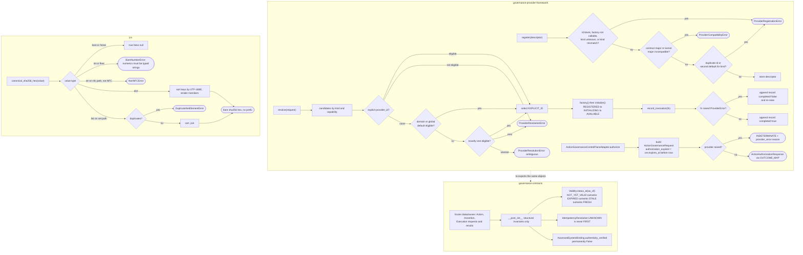

**Capabilities**

| Package | Entry point | Decides or produces | Boundary `[V]` |
|---|---|---|---|
| `governance-contracts` | `api.py` (93 symbols) | Neutral contract shapes; digest-bound `AuditReference`, `EvidenceReference`, labels | "Contracts and structural invariants only. It grants no action permission and mints no authority." |
| `governance-provider-framework` | `ProviderRegistry`, `resolve`, `record_invocation`, `ActionGovernanceControlPlaneAdapter` | Which provider instance serves a request; never silently picks among equals | "Owns no governance authority"; vendor exceptions normalise to `INDETERMINATE` |
| `jcs` | `canonical_bytes`, `canonical_sha256_hex` | RFC 8785 bytes and a bare SHA-256 | "Decides nothing"; alpha; consumed by five packages only |

**Interaction surface.** Outbound: none (all three are leaves except the framework, which re-exports contracts). Inbound: 21 packages import `governance-contracts`; the two providers, `console-api`, `ai-hiring` and `risk-authority-evidence-runtime` import the framework; `agentic-proposer`, the three reasoning-method packages and `workflow-fit-pilot` import `jcs`. Policy Authority, the compiler and the capacity-bounds family each canonicalise with their own `json.dumps` helper, not `jcs` `[V]`.

---

## 4 — M1 Policy authority

`policy-authority`, `uvi-policy-contracts`, `policy-workflow-compiler`, `cloud-scaling-capacity-bounds-policy`. Detective. Supplies the "which policy version applied" field.

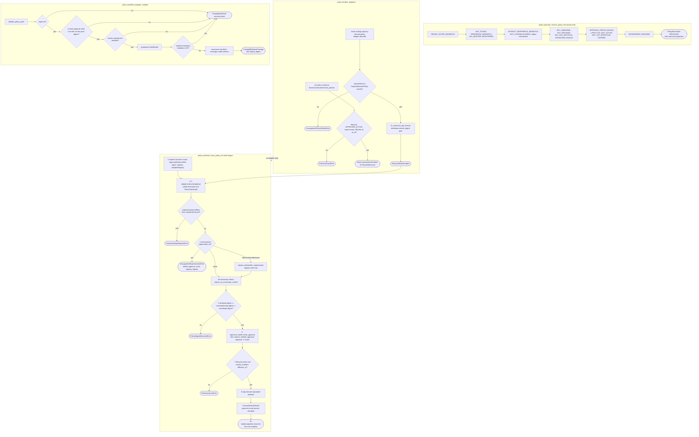

**Capabilities**

| Package | Entry point | Decides or produces | Boundary `[V]` |
|---|---|---|---|
| `policy-authority` | `issue_policy`, `resolve_policy`, `revoke_policy`, `suspend_policy` | Ed25519-signed `IssuedPolicyRecord`; one `PolicyResolutionReason` per failed resolution | "Never a runtime authorizer"; only `DenyAllApprovalVerifier` ships; in-memory registry refused in production |
| `uvi-policy-contracts` | `AssessmentContext.bind_policies`, five policy shapes | Digest-bound references, structural fail-closed binding | "Never verifies a signature, approval, issuance or revocation" |
| `policy-workflow-compiler` | `GovernedWorkflowCompiler.compile`, `verify_compiled_package` | Deterministic `WorkflowIR` plus assurance package, content-addressed | "Tooling, not a governance authority"; not pilot-validated |
| `cloud-scaling-capacity-bounds-policy` | `CapacityBoundsPolicy`, `CapacityBoundsPolicyFamilyAdapter` | A declarative bound artifact and its descriptor | "No composition root calls this today" |

**Interaction surface.** Outbound: `uvi-policy-contracts` imports `governance-contracts`; the compiler lazily imports `decision-authority`, `ai-hiring` and `procurement` for its reference equivalence checks only. Inbound: `policy-authority` is imported by ten packages (M2's five, `agent-value-readiness`, `cloud-scaling-policy-authenticity`, `cloud-scaling-envelope-issuance`, `authoritative-policy-compilation`, `cloud-scaling-capacity-bounds-policy`). The compiler is imported by `agent-workforce-composer` (optional extra), `workflow-converters`, `authoritative-policy-compilation`, `procurement-policy-compilation`. `policy-authority` and `policy-workflow-compiler` share no import edge in either direction `[V]`.

---

## 5 — M2 Agent constitution and strategy permission

Five packages. Detective. Two policy families over M1, each with a fail-closed resolver.

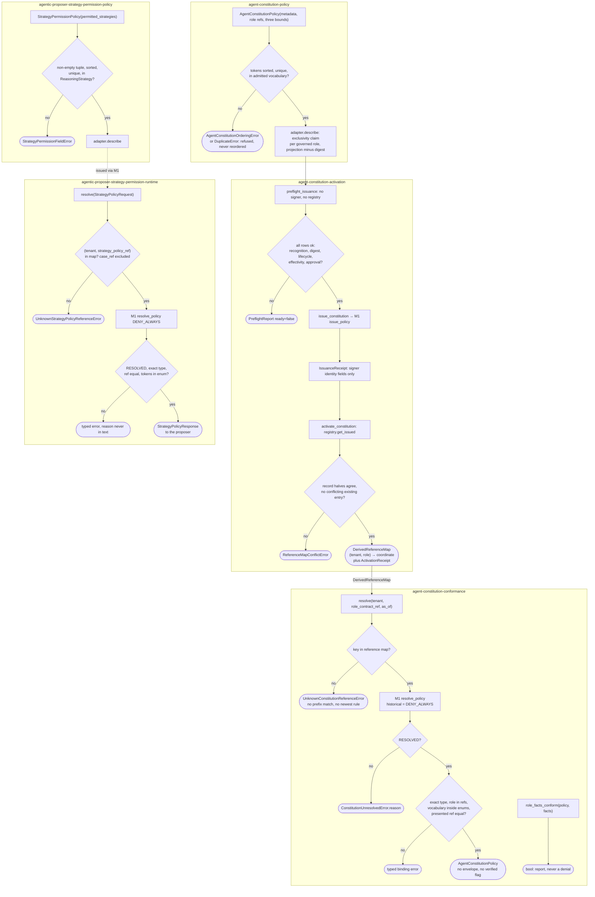

**Capabilities**

| Package | Entry point | Decides or produces | Boundary `[V]` |
|---|---|---|---|
| `agent-constitution-policy` | `AgentConstitutionPolicy`, family adapter, `register_agent_constitution_policy_family` | Digest-bound bound statement; family collision guard | "A bound is a ceiling on declarations; it grants nothing"; no constitution issued yet |
| `agent-constitution-activation` | `build_activation_root`, `preflight_issuance`, `issue_constitution`, `activate_constitution` | Issued record via M1; derived reference map | Receipts unsigned; "no signing key, trust root or approval artifact exists anywhere in this repository" |
| `agent-constitution-conformance` | `PolicyAuthorityConstitutionResolver.resolve`, `role_facts_conform`, `governed_role_overlaps` | The exact resolved policy, or a typed refusal; a conformance bool | "The verifier's False is a report, never a denial"; overlap "is not enforcement" |
| `agentic-proposer-strategy-permission-policy` | `StrategyPermissionPolicy.permits` | Which reasoning strategies a role may declare | "Authorizes no runtime action" |
| `agentic-proposer-strategy-permission-runtime` | `PolicyAuthorityStrategyPolicyResolver.resolve` | `StrategyPolicyResponse` consumed by the proposer | "Performs no caller authorization and claims none" |

**Interaction surface.** Outbound: all five import `policy-authority` (M1); the policy and runtime packages import `agentic-proposer` enums and request types (M3). Inbound: nothing outside M2 imports any of the five `[V]`. The proposer receives the constitution resolution and strategy resolver as injected arguments, so the M2 to M3 runtime hop is by injection at a composition root, not by import.

---

## 6 — M3 Proposal and advisory

Eleven packages. Input. Everything that recommends and nothing that decides. Six of the eleven are leaves with zero cross-package imports.

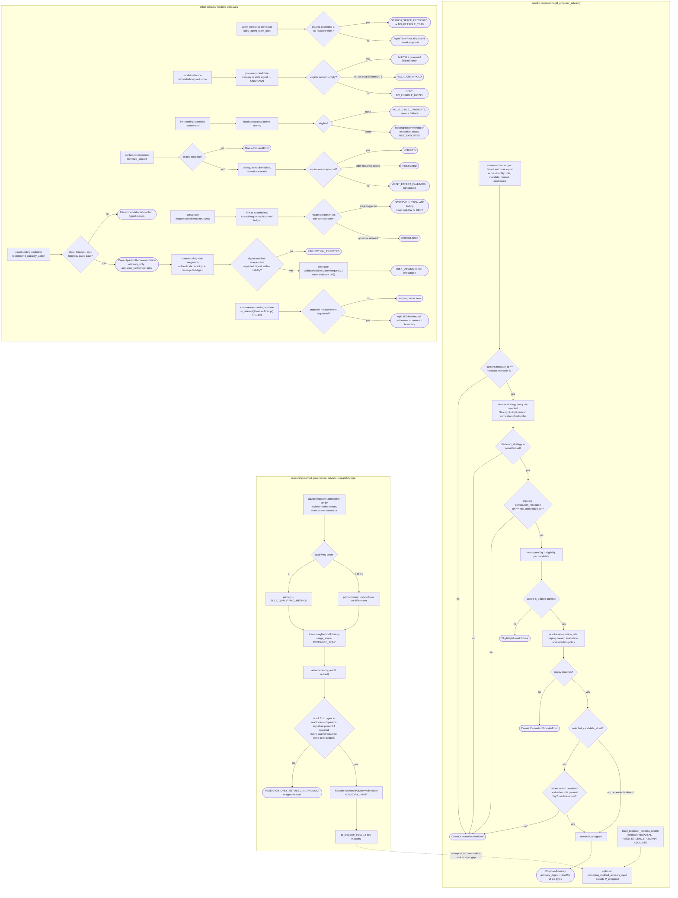

**Capabilities**

| Package | Entry point | Decides or produces | Boundary `[V]` |
|---|---|---|---|
| `agentic-proposer` | `build_proposer_advisory`, `build_proposer_process_record` | Digest-bound `ProposerAdvisory`; never emits CLEAR, HOLD, BLOCK, AUTHORIZED, DENIED | "Proposes. It decides nothing."; no concrete domain evaluator ships |
| `agent-workforce-composer` | `build_agent_team_plan` | Bounded-exact `AgentTeamPlan`, `PermissionBoundProposal` | "Grants nothing, authorizes nothing, schedules nothing, executes nothing" |
| `model-selection` | `ModelAuthority.authorize` | `ModelAuthorizationDecision` ALLOW, DENY, HOLD, ESCALATE over model eligibility | "The gate narrows and never widens"; evidence primarily synthetic |
| `llm-steering-controller` | `recommend` | `RoutingRecommendation` with fallback and escalation advice | `authority_class: ADVISORY`, `provider_invocation_capability: NONE` |
| `context-minimization` | `minimize_context`, `structural_minimize`, token accounting | Extractive reduction with `equivalence_status`; token records | "Creates no authority"; "extractive, never generative" |
| `context-minimization-token-accounting-runtime` | `RuntimeTokenAccountingBridge.on_attempt`, `settle_budget_from_usage` | Per-attempt token record; conservative or measured settlement | "No real provider adapter is implemented here" |
| `storygraph` | `SequenceRiskAnalyzer.ingest`, `to_advisory_evidence` | OBSERVE, ESCALATE, UNAVAILABLE findings as ActionGate evidence | "Advisory / evidentiary only"; enforcement promotion deferred 0 of 10 |
| `cloud-scaling-controller` | `CloudScalingController.recommend`, `recommend_capacity_action` | `ScalingRecommendation`, `CapacityActionRecommendation` or abstention | "Forecasts never feed the live controller and never actuate anything" |
| `cloud-scaling-risk-integration` | `CloudScalingRiskAdapter.evaluate` | `CloudScalingRiskOutcome` ending at a non-executable `SubjectRiskDecision` | "A risk pass is not authorization" |
| `reasoning-method-governance` | contract dataclasses, `derive_implementation_status` | Digest-settled contracts; record v1 fixed UNATTESTED and UNVERIFIED | "Slice 1 issues no envelope"; research-only |
| `reasoning-method-advisor` | `advise`, `admit`, `validate_admission`, `to_proposer_input` | Rule-derived advisory; admission on comparison evidence | "A verified admission authorizes nothing"; no production key exists |

**Interaction surface.** Outbound: `agentic-proposer` imports only `jcs`; `reasoning-method-governance` imports `governance-contracts`, `uvi-policy-contracts`, `jcs`; the advisor imports governance and `jcs`; `cloud-scaling-risk-integration` imports the controller and `risk_authority` (M6); the token-accounting runtime imports `context-minimization` and `agent-runtime` (M9). Inbound: `agentic-proposer` is imported by M2's three proposer-facing packages; `cloud-scaling-controller` by `cloud-scaling-operations`, `cloud-scaling-authorization-contracts`, `cloud-scaling-risk-integration`; the reasoning-method packages by M4 and `reasoning-method-result-attestation`; `context-minimization` by `console-api`. The advisor names the proposer's input model as a string constant; neither imports the other `[V]`.

---

## 7 — M4 Research-only

`readiness-comparison`, `workflow-fit-pilot`. Out of product. Produces the comparison evidence an admission in M3 is granted on.

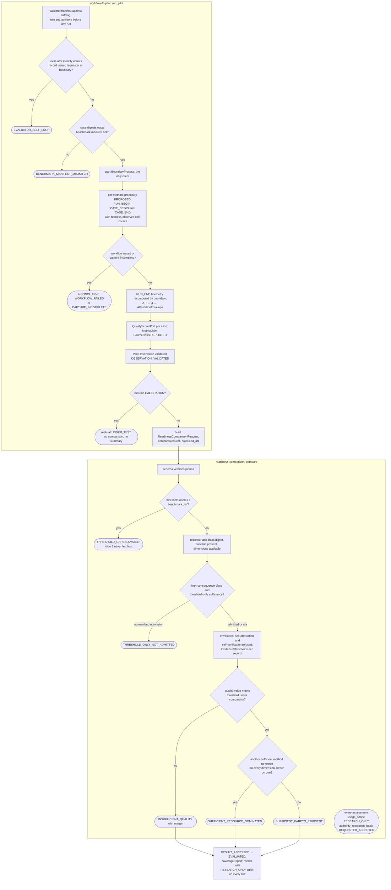

**Capabilities**

| Package | Entry point | Decides or produces | Boundary `[V]` |
|---|---|---|---|
| `readiness-comparison` | `compare(request, produced_at)` | `ReadinessComparisonResult`: per-method fit outcome, refusals, evidence views | "Nothing this package produces is approval-bearing" |
| `workflow-fit-pilot` | `run_pilot`, `run_phase_4c_pilot`, `write_and_verify` | `PilotRunResult` with a five-state research ledger, `approval_status "NONE"` | "No custody adapter is bound"; forbidden renderings: verified, trusted, qualified, success |

**Interaction surface.** Outbound: both import `reasoning-method-governance` (M3), `governance-contracts` and `jcs` (M0); the pilot imports `readiness-comparison` and `reasoning-method-advisor`; the engine imports `uvi-policy-contracts` (M1) for `ComparisonOperator`. Inbound: nothing imports either package `[V]`. The evidence path into the product runs M4 to M3 by value: the advisor's `admit` accepts a `ReadinessComparisonResult` whose `engine_identity` must equal `ugence-readiness-comparison`.

---

## 8 — M5 Evidence and trust

`trusted-evidence-authority`, `risk-authority-evidence-runtime`, `tap`, `agent-assurance-evidence`. Detective. A verified receipt authorizes nothing.

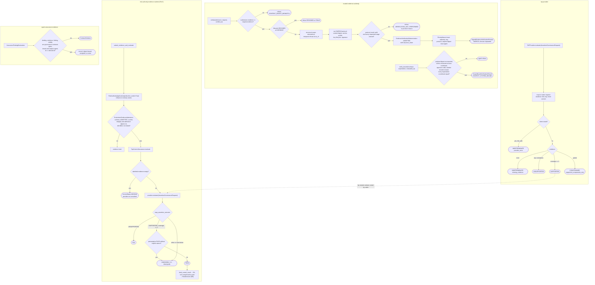

**Capabilities**

| Package | Entry point | Decides or produces | Boundary `[V]` |
|---|---|---|---|
| `trusted-evidence-authority` | `EvidenceVerificationAuthority.verify`, `ReceiptIssuer.issue`, `SignedReceiptVerifier.verify_bound` | Typed determination; Ed25519 receipt; scope-bound re-verification | "A verified receipt authorizes nothing"; no anchor configured means deny |
| `risk-authority-evidence-runtime` | `RiskAuthorityEvidenceRuntime`, `ProductionEvidenceAdmission`, `TapControlAssurance` | Trusted `ControlResult` for the RA gate; caller-supplied PASS is inert | "Adds no second machine authority artifact"; envelope issuance still fails closed in production |
| `tap` | `TAPProvider.evaluate` | `AssertionGovernanceResult` coverage SUPPORTED, UNSUPPORTED, CONSTRAINED, INDETERMINATE | "Never promoted to supported" on failure; not production certified |
| `agent-assurance-evidence` | `AssuranceFindingDeclaration`, selectors, `AssuranceFindingPort` | Declaration record with derived id and supersession rules | "Never runs, probes, scores, admits, evaluates, persists or decides" |

**Interaction surface.** Outbound: the evidence runtime imports `risk_authority` (M6) and the provider framework; TAP imports the framework; effect attestation (M11) and producer attestation (M10) import the authority. Inbound: `trusted-evidence-authority` is imported by `cloud-scaling-producer-attestation`, `risk-authority-effect-attestation`, `reasoning-method-result-attestation`, `benchmark-registry-authority` (canonical helpers); TAP by `ai-hiring`, `console-api`. The evidence runtime declares TAP as a dependency but imports only the neutral `AssertionGovernanceProvider` contract `[V]`.

---

## 9 — M6 Decision and risk authority

`decision-authority`, `risk_authority`, `risk-authority-runtime`. The sole source of machine authority.

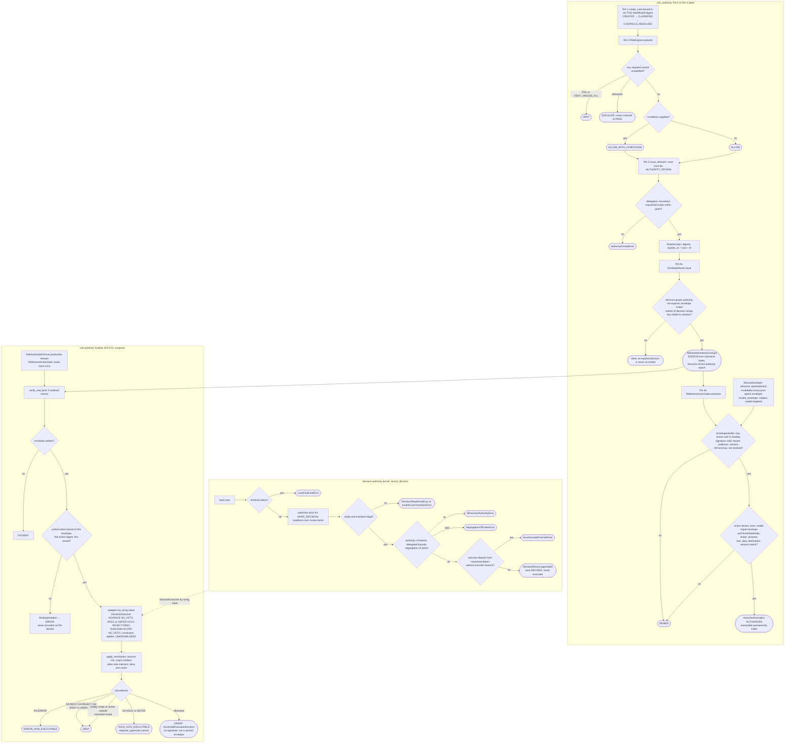

**Capabilities**

| Package | Entry point | Decides or produces | Boundary `[V]` |
|---|---|---|---|
| `decision-authority` | `CaseDecisionService.record_decision`, `DecisionCaseService`, `ActionAuthorizationService`, `ExecutionService`, `ReconciliationService` | `DecisionRecord`, CER, `ActionAuthorizationResponse`, execution and reconciliation records; hashed, append-only | `AuthorityType` has no AI member; "DECIDED is a terminal decision state, not an execution state" |
| `risk_authority` | `RiskAuthorityApplication`, `EnvelopeIssuer`, `EnvelopeVerifier`, `RevocationState`, `EnvelopeIssuanceSeam`, `ActionAdmissionSeam` | Ed25519 `RiskAuthorizationEnvelope`; `ActionAuthorization`; hash-linked governance events | "`issue_envelope` is disabled in production_mode"; reference gate "never production enforcement"; jurisdiction and autonomy constraints not matched (F-D) |
| `risk-authority-runtime` | `RiskAuthorityEnforcer`, `verify_and_bind`, `RiskAuthorityCompositionEngine.compose` | `GovernedExecutionDecision` with `FinalDisposition` GRANT, HOLD_NON_EXECUTABLE, DENY, ERROR_NON_EXECUTABLE | "Production kernel ALLOW is not machine execution authority"; deployment validation pending |

**Interaction surface.** Outbound: `decision-authority` and `risk_authority` are leaves with zero Ugence imports; `risk-authority-runtime` imports only `risk_authority`. It declares `decision-authority` and `actiongate` as dependencies but matches both by enum string value, not by import `[V]`. Inbound: `risk_authority` is imported by twelve packages (all of M10, M11's three RA packages, `risk-authority-evidence-runtime`, `cloud-scaling-risk-integration`, `risk-authority-runtime`); `decision-authority` by `execution-reservation`, `risk-authority-execution-assurance`, `cloud-scaling-bounded-execution`, `ai-hiring`, `procurement`, the compiler; `risk-authority-runtime` by `agent-runtime-governance` and `governed-review`.

---

## 10 — M7 Human authority and approval

Five packages. Detective. Binds an approval to a parked proposal and consumes it exactly once.

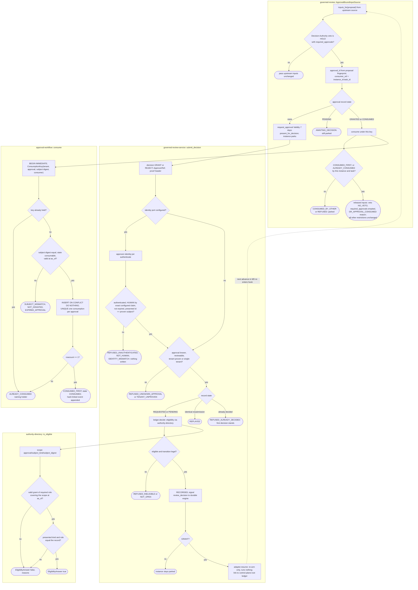

**Capabilities**

| Package | Entry point | Decides or produces | Boundary `[V]` |
|---|---|---|---|
| `approval-workflow` | `SqliteApprovalWorkflowStore.request_approval`, `decide`, `consume` | Forward-only state machine; once-only consumption keyed `approval_key.v1` | "Never approves, authenticates, mints authority, or executes"; signs nothing |
| `governed-review` | `ApprovalBoundInputSource.inputs_for`, `reconstruct` | Released `CompositionInputs`; `ReviewLinkage` with typed `LinkageError`s | "Binds and consumes an approval. Never approves, authenticates, mints authority, signals, resumes or executes" |
| `governed-review-service` | `ReviewService.list_queue`, `submit_decision`, HTTP routes | Typed `DecisionOutcome`; audit linkage entry | "Records a decision a human already made"; `IDENTITY_PROOF PRESENTED_UNPROVEN` without an adapter |
| `approver-identity-jwt` | `JwtApproverIdentityAdapter.authenticate` | `VerifiedClaims` from a locally validated RFC 9068 token | "Validates a proof it did not issue"; only an in-process issuer has ever been run |
| `authority-directory` | `SqliteAuthorityDirectory.put_grant`, `DirectoryApproverEligibility.is_eligible` | Time-bounded role grants; one-hop narrowing delegation; committee report without quorum verdict | "Reports role grants. Never authenticates, never approves, never mints authority" |

**Interaction surface.** Outbound: `governed-review` imports `agent-runtime-governance` (M9), `risk-authority-runtime` (M6), `approval-workflow`, `authority-directory`, `governance-contracts`; the service imports `control-plane-root` (M12), `durable-execution` schema name (M9), `governed-review`, `approval-workflow`; the JWT adapter imports only the service. Inbound: nothing outside M7 imports M7; `approver-identity-jwt` is wired only by `deployment/governed-runtime-worker` `[V]`. `authority-directory` satisfies the approval workflow's eligibility port structurally without importing it.

---

## 11 — M8 Authorization and clearance

`actiongate`, `action-clearance`, `execution-reservation`. Preventive-capable. CLEAR plus ACQUIRED is still not execution.

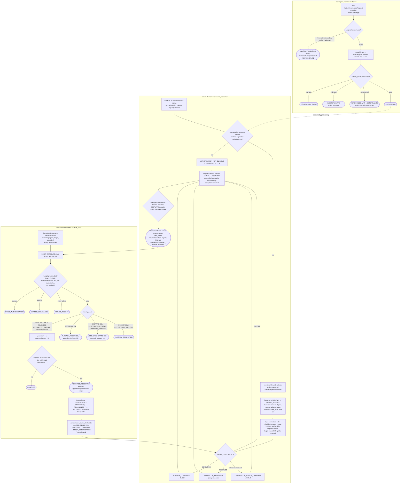

**Capabilities**

| Package | Entry point | Decides or produces | Boundary `[V]` |
|---|---|---|---|
| `actiongate` | `ActionGateProvider.authorize`, `build_actiongate_provider`, `check` | `ActionGovernanceResult` AUTHORIZED, WITH_CONSTRAINTS, DENIED, INDETERMINATE; fingerprint, unsigned | "Owns no dispatch and no execution authority"; `single_use` is not durable replay prevention |
| `action-clearance` | `evaluate_clearance(request, policy)` | `ClearanceResult` CLEAR, HOLD, BLOCK, ESCALATE; receipt body | "Stateless"; "CLEAR is not execution"; stores nothing, reserves nothing |
| `execution-reservation` | `ExecutionReservationPort.reserve_once`, `SqliteExecutionReservationStore`, `build_consumption_signal` | One-time reservation per execution key; hash-linked ledger; consumption signal | `MATURITY REFERENCE_GRADE_SHADOW_ONLY`, `ENFORCEMENT_ENABLED False`; no clock read anywhere |

**Interaction surface.** Outbound: `actiongate` imports the provider framework; `action-clearance` imports nothing and speaks the outcome vocabulary "by value"; `execution-reservation` imports `action-clearance`, `governance-contracts` and `decision-authority` execution types. Inbound: `actiongate` is imported by `ai-hiring` and `console-api`; `action-clearance` by `execution-reservation` and `clearance-export`; `execution-reservation` by `cloud-scaling-credential-broker` and `cloud-scaling-bounded-execution`. **No M9 package imports any M8 package** `[V]`; see section 18.

---

## 12 — M9 Governed runtime

`agent-runtime`, `agent-runtime-governance`, `durable-execution`. Preventive-capable. The hook fires before every consequential provider call.

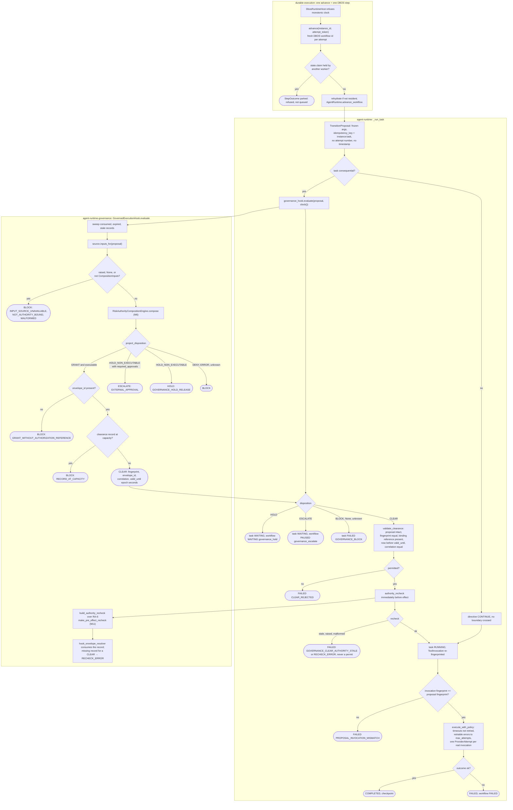

**Capabilities**

| Package | Entry point | Decides or produces | Boundary `[V]` |
|---|---|---|---|
| `agent-runtime` | `create_runtime`, `AgentRuntime.advance_workflow`, `validate_clearance`, `GovernanceHook` protocol | Task states PENDING, READY, RUNNING, WAITING, COMPLETED, FAILED; `ProviderAttempt` telemetry; checkpoints | "With no governance adapter configured, consequential transitions fail closed"; `dependencies = []` |
| `agent-runtime-governance` | `GovernedExecutionHook.evaluate`, `project_disposition`, `build_authority_recheck` | `GovernanceEvaluation` bound to the exact proposal; binding reference is RA's envelope id | "Compose, then project. Mint nothing."; "does not implement a recheck" |
| `durable-execution` | `DbosExecutionAdapter.start`, `advance`, `signal`, `resume`, `recover` | `StepOutcome` with HOLD and ESCALATE collapsed into `awaiting_external`; Postgres `ugence_art` schema | "The engine owns scheduling and recovery. It owns nothing else."; ratified means the ADR matrix passes in CI |

**Interaction surface.** Outbound: `agent-runtime` imports nothing; `agent-runtime-governance` imports `agent-runtime`, `risk-authority-runtime` (M6) and, lazily, `risk-authority-status-runtime` (M11); `durable-execution` lazily imports `agent-runtime` inside `postgres/`. Inbound: `agent-runtime` is imported by `agent-runtime-governance`, `durable-execution`, `context-minimization-token-accounting-runtime`; `agent-runtime-governance` by `governed-review`; `durable-execution` by `governed-review-service`.

---

## 13 — M10 Execution ladder

Eight packages, phases 5A to 5D and 5X. The only module with a real executor. LIVE is off by default and downgrades to dry-run when any posture fact is missing.

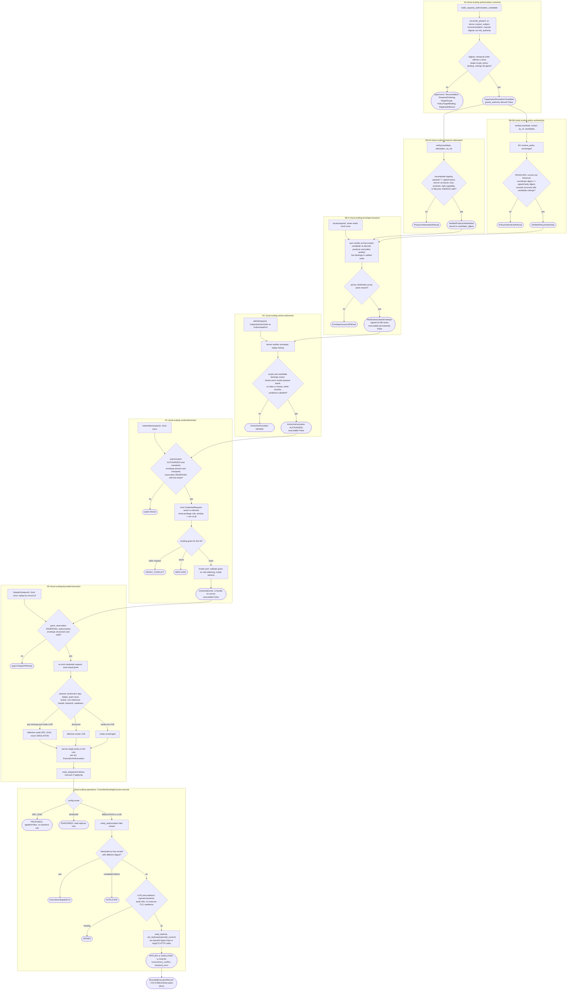

**Capabilities**

| Package | Phase | Decides or produces | Boundary `[V]` |
|---|---|---|---|
| `cloud-scaling-authorization-contracts` | 5A | Digest-bound candidate; `grants_authority` False | "Production LIVE execution remains structurally blocked until 5X" |
| `cloud-scaling-producer-attestation` | 5B-0A | Who produced the recommendation, under a trust anchor | "A verified attestation grants nothing" |
| `cloud-scaling-policy-authenticity` | 5B-0B | Was the named policy version issued by M1 and in force | "A verified policy proof grants nothing"; no TEV anchor lent |
| `cloud-scaling-envelope-issuance` | 5B-4 | One signed envelope via the M6 seam | "An envelope is authority, not execution" |
| `cloud-scaling-action-admission` | 5C | Is this exact capacity action the one the envelope covers | "An authorization is admission, not execution" |
| `cloud-scaling-credential-broker` | 5X | A credential handle; role never widened | "Holds NO secret, NO key, NO clock"; os, socket, cloud SDKs banned structurally |
| `cloud-scaling-bounded-execution` | 5D | One bounded change per grant; effective mode | "Any absence resolves to dry_run and never simulation"; holds no credential |
| `cloud-scaling-operations` | actuation | Receipt PROPOSED, SHADOWED, SIMULATED, APPLIED, DENIED, DUPLICATE, FAILED | Default mode `dry_run`; "not live-cluster validated"; no kubectl subprocess exists |

**Interaction surface.** The ladder is strictly one-way: no package is imported by one below it `[V]`. Outbound edges leave the module to `risk_authority` (M6, six packages), `policy-authority` (M1), `trusted-evidence-authority` (M5), `cloud-scaling-controller` and `risk-integration` (M3), `execution-reservation` (M8), `risk-authority-execution-assurance` (M11), `decision-authority` (M6), `governance-contracts` (M0). Inbound: nothing imports 5D; the rest are imported only within the ladder.

---

## 14 — M11 Post-effect assurance

`risk-authority-status-runtime` (RA-6), `risk-authority-runtime-assurance` (RA-7), `risk-authority-execution-assurance` (RA-8), `risk-authority-effect-attestation`. Detective. Reassesses; never mints authority.

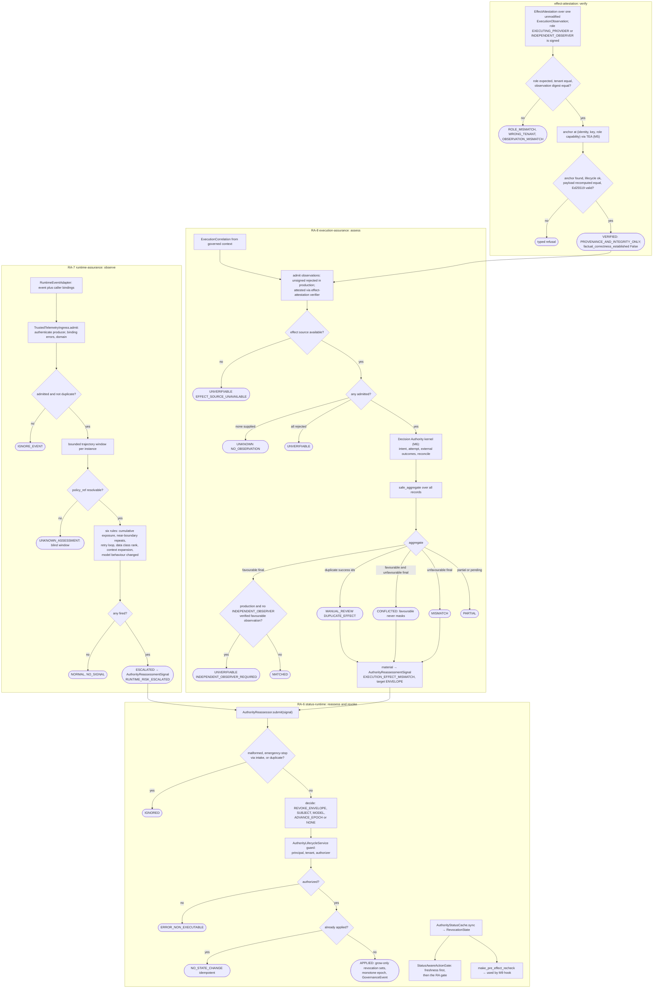

**Capabilities**

| Package | Entry point | Decides or produces | Boundary `[V]` |
|---|---|---|---|
| `risk-authority-status-runtime` | `AuthorityLifecycleService`, `AuthorityReassessor.submit`, `StatusAwareActionGate`, `make_pre_effect_recheck` | Revocations and epochs; `LifecycleWriteResult`; pre-effect recheck | "Not globally-consistent, cryptographically-attested, multi-region, or zero-window revocation"; Postgres store is a skeleton |
| `risk-authority-runtime-assurance` | `RuntimeAssuranceService.observe` | `TrajectoryAssessment` NORMAL, ESCALATED, UNKNOWN; signal to RA-6 | "RA-7 mints nothing, mutates no lifecycle state" |
| `risk-authority-execution-assurance` | `EffectAssuranceService.assess`, `TrustedEffectIngress` | `EffectAssuranceAssessment` MATCHED, MISMATCH, PARTIAL, CONFLICTED, MANUAL_REVIEW, UNKNOWN, UNVERIFIABLE | "No failure resolves to MATCHED"; production wiring blocked: the only admissible resolver refuses every anchor (RI-4) |
| `risk-authority-effect-attestation` | `mint_effect_attestation`, `Ed25519EffectAttestationVerifier.verify` | Signed attestation; verification result binding role and digests | "A verified signature never means the effect is true"; no production signer |

**Interaction surface.** Outbound: all three RA packages import `risk_authority` (M6); RA-8 imports `decision-authority` (M6), `governance-contracts`, and `risk-authority-effect-attestation`; effect attestation imports `trusted-evidence-authority` (M5) and `governance-contracts`. RA-7 declares RA-6 as a dependency but imports only the leaf-owned intake protocol `[V]`. Inbound: RA-6 is imported by `agent-runtime-governance` (M9); RA-8 by `cloud-scaling-bounded-execution` (M10); effect attestation by RA-8 only.

---

## 15 — M12 Ledger and registry

`control-plane-root`, `ai-system-registry`, `data-use-admission`, `vendor-dependency`, `incident-response`, `benchmark-registry`, `benchmark-registry-authority`. Record.

```mermaid
flowchart TD
  subgraph cpr["control-plane-root: AuditLedger.append"]
    L1["LedgerEntry: tenant, kind, tz-aware recorded_at,<br/>recorded_by, JSON payload, correlation_id"] --> L2{"schema_version matches?"}
    L2 -->|no| L3(["SchemaVersionMismatch: refused, not migrated"])
    L2 -->|yes| L4["BEGIN IMMEDIATE; head = last (tenant_seq, record_digest)<br/>or (0, GENESIS)"]
    L4 --> L5["content_digest = domain_digest(entry);<br/>record_digest = domain_digest(tenant, seq, prev, content)"]
    L5 --> L6["INSERT; triggers refuse UPDATE and DELETE"]
    L6 --> L7(["injected reference_factory → AuditReference<br/>entry_ref tenant/seq"])
    L8["verify_chain(tenant)"] --> L9{"every seq contiguous, prev equal,<br/>digest recomputes?"}
    L9 -->|no| L10(["LedgerIntegrityError at position"])
    L9 -->|yes| L11(["True: tamper-evident, not tamper-proof"])
  end
  subgraph regs["ai-system-registry, data-use-admission, vendor-dependency: declare"]
    D1["record over governance-contracts types:<br/>AssessedSystemBinding, label, Validity"] --> D2{"types exact, tenant equal to binding,<br/>vocabulary binding present on current version,<br/>id == derived id?"}
    D2 -->|no| D3(["ContractViolation"])
    D2 -->|yes| D4{"store: production path durable,<br/>schema current, tenant bound?"}
    D4 -->|no| D5(["RegistryProductionModeError,<br/>StorageError, CrossTenantRefused"])
    D4 -->|yes| D6{"duplicate id?"}
    D6 -->|yes| D7(["DuplicateRegistrationError: never edited"])
    D6 -->|no| D8{"supersession admissible:<br/>predecessor exists, same tenant,<br/>same subject, terms changed?"}
    D8 -->|no| D9(["SupersessionError"])
    D8 -->|yes| D10(["INSERT record_json + record_digest;<br/>reads re-verify digest and omit out-of-window"])
  end
  subgraph inc["incident-response"]
    I1["IncidentRecord: id derived from tenant, subject,<br/>evidence AuditReferences, opened_at"] --> I2["containment_requested → REQUESTED"]
    I2 --> I3{"lift: request digest, tenant,<br/>target, incident equal, lifted_at at least requested_at?"}
    I3 -->|no| I4(["ContainmentLiftRefused"])
    I3 -->|yes| I5(["LIFTED; closing never lifts, lifting never closes"])
    I2 --> I6(["signal_for_containment: ReassessmentSignalPayload<br/>returned, never delivered"])
  end
  subgraph br["benchmark-registry and authority"]
    B1["CanonicalBenchmarkDefinitionIdentity"] --> B2{"approval binds this content_digest;<br/>publisher != approving authority?"}
    B2 -->|no| B3(["refused"])
    B2 -->|yes| B4(["structural_refusals_at never empty:<br/>BENCHMARK_RESOLUTION_NOT_PERFORMED"])
    B5["BenchmarkEd25519Verifier.verify_publisher_submission"] --> B6["directory anchor at exact (role, identity, key)"]
    B6 --> B7{"anchor matches asked triple,<br/>profile ED25519_SHA512_V1,<br/>libsodium point valid, signature valid?"}
    B7 -->|no| B8(["REFUSED or INDETERMINATE"])
    B7 -->|yes| B9(["VERIFIED with anchor revision"])
    B10["plan_submission_outcome(snapshot, record)"] --> B11{"slot"}
    B11 -->|empty| B12(["plan SUBMITTED"])
    B11 -->|byte-identical| B13(["IDEMPOTENT_DUPLICATE"])
    B11 -->|same locator, different bytes| B14(["COORDINATE_SLOT_CONFLICT"])
    B11 -->|digest elsewhere| B15(["DIGEST_ALREADY_BOUND"])
  end
```

**Capabilities**

| Package | Entry point | Decides or produces | Boundary `[V]` |
|---|---|---|---|
| `control-plane-root` | `AuditLedger.append`, `read_entries`, `verify_chain` | Per-tenant hash chain in SQLite; `AuditReference` via injected factory | "Appends and returns a reference. Decides nothing"; unsigned chain |
| `ai-system-registry` | `SqliteSystemRegistry.register` | Append-only registrations with derived ids | "Not an operational registry"; "a registration is a record, not a permission" |
| `data-use-admission` | `SqliteDataUseDeclarations.declare` | Declarations of data use by reference | "Not an admission engine"; residency recorded, never evaluated |
| `vendor-dependency` | `SqliteVendorDeclarations.declare` | Vendor dependency declarations linked to a policy by text | "Not a policy resolver"; `policy_ref` is text |
| `incident-response` | `IncidentRecord`, `ContainmentRequest`, `signal_for_containment` | Records and a reassessment payload, never delivered | "Records only"; "nothing here detects anything" |
| `benchmark-registry` | `CanonicalBenchmarkDefinitionIdentity`, lifecycle predicates | Digest-bound identity; refusal tuple never empty | "Contracts only; no registry" |
| `benchmark-registry-authority` | `BenchmarkEd25519Verifier`, `plan_transition`, `plan_submission_outcome` | Verified or refused envelopes; transition plans | "Candidate, not release"; cannot admit, register, revoke or resolve |

**Interaction surface.** Outbound: the four record packages and incident-response import only `governance-contracts`; `control-plane-root` and `benchmark-registry` import nothing; the authority imports `benchmark-registry`. Inbound: `control-plane-root` is imported by `governed-review-service` and `governed-review` (M7) only; nothing imports the registries, incident-response or the benchmark authority `[V]`. The other append-only ledgers in the platform (risk_authority, approval-workflow, execution-reservation, authority-directory, policy-authority SQLite, ai-hiring domain audit) are separate stores that do not write to `control-plane-root`; see section 19.

---

## 16 — M13 Value and readiness, M14 Domain products

```mermaid
flowchart TD
  subgraph avr["agent-value-readiness: assess_readiness"]
    V1["1 resolve policy through PolicyAuthorityReadinessPolicyResolver (M1);<br/>deny-all if omitted"] --> V2{"resolved?"}
    V2 -->|no| V3(["NOT_EVALUATED: no classification"])
    V2 -->|yes| V4{"2 AssessedSystemBinding present<br/>and consistent?"}
    V4 -->|no| V3
    V4 -->|yes| V5["3 gate results attested by verifier;<br/>unverified treated as absent<br/>4 conditions verified<br/>5 indicators admitted against catalogs"]
    V5 --> V6["6 evaluate_readiness once over sanitized case"]
    V6 --> V7{"R0 policy bound, active, effective?"}
    V7 -->|no| V8(["NOT_ASSESSABLE"])
    V7 -->|yes| V9{"R1 mandatory FAIL?"}
    V9 -->|yes| V10(["NOT_READY"])
    V9 -->|no| V11{"R2-R3 structural gap or mandatory INDETERMINATE?"}
    V11 -->|yes| V8
    V11 -->|no| V12{"R4-R5 uncovered concern?"}
    V12 -->|yes| V10
    V12 -->|no| V13(["PILOT_READY or READY_WITH_CONDITIONS;<br/>advisory, unsigned"])
  end
  subgraph gv["governed-value: score"]
    W1["admit_observations: exact MetricObservation (M0),<br/>tenant and unit equal, ids unique"] --> W2{"all admitted?"}
    W2 -->|no| W3(["ObservationBindingError: no result"])
    W2 -->|yes| W4["reported_ngv = benefit - losses - cost;<br/>risk_adjusted = reported - residual expected loss"]
    W4 --> W5{"fatal: no baseline, outcome needs<br/>holdout, discovery insight?"}
    W5 -->|yes| W6(["NOT_SCORABLE: ROI and payback None"])
    W5 -->|no| W7(["SCORABLE or DEGRADED;<br/>fixed EvidenceStatus REPORTED, AuthorityStatus UNVERIFIED"])
  end
  subgraph proc["procurement: ProcurementAPI.run"]
    P1["validate request; six deterministic checks"] --> P2["kernel case; advisory recommendation<br/>DETERMINISTIC_POLICY"]
    P2 --> P3["record_decision with AuthorityType HUMAN_APPROVER"]
    P3 --> P4["request_action; bind CER; submit_for_authorization"]
    P4 --> P5{"BudgetAuthorityAdapter"}
    P5 -->|CER expired| P6(["EXPIRED"])
    P5 -->|restricted or above hard limit| P7(["DENIED"])
    P5 -->|above threshold| P8(["AUTHORIZED_WITH_CONSTRAINTS senior_approval_required"])
    P5 -->|else| P9(["AUTHORIZED"])
    P9 --> P10["explicit dispatch; offline supplier adapter;<br/>reconcile_execution"]
    P10 --> P11(["ProcurementRunResult; compensation_required flag"])
  end
  subgraph hire["ai-hiring: DecisionService.create"]
    H1["advisory Recommendation: actor AI, binding False"] --> H2{"human actor authenticated?"}
    H2 -->|no| H3(["audited denial, security=True"])
    H2 -->|yes| H4{"evaluation REVIEW_BLOCKED?"}
    H4 -->|yes| H3
    H4 -->|no| H5{"disposition diverges without Override?"}
    H5 -->|yes| H3
    H5 -->|no| H6(["Decision actor_type HUMAN;<br/>hash-chained domain audit event"])
    H6 --> H7["HiringActionProposalService: only HUMAN_REVIEWER,<br/>HUMAN_APPROVER, COMMITTEE authority"]
  end
```

**Capabilities**

| Package | Module | Entry point | Decides or produces | Boundary `[V]` |
|---|---|---|---|---|
| `agent-value-readiness` | M13 | `assess_readiness`, `evaluate_readiness` | `ReadinessAssessmentOutcome` EVALUATED or NOT_EVALUATED; classification NOT_READY, NOT_ASSESSABLE, PILOT_READY, READY_WITH_CONDITIONS | "Experimental, internal, advisory, non-financial"; "no allow-all verifier ships" |
| `governed-value` | M13 | `GovernedValueApplication.score` | `GovernedValueResult` with money terms and optional ratios | "Can never claim OBSERVED, ATTRIBUTED, VERIFIED, whatever the caller named an input" |
| `ai-hiring` | M14 | `build_in_memory_platform`, `DecisionService.create` | Binding human `Decision`; advisory `Recommendation`; chained audit | "Ships no AI scoring model"; only `DETERMINISTIC_SIMULATION` supported |
| `procurement` | M14 | `ProcurementAPI.run` | `ProcurementRunResult` through the Decision Authority kernel | "Deterministic and offline"; `pilot_validated False`, `production_certified False` |

**Interaction surface.** M13 outbound: `agent-value-readiness` imports `uvi-policy-contracts` and `policy-authority` (M1) and `governance-contracts`; `governed-value` imports one symbol, `MetricObservation`, from `governance-contracts`. Neither reads any M12 store `[V]`. M14 outbound: `procurement` imports only `decision-authority` (M6); `ai-hiring` imports `decision-authority`, the provider framework, `actiongate` (M8) and `tap` (M5). Inbound: nothing imports M13; M14 is imported lazily by the compiler's reference equivalence checks only.

---

## 17 — Inter-module interaction: verified import edges

Every edge below is a `from ugence_* import` or `from risk_authority import` found in `packages/*/src` `[V]` (recomputed 2026-09-10; test-only references excluded). Direction is importer to imported.

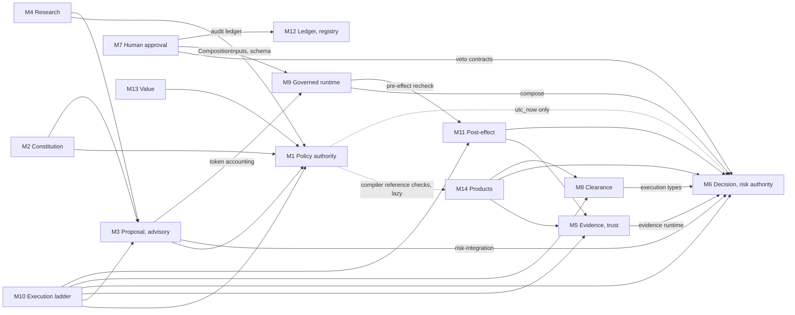

M0 is omitted from the drawing: M1, M3, M4, M5, M7, M8, M10, M11, M12, M13 and M14 each import it. M12 imports only M0.

| Importer | Imported | Carrying packages and symbols `[V]` |
|---|---|---|
| M1 | M0, M6, M14 | `uvi-policy-contracts` → contracts; compiler → `decision-authority.utc_now`, `ai-hiring` and `procurement` reference modules (lazy, optional extras) |
| M2 | M1, M3 | all five → `policy-authority.api`; policy and runtime → `agentic-proposer` `ReasoningStrategy`, `CandidateDisposition`, `ReviewAction`, `StrategyPolicyRequest`, `StrategyPolicyResponse` |
| M3 | M0, M1, M6, M9 | `jcs.canonical_sha256_hex`; `reasoning-method-governance` → `GovernedThreshold`; `cloud-scaling-risk-integration` → `risk_authority.integrations.SubjectRiskDecision`, `validate_subject_binding`; token accounting → `agent-runtime.ProviderAttempt`, `BudgetCoordinator` |
| M4 | M0, M1, M3 | `readiness-comparison` → `ComparisonOperator`; `workflow-fit-pilot` → `reasoning-method-governance`, `reasoning-method-advisor` |
| M5 | M0, M6 | `risk-authority-evidence-runtime` → `RiskAuthorityApplication`, `ControlAssurancePort`, `EvidenceAdmissionPort`, `bind_control_result` |
| M7 | M0, M6, M9, M12 | `governed-review` → `risk-authority-runtime.GovernanceVetoResult`, `VetoDisposition`; `agent-runtime-governance.CompositionInputs`; service → `control-plane-root.AuditLedger`, `LedgerEntry`; `durable-execution.SCHEMA_NAME` |
| M8 | M0, M6 | `execution-reservation` → `decision-authority.ExecutionIntent`, `ExecutionAttempt`, `ExecutionRecord`, `ReconciliationResult` |
| M9 | M6, M11 | `agent-runtime-governance` → `RiskAuthorityCompositionEngine`, `FinalDisposition`; `risk-authority-status-runtime.make_pre_effect_recheck`, `PreEffectContext` |
| M10 | M0, M1, M3, M5, M6, M8, M11 | see section 13; six packages import `risk_authority`; 5D imports `execution-reservation`, `risk-authority-execution-assurance.EffectObservation` |
| M11 | M0, M5, M6 | RA-6, RA-7, RA-8 → `risk_authority`; RA-8 → `decision-authority` kernel services; effect attestation → `trusted-evidence-authority` anchors |
| M12 | M0 | `AuditReference`, `AssessedSystemBinding`, labels, `Validity` |
| M13 | M0, M1 | `agent-value-readiness` → `PolicyResolution`, `ReadinessPolicy`; `governed-value` → `MetricObservation` |
| M14 | M0, M5, M6, M8 | `ai-hiring` → `TAPProvider`, `ActionGateProvider`, kernel; `procurement` → kernel contracts |

Six packages exist under `packages/` that the 66-package map does not assign: `console-api`, `clearance-export`, `authoritative-policy-compilation`, `procurement-policy-compilation`, `reasoning-method-result-attestation`, `workflow-converters` `[V]`. They are excluded from the edges above.

## 18 — The designed flow against the code

The high-level diagram draws nine hops. This is what carries each one.

| Hop on the module map | Mechanism in code | Status |
|---|---|---|
| M3 proposal → M9 hook | No import. The runtime receives a `WorkflowDefinition`; nothing in M9 reads a `ProposerAdvisory`. The only M3 to M9 edge is token accounting, which flows the other way (runtime attempts into accounting). | `[G]` composition-root wiring, none in repo |
| M2 constitution → runtime | No import into M9. The proposer takes `constitution_resolution` and a `StrategyPolicyResolver` as injected arguments; M2 imports M3's enums. | `[G]` injection at a composition root |
| M1 signed policy → M6 authority | No import from M6 to M1. Risk Authority binds a `WorkflowIR` digest, not an `IssuedPolicyRecord`. M1 reaches an envelope only through M10's policy-authenticity binding for capacity actions. | `[G]` for the general path; `[V]` for cloud scaling |
| M5 trusted evidence → M6 | `risk-authority-evidence-runtime` wraps `RiskAuthorityApplication`; TAP reaches it by the neutral provider contract. | `[V]` |
| M7 approval → M6 | `governed-review` rewrites the Decision Authority veto result inside `CompositionInputs` after consuming the approval. | `[V]` |
| M6 envelope → M8 clearance | For the agent-runtime path the "clearance" is M6's composition engine projected by M9's hook onto CLEAR, HOLD, BLOCK, ESCALATE. `action-clearance` and `execution-reservation` are imported only by M10 and `clearance-export`. Two clearance vocabularies coexist by string value. | `[V]` for M10; `[G]` for M9 |
| M8 CLEAR + ACQUIRED → M10 | 5X and 5D import `execution-reservation` and require a `RESERVED` reservation with a live lease. | `[V]` |
| M10 effect → M11 | 5D imports RA-8's `EffectObservation` and returns one per dispatch. RA-8's production `MATCHED` path is blocked by the deny-all anchor resolver. | `[V]` structure; `[G]` production |
| M11 reassess → M6 | RA-7 and RA-8 emit `AuthorityReassessmentSignal`; RA-6 decides and its sole writer revokes or advances the epoch; M9's recheck reads the result. | `[V]` |
| everything → M12 ledger | Only `governed-review-service` writes to `control-plane-root`. Risk Authority, approval-workflow, execution-reservation, authority-directory and policy-authority each keep their own hash-linked SQLite `ledger_events` table, and `ai-hiring` chains its domain audit events by `previous_event_hash`. | `[G]` one chain per tenant does not exist |
| M12 receipts → M13 | Neither M13 package reads any M12 store. `governed-value` admits `MetricObservation` receipts from M0; readiness resolves policy from M1. | `[G]` |

## 19 — Findings surfaced while drawing

1. **Two clearance paths** `[V]`. Agent Runtime clears through `risk-authority-runtime` composition plus RA-6 recheck; the cloud-scaling ladder clears through `action-clearance` receipts plus `execution-reservation`. Neither path imports the other's vocabulary; both use CLEAR, HOLD, BLOCK, ESCALATE by string.
2. **Seven independent append-only ledgers** `[V]`: `control-plane-root` plus the six listed in section 18. The module map's "one append-only audit chain per tenant" describes `control-plane-root` alone, which has one writer. `decision-authority` reserves `previous_event_hash` but does not chain yet.
3. **Declared but unimported dependencies** `[V]`: `risk-authority-runtime` declares `decision-authority` and `actiongate`; `risk-authority-evidence-runtime` declares `tap`; RA-7 declares RA-6. Each couples by enum value or protocol, so the wheel graph overstates the import graph.
4. **Stale README statements** `[V]`: `risk-authority-effect-attestation` says "not wired into RA-8" while RA-8 imports and calls it (no production wiring, RI-4); `agent-workforce-composer` says ranking and composition "remain unimplemented" while `ranking.py`, `composition.py`, `plan.py` ship; `agent-runtime-governance` module docstring says ESCALATE has no sink while its README corrects this on 2026-09-08.
5. **The reasoning-method admission bridge is unwired** `[V]`. `to_proposer_input` exists in the advisor and `ReasoningMethodAdvisoryInput` exists in the proposer; no source file under `packages/*/src` connects them.
6. **No kubectl adapter exists** `[V]`. Mutation reaches Kubernetes only through an injected `AppsV1Api` client and ArgoCD through an injected HTTP caller.
7. **`jcs` is not the platform canonicalizer** `[V]`. Five packages use it; Policy Authority, the compiler, the capacity-bounds family and every SQLite ledger use their own sorted-key JSON helper.

## 20 — Next step

Findings 1 and 2 are the two places where the drawn flow and the code disagree about authority and record. Each needs an owner ruling before any composition root is written. Ruling 1: which clearance path is canonical for a hosted-boundary provider, and does the other retire or federate. Ruling 2: whether `control-plane-root` becomes the sink for the six other ledgers by a linkage entry, as `governed-review-service` already does, or whether "one chain per tenant" is withdrawn from the module map.

> Read `docs/UGENCE_MODULE_FLOWCHARTS.md` sections 18 and 19. For finding 1, cite the exact symbols where the two clearance vocabularies meet (`agent-runtime-governance/dispositions.py`, `action-clearance/models/enums.py`, `execution-reservation/receipts.py`) and state whether a hosted-boundary provider per `docs/UGENCE_PREVENTIVE_DETECTIVE_MODULE_MAP.md` §8 would clear through composition, through receipts, or both. For finding 2, list each ledger's table, chain digest function and writer with `file:line`, and state whether a linkage entry into `control-plane-root` of the kind `governed-review-service/linkage.py` appends is sufficient for the receipt's `audit_ref` field. End with two owner rulings, each one sentence. Max 700 words. Documentation only; change no code.
