# Ugence — module flowcharts, walkthrough edition

**Status:** documentation only, 2026-09-10. Generated from `docs/UGENCE_MODULE_FLOWCHARTS.md`: the same flows, one package per section, each with a plain-language description and a numbered walk-through. Long flows are split into parts; a dashed node marks where a part continues. The PDF `docs/UGENCE_MODULE_FLOWCHARTS.pdf` is rendered from this file.

## M0 Substrate

The shared foundation. Three small packages that every other module builds on: the neutral contract shapes everyone speaks, the mechanism that finds and calls a provider, and the canonical byte encoding used to fingerprint things. None of them decides anything, and none is sold on its own.

### `governance-provider-framework` — How a provider is registered, chosen and called

A provider is a pluggable engine such as ActionGate or TAP. This flow registers one, picks exactly one for a request, starts it, and records every call. If more than one provider could serve a request, the framework refuses rather than guessing.

1. Register: the descriptor is checked for a blank id, a bad factory, an unknown kind, an incompatible contract or kernel version, a duplicate id, or a second default for the same kind. Any of these refuses.
2. Resolve: candidates are gathered by kind and capability. An explicit provider id wins if eligible; otherwise a domain default, then a global default, then a single eligible candidate.
3. Zero eligible candidates or several equally eligible ones both end in a resolution error.
4. The chosen provider is built by its factory and initialized: REGISTERED, INITIALIZING, AVAILABLE.
5. Every call goes through record_invocation, which appends a record whether the call succeeded or raised.
6. The control-plane adapter converts a provider failure into INDETERMINATE, so a vendor exception can never look like an approval.

*Part 1 of 4*

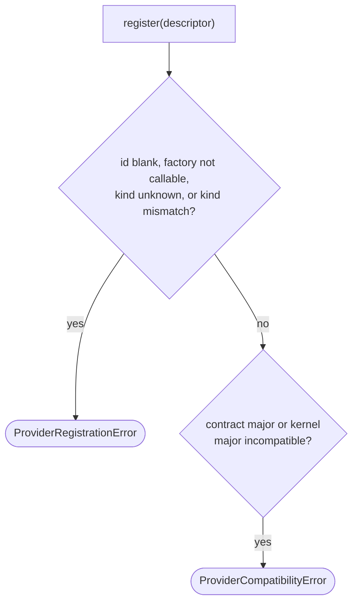
```mermaid
flowchart TD
R1["register(descriptor)"] --> R2{"id blank, factory not callable,<br/>kind unknown, or kind mismatch?"}
R2 -->|yes| RX(["ProviderRegistrationError"])
R2 -->|no| R3{"contract major or kernel<br/>major incompatible?"}
R3 -->|yes| RY(["ProviderCompatibilityError"])
```

*Part 2 of 4*

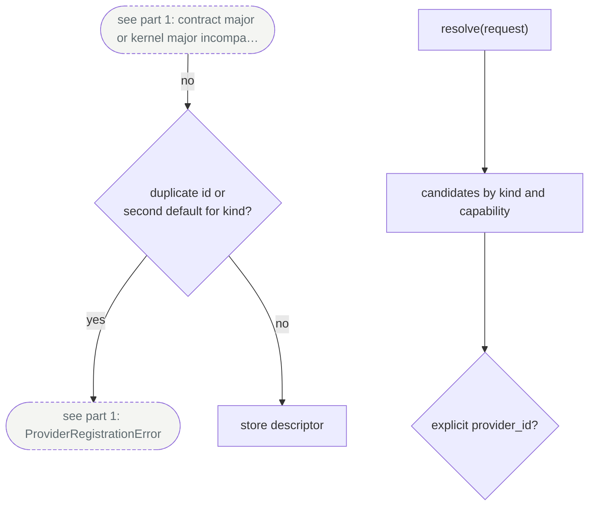
```mermaid
flowchart TD
R3(["see part 1: contract major or kernel major incompa…"])
RX(["see part 1: ProviderRegistrationError"])
R3 -->|no| R4{"duplicate id or<br/>second default for kind?"}
R4 -->|yes| RX
R4 -->|no| R5["store descriptor"]
S1["resolve(request)"] --> S2["candidates by kind and capability"]
S2 --> S3{"explicit provider_id?"}
style R3 stroke-dasharray: 4 3,fill:#F4F5F2,color:#5F6B70
style RX stroke-dasharray: 4 3,fill:#F4F5F2,color:#5F6B70
```

*Part 3 of 4*

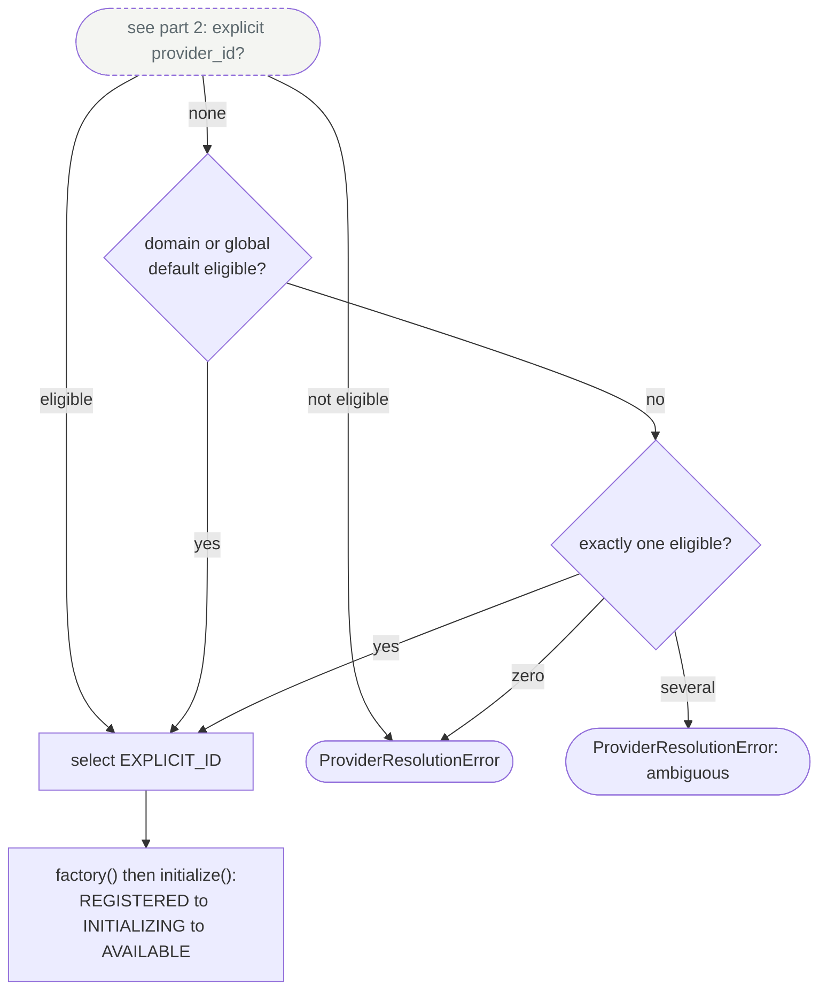
```mermaid
flowchart TD
S3(["see part 2: explicit provider_id?"])
S3 -->|eligible| S9["select EXPLICIT_ID"]
S3 -->|not eligible| SX(["ProviderResolutionError"])
S3 -->|none| S4{"domain or global<br/>default eligible?"}
S4 -->|yes| S9
S4 -->|no| S5{"exactly one eligible?"}
S5 -->|yes| S9
S5 -->|zero| SX
S5 -->|several| SY(["ProviderResolutionError: ambiguous"])
S9 --> S10["factory() then initialize():<br/>REGISTERED to INITIALIZING to AVAILABLE"]
style S3 stroke-dasharray: 4 3,fill:#F4F5F2,color:#5F6B70
```

*Part 4 of 4*

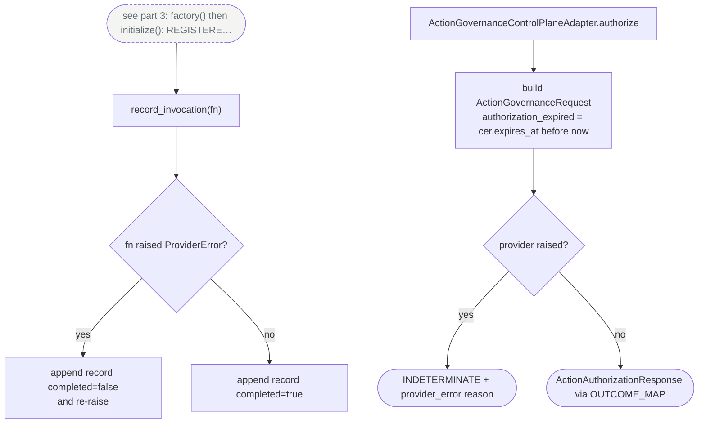
```mermaid
flowchart TD
S10(["see part 3: factory() then initialize(): REGISTERE…"])
S10 --> I1["record_invocation(fn)"]
I1 --> I2{"fn raised ProviderError?"}
I2 -->|yes| I3["append record completed=false<br/>and re-raise"]
I2 -->|no| I4["append record completed=true"]
A1["ActionGovernanceControlPlaneAdapter.authorize"] --> A2["build ActionGovernanceRequest<br/>authorization_expired = cer.expires_at before now"]
A2 --> A3{"provider raised?"}
A3 -->|yes| A4(["INDETERMINATE + provider_error reason"])
A3 -->|no| A5(["ActionAuthorizationResponse via OUTCOME_MAP"])
style S10 stroke-dasharray: 4 3,fill:#F4F5F2,color:#5F6B70
```

### `jcs` — How a value is turned into canonical bytes and a hash

Two people hashing the same data must get the same hash. This flow renders a JSON value in one fixed way (RFC 8785) and returns a plain SHA-256. Numbers must arrive as typed strings; anything ambiguous is refused rather than normalized.

1. Booleans and null render as true, false, null.
2. A bare int or float is refused: numerics must be typed strings.
3. A string on a declared NFC path that is not NFC-normalized is refused.
4. Dictionary keys are sorted by their UTF-16 encoding; lists on declared set paths are sorted and must not contain duplicates.
5. The result is a lowercase hex SHA-256 with no prefix.

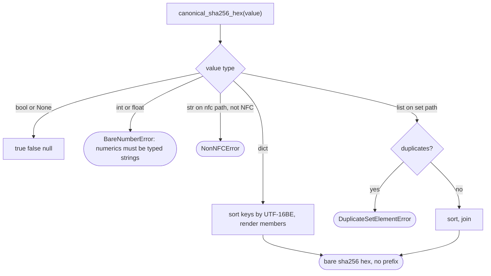
```mermaid
flowchart TD
J1["canonical_sha256_hex(value)"] --> J2{"value type"}
J2 -->|bool or None| J3["true false null"]
J2 -->|int or float| JX(["BareNumberError: numerics must be typed strings"])
J2 -->|str on nfc path, not NFC| JY(["NonNFCError"])
J2 -->|dict| J4["sort keys by UTF-16BE, render members"]
J2 -->|list on set path| J5{"duplicates?"}
J5 -->|yes| JZ(["DuplicateSetElementError"])
J5 -->|no| J6["sort, join"]
J4 --> J7(["bare sha256 hex, no prefix"])
J6 --> J7
```

### `governance-contracts` — What the shared contract shapes guarantee

These are frozen data shapes, not a service. Constructing one runs structural checks only: it proves the shape is well formed, never that anything is true or permitted.

1. Action, assertion and execution requests and results are immutable dataclasses.
2. Validity answers exactly one status at an instant, in the order NOT_YET_VALID, EXPIRED, STALE, FRESH.
3. An idempotency resolution of UNKNOWN is never treated as the first attempt: a consumer that cannot tell fails closed.
4. A system binding reports its authenticity as permanently unverified, because no verifier for it exists yet.

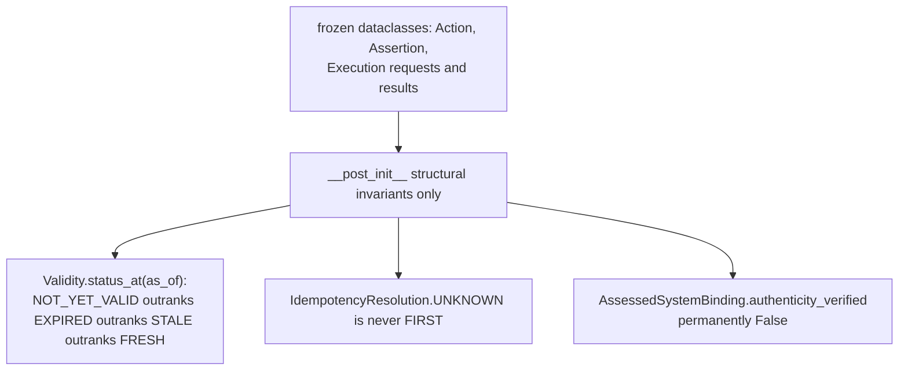
```mermaid
flowchart TD
C1["frozen dataclasses: Action, Assertion,<br/>Execution requests and results"] --> C2["__post_init__ structural invariants only"]
C2 --> C3["Validity.status_at(as_of):<br/>NOT_YET_VALID outranks EXPIRED outranks STALE outranks FRESH"]
C2 --> C4["IdempotencyResolution.UNKNOWN is never FIRST"]
C2 --> C5["AssessedSystemBinding.authenticity_verified<br/>permanently False"]
```

## M1 Policy authority

Where policies are issued, signed, looked up and revoked. Every receipt in the platform can point at exactly which signed policy version applied. The authority is consulted before an action runs, never while it runs.

### `policy-authority` — How a policy is issued and signed (ten fixed stages)

Turning a policy artifact into a signed, registered record. The stages always run in this order, and the first failing stage stops everything. The only write happens at the very end.

1. 1. The request is checked for the exact approval reference type, a signer, a registry and an adapter registry.
2. 2-3. The family adapter describes the artifact and derives its coordinate; a tenant mismatch refuses.
3. 4. An unstructured supersession reference is refused before anything else runs; a structured predecessor is checked by reading the registry.
4. 4b. Exclusivity claims must not conflict with existing holders.
5. 5. The declared digest, the computed body digest and the coordinate digest must all agree.
6. 6. The approval is verified, and the approver must not be the issuer.
7. 7. Lifecycle must be active and the issue time inside the effective window.
8. 8-10. The payload is signed, the record is built, and the registry appends it: the one mutation.

*Part 1 of 5*

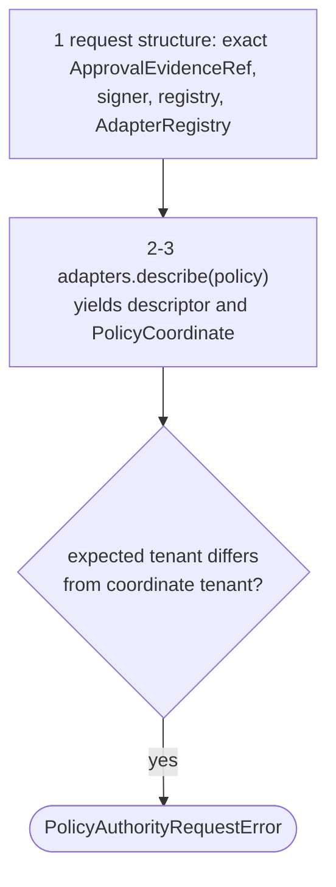
```mermaid
flowchart TD
P1["1 request structure: exact ApprovalEvidenceRef,<br/>signer, registry, AdapterRegistry"] --> P2["2-3 adapters.describe(policy)<br/>yields descriptor and PolicyCoordinate"]
P2 --> P3{"expected tenant differs<br/>from coordinate tenant?"}
P3 -->|yes| PX(["PolicyAuthorityRequestError"])
```

*Part 2 of 5*

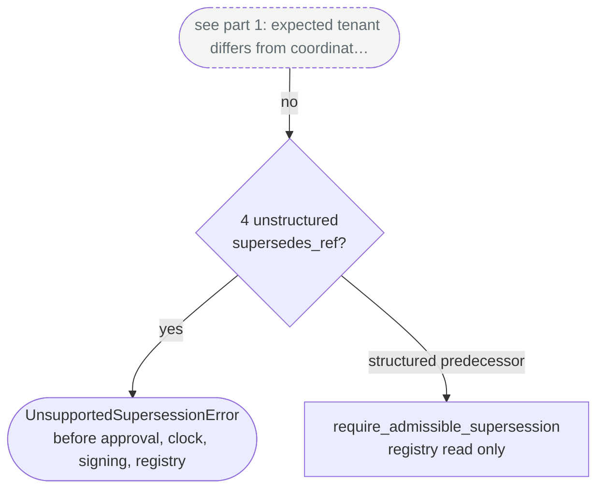
```mermaid
flowchart TD
P3(["see part 1: expected tenant differs from coordinat…"])
P3 -->|no| P4{"4 unstructured<br/>supersedes_ref?"}
P4 -->|yes| PY(["UnsupportedSupersessionError<br/>before approval, clock, signing, registry"])
P4 -->|structured predecessor| P5["require_admissible_supersession<br/>registry read only"]
style P3 stroke-dasharray: 4 3,fill:#F4F5F2,color:#5F6B70
```

*Part 3 of 5*

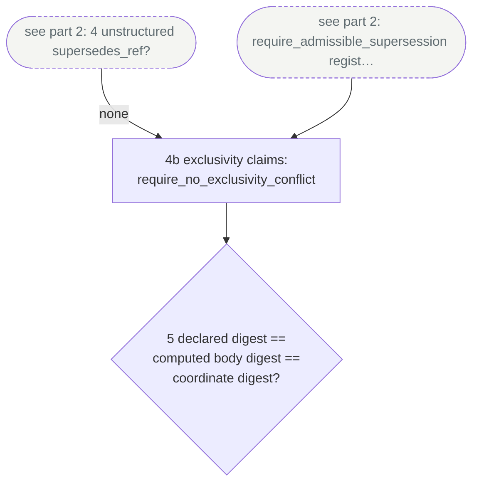
```mermaid
flowchart TD
P4(["see part 2: 4 unstructured supersedes_ref?"])
P5(["see part 2: require_admissible_supersession regist…"])
P4 -->|none| P6
P5 --> P6["4b exclusivity claims:<br/>require_no_exclusivity_conflict"]
P6 --> P7{"5 declared digest ==<br/>computed body digest ==<br/>coordinate digest?"}
style P4 stroke-dasharray: 4 3,fill:#F4F5F2,color:#5F6B70
style P5 stroke-dasharray: 4 3,fill:#F4F5F2,color:#5F6B70
```

*Part 4 of 5*

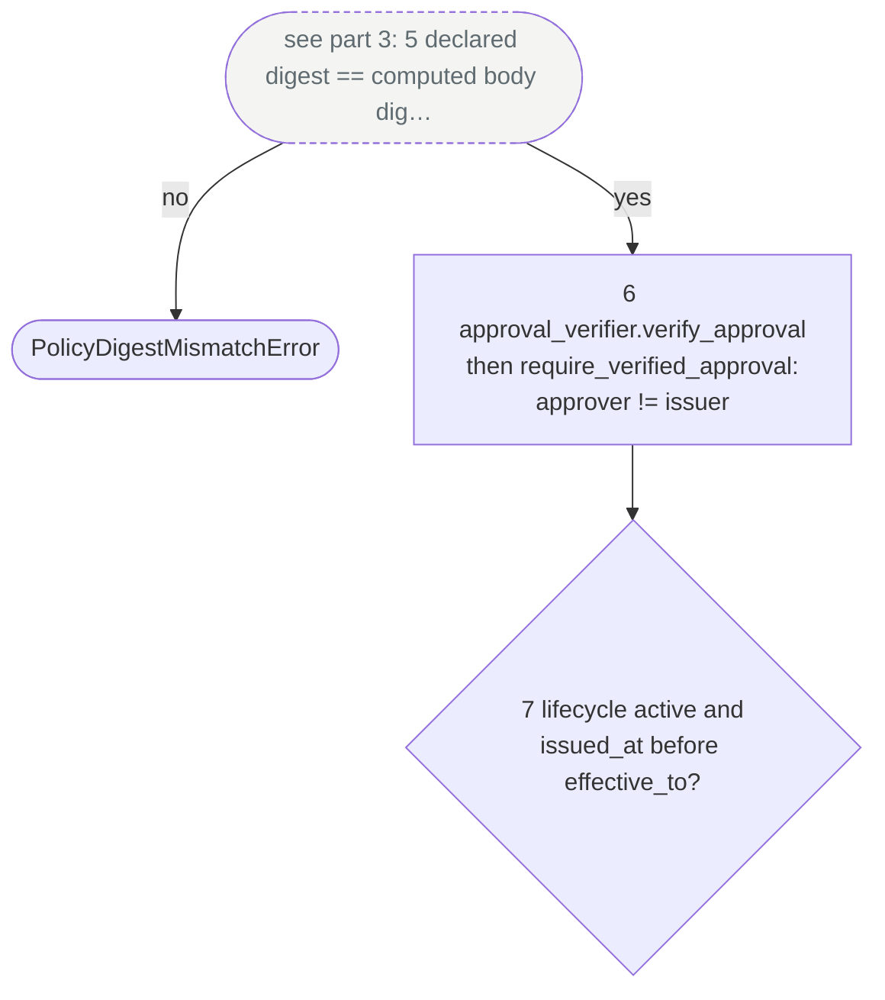
```mermaid
flowchart TD
P7(["see part 3: 5 declared digest == computed body dig…"])
P7 -->|no| PZ(["PolicyDigestMismatchError"])
P7 -->|yes| P8["6 approval_verifier.verify_approval<br/>then require_verified_approval:<br/>approver != issuer"]
P8 --> P9{"7 lifecycle active and<br/>issued_at before effective_to?"}
style P7 stroke-dasharray: 4 3,fill:#F4F5F2,color:#5F6B70
```

*Part 5 of 5*

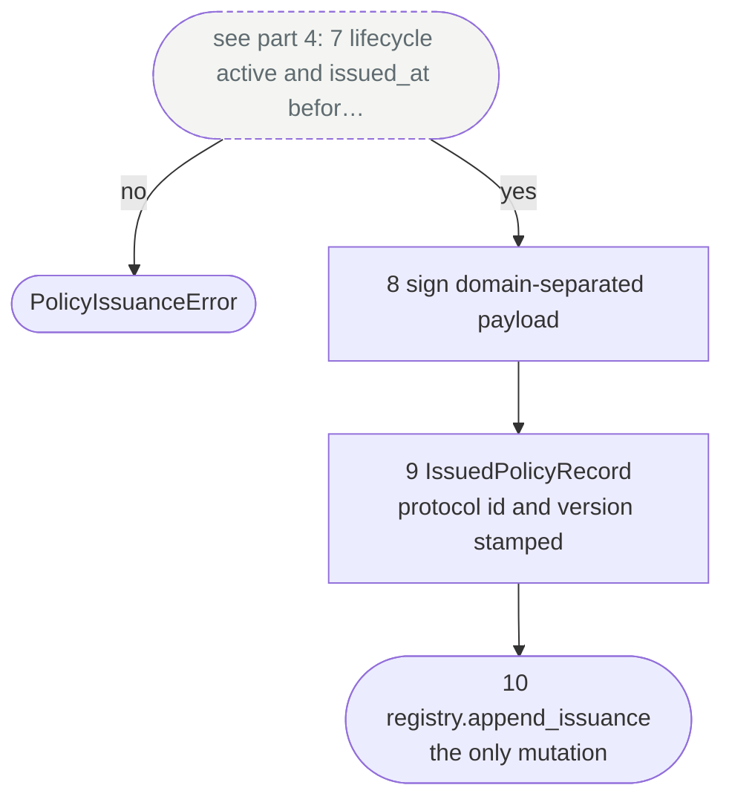
```mermaid
flowchart TD
P9(["see part 4: 7 lifecycle active and issued_at befor…"])
P9 -->|no| PW(["PolicyIssuanceError"])
P9 -->|yes| P10["8 sign domain-separated payload"]
P10 --> P11["9 IssuedPolicyRecord<br/>protocol id and version stamped"]
P11 --> P12(["10 registry.append_issuance<br/>the only mutation"])
style P9 stroke-dasharray: 4 3,fill:#F4F5F2,color:#5F6B70
```

### `policy-authority` — How a policy is resolved, and the order it can fail in

Looking a policy up for a given tenant at a given instant. The checks run in a fixed order and stop at the first failure, so a caller always gets exactly one reason.

1. Tenant scope is checked first, then existence, reference and adapter registration.
2. The artifact must canonicalize and its digests must match.
3. The signing key must be known, not revoked, entitled to issue, and the signature valid.
4. Approval proof, active lifecycle and the effective window are checked.
5. Finally supersession and revocation. Only then is the policy RESOLVED, with its canonical projection.

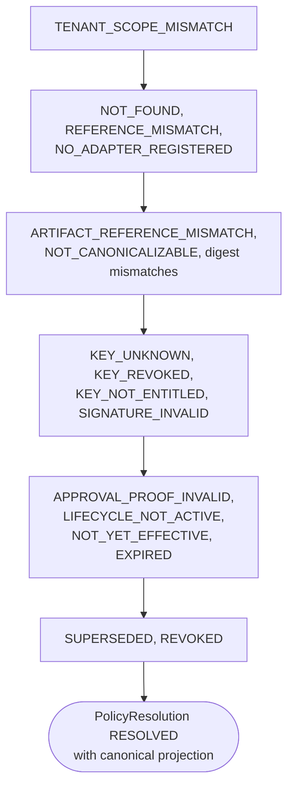
```mermaid
flowchart TD
Q1["TENANT_SCOPE_MISMATCH"] --> Q2["NOT_FOUND, REFERENCE_MISMATCH,<br/>NO_ADAPTER_REGISTERED"]
Q2 --> Q3["ARTIFACT_REFERENCE_MISMATCH,<br/>NOT_CANONICALIZABLE, digest mismatches"]
Q3 --> Q4["KEY_UNKNOWN, KEY_REVOKED,<br/>KEY_NOT_ENTITLED, SIGNATURE_INVALID"]
Q4 --> Q5["APPROVAL_PROOF_INVALID,<br/>LIFECYCLE_NOT_ACTIVE,<br/>NOT_YET_EFFECTIVE, EXPIRED"]
Q5 --> Q6["SUPERSEDED, REVOKED"]
Q6 --> Q7(["PolicyResolution RESOLVED<br/>with canonical projection"])
```

### `uvi-policy-contracts` — How five policy references are bound into one assessment context

An assessment must name which policies it ran under. This binder checks that each policy is active, belongs to the same tenant and is in force at the stated instant, then keeps only the references, not the bodies.

1. Each artifact must be of the expected policy type.
2. Lifecycle must be APPROVED_ACTIVE; a tenant-scoped policy must match the tenant; the effective window must contain the instant.
3. Any failure raises a contract error; success returns a frozen AssessmentContext of references.

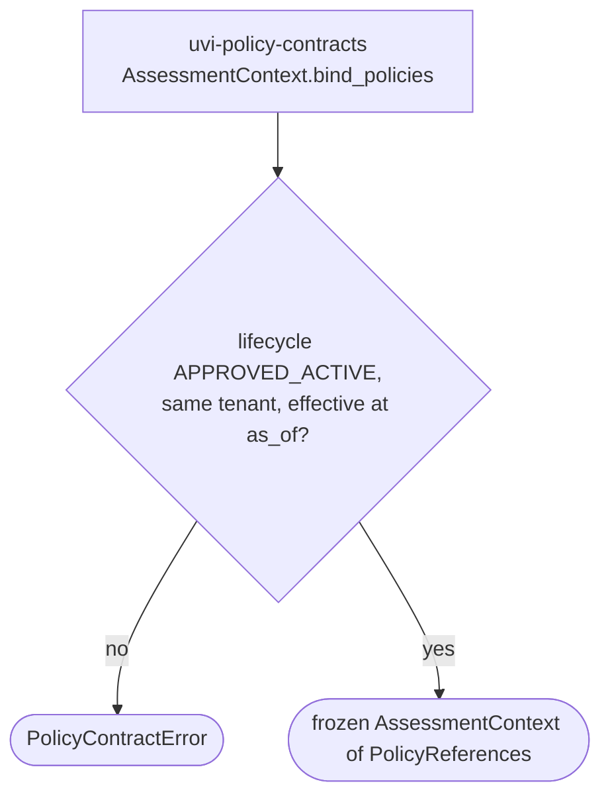
```mermaid
flowchart TD
F1["uvi-policy-contracts<br/>AssessmentContext.bind_policies"] --> F2{"lifecycle APPROVED_ACTIVE,<br/>same tenant, effective at as_of?"}
F2 -->|no| FX(["PolicyContractError"])
F2 -->|yes| F3(["frozen AssessmentContext of PolicyReferences"])
```

### `cloud-scaling-capacity-bounds-policy` — How a capacity-bounds policy is described to the authority

A declarative statement of how much capacity change is permitted. The adapter only describes the artifact; issuing and signing happen in the authority. No runtime path uses this family yet.

1. The artifact must be exactly a CapacityBoundsPolicy; a subclass is deliberately not recognized.
2. The artifact is canonicalized and its own content-digest field is removed from the projection.
3. The descriptor carries the coordinate, the declared digest and the projection back to the authority.

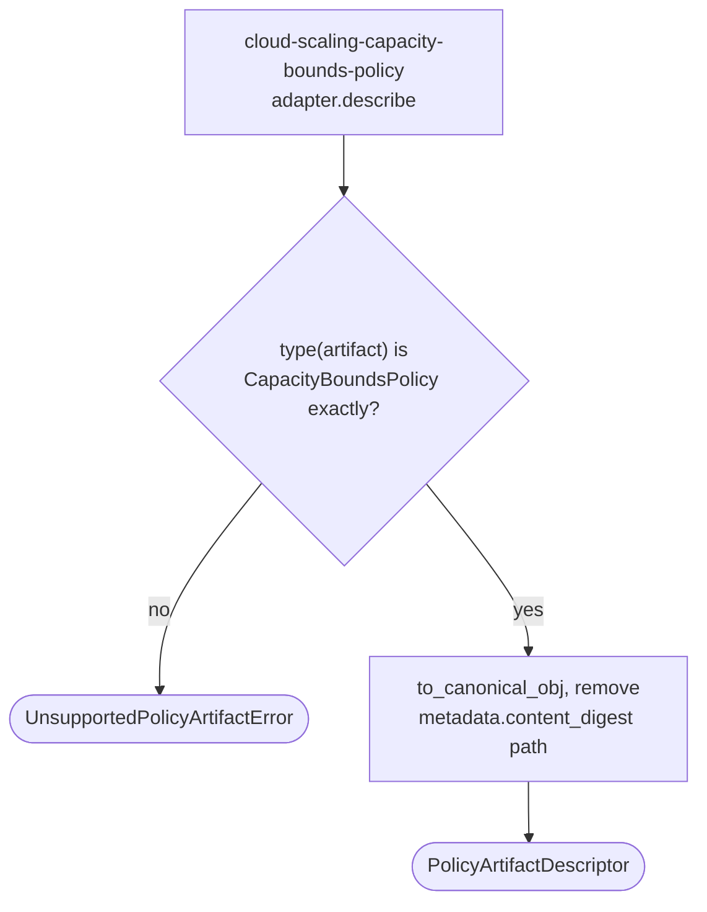
```mermaid
flowchart TD
F4["cloud-scaling-capacity-bounds-policy<br/>adapter.describe"] --> F5{"type(artifact) is<br/>CapacityBoundsPolicy exactly?"}
F5 -->|no| FY(["UnsupportedPolicyArtifactError"])
F5 -->|yes| F6["to_canonical_obj, remove<br/>metadata.content_digest path"]
F6 --> F7(["PolicyArtifactDescriptor"])
```

### `policy-workflow-compiler` — How a policy pack is compiled into a governed workflow

Turns a reviewed policy pack into a deterministic workflow definition plus its assurance package. It is tooling: it never approves, authorizes or runs anything.

1. The pack is validated; a failing report ends compilation.
2. A valid human approval for this exact pack digest is required, and the approver may not be the author.
3. A review requirement, if supplied, must be satisfied; a valid approval cannot excuse an unsatisfied review.
4. The workflow IR is synthesized and checked for authority-boundary violations.
5. Assurance manifest, coverage and audit schema are generated; the package gets a content digest.

*Part 1 of 3*

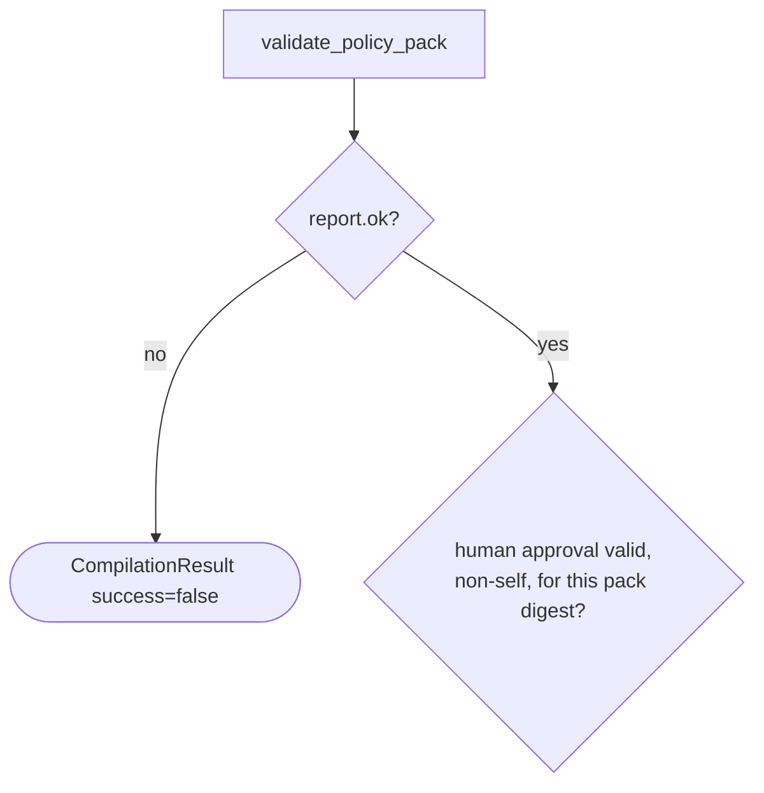
```mermaid
flowchart TD
K1["validate_policy_pack"] --> K2{"report.ok?"}
K2 -->|no| KX(["CompilationResult success=false"])
K2 -->|yes| K3{"human approval valid,<br/>non-self, for this pack digest?"}
```

*Part 2 of 3*

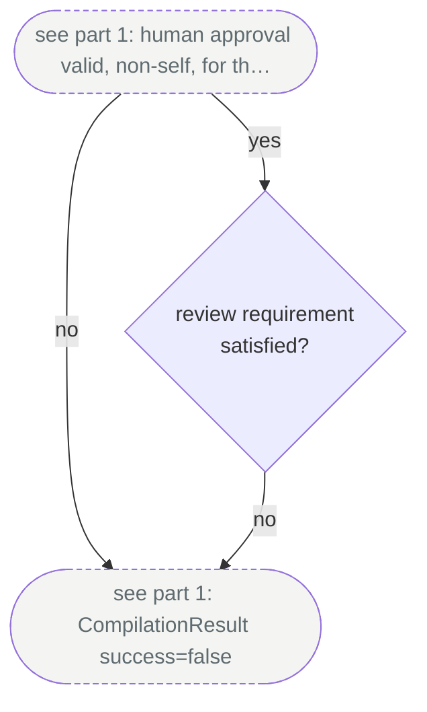
```mermaid
flowchart TD
K3(["see part 1: human approval valid, non-self, for th…"])
KX(["see part 1: CompilationResult success=false"])
K3 -->|no| KX
K3 -->|yes| K4{"review requirement<br/>satisfied?"}
K4 -->|no| KX
style K3 stroke-dasharray: 4 3,fill:#F4F5F2,color:#5F6B70
style KX stroke-dasharray: 4 3,fill:#F4F5F2,color:#5F6B70
```

*Part 3 of 3*

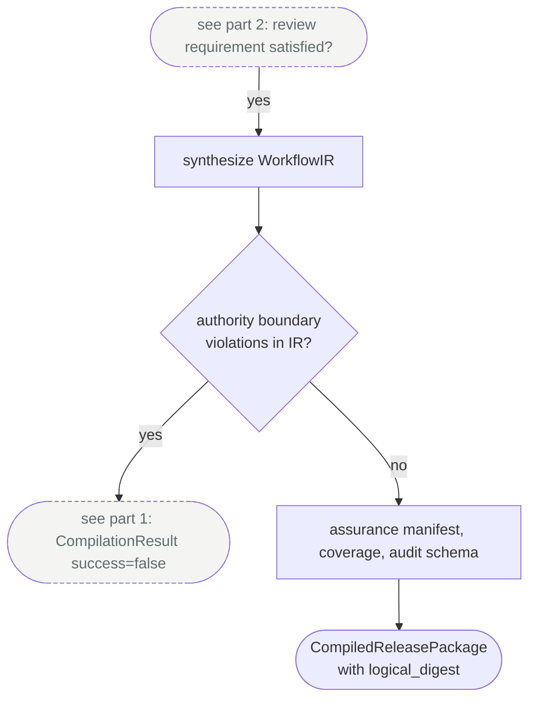
```mermaid
flowchart TD
K4(["see part 2: review requirement satisfied?"])
KX(["see part 1: CompilationResult success=false"])
K4 -->|yes| K5["synthesize WorkflowIR"]
K5 --> K6{"authority boundary<br/>violations in IR?"}
K6 -->|yes| KX
K6 -->|no| K7["assurance manifest, coverage, audit schema"]
K7 --> K8(["CompiledReleasePackage<br/>with logical_digest"])
style K4 stroke-dasharray: 4 3,fill:#F4F5F2,color:#5F6B70
style KX stroke-dasharray: 4 3,fill:#F4F5F2,color:#5F6B70
```

## M2 Agent constitution and strategy permission

What an agent is allowed to be and which reasoning strategies it may use. Both are written down as signed, digest-bound policies in M1, and each has a fail-closed resolver that returns the exact policy or a typed refusal, never a guess.

### `agent-constitution-policy` — How a constitution artifact is built and described

A constitution states the ceilings a role's declared vocabulary must stay within. Tokens must be sorted and unique and come from the admitted vocabulary; the package refuses rather than reordering.

1. Metadata, role references and the three bounds are validated on construction.
2. Out-of-order or duplicate tokens are refused.
3. The adapter emits one exclusivity claim per governed role and a projection without the digest field.

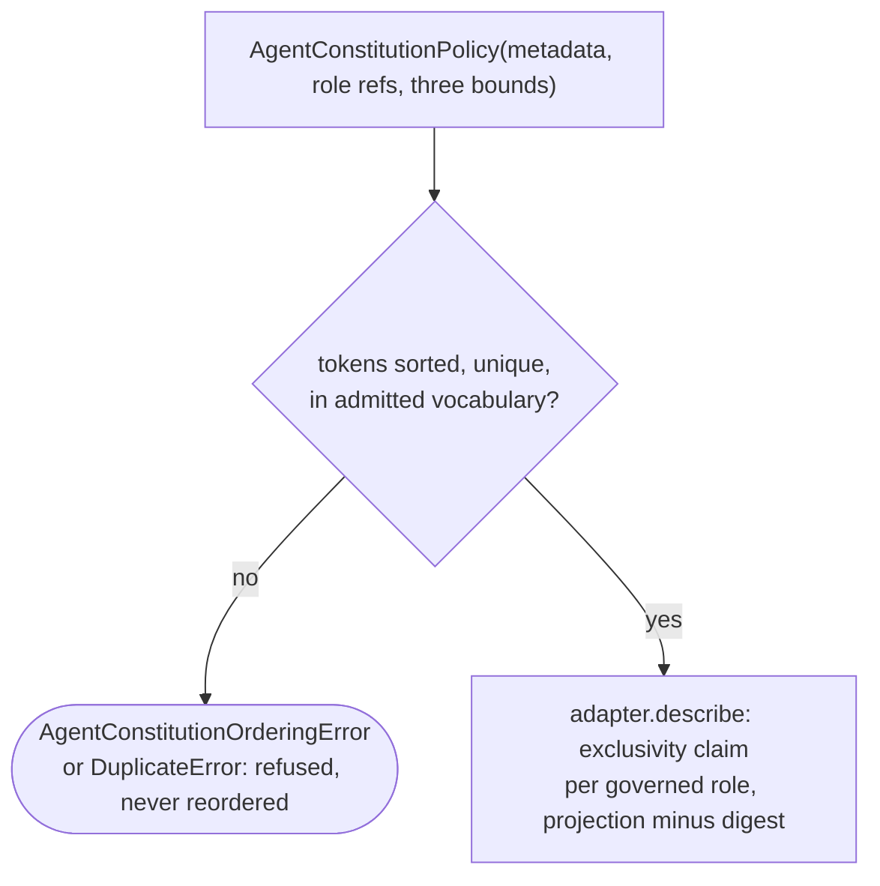
```mermaid
flowchart TD
C1["AgentConstitutionPolicy(metadata, role refs, three bounds)"] --> C2{"tokens sorted, unique,<br/>in admitted vocabulary?"}
C2 -->|no| CX(["AgentConstitutionOrderingError<br/>or DuplicateError: refused, never reordered"])
C2 -->|yes| C3["adapter.describe: exclusivity claim<br/>per governed role, projection minus digest"]
```

### `agent-constitution-activation` — How a constitution is issued and then activated

Preflight checks everything without a signer or registry, so it cannot sign or store by accident. Issuance goes through M1. Activation derives a map from (tenant, role) to the signed policy coordinate.

1. Preflight: recognition, digest, lifecycle, effectivity and approval rows must all pass.
2. issue_constitution calls M1 issue_policy; an authority refusal propagates unchanged.
3. The issuance receipt carries only the signer's identity fields.
4. Activation reads the issued record back and checks its halves agree.
5. An existing map entry that points elsewhere is a conflict; the same entry is idempotent.
6. The result is a derived reference map plus an activation receipt.

*Part 1 of 2*

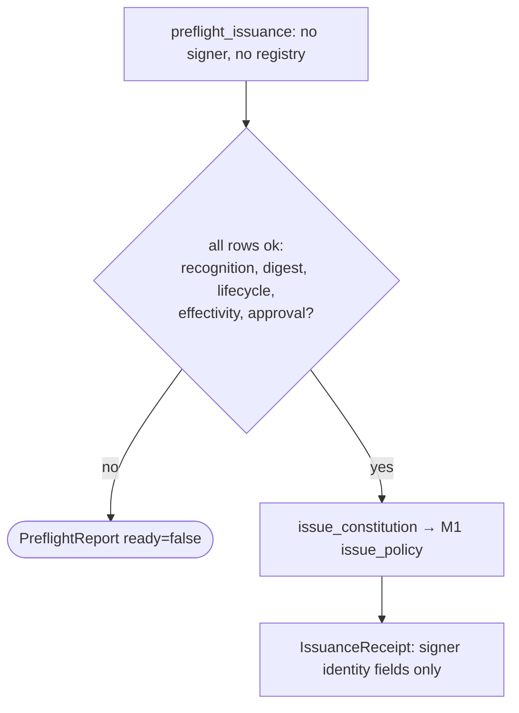
```mermaid
flowchart TD
A1["preflight_issuance: no signer, no registry"] --> A2{"all rows ok:<br/>recognition, digest, lifecycle,<br/>effectivity, approval?"}
A2 -->|no| AX(["PreflightReport ready=false"])
A2 -->|yes| A3["issue_constitution → M1 issue_policy"]
A3 --> A4["IssuanceReceipt: signer identity fields only"]
```

*Part 2 of 2*

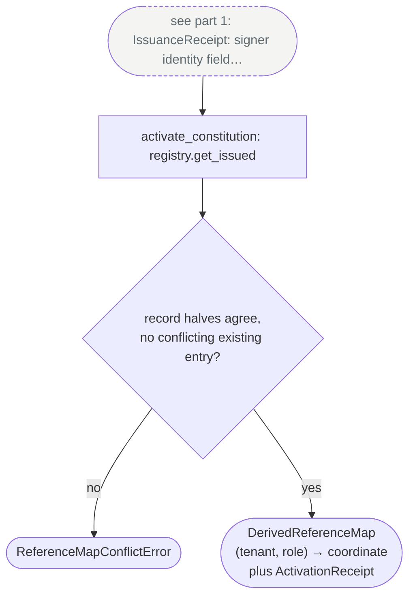
```mermaid
flowchart TD
A4(["see part 1: IssuanceReceipt: signer identity field…"])
A4 --> A5["activate_constitution: registry.get_issued"]
A5 --> A6{"record halves agree,<br/>no conflicting existing entry?"}
A6 -->|no| AY(["ReferenceMapConflictError"])
A6 -->|yes| A7(["DerivedReferenceMap<br/>(tenant, role) → coordinate<br/>plus ActivationReceipt"])
style A4 stroke-dasharray: 4 3,fill:#F4F5F2,color:#5F6B70
```

### `agent-constitution-conformance` — How the exact constitution is resolved for a role

Given a tenant and a role, return the signed constitution that governs it, or a typed refusal. There is no prefix match and no newest-version fallback.

1. The (tenant, role) key must exist in the reference map.
2. M1 resolve_policy runs with historical resolution always denied.
3. The result must be the exact policy type, name this role, use only admitted vocabulary, and match any presented reference.
4. role_facts_conform compares presented facts against the policy and returns a bool: a report, never a denial.

*Part 1 of 2*

```mermaid
flowchart TD
R1["resolve(tenant, role_contract_ref, as_of)"] --> R2{"key in reference map?"}
R2 -->|no| RX(["UnknownConstitutionReferenceError<br/>no prefix match, no newest rule"])
R2 -->|yes| R3["M1 resolve_policy<br/>historical = DENY_ALWAYS"]
R3 --> R4{"RESOLVED?"}
R4 -->|no| RY(["ConstitutionUnresolvedError.reason"])
```

*Part 2 of 2*

```mermaid
flowchart TD
R4(["see part 1: RESOLVED?"])
R4 -->|yes| R5{"exact type, role in refs,<br/>vocabulary inside enums,<br/>presented ref equal?"}
R5 -->|no| RZ(["typed binding error"])
R5 -->|yes| R6(["AgentConstitutionPolicy<br/>no envelope, no verified flag"])
R7["role_facts_conform(policy, facts)"] --> R8(["bool: report, never a denial"])
style R4 stroke-dasharray: 4 3,fill:#F4F5F2,color:#5F6B70
```

### `agentic-proposer-strategy-permission-policy` — How a strategy-permission policy is built

States which reasoning strategies a role may declare. The permitted set must be non-empty, sorted, unique and drawn from the proposer's strategy vocabulary.

1. Construction validates the metadata and the permitted set.
2. Any malformed field refuses with a typed error.
3. The adapter describes the artifact for issuance in M1.

```mermaid
flowchart TD
S1["StrategyPermissionPolicy(permitted_strategies)"] --> S2{"non-empty tuple, sorted,<br/>unique, in ReasoningStrategy?"}
S2 -->|no| SX(["StrategyPermissionFieldError"])
S2 -->|yes| S3["adapter.describe"]
```

### `agentic-proposer-strategy-permission-runtime` — How the proposer learns which strategies it may use

The one component that talks to both the proposer and the policy authority. It resolves the signed policy for a (tenant, policy reference) key and hands the proposer a plain response.

1. The key is (tenant, strategy policy reference); the case reference is deliberately excluded so a case cannot select its own policy.
2. M1 resolve_policy runs with historical resolution denied.
3. The result must be RESOLVED, the exact type, bind the same reference, and use only known strategy tokens.
4. The proposer receives a StrategyPolicyResponse.

```mermaid
flowchart TD
T1["resolve(StrategyPolicyRequest)"] --> T2{"(tenant, strategy_policy_ref)<br/>in map? case_ref excluded"}
T2 -->|no| TX(["UnknownStrategyPolicyReferenceError"])
T2 -->|yes| T3["M1 resolve_policy DENY_ALWAYS"]
T3 --> T4{"RESOLVED, exact type,<br/>ref equal, tokens in enum?"}
T4 -->|no| TY(["typed error, reason never in text"])
T4 -->|yes| T5(["StrategyPolicyResponse<br/>to the proposer"])
```

## M3 Proposal and advisory

Everything that recommends and nothing that decides. The proposer assembles a digest-bound proposal; ten other packages give advice on teams, models, routing, context size, action sequences, cloud capacity and reasoning methods. Every output is marked advisory.

### `agentic-proposer` — How a proposal is built and fingerprinted

Every input contract must agree on tenant and case; the strategy and the constitution are checked before any domain evaluation runs; eligibility and selection are recomputed rather than trusted. The result is a digest-bound advisory that decides nothing.

1. Tenant and case must be equal across identity, role, mandate, context and candidates; the context must name the mandate.
2. The strategy policy is resolved through the injected resolver and the declared strategy must be permitted.
3. The injected constitution resolution must match the role's constitution reference.
4. Eligibility (Equation 1) is recomputed for every candidate and must agree with the stored value.
5. Observations are resolved and the domain evaluation and selection policy are replayed.
6. If a candidate is selected, the review action must be permitted and readiness (Equation 2) must hold.
7. The unsigned payload is frozen and its digest becomes the advisory's identity.
8. A separate process record can carry a reasoning-method admission, outside the digest.

*Part 1 of 6*

```mermaid
flowchart TD
B1["cross-contract scope: tenant and case equal<br/>across identity, role, mandate, context, candidates"] --> B2{"context.mandate_id ==<br/>mandate.mandate_id?"}
B2 -->|no| BX(["CrossContractViolationError"])
```

*Part 2 of 6*

```mermaid
flowchart TD
B2(["see part 1: context.mandate_id == mandate.mandate_…"])
BX(["see part 1: CrossContractViolationError"])
B2 -->|yes| B3["resolve strategy policy via injected<br/>StrategyPolicyResolver, correlation-check echo"]
B3 --> B4{"declared_strategy in<br/>permitted set?"}
B4 -->|no| BX
style B2 stroke-dasharray: 4 3,fill:#F4F5F2,color:#5F6B70
style BX stroke-dasharray: 4 3,fill:#F4F5F2,color:#5F6B70
```

*Part 3 of 6*

```mermaid
flowchart TD
B4(["see part 2: declared_strategy in permitted set?"])
BX(["see part 1: CrossContractViolationError"])
B4 -->|yes| B5{"injected constitution_resolution<br/>ref == role.constitution_ref?"}
B5 -->|no| BX
B5 -->|yes| B6["recompute Eq.1 eligibility per candidate"]
B6 --> B7{"stored is_eligible agrees?"}
B7 -->|no| BY(["EligibilityMismatchError"])
style B4 stroke-dasharray: 4 3,fill:#F4F5F2,color:#5F6B70
style BX stroke-dasharray: 4 3,fill:#F4F5F2,color:#5F6B70
```

*Part 4 of 6*

```mermaid
flowchart TD
B7(["see part 3: stored is_eligible agrees?"])
B7 -->|yes| B8["resolve observation_refs;<br/>replay domain evaluation and selection policy"]
B8 --> B9{"replay matches?"}
style B7 stroke-dasharray: 4 3,fill:#F4F5F2,color:#5F6B70
```

*Part 5 of 6*

```mermaid
flowchart TD
B9(["see part 4: replay matches?"])
B9 -->|no| BZ(["DomainEvaluationProviderError"])
B9 -->|yes| B10{"selected_candidate_id set?"}
B10 -->|yes| B11{"review action permitted,<br/>destination role present,<br/>Eq.2 readiness true?"}
style B9 stroke-dasharray: 4 3,fill:#F4F5F2,color:#5F6B70
```

*Part 6 of 6*

```mermaid
flowchart TD
B11(["see part 5: review action permitted, destination r…"])
BX(["see part 1: CrossContractViolationError"])
B10(["see part 5: selected_candidate_id set?"])
B11 -->|no| BX
B11 -->|yes| B12
B10 -->|no, dependents absent| B12["freeze P_unsigned"]
B12 --> B13(["ProposerAdvisory<br/>advisory_digest = sha256 of jcs bytes"])
B14["build_proposer_process_record<br/>terminal PROPOSAL, NEED_EVIDENCE, ABSTAIN, ESCALATE"] --> B15["optional reasoning_method_advisory_input<br/>outside P_unsigned"]
style B11 stroke-dasharray: 4 3,fill:#F4F5F2,color:#5F6B70
style BX stroke-dasharray: 4 3,fill:#F4F5F2,color:#5F6B70
style B10 stroke-dasharray: 4 3,fill:#F4F5F2,color:#5F6B70
```

### `reasoning-method-governance, reasoning-method-advisor` — How a reasoning-method advisory is produced and admitted

Rules decide which methods qualify; evidence decides whether the result may leave research. A primary method exists only when exactly one qualifies. Admission requires a comparison result from the research engine, and the bridge into the proposer is not wired in the repository.

1. advise: methods are filtered by implementation status, then rules add inclusions and exclusions as sets.
2. Exactly one qualifier makes a primary; zero or several make trade-offs and no primary.
3. The advisory is stamped RESEARCH_ONLY.
4. admit: the comparison result must come from ugence-readiness-comparison, carry a signature if required, cover every qualifier and contradict none.
5. to_proposer_input builds a 14-key mapping. No package imports across the bridge: a gap.

*Part 1 of 2*

```mermaid
flowchart TD
M1["advise(request): admissible set by<br/>implementation status; rules as set semantics"] --> M2{"qualifying count"}
M2 -->|1| M3["primary = SOLE_QUALIFYING_METHOD"]
M2 -->|0 or >1| M4["primary none; trade-offs as set differences"]
M3 --> M5["ReasoningMethodAdvisory<br/>usage_scope RESEARCH_ONLY"]
M4 --> M5
```

*Part 2 of 2*

```mermaid
flowchart TD
M5(["see part 1: ReasoningMethodAdvisory usage_scope RE…"])
M5 --> M6["admit(advisory, result, verified)"]
M6 --> M7{"result from ugence-readiness-comparison,<br/>signature present if required,<br/>every qualifier covered, none contradicted?"}
M7 -->|no| MX(["RESEARCH_ONLY_REFUSED_IN_PRODUCT<br/>or typed refusal"])
M7 -->|yes| M8["ReasoningMethodAdvisoryAdmission<br/>ADVISORY_INPUT"]
M8 --> M9["to_proposer_input: 14-key mapping"]
style M5 stroke-dasharray: 4 3,fill:#F4F5F2,color:#5F6B70
```

### `agent-workforce-composer` — How a team plan is proposed

Adapts a compiled workflow, gates which agents are eligible, ranks them, and composes a bounded team. The plan is a proposal; it grants and schedules nothing.

1. Search bounds are checked first: too many roles or candidates ends in SEARCH_SPACE_EXCEEDED.
2. A role with no feasible candidate ends in NO_FEASIBLE_TEAM.
3. Otherwise a fingerprint-bound AgentTeamPlan is returned.

```mermaid
flowchart TD
W1["agent-workforce-composer<br/>build_agent_team_plan"] --> W2{"bounds exceeded or<br/>no feasible team?"}
W2 -->|yes| W3(["SEARCH_SPACE_EXCEEDED or NO_FEASIBLE_TEAM"])
W2 -->|no| W4(["AgentTeamPlan, fingerprint-bound proposal"])
```

### `model-selection` — How a model is authorized for a request

Every registered model is gated on signals with evidence; a missing or stale signal becomes UNKNOWN, never a pass. Only the eligible set is ranked. The decision covers model eligibility, never actions.

1. Each candidate is gated; missing or stale signals degrade to UNKNOWN.
2. A non-empty eligible set yields ALLOW with a governed fallback chain.
3. No eligible model with an INDETERMINATE candidate yields ESCALATE or HOLD.
4. Otherwise DENY with NO_ELIGIBLE_MODEL.

```mermaid
flowchart TD
S1["model-selection<br/>ModelAuthority.authorize"] --> S2["gate every candidate;<br/>missing or stale signal → UNKNOWN"]
S2 --> S3{"eligible set non-empty?"}
S3 -->|yes| S4(["ALLOW + governed fallback chain"])
S3 -->|no, an INDETERMINATE| S5(["ESCALATE or HOLD"])
S3 -->|no| S6(["DENY NO_ELIGIBLE_MODEL"])
```

### `llm-steering-controller` — How a routing recommendation is made

Hard constraints are applied before any scoring. If nothing is eligible the answer is NO_ELIGIBLE_CANDIDATE, never an arbitrary fallback. Every recommendation is marked not executed.

1. Candidates that fail a hard constraint are rejected with the constraint named.
2. The eligible set is scored and ranked deterministically.
3. The result carries fallback and escalation advice.

```mermaid
flowchart TD
L1["llm-steering-controller<br/>recommend"] --> L2["hard constraints before scoring"]
L2 --> L3{"eligible?"}
L3 -->|none| L4(["NO_ELIGIBLE_CANDIDATE, never a fallback"])
L3 -->|some| L5(["RoutingRecommendation<br/>execution_status NOT_EXECUTED"])
```

### `context-minimization` — How a context is reduced without changing its meaning

Text is removed, never rewritten. An oracle supplied by the caller defines what counts as equivalent; if equivalence cannot be shown the full context is returned.

1. No oracle means a refusal, not a silent structural pass.
2. Duplicates are removed, then units are selected extractively.
3. The oracle is re-evaluated: equal key means VERIFIED.
4. If restoring necessary spans makes it equal, RESTORED.
5. Otherwise fall back to the full context.

```mermaid
flowchart TD
X1["context-minimization<br/>minimize_context"] --> X2{"oracle supplied?"}
X2 -->|no| X3(["OracleRequiredError"])
X2 -->|yes| X4["dedup, extractive select,<br/>re-evaluate oracle"]
X4 --> X5{"equivalence key equal?"}
X5 -->|yes| X6(["VERIFIED"])
X5 -->|after restoring spans| X7(["RESTORED"])
X5 -->|no| X8(["JOINT_EFFECT_FALLBACK: full context"])
```

### `storygraph` — How a risky sequence of actions is detected

Individually acceptable actions can add up to a prohibited capability. Events are linked into assemblies and matched against recipes. Findings are advisory: OBSERVE or ESCALATE, never allow or deny.

1. An event is linked to assemblies and its fragments extracted into a bounded ledger.
2. Recipe completeness with corroboration decides the signal; count alone never escalates.
3. A refused governor yields UNAVAILABLE rather than silence.

```mermaid
flowchart TD
G1["storygraph<br/>SequenceRiskAnalyzer.ingest"] --> G2["link to assemblies;<br/>extract fragments; bounded ledger"]
G2 --> G3{"recipe completeness<br/>with corroboration?"}
G3 -->|edge-triggered| G4(["OBSERVE or ESCALATE finding<br/>never ALLOW or DENY"])
G3 -->|governor refused| G5(["UNAVAILABLE"])
```

### `cloud-scaling-controller, cloud-scaling-risk-integration` — How a capacity recommendation reaches a risk decision

The controller recommends a capacity action or abstains with a typed reason. The risk adapter authenticates the recommendation by exact type and recomputed digest, then projects it into a Risk Authority request. The outcome is a non-executable risk decision.

1. State, forecast, cost and topology gates must all pass or the controller abstains.
2. A recommendation is advisory only; actuation_performed is always false.
3. The adapter recomputes the digest and requires an independent expected digest.
4. Validity is re-checked against the injected clock.
5. The seam returns a SubjectRiskDecision; a risk pass is not authorization.

*Part 1 of 2*

```mermaid
flowchart TD
K1["cloud-scaling-controller<br/>recommend_capacity_action"] --> K2{"state, forecast, cost,<br/>topology gates pass?"}
K2 -->|no| K3(["RecommendationAbstention, typed reason"])
K2 -->|yes| K4(["CapacityActionRecommendation<br/>advisory_only, actuation_performed=false"])
K4 --> K5["cloud-scaling-risk-integration<br/>authenticate: exact type, recomputed digest"]
```

*Part 2 of 2*

```mermaid
flowchart TD
K5(["see part 1: cloud-scaling-risk-integration authent…"])
K5 --> K6{"digest matches independent<br/>expected digest, within validity?"}
K6 -->|no| K7(["PROJECTION_REJECTED"])
K6 -->|yes| K8["project to SubjectRiskEvaluationRequestV2<br/>seam.evaluate (M6)"]
K8 --> K9(["RISK_DECISION: non-executable"])
style K5 stroke-dasharray: 4 3,fill:#F4F5F2,color:#5F6B70
```

### `context-minimization-token-accounting-runtime` — How provider token usage is recorded per attempt

Bridges the runtime's provider attempts to the token-accounting contracts. An attempt with no registered measurement is skipped visibly, never recorded as zero.

1. A prepared measurement must be registered for the (instance, task).
2. The attempt is translated and reconciled into a token record.
3. Budget settlement happens separately at the quantum boundary.

```mermaid
flowchart TD
T1["cm-token-accounting-runtime<br/>on_attempt(ProviderAttempt) from M9"] --> T2{"prepared measurement registered?"}
T2 -->|no| T3(["skipped, never zero"])
T2 -->|yes| T4(["ApiCallTokenRecord; settlement at quantum boundary"])
```

## M4 Research-only

The comparison engine and the study harness that produce the evidence a reasoning-method advisory needs before it may enter the product. Every result is stamped research-only and is never approval-bearing.

### `workflow-fit-pilot` — How a research pilot runs a method and records what it saw

A preregistered study runs each method behind a separate capture process, recomputes telemetry, scores quality, and keeps a five-state ledger. Every judgment is research-only.

1. The manifest is validated before any run; an evaluator that is also the issuer or requester is refused.
2. Case digests must equal the benchmark manifest set.
3. Each method is proposed, run case by case, and attested by the boundary.
4. A failed or incomplete run is INCONCLUSIVE.
5. Quality is scored and a PilotObservation validated.
6. A calibration run stops here; a confirmatory run calls the comparison engine.

*Part 1 of 3*

```mermaid
flowchart TD
P1["validate manifest against catalog,<br/>rule set, advisory before any run"] --> P2{"evaluator identity equals<br/>record issuer, requester or boundary?"}
P2 -->|yes| PX(["EVALUATOR_SELF_LOOP"])
P2 -->|no| P3{"case digests equal<br/>benchmark manifest set?"}
P3 -->|no| PY(["BENCHMARK_MANIFEST_MISMATCH"])
P3 -->|yes| P4["start BoundaryProcess: the only client"]
```

*Part 2 of 3*

```mermaid
flowchart TD
P4(["see part 1: start BoundaryProcess: the only client"])
P4 --> P5["per method: propose() PROPOSED;<br/>RUN_BEGIN, CASE_BEGIN and CASE_END<br/>with harness-observed call counts"]
P5 --> P6{"workflow raised or<br/>capture incomplete?"}
P6 -->|yes| P7(["INCONCLUSIVE: WORKFLOW_FAILED<br/>or CAPTURE_INCOMPLETE"])
P6 -->|no| P8["RUN_END telemetry recomputed by boundary;<br/>ATTEST → AttestationEnvelope"]
P8 --> P9["QualityScorerPort per case;<br/>MetricClaim SourceBasis.REPORTED"]
style P4 stroke-dasharray: 4 3,fill:#F4F5F2,color:#5F6B70
```

*Part 3 of 3*

```mermaid
flowchart TD
P9(["see part 2: QualityScorerPort per case; MetricClai…"])
P9 --> P10["PilotObservation validated;<br/>OBSERVATION_VALIDATED"]
P10 --> P11{"run role CALIBRATION?"}
P11 -->|yes| P12(["rests at UNDER_TEST;<br/>no comparison, no summary"])
P11 -->|no| P13["build ReadinessComparisonRequest;<br/>compare(request, produced_at)"]
style P9 stroke-dasharray: 4 3,fill:#F4F5F2,color:#5F6B70
```

### `readiness-comparison` — How methods are compared and judged

One pure function. It never fetches a benchmark, never averages across missing dimensions, and refuses self-attested or self-verified evidence. Each method ends as insufficient, dominated, or Pareto-efficient.

1. Schema versions are pinned; a threshold naming a benchmark reference is unresolvable in slice 1.
2. Records need a matching task class, a baseline and every required dimension.
3. A high-consequence class with threshold-only sufficiency needs a resolved admission.
4. Self-attestation and self-verification are refused; each record gets an evidence status view.
5. Below threshold: INSUFFICIENT_QUALITY. Dominated by a sufficient alternative: RESOURCE_DOMINATED. Otherwise PARETO_EFFICIENT.
6. Every assessment is RESEARCH_ONLY with a requester-asserted authority basis.

*Part 1 of 3*

```mermaid
flowchart TD
C1["schema versions pinned"] --> C2{"threshold names a<br/>benchmark_ref?"}
C2 -->|yes| C3(["THRESHOLD_UNRESOLVABLE:<br/>slice 1 never fetches"])
C2 -->|no| C4["records: task-class digest,<br/>baseline present, dimensions available"]
C4 --> C5{"high-consequence class and<br/>threshold-only sufficiency?"}
```

*Part 2 of 3*

```mermaid
flowchart TD
C5(["see part 1: high-consequence class and threshold-o…"])
C5 -->|no resolved admission| C6(["THRESHOLD_ONLY_NOT_ADMITTED"])
C5 -->|admitted or n/a| C7["envelopes: self-attestation and<br/>self-verification refused;<br/>EvidenceStatusView per record"]
C7 --> C8{"quality value meets<br/>threshold under comparator?"}
C8 -->|no| C9(["INSUFFICIENT_QUALITY with margin"])
style C5 stroke-dasharray: 4 3,fill:#F4F5F2,color:#5F6B70
```

*Part 3 of 3*

```mermaid
flowchart TD
C8(["see part 2: quality value meets threshold under co…"])
C8 -->|yes| C10{"another sufficient method no worse<br/>on every dimension, better on one?"}
C10 -->|yes| C11(["SUFFICIENT_RESOURCE_DOMINATED"])
C10 -->|no| C12(["SUFFICIENT_PARETO_EFFICIENT"])
C13(["every assessment usage_scope RESEARCH_ONLY;<br/>authority_resolution_basis REQUESTER_ASSERTED"])
style C8 stroke-dasharray: 4 3,fill:#F4F5F2,color:#5F6B70
```

## M5 Evidence and trust

Whether a piece of evidence is trusted, current and sufficient. A verified receipt proves who signed what and when. It never authorizes anything by itself.

### `trusted-evidence-authority` — How evidence is verified, receipted and re-verified

Verification produces a typed determination; only an admitted determination can be issued as an Ed25519-signed receipt. Re-verification later must match every scope coordinate the caller expects. A receipt proves who signed what and when, nothing more.

1. Submission and request must carry the same evidence; revoked or expired evidence is refused.
2. Structural scope and temporal checks run, then the Ed25519 protocol: digest, anchor, profile, key lifecycle, signature.
3. Every requested trust stage must be cleared or the determination is refused.
4. The issuer checks authority, key, protocol and request digest agree, then signs.
5. verify_bound recomputes the payload digest, resolves the anchor at the exact coordinate, checks the window, and compares every expectation coordinate.

*Part 1 of 4*

```mermaid
flowchart TD
V1["verify(submission, request, verified_at)"] --> V2{"submission.evidence ==<br/>request.evidence?"}
V2 -->|no| VX(["refuse CONTENT_DIGEST_MISMATCH"])
V2 -->|yes| V3{"lifecycle REVOKED<br/>or EXPIRED?"}
```

*Part 2 of 4*

```mermaid
flowchart TD
V3(["see part 1: lifecycle REVOKED or EXPIRED?"])
V3 -->|yes| VY(["refuse REVOKED or STALE"])
V3 -->|no| V4["structural scope mismatches;<br/>temporal refusal at as_of"]
V4 --> V5["run Ed25519 protocol:<br/>content digest, anchor, profile,<br/>key lifecycle, signature"]
V5 --> V6{"protocol result valid<br/>and every requested stage cleared?"}
style V3 stroke-dasharray: 4 3,fill:#F4F5F2,color:#5F6B70
```

*Part 3 of 4*

```mermaid
flowchart TD
V6(["see part 2: protocol result valid and every reques…"])
V6 -->|no| VZ(["refuse VERIFICATION_NOT_PERFORMED<br/>or protocol reason"])
V6 -->|yes| V7["EvidenceVerificationDetermination ADMITTED<br/>with issuance_token"]
V7 --> V8["ReceiptIssuer.issue: authority, key,<br/>protocol, request digest must agree"]
style V6 stroke-dasharray: 4 3,fill:#F4F5F2,color:#5F6B70
```

*Part 4 of 4*

```mermaid
flowchart TD
V8(["see part 3: ReceiptIssuer.issue: authority, key, p…"])
V8 --> V9(["SignedEvidenceVerificationReceipt<br/>Ed25519, domain-separated"])
V10["verify_bound(envelope, expectation, evaluated_at)"] --> V11{"payload digest recomputed,<br/>anchor resolved at exact coordinate,<br/>signature valid, window includes instant,<br/>every expectation coordinate equal?"}
V11 -->|no| VW(["typed refusal"])
V11 -->|yes| V12(["ScopeBoundVerificationResult<br/>CONTEXT_SYSTEM_BOUND"])
style V8 stroke-dasharray: 4 3,fill:#F4F5F2,color:#5F6B70
```

### `tap` — How an assertion is judged against its evidence

TAP says whether an assertion is supported, unsupported, constrained or indeterminate. Only evidence references cross the boundary. Any failure becomes INDETERMINATE; nothing is ever promoted to supported.

1. The neutral request is mapped to a native request of references.
2. A client failure in fail-safe mode returns INDETERMINATE.
3. No evidence: INDETERMINATE. Any contradicting item: UNSUPPORTED. Full coverage: SUPPORTED. Partial: CONSTRAINED.

```mermaid
flowchart TD
T1["TAPProvider.evaluate(AssertionGovernanceRequest)"] --> T2["map to native request:<br/>evidence refs only, never content"]
T2 --> T3{"client raised?"}
T3 -->|yes, fail_safe| T4(["INDETERMINATE provider_error"])
T3 -->|no| T5{"evidence"}
T5 -->|none| T6(["INDETERMINATE missing_evidence"])
T5 -->|any contradicts| T7(["UNSUPPORTED"])
T5 -->|coverage >= 1| T8(["SUPPORTED"])
T5 -->|partial| T9(["CONSTRAINED supported_components_only"])
```

### `risk-authority-evidence-runtime` — How raw evidence becomes a trusted control result (RA-5)

In production a caller-supplied PASS is inert. Evidence must pass admission, then an assertion provider evaluates it, and the outcome is mapped conservatively into a control status that the Risk Authority gate consumes.

1. The application runs in production mode and refuses in-memory stores.
2. Admission checks schema, ADMITTED state, currency, integrity digests and identifiers.
3. Empty admitted evidence gives MISSING without consulting the provider.
4. UNSUPPORTED maps to FAIL; SUPPORTED with full coverage to PASS; everything else to UNKNOWN.
5. A presumptive PASS without an explicit stance is downgraded to UNKNOWN.
6. The bound control result feeds the non-compensatory gate in M6.

*Part 1 of 4*

```mermaid
flowchart TD
E1["submit_evidence_and_evaluate"] --> E2["RiskAuthorityApplication(production_mode=True)<br/>refuses in-memory stores"]
E2 --> E3{"ProductionEvidenceAdmission:<br/>schema, ADMITTED, current,<br/>integrity and admission digests ok,<br/>identifiers non-blank?"}
```

*Part 2 of 4*

```mermaid
flowchart TD
E3(["see part 1: ProductionEvidenceAdmission: schema, A…"])
E3 -->|no| E4["evidence inert"]
E3 -->|yes| E5["TapControlAssurance.evaluate"]
E5 --> E6{"admitted evidence empty?"}
style E3 stroke-dasharray: 4 3,fill:#F4F5F2,color:#5F6B70
```

*Part 3 of 4*

```mermaid
flowchart TD
E6(["see part 2: admitted evidence empty?"])
E6 -->|yes| E7(["ControlStatus MISSING<br/>provider not consulted"])
E6 -->|no| E8["provider.evaluate(AssertionGovernanceRequest)"]
E8 --> E9{"map_assertion_outcome"}
E9 -->|UNSUPPORTED| E10(["FAIL"])
E9 -->|SUPPORTED, coverage >= 1| E11{"presumptive PASS without<br/>explicit stance?"}
style E6 stroke-dasharray: 4 3,fill:#F4F5F2,color:#5F6B70
```

*Part 4 of 4*

```mermaid
flowchart TD
E11(["see part 3: presumptive PASS without explicit stan…"])
E9(["see part 3: map_assertion_outcome"])
E11 -->|yes| E12(["UNKNOWN, H-1 downgrade"])
E11 -->|no| E13(["PASS"])
E9 -->|other or infra failure| E12
E13 --> E14["bind_control_result → RA non-compensatory gate<br/>→ RiskDecision (M6)"]
style E11 stroke-dasharray: 4 3,fill:#F4F5F2,color:#5F6B70
style E9 stroke-dasharray: 4 3,fill:#F4F5F2,color:#5F6B70
```

### `agent-assurance-evidence` — What an assurance finding declaration must satisfy

A record of what a security or robustness exercise found about one exact system. It is contracts only: no runner, no store, no scoring.

1. Binding, evidence, finding and validity must be the shared contract types.
2. Tenant and subject must agree across them, and the id must equal the derived id.
3. The record is digest-bound, unsigned, and lives in no store here.

```mermaid
flowchart TD
D1["AssuranceFindingDeclaration"] --> D2{"binding, evidence, finding, validity<br/>are governance-contracts types;<br/>tenant and subject agree;<br/>id == derived id?"}
D2 -->|no| DX(["ContractViolation"])
D2 -->|yes| D3(["record, digest-bound, unsigned, no store"])
```

## M6 Decision and risk authority

The only place machine authority is minted. A governed decision becomes a signed, scoped, time-limited, revocable envelope, and the composition engine turns that envelope plus two advisory inputs into one fail-closed execution decision.

### `risk_authority` — From a risk case to a signed envelope and an admitted action (RA-1 to RA-4)

The spine of machine authority. A case is bound to a workflow digest, controls are evaluated non-compensatorily, a decision is issued within delegated bounds, and only an allowing, unexpired decision can be minted into a signed envelope. The gate then verifies the envelope and matches the exact action.

1. RA-1: a case is created bound to an active WorkflowIR digest.
2. RA-2: any unsatisfied required control yields DENY or ESCALATE, never a coerced pass.
3. RA-3: issue_decision requires the AUTHORITY_REVIEW state and a scope inside the grant.
4. RA-4a: the envelope needs a granting, unexpired decision, a scope subset, and a key inside its window; it is Ed25519-signed and epoch-bound.
5. RA-4b: the verifier checks key, signature, tenant, audience, session, window and revocation.
6. Then the action's tenant, actor, model, scope, purpose and amounts must match. The authorization is never itself executable.
7. Revocation: advancing a tenant's epoch invalidates every earlier envelope at once.

*Part 1 of 5*

```mermaid
flowchart TD
A1["RA-1 create_case bound to ACTIVE WorkflowIR digest<br/>CREATED → CLASSIFIED → CONTROLS_RESOLVED"] --> A2["RA-2 RiskEngine.evaluate"]
A2 --> A3{"any required control<br/>unsatisfied?"}
A3 -->|"FAIL or DENY_UNLESS_ALL"| A4(["DENY"])
A3 -->|otherwise| A5(["ESCALATE, never coerced to PASS"])
A3 -->|no| A6{"conditions supplied?"}
A6 -->|yes| A7(["ALLOW_WITH_CONDITIONS"])
```

*Part 2 of 5*

```mermaid
flowchart TD
A6(["see part 1: conditions supplied?"])
A7(["see part 1: ALLOW_WITH_CONDITIONS"])
A6 -->|no| A8(["ALLOW"])
A7 --> A9["RA-3 issue_decision: case must be AUTHORITY_REVIEW"]
A8 --> A9
A9 --> A10{"delegation monotonic:<br/>requested scope within grant?"}
A10 -->|no| A11(["AuthorityDeniedError"])
A10 -->|yes| A12["RiskDecision: digests, expires_at = now + ttl"]
style A6 stroke-dasharray: 4 3,fill:#F4F5F2,color:#5F6B70
style A7 stroke-dasharray: 4 3,fill:#F4F5F2,color:#5F6B70
```

*Part 3 of 5*

```mermaid
flowchart TD
A12(["see part 2: RiskDecision: digests, expires_at = no…"])
A12 --> A13["RA-4a EnvelopeIssuer.issue"]
A13 --> A14{"decision grants authority,<br/>not expired, envelope scope<br/>subset of decision scope,<br/>key inside its window?"}
A14 -->|no| A15(["raise; an expired decision is never re-minted"])
style A12 stroke-dasharray: 4 3,fill:#F4F5F2,color:#5F6B70
```

*Part 4 of 5*

```mermaid
flowchart TD
A14(["see part 3: decision grants authority, not expired…"])
A14 -->|yes| A16(["RiskAuthorizationEnvelope<br/>Ed25519 over canonical bytes,<br/>bound to tenant authority epoch"])
A16 --> A17["RA-4b ReferenceActionGate.authorize"]
A17 --> A18{"EnvelopeVerifier: key known and in window,<br/>signature valid, tenant, audience, session,<br/>nbf and exp, not revoked?"}
style A14 stroke-dasharray: 4 3,fill:#F4F5F2,color:#5F6B70
```

*Part 5 of 5*

```mermaid
flowchart TD
A18(["see part 4: EnvelopeVerifier: key known and in win…"])
A18 -->|no| A19(["DENIED"])
A18 -->|yes| A20{"action tenant, actor, model equal envelope<br/>and RuntimeIdentity; scope, purpose,<br/>tool, data, destination, amount match?"}
A20 -->|no| A19
A20 -->|yes| A21(["ActionAuthorization AUTHORIZED<br/>executable permanently False"])
A22["RevocationState: advance_epoch(tenant)<br/>invalidates every prior-epoch envelope;<br/>revoke_envelope, subject, model targeted"] --> A18
style A18 stroke-dasharray: 4 3,fill:#F4F5F2,color:#5F6B70
```

### `risk-authority-runtime` — How three inputs compose into one execution decision (RA-4.5)

The Risk Authority result is the only machine authority; Decision Authority and ActionGate can only veto or tighten. Eight ordered checks bind the envelope to this exact action; then restrictions are intersected and a fixed precedence yields GRANT, HOLD, DENY or ERROR.

1. Production refuses the reference gate and reads the clock once.
2. A failing envelope is DENY; a mismatched binding is ERROR, never recorded as a denial.
3. Advisory inputs are read by string value: ADVANCE and ALLOW mean no veto; HOLD or DEFER hold; REJECT, DENY or UNKNOWN deny.
4. Restrictions only tighten: amounts take the minimum, expiry the earliest, allow sets intersect, deny sets union.
5. Precedence: RA error, then any deny, then a hold, then an empty or violated scope, and only then GRANT.
6. The decision carries no signature and is not a second envelope.

*Part 1 of 3*

```mermaid
flowchart TD
R1["RiskAuthorityEnforcer.production refuses<br/>ReferenceActionGate; reads clock once"] --> R2["verify_and_bind: 8 ordered checks"]
R2 --> R3{"envelope verifies?"}
R3 -->|no| R4["RA DENY"]
```

*Part 2 of 3*

```mermaid
flowchart TD
R3(["see part 1: envelope verifies?"])
R3 -->|yes| R5{"authorization bound to this envelope,<br/>this action digest, this tenant?"}
R5 -->|no| R6["BindingViolation → ERROR,<br/>never recorded as RA denied"]
R5 -->|yes| R7["adapters by string value:<br/>DecisionOutcome ADVANCE NO_VETO, HOLD or DEFER HOLD, REJECT DENY;<br/>ActionGate ALLOW NO_VETO, constraints tighten, UNKNOWN DENY"]
R7 --> R8["apply_restrictions: amount min, expiry earliest,<br/>allow sets intersect, deny sets union"]
style R3 stroke-dasharray: 4 3,fill:#F4F5F2,color:#5F6B70
```

*Part 3 of 3*

```mermaid
flowchart TD
R8(["see part 2: apply_restrictions: amount min, expiry…"])
R8 --> R9{"precedence"}
R9 -->|"RA ERROR"| R10(["ERROR_NON_EXECUTABLE"])
R9 -->|"RA DENY, DA REJECT, AG DENY or UNKNOWN"| R11(["DENY"])
R9 -->|"DA HOLD or DEFER"| R12(["HOLD_NON_EXECUTABLE<br/>required_approvals carried"])
R9 -->|"empty scope or action outside<br/>narrowed scope"| R11
R9 -->|otherwise| R13(["GRANT: GovernedExecutionDecision<br/>no signature, not a second envelope"])
style R8 stroke-dasharray: 4 3,fill:#F4F5F2,color:#5F6B70
```

### `decision-authority` — How a binding human decision is recorded

The domain-neutral decision kernel. A decision can be recorded only on a ready, non-final case by an authorized human; AI is structurally barred. DECIDED is a terminal decision state, never an execution state.

1. A finalized case refuses.
2. The actor is authorized for MAKE_DECISION and readiness over review tasks is evaluated.
3. Authority checks: AI barred, delegated bounds, segregation of duties.
4. Departing from the recommendation without override reasons refuses.
5. The decision record is appended and the case moves to DECIDED.

*Part 1 of 3*

```mermaid
flowchart TD
D1["load case"] --> D2{"terminal status?"}
D2 -->|yes| D3(["CaseFinalizedError"])
D2 -->|no| D4["authorize actor for MAKE_DECISION;<br/>readiness over review tasks"]
```

*Part 2 of 3*

```mermaid
flowchart TD
D4(["see part 1: authorize actor for MAKE_DECISION; rea…"])
D4 --> D5{"ready and transition legal?"}
D5 -->|no| D6(["DecisionReadinessError or InvalidCaseTransitionError"])
D5 -->|yes| D7{"authority: AI barred, delegated bounds,<br/>segregation of duties"}
style D4 stroke-dasharray: 4 3,fill:#F4F5F2,color:#5F6B70
```

*Part 3 of 3*

```mermaid
flowchart TD
D7(["see part 2: authority: AI barred, delegated bounds…"])
D7 -->|AI| D8(["AIDecisionAuthorityError"])
D7 -->|SoD| D9(["SegregationOfDutiesError"])
D7 -->|ok| D10{"outcome departs from recommendation<br/>without override reasons?"}
D10 -->|yes| D11(["UnauthorizedOverrideError"])
D10 -->|no| D12(["DecisionRecord appended;<br/>case DECIDED, never executed"])
style D7 stroke-dasharray: 4 3,fill:#F4F5F2,color:#5F6B70
```

## M7 Human authority and approval

Who may decide, until when, and proof that a named human did. An approval is bound to one parked proposal and consumed exactly once. Nothing here approves anything itself; it records and binds.

### `governed-review` — How an approval is bound to a parked proposal and consumed once

Only a HOLD that names required approvals is reviewable. The approval id is derived from the proposal fingerprint, so one approval matches one exact proposal. Consumption is keyed by instance and task, so a crash re-drive of the same task is still satisfied.

1. Inputs without a HOLD and required approvals pass through untouched.
2. The approval id is derived from the proposal fingerprint; the consumer is instance:task.
3. No record: request it with a seven-day validity and park the instance.
4. PENDING: still parked. GRANTED or CONSUMED: try to consume under this key.
5. Consumed first, or already consumed by this same instance and task, is satisfied; anything else stays parked.
6. On satisfaction the veto becomes NO_VETO with required approvals emptied; every other restriction stays.

*Part 1 of 3*

```mermaid
flowchart TD
G1["inputs_for(proposal) from upstream source"] --> G2{"Decision Authority veto is HOLD<br/>with required_approvals?"}
G2 -->|no| G3(["pass upstream inputs unchanged"])
```

*Part 2 of 3*

```mermaid
flowchart TD
G2(["see part 1: Decision Authority veto is HOLD with r…"])
G2 -->|yes| G4["approval_id from proposal fingerprint;<br/>consumer_ref = instance_id:task_id"]
G4 --> G5{"approval record state"}
G5 -->|none| G6["request_approval Validity 7 days;<br/>present_for_decision; instance parks"]
style G2 stroke-dasharray: 4 3,fill:#F4F5F2,color:#5F6B70
```

*Part 3 of 3*

```mermaid
flowchart TD
G5(["see part 2: approval record state"])
G5 -->|PENDING| G7(["AWAITING_DECISION: still parked"])
G5 -->|GRANTED or CONSUMED| G8["consume under this key"]
G8 --> G9{"CONSUMED_FIRST, or ALREADY_CONSUMED<br/>by this instance and task?"}
G9 -->|no| G10(["CONSUMED_BY_OTHER or REFUSED: parked"])
G9 -->|yes| G11(["released inputs: veto NO_VETO,<br/>required_approvals emptied,<br/>GR_APPROVAL_CONSUMED reason;<br/>all other restrictions unchanged"])
style G5 stroke-dasharray: 4 3,fill:#F4F5F2,color:#5F6B70
```

### `governed-review-service` — How a human's decision is recorded and the run re-armed

The review service records a decision a human already made. Identity, tenant and eligibility are checked before anything is written; the first decision stands; a grant re-arms the instance but runs nothing.

1. Only GRANT or REJECT are accepted.
2. If an identity port is configured the proof must authenticate, be HUMAN by an exact configured claim, be unexpired, and match the presented approver id.
3. The approval must be known, reviewable, and the tenant proven or single-tenant.
4. REQUESTED or PENDING: the ledger decides with eligibility from the authority directory.
5. An identical resubmission is REPLAYED; an already decided approval refuses.
6. A recorded decision is signalled to the durable engine; a GRANT re-arms and links to the audit ledger.

*Part 1 of 4*

```mermaid
flowchart TD
S1["decision GRANT or REJECT; ApproverRef; proof header"] --> S2{"identity port configured?"}
S2 -->|yes| S3["approver-identity-jwt authenticate"]
S3 --> S4{"authenticated, HUMAN by exact configured claim,<br/>not expired, presented id == proven subject?"}
```

*Part 2 of 4*

```mermaid
flowchart TD
S4(["see part 1: authenticated, HUMAN by exact configur…"])
S2(["see part 1: identity port configured?"])
S4 -->|no| SX(["REFUSED_UNAUTHENTICATED, NOT_HUMAN,<br/>IDENTITY_MISMATCH: nothing written"])
S2 -->|no| S5
S4 -->|yes| S5{"approval known, reviewable,<br/>tenant proven or single-tenant?"}
style S4 stroke-dasharray: 4 3,fill:#F4F5F2,color:#5F6B70
style S2 stroke-dasharray: 4 3,fill:#F4F5F2,color:#5F6B70
```

*Part 3 of 4*

```mermaid
flowchart TD
S5(["see part 2: approval known, reviewable, tenant pro…"])
S5 -->|no| SY(["REFUSED_UNKNOWN_APPROVAL or TENANT_UNPROVEN"])
S5 -->|yes| S6{"record state"}
S6 -->|REQUESTED or PENDING| S7["ledger.decide: eligibility via authority-directory"]
S7 --> S8{"eligible and transition legal?"}
S8 -->|no| SZ(["REFUSED_INELIGIBLE or NOT_OPEN"])
S8 -->|yes| S9["RECORDED; signal review_decision to durable engine"]
style S5 stroke-dasharray: 4 3,fill:#F4F5F2,color:#5F6B70
```

*Part 4 of 4*

```mermaid
flowchart TD
S6(["see part 3: record state"])
S9(["see part 3: RECORDED; signal review_decision to du…"])
S6 -->|identical resubmission| S10(["REPLAYED"])
S6 -->|already decided| S11(["REFUSED_ALREADY_DECIDED: first decision stands"])
S9 --> S12{"GRANT?"}
S12 -->|no| S13(["instance stays parked"])
S12 -->|yes| S14["adapter.resume: re-arm only, runs nothing;<br/>link to control-plane-root ledger"]
style S6 stroke-dasharray: 4 3,fill:#F4F5F2,color:#5F6B70
style S9 stroke-dasharray: 4 3,fill:#F4F5F2,color:#5F6B70
```

### `approval-workflow` — How an approval is consumed exactly once

One write transaction, one consumption key, one unique index per approval. Two consumers racing for the same approval cannot both win.

1. The consumption key is (tenant, approval, subject digest, consumer).
2. A key already held returns ALREADY_CONSUMED naming the holder.
3. The subject digest must match, the state must be consumable, and the validity window must contain the instant.
4. INSERT with a unique constraint; rowcount not one means another consumer won.
5. Success moves the record to CONSUMED and appends a hash-linked event.

*Part 1 of 2*

```mermaid
flowchart TD
W1["BEGIN IMMEDIATE; ConsumptionKey(tenant, approval, subject digest, consumer)"] --> W2{"key already held?"}
W2 -->|yes| W3(["ALREADY_CONSUMED naming holder"])
W2 -->|no| W4{"subject digest equal, state consumable,<br/>valid at as_of?"}
W4 -->|no| W5(["SUBJECT_MISMATCH, NOT_GRANTED,<br/>EXPIRED_APPROVAL"])
```

*Part 2 of 2*

```mermaid
flowchart TD
W4(["see part 1: subject digest equal, state consumable…"])
W3(["see part 1: ALREADY_CONSUMED naming holder"])
W4 -->|yes| W6["INSERT ON CONFLICT DO NOTHING;<br/>UNIQUE one consumption per approval"]
W6 --> W7{"rowcount == 1?"}
W7 -->|no| W3
W7 -->|yes| W8(["CONSUMED_FIRST; state CONSUMED;<br/>hash-linked event appended"])
style W4 stroke-dasharray: 4 3,fill:#F4F5F2,color:#5F6B70
style W3 stroke-dasharray: 4 3,fill:#F4F5F2,color:#5F6B70
```

### `authority-directory` — How approver eligibility is answered

Time-bounded role grants. A grant outside its window is simply absent. The answer is a typed eligibility answer with reasons, never a bare yes.

1. The wanted scope is derived from the approval subject.
2. A valid grant of the required role must cover that scope at the instant.
3. The presented approver kind and role must equal the record.
4. Otherwise the answer is ineligible with the reasons listed.

```mermaid
flowchart TD
E1["scope approval/subject_kind/subject_digest"] --> E2{"valid grant of required role<br/>covering the scope at as_of?"}
E2 -->|no| E3(["EligibilityAnswer false, reasons"])
E2 -->|yes| E4{"presented kind and role<br/>equal the record?"}
E4 -->|no| E3
E4 -->|yes| E5(["EligibilityAnswer true"])
```

## M8 Authorization and clearance

Is this exact action authorized, is it still clear right now, and has it been reserved exactly once. Clearance plus reservation is still not execution; nothing here dispatches.

### `actiongate` — How ActionGate reaches a verdict

A policy ladder over the action type. Infrastructure failure raises a classified error that the framework turns into INDETERMINATE, so failure never looks like authorization. Expiry is emitted, not enforced.

1. The neutral request is mapped to the native one; tenant is deliberately left empty.
2. A configured failure mode raises a classified provider error.
3. The trace id is derived from the action type, parameters and tenant.
4. Denied types: DENIED. Unknown types: INDETERMINATE. Constrained types: AUTHORIZED_WITH_CONSTRAINTS. Otherwise AUTHORIZED.

*Part 1 of 2*

```mermaid
flowchart TD
A1["map ActionGovernanceRequest to native;<br/>tenant left empty"] --> A2{"engine failure mode?"}
A2 -->|timeout, unavailable, config, malformed| A3(["classified ProviderError raised;<br/>framework adapter turns it INDETERMINATE"])
A2 -->|none| A4["trace id = ag- + sha256(type, params, tenant) first 16 hex"]
A4 --> A5{"action_type in policy ladder"}
```

*Part 2 of 2*

```mermaid
flowchart TD
A5(["see part 1: action_type in policy ladder"])
A5 -->|denied| A6(["DENIED policy_denied"])
A5 -->|unknown| A7(["INDETERMINATE policy_unknown"])
A5 -->|constrained| A8(["AUTHORIZED_WITH_CONSTRAINTS<br/>expiry emitted, not enforced"])
A5 -->|else| A9(["AUTHORIZED"])
style A5 stroke-dasharray: 4 3,fill:#F4F5F2,color:#5F6B70
```

### `action-clearance` — Is this authorized action still clear right now?

Given an authorization and a bundle of trusted current-state signals, decide CLEAR, HOLD, BLOCK or ESCALATE just before execution. Every signal is bound to the action, trusted by provenance, and checked for freshness. The least permissive status wins.

1. Malformed input is refused: a signal captured in the future, or a signal value carrying a credential or token.
2. The authorization must be eligible and unexpired, or the result is BLOCK.
3. Each signal must bind to this tenant, subject, authorization and action fingerprint.
4. Liveness, trust level, provenance, adapter version and freshness are checked; unknown fails closed.
5. Type semantics: disabled actor, change freeze, incident, artifact drift, unsatisfied control, unavailable target, rejected policy.
6. Prior consumption: CONSUMED blocks; RESERVED follows policy; unknown holds.
7. Missing required signals, conflicting signals and constraint conflicts are added.
8. Statuses combine least-permissive-wins; the receipt is content-addressed and unsigned.

*Part 1 of 4*

```mermaid
flowchart TD
C1["validate: no future-captured signal,<br/>no credential or token in any signal value"] --> C2{"authorization outcome eligible<br/>and not expired at evaluation_time?"}
C2 -->|no| C3["AUTHORIZATION_NOT_ELIGIBLE or EXPIRED → BLOCK"]
C2 -->|yes| C4["per signal: tenant, subject, authorization ref,<br/>action fingerprint binding"]
```

*Part 2 of 4*

```mermaid
flowchart TD
C4(["see part 1: per signal: tenant, subject, authoriza…"])
C4 --> C5["liveness: UNKNOWN → SIGNAL_MISSING;<br/>trust: provenance, digest, source, adapter, level;<br/>freshness: valid_until, max age"]
C5 --> C6["type semantics: actor disabled, change freeze,<br/>incident, artifact drift, required control,<br/>target unavailable, policy rejected"]
C6 --> C7{"PRIOR_CONSUMPTION"}
style C4 stroke-dasharray: 4 3,fill:#F4F5F2,color:#5F6B70
```

*Part 3 of 4*

```mermaid
flowchart TD
C7(["see part 2: PRIOR_CONSUMPTION"])
C11(["see part 4: required signals present; conflicts → …"])
C7 -->|CONSUMED| C8["ALREADY_CONSUMED → BLOCK"]
C7 -->|RESERVED| C9["CONSUMPTION_RESERVED → policy response"]
C7 -->|unknown or absent| C10["CONSUMPTION_STATUS_UNKNOWN → HOLD"]
C7 -->|UNUSED| C11
C8 --> C11
C9 --> C11
style C7 stroke-dasharray: 4 3,fill:#F4F5F2,color:#5F6B70
style C11 stroke-dasharray: 4 3,fill:#F4F5F2,color:#5F6B70
```

*Part 4 of 4*

```mermaid
flowchart TD
C10(["see part 3: CONSUMPTION_STATUS_UNKNOWN → HOLD"])
C3(["see part 1: AUTHORIZATION_NOT_ELIGIBLE or EXPIRED …"])
C10 --> C11["required signals present; conflicts → ESCALATE;<br/>constraint intersection narrows only;<br/>obligations superset"]
C3 --> C11
C11 --> C12{"least permissive wins:<br/>BLOCK outranks ESCALATE outranks HOLD outranks CLEAR"}
C12 --> C13(["ClearanceResult: status, reason codes,<br/>valid_until = min(authorization, signals, lifetime);<br/>content-addressed acr_ receipt, unsigned"])
style C10 stroke-dasharray: 4 3,fill:#F4F5F2,color:#5F6B70
style C3 stroke-dasharray: 4 3,fill:#F4F5F2,color:#5F6B70
```

### `execution-reservation` — How an execution is reserved exactly once

The execution key names the action, not the receipt, so a re-issued receipt for the same action maps to the same key. The receipt is validated, the current head is classified, and a single insert with a uniqueness constraint decides who holds the reservation.

1. The key is (tenant, authorization, action fingerprint, target, operation).
2. One immediate write transaction loads the receipt and its lifecycle.
3. A revoked receipt is STALE_AUTHORIZATION; an expired one is EXPIRED_CLEARANCE; any other failure is INVALID_RECEIPT.
4. The head is classified: free, already reserved, already dispatched (uncertain outcome is never free), or completed.
5. A free key gets the next generation and a deterministic id; the insert either acquires or reports CONFLICT.
6. The lifecycle is forward-only, and the head projects to a PRIOR_CONSUMPTION signal for clearance.

*Part 1 of 4*

```mermaid
flowchart TD
R1["ExecutionKey(tenant, authorization ref,<br/>action fingerprint, target, operation)<br/>receipt ref excluded"] --> R2["BEGIN IMMEDIATE; load receipt and lifecycle"]
R2 --> R3{"receipt present, body intact, CLEAR,<br/>fields match, ISSUED, not superseded,<br/>not expired?"}
R3 -->|revoked| R4(["STALE_AUTHORIZATION"])
R3 -->|expired| R5(["EXPIRED_CLEARANCE"])
R3 -->|other failure| R6(["INVALID_RECEIPT"])
```

*Part 2 of 4*

```mermaid
flowchart TD
R3(["see part 1: receipt present, body intact, CLEAR, f…"])
R3 -->|yes| R7{"classify_head"}
R7 -->|"none, AVAILABLE, RELEASED,<br/>RECONCILED_FAILURE, abandoned lease"| R8["generation + 1; deterministic rsv_ id"]
R7 -->|RESERVED live| R9(["ALREADY_RESERVED, resolution DUPLICATE"])
R7 -->|"DISPATCHED, OUTCOME_UNCERTAIN,<br/>OBSERVED_FAILURE"| R10(["ALREADY_DISPATCHED: uncertain is never free"])
R7 -->|"OBSERVED or RECONCILED_SUCCESS"| R11(["ALREADY_COMPLETED"])
style R3 stroke-dasharray: 4 3,fill:#F4F5F2,color:#5F6B70
```

*Part 3 of 4*

```mermaid
flowchart TD
R8(["see part 2: generation + 1; deterministic rsv_ id"])
R8 --> R12{"INSERT ON CONFLICT DO NOTHING<br/>rowcount == 1?"}
R12 -->|no| R13(["CONFLICT"])
style R8 stroke-dasharray: 4 3,fill:#F4F5F2,color:#5F6B70
```

*Part 4 of 4*

```mermaid
flowchart TD
R12(["see part 3: INSERT ON CONFLICT DO NOTHING rowcount…"])
R12 -->|yes| R14(["ACQUIRED; RESERVED event on<br/>append-only hash-linked ledger"])
R14 --> R15["forward-only: DISPATCHED → OBSERVED_* →<br/>RECONCILED_* → RELEASED; rank never downgrades"]
R15 --> R16["consumption_status_for(head):<br/>UNUSED, RESERVED, CONSUMED, UNKNOWN<br/>→ PRIOR_CONSUMPTION TrustedSignal"]
style R12 stroke-dasharray: 4 3,fill:#F4F5F2,color:#5F6B70
```

## M9 Governed runtime

Runs tasks and asks the governance hook before every consequential call to a provider. A retry re-asks instead of replaying. The durable engine only schedules and recovers; it never decides.

### `durable-execution` — How the durable engine advances a run one step at a time

Each advance is exactly one runtime quantum inside one transaction and a fresh workflow id, so a retry re-crosses governance instead of replaying a stale clearance. The engine refuses a monotonic clock because a pre-crash expiry would be meaningless after restart.

1. The host refuses a monotonic clock at construction.
2. advance runs under a fresh DBOS workflow id per attempt.
3. A claim held by another worker is refused, not queued.
4. The instance is rehydrated if needed and the runtime advances one quantum.

```mermaid
flowchart TD
U1["DbosRuntimeHost refuses monotonic clock"] --> U2["advance(instance_id, attempt_token)<br/>fresh DBOS workflow id per attempt"]
U2 --> U3{"state.claim held by<br/>another worker?"}
U3 -->|yes| U4(["StepOutcome parked: refused, not queued"])
U3 -->|no| U5["rehydrate if not resident;<br/>AgentRuntime.advance_workflow"]
```

### `agent-runtime` — How a task is run behind the governance hook

A consequential task cannot run without a CLEAR from the hook, a validated clearance bound to this exact proposal, and a last-mile authority recheck. The invocation is re-fingerprinted before the provider is called, and each real invocation emits one attempt record.

1. A proposal is frozen with an idempotency key of instance:task; no attempt number, no timestamp.
2. Non-consequential tasks continue without crossing the boundary.
3. Consequential tasks call the hook: HOLD waits, ESCALATE pauses, BLOCK or an unknown answer fails.
4. CLEAR is validated: intact proposal, equal fingerprint, a binding reference, not yet expired, matching correlation.
5. The authority recheck runs immediately before the effect; stale, raised or malformed never permits.
6. The invocation fingerprint must equal the proposal fingerprint.
7. The provider runs with deterministic retry; timeouts are not retried.
8. Success completes and checkpoints; failure fails the workflow.

*Part 1 of 4*

```mermaid
flowchart TD
T1["TransitionProposal: frozen args,<br/>idempotency_key = instance:task,<br/>no attempt number, no timestamp"] --> T2{"task consequential?"}
T2 -->|no| T3["directive CONTINUE, no boundary crossed"]
T2 -->|yes| T4["governance_hook.evaluate(proposal, clock())"]
T4 --> T5{"disposition"}
T5 -->|HOLD| T6(["task WAITING, workflow WAITING governance_hold"])
T5 -->|ESCALATE| T7(["task WAITING, workflow PAUSED governance_escalate"])
T5 -->|BLOCK, None, unknown| T8(["task FAILED GOVERNANCE_BLOCK"])
```

*Part 2 of 4*

```mermaid
flowchart TD
T5(["see part 1: disposition"])
T5 -->|CLEAR| T9["validate_clearance: proposal intact,<br/>fingerprint equal, binding reference present,<br/>now before valid_until, correlation equal"]
T9 --> T10{"permitted?"}
T10 -->|no| T11(["FAILED CLEAR_REJECTED"])
T10 -->|yes| T12["authority_recheck immediately before effect"]
T12 --> T13{"recheck"}
T13 -->|"stale, raised, malformed"| T14(["FAILED GOVERNANCE_CLEAR_AUTHORITY_STALE<br/>or RECHECK_ERROR, never a permit"])
T13 -->|ok| T15["task RUNNING; ToolInvocation re-fingerprinted"]
style T5 stroke-dasharray: 4 3,fill:#F4F5F2,color:#5F6B70
```

*Part 3 of 4*

```mermaid
flowchart TD
T15(["see part 2: task RUNNING; ToolInvocation re-finger…"])
T15 --> T16{"invocation fingerprint ==<br/>proposal fingerprint?"}
T16 -->|no| T17(["FAILED PROPOSAL_INVOCATION_MISMATCH"])
T16 -->|yes| T18["execute_with_policy: timeouts not retried,<br/>retriable errors to max_attempts,<br/>one ProviderAttempt per real invocation"]
style T15 stroke-dasharray: 4 3,fill:#F4F5F2,color:#5F6B70
```

*Part 4 of 4*

```mermaid
flowchart TD
T18(["see part 3: execute_with_policy: timeouts not retr…"])
T3(["see part 1: directive CONTINUE, no boundary crossed"])
T15(["see part 2: task RUNNING; ToolInvocation re-finger…"])
T18 --> T19{"outcome ok?"}
T19 -->|yes| T20(["COMPLETED, checkpoint"])
T19 -->|no| T21(["FAILED, workflow FAILED"])
T3 --> T15
style T18 stroke-dasharray: 4 3,fill:#F4F5F2,color:#5F6B70
style T3 stroke-dasharray: 4 3,fill:#F4F5F2,color:#5F6B70
style T15 stroke-dasharray: 4 3,fill:#F4F5F2,color:#5F6B70
```

### `agent-runtime-governance` — How the hook composes a decision and projects it

The hook obtains a governed decision from the Risk Authority composition engine and projects it onto CLEAR, HOLD, ESCALATE or BLOCK. It mints nothing: the binding reference is the Risk Authority envelope id, and a grant without one is blocked.

1. Stale clearance records are swept.
2. The input source must return CompositionInputs; anything else blocks.
3. The composition engine (M6) produces a governed decision.
4. GRANT that is executable becomes CLEAR only with an envelope id and room in the record.
5. HOLD with required approvals becomes ESCALATE; plain HOLD stays HOLD; DENY, ERROR or unknown become BLOCK.
6. The recheck wiring consumes the record at the commit point; a missing record for a CLEAR is an error.

*Part 1 of 4*

```mermaid
flowchart TD
H1["sweep consumed, expired, stale records"] --> H2["source.inputs_for(proposal)"]
H2 --> H3{"raised, None, or<br/>not CompositionInputs?"}
H3 -->|yes| H4(["BLOCK: INPUT_SOURCE_UNAVAILABLE,<br/>NOT_AUTHORITY_BOUND, MALFORMED"])
```

*Part 2 of 4*

```mermaid
flowchart TD
H3(["see part 1: raised, None, or not CompositionInputs?"])
H3 -->|no| H5["RiskAuthorityCompositionEngine.compose (M6)"]
H5 --> H6{"project_disposition"}
H6 -->|"GRANT and executable"| H7{"envelope_id present?"}
H7 -->|no| H8(["BLOCK GRANT_WITHOUT_AUTHORIZATION_REFERENCE"])
style H3 stroke-dasharray: 4 3,fill:#F4F5F2,color:#5F6B70
```

*Part 3 of 4*

```mermaid
flowchart TD
H7(["see part 2: envelope_id present?"])
H7 -->|yes| H9{"clearance record at capacity?"}
H9 -->|yes| H10(["BLOCK RECORD_AT_CAPACITY"])
H9 -->|no| H11(["CLEAR: fingerprint, envelope_id,<br/>correlation, valid_until epoch seconds"])
style H7 stroke-dasharray: 4 3,fill:#F4F5F2,color:#5F6B70
```

*Part 4 of 4*

```mermaid
flowchart TD
H6(["see part 2: project_disposition"])
H6 -->|"HOLD_NON_EXECUTABLE with required_approvals"| H12(["ESCALATE: EXTERNAL_APPROVAL"])
H6 -->|"HOLD_NON_EXECUTABLE"| H13(["HOLD: GOVERNANCE_HOLD_RELEASE"])
H6 -->|"DENY, ERROR, unknown"| H14(["BLOCK"])
H15["build_authority_recheck over RA-6<br/>make_pre_effect_recheck (M11)"] --> H16["hook_envelope_resolver consumes the record;<br/>missing record for a CLEAR → RECHECK_ERROR"]
style H6 stroke-dasharray: 4 3,fill:#F4F5F2,color:#5F6B70
```

## M10 Execution ladder

The only module with a real executor. Eight rungs turn a capacity recommendation into a signed envelope, an admitted action, a credential handle and one bounded change. Live execution is off unless every posture fact is proven, and falls back to dry-run.

### `cloud-scaling-authorization-contracts (5A)` — How a capacity candidate is built

A recommendation, its risk decision, a producer attestation and a policy binding are reconciled into one digest-bound candidate. A candidate grants nothing.

1. Phase 4 digests are re-derived through Risk Authority.
2. Temporal order is checked without reading a clock; target scope, policy binding and ceilings must agree.
3. Any disagreement is a typed error; success is a candidate whose grants_authority is derived false.

```mermaid
flowchart TD
A1["build_capacity_authorization_candidate"] --> A2["reconcile_phase4: re-derive context, subject,<br/>recommendation, request digests via risk_authority"]
A2 --> A3{"digests, temporal order without a clock,<br/>target scope, policy binding, ceilings all agree?"}
A3 -->|no| A4(["typed error: Reconciliation, TemporalOrdering,<br/>TargetScope, PolicyTargetBinding, MagnitudeBound"])
A3 -->|yes| A5(["CapacityAuthorizationCandidate<br/>grants_authority derived False"])
```

### `cloud-scaling-producer-attestation (5B-0A)` — How the producer's signature is verified

Proves who produced the recommendation. The signing payload is recomputed from the candidate, the trust anchor is resolved at the exact issuer and key, and the Ed25519 signature checked.

1. Recomputed payload must equal the signed bytes.
2. The anchor must exist for this key, carry the right capability, and be inside its lifecycle.
3. Success is a verified attestation bound to the candidate digest.

```mermaid
flowchart TD
B1["verify(candidate, attestation, as_of)"] --> B2{"recomputed signing payload == signed bytes;<br/>anchor at (issuer, key) resolved, right capability,<br/>in lifecycle; Ed25519 valid?"}
B2 -->|no| B3(["ProducerAttestationRefusal"])
B2 -->|yes| B4(["VerifiedProducerAttestation<br/>bound to candidate_digest"])
```

### `cloud-scaling-policy-authenticity (5B-0B)` — How the named policy version is proven authentic

Asks the policy authority whether the candidate's policy version was actually issued and is in force now, and checks that its bounds reconcile with the candidate's ceilings.

1. M1 resolve_policy runs unchanged.
2. The resolution must be current, its coordinate digest must equal the signed body digest, and the bounds must reconcile.
3. Success is a verified policy authenticity artifact.

```mermaid
flowchart TD
C1["verify(coordinate, tenant, as_of, candidate)"] --> C2["M1 resolve_policy unchanged"]
C2 --> C3{"RESOLVED, current not historical,<br/>coordinate digest == signed body digest,<br/>bounds reconcile with candidate ceilings?"}
C3 -->|no| C4(["PolicyAuthenticityRefusal"])
C3 -->|yes| C5(["VerifiedPolicyAuthenticity"])
```

### `cloud-scaling-envelope-issuance (5B-4)` — How the verified facts become one signed envelope

The seam reads the clock once and asks the port to verify the candidate, the producer and the policy at that same instant. All five bindings must be verified in the ratified order before the Risk Authority seam signs.

1. The port re-derives the candidate and verifies producer and policy at the seam's instant.
2. Five bindings are emitted in fixed order.
3. All verified: a signed envelope from M6 whose executable flag is permanently false. Otherwise a typed refusal.

```mermaid
flowchart TD
D1["issue(request): seam reads clock once"] --> D2["port verifies at that instant:<br/>candidate re-derived, producer and policy verified,<br/>five bindings in ratified order"]
D2 --> D3{"all five VERIFIED at the same instant?"}
D3 -->|no| D4(["EnvelopeIssuanceRefusal"])
D3 -->|yes| D5(["RiskAuthorizationEnvelope signed by M6 seam;<br/>executable permanently False"])
```

### `cloud-scaling-action-admission (5C)` — How an exact capacity action is admitted

Is this the action the envelope was issued for. The kernel verifies the envelope and looks up replays; the gate then matches scope, candidate, tenant, actor, model, purpose, bounds and conditions.

1. The kernel verifies the envelope and checks for a replayed verdict.
2. The gate requires the bound scope and candidate digests, equal identities, no data or money, values within bounds, and satisfied conditions.
3. AUTHORIZED or DENIED; never executable.

```mermaid
flowchart TD
E1["admit(request): CapacityActionGate as ActionGatePort"] --> E2["kernel verifies envelope; replay lookup"]
E2 --> E3{"scope and candidate bindings match,<br/>tenant actor model purpose equal,<br/>no data or money, within bounds,<br/>conditions satisfied?"}
E3 -->|no| E4(["ActionAuthorization DENIED"])
E3 -->|yes| E5(["ActionAuthorization AUTHORIZED<br/>executable False"])
```

### `cloud-scaling-credential-broker (5X)` — How an admitted, reserved action gets a credential handle

The broker verifies the authorization, the envelope and the reservation, mints a least-privilege request, and asks a broker port for a handle. The grant holds no secret and never widens the role.

1. Authorization must be AUTHORIZED and unexpired; the envelope present and unexpired; the reservation RESERVED with a live lease.
2. The credential request re-derives the action and the least-privilege role; the window is the minimum of all expiries.
3. An existing grant for another request conflicts; the same request is replayed.
4. The returned grant is validated: no role widening, inside the window.
5. The grant is a handle; executable stays false.

*Part 1 of 3*

```mermaid
flowchart TD
F1["materialize(request): clock once"] --> F2{"authorization AUTHORIZED and unexpired,<br/>envelope present and unexpired,<br/>reservation RESERVED with live lease?"}
F2 -->|no| F3(["typed refusal"])
```

*Part 2 of 3*

```mermaid
flowchart TD
F2(["see part 1: authorization AUTHORIZED and unexpired…"])
F2 -->|yes| F4["mint CredentialRequest: action re-derived,<br/>least-privilege role; window = min of all"]
F4 --> F5{"existing grant for this id?"}
style F2 stroke-dasharray: 4 3,fill:#F4F5F2,color:#5F6B70
```

*Part 3 of 3*

```mermaid
flowchart TD
F5(["see part 2: existing grant for this id?"])
F5 -->|other request| F6(["GRANT_CONFLICT"])
F5 -->|same| F7(["REPLAYED"])
F5 -->|none| F8["broker port; validate grant:<br/>no role widening, inside window"]
F8 --> F9(["CredentialGrant: a handle, no secret;<br/>executable False"])
style F5 stroke-dasharray: 4 3,fill:#F4F5F2,color:#5F6B70
```

### `cloud-scaling-bounded-execution (5D)` — How one bounded change is dispatched, and when LIVE is allowed

The only path to the executor. The grant is re-derived from the artifacts, the target addressed, and the posture proven fact by fact. If any posture fact is missing and LIVE was requested, the effective mode becomes dry-run, never simulation.

1. Replay by record id returns the stored record without dispatching.
2. Grant, reservation, authorization and envelope must all be present and valid.
3. The credential request is re-minted and must equal the grant.
4. Posture: production app, ledger, grant store, broker, non-reference handle, injected backend, readiness.
5. LIVE with a missing fact resolves to DRY_RUN with one reason per missing precondition.
6. The target policy is narrowed to the role; the reservation is marked dispatched before applying.
7. One bounded change runs; the record and an effect observation for M11 are returned.

*Part 1 of 3*

```mermaid
flowchart TD
G1["dispatch(request): clock once; replay by record id"] --> G2{"grant, reservation RESERVED, authorization,<br/>envelope all present and valid?"}
G2 -->|no| G3(["typed DispatchRefusal"])
G2 -->|yes| G4["re-mint credential request; must equal grant"]
```

*Part 2 of 3*

```mermaid
flowchart TD
G4(["see part 1: re-mint credential request; must equal…"])
G4 --> G5{"posture: production app, ledger, grant store,<br/>broker, non-reference handle, backend, readiness"}
G5 -->|"any missing and mode LIVE"| G6["effective mode DRY_RUN, never SIMULATION"]
G5 -->|all proven| G7["effective mode LIVE"]
style G4 stroke-dasharray: 4 3,fill:#F4F5F2,color:#5F6B70
```

*Part 3 of 3*

```mermaid
flowchart TD
G5(["see part 2: posture: production app, ledger, grant…"])
G6(["see part 2: effective mode DRY_RUN, never SIMULATION"])
G7(["see part 2: effective mode LIVE"])
G5 -->|"mode not LIVE"| G8["mode unchanged"]
G6 --> G9["narrow target policy to the role;<br/>per-act ExecutionAuthorization"]
G7 --> G9
G8 --> G9
G9 --> G10["mark_dispatched before executor if applying"]
style G5 stroke-dasharray: 4 3,fill:#F4F5F2,color:#5F6B70
style G6 stroke-dasharray: 4 3,fill:#F4F5F2,color:#5F6B70
style G7 stroke-dasharray: 4 3,fill:#F4F5F2,color:#5F6B70
```

### `cloud-scaling-operations` — How the executor behaves in each mode

Dry-run is the default and needs no authority: it proposes and touches nothing. Shadow reads only. Simulation and live require an external authorization, and live additionally needs an injected backend, an audit sink, secure TLS and readiness.

1. DRY_RUN returns PROPOSED with applied false and no backend call.
2. SHADOW reads replicas and returns SHADOWED.
3. SIMULATION and LIVE verify the authorization, which fails closed.
4. A reused idempotency key with a different digest is an integrity error; a completed one is DUPLICATE.
5. LIVE preconditions missing: DENIED.
6. Replicas are read and set through the injected client; the receipt is APPLIED, SIMULATED or FAILED.

*Part 1 of 2*

```mermaid
flowchart TD
H1{"config.mode"} -->|DRY_RUN| H2(["PROPOSED, applied=false, no backend call"])
H1 -->|SHADOW| H3(["SHADOWED: read replicas only"])
H1 -->|SIMULATION or LIVE| H4["verify_authorization fails closed"]
H4 --> H5{"idempotency key reused<br/>with different digest?"}
H5 -->|yes| H6(["ExecutionIntegrityError"])
```

*Part 2 of 2*

```mermaid
flowchart TD
H5(["see part 1: idempotency key reused with different …"])
H5 -->|completed before| H7(["DUPLICATE"])
H5 -->|no| H8{"LIVE preconditions: injected backend,<br/>audit sink, no insecure TLS, readiness"}
H8 -->|missing| H9(["DENIED"])
H8 -->|ok| H10["read_replicas, set_replicas(expected_current)<br/>via injected AppsV1Api or ArgoCD HTTP caller"]
H10 --> H11(["APPLIED or SIMULATED, or FAILED<br/>concurrency_conflict, backend_error"])
style H5 stroke-dasharray: 4 3,fill:#F4F5F2,color:#5F6B70
```

## M11 Post-effect assurance

Did what happened match what was authorized. Runtime trajectories are watched, effects are reconciled, attestations are verified, and any material mismatch becomes a reassessment signal. This module can revoke authority; it never mints it.

### `risk-authority-runtime-assurance (RA-7)` — How a runtime trajectory is watched for material deviation

Runtime events are admitted only with authenticated producers and matching bindings, kept in a bounded window, and compared against six deterministic rules. An escalation becomes a reassessment signal for RA-6; RA-7 changes no authority itself.

1. Events are adapted with caller-held bindings and admitted through the trusted ingress.
2. Duplicates are ignored; the window is bounded per instance.
3. An unresolvable policy reference yields UNKNOWN, a blind window, never a fabricated escalation.
4. Rules: cumulative exposure, near-boundary repeats, retry loops, data class rank, context expansion, model behaviour change.
5. Any fired rule is ESCALATED and emits a RUNTIME_RISK_ESCALATED signal.

*Part 1 of 2*

```mermaid
flowchart TD
S1["RuntimeEventAdapter: event plus caller bindings"] --> S2["TrustedTelemetryIngress.admit:<br/>authenticate producer, binding errors, domain"]
S2 --> S3{"admitted and not duplicate?"}
S3 -->|no| S4(["IGNORE_EVENT"])
S3 -->|yes| S5["bounded trajectory window per instance"]
S5 --> S6{"policy_ref resolvable?"}
```

*Part 2 of 2*

```mermaid
flowchart TD
S6(["see part 1: policy_ref resolvable?"])
S6 -->|no| S7(["UNKNOWN_ASSESSMENT: blind window"])
S6 -->|yes| S8["six rules: cumulative exposure, near-boundary repeats,<br/>retry loop, data class rank, context expansion,<br/>model behaviour changed"]
S8 --> S9{"any fired?"}
S9 -->|no| S10(["NORMAL, NO_SIGNAL"])
S9 -->|yes| S11(["ESCALATED → AuthorityReassessmentSignal<br/>RUNTIME_RISK_ESCALATED"])
style S6 stroke-dasharray: 4 3,fill:#F4F5F2,color:#5F6B70
```

### `risk-authority-execution-assurance (RA-8)` — How an observed effect is reconciled with what was authorized

Observations are admitted at a trust boundary, reconciled through the decision kernel, and aggregated so a favourable record can never mask an unfavourable one. In production a MATCHED verdict also needs an independent observer. Material mismatches become reassessment signals.

1. A correlation is minted from the governed context.
2. Unsigned observations are rejected in production; attested ones are verified by the effect-attestation verifier.
3. No effect source: UNVERIFIABLE. No observation: UNKNOWN.
4. The kernel reconciles intent, attempt and external outcomes.
5. Aggregation: duplicates give MANUAL_REVIEW; favourable and unfavourable finals give CONFLICTED; an unfavourable final gives MISMATCH.
6. A favourable final gives MATCHED only if an independent observer verified it in production.
7. MISMATCH, CONFLICTED and MANUAL_REVIEW emit an EXECUTION_EFFECT_MISMATCH signal.

*Part 1 of 3*

```mermaid
flowchart TD
X1["ExecutionCorrelation from governed context"] --> X2["admit observations: unsigned rejected in production;<br/>attested via effect-attestation verifier"]
X2 --> X3{"effect source available?"}
X3 -->|no| X4(["UNVERIFIABLE EFFECT_SOURCE_UNAVAILABLE"])
X3 -->|yes| X5{"any admitted?"}
X5 -->|none supplied| X6(["UNKNOWN NO_OBSERVATION"])
```

*Part 2 of 3*

```mermaid
flowchart TD
X5(["see part 1: any admitted?"])
X5 -->|all rejected| X7(["UNVERIFIABLE"])
X5 -->|yes| X8["Decision Authority kernel (M6):<br/>intent, attempt, external outcomes, reconcile"]
X8 --> X9["safe_aggregate over all records"]
X9 --> X10{"aggregate"}
X10 -->|duplicate success ids| X11(["MANUAL_REVIEW DUPLICATE_EFFECT"])
style X5 stroke-dasharray: 4 3,fill:#F4F5F2,color:#5F6B70
```

*Part 3 of 3*

```mermaid
flowchart TD
X10(["see part 2: aggregate"])
X11(["see part 2: MANUAL_REVIEW DUPLICATE_EFFECT"])
X10 -->|favourable and unfavourable final| X12(["CONFLICTED: favourable never masks"])
X10 -->|unfavourable final| X13(["MISMATCH"])
X10 -->|favourable final| X14{"production and no INDEPENDENT_OBSERVER<br/>verified favourable observation?"}
X14 -->|yes| X15(["UNVERIFIABLE INDEPENDENT_OBSERVER_REQUIRED"])
X14 -->|no| X16(["MATCHED"])
X10 -->|partial or pending| X17(["PARTIAL"])
X11 --> X18["material → AuthorityReassessmentSignal<br/>EXECUTION_EFFECT_MISMATCH, target ENVELOPE"]
X12 --> X18
X13 --> X18
style X10 stroke-dasharray: 4 3,fill:#F4F5F2,color:#5F6B70
style X11 stroke-dasharray: 4 3,fill:#F4F5F2,color:#5F6B70
```

### `risk-authority-effect-attestation` — How a signed effect attestation is verified

An attestation wraps one unmodified observation and a signed role: executing provider or independent observer. The anchor is resolved for that role, so a provider's key can never satisfy the observer role. A verified signature proves provenance and integrity, never that the effect is true.

1. The role, tenant and observation digest must match what the caller expects.
2. The anchor is resolved through the trusted evidence authority at the role's capability.
3. Lifecycle, recomputed payload and Ed25519 signature are checked.
4. VERIFIED establishes provenance and integrity only.

*Part 1 of 2*

```mermaid
flowchart TD
T1["EffectAttestation over one unmodified ExecutionObservation;<br/>role EXECUTING_PROVIDER or INDEPENDENT_OBSERVER is signed"] --> T2{"role expected, tenant equal,<br/>observation digest equal?"}
T2 -->|no| T3(["ROLE_MISMATCH, WRONG_TENANT, OBSERVATION_MISMATCH"])
T2 -->|yes| T4["anchor at (identity, key, role capability) via TEA (M5)"]
```

*Part 2 of 2*

```mermaid
flowchart TD
T4(["see part 1: anchor at (identity, key, role capabil…"])
T4 --> T5{"anchor found, lifecycle ok,<br/>payload recomputed equal, Ed25519 valid?"}
T5 -->|no| T6(["typed refusal"])
T5 -->|yes| T7(["VERIFIED: PROVENANCE_AND_INTEGRITY_ONLY;<br/>factual_correctness_established False"])
style T4 stroke-dasharray: 4 3,fill:#F4F5F2,color:#5F6B70
```

### `risk-authority-status-runtime (RA-6)` — How a reassessment signal becomes a revocation

Signals from RA-7 and RA-8 are validated, de-duplicated and mapped to one action. The only writer checks its principal and authorizer before applying. Revocation sets only grow and the epoch only rises. A cache of this state feeds the gate and the runtime's last-mile recheck.

1. Malformed, duplicate, or emergency-stop-via-intake signals are ignored.
2. The decider picks revoke envelope, subject or model, advance epoch, or none.
3. The writer guard refuses a missing principal, a reference principal in production, a foreign tenant, or a denied authorizer.
4. Already applied changes are idempotent no-ops; otherwise the change is applied with an audit event.
5. The status cache syncs a revocation state; the gate checks freshness before trusting any envelope; the recheck is used by M9.

*Part 1 of 3*

```mermaid
flowchart TD
R1["AuthorityReassessor.submit(signal)"] --> R2{"malformed, emergency-stop<br/>via intake, or duplicate?"}
R2 -->|yes| R3(["IGNORED"])
R2 -->|no| R4["decide: REVOKE_ENVELOPE, SUBJECT, MODEL,<br/>ADVANCE_EPOCH or NONE"]
```

*Part 2 of 3*

```mermaid
flowchart TD
R4(["see part 1: decide: REVOKE_ENVELOPE, SUBJECT, MODE…"])
R4 --> R5["AuthorityLifecycleService guard:<br/>principal, tenant, authorizer"]
R5 --> R6{"authorized?"}
R6 -->|no| R7(["ERROR_NON_EXECUTABLE"])
style R4 stroke-dasharray: 4 3,fill:#F4F5F2,color:#5F6B70
```

*Part 3 of 3*

```mermaid
flowchart TD
R6(["see part 2: authorized?"])
R6 -->|yes| R8{"already applied?"}
R8 -->|yes| R9(["NO_STATE_CHANGE idempotent"])
R8 -->|no| R10(["APPLIED: grow-only revocation sets,<br/>monotone epoch, GovernanceEvent"])
R11["AuthorityStatusCache.sync → RevocationState"] --> R12["StatusAwareActionGate: freshness first,<br/>then the RA gate"]
R11 --> R13["make_pre_effect_recheck → used by M9 hook"]
style R6 stroke-dasharray: 4 3,fill:#F4F5F2,color:#5F6B70
```

## M12 Ledger and registry

The records. One append-only hash-chained audit ledger per tenant, plus registries of which systems, data uses, vendors and incidents exist, and the benchmark definitions with their verifier. Records only; none of them decides.

### `control-plane-root` — How an entry is appended to the audit chain and verified

One hash-linked chain per tenant in SQLite. Update and delete are refused by database triggers, so the chain is tamper-evident. It is not signed, so it is not tamper-proof.

1. The entry needs a tenant, kind, timezone-aware time, author, JSON payload and correlation id.
2. A schema version mismatch is refused rather than migrated.
3. One immediate transaction reads the head and computes the chained record digest.
4. The row is inserted and the injected factory returns an audit reference.
5. verify_chain walks every row and fails at the first break.

*Part 1 of 2*

```mermaid
flowchart TD
L1["LedgerEntry: tenant, kind, tz-aware recorded_at,<br/>recorded_by, JSON payload, correlation_id"] --> L2{"schema_version matches?"}
L2 -->|no| L3(["SchemaVersionMismatch: refused, not migrated"])
L2 -->|yes| L4["BEGIN IMMEDIATE; head = last (tenant_seq, record_digest)<br/>or (0, GENESIS)"]
L4 --> L5["content_digest = domain_digest(entry);<br/>record_digest = domain_digest(tenant, seq, prev, content)"]
L5 --> L6["INSERT; triggers refuse UPDATE and DELETE"]
```

*Part 2 of 2*

```mermaid
flowchart TD
L6(["see part 1: INSERT; triggers refuse UPDATE and DEL…"])
L6 --> L7(["injected reference_factory → AuditReference<br/>entry_ref tenant/seq"])
L8["verify_chain(tenant)"] --> L9{"every seq contiguous, prev equal,<br/>digest recomputes?"}
L9 -->|no| L10(["LedgerIntegrityError at position"])
L9 -->|yes| L11(["True: tamper-evident, not tamper-proof"])
style L6 stroke-dasharray: 4 3,fill:#F4F5F2,color:#5F6B70
```

### `ai-system-registry, data-use-admission, vendor-dependency` — How a declaration is recorded in the three registries

All three follow the same shape: a record over the shared system identity, a label and a validity window, with a derived id. Records are never edited; a supersession must name its predecessor, stay in tenant, concern the same subject and change something.

1. Types must be exact, tenant must equal the binding's, a vocabulary binding is required on current records, and the id must equal the derived id.
2. The store must be durable in production, on the current schema, and bound to the tenant.
3. A duplicate id refuses; an inadmissible supersession refuses.
4. The row is inserted; reads re-verify the digest and omit out-of-window records.

*Part 1 of 3*

```mermaid
flowchart TD
D1["record over governance-contracts types:<br/>AssessedSystemBinding, label, Validity"] --> D2{"types exact, tenant equal to binding,<br/>vocabulary binding present on current version,<br/>id == derived id?"}
D2 -->|no| D3(["ContractViolation"])
```

*Part 2 of 3*

```mermaid
flowchart TD
D2(["see part 1: types exact, tenant equal to binding, …"])
D2 -->|yes| D4{"store: production path durable,<br/>schema current, tenant bound?"}
D4 -->|no| D5(["RegistryProductionModeError,<br/>StorageError, CrossTenantRefused"])
D4 -->|yes| D6{"duplicate id?"}
style D2 stroke-dasharray: 4 3,fill:#F4F5F2,color:#5F6B70
```

*Part 3 of 3*

```mermaid
flowchart TD
D6(["see part 2: duplicate id?"])
D6 -->|yes| D7(["DuplicateRegistrationError: never edited"])
D6 -->|no| D8{"supersession admissible:<br/>predecessor exists, same tenant,<br/>same subject, terms changed?"}
D8 -->|no| D9(["SupersessionError"])
D8 -->|yes| D10(["INSERT record_json + record_digest;<br/>reads re-verify digest and omit out-of-window"])
style D6 stroke-dasharray: 4 3,fill:#F4F5F2,color:#5F6B70
```

### `incident-response` — How an incident, its containment and its lift are recorded

Records only. The incident id derives from the observation, containment moves REQUESTED then LIFTED under strict checks, and the reassessment payload is built but never delivered.

1. Containment can be requested once; a second request is a new incident.
2. A lift must match the request digest, tenant, target and incident, and not precede the request.
3. Closing never lifts and lifting never closes.
4. signal_for_containment returns a payload; nothing here sends it.

```mermaid
flowchart TD
I1["IncidentRecord: id derived from tenant, subject,<br/>evidence AuditReferences, opened_at"] --> I2["containment_requested → REQUESTED"]
I2 --> I3{"lift: request digest, tenant,<br/>target, incident equal, lifted_at at least requested_at?"}
I3 -->|no| I4(["ContainmentLiftRefused"])
I3 -->|yes| I5(["LIFTED; closing never lifts, lifting never closes"])
I2 --> I6(["signal_for_containment: ReassessmentSignalPayload<br/>returned, never delivered"])
```

### `benchmark-registry` — What a benchmark definition identity guarantees

Contracts only. The approval must bind this exact content digest and the publisher may not be the approver. The refusal list is never empty, because resolution is never performed here.

1. Approval must bind this content digest; publisher must differ from the approving authority.
2. structural_refusals_at always includes BENCHMARK_RESOLUTION_NOT_PERFORMED.

```mermaid
flowchart TD
B1["CanonicalBenchmarkDefinitionIdentity"] --> B2{"approval binds this content_digest;<br/>publisher != approving authority?"}
B2 -->|no| B3(["refused"])
B2 -->|yes| B4(["structural_refusals_at never empty:<br/>BENCHMARK_RESOLUTION_NOT_PERFORMED"])
```

### `benchmark-registry-authority` — How a benchmark envelope is verified and a submission planned

The verifier resolves an anchor by role, identity and key, admits the key only after a strict point check, and verifies the signature. Planning is a pure function over a caller-asserted snapshot; it never appends anything.

1. The anchor must match the asked triple and the pinned profile, and pass the libsodium point check.
2. Signature valid: VERIFIED with the anchor revision. Otherwise REFUSED or INDETERMINATE.
3. plan_submission_outcome: empty slot plans SUBMITTED; identical bytes are an idempotent duplicate; same locator with different bytes conflicts; a digest bound elsewhere refuses.

*Part 1 of 2*

```mermaid
flowchart TD
B5["BenchmarkEd25519Verifier.verify_publisher_submission"] --> B6["directory anchor at exact (role, identity, key)"]
B6 --> B7{"anchor matches asked triple,<br/>profile ED25519_SHA512_V1,<br/>libsodium point valid, signature valid?"}
B7 -->|no| B8(["REFUSED or INDETERMINATE"])
B7 -->|yes| B9(["VERIFIED with anchor revision"])
B10["plan_submission_outcome(snapshot, record)"] --> B11{"slot"}
```

*Part 2 of 2*

```mermaid
flowchart TD
B11(["see part 1: slot"])
B11 -->|empty| B12(["plan SUBMITTED"])
B11 -->|byte-identical| B13(["IDEMPOTENT_DUPLICATE"])
B11 -->|same locator, different bytes| B14(["COORDINATE_SLOT_CONFLICT"])
B11 -->|digest elsewhere| B15(["DIGEST_ALREADY_BOUND"])
style B11 stroke-dasharray: 4 3,fill:#F4F5F2,color:#5F6B70
```

## M13 Value and readiness, M14 Domain products

M13 reads receipts and says whether an agent is ready and what value it produced, with every figure marked reported and unverified. M14 holds two vertical products, hiring and procurement, built on the decision kernel.

### `agent-value-readiness` — How a readiness determination is reached

Six stages, and every trust failure is an outcome rather than an exception. The policy comes from the authority, unverified gate results are treated as absent, and the evaluator's rules run in a fixed precedence. The result is advisory and unsigned.

1. 1. The readiness policy is resolved through M1; deny-all if none is configured.
2. 2. The assessed-system binding must be present and consistent.
3. 3-5. Gate results and conditions must be verified; indicators are admitted against catalogs.
4. 6. The evaluator runs once over the sanitized case.
5. R0 unbound policy: NOT_ASSESSABLE. R1 mandatory fail: NOT_READY. R2-R3 structural gaps: NOT_ASSESSABLE. R4-R5 uncovered concerns: NOT_READY.
6. Otherwise PILOT_READY or READY_WITH_CONDITIONS.

*Part 1 of 3*

```mermaid
flowchart TD
V1["1 resolve policy through PolicyAuthorityReadinessPolicyResolver (M1);<br/>deny-all if omitted"] --> V2{"resolved?"}
V2 -->|no| V3(["NOT_EVALUATED: no classification"])
V2 -->|yes| V4{"2 AssessedSystemBinding present<br/>and consistent?"}
V4 -->|no| V3
V4 -->|yes| V5["3 gate results attested by verifier;<br/>unverified treated as absent<br/>4 conditions verified<br/>5 indicators admitted against catalogs"]
```

*Part 2 of 3*

```mermaid
flowchart TD
V5(["see part 1: 3 gate results attested by verifier; u…"])
V5 --> V6["6 evaluate_readiness once over sanitized case"]
V6 --> V7{"R0 policy bound, active, effective?"}
V7 -->|no| V8(["NOT_ASSESSABLE"])
V7 -->|yes| V9{"R1 mandatory FAIL?"}
V9 -->|yes| V10(["NOT_READY"])
style V5 stroke-dasharray: 4 3,fill:#F4F5F2,color:#5F6B70
```

*Part 3 of 3*

```mermaid
flowchart TD
V9(["see part 2: R1 mandatory FAIL?"])
V8(["see part 2: NOT_ASSESSABLE"])
V10(["see part 2: NOT_READY"])
V9 -->|no| V11{"R2-R3 structural gap or mandatory INDETERMINATE?"}
V11 -->|yes| V8
V11 -->|no| V12{"R4-R5 uncovered concern?"}
V12 -->|yes| V10
V12 -->|no| V13(["PILOT_READY or READY_WITH_CONDITIONS;<br/>advisory, unsigned"])
style V9 stroke-dasharray: 4 3,fill:#F4F5F2,color:#5F6B70
style V8 stroke-dasharray: 4 3,fill:#F4F5F2,color:#5F6B70
style V10 stroke-dasharray: 4 3,fill:#F4F5F2,color:#5F6B70
```

### `governed-value` — How reported value is scored and labelled

Receipts are admitted before any figure is produced; a single bad receipt refuses the whole set. Money is computed without a realization discount, and every result is fixed to REPORTED and UNVERIFIED regardless of what the caller named its inputs.

1. Each receipt must be the exact type, same tenant, same unit, unique id.
2. Reported net value = benefit minus losses minus cost; risk-adjusted subtracts residual expected loss.
3. Fatal guards such as no baseline make the case NOT_SCORABLE with ratios suppressed.
4. Otherwise SCORABLE or DEGRADED, always REPORTED and UNVERIFIED.

*Part 1 of 2*

```mermaid
flowchart TD
W1["admit_observations: exact MetricObservation (M0),<br/>tenant and unit equal, ids unique"] --> W2{"all admitted?"}
W2 -->|no| W3(["ObservationBindingError: no result"])
W2 -->|yes| W4["reported_ngv = benefit - losses - cost;<br/>risk_adjusted = reported - residual expected loss"]
```

*Part 2 of 2*

```mermaid
flowchart TD
W4(["see part 1: reported_ngv = benefit - losses - cost…"])
W4 --> W5{"fatal: no baseline, outcome needs<br/>holdout, discovery insight?"}
W5 -->|yes| W6(["NOT_SCORABLE: ROI and payback None"])
W5 -->|no| W7(["SCORABLE or DEGRADED;<br/>fixed EvidenceStatus REPORTED, AuthorityStatus UNVERIFIED"])
style W4 stroke-dasharray: 4 3,fill:#F4F5F2,color:#5F6B70
```

### `procurement` — How a purchase request runs through the decision kernel

Deterministic and offline. Six checks assess the request, a human approver records the decision, the budget adapter authorizes within thresholds, and an explicit dispatch step goes to an offline supplier adapter. A recommendation is only ever advisory.

1. The request is validated and six fixed checks run.
2. A kernel case is opened and an advisory recommendation submitted.
3. The decision is recorded with a HUMAN_APPROVER authority.
4. Expired CER: EXPIRED. Restricted or above hard limit: DENIED. Above threshold: constrained. Else AUTHORIZED.
5. Dispatch is explicit; the outcome is reconciled and may require compensation.

*Part 1 of 2*

```mermaid
flowchart TD
P1["validate request; six deterministic checks"] --> P2["kernel case; advisory recommendation<br/>DETERMINISTIC_POLICY"]
P2 --> P3["record_decision with AuthorityType HUMAN_APPROVER"]
P3 --> P4["request_action; bind CER; submit_for_authorization"]
P4 --> P5{"BudgetAuthorityAdapter"}
P5 -->|CER expired| P6(["EXPIRED"])
```

*Part 2 of 2*

```mermaid
flowchart TD
P5(["see part 1: BudgetAuthorityAdapter"])
P5 -->|restricted or above hard limit| P7(["DENIED"])
P5 -->|above threshold| P8(["AUTHORIZED_WITH_CONSTRAINTS senior_approval_required"])
P5 -->|else| P9(["AUTHORIZED"])
P9 --> P10["explicit dispatch; offline supplier adapter;<br/>reconcile_execution"]
P10 --> P11(["ProcurementRunResult; compensation_required flag"])
style P5 stroke-dasharray: 4 3,fill:#F4F5F2,color:#5F6B70
```

### `ai-hiring` — How an advisory recommendation becomes a binding human decision

AI produces advisory recommendations; only an authenticated human can create a binding employment decision, and only with a job-related rationale. Every step writes a hash-chained audit event.

1. The recommendation is advisory: actor AI, binding false.
2. An unauthenticated actor, a review-blocked evaluation, or a divergence without an override is an audited denial.
3. The decision is recorded with actor type HUMAN.
4. Downstream action proposals accept only human reviewer, approver or committee authority.

*Part 1 of 2*

```mermaid
flowchart TD
H1["advisory Recommendation: actor AI, binding False"] --> H2{"human actor authenticated?"}
H2 -->|no| H3(["audited denial, security=True"])
H2 -->|yes| H4{"evaluation REVIEW_BLOCKED?"}
H4 -->|yes| H3
```

*Part 2 of 2*

```mermaid
flowchart TD
H4(["see part 1: evaluation REVIEW_BLOCKED?"])
H3(["see part 1: audited denial, security=True"])
H4 -->|no| H5{"disposition diverges without Override?"}
H5 -->|yes| H3
H5 -->|no| H6(["Decision actor_type HUMAN;<br/>hash-chained domain audit event"])
H6 --> H7["HiringActionProposalService: only HUMAN_REVIEWER,<br/>HUMAN_APPROVER, COMMITTEE authority"]
style H4 stroke-dasharray: 4 3,fill:#F4F5F2,color:#5F6B70
style H3 stroke-dasharray: 4 3,fill:#F4F5F2,color:#5F6B70
```

## Inter-module interaction

Each arrow is an actual import statement in packages/*/src, from the importing module to the imported one. M0 is omitted because eleven modules import it. Dashed arrows are lazy or trivial imports.

1. M2 depends on M1 and M3; M4 on M1 and M3.
2. M6 is imported by M3, M5, M7, M8, M9, M10, M11 and M14: it is the hub.
3. M9 imports M6 for composition and M11 for the pre-effect recheck.
4. M10 imports seven modules and is imported by none.
5. M12 is imported only by M7; M13 and M2 are imported by nothing.

```mermaid
flowchart LR
M1["M1 Policy authority"]
M2["M2 Constitution"]
M3["M3 Proposal, advisory"]
M4["M4 Research"]
M5["M5 Evidence, trust"]
M6["M6 Decision, risk authority"]
M7["M7 Human approval"]
M8["M8 Clearance"]
M9["M9 Governed runtime"]
M10["M10 Execution ladder"]
M11["M11 Post-effect"]
M12["M12 Ledger, registry"]
M13["M13 Value"]
M14["M14 Products"]
M2 --> M1
M2 --> M3
M3 --> M1
M3 -->|risk-integration| M6
M3 -->|token accounting| M9
M4 --> M1
M4 --> M3
M5 -->|evidence runtime| M6
M7 -->|veto contracts| M6
M7 -->|CompositionInputs, schema| M9
M7 -->|audit ledger| M12
M8 -->|execution types| M6
M9 -->|compose| M6
M9 -->|pre-effect recheck| M11
M10 --> M1
M10 --> M3
M10 --> M5
M10 --> M6
M10 --> M8
M10 --> M11
M11 --> M5
M11 --> M6
M13 --> M1
M14 --> M5
M14 --> M6
M14 --> M8
M1 -.->|compiler reference checks, lazy| M14
M1 -.->|utc_now only| M6
```

For the edge table, the designed-flow check, the findings and the next step, see sections 17 to 20 of `docs/UGENCE_MODULE_FLOWCHARTS.md`.
