# Ugence screens — an explainer, one entry per screen

**Status:** reference, 2026-09-07; revised 2026-09-12 with an *Enter, press, expect* block per screen and the live-deployment state. Screen 33 revised 2026-09-13 for the Bring Your Workflow phase 3A draft controls (BW-3A). Written after the owner's ruling that AP-3 controls
(`ADR_UGENCE_AUTHORITY_PLANE_SCOPING.md` §18) and the Bring Your Workflow ruling (§22). Every entry is taken from the screen's
own source: its stated purpose, its stated disclaimer, the operations it calls, and the
ruling that shaped it. Nothing here describes a screen as doing more than its code does.

Four front ends, thirty-three screens. Each entry answers the same five questions:
**what it shows**, **who answers it**, **what the operator can do**, **what it never
does**, and **the ruling that shaped it**.

## How to use this document on the live deployment

Each screen entry now ends with an **Enter, press, expect** block: the exact values to type or
select, the button to press, and the output those values produce, with the source that fixes
them. Three rules apply throughout.

- **Studio explorer routes are nested under the scenario.** Screens 3 to 13 live at
  `/scenarios/<scenario_id>/<section>` (for example `/scenarios/procurement/eligibility`), not at the
  flat paths the headings carry. Only `/scenarios`, `/scenarios/:id` and `/bring-your-workflow` are
  top-level `[V]` (`frontend/src/app/App.tsx:46-61`).
- **Four scenario ids exist and no others:** `procurement`, `customer_support`, `cybersecurity_success`,
  `cybersecurity_no_feasible_team` `[V]` (`backend/.../scenarios/catalog.py:36-41`). Any other id is a 404.
- **A typed gap is a correct answer, not a fault.** On the live studio most Governed Agent Studio
  screens report *Not available in this deployment* with the seam they lack. Read the notice aloud;
  it is the deployment saying what it does not have rather than showing a green tick over nothing.

The demo order that works is the console first, then the studio, then the plane
(`docs/deployment/CLIENT_DEMO_PLAN.md`).

## The one thing to know first

None of these is an administration screen. Ruling MA-1 refused a per-module admin
screen; ruling AP-1 to AP-5 admitted an authority plane instead, and at this step that
plane reads and does not write. Across all four front ends there are exactly two
kinds of screen: **reads** (display what a package, service or deployment returned)
and **typed intakes** (record what a person asserted, conferring nothing). The acts
that would change what an agent may do (issue, activate, revoke, grant, authorize,
clear, execute) are performed on no screen anywhere, by ruling SD-2. The worker
implements loading and revoking a role grant behind its identity gate, but under AP-3,
which the owner confirmed as controlling (§18), neither is served until the identity
adapter is validated end to end against a real enterprise issuer; the in-process issuer
evidence is implementation and conformance evidence only.

## Module coverage

| Module | Where it reaches a screen |
|---|---|
| Context Minimization, Truth Assurance, ActionGate, Autonomous Control Plane | Console: probes on Modules, stages of the Governed Loop, entries in Audit |
| Agent Runtime | Studio: Simulate (the in-studio path over fixtures), and the worker's shadow run started from Simulate and watched from Review |
| Agent Workforce Composer's adapter over an operator's own document | Studio: Bring Your Workflow (validate, adapt, compare; since BW-3A also keep as an unapproved DRAFT, list, read back, supersede) |
| Model Selection, Hybrid LLM, LLM Steering, Autonomous Runtime | No screen. By ruling MS-1 their registry rows do not reach the studio either |
| The authority directory and approval workflow (not among the nine modules) | Authority Plane: all four screens; Studio: Review Queue and Run Detail |

---

## A · Governance Studio, Eligibility Explorer (13 screens, contract v1)

Every screen here reads the frozen `governance_studio.api.v1` contract, twenty
approved operations over the Agent Workforce Composer, against pinned synthetic
scenarios. Nothing on these screens is editable except the What-If controls, which
act on a temporary copy. The shared banner on every page says it: eligibility is not
selection, assignment, authorization or execution.

### 1 · Scenario catalog (`/scenarios`)
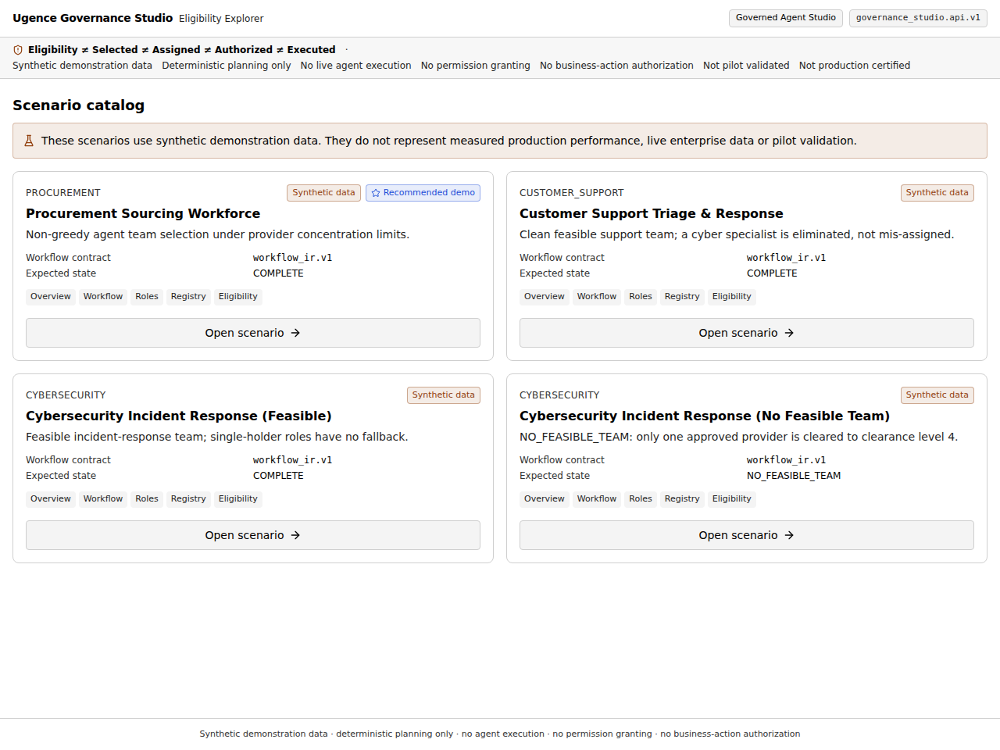

- **Shows:** the pinned synthetic scenarios, each with its title and maturity.
- **Answered by:** `list_scenarios`.
- **Operator can:** open a scenario.
- **Never:** creates, edits or imports a scenario.
- **Ruling:** P3B/P3C screen audit; the frozen v1 contract.

#### Enter, press, expect

*On the live deployment:* works in full.

| Step | Do this | Expect |
|---|---|---|
| 1 | Open `https://studio-web-production-65e8.up.railway.app/scenarios`. | Four cards: Procurement Sourcing Workforce (badged *Recommended demo*), Customer Support Triage & Response, Cybersecurity Incident Response (Feasible), Cybersecurity Incident Response (No Feasible Team). Each shows *Synthetic data*, `Workflow contract = workflow_ir.v1` and its expected state. |
| 2 | Press **Open scenario** on the procurement card. | The overview at `/scenarios/procurement`. |

**Values you can type**

- There is nothing to type on this screen. The expected states are `COMPLETE` for three scenarios and `NO_FEASIBLE_TEAM` for the fourth.

*Source:* `frontend/src/features/scenarios/ScenarioCatalog.tsx:8-76`; `backend/.../scenarios/catalog.py:36-66`.

### 2 · Scenario overview (`/scenarios/:id`)
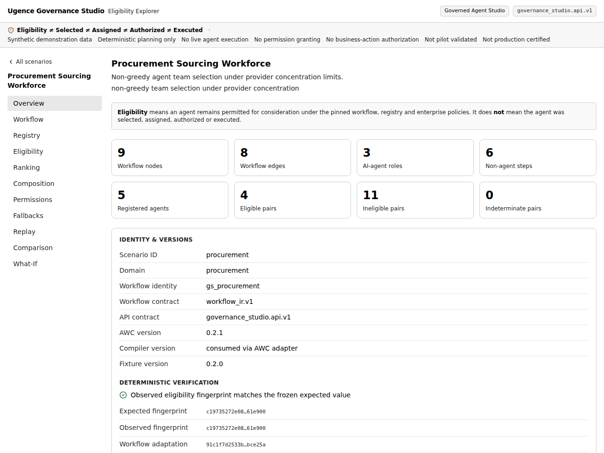

- **Shows:** metadata, versions, verification, digests, maturity and presentation counts.
- **Answered by:** `get_scenario`, `get_scenario_workflow`, `get_scenario_registry`, `get_scenario_eligibility`, `get_version`.
- **Operator can:** read, and navigate to the other screens.
- **Never:** shows a ranking or team-selection metric.
- **Ruling:** screen audit §12.

#### Enter, press, expect

*On the live deployment:* works in full.

| Step | Do this | Expect |
|---|---|---|
| 1 | Open `/scenarios/procurement`. | Identity block: Scenario ID `procurement`, Workflow identity `gs_procurement`, contract `workflow_ir.v1`, fixture version `0.2.0`. Tiles: 9 nodes, 8 edges, 3 AI-agent roles, 6 non-agent steps, 5 agents, 4 eligible pairs, 11 ineligible, 0 indeterminate. |
| 2 | Read the *Deterministic verification* line. | Green check: *Observed eligibility fingerprint matches the frozen expected value* (`sha256:e179463…a2833`). |
| 3 | Open `/scenarios/cybersecurity_no_feasible_team`. | 7 nodes, 6 edges, 2 roles, 4 agents, 2 eligible, 6 ineligible; headline names the infeasibility. |

**Values you can type**

- customer_support: 6 nodes, 5 edges, 3 roles, 6 agents, 7 eligible, 11 ineligible.
- cybersecurity_success: 9 nodes, 8 edges, 4 roles, 6 agents, 5 eligible, 19 ineligible.

*Source:* `expected_outputs/<id>/adaptation.json`, `eligibility.json`; `demo_data/<id>/scenario_manifest.json`; `ScenarioOverview.tsx:65-106`.

### 3 · Workflow (`/workflow`)
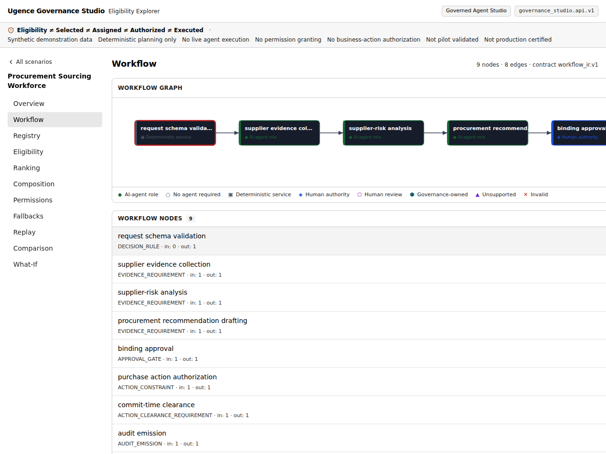

- **Shows:** the compiled workflow as a graph and an accessible list, synchronised with a node details panel; complete node and edge accounting; every disposition as the API returned it.
- **Answered by:** `get_scenario_workflow`.
- **Operator can:** select nodes, zoom, fit.
- **Never:** edits the workflow or computes a disposition in the browser.
- **Ruling:** screen audit §13 to §15.

#### Enter, press, expect

*On the live deployment:* works in full.

| Step | Do this | Expect |
|---|---|---|
| 1 | Open `/scenarios/procurement/workflow`. | Header *9 nodes · 8 edges · contract workflow_ir.v1*; the first node is pre-selected. |
| 2 | Click node `proc_supplier_evidence` in the graph or the list. | Details panel: disposition `AI_AGENT_ELIGIBLE`, link **View role requirements**. |
| 3 | Click `proc_binding_approval`. | Disposition `HUMAN_AUTHORITY_REQUIRED`; no role link. |

**Values you can type**

- procurement dispositions: `proc_request_validation` DETERMINISTIC_SERVICE_PREFERRED; `proc_supplier_evidence`, `proc_supplier_risk`, `proc_recommendation` AI_AGENT_ELIGIBLE; `proc_binding_approval` HUMAN_AUTHORITY_REQUIRED; `proc_purchase_auth`, `proc_commit_clearance` EXISTING_GOVERNANCE_CAPABILITY_OWNS_STEP; `proc_audit` DETERMINISTIC_SERVICE_PREFERRED; `proc_terminal` NO_AI_AGENT_REQUIRED.

*Source:* `expected_outputs/procurement/adaptation.json`; `WorkflowScreen.tsx:29-33`; `NodeDetails.tsx:75-80`.

### 4 · Role (`/roles/:roleId`)
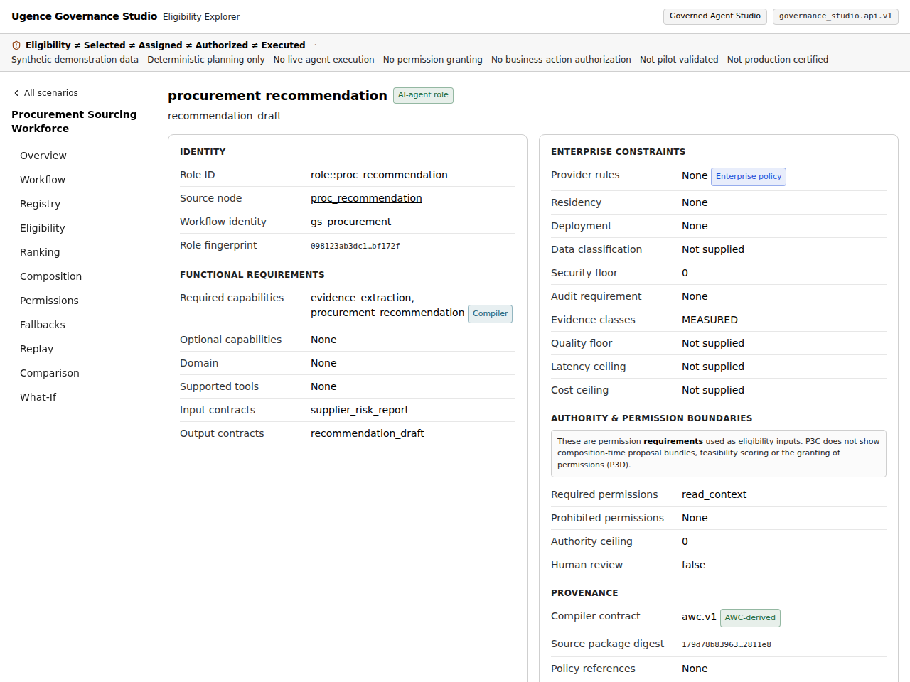

- **Shows:** one role's requirements, each field badged with its source: compiler, enterprise policy or composer.
- **Answered by:** `get_scenario_workflow`.
- **Operator can:** read.
- **Never:** infers a field.
- **Ruling:** screen audit §16.

#### Enter, press, expect

*On the live deployment:* works in full.

| Step | Do this | Expect |
|---|---|---|
| 1 | Open `/scenarios/procurement/roles/role::proc_supplier_evidence` (type the double colon literally). | Heading *supplier evidence collection*, badge *AI-agent role*; required capabilities `evidence_extraction`, `supplier_evidence_collection` badged *Compiler*; source node `proc_supplier_evidence`. |
| 2 | Type a wrong id, e.g. `/scenarios/procurement/roles/role::nope`. | Empty state: *Role not found · No AI-agent role role::nope in this scenario.* |

**Values you can type**

- procurement: `role::proc_supplier_evidence`, `role::proc_supplier_risk`, `role::proc_recommendation`.
- customer_support: `role::sup_triage`, `role::sup_retrieval`, `role::sup_draft`.
- cybersecurity_success: `role::sec_evidence_collection`, `role::sec_threat_analysis`, `role::sec_incident_correlation`, `role::sec_recommendation`.
- cybersecurity_no_feasible_team: `role::sec_threat_analysis`, `role::sec_incident_correlation`.

*Source:* `expected_outputs/<id>/adaptation.json` → `role_requirements`; `RoleScreen.tsx:22-116`.

### 5 · Agent registry (`/registry`)
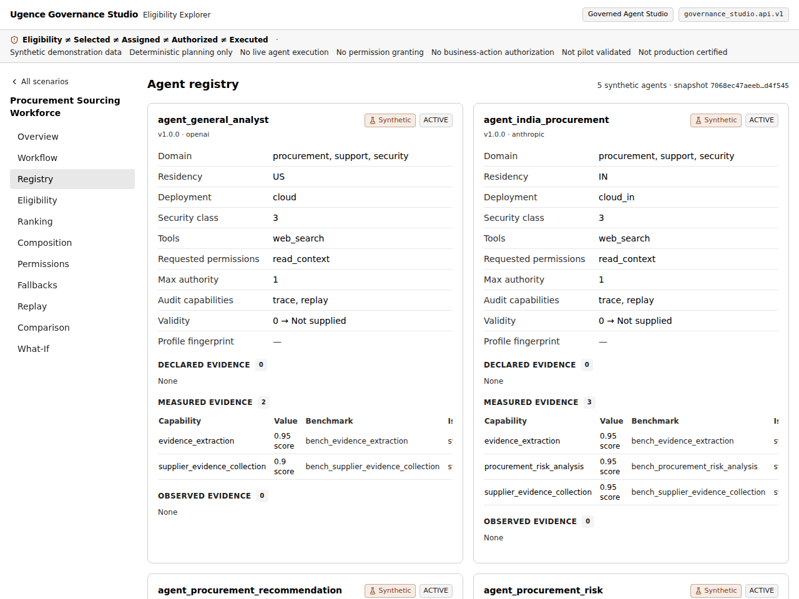

- **Shows:** the pinned synthetic agent registry; evidence grouped as DECLARED, MEASURED or OBSERVED, always labelled synthetic; expired evidence stays visible and flagged.
- **Answered by:** `get_scenario_registry`.
- **Operator can:** read.
- **Never:** hides expired evidence or registers an agent.
- **Ruling:** screen audit §17.

#### Enter, press, expect

*On the live deployment:* works in full.

| Step | Do this | Expect |
|---|---|---|
| 1 | Open `/scenarios/procurement/registry`. | Header *5 synthetic agents · snapshot sha256:7068ec4…d545*. Five agent cards, evidence grouped DECLARED / MEASURED / OBSERVED, each badged *Valid* or *Expired*. |
| 2 | Find `agent_india_procurement@1.0.0`. | Provider `anthropic`, residency `IN`, deployment `cloud_in`; the one non-US agent, which the eligibility screen eliminates. |

**Values you can type**

- procurement agents: `agent_general_analyst@1.0.0` (openai, US), `agent_india_procurement@1.0.0` (anthropic, IN), `agent_procurement_recommendation@1.2.0`, `agent_procurement_risk@2.1.0`, `agent_supplier_evidence@1.4.0` (anthropic, US).
- cybersecurity_success includes `agent_low_clearance@1.0.0` at security level 2, eliminated on every role.

*Source:* `demo_data/<id>/agent_registry_snapshot.json`; `RegistryScreen.tsx:13-103`.

### 6 · Eligibility matrix (`/eligibility`)
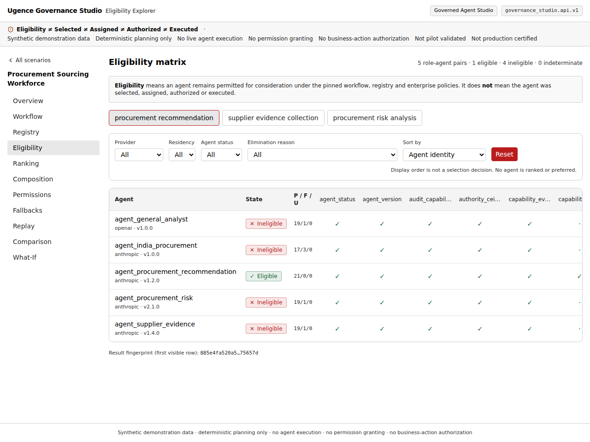

- **Shows:** agents by rows, API-provided condition names by columns, every state from the API; an explanation drawer per cell.
- **Answered by:** `get_scenario_eligibility`, `explain_eligibility`.
- **Operator can:** filter, reset filters, open an explanation.
- **Never:** shows a score, rank, recommendation or preference.
- **Ruling:** screen audit §18 to §20; the primary P3C screen.

#### Enter, press, expect

*On the live deployment:* works in full.

| Step | Do this | Expect |
|---|---|---|
| 1 | Open `/scenarios/procurement/eligibility`. | Role *supplier evidence collection* selected; header *5 role-agent pairs · 2 eligible · 3 ineligible · 0 indeterminate*; 21 condition columns. |
| 2 | Set **Provider** to `anthropic`. | Four rows remain. |
| 3 | Set **Elimination reason** to `RESIDENCY_MISMATCH`. | One row: `agent_india_procurement@1.0.0`, INELIGIBLE, failed `residency` and `deployment`. |
| 4 | Press **Explain** on that row. | Drawer: reason *Residency does not satisfy the requirement*, evidence refs `ev::agent_india_procurement::…::MEASURED`, policy refs `gs_procurement_enterprise_policy`, `gs_eligibility_policy`, both fingerprints. |
| 5 | Press **Reset**, then choose role *procurement recommendation*. | 1 eligible (`agent_procurement_recommendation@1.2.0`), 4 ineligible. |

**Values you can type**

- Filters are selects only; over-filtering shows *No agents match the filters*.
- customer_support: `agent_threat_analysis@1.0.0` is ineligible on all three roles (MISSING_REQUIRED_CAPABILITY).
- cybersecurity_success: `agent_low_clearance@1.0.0` fails `security_classification` on every role.

*Source:* `expected_outputs/procurement/eligibility.json`; `EligibilityScreen.tsx:75-205`; `ExplanationDrawer.tsx:84-126`.

### 7 · Ranking (`/ranking`)
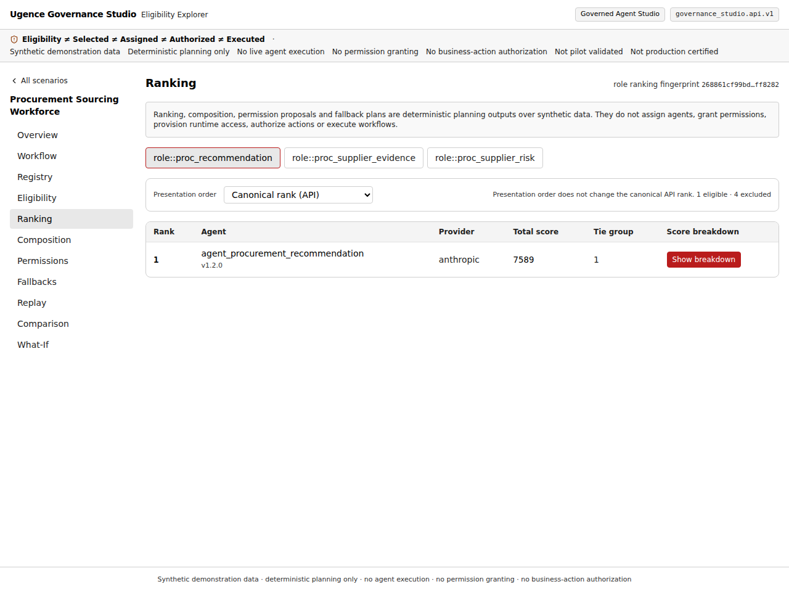

- **Shows:** the canonical API rank order, score decomposition and tie-break as the API gave them.
- **Answered by:** `get_scenario_ranking`, `explain_ranking`.
- **Operator can:** switch to canonical order.
- **Never:** computes a score in the browser.
- **Ruling:** P3D §12 to §13.

#### Enter, press, expect

*On the live deployment:* works in full.

| Step | Do this | Expect |
|---|---|---|
| 1 | Open `/scenarios/procurement/ranking`; role `role::proc_supplier_evidence`. | Rank 1 `agent_supplier_evidence@1.4.0` total 7819; rank 2 `agent_general_analyst@1.0.0` total 7604; caption *2 eligible · 3 excluded*. |
| 2 | Press **Show breakdown** on rank 1. | Eight criteria in order: evidence_strength, evidence_freshness, measured_quality, observed_reliability, latency_headroom, cost_efficiency, security_headroom, audit_strength; tie-break vector begins `7819, 5000, 9090`. |
| 3 | Change **Presentation order** to *identity*, then press **Reset to canonical rank**. | Rows reorder, then return to API order. |

**Values you can type**

- customer_support sup_triage: `agent_support_triage` 7859 over `agent_multilingual_support` 7579.
- cybersecurity_no_feasible_team: one candidate per role, 7889 and 7869.

*Source:* `expected_outputs/<id>/ranking.json`; `RankingScreen.tsx:55-152`.

### 8 · Composition (`/composition`)
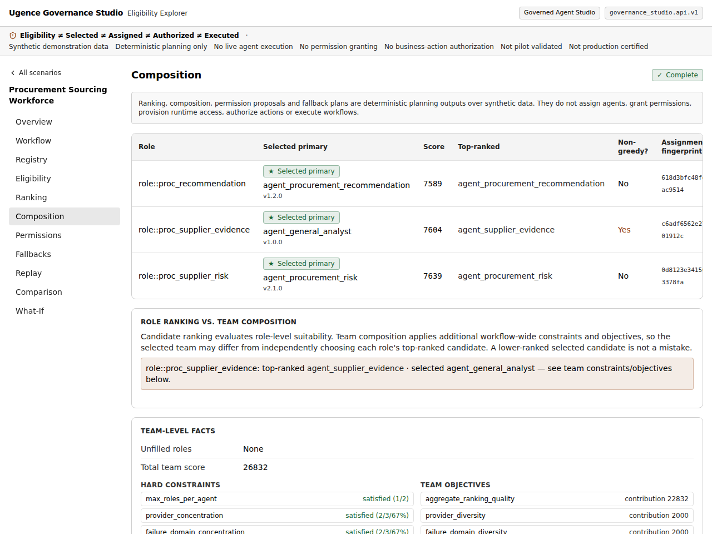

- **Shows:** plan state, assignments, team-level facts, the non-greedy explanation, distinct selection states, and an honest NO_FEASIBLE_TEAM view.
- **Answered by:** `get_scenario_plan`, `explain_plan`.
- **Operator can:** read.
- **Never:** reruns the composition search.
- **Ruling:** P3D §14 to §17.

#### Enter, press, expect

*On the live deployment:* works in full.

| Step | Do this | Expect |
|---|---|---|
| 1 | Open `/scenarios/procurement/composition`. | Plan `COMPLETE`, id `plan::a403d4bf91a614b5`, team score 26832; assignments `role::proc_recommendation → agent_procurement_recommendation@1.2.0`, `role::proc_supplier_evidence → agent_general_analyst@1.0.0`, `role::proc_supplier_risk → agent_procurement_risk@2.1.0`. |
| 2 | Read the *Non-greedy* column. | *Yes* only on `role::proc_supplier_evidence`: the top-ranked agent (7819) was not chosen, to keep provider concentration at 2 of 3 under the 67% limit. Optimality `EXACT_OPTIMUM`, search space 2, feasible teams 1. |
| 3 | Open `/scenarios/cybersecurity_no_feasible_team/composition`. | The `NO_FEASIBLE_TEAM` card: no assignments, score 0, feasible teams 0, termination *exhaustive bounded search complete*. Both roles are fillable only by anthropic agents against a 60% concentration limit and minimum provider diversity 2. |

**Values you can type**

- This screen has no controls.

*Source:* `expected_outputs/<id>/agent_team_plan.json`; `demo_data/cybersecurity_no_feasible_team/composition_policy.json`; `CompositionScreen.tsx:118-237`.

### 9 · Permission proposals (`/permissions`)
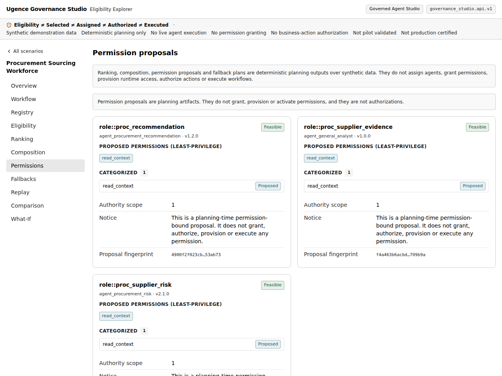

- **Shows:** composition-time permission proposals, categorised, with feasibility.
- **Answered by:** `get_scenario_plan`.
- **Operator can:** read.
- **Never:** describes a proposal as granted, provisioned, active or authorized. A grant is an authority act, and no screen performs one (SD-2).
- **Ruling:** P3D §18 to §19.

#### Enter, press, expect

*On the live deployment:* works in full.

| Step | Do this | Expect |
|---|---|---|
| 1 | Open `/scenarios/procurement/permissions`. | Three cards, one per assigned role, each *Feasible*, proposed permission `read_context` categorised `PROPOSED`, notice *This is a planning-time permission-bound proposal…* |
| 2 | Open `/scenarios/cybersecurity_no_feasible_team/permissions`. | Empty state: *No permission proposals*. |

**Values you can type**

- No controls.

*Source:* `PermissionScreen.tsx:19-36`; `expected_outputs/<id>/agent_team_plan.json`.

### 10 · Fallbacks (`/fallbacks`)
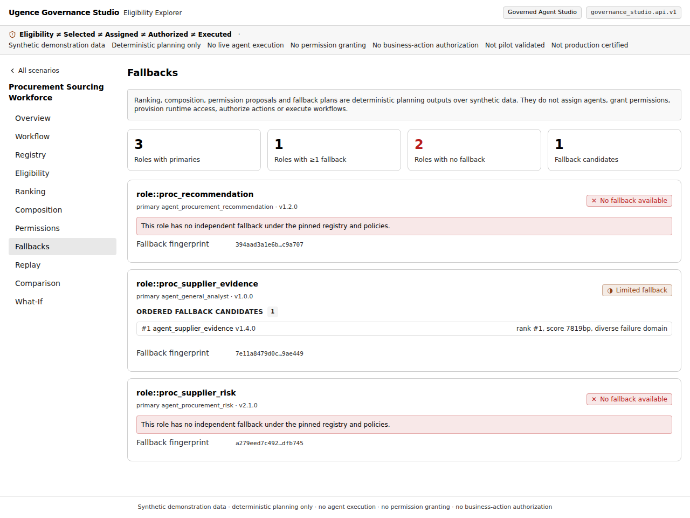

- **Shows:** every role's fallback coverage or gap; the summary counts API-returned states only.
- **Answered by:** `get_scenario_plan`.
- **Operator can:** read.
- **Never:** selects a fallback.
- **Ruling:** P3D §20 to §21.

#### Enter, press, expect

*On the live deployment:* works in full.

| Step | Do this | Expect |
|---|---|---|
| 1 | Open `/scenarios/procurement/fallbacks`. | Tiles 3 roles / 1 complete or partial / 2 without fallback / 1 candidate. `role::proc_supplier_evidence` PARTIAL with `agent_supplier_evidence v1.4.0` (*rank #1, score 7819bp, diverse failure domain*); the other two roles `NO_FALLBACK_AVAILABLE`. |
| 2 | Open `/scenarios/customer_support/fallbacks`. | `role::sup_retrieval` COMPLETE with two candidates; the other two PARTIAL. |

**Values you can type**

- No controls.

*Source:* `FallbackScreen.tsx:26-42`; `expected_outputs/<id>/agent_team_plan.json`.

### 11 · Replay (`/replay`)
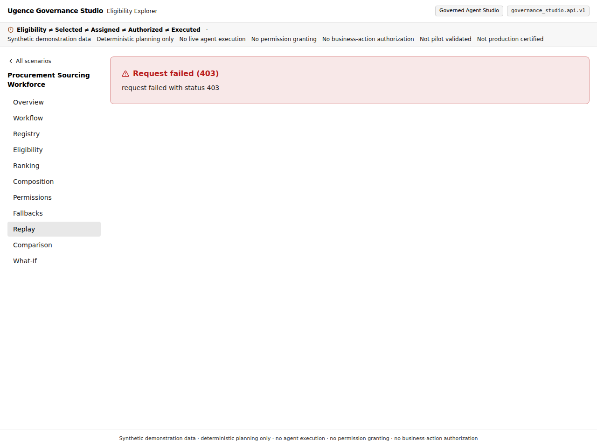

- **Shows:** deterministic reconstruction of the plan and whether it matched; a mismatch is a prominent integrity state; a deterministic export.
- **Answered by:** `replay_plan`, `export_scenario`.
- **Operator can:** run the replay, export the scenario.
- **Never:** reruns agent execution or suppresses a mismatch.
- **Ruling:** P3D §22 and §26.

#### Enter, press, expect

*On the live deployment:* works in full.

| Step | Do this | Expect |
|---|---|---|
| 1 | Open `/scenarios/procurement/replay`. | Runs on load. Green check: *Plan replayed deterministically (fingerprints match)*; expected and replayed fingerprint both `sha256:c197352…e900`. |
| 2 | Press **Load export manifest**, then **Download export bundle**. | `governance-studio-procurement-export.json` is saved locally. |

**Values you can type**

- Plan fingerprints: customer_support `sha256:16ca014…e8ae8`, cybersecurity_success `sha256:9be9cf6…4be98`, cybersecurity_no_feasible_team `sha256:e4d7ebd…f147b`.
- A mismatch would render *REPLAY MISMATCH — integrity check failed*; it cannot occur on the frozen data.

*Source:* `ReplayScreen.tsx:54-92`; `demo_data/<id>/scenario_manifest.json` → `expected_fingerprints.plan_fingerprint`.

### 12 · Plan comparison (`/compare`)
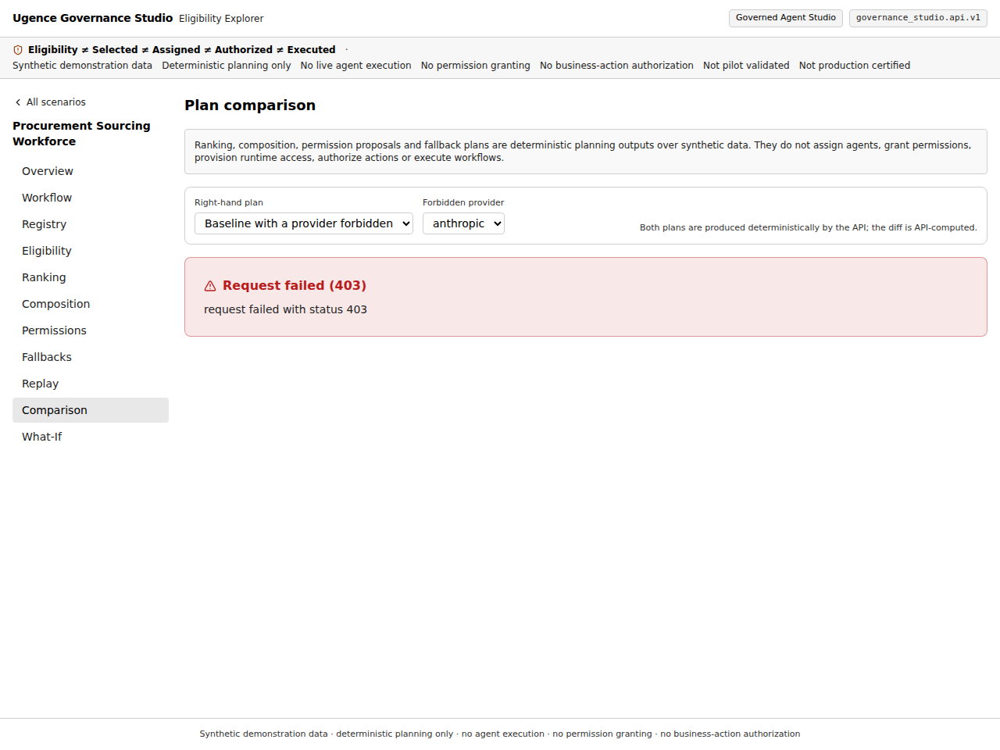

- **Shows:** the API's diff of two deterministically produced plans from the same scenario.
- **Answered by:** `compare_plans`.
- **Operator can:** choose the two plans.
- **Never:** diffs in the browser.
- **Ruling:** P3D §23.

#### Enter, press, expect

*On the live deployment:* works in full.

| Step | Do this | Expect |
|---|---|---|
| 1 | Open `/scenarios/procurement/compare`. | Right-hand plan defaults to *Baseline with a provider forbidden*, provider `anthropic`. |
| 2 | Leave the defaults. | Same workflow *Yes*; Plan A `sha256:c197352…`, Plan B `sha256:6eebd94…11c6`; 3 assignment changes, each `… -> None`; 3 permission and 3 fallback changes; policy digest change `enterprise`; score delta −26832. |
| 3 | Switch to *Identical baseline (control)*. | *The two plans are identical — no assignment, constraint, permission, fallback or policy change.* |

**Values you can type**

- Provider options: `anthropic`, `openai` (plus `google` on cybersecurity_no_feasible_team). There are no free plan ids; the left plan is always the scenario baseline.

*Source:* `CompareScreen.tsx:17-88`; `frontend/tests/fixtures/procurement.compare.json`.

### 13 · Controlled what-if (`/what-if`)
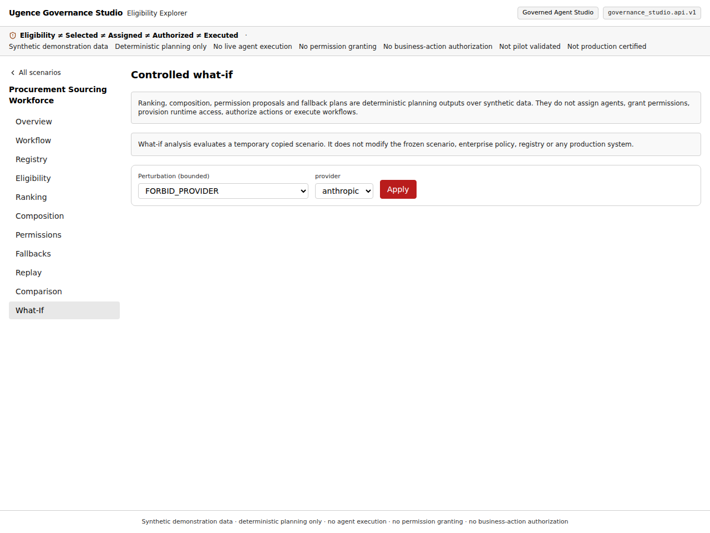

- **Shows:** the modified plan and diff the API returned for one bounded perturbation.
- **Answered by:** `scenario_what_if`.
- **Operator can:** pick one of nine allowlisted operations with constrained controls and apply it.
- **Never:** mutates the frozen scenario; the API evaluates a temporary copy. No arbitrary JSON, policy, URL or code input.
- **Ruling:** P3D §24 to §25, C2.

#### Enter, press, expect

*On the live deployment:* works in full.

| Step | Do this | Expect |
|---|---|---|
| 1 | Open `/scenarios/procurement/what-if`. | Perturbation defaults to `FORBID_PROVIDER`, provider `anthropic`. |
| 2 | Press **Apply**. | State change `COMPLETE → NO_FEASIBLE_TEAM`; 3 assignment, 3 permission, 3 fallback changes; baseline and modified fingerprints differ; *What-if analysis evaluates a temporary copied scenario…* |
| 3 | Press **Reset to baseline**; choose `REMOVE_CANDIDATE`, candidate `agent_supplier_evidence@1.4.0`; **Apply**. | Plan stays COMPLETE; a fallback change on `role::proc_supplier_evidence` (its only fallback is gone). |
| 4 | Choose `TIGHTEN_PROVIDER_CONCENTRATION`, type `25`; **Apply**. | Plan becomes NO_FEASIBLE_TEAM. |
| 5 | Type `150` in the same field. | Inline error *limit_pct must be <= 100*; Apply is disabled. |

**Values you can type**

- The nine operations and a working procurement value each: FORBID_PROVIDER `anthropic`; REQUIRE_RESIDENCY `IN` (the seeded default; drives the plan infeasible); TIGHTEN_COST_CEILING `1.0`; TIGHTEN_LATENCY_CEILING `100.0`; REVOKE_AGENT_VERSION `agent_general_analyst@1.0.0`; EXPIRE_EVIDENCE (no parameter; logical time jumps to 3 000 000); TIGHTEN_PERMISSION_POLICY `invoke_tool`; TIGHTEN_PROVIDER_CONCENTRATION `25`; REMOVE_CANDIDATE `agent_supplier_evidence@1.4.0`.
- Numeric fields start empty and are required; ceilings must be finite and ≥ 0; the concentration limit must be an integer 0 to 100.

**Refusals to expect**

- *ceiling is required*, *must be a finite number*, *ceiling must be >= 0*, *limit_pct must be an integer*, *limit_pct must be <= 100*.

*Source:* `features/whatif/operations.ts:47-184`; `WhatIfScreen.tsx:81-149`; `backend/.../services/orchestration.py:206-288`; `frontend/e2e/what-if-matrix.spec.ts:22-32`.

---

## B · Governance Studio, Governed Agent Studio (12 screens, contract v2)

Every screen here reads the additive `governance_studio.api.v2` contract, twenty-six
operations, amended seven times by sha256-chained record. The studio backend reaches
each governance package only through the eleven-entry SD-1 allowlist. The banner on
every page says no screen here issues, activates, revokes, grants, authorizes, clears
or executes, and a test enforces it on every operation id, path and summary.

### 14 · Registration (`/studio/registration`)
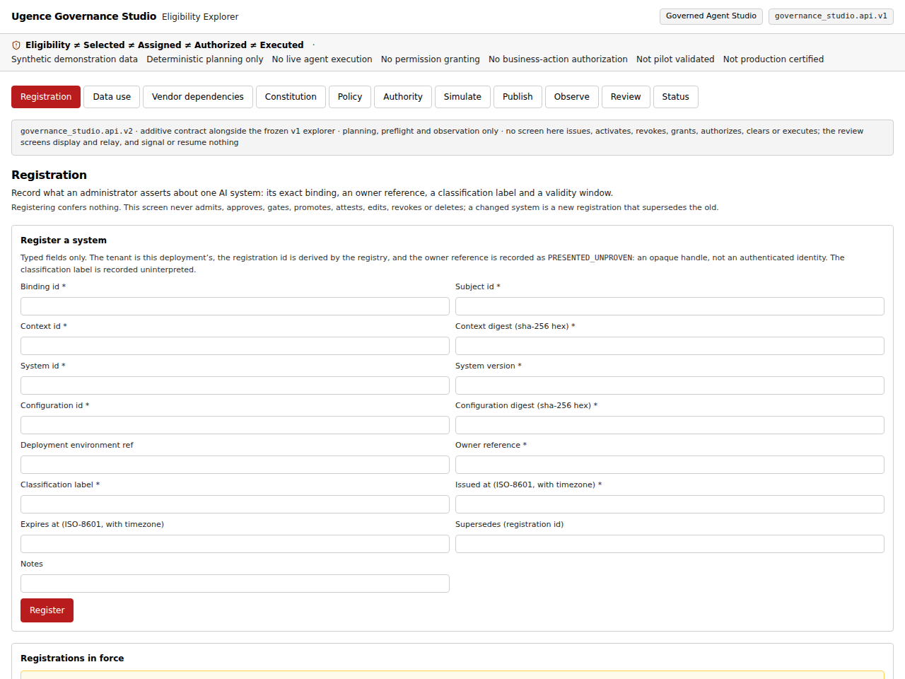

- **Shows:** the systems registered in this deployment's one tenant, as of an instant.
- **Answered by:** `v2_registry_list`, `v2_registry_register`; the `ai-system-registry` package over a sqlite file under the runtime volume.
- **Operator can:** record what an administrator asserts about one AI system: its binding, an owner reference, a classification label and a validity window.
- **Never:** admits, approves, gates, promotes, attests, edits, revokes or deletes; a changed system is a new registration that supersedes the old. Registering confers nothing.
- **Ruling:** front-door seam 5, FD-9; the amendment v2-A1.

#### Enter, press, expect

*On the live deployment:* typed gap `system_registry`: *no system registry is configured: this deployment holds no registration file, so nothing can be recorded or listed* `[I]`. The values below succeed where a registry and the classification vocabulary are composed.

| Step | Do this | Expect |
|---|---|---|
| 1 | Fill the nine binding fields: Binding id `bind-1`; Subject id `subject-1`; Context id `ctx-1`; Context digest 64 lowercase hex (for example 64 × `a`); System id `hiring-screener`; System version `1.0.0`; Configuration id `cfg-1`; Configuration digest 64 × `a`; Deployment environment ref blank. | No error while typing; validation happens on Register. |
| 2 | Owner reference `directory://people/owner-1`; Classification label `HIGH_RISK`; Issued at `2026-09-01T00:00:00+00:00`; Expires at `2027-09-01T00:00:00+00:00`; Notes `first`. | Ready to submit. |
| 3 | Press **Register**. | *Registered reg_… · owner reference PRESENTED_UNPROVEN · confers nothing*; `registry_kind SqliteSystemRegistry`, a derived 32-hex `registration_id`, `record_digest`; the record appears under *Registrations in force* with `as_of_source request`. |
| 4 | Press **Register** again with the same values. | Refused `registration_duplicate`. |

**Values you can type**

- Classification vocabulary `eu-ai-act-system-classification` 1.0.0: `PROHIBITED`, `HIGH_RISK`, `TRANSPARENCY_OBLIGATIONS`, `MINIMAL_RISK`, `UNCLASSIFIED`. The label is recorded uninterpreted; an unknown label is not refused.
- Digests must match `^[0-9a-f]{64}$`; instants must be ISO-8601 with a timezone; there is no tenant, registration id or registered-by field to type.

**Refusals to expect**

- `registration_refused` *AssessedSystemBinding.context_digest must be a lowercase 64-char sha-256 hex digest*; *validity.issued_at must be an ISO-8601 instant with a timezone*; *SystemRegistration.owner_ref must be a non-empty string*; `supersession_refused` when Supersedes names a record that is not this system's predecessor.

*Source:* `RegistrationScreen.tsx:20-147`; `services/studio_v2.py:853-1006`; `backend/tests/test_registry_seam.py:38-86`; vocabulary `docs/vocabularies/eu-ai-act-system-classification/1.0.0.json`.

### 15 · Data use (`/studio/data-use`)
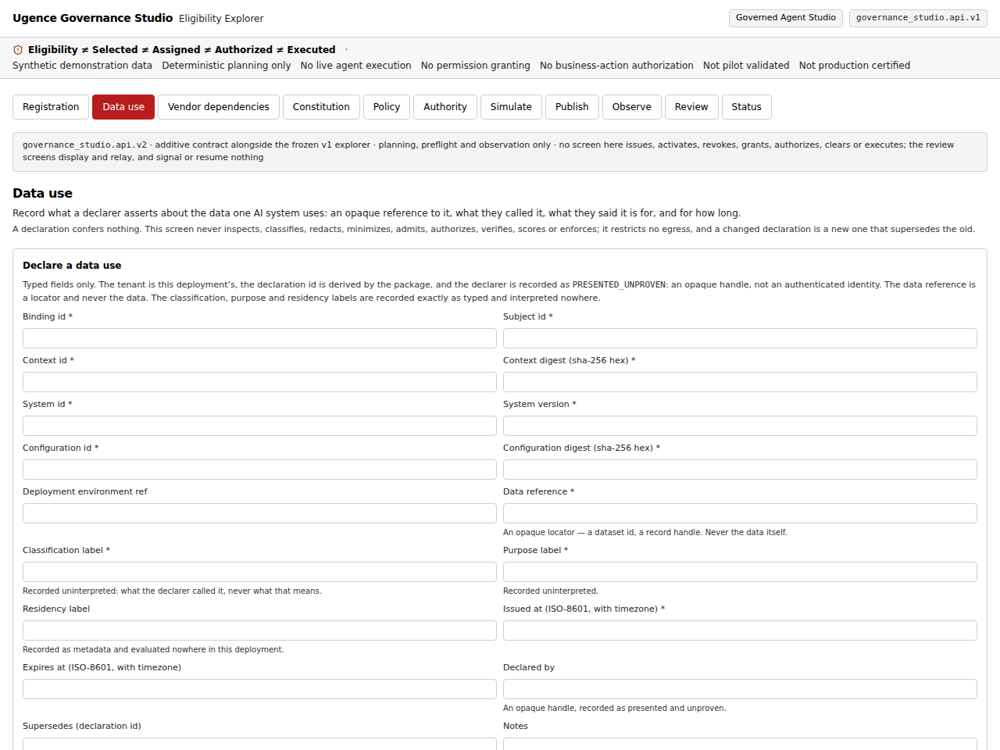

- **Shows:** the data-use declarations of this tenant, as of an instant.
- **Answered by:** `v2_data_use_list`, `v2_data_use_declare`; the `data-use-admission` package.
- **Operator can:** record what a declarer asserts about the data one system uses: an opaque reference, its name, its purpose, for how long.
- **Never:** inspects, classifies, redacts, minimizes, admits, authorizes, verifies, scores or enforces; restricts no egress.
- **Ruling:** front-door seam 8, FD-12; v2-A4.

#### Enter, press, expect

*On the live deployment:* typed gap `data_use_declarations`: *no data-use declarations file is configured* `[I]`.

| Step | Do this | Expect |
|---|---|---|
| 1 | Fill the binding as on screen 14 (digests 64 × `b`). | — |
| 2 | Data reference `dataset://applicants/2026`; Classification label `CONFIDENTIAL`; Purpose label `shortlisting`; Residency label `eu-west`; Issued at `2026-09-01T00:00:00+00:00`; Expires at `2027-09-01T00:00:00+00:00`; Declared by `directory://people/declarer-1`. | Ready to submit. |
| 3 | Press **Declare**. | `declared true`, `store_kind SqliteDataUseDeclarations`, a derived `decl_…` id, `declared_by_status PRESENTED_UNPROVEN`, `confers nothing…`, `egress_restrictions not expressible…`; the declaration is listed. |

**Values you can type**

- Classification vocabulary `data-classification` 1.0.0: `PUBLIC`, `INTERNAL`, `CONFIDENTIAL`, `RESTRICTED`. Purpose vocabulary `data-use-purpose` 1.0.0 is an open shape: any non-empty token is admitted.
- The data reference is an opaque locator, never the data; residency is recorded and evaluated nowhere.

**Refusals to expect**

- `declaration_refused` on a blank data reference or purpose, a label with control characters, a naive instant; `declaration_duplicate`; `supersession_refused`.

*Source:* `DataUseScreen.tsx:24-233`; `studio_v2.py:1014-1161`; `backend/tests/test_data_use_seam.py:55-69`.

### 16 · Vendor dependencies (`/studio/vendor`)
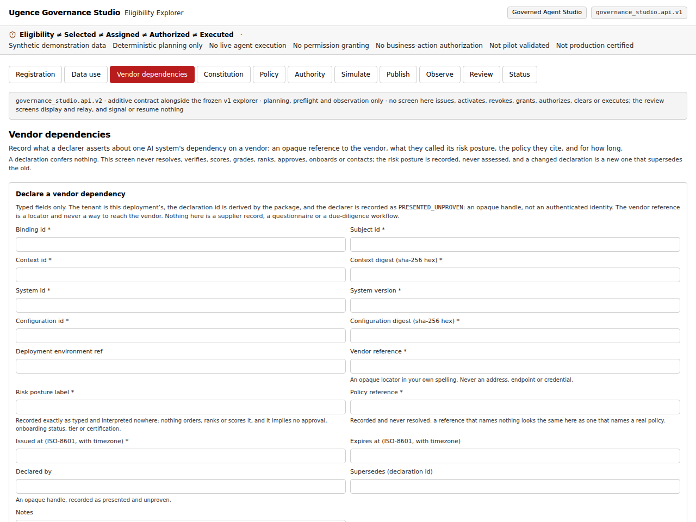

- **Shows:** the vendor-dependency declarations of this tenant.
- **Answered by:** `v2_vendor_list`, `v2_vendor_declare`; the `vendor-dependency` package.
- **Operator can:** record an opaque vendor reference, a risk posture as declared, a cited policy, a window.
- **Never:** resolves, verifies, scores, grades, ranks, approves, onboards or contacts; the risk posture is recorded, never assessed.
- **Ruling:** front-door seam 9, FD-13; v2-A5.

#### Enter, press, expect

*On the live deployment:* typed gap `vendor_declarations`: *no vendor declarations file is configured* `[I]`.

| Step | Do this | Expect |
|---|---|---|
| 1 | Fill the binding as on screen 14 (digests 64 × `e`). | — |
| 2 | Vendor reference `vendor://acme-llm`; Risk posture label `ASSESSED_WITH_FINDINGS`; Policy reference `policy://vendor-standard/v3` (required); Issued at `2026-09-01T00:00:00+00:00`; Expires at `2027-09-01T00:00:00+00:00`; Declared by `directory://people/declarer-1`. | Ready to submit. |
| 3 | Press **Declare**. | `declared true`, a derived id, `risk_posture uninterpreted: … ordered, compared, ranked and scored nowhere`, `confers nothing…`. |

**Values you can type**

- Posture vocabulary `vendor-dependency-assessment-state` 1.0.0: `NOT_ASSESSED`, `ASSESSED_NO_FINDINGS`, `ASSESSED_WITH_FINDINGS`, `ASSESSMENT_LAPSED`, `ASSESSMENT_REFUSED`. The policy reference is text and is never resolved.

**Refusals to expect**

- `vendor_declaration_refused` on a blank vendor or policy reference; `vendor_declaration_duplicate`; `supersession_refused`.

*Source:* `VendorScreen.tsx:23-225`; `studio_v2.py:1207-1344`; `backend/tests/test_vendor_seam.py:51-65`.

### 17 · Constitution (`/studio/constitution`)
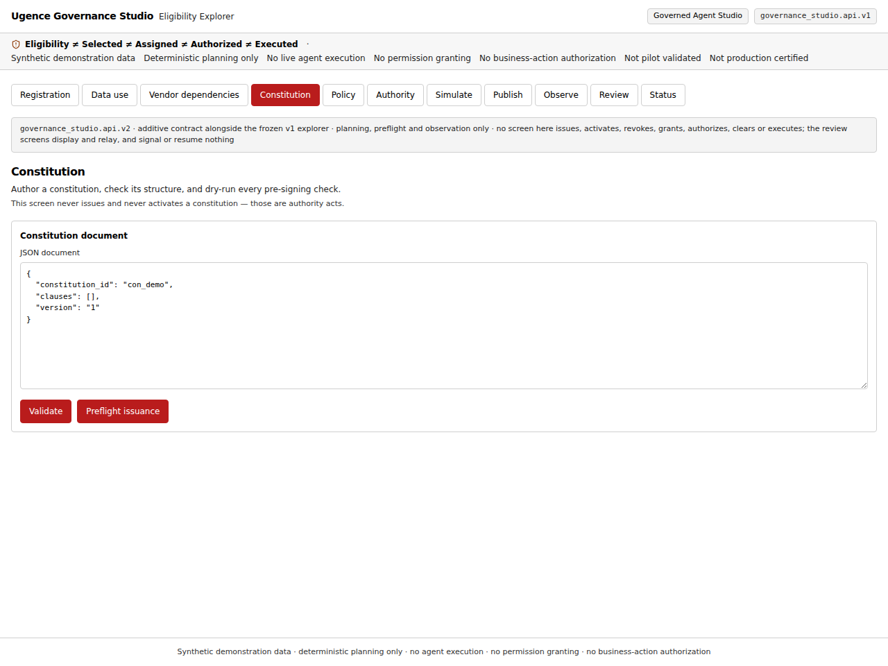

- **Shows:** the structural validation of an authored constitution and a dry run of every pre-signing check.
- **Answered by:** `v2_constitution_validate`, `v2_constitution_preflight`; the constitution policy and activation packages over the activation root handed at composition.
- **Operator can:** author, validate, preflight.
- **Never:** issues or activates a constitution; those entry points are permanently outside the studio's allowlist. Preflight reports a typed gap where no signing key or trust root exists.
- **Ruling:** SD-2; front-door seam 1, FD-5.

#### Enter, press, expect

*On the live deployment:* **Validate** works in full. **Preflight issuance** answers the typed gap `constitution_preflight`: *no ActivationRoot is configured: this repository ships no signing key and no trust root* `[I]`.

| Step | Do this | Expect |
|---|---|---|
| 1 | Press **Validate** on the pre-filled sample `{"constitution_id":"con_demo","clauses":[],"version":"1"}`. | `validation_state INVALID`, diagnostic `invalid_constitution`. The sample is not a constitution artifact; the screen shows that honestly. |
| 2 | Replace the document with the minimal valid constitution listed below and press **Validate**. | `validation_state VALID`, no diagnostics, `constitution_id ugence.agent-constitution/tenant-1/baseline/v1`, a canonical digest. |
| 3 | Reorder `permitted_candidate_dispositions_bound` to put `RECOMMEND_MATCHED_FOR_APPROVAL` first and press **Validate**. | INVALID: lists must be in ascending codepoint order; the package refuses rather than reordering. |
| 4 | Press **Preflight issuance**. | Live: the `constitution_preflight` gap. With a root composed the button still returns `REFUSED` / `approval_reference_unstructured`, because the screen sends no approval reference; a report needs a direct POST (see values). |

**Values you can type**

- Minimal valid document: `{"metadata":{"policy_id":"agent-constitution-baseline","version":"1.0.0","content_digest":"<64 lowercase hex>","scope":"TENANT","lifecycle_state":"APPROVED_ACTIVE","tenant_id":"tenant-1","supersedes_ref":"","supersedes_coordinate":null,"effective_from":"2026-01-01T00:00:00Z","effective_to":"2027-01-01T00:00:00Z"},"agent_constitution_ref":"ugence.agent-constitution/tenant-1/baseline/v1","governed_role_refs":["ugence.roles/tenant-1/proposer-reviewer/v1","ugence.roles/tenant-1/reconciler/v1"],"permitted_candidate_dispositions_bound":["ESCALATE_EXCEPTION","RECOMMEND_MATCHED_FOR_APPROVAL"],"permitted_review_actions_bound":["CREATE_EXCEPTION_REVIEW_BUNDLE"],"permitted_tool_scopes_bound":["scope.evidence-read","scope.report-write"],"constitution_vocabulary_version":"ugence.agent-constitution/clauses/v1"}`
- `scope` is `GLOBAL` (tenant_id must be empty) or `TENANT` (tenant_id required); `lifecycle_state` ∈ DRAFT, APPROVED_ACTIVE, SUPERSEDED, WITHDRAWN and only APPROVED_ACTIVE is issuable.
- Candidate dispositions vocabulary: `ESCALATE_EXCEPTION`, `RECOMMEND_MATCHED_FOR_APPROVAL`, `RECOMMEND_WITHHOLD`, `REQUEST_EVIDENCE`. Review actions: `CREATE_EXCEPTION_REVIEW_BUNDLE`, `ROUTE_APPROVAL_BUNDLE`. Every list unique and sorted; tool scopes may be empty.
- A preflight report (where a root exists) needs `POST /api/v2/constitution/preflight` with `approval_reference` shaped `<approving_authority_id>` + `|` + `<approval_ref>` + `|` + `<64 hex>`; rows artifact-recognition, reference-tenant, supersession, body-digest (passes only if the declared content_digest equals the canonical body digest), lifecycle, effectivity pass, and the approval row fails because the deployment composes a deny-all verifier.

**Refusals to expect**

- *Not valid JSON: …* on a parse error; `invalid_constitution` for any structural fault, including an unsorted or duplicate token, a non-hex digest, a naive datetime, or a GLOBAL scope with a tenant.

*Source:* `ConstitutionScreen.tsx:18-113`; `studio_v2.py:162-230`; `packages/integration/agent-constitution-policy/.../policy.py:144-410`; `backend/tests/test_constitution_real_root.py:64-135`.

### 18 · Policy (`/studio/policy`)
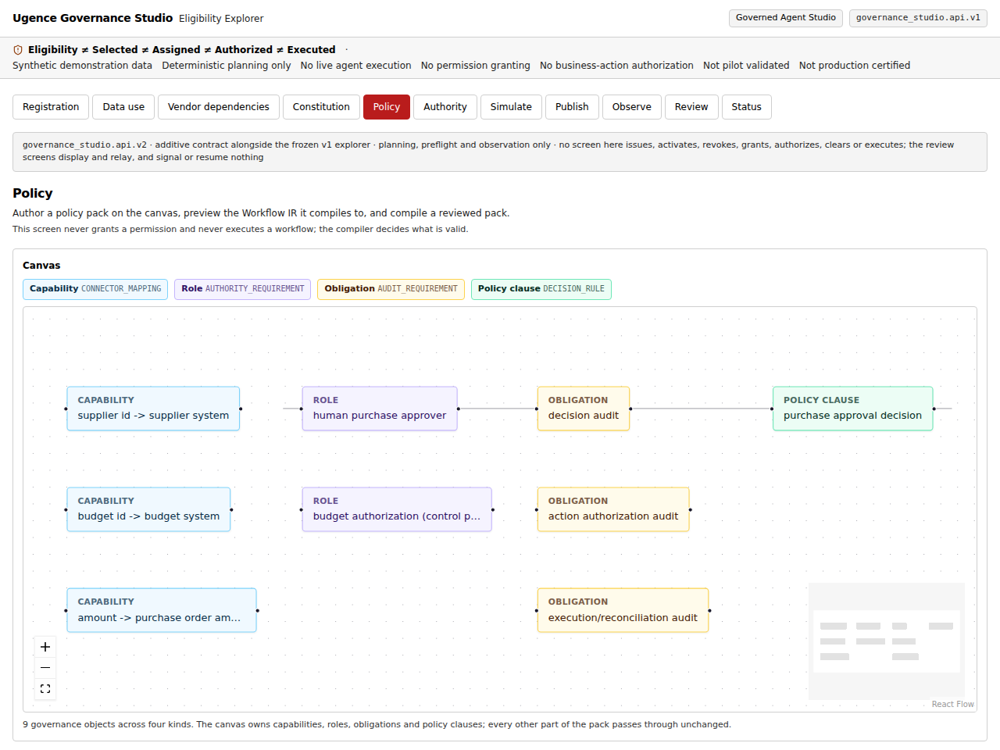

- **Shows:** a policy pack on the canvas, the Workflow IR it compiles to, and the result of compiling a reviewed pack.
- **Answered by:** `v2_policy_validate`, `v2_policy_synthesize`, `v2_policy_compile`; the policy-workflow compiler.
- **Operator can:** author on the canvas, validate, preview, compile. Compile requires a human approval record the compiler validates.
- **Never:** grants a permission or executes a workflow; the compiler decides what is valid. Today the screen works on a frozen fixture pack; a typed pack intake is a candidate for a later ruling.
- **Ruling:** GAS-R3, the canvas as the ratified authoring surface.

#### Enter, press, expect

*On the live deployment:* works in full; the compiler runs in-process.

| Step | Do this | Expect |
|---|---|---|
| 1 | Read the canvas. | 9 governance objects in four kinds: 3 capabilities (supplier id, budget id, amount mappings), 2 roles (human purchase approver; budget authorization), 3 obligations (decision, action authorization, execution/reconciliation audits), 1 policy clause (purchase approval decision). Pack `pack.procurement.reference`, status APPROVED, version 1. |
| 2 | Press **Validate**. | A validation report with `policy_pack_id pack.procurement.reference` and no blocking diagnostics. |
| 3 | Press **Preview Workflow IR**. | `synthesized true`; the nodes of the compiled workflow (the same nine nodes screen 3 shows for procurement). |
| 4 | Press **Compile with approval**. | *Compiled sha256:fb9fd4b9…8158a*; the assurance manifest; the session now holds a release that screen 21 can send. The digest is frozen and identical on every call. |

**Values you can type**

- There is nothing to type: the pack and the approval record are the frozen fixtures `fixtures/v2/policy_pack.json` and `approval_record.json`.
- The approval record the compile requires: id `approval.procurement.reference.fixture`, decision `APPROVED`, pack digest `sha256:28eedf60…98b14`, reviewer `fixture.reviewer` (`procurement_governance_reviewer`), approved 2026-08-03, `is_fixture true`.

**Refusals to expect**

- Omitting the approval (API only) is a 422; a compiler refusal renders *The compiler refused to synthesize this pack* with the exception name.

*Source:* `PolicyScreen.tsx:18-136`; `studio_v2.py:282-306`; `expected_outputs/v2_policy_compile.json`; `backend/tests/test_v2_routes.py:96-125`.

### 19 · Authority (`/studio/authority`)
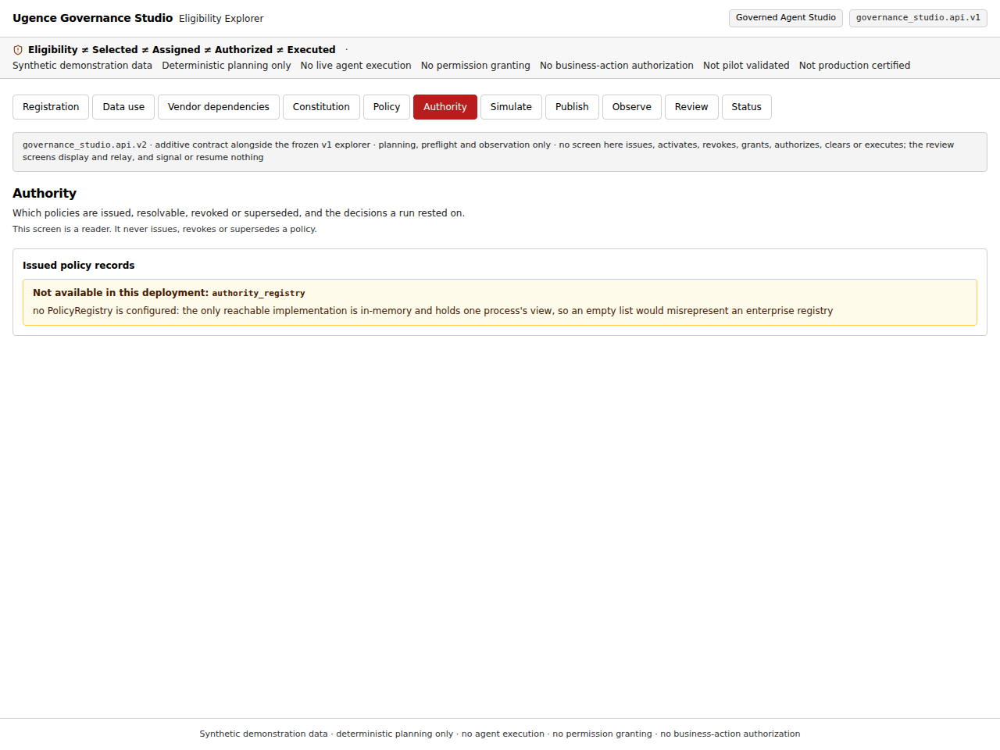

- **Shows:** which policies are issued, resolvable, revoked or superseded, and the decisions a run rested on; which registry answered, with a warning when it is in-memory.
- **Answered by:** `v2_authority_list_policies`, `v2_authority_read_policy`, `v2_authority_read_decision`; the policy-authority registry handed at composition; the decision store is absent by ruling and reports its gap.
- **Operator can:** read.
- **Never:** issues, revokes or supersedes a policy.
- **Ruling:** front-door seam 2, FD-6.

#### Enter, press, expect

*On the live deployment:* typed gap `authority_registry`: *no PolicyRegistry is configured: the only reachable implementation is in-memory…* `[I]`.

| Step | Do this | Expect |
|---|---|---|
| 1 | Open the screen. | One read, no controls. Live: the gap notice above. |
| 2 | Where a sqlite policy registry is composed (compose profile). | *No issued records for the identities this deployment queries* plus `registry_kind SqlitePolicyRegistry` and `identities_queried` such as `agent_governance.agent_constitution\|agent-constitution-baseline\|TENANT\|tenant-1`. The registry ships empty; issuance is outside the studio's allowlist, so nothing ever appears here from a screen. |

**Values you can type**

- No inputs. A policy identity, where configured, is `<policy_family>|<policy_id>|<scope>` with the tenant appended by the composition.

*Source:* `AuthorityScreen.tsx:12-56`; `studio_v2.py:381-460`; `deployment/governance-studio/.../app.py:93-101`.

### 20 · Simulate (`/studio/simulate`)
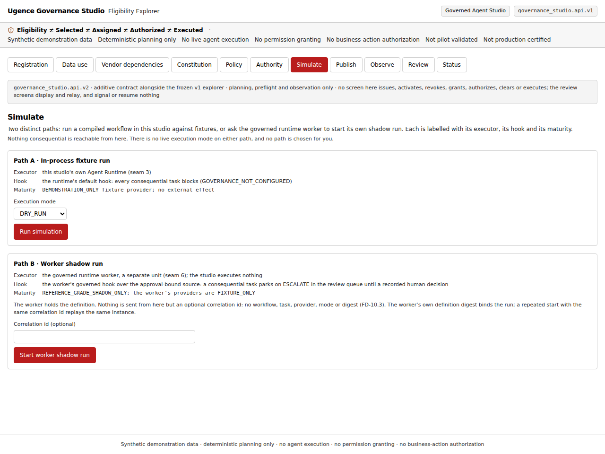

- **Shows:** two labelled paths: a compiled workflow run in the studio against fixtures, or the governed runtime worker's own shadow run started by relay. Each labelled with its executor, hook and maturity. A permissive hook renders as a red alert saying the result is not a governance result.
- **Answered by:** `v2_simulate_run`; `v2_review_start_shadow_run` relayed to the worker; the agent runtime over the one pinned no-network provider.
- **Operator can:** run a simulation in DRY_RUN, SIMULATION or SHADOW; ask the worker to start its own shadow run.
- **Never:** reaches anything consequential. LIVE is absent, not disabled. No path is chosen for the operator.
- **Ruling:** front-door seam 3, FD-7; seam 6, FD-10.

#### Enter, press, expect

*On the live deployment:* both paths answer typed gaps: path A `simulation_providers` (*no fixture provider registry is configured*), path B `review_service` (*no governed review service base URL is configured*) `[I]`.

| Step | Do this | Expect |
|---|---|---|
| 1 | Path A: leave **Execution mode** at `DRY_RUN` and press **Run simulation**. | Where a fixture provider is composed: `execution_mode DRY_RUN`, `runtime_id studio-simulation:DRY_RUN`, an instance id, `governance_hook_configured false`, and a trace in which the one consequential task `t1` BLOCKs with `GOVERNANCE_NOT_CONFIGURED`. The runtime's default hook blocks; this is the fail-closed default, not a governed run. |
| 2 | Path A: repeat with `SIMULATION` and `SHADOW`. | Same shape; the mode is threaded into `runtime_id` and every task argument. `LIVE` is not in the list and the API refuses it with 422 `invalid_execution_mode`. |
| 3 | Path B: type Correlation id `demo-run-1` and press **Start worker shadow run**. | Where the review service is composed: `STARTED — parked; a consequential task waits on the review queue`, `instance_id shadow-<24 hex>`, `workflow_id wf-shadow`, `definition_digest shadow-v1`. Pressing again with the same id: `REPLAYED — this correlation id already names an instance`. |
| 4 | Path B: type `bad id!`. | Inline: *A correlation id is a typed token: letters, digits, '.', '_', ':' and '-', at most 64 characters. Nothing is sent until it is.* |

**Values you can type**

- Path A runs the hard-coded workflow `studio-simulation` with one task `t1` (`prepare` on provider `fixture`, consequential) for at most 8 quanta.
- Correlation id pattern `^[A-Za-z0-9][A-Za-z0-9._:-]{0,63}$`; blank is allowed and the worker mints one. The instance id path B returns is what screens 23 and 24 need.

*Source:* `SimulateScreen.tsx:35-186`; `studio_v2.py:498-581, 747-789`; `deployment/governed-runtime-worker/.../workload.py:110-131`; `backend/tests/test_v2_routes.py:176-289`.

### 21 · Publish (`/studio/publish`)
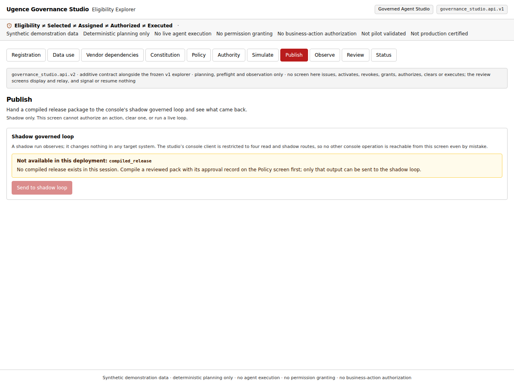

- **Shows:** what the console's shadow governed loop returned for a compiled release package.
- **Answered by:** `v2_publish_shadow`; the console over four allowlisted routes, the mode word pinned to `shadow`.
- **Operator can:** send to the shadow loop.
- **Never:** authorizes an action, clears one or runs a live loop. With no console base URL composed, the screen reports the gap.
- **Ruling:** FD-8.1, FD-8.2; CP-3.

#### Enter, press, expect

*On the live deployment:* the button is disabled until screen 18 has compiled; once pressed it returns the typed refusal `publish_payload_unmapped` on every deployment, and the console seam is unconfigured `[I]`.

| Step | Do this | Expect |
|---|---|---|
| 1 | Open the screen before compiling on screen 18. | Local gap `compiled_release`: *No compiled release exists in this session. Compile a reviewed pack with its approval record on the Policy screen first.* |
| 2 | Compile on screen 18, return, press **Send to shadow loop**. | Refused `publish_payload_unmapped`: *a compiled release package is not a governed-loop request: the console's shadow loop needs an assertion, an action and operational signals that a compiled package does not carry, and the studio invents none of them; name a frozen console scenario_id instead.* |
| 3 | API only: `POST /api/v2/publish/shadow` with `{"scenario_id":"k8s_delete_during_freeze"}`. | With a console base URL composed: `mode SHADOW` and the console's loop result. Without one (the live state): gap `console_api` *no ugence_console_api base URL is configured*. |

**Values you can type**

- The screen has no scenario field; the frozen console ids are `k8s_rollout_restart_clean`, `k8s_delete_during_freeze`, `k8s_unsupported_claim` (pattern `^[A-Za-z0-9][A-Za-z0-9._-]{0,63}$`). Run them on the console itself (screen 26).

*Source:* `PublishScreen.tsx:20-72`; `studio_v2.py:589-642`; `backend/tests/test_publish_pin.py:167-178`.

### 22 · Observe (`/studio/observe`)
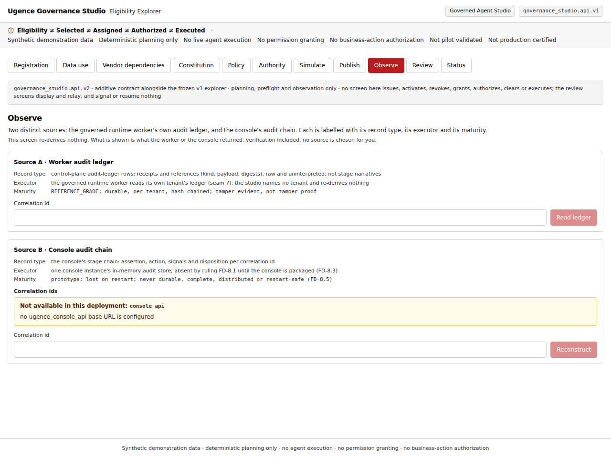

- **Shows:** two distinct sources, never merged: the worker's own audit ledger by correlation id, with the worker's chain verification; and the console's audit chain. Each labelled with record type, executor and maturity. Unreachable, empty, not-found and refused are shown differently.
- **Answered by:** `v2_observe_ledger_chain` relayed to the worker; `v2_observe_audit_ids`, `v2_observe_audit_chain` relayed to the console.
- **Operator can:** read a ledger or a chain by correlation id.
- **Never:** re-derives, re-orders or re-hashes anything; chooses no source for the operator.
- **Ruling:** front-door seam 7, FD-11.4 `TWO_LABELLED_SOURCES`.

#### Enter, press, expect

*On the live deployment:* Source A answers the typed gap `review_service`; Source B answers the gap `console_api` (also true of the captured screen) `[I]`.

| Step | Do this | Expect |
|---|---|---|
| 1 | Source A: type the correlation id you gave screen 20 path B (`demo-run-1`) and press **Read ledger**. | Where the worker relay is composed: `READ`, `chain_verified true`, `entry_count`, and rows of `entry_ref`, `kind`, `recorded_at`, `recorded_by`, `record_digest`; labels *durable, per-tenant, hash-chained… tamper-evident, not tamper-proof*. |
| 2 | Source A: type `never-ran-1`. | *The worker reports no entry of its tenant carrying never-ran-1. That is a typed not-found from a reachable worker, not an empty ledger and not a failure to read it.* |
| 3 | Source B: click a listed correlation id or type one and press **Reconstruct**. | Where a console is composed: the console's stage chain for that id. Live: the `console_api` gap in both the id list and the chain. |

**Values you can type**

- Source A ids follow the same typed-token pattern as screen 20; Source B accepts free text.
- Worker refusals pass through verbatim: `REFUSED_INTEGRITY`, `REFUSED_SCHEMA`, `REFUSED_UNCONFIGURED`.

*Source:* `ObserveScreen.tsx:30-203`; `studio_v2.py:659-673, 797-841`; `deployment/governed-runtime-worker/.../service.py:428-449`.

### 23 · Review Queue (`/studio/review`)
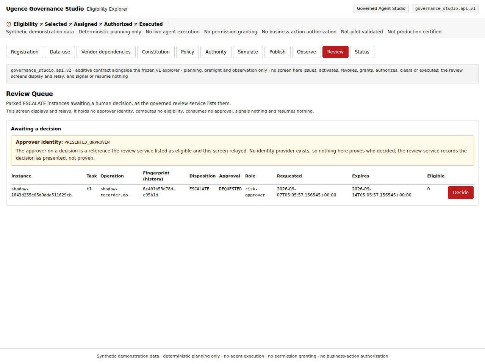

- **Shows:** parked ESCALATE instances awaiting a human decision, as the governed review service lists them.
- **Answered by:** `v2_review_list_queue`, `v2_review_submit_decision`, relayed to the review service over seven allowlisted routes.
- **Operator can:** relay a GRANT or REJECT decision with a justification and an opaque proof header, forwarded unread.
- **Never:** holds an approver identity, computes eligibility, consumes an approval, signals or resumes anything. The approver is presented and unproven until an identity provider is validated.
- **Ruling:** HR-1 `DISPLAY_AND_TRANSMIT`; ID-1 `PASS_THROUGH_OPAQUE_TOKEN`.

#### Enter, press, expect

*On the live deployment:* typed gap `review_service` `[I]`. Even where the review service is composed, the reference directory holds no eligible approver, so no decision can be relayed from the screen.

| Step | Do this | Expect |
|---|---|---|
| 1 | Start a worker shadow run on screen 20 path B, then open the queue. | Where composed: one row: instance `shadow-…`, task `t1`, operation `shadow-recorder.do`, disposition `ESCALATE`, approval `REQUESTED`, role `approver`, requested and expires timestamps, eligible `0`; banner *Approver identity: PRESENTED_UNPROVEN*. |
| 2 | Press **Decide**. | The decision form: **Presented approver** (a select over the eligible approvers the service listed; with none listed the notice reads *The review service reports no eligible approver for approver. Nothing can be relayed until the authority directory reports one.*), **Decision** GRANT or REJECT, **Justification** (required), **Approver proof** (optional password field, forwarded once as `X-Ugence-Approver-Proof`, never stored). |
| 3 | With an eligible approver listed: choose it, GRANT, justification `Shadow run reviewed for the demo`, press submit. | *Recorded by the review service: RECORDED*, `signal_delivered true`, `resume_delivered true`; the instance leaves the queue and screen 24 shows the decision event. |
| 4 | Submit the identical decision again. | `REPLAYED`. A different decision on the same approval: `REFUSED_ALREADY_DECIDED` (*the first decision stands*). |

**Values you can type**

- Only path B on screen 20 produces a queue item; path A blocks in-process and never parks.
- Required role in the reference deployment: `approver` (`UGENCE_REVIEW_REQUIRED_ROLE`). The scope that must hold it is not fixed by any repository value, and the directory has no seed path, so eligibility stays empty until an administrator loads a grant behind the worker's identity gate (AP-3).

**Refusals to expect**

- `REFUSED_INELIGIBLE`, `REFUSED_UNKNOWN_APPROVAL`, `REFUSED_NOT_REVIEWABLE`, `REFUSED_NOT_OPEN`, `REFUSED_ALREADY_DECIDED`, `REFUSED_INVALID_DECISION`; with an identity port composed also `REFUSED_UNAUTHENTICATED`, `REFUSED_IDENTITY_MISMATCH`, `REFUSED_NOT_HUMAN`, `REFUSED_TENANT_UNPROVEN`.

*Source:* `ReviewQueueScreen.tsx:36-332`; `studio_v2.py:710-721`; `packages/integration/governed-review-service/.../service.py:238-251, 487-676`; `RAILWAY_REFERENCE_DEPLOYMENT.md` part 7.7.

### 24 · Run Detail (`/studio/review/:instanceId`)
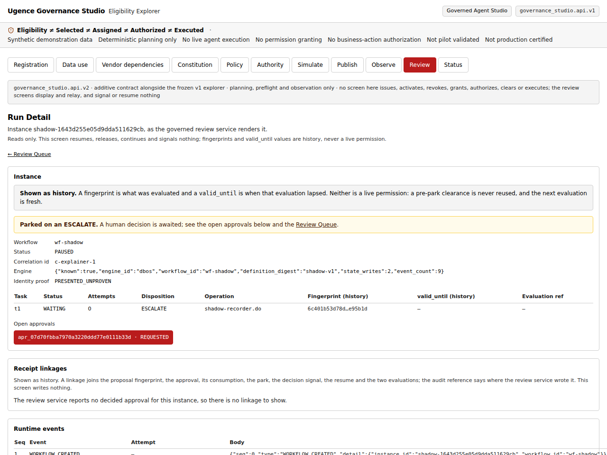

- **Shows:** one run, its events, its approval, and the HE-1 linkage as the review service exposes them.
- **Answered by:** `v2_review_read_run`, `v2_review_read_run_events`, `v2_review_read_approval`.
- **Operator can:** read.
- **Never:** resumes, releases, continues or signals; fingerprints and valid-until values are history, never a live permission.
- **Ruling:** GAS-7 HR-D; HE-5.

#### Enter, press, expect

*On the live deployment:* typed gap `review_service` `[I]`.

| Step | Do this | Expect |
|---|---|---|
| 1 | Click the instance link on screen 23, or open `/studio/review/<instance_id>` with the id screen 20 path B returned. | Where composed: *Shown as history*; *Parked on an ESCALATE. A human decision is awaited…*; workflow `wf-shadow`, status `PAUSED`, the correlation id, engine, identity proof; a task row `t1` with disposition ESCALATE, operation `shadow-recorder.do`, fingerprint and valid-until; open approvals; receipt linkages (`APPENDED`, `ALREADY_APPENDED`, `NOT_YET` or `LEDGER_UNCONFIGURED`); runtime events, including `EXTERNAL_SIGNAL:review_decision` after a decision. |
| 2 | Open `/studio/review/shadow-000000000000000000000000`. | *The review service is reachable and has no record of instance shadow-0000…* (typed not-found). |

**Values you can type**

- No inputs beyond the URL segment; approval panels expand on click.

*Source:* `RunDetailScreen.tsx:1-351`; `api/v2/review.py:28-55`; `governed-review-service/.../service.py:529-560, 712-735`.

### 25 · Status (`/studio/status`)
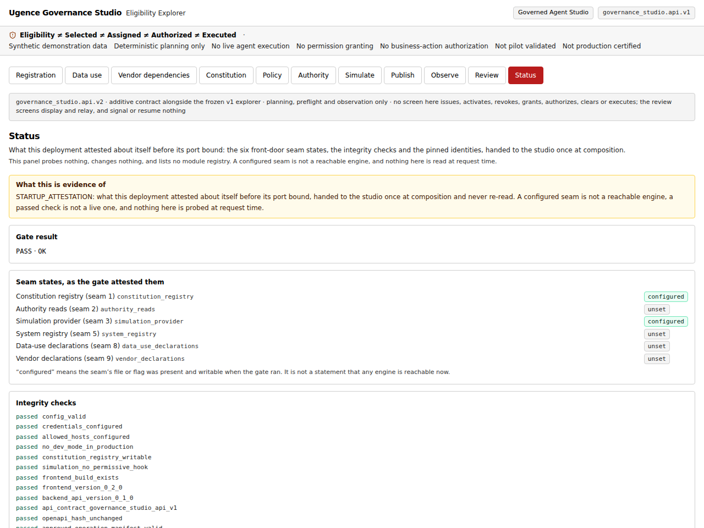

- **Shows:** what the deployment attested about itself before its port bound: the six front-door seam states, the integrity checks, the pinned identities, under a ceiling stating that a configured seam is not a reachable engine.
- **Answered by:** `v2_observe_deployment`; the integrity gate's report, handed to the studio once at composition.
- **Operator can:** read.
- **Never:** probes anything, changes anything, or lists a module registry.
- **Ruling:** MA-2 as amended by MS-1 to MS-5; v2-A7.

#### Enter, press, expect

*On the live deployment:* typed gap `deployment_report`: *no startup integrity report was handed to the studio at composition; this process was not started through the deployment's integrity gate* `[I]`.

| Step | Do this | Expect |
|---|---|---|
| 1 | Open the screen. | Live: the gap above, which itself confirms the bare start command. |
| 2 | Under the Docker/compose profile. | `result PASS` or `FAIL`, a `checks` map, the pinned identities (deployment version, frontend build hash, API contract, OpenAPI sha256, synthetic bundle hash), and six seam chips: `constitution_registry`, `authority_reads`, `simulation_provider`, `system_registry`, `data_use_declarations`, `vendor_declarations`, each `configured`, `unwritable` or `unset`; ceiling *a configured seam is not a reachable engine*. |

**Values you can type**

- No inputs. Setting `UGENCE_STUDIO_SIMULATION_PROVIDER=1` alone in the compose profile flips `simulation_provider` to `configured` and turns screen 20 path A on.

*Source:* `StatusScreen.tsx:24-135`; `studio_v2.py:1505-1592`; `deployment/governance-studio/.../startup_integrity.py:90-243`.

---

## C · Console (3 tabs, the packaged console API)

The console app is a separate deployable. It calls exactly four of the five routes the
packaged `ugence-console-api` serves; the six routes ruling CP-3 withheld are not
called, and the two it used to call show a typed gap. Every answer carries the
service's audit ceiling: one process's view, lost on restart.

### 26 · Governed Loop
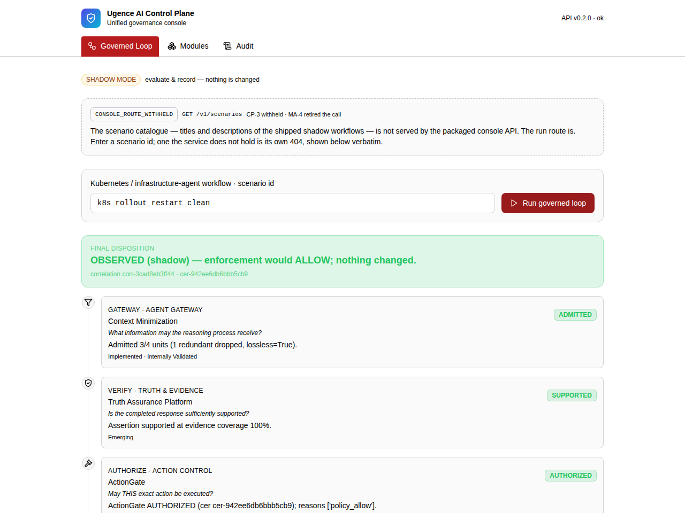

- **Shows:** the shadow governed loop's stage trail for one scenario: gateway, verify, authorize, clear, record, with each module's decision and the final shadow disposition.
- **Answered by:** `POST /v1/governed-loop/scenario/{scenario_id}`.
- **Operator can:** type a scenario id and run the loop in shadow. The catalogue is a typed gap; an unknown id is the service's own 404.
- **Never:** executes anything; the loop evaluates and records, and the mode is shadow.
- **Ruling:** CP-3; MA-4 `RETIRE_THE_TWO_CALLS`.

#### Enter, press, expect

*On the live deployment:* works in full `[V]` per the deployment reference and the demo plan.

| Step | Do this | Expect |
|---|---|---|
| 1 | Open `https://console-web-production-4e77.up.railway.app`, tab **Governed Loop**. Read the amber `SHADOW MODE` pill and the `CONSOLE_ROUTE_WITHHELD` panel (the catalogue route `GET /v1/scenarios` is deliberately not served). | The scenario id box is empty; **Run governed loop** is disabled until it has text. |
| 2 | Type `k8s_rollout_restart_clean`; press **Run governed loop** (or Enter). | Banner *OBSERVED (shadow) — enforcement would ALLOW; nothing changed.* with `correlation corr-<12 hex>` and `cer-942ee6db6bbb5cb9`. Stages: Gateway `ADMITTED` *Admitted 3/4 units (1 redundant dropped, lossless=True)*; Verify `SUPPORTED` *Assertion supported at evidence coverage 100%*; Authorize `AUTHORIZED` *reasons ['policy_allow']*; Clear `CLEAR` *OPERATIONALLY_SAFE*; Record `RECORDED`. |
| 3 | Type `k8s_delete_during_freeze`; run. | *enforcement would BLOCK*; `cer-9d5c7ca5e6c21802`. Gateway, Verify and Authorize identical to step 2, including `AUTHORIZED … policy_allow`; Clear `HOLD` *Operational clearance HOLD: CHANGE_FREEZE_ACTIVE, ERROR_BUDGET_EXHAUSTED*. Policy said yes; clearance said no. |
| 4 | Type `k8s_unsupported_claim`; run. | *enforcement would BLOCK*; `cer-202977ea757e69c9`. Verify `INDETERMINATE` *Assertion indeterminate at evidence coverage 0%* (no evidence refs); Authorize still `AUTHORIZED … policy_allow`; Clear `CLEAR`. Policy said yes; the evidence gate said the claim is not supported. The word on screen is INDETERMINATE, not UNSUPPORTED. |
| 5 | Type `k8s_foo`; run. | Red box, verbatim: `Error: 404 {"detail":"unknown scenario 'k8s_foo'"}`. |

**Values you can type**

- Exactly three scenario ids exist: `k8s_rollout_restart_clean` (ALLOW), `k8s_delete_during_freeze` (HOLD → block), `k8s_unsupported_claim` (INDETERMINATE → block). CER ids are stable per scenario; correlation ids are fresh per run.
- Copy the correlation id from the banner for screen 28.

*Source:* `apps/console/src/views/GovernedLoop.tsx:32-146`; `packages/integration/console-api/.../scenarios.py:33-117`; `orchestrator.py:56-141`; `capabilities/operational_safety.py:20-63`; `docs/deployment/CLIENT_DEMO_PLAN.md:23-42`.

### 27 · Modules
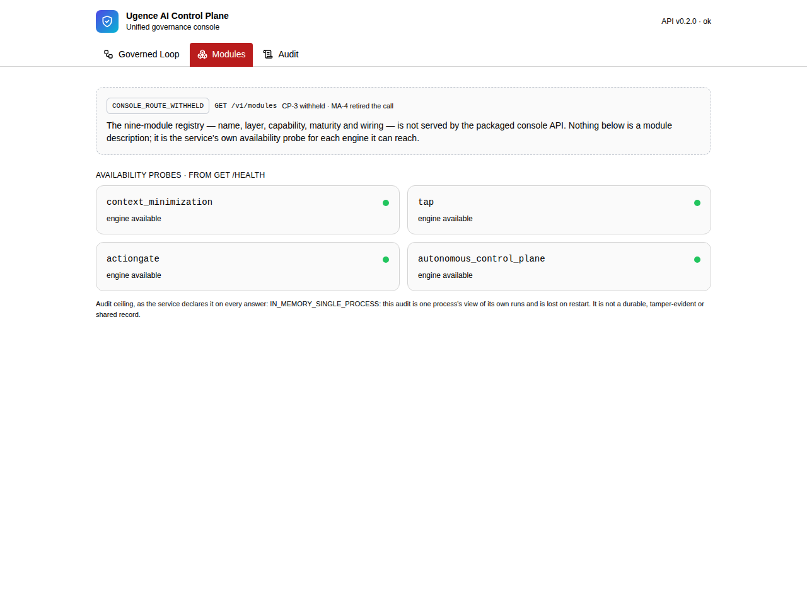

- **Shows:** the service's availability probes for the four engines it can reach, under the keys it returns, and its declared audit ceiling. The nine-module registry is a typed gap.
- **Answered by:** `GET /health`.
- **Operator can:** read.
- **Never:** lists module descriptions, maturity or wiring; those live behind a withheld route.
- **Ruling:** CP-3, CP-4; MA-4.

#### Enter, press, expect

*On the live deployment:* works in full `[V]`.

| Step | Do this | Expect |
|---|---|---|
| 1 | Open tab **Modules**. | `CONSOLE_ROUTE_WITHHELD` panel for `GET /v1/modules`, then *Availability probes · from GET /health*: four cards, in order `context_minimization`, `tap`, `actiongate`, `autonomous_control_plane`, each with a green dot and *engine available*. |
| 2 | Read the ceiling line. | *Audit ceiling, as the service declares it on every answer: IN_MEMORY_SINGLE_PROCESS: this audit is one process's view of its own runs and is lost on restart. It is not a durable, tamper-evident or shared record.* |

**Values you can type**

- No inputs. A grey dot with an import error string means that engine's package did not install; `autonomous_control_plane` is always available.

*Source:* `apps/console/src/views/Modules.tsx:17-63`; `console-api/.../app.py:103-115`; `models.py:23-26`.

### 28 · Audit
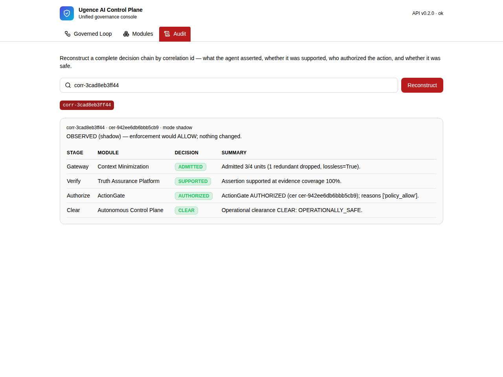

- **Shows:** a decision chain reconstructed by correlation id: what was asserted, whether it was supported, who authorized, whether it was safe.
- **Answered by:** `GET /v1/audit`, `GET /v1/audit/{correlation_id}`.
- **Operator can:** pick or type a correlation id.
- **Never:** re-derives a chain; the console's in-memory store is the record.
- **Ruling:** CP-4 `DECLARE_THE_CEILING`.

#### Enter, press, expect

*On the live deployment:* works in full `[V]`, but only for runs made in the current service process.

| Step | Do this | Expect |
|---|---|---|
| 1 | Run at least one scenario on screen 26 first, then open tab **Audit**. | A row of red chips, one per correlation id from this process, newest last. Before any run the chip row is absent. |
| 2 | Click a chip, or paste a `corr-…` id and press **Reconstruct**. | `corr-… · cer-… · mode shadow`, the final disposition line, and a four-row table Stage / Module / Decision / Summary: Gateway, Verify, Authorize, Clear. The Record stage is not in the stored chain, so the audit shows four rows where the loop showed five. |
| 3 | Paste `corr-deadbeef` and press **Reconstruct**. | `Error: 404 {"detail":"no record for 'corr-deadbeef'"}`. |
| 4 | Press **Reconstruct** with the box empty. | `Error: 404 {"detail":"Not Found"}` (the button is not disabled when empty). |

**Values you can type**

- No ids are pre-seeded; a service restart empties the store (CP-4).

*Source:* `apps/console/src/views/Audit.tsx:8-102`; `console-api/.../audit.py:28-43`; `orchestrator.py:111-125`; `app.py:143-148`.

---

## D · Authority Plane (4 screens, the governed runtime worker's reads)

The administrators' surface, its own deployable (AP-2). At this step it reads and does
not write. Every answer is shown under an identity banner repeating the worker's own
words: the read was not authenticated; the decision proof the deployment can give;
the adapter's issuer validation, still in-process only; and that a grant is what an
administrator loaded. The worker implements loading and revoking a role grant behind
its identity gate (AW-2 to AW-5) but serves neither until the adapter is validated
against a real enterprise issuer (AP-3 controlling, §18); this app has no write
control and its client cannot name a write.

### 29 · Grants
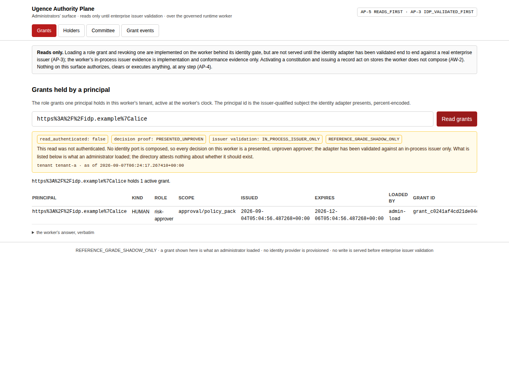

- **Shows:** the role grants one principal holds in the worker's tenant, active at the worker's clock.
- **Answered by:** `GET /authority/grants?principal_id=`; the sqlite authority directory the worker composed.
- **Operator can:** type a principal id and read; follow a grant to its events.
- **Never:** loads or revokes a grant. Those writes are implemented on the worker and not served before enterprise issuer validation (AP-3).
- **Ruling:** AP-5 `READS_FIRST`.

#### Enter, press, expect

*On the live deployment:* works `[V]`; the directory is empty, so every principal holds zero grants. The captured screen shows a seeded local directory (`tenant-a`, principal `https%3A%2F%2Fidp.example%7Calice`, role `risk-approver`) that does not exist on the live worker.

| Step | Do this | Expect |
|---|---|---|
| 1 | Open `https://authority-plane-production.up.railway.app`, tab **Grants**; type `approver` and press **Read grants**. | HTTP 200. Identity banner: chips `read_authenticated: false`, `decision proof: PRESENTED_UNPROVEN`, `issuer validation: IN_PROCESS_ISSUER_ONLY`, `REFERENCE_GRADE_SHADOW_ONLY`; line `tenant tenant-demo · as of <instant>`. Then *approver holds 0 active grants.* and *No grant of this tenant matches, at this instant. An empty list is what the directory holds, not a refusal.* Expand *the worker's answer, verbatim* for the JSON (`result READ`, `grant_count 0`). |
| 2 | Type `https%3A%2F%2Fidp.example%7Calice` and read. | Same: zero grants. The value from the capture is test-only. |
| 3 | Leave the box empty. | The button is disabled; nothing is sent. |
| 4 | Browser console on the plane's origin: `fetch('/api/authority/grants',{method:'POST'}).then(r=>console.log(r.status))`. | `405`; body `{"error":"method_not_allowed","detail":"this front forwards reads only"}`. There is no write path. |

**Values you can type**

- A principal id is any typed token: non-empty, at most 256 characters, no whitespace, NFC. The browser percent-encodes it, so a space becomes `%20` and is still a token (200, zero rows); the 422 `REFUSED_UNTYPED` is reachable only with curl.
- With a grant present the table shows Principal, Kind, Role, Scope, Issued, Expires, Loaded by, Grant id and an **Events** button.

*Source:* `apps/authority-plane/src/views/GrantsView.tsx:7-51`; `components/Identity.tsx:12-51`; `server.mjs:120-165`; `deployment/governed-runtime-worker/.../authority_reads.py:56-152`; `RAILWAY_REFERENCE_DEPLOYMENT.md` part 7.7.

### 30 · Holders
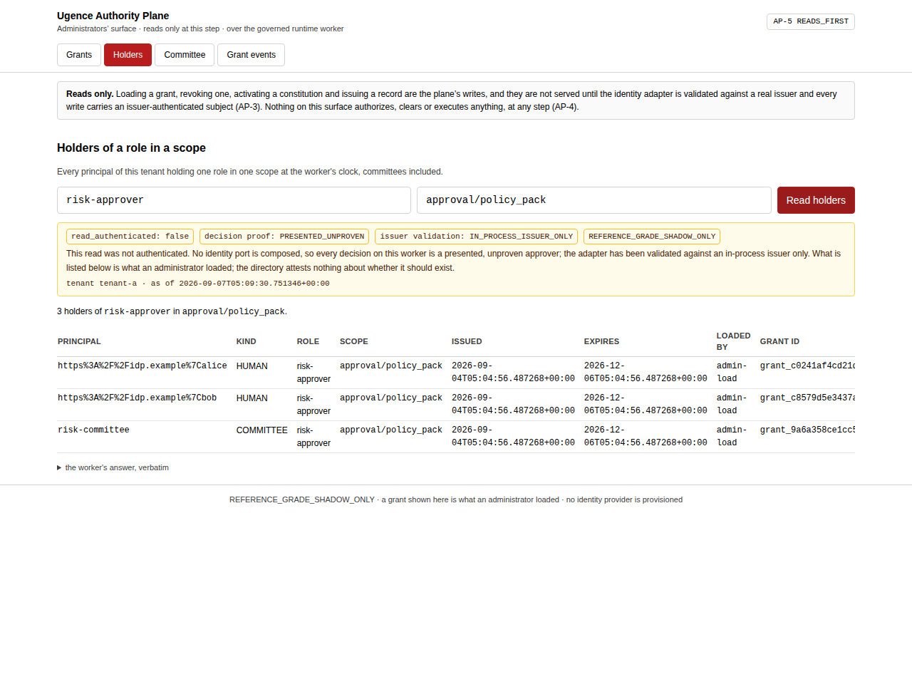

- **Shows:** every principal of the tenant holding one role in one scope, committees included.
- **Answered by:** `GET /authority/holders?role=&scope=`.
- **Operator can:** type a role and scope and read.
- **Never:** changes a holder.
- **Ruling:** AP-5.

#### Enter, press, expect

*On the live deployment:* works `[V]`; zero holders on the empty directory.

| Step | Do this | Expect |
|---|---|---|
| 1 | Tab **Holders**: role `approver`, scope `approval/policy_pack`; press **Read holders** (Enter in the scope field also submits). | HTTP 200, identity banner, *0 holders of approver in approval/policy_pack.*, the *empty list … not a refusal* notice, verbatim JSON with `holder_count 0`. |
| 2 | Leave either field blank. | The button stays disabled. |

**Values you can type**

- `approver` is the deployment's own required role (`UGENCE_REVIEW_REQUIRED_ROLE`). No scope value is fixed by the repository; any typed token returns zero on the live directory.

*Source:* `HoldersView.tsx:11-47`; `authority_reads.py:156-164`.

### 31 · Committee
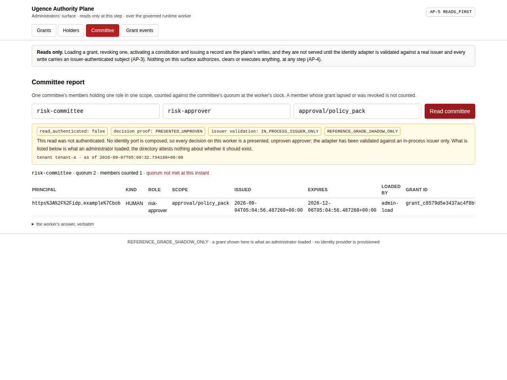

- **Shows:** one committee's counted members against its quorum, at this instant; a lapsed or revoked member is not counted.
- **Answered by:** `GET /authority/committees/{committee_id}?role=&scope=`.
- **Operator can:** read; a missing committee is a typed not-found.
- **Never:** adds a member or changes a quorum.
- **Ruling:** AP-5; directory ruling D-4.

#### Enter, press, expect

*On the live deployment:* works `[V]`; answers a typed 404 on the empty directory, which is the correct result.

| Step | Do this | Expect |
|---|---|---|
| 1 | Tab **Committee**: committee id `risk-committee`, role `approver`, scope `approval/policy_pack`; press **Read committee**. | HTTP 404. No identity banner; instead the grey notice `NOT_FOUND · HTTP 404 · no committee 'risk-committee' holds a grant of 'approver' in 'approval/policy_pack' for this tenant at <instant>`. |
| 2 | Leave any field blank. | The button stays disabled. |

**Values you can type**

- With a committee loaded the line reads `<committee> · quorum N · members counted M · quorum met` (or *not met at this instant*); revoked or lapsed members are not counted.

*Source:* `CommitteeView.tsx:12-55`; `authority_reads.py:91, 174-179`; `CLIENT_DEMO_PLAN.md:122-128`.

### 32 · Grant events
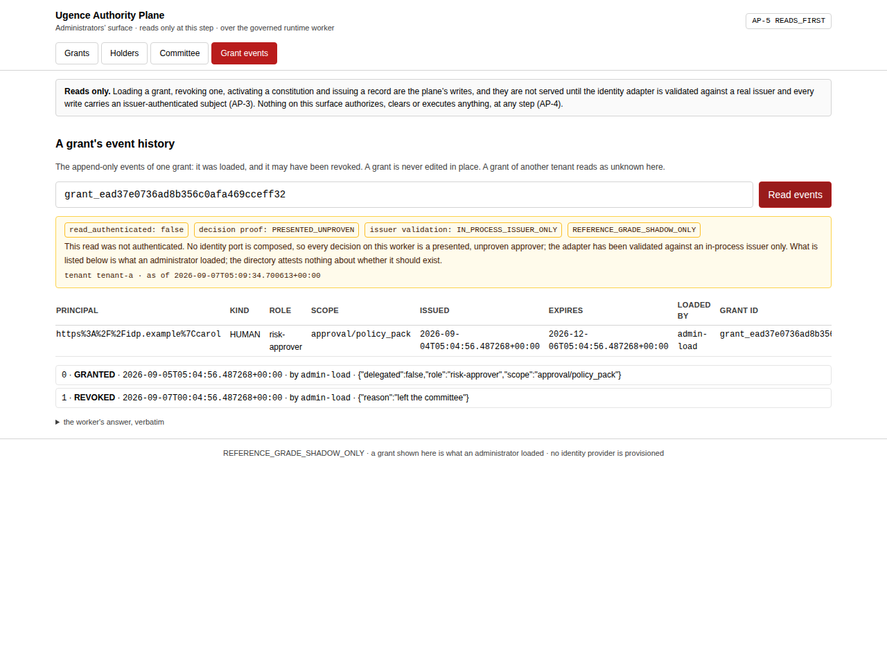

- **Shows:** a grant's append-only history: loaded, and possibly revoked, with the actor recorded. A grant of another tenant reads as unknown.
- **Answered by:** `GET /authority/grants/{grant_id}/events`.
- **Operator can:** read.
- **Never:** edits a grant in place; the directory records loading and revocation only.
- **Ruling:** AP-5; AP-3 for the writes it does not have.

#### Enter, press, expect

*On the live deployment:* works `[V]`; answers a typed 404 for every grant id on the empty directory.

| Step | Do this | Expect |
|---|---|---|
| 1 | Tab **Grant events**: type `grant_abc123`; press **Read events**. | HTTP 404, grey notice `NOT_FOUND · HTTP 404 · this tenant holds no grant 'grant_abc123'`. |
| 2 | Arrive via an **Events** button on a grant row (only possible with data). | The field is pre-filled and read once: the grant row, then an ordered list `<seq> · GRANTED · <instant> · by <actor> · <detail>`, later `REVOKED`; append-only. |

**Values you can type**

- A grant id of another tenant returns the same not-found, deliberately indistinguishable from an unknown id.

*Source:* `EventsView.tsx:12-61`; `authority_reads.py:189-192`; `deployment/governed-runtime-worker/tests/test_authority_reads.py:133-146`.

---

## E · Governance Studio, Bring Your Workflow (1 screen, contract v1)

The one screen on which a document the operator supplies enters the studio. Owner
ruling BW-1 to BW-5 (§22) admitted it as a read-only Workflow IR inspector and
superseded, for this surface only, the earlier "no arbitrary JSON / fixture-upload
input" sentences. The frozen v1 OpenAPI document did not change: three operations it
already carried moved from the front end's forbidden list to its approved list. Owner
ruling BW-3A (§24, 2026-09-10) split phase 3 and shipped its drafts half: the screen
may keep a server-validated document as an unapproved `DRAFT` for the deployment's own
tenant through three operations of the v2 contract (amendment v2-A8); the identity
half (verified owners, directory grants, submit for approval) is phase 3B, behind AP-3.

### 33 · Bring Your Workflow (`/bring-your-workflow`)
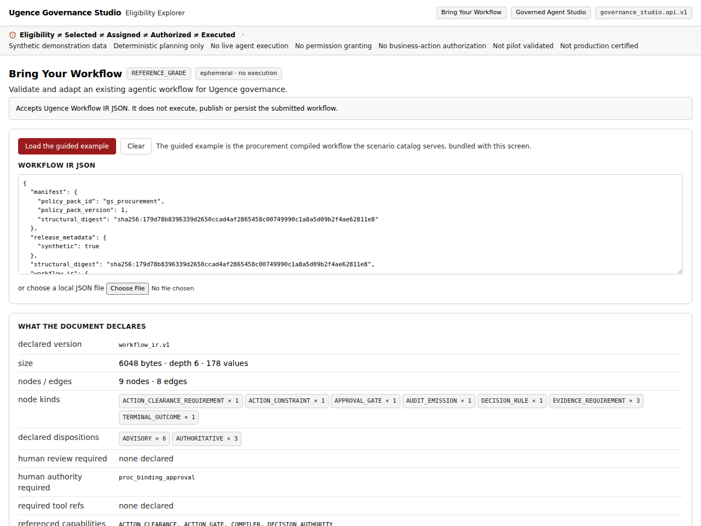

- **Shows:** what a pasted or locally chosen Ugence Workflow IR JSON document declares (version, size, nodes, edges, node kinds, dispositions, human review and authority requirements, tool and capability refs, policy pack, fingerprint, canonical digest); then, on request, the server's validation, adaptation (adapter mode, node dispositions, role requirements, fingerprints, diagnostics) and comparison of a v1 and a v2 adaptation; and, since BW-3A, the draft the server kept (derived id, lifecycle `DRAFT`, kept digest, record digest, the claimed owner with its assurance `PRESENTED_UNPROVEN`, lineage, what it confers: nothing) and the drafts the deployment keeps, read on request and never on load. The disclaimer, verbatim: "Accepts Ugence Workflow IR JSON. It does not execute, compile, approve or publish the submitted workflow. A validated document may be kept only as an unapproved DRAFT for this deployment's tenant."
- **Answered by:** `validate_workflow`, `adapt_workflow`, `compare_adaptations` on the v1 contract and `v2_workflow_drafts_save`, `v2_workflow_drafts_list`, `v2_workflow_drafts_read` on the v2 contract; nothing else. The guided example is the procurement compiled workflow the catalog serves, bundled with the screen.
- **Operator can:** paste JSON or choose a local `.json` file (read in the browser); load the guided example; validate; adapt; compare against the same workflow in the other contract version; download the report and the adapted envelope to their device; keep the gated document as a draft with a title, a claimed owner, an optional link to an AI-system registration (reference plus digest) and an optional predecessor; list the deployment's drafts; load a kept draft back through the gate, which pre-fills the revision's lineage.
- **Never:** executes, simulates, compiles, approves, publishes or exports the document; keeps the pasted text (the server keeps its own canonical encoding, validated first); keeps a draft under a tenant the browser names (the tenant is server configuration); authenticates an owner; edits or deletes a draft (a revision supersedes); fetches a URL; reads an archive; accepts code, YAML, a framework-native object or a credential-shaped value; adds to or changes the scenario catalog; converts from LangGraph, CrewAI, AutoGen, n8n or BPMN in the browser. Both the browser gate and the server refuse a document over 1 MiB, deeper than 32 levels, or with more than 200 nodes or 400 edges; the server's refusal is the typed 422 `workflow_too_complex`. Without a drafts file configured, the draft controls report the typed gap `workflow_drafts`.
- **Ruling:** BW-1 `READ_ONLY_WORKFLOW_IR_INSPECTOR`, BW-2 `PASTE_OR_LOCAL_FILE_BODY_ONLY` with the owner's figures, BW-3 `VALIDATE_ADAPT_COMPARE_ONLY`, BW-4 `EPHEMERAL_NO_SERVER_STORAGE` as amended for the one draft write, BW-5 `REFERENCE_GRADE` (§22); BW-3A `DRAFTS_AUTHORIZED_NOW` with BW-3A.1 to BW-3A.5 (§24).

#### Enter, press, expect

*On the live deployment:* works in full.

| Step | Do this | Expect |
|---|---|---|
| 1 | Open `https://studio-web-production-65e8.up.railway.app/bring-your-workflow`; press **Load the guided example**. | The procurement compiled workflow fills the textarea. *What the document declares*: version `workflow_ir.v1`; 9 nodes, 8 edges; node kinds ACTION_CLEARANCE_REQUIREMENT ×1, ACTION_CONSTRAINT ×1, APPROVAL_GATE ×1, AUDIT_EMISSION ×1, DECISION_RULE ×1, EVIDENCE_REQUIREMENT ×3, TERMINAL_OUTCOME ×1; dispositions ADVISORY ×6, AUTHORITATIVE ×3; human authority required `proc_binding_approval`; capabilities ACTION_CLEARANCE, ACTION_GATE, COMPILER, DECISION_AUTHORITY; policy pack `gs_procurement@1`; fingerprint `sha256:179d78b8…11e8`. |
| 2 | Press **Validate**. | State `VALID`; *server supports workflow_ir.v1, workflow_ir.v2*; integrity *client … · server sha256:07a01038…d86d · match*; no diagnostics. |
| 3 | Press **Adapt**. | `ok yes`; adaptation fingerprint `sha256:bfec6412…bf4e`, envelope `sha256:fa7ea8fe…70b30`; 9 node dispositions with reason codes such as `deterministic_kind:DECISION_RULE`; 3 role requirements (`role::proc_supplier_evidence`, `role::proc_supplier_risk`, `role::proc_recommendation`). |
| 4 | Paste the v2 counterpart of the same workflow into the second textarea (see values) and press **Compare adaptations**. | `equivalence_state SEMANTICALLY_EQUIVALENT`, `differences: []`, v1 `sha256:91c1f7d2…e25a`, v2 `sha256:ae122481…317f`. |
| 5 | Press **Download report** and **Download adapted envelope**. | Two JSON files saved locally; nothing was stored on the server. |
| 6 | With the gate still passing, fill **Keep as an unapproved draft (phase 3A)**: **Title** `procurement baseline`, **Claimed owner** `directory://people/owner-1`, leave both registration fields and **Supersedes** empty, **Notes** free text. Press **Keep as draft**. | The one v2 draft write is sent. *draft id* a derived identifier; *lifecycle* `DRAFT` with its note; *kept digest* and *record digest*; *integrity* client and server agree; *claimed owner* `directory://people/owner-1` · `PRESENTED_UNPROVEN`; *supersedes* none, the first of its lineage; *registration link* none; *recorded by* and *validated by*; *confers* nothing. The pasted text is never kept — the server keeps its own canonical encoding, validated again first. |
| 7 | Press **Show kept drafts** in *Drafts this deployment keeps*. | The count, `lifecycle DRAFT`, the claimed-owner status and what a draft confers; then one row per draft with its id, title, claimed owner, supersedes and superseded-by. Read on request, never on page load, and only this deployment’s own tenant is ever answered. |
| 8 | Press **Load** on that row. | The draft returns through the same gate as anything pasted. The form pre-fills and **Supersedes** is set to the loaded draft id, with the note *keeping it again records a revision that supersedes it*. Nothing is edited in place. |
| 9 | Change **Title** to `procurement baseline rev 2` and press **Keep as draft** again. | A second draft whose *supersedes* names the first. Tick **include superseded revisions** and press **Show kept drafts** to see both; unticked, only the head of the lineage is listed. |
| 10 | Press **Clear**, paste `{"ir_version":"workflow_ir.v9"}`. | Gate refusal `UNSUPPORTED_VERSION`: *declared version "workflow_ir.v9" is not one of workflow_ir.v1, workflow_ir.v2*; Validate and Adapt disabled. |

**Values you can type**

- Smallest document the browser gate accepts: `{"ir_version":"workflow_ir.v1","nodes":[],"edges":[]}` (the server then reports the adapter's diagnostics).
- A v2 counterpart for Compare: `frontend/tests/fixtures/bring.example-v2.json` or `backend/.../data/conformance_v2/procurement/v2_workflow.json` (top-level `ir_version workflow_ir.v2`, `base_ir`, nine `node_semantics`). Compare needs exactly one v1 and one v2 document.
- Draft form: **Title** is the only required field. **Claimed owner** is an opaque handle recorded as `PRESENTED_UNPROVEN`; it confers no read, write, approval or execution authority. An **AI-system registration id** must be accompanied by the **Registration record digest** of that exact record, and both are matched against this tenant’s own registry — use the identifier and record digest from screen 14. **Supersedes** must name the head of its lineage.
- The tenant is never sent from the browser on any draft operation; it is this deployment’s server configuration.
- Browser gate limits: 1 MiB, depth 32, 200 nodes, 400 edges, 50 000 values. A local file over 1 MiB is never read: *<name>: <size> bytes exceed the limit of 1048576 (1 MiB); not read*.

**Refusals to expect**

- Gate codes and text: `EMPTY` *paste a Workflow IR document or choose a local JSON file*; `NOT_JSON` *not JSON: … YAML, code and archives are never accepted*; `NOT_AN_OBJECT`; `TOO_DEEP` *nesting deeper than 32 levels*; `TOO_MANY_NODES` *<n> nodes exceed the limit of 200*; `TOO_MANY_EDGES`; `CREDENTIAL_SHAPED`; `REMOTE_REFERENCE`.
- Draft refusals, rendered as *code · reason*: `draft_refused` for a document that does not validate under the composer’s adapter, for a contract version the server does not support, for a declared version disagreeing with the one named, or for typed input it rejects; `draft_duplicate` for the same document kept twice; `supersession_refused` when the named predecessor is not the head of its lineage; `registration_link_refused` when the digest is not that of the registration named, because a link binds one exact record.
- With no drafts file configured, all three draft operations answer the typed gap `workflow_drafts` rather than an error, and the controls say so.
- Server 422 `workflow_too_complex`, e.g. *workflow: nodes 201 exceeds the limit 200*, *workflow: depth 33 exceeds the limit 32*; a raw body over 1 MiB is a 413 before parsing; an unsupported version on Adapt is 422 `unsupported_contract_version`. Rendered as *The server refused: <code> · <message>*.

*Source:* `features/bring/BringYourWorkflowScreen.tsx:120-888`; `features/bring/gate.ts:11-236`; `backend/.../api/workflows.py:31-131`; `workflow_limits.py:35-102`; drafts: `services/studio_v2.py:1647-1845` and `UGENCE_STUDIO_WORKFLOW_DRAFTS_PATH` (`config.py:98-101`); `frontend/tests/fixtures/bring.validate.json`, `bring.compare.json`.

---

## What is not a screen, and why

- **Granting, revoking:** implemented on the worker behind its identity gate (AW-2 to AW-5) and not served until the identity adapter is validated end to end against a real enterprise issuer (AP-3 controlling, §18). The screens built for them under AW-1 were withdrawn with that ruling's reversal.
- **Issuing, activating:** the authority plane's other two writes, on stores the worker does not compose (AW-2), behind AP-3.
- **Authorizing, clearing, executing:** runtime authority, with ActionGate, the Autonomous Control Plane and the runtime. Refused on every front end by SD-2 and AP-4.
- **Module composition:** providers, hooks and seam files are environment variables read before the port binds. Shown read-only on Status; set nowhere in a browser.
- **The console's module registry:** behind a withheld route; struck from the studio by MS-1.
- **Risk Authority:** its own package records and one administrative emergency stop, with no web surface; the studio is forbidden to import it.
- **A general agent uploader or framework converter:** refused by BW-1. Bring Your Workflow accepts Ugence Workflow IR only. Conversion is an offline command-line tool with no screen (`packages/tooling/workflow-converters`, ruling CV-1 to CV-5, §23): the n8n and BPMN 2.0 converters emit a DRAFT policy pack, a conversion report and a preview Workflow IR labelled `PREVIEW_UNAPPROVED` that this screen can inspect; LangGraph, CrewAI and AutoGen stay deferred until a declarative export exists.
