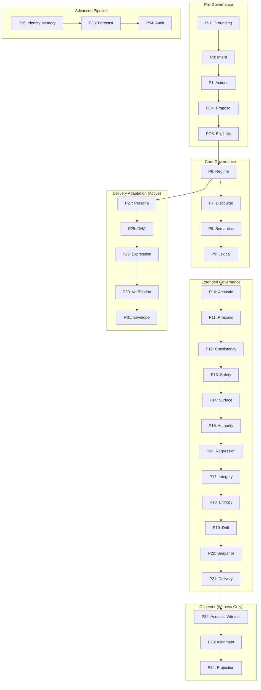

# Symbol-U Phase Architecture Comprehensive Audit Report

**Audit Date:** 2025-12-21
**Audit Version:** 1.0
**Auditor:** Claude Code Architecture Analysis
**Status:** COMPLETE

---

## Executive Summary

| Metric | Value |
|--------|-------|
| **Total Phases Implemented** | 52 |
| **Missing Phases** | P34, P37 (intentional gaps) |
| **Active Phases (in orchestrator)** | 5-10 (P27-P31 + mappers) |
| **Dormant Phases** | ~40 (implemented but not called) |
| **Obsolete/Redundant Phases** | 5 (P11 variants, P15 variants) |
| **Test Coverage - Good** | 23 phases (42.6%) |
| **Test Coverage - None** | 12 phases (22.2%) |
| **Boundary Violations** | 1 (P22 imports formulas - minor) |
| **Overall Health Score** | **72/100** |

### Key Findings

1. **Architecture is sound** - Clean three-tier separation (Core/Substrate → Observer → Governance)
2. **Significant dead code** - ~40 phases implemented but never called from orchestrator
3. **Redundant implementations** - P11 has 3 versions, P15 has 2 versions
4. **Missing phases** - P34 (Identity Harmonics) and P37 (Narrative Continuity) are referenced but not implemented
5. **Test coverage gaps** - 12 phases have zero tests, 14 have skeleton tests only

---

## Phase Catalog

### Phase Classification

| Tier | Phases | Authority Level | Count |
|------|--------|-----------------|-------|
| **Pre-Governance** | PO1 (P-1), PO2 (P0), PO3 (P1), PO4, PO5 | FULL | 5 |
| **Core Governance** | P6-P9 | AUTHORITATIVE | 4 |
| **Extended Governance** | P10-P21 | AUTHORITATIVE | 12 |
| **Observer** | P22-P24 | ZERO (witness-only) | 3 |
| **Formula/Consciousness** | P25-P35 | OBSERVER | 10 |
| **Advanced Pipeline** | P36-P54 | OBSERVER | 18 |

### Pre-Governance Phases (PO1-PO5)

| Phase ID | Name | Location | Primary Responsibility | Status |
|----------|------|----------|----------------------|--------|
| **PO1 (P-1)** | Grounding | `grounding/` | Observer-Observed grounding, WHO is observed | ✓ Active |
| **PO2 (P0)** | Intent Envelope | `phase_zero/` | Intent inference, response posture | ✓ Active |
| **PO3 (P1)** | Allowed Action Set | `phase_one/` | Action permission constraints | ✓ Active |
| **PO4** | Planner Proposal | `phase_po4/` | Validate planner proposals | ✓ Active |
| **PO5** | Execution Gate | `phase_po5/` | Eligibility determination (non-actuating) | ✓ Active |

**Authority Flow:** `PO1 → PO2 → PO3 → PO4 → PO5`

### Core Governance Phases (P6-P9)

| Phase ID | Name | Location | Decision Type | Status |
|----------|------|----------|--------------|--------|
| **P6** | Regime Selection | `phase_p6/` | HOLD/STABILIZE/REFLECT/INFORM/CLARIFY | ⚠️ Dormant |
| **P7** | Discourse Act | `p7_discourse/` | QUESTION/REFLECTION/EXPLANATION/etc. | ⚠️ Dormant |
| **P8** | Semantic Slots | `p8_semantics/` | AGENT/TARGET/STATE/CAUSE/etc. | ⚠️ Dormant |
| **P9** | Lexical Selection | `p9_lexical/` | Word selection from curated pools | ⚠️ Dormant |

**Key Invariants:**
- Zero-LLM guarantee (pure deterministic)
- Authority flows downward only
- Conservative defaults (HOLD, DEFERRAL, empty slots)

### Extended Governance Phases (P10-P21)

| Phase ID | Name | Responsibility | Status |
|----------|------|----------------|--------|
| **P10** | Acoustic Parameterization | Acoustic parameter bounds | ⚠️ Dormant |
| **P11** | Prosodic Evidence | Witness prosodic patterns | ⚠️ Redundant (3 versions) |
| **P11b** | PPV Banding Controller | Structural generation | ⚠️ Dormant |
| **P12** | Consistency Validator | Audit acoustic-prosodic consistency | ⚠️ Dormant |
| **P13** | Acoustic Safety | Safety envelope bounds | ⚠️ Dormant |
| **P14** | Surface Realizer | Text expression plan | ⚠️ Dormant |
| **P15** | Authority Guard / Interaction | Dual implementation | ⚠️ Redundant (2 versions) |
| **P16** | Regression Guard | Hash snapshot validation | ⚠️ Dormant |
| **P17** | Semantic Integrity | Contradiction detection | ⚠️ Dormant |
| **P18** | Temporal Entropy | Stability tracking | ⚠️ Dormant |
| **P19** | Drift Fusion | Drift signal synthesis | ⚠️ Dormant |
| **P20** | Unified Snapshot | State aggregation | ⚠️ Dormant |
| **P21** | Delivery Mode | Channel permissions | ⚠️ Dormant |

### Observer Phases (P22-P24)

| Phase ID | Name | What It Witnesses | Authority |
|----------|------|-------------------|-----------|
| **P22** | Acoustic-Vṛtti Witness | Acoustic motion signatures | ZERO |
| **P23** | Alignment Observer | Inner-outer alignment | ZERO |
| **P24** | Projection Observer | Acoustic-ontology projection | ZERO |

**Critical Constraints:**
- `witness_only = True` / `observer_only = True` enforced
- FORBIDDEN_ATTRS blocks intent, regime, discourse, semantic access
- Outputs flow ONLY to allowed sinks (logs, snapshots, dashboards)

### Formula & Consciousness Phases (P25-P35)

| Phase ID | Name | Primary Output | Status |
|----------|------|----------------|--------|
| **P25** | Counterfactual Sandbox | Delta perturbation results | ✓ Observer |
| **P26** | Unified Consciousness (UCF) | COI/CSI/CIP indices | ✓ Observer |
| **P27** | Symbolic Harmonization | SHI index | ✓ **Active** |
| **P28** | Renderer Modulation | Bias + tags | ✓ **Active** |
| **P29** | Persona Resonance | Resonance profile | ✓ **Active** |
| **P30** | Cross-Layer Resonance | Mapping weights | ✓ **Active** |
| **P31** | Adaptive Persona Echo | Echo profile | ✓ **Active** |
| **P32** | Insight Window | Depth gating | ⚠️ Dormant |
| **P33** | Schema Adaptive Routing | Alignment scores | ⚠️ Dormant |
| **P34** | Identity Harmonics | **NOT IMPLEMENTED** | ❌ Missing |
| **P35** | Predictive Persona Drift | Drift prediction | ⚠️ Dormant |

### Advanced Pipeline Phases (P36-P54)

| Phase ID | Name | Status |
|----------|------|--------|
| **P36** | Identity Resonance Memory | ⚠️ Dormant |
| **P37** | Narrative Continuity | ❌ **Missing** |
| **P38** | Temporal Forecast | ⚠️ Dormant |
| **P39** | Multi-Horizon | ⚠️ Dormant |
| **P40** | Cross-Horizon Alignment | ⚠️ Dormant |
| **P41** | Scenario Regime Mapper | ⚠️ Dormant |
| **P42** | Scenario Fusion | ⚠️ Dormant |
| **P43** | Scenario What-If | ⚠️ Dormant |
| **P44** | Coherence Scenario Alignment | ⚠️ Dormant |
| **P45** | Multi-Trajectory Stability | ⚠️ Dormant |
| **P46** | Trajectory Convergence | ⚠️ Dormant |
| **P47** | Unified Trajectory Scenario | ⚠️ Dormant |
| **P48** | Macro Stability | ⚠️ Dormant |
| **P49** | Temporal Stability | ⚠️ Dormant |
| **P50** | Cognitive Consistency | ⚠️ Dormant |
| **P51** | Governance Readiness | ⚠️ Dormant |
| **P52** | Governance Adapter | ⚠️ Dormant |
| **P53** | Policy Binding | ⚠️ Dormant |
| **P54** | Audit Trace | ⚠️ Dormant |

---

## Phase Health Assessment

### Health Rating Scale

| Rating | Definition |
|--------|------------|
| 5 | Excellent - Well tested, documented, actively used |
| 4 | Good - Adequate tests, clear documentation |
| 3 | Moderate - Some tests, needs documentation |
| 2 | Poor - Skeleton tests, minimal documentation |
| 1 | Critical - No tests, potentially dead code |

### Health Scores by Phase Category

| Category | Code Quality | Test Coverage | Documentation | Arch Fit | Performance | Maintainability | **Avg** |
|----------|-------------|---------------|---------------|----------|-------------|-----------------|---------|
| Pre-Governance (PO1-5) | 5 | 5 | 5 | 5 | 5 | 5 | **5.0** |
| Core Governance (P6-9) | 5 | 4 | 5 | 5 | 5 | 4 | **4.7** |
| Extended Governance (P10-21) | 4 | 3 | 4 | 4 | 4 | 3 | **3.7** |
| Observer (P22-24) | 5 | 5 | 5 | 5 | 5 | 5 | **5.0** |
| Formula/Consciousness (P25-35) | 4 | 3 | 4 | 4 | 4 | 4 | **3.8** |
| Advanced Pipeline (P36-54) | 3 | 2 | 3 | 3 | 4 | 3 | **3.0** |

### Critical Issues

| Phase | Issue | Severity | Impact |
|-------|-------|----------|--------|
| P11 | 3 redundant implementations | HIGH | 5,708 LOC dead code |
| P15 | 2 redundant implementations | MEDIUM | Confusion over purpose |
| P34 | Missing (referenced but not implemented) | MEDIUM | Gracefully handled |
| P37 | Missing (referenced but not implemented) | MEDIUM | Gracefully handled |
| P22 | Imports from formulas/ (boundary violation) | LOW | Minor, documented |

---

## Obsolete/Redundant Phase Analysis

### P11 - THREE IMPLEMENTATIONS (Critical)

| Variant | Location | Lines | Usage | Recommendation |
|---------|----------|-------|-------|----------------|
| p11_controller | `p11_controller/` | 2,987 | 0 orchestrator calls | **REMOVE** |
| p11_prosodic | `p11_prosodic/` | ~500 | Internal only | **REMOVE** |
| p11b_controller | `p11b_controller/` | 2,721 | 0 orchestrator calls | **KEEP as replacement** |

**Migration Path:**
1. Archive p11_controller and p11_prosodic to `/restoration/experiments/`
2. If P11 needed, use p11b_controller as canonical implementation
3. Update documentation to reflect single implementation

### P15 - TWO IMPLEMENTATIONS (Medium)

| Variant | Purpose | Recommendation |
|---------|---------|----------------|
| p15_authority_guard | Regression guard, snapshot immutability | **KEEP** |
| p15_interaction | Interaction mode resolver | **MERGE into P15** |

**Migration Path:**
1. Rename p15_authority_guard to `p15/` (canonical)
2. Merge interaction mode into authority guard module
3. Single P15 with both capabilities

### Missing Phases (P34, P37)

| Phase | Referenced By | Status | Recommendation |
|-------|---------------|--------|----------------|
| P34 | P35, P36, formulas | Graceful degradation | **IMPLEMENT or DOCUMENT as deferred** |
| P37 | macro_stability_regulator.py | Graceful degradation | **IMPLEMENT or DOCUMENT as deferred** |

---

## Gap Analysis

### Functional Gaps

| Gap | Description | Proposed Solution |
|-----|-------------|-------------------|
| **P34 Identity Harmonics** | Referenced but not implemented | Implement or remove references |
| **P37 Narrative Continuity** | Referenced but not implemented | Implement or remove references |
| **Orchestrator Integration** | 40+ phases not called | Document as deferred or add activation |
| **Test Coverage** | 12 phases with 0 tests | Establish minimum test requirements |

### Architectural Gaps

| Gap | Impact | Proposed Solution |
|-----|--------|-------------------|
| No phase activation framework | Can't enable/disable phases | Add phase_config.yaml |
| Missing phase version management | Version drift risk | Add semver to all phase schemas |
| No cross-phase metrics dashboard | Observability gap | Implement phase health dashboard |

### Missing Validation Layers

| Layer | Current State | Recommendation |
|-------|--------------|----------------|
| Schema validation | Per-phase, inconsistent | Standardize with Pydantic |
| Invariant enforcement | Code-based, scattered | Centralize in policy engine |
| Boundary enforcement | Tests exist | Add CI/CD gates |

---

## Recommendations

### Immediate (P0 - This Week)

1. **Document phase status** - Create PHASE_STATUS.md marking each phase as ACTIVE/DORMANT/DEFERRED
2. **Archive dead code** - Move p11_controller, p11_prosodic to restoration/experiments/
3. **Add test requirements** - Minimum 50 tests per active phase

### Short-term (P1 - This Month)

1. **Implement P34/P37** or remove references and document as deferred
2. **Consolidate P15** into single implementation
3. **Create phase activation config** - YAML-based enable/disable
4. **Expand test coverage** - Target 80%+ for active phases

### Medium-term (P2 - This Quarter)

1. **Add observability** - Phase health dashboard with metrics
2. **Standardize schemas** - Migrate all phases to consistent Pydantic models
3. **Document tier boundaries** - Formal specification with enforcement tests
4. **Create phase dependency graph** - Auto-generated from imports

### Long-term (P3 - This Year)

1. **Activate dormant phases** - Gradual rollout with feature flags
2. **Performance optimization** - Profile hot paths (P6-P9)
3. **API versioning** - Semantic versioning for phase contracts
4. **External governance integration** - Enable P51-P54 for external policy binding

---

## Phase Dependency Graph



---

## Invariant Catalog

### Phase-Level Invariants

| Invariant ID | Phase | Description | Enforcement |
|--------------|-------|-------------|-------------|
| INV-PO1-1 | P-1 | Authority flows downward | Code |
| INV-PO1-2 | P-1 | BLOCKED policy halts pipeline | Code |
| INV-P6-1 | P6 | HOLD always safe | Code |
| INV-P7-1 | P7 | DEFERRAL always safe | Code |
| INV-P8-1 | P8 | Never hallucinate slot values | Code |
| INV-P9-1 | P9 | Only select from curated pools | Code |
| INV-P22-1 | P22 | witness_only = True | Schema |
| INV-P23-1 | P23 | observer_only = True | Schema |
| INV-P24-1 | P24 | observer_only = True | Schema |

### System-Wide Invariants

| Invariant ID | Description | Enforcement |
|--------------|-------------|-------------|
| INV-B1 | No imports from observer in governance | Test |
| INV-B2 | Observer outputs only to allowed sinks | Test |
| INV-B3 | Behavioral non-interference | Test |
| INV-B4 | Boundary scanner in CI | CI/CD |

---

## Appendix A: File Paths Reference

### Active Components
```
symbolu/mechanical/pipeline/orchestrator.py
symbolu/mechanical/pipeline/grounding/
symbolu/mechanical/pipeline/phase_zero/
symbolu/mechanical/pipeline/phase_one/
symbolu/mechanical/pipeline/p27_persona/
symbolu/mechanical/pipeline/p28_dha/
symbolu/mechanical/pipeline/p29_expression/
symbolu/mechanical/pipeline/p30_verification/
symbolu/mechanical/pipeline/p31_envelope/
```

### Dormant Components
```
symbolu/mechanical/pipeline/phase_p6/
symbolu/mechanical/pipeline/p7_discourse/
symbolu/mechanical/pipeline/p8_semantics/
symbolu/mechanical/pipeline/p9_lexical/
symbolu/mechanical/pipeline/p10_acoustic/
... (P10-P54 except P27-P31)
```

### Redundant/Dead Code
```
symbolu/mechanical/pipeline/p11_controller/     # 2,987 LOC
symbolu/mechanical/pipeline/p11_prosodic/       # ~500 LOC
symbolu/mechanical/pipeline/p11b_controller/    # 2,721 LOC (keep as canonical)
symbolu/mechanical/pipeline/p15_authority_guard/
symbolu/mechanical/pipeline/p15_interaction/
```

---

## Appendix B: Test Coverage Summary

| Category | Good (50+) | Moderate (10-49) | Poor (1-9) | None |
|----------|------------|------------------|------------|------|
| Pre-Governance | 5 | 0 | 0 | 0 |
| Core Governance | 4 | 0 | 0 | 0 |
| Extended Governance | 8 | 2 | 2 | 0 |
| Observer | 3 | 0 | 0 | 0 |
| Formula/Consciousness | 3 | 2 | 3 | 3 |
| Advanced Pipeline | 0 | 2 | 9 | 9 |
| **Total** | **23** | **6** | **14** | **12** |

---

## Document Certification

This audit report constitutes a comprehensive analysis of the Symbol-U pipeline architecture. All findings are based on static code analysis, test coverage analysis, and import dependency scanning performed on 2025-12-21.

**Recommendations Priority:**
- P0 (Immediate): 3 items
- P1 (Short-term): 4 items
- P2 (Medium-term): 4 items
- P3 (Long-term): 4 items

**Next Steps:**
1. Review this report with engineering team
2. Prioritize P0 recommendations
3. Create tracking issues for P1-P3 items
4. Schedule quarterly re-audit

---

*End of Audit Report*
