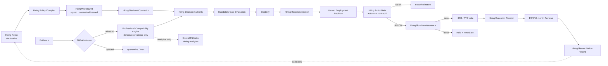
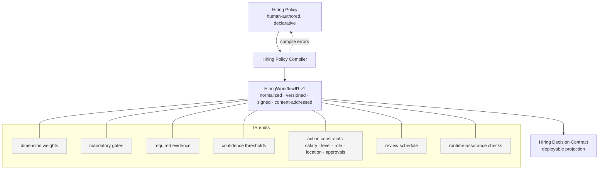
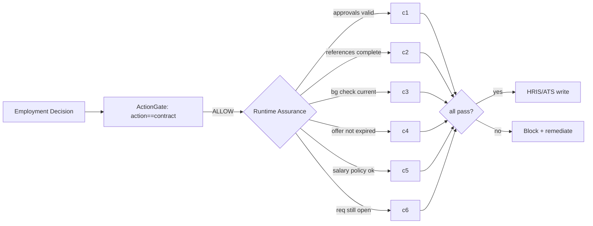
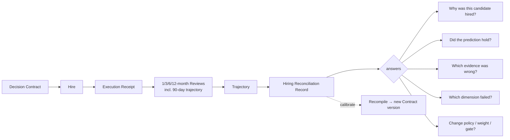
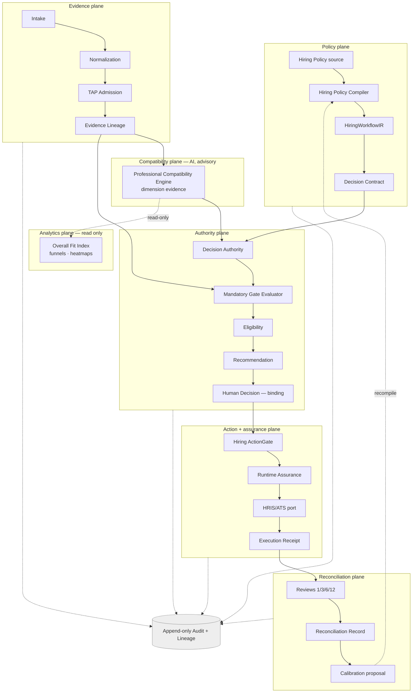
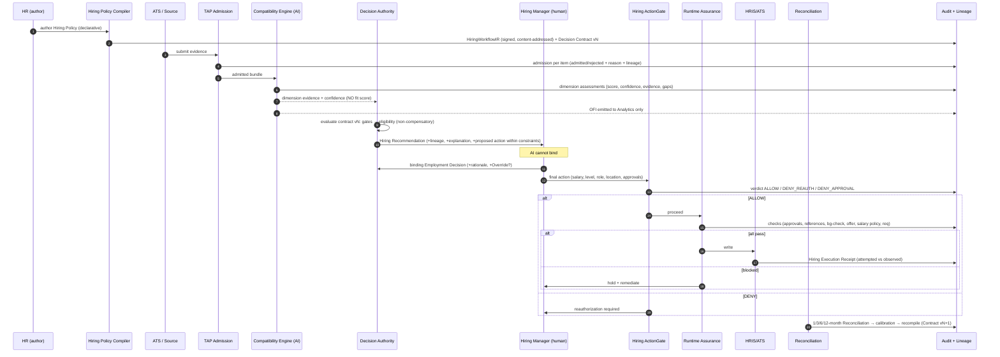
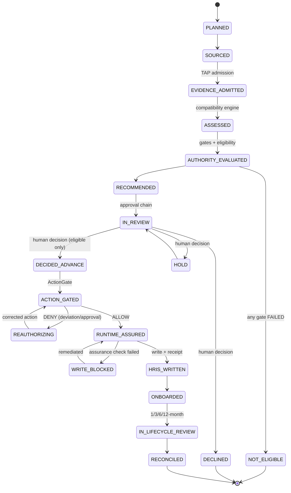
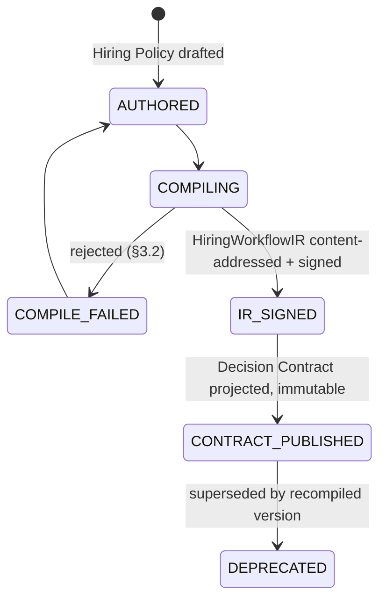

# Hiring Decision Authority — Enterprise Design Specification

**Status:** Design specification (implementation-ready) · **Revision:** 2 (governance-first: PWC → IR → Contract → ActionGate → Runtime Assurance → Receipt → Reconciliation)
**Supersedes:** the "AI Hiring" / universal candidate-scoring framing, and Revision 1's hand-authored Role Compatibility Profile as a runtime artifact.
**Governance alignment:** Ugence Decision Governance — **Policy Workflow Compiler (PWC)**, **WorkflowIR**, **Decision Contract**, **Decision Authority**, **ActionGate**, **Runtime Assurance**, **Truth Assurance Pipeline (TAP)**, **Evidence Lineage**, **Execution Receipt**, **Reconciliation**, **RiskDecisionCase**.

---

## 0. Reading guide

This document reconstructs the hiring vertical as one **governed Decision
Authority domain** on the shared Ugence governance kernel — not a standalone AI
recruiting application. The unit of value is a **compiled, signed, reproducible
hiring policy** whose decisions are **gated, runtime-assured, receipted, and
reconciled** — identical in shape to Procurement, Financial, Clinical, and Agent
Decision Authority.

Machine-readable contracts in [`schemas/`](schemas/) are the normative source;
where prose and schema disagree, the schema wins.

| § | Establishes |
|---|---|
| 1 | Reframe, the one invariant, portfolio positioning |
| 2 | Concept model: Policy → Compiler → Contract → Decision → Action → Reconciliation |
| 3 | **Hiring Policy Compiler (PWC) → HiringWorkflowIR → Hiring Decision Contract** |
| 4 | Dimensions — Operating Environment Compatibility, Role Sustainability & Adaptation |
| 5 | Evidence model + TAP admission |
| 6 | Non-compensatory Mandatory Gates |
| 7 | Overall Fit Index — **analytics-only**, never enters Decision Authority |
| 8 | Decision Authority and the Hiring Recommendation |
| 9 | **Hiring ActionGate** — action must match the contract |
| 10 | **Hiring Runtime Assurance** — pre-write validation |
| 11 | **Execution Receipt + Hiring Reconciliation Record** |
| 12 | Review lifecycle + closed-loop contract calibration |
| 13 | Component architecture |
| 14 | Runtime flow (sequence) |
| 15 | State machines |
| 16 | API design |
| 17 | Audit, Evidence Lineage, receipts |
| 18 | Governance alignment map |
| 19 | Security model |
| 20 | Enterprise deployment |
| 21 | Migration plan |
| 22 | Glossary |

---

## 1. Reframe

### 1.1 Rename and portfolio position

> **AI Hiring → Hiring Decision Authority.**

Hiring becomes one domain instance of a common architecture:

```
              ┌──────────────── shared governance kernel ────────────────┐
              │ PWC → WorkflowIR → Decision Contract → Decision Authority │
              │ → ActionGate → Runtime Assurance → Execution Receipt      │
              │ → Reconciliation                                          │
              └──────────────────────────────────────────────────────────┘
  Procurement DA    Hiring DA    Financial DA    Clinical DA    Agent DA
     (only the domain evidence models, policy compilers, and contracts differ)
```

The engine is identical across domains; only **domain-specific evidence models,
policy compilers, and decision contracts** change. That cross-domain consistency
is the differentiator: incumbents (ServiceNow, Eightfold, Workday, SAP
SuccessFactors, Oracle Recruiting) provide workflow orchestration and AI
scoring; Ugence provides **governed decision execution** with the same
architecture everywhere.

### 1.2 The one invariant

> **A hiring policy is authored declaratively, compiled by the Hiring Policy
> Compiler into a signed, content-addressed HiringWorkflowIR, and projected into
> a versioned Hiring Decision Contract. The Decision Authority evaluates that
> contract over TAP-admitted dimension evidence and mandatory gates — never over
> a fit score. The resulting action is gated (ActionGate) and runtime-assured
> before any HRIS/ATS write, receipted on execution, and reconciled against
> observed outcomes. Only an authenticated human may bind.**

Four collapses are forbidden and blocked in the compiler/kernel:

1. **Score → policy.** No path reads a fit score into a gate, eligibility, or action decision. The Overall Fit Index is analytics-only (§7).
2. **Compatibility → eligibility.** Fit can never satisfy a mandatory gate (§6).
3. **Recommendation → write.** No recommendation reaches an HRIS/ATS without passing ActionGate **and** Runtime Assurance (§9–§10).
4. **AI → authority.** No AI/service principal binds a decision or drives a binding transition (§8).

### 1.3 What is removed

- **Universal Candidate Scoring** (fixed role-agnostic weighted layers → one decisive score).
- **Hand-authored Role Compatibility Profile as the runtime artifact.** HR no longer edits JSON weights directly; they declare requirements and the **PWC compiles** them (§3). The compiled dimension model still exists — as an *output of the compiler embedded in the IR*, not a hand-maintained config.

### 1.4 The commercial difference

```
Incumbents:   Resume → AI → Score → Workflow
Ugence:       Policy → Compiled Decision Contract → Evidence → Decision Authority
              → ActionGate → Runtime Assurance → Execution Receipt → Reconciliation
```

Not another recruiting platform — **governed hiring decision infrastructure.**

---

## 2. Concept model

Three questions, three objects, three authorities — plus the governed action spine:

| Question | Object | Authority | Compensatory? |
|---|---|---|---|
| *Does the evidence fit this role's operating reality?* | **Compatibility Assessment** (dimension evidence) | Professional Compatibility Engine (AI, advisory) | within a dimension only |
| *Are the non-negotiables met?* | **Eligibility** over Mandatory Gates | Decision Authority | **never** |
| *What should we do?* | **Hiring Recommendation** → **Employment Decision** | Decision Authority (recommend) / Human (bind) | n/a |
| *May this exact action execute?* | **ActionGate** verdict + **Runtime Assurance** | kernel gate + pre-write checks | n/a |
| *Did the prediction hold?* | **Reconciliation Record** | Reconciliation | n/a |



The Overall Fit Index branches **out to Analytics** and never re-enters the
decision path.

---

## 3. Hiring Policy Compiler (PWC) → HiringWorkflowIR → Hiring Decision Contract

### 3.1 Replace the Role Compatibility Profile with a compiler

HR does **not** configure JSON weights. They author a **declarative Hiring
Policy**:

```
Senior Architect
  requires: AWS, Kubernetes, Leadership, Healthcare domain, Security Clearance
  seniority: L5
  compensation ceiling: $220K
  location policy: US-remote or on-site NYC
  approval chain: Hiring Manager → Director → VP Eng
```

The **Hiring Policy Compiler (PWC)** — the hiring instance of the platform's
Policy Workflow Compiler — compiles that into a canonical, typed
**HiringWorkflowIR (`hiring_workflow_ir.v1`)**, from which a **Hiring Decision
Contract** is projected.



Every hiring policy is therefore **versioned, signed, content-addressed,
auditable, and reproducible** — recompiling the same policy yields the same IR
digest.

### 3.2 What the compiler guarantees (compile-time rejections)

The PWC **rejects** a policy that:

- (a) references the Overall Fit Index in any gate, eligibility, or action rule;
- (b) makes a mandatory gate compensable by fit/confidence;
- (c) weights a dimension without declaring its required evidence;
- (d) admits a non-human principal into the approval chain;
- (e) declares action constraints (salary/level/role/location) that the approval
  chain is not authorized to grant;
- (f) omits a required runtime-assurance check for a constrained action.

### 3.3 The three artifacts

| Artifact | Nature | Schema |
|---|---|---|
| **Hiring Policy** | human-authored declarative source | [`schemas/hiring_policy_source.schema.json`](schemas/hiring_policy_source.schema.json) |
| **HiringWorkflowIR** | compiled, signed, content-addressed | [`schemas/hiring_workflow_ir.schema.json`](schemas/hiring_workflow_ir.schema.json) |
| **Hiring Decision Contract** | deployable projection of one IR digest | [`schemas/hiring_decision_contract.schema.json`](schemas/hiring_decision_contract.schema.json) |

A recommendation always cites the exact **contract version and IR digest** it
was produced under; an action always cites the **action constraints** it was
checked against.

---

## 4. Dimensions

Dimensions are **role-scoped compatibility axes** emitted by the compiler into
the IR — not universal layers. Two legacy dimensions are replaced.

### 4.1 *Culture Fit* → **Operating Environment Compatibility**

Culture Fit (personal similarity — neither job-related nor defensible) is
**deleted**. Its replacement measures **operating-model compatibility**: can this
person operate effectively in *this environment's operating reality?*

| Environment | Operating reality evaluated |
|---|---|
| Startup | ambiguity tolerance, rapid change, experimentation |
| Bank | governance, documentation discipline, regulatory controls |
| Healthcare | patient safety, evidence orientation, compliance |

Evidence is behavioral/situational (work samples, structured-interview behavioral
probes, references keyed to operating conditions) — never affinity or demographic
proxy.

### 4.2 *Resilience* → **Role Sustainability & Adaptation**

Resilience (a psychological inference) is **deleted**. Its replacement is
**Role Sustainability & Adaptation**, measured **primarily post-hire** at 1/3/6/12
months against observed outcomes (onboarding, manager reviews, performance-goal
attainment, collaboration, delivery, retention). **No psychological inference.**
Pre-hire it is typically `INSUFFICIENT_EVIDENCE`; its real signal is the
reconciliation loop (§11–§12).

### 4.3 Dimension evidence — the only thing the Authority sees

Each dimension is the tuple `{dimension, score, confidence, evidence[], reason_codes[], gaps[]}`.
The Decision Authority reasons over **(evidence, confidence, mandatory gates,
contract)** — never a fit score (§7). Confidence below the IR floor ⇒
`INSUFFICIENT_EVIDENCE`.

**Schema:** [`schemas/dimension_assessment.schema.json`](schemas/dimension_assessment.schema.json)

---

## 5. Evidence model and TAP admission

Evidence enters scoring **only if admitted** by the Truth Assurance Pipeline
(E1 Intent · E2 Trusted Retrieval · E3 Relationship Truth · E4 Governance
Resolution · E5 Evidence Assembly). Rejected evidence is provably **inert** —
it may not be cited by any dimension, gate, recommendation, or action. Protected
/ prohibited fields are quarantined at admission (fail-closed) and can never
reach scoring. Every admitted item is an append-only **Evidence Lineage** node;
every score and gate result cites the exact nodes it consumed.

Evidence classes: `RESUME · PORTFOLIO · INTERVIEW · CODING_ASSESSMENT ·
REFERENCE_CHECK · BACKGROUND_CHECK · CERTIFICATION · EMPLOYMENT_HISTORY`
(admissible set is compiled per role into the IR).

**Schema:** [`schemas/evidence_record.schema.json`](schemas/evidence_record.schema.json)

---

## 6. Mandatory Gates — non-compensatory

Mandatory gates mirror the platform **ActionGate** predicate model: a
conjunction of hard predicates over **admitted evidence** that must **all**
pass. **No fit, confidence, or Overall Fit Index can buy back a failed gate.**

```
Overall Fit 96 · Security Clearance FAILED  ⇒  NOT_ELIGIBLE
```

Catalog (examples): `REQUIRED_SKILLS · REQUIRED_CERTIFICATIONS · WORK_AUTHORIZATION
· SECURITY_CLEARANCE · INTERVIEW_COMPLETED · ASSESSMENT_COMPLETED · REQUIRED_EXPERIENCE`.
Each gate has an explicit fail-closed `INDETERMINATE` (deciding evidence never
admitted), which blocks eligibility exactly as `FAILED` and is resolvable only by
admitting evidence.

```
eligibility = ELIGIBLE            iff ∀g: PASSED
            = NOT_ELIGIBLE        if  ∃g: FAILED
            = ELIGIBILITY_PENDING if  ∃g: INDETERMINATE (and none FAILED)
```

**Schema:** [`schemas/mandatory_gate.schema.json`](schemas/mandatory_gate.schema.json)

---

## 7. Overall Fit Index — analytics only

### 7.1 It never enters the Decision Authority

The **Overall Fit Index (OFI)** is the weighted aggregation of scored dimensions,
used for **Hiring Analytics only**:

```
Hiring Funnel · Department Heatmap · Average Candidate Quality ·
Role Distribution · Historical Comparison
```

It is **not** passed to the Decision Authority in any form. The Decision
Authority's inputs are exactly: **Dimension Evidence · Mandatory Gates ·
Confidence · Decision Contract.** There is no "range label on the policy path"
compromise (Revision 1) — the OFI is architecturally separated into the
Analytics plane and the compiler rejects any contract that references it (§3.2a).

### 7.2 Analytics plane

The Analytics plane consumes dimension assessments (post-decision or in parallel)
to produce cohort/funnel/heatmap metrics. It has **read-only** access to
assessments and **no write path** into contracts, gates, recommendations, or
actions.

---

## 8. Decision Authority and the Hiring Recommendation

Given `(admitted dimension evidence, mandatory-gate results, confidence,
compiled contract)` the Decision Authority produces the **Hiring Recommendation**
deterministically and explainably — no black-box ranking, no fit score input.

```
Hiring Recommendation
├── compatibility_assessment   (dimension tuples; §4.3)
├── eligibility                (ELIGIBLE / NOT_ELIGIBLE / ELIGIBILITY_PENDING)
├── mandatory_gates[]          (status + deciding lineage; §6)
├── evidence_lineage           (DAG node refs backing every claim)
├── confidence                 (per-dimension + aggregate)
├── decision_contract_version  (+ compiled_from IR digest)
├── proposed_action            (level, salary, role, location — within contract constraints)
├── approval_chain             (human approvers)
├── recommendation             (ADVANCE / HOLD / DECLINE / NOT_ELIGIBLE)
└── explanation                (structured reason tree)
```

`NOT_ELIGIBLE` is forced whenever eligibility ≠ ELIGIBLE. A binding **Employment
Decision** is recorded only by an authenticated human in the contract's approval
chain, references the recommendation + contract version, carries a job-related
rationale, and — if it departs from the recommendation — an explicit **Override**
that preserves the recommendation. AI/service principals are rejected and audited.

**Schema:** [`schemas/hiring_recommendation.schema.json`](schemas/hiring_recommendation.schema.json)

---

## 9. Hiring ActionGate

### 9.1 The action must match the contract

Before any HRIS/ATS write, the **Hiring ActionGate** verifies the **final
action exactly matches the approved contract's action constraints** — salary,
level, role, location, and approvals. Any deviation is **DENIED** and requires
**reauthorization** (a new/updated decision within an authorized contract).

```
Contract: salary ≤ $220K   →  Offer $250K   ⇒  DENY (reauthorization required)
Contract: approved level L5 →  Offer L6      ⇒  DENY
Contract: role = Architect  →  Offer = EM     ⇒  DENY
Contract: location ∈ {NYC}  →  Offer = Remote-EU ⇒ DENY
```

### 9.2 Semantics

```
ActionGate(action, contract) =
  ALLOW               if action ⊑ contract.action_constraints  ∧ approvals complete
  DENY_REAUTH         if action ⊄ contract.action_constraints  (deviation)
  DENY_APPROVAL       if approvals incomplete/expired
```

Each verdict carries the offending field(s), the constraint it violated, and the
contract/IR it was checked against, and is audited. ActionGate is the platform
ActionGate specialized to hiring actions — same deny-by-deviation model.

**Schema:** [`schemas/hiring_actiongate.schema.json`](schemas/hiring_actiongate.schema.json)

---

## 10. Hiring Runtime Assurance

Immediately **before writing to the HRIS/ATS** (ServiceNow, Workday, SAP,
Oracle), **Runtime Assurance** re-validates that the world still satisfies the
contract at write time — catching drift between decision and execution:

- approvals still valid (not rescinded/expired);
- references completed;
- background check still current (not stale/expired);
- offer not expired;
- salary policy still satisfied (bands unchanged since approval);
- headcount/requisition still open.

A failed check **blocks the write** (hold + remediate), never a silent write.
Runtime Assurance is the same platform pattern used before any governed external
write — hiring is one consumer.



**Schema:** [`schemas/hiring_runtime_assurance.schema.json`](schemas/hiring_runtime_assurance.schema.json)

---

## 11. Execution Receipt + Hiring Reconciliation Record

### 11.1 Execution Receipt

The HRIS/ATS write is dispatched through a provider-neutral port and produces an
immutable **Hiring Execution Receipt**: what was attempted vs what was observed,
the target system, the contract/IR/decision it realized, and the outcome
(`SUCCEEDED / FAILED / OUTCOME_UNKNOWN`). Authorization ≠ execution; a timeout is
`OUTCOME_UNKNOWN`, not success; compensation is a governed proposal, never an
automatic rollback.

**Schema:** [`schemas/hiring_execution_receipt.schema.json`](schemas/hiring_execution_receipt.schema.json)

### 11.2 Reconciliation — identical shape to Runtime Assurance

Reconciliation closes the governance loop, mirroring the platform Reconciliation
pattern (predicted → actual → calibration):



The **Hiring Reconciliation Record** links a decision's *predicted* dimension
compatibility to *actual* outcomes and yields a governed calibration proposal
that **recompiles the policy into a new contract version** — never tunes hidden
model weights, never edits history.

**Schema:** [`schemas/hiring_reconciliation_record.schema.json`](schemas/hiring_reconciliation_record.schema.json)

---

## 12. Review lifecycle and closed-loop calibration

Every decision is a prediction measured at 1/3/6/12 months (§11.2). Predicted vs
observed per dimension:

```
Technical   predicted 92   observed 95    Δ +3   (well-calibrated)
Growth      predicted 86   observed 62    Δ -24  (over-predicted → recalibrate)
```

Calibration edits **explicit, versioned artifacts** via the governed
author→compile→sign→publish path — RCP dimension weights, confidence thresholds,
evidence requirements, gate definitions, action constraints. It **never** tunes
hidden neural weights and **never** edits a past recommendation; it produces the
*next* IR digest and contract version.

**Schema:** [`schemas/review_and_calibration.schema.json`](schemas/review_and_calibration.schema.json)

---

## 13. Component architecture



The Action + assurance plane and the kernel primitives (PWC, IR, Contract,
Authority, ActionGate, Runtime Assurance, Receipt, Reconciliation) are the shared
governance kernel; hiring supplies only domain models.

---

## 14. Runtime flow



---

## 15. State machines

### 15.1 Candidate workflow



### 15.2 Policy → contract lifecycle (PWC)



### 15.3 Eligibility sub-state — as Revision 1 (§6): PENDING → ELIGIBLE / NOT_ELIGIBLE, INDETERMINATE self-loops until evidence admitted.

---

## 16. API design

Resource-oriented, versioned (`/v1`), every write audited, reads tenant-scoped.

| Method & path | Purpose | Authority |
|---|---|---|
| `POST /v1/roles/{role}/policies` | author Hiring Policy | author |
| `POST /v1/policies/{id}:compile` | PWC → HiringWorkflowIR (+digest, +signature) | system |
| `GET  /v1/workflow-ir/{digest}` | fetch compiled IR by content address | reviewer |
| `POST /v1/policies/{id}:publish-contract` | project + publish Decision Contract | approver |
| `POST /v1/candidates/{id}/evidence` | submit evidence → TAP admission | service |
| `GET  /v1/candidates/{id}/assessment` | dimension assessments (advisory) | reviewer |
| `POST /v1/candidates/{id}/recommendation` | Decision Authority evaluation | system |
| `GET  /v1/candidates/{id}/recommendation` | recommendation (+lineage +explanation) | reviewer |
| `POST /v1/candidates/{id}/decision` | **binding** employment decision | **human** in chain |
| `POST /v1/candidates/{id}/action:gate` | ActionGate verdict on final action | system |
| `POST /v1/candidates/{id}/action:assure` | Runtime Assurance pre-write checks | system |
| `POST /v1/candidates/{id}/action:write` | dispatch HRIS/ATS write → Receipt | system (post-gate+assure) |
| `POST /v1/candidates/{id}/reviews` | record 1/3/6/12-month outcome | manager |
| `GET  /v1/candidates/{id}/reconciliation` | reconciliation record + calibration proposal | auditor |
| `GET  /v1/analytics/*` | OFI funnels/heatmaps (read-only) | analyst |

Enforcement baked in: the `decision` endpoint rejects non-human principals
(401/403 + audited security event); `action:write` refuses unless a passing
ActionGate **and** Runtime Assurance result exist; recommendation/authority
responses **never** carry the OFI.

**Schema:** [`schemas/api_contracts.schema.json`](schemas/api_contracts.schema.json)

---

## 17. Audit, lineage, receipts

Every stage emits an immutable, hash-chainable `AuditEvent` (`correlation_id`,
`causation_id`, `actor`, `payload_hash`). Any claim reconstructs via the Evidence
Lineage DAG (dimension score → cited nodes → admission → normalized → raw).
Rejected evidence appears as rejected-with-reason and provably influenced
nothing. The Execution Receipt records attempted-vs-observed for every HRIS/ATS
write; the Reconciliation Record links prediction to outcome. IR digests make
policy provenance reproducible.

---

## 18. Governance alignment map

| Ugence artifact | Hiring usage |
|---|---|
| **Policy Workflow Compiler (PWC)** | Hiring Policy Compiler → HiringWorkflowIR |
| **WorkflowIR** | `hiring_workflow_ir.v1` — signed, content-addressed |
| **Decision Contract / RiskDecisionCase** | Hiring Decision Contract (projection of an IR digest) |
| **Decision Authority** | evaluates the contract over dimension evidence + gates |
| **TAP** | evidence admission (E1–E5) |
| **Evidence Lineage** | per-claim reconstructable DAG |
| **ActionGate** | Hiring ActionGate — action == contract or DENY |
| **Runtime Assurance** | pre-write validation before HRIS/ATS |
| **Execution Receipt** | Hiring Execution Receipt (attempted vs observed) |
| **Reconciliation** | Hiring Reconciliation Record → contract calibration |

Same terminology, same artifacts, same authority boundaries as every other
Decision Authority domain.

---

## 19. Security model

- **Authority separation** — AI may `RECOMMEND`, never `DECIDE`; enforced in types + API.
- **Signed, reproducible policy** — IR is content-addressed and signed; a contract cites its IR digest; tampering is detectable.
- **Deny-by-deviation** — ActionGate denies any action outside contract constraints; Runtime Assurance blocks stale-world writes.
- **Fail-closed evidence** — unadmitted/ambiguous evidence never scores; missing gate evidence ⇒ INDETERMINATE ⇒ blocks eligibility.
- **Prohibited-field quarantine** — protected attributes stripped at admission.
- **OFI isolation** — analytics plane has no write path into decisions/actions.
- **Tenant isolation + immutability + hash-chained audit** — as the platform.

---

## 20. Enterprise deployment

- **Isolation** — deploys as one Decision Authority domain over the shared kernel.
- **Persistence** — ports for policy/IR/contract, evidence artifacts + lineage, recommendations, decisions, gate/assurance results, receipts, reviews, reconciliation; in-memory for dev, durable (RDBMS + object store) for prod.
- **Integrations** — ATS/HRIS attach as evidence *sources* (into TAP) and write *sinks* (ServiceNow, Workday, SAP, Oracle) behind provider-neutral ports; no vendor SDK in core.
- **Configuration is policy, not code** — new roles onboard by authoring + compiling a policy.
- **Rollout** — shadow (assess + recommend, no write), then human-bound writes behind ActionGate + Runtime Assurance, then activate reconciliation calibration.

---

## 21. Migration plan

The existing module already implements the governed spine (advisory/binding
split, evidence pipeline, decision cases, action requests, CER, reconciliation,
TAP hooks). Reconstruction re-founds the **policy, action-assurance, and
reconciliation planes**; it does not rewrite the kernel.

| Current | Target |
|---|---|
| Fixed 10 universal `CapabilityLayer` | role-scoped dimensions emitted by the PWC into the IR |
| hand-authored Role Compatibility Profile | **Hiring Policy (declared) → PWC → HiringWorkflowIR → Decision Contract** |
| `LayerScore` | `DimensionAssessment` (kept, generalized) |
| `weighted_summary` on decision path | **OFI in Analytics plane only**; removed from Authority inputs |
| implicit eligibility | explicit Mandatory Gates + Eligibility |
| action request → CER → authorization | + **Hiring ActionGate** (action==contract) + **Runtime Assurance** (pre-write) |
| execution + reconciliation | + **Execution Receipt** + **Reconciliation Record** → recompile |

**Sequencing:**
1. Land the **Hiring Policy source** schema + **PWC** producing a signed
   **HiringWorkflowIR**; project the **Decision Contract** from the IR; wire the
   compile-time rejections (§3.2).
2. Generalize `LayerScore`→`DimensionAssessment`; remove the universal layer enum
   in favor of IR-emitted dimensions; add Operating Environment Compatibility and
   Role Sustainability & Adaptation.
3. Add the **Mandatory Gate evaluator** + **Eligibility** object; make the
   Decision Authority consume only `(dimension evidence, gates, confidence,
   contract)`.
4. Move OFI into the **Analytics plane**; remove it from all decision/authority
   inputs; add compiler check (§3.2a).
5. Add **Hiring ActionGate** + **Runtime Assurance** in front of the HRIS/ATS
   write ports.
6. Add **Execution Receipt** + **Reconciliation Record**; wire the 1/3/6/12-month
   reviews to a calibration proposal that recompiles the policy.
7. Deprecate universal-scoring surfaces and hand-authored profiles.

### 21.1 Build status (implemented increments)

The reconstruction is being landed additively in the canonical package
(`ugence_ai_hiring`), leaving the legacy universal-scoring modules untouched
until step 7.

- **Step 1 — DONE.** `ugence_ai_hiring.hiring_policy`: `HiringPolicy` →
  `HiringPolicyCompiler` (PWC) → signed, content-addressed `HiringWorkflowIR`
  (`hiring_workflow_ir.v1`) → projected `HiringDecisionContract`, with the six
  compile-time rejections (§3.2).
- **Steps 2–3, 4, 6 (models), 9 — DONE.** `ugence_ai_hiring.hiring_decision`:
  - `DimensionAssessment` (score, confidence, evidence_refs, assessment_version,
    rationale, provenance; forbids CULTURE_FIT/RESILIENCE; keeps Role
    Sustainability post-hire unless explicitly justified).
  - `MandatoryGateEvaluator` — deterministic, admitted-evidence-only, fail-closed
    (`PASS`/`FAIL`/`INDETERMINATE`); unadmitted evidence is inert.
  - `Eligibility` + `derive_eligibility` — from gates only; no score input.
  - `HiringRecommendation` + `build_recommendation` — advisory
    (`actor_type=AI`, `binding=False`); forces `NOT_ELIGIBLE` on gate failure;
    never reads the OFI.
  - `HiringDecisionCase` — aggregate root; binding only via a
    `DecisionAuthorityOutcome` (HUMAN, binding=True).
  - `HiringActionRequest` + `to_cer_payload()` — hiring-domain action contract
    translated to the neutral CER / shared-ActionGate payload.
  - Post-hire `ReviewRecord` / `ReviewObservation` and `CalibrationProposal`
    (recompiles a policy into the next contract version; **no hidden-weight
    retraining**).
  - **Analytics-only** `OverallFitIndex` in `hiring_decision.analytics`, not
    importable from gate/eligibility/policy code (enforced by tests).
- **Step 5 — DONE (orchestration, ports only).**
  `ugence_ai_hiring.hiring_decision.service.HiringDecisionService`: the thin spine
  `build action request → ActionGate authorization → Runtime Assurance → HRIS
  execution handoff → Execution Receipt → Reconciliation`. Ordering is enforced
  structurally (`assure` takes only an `AuthorizedAction`; `execute` takes only a
  `ClearedAction`) and fail-closed at every hop: no binding decision / not
  eligible / wrong disposition → no action; ActionGate denial → assurance never
  runs; assurance not clear → no HRIS execution; any action mutation after
  authorization → reject.
  - `HiringExecutionReceipt` — immutable record (case id, contract digest+version,
    binding decision + authority, action-request digest, ActionGate ref, assurance
    ref, HRIS ref, actor, authorized/assured/executed timestamps, status, result
    digest).
  - `HiringReconciliationRecord` — **execution reconciliation** (authorized vs
    executed action + HRIS state → RECONCILED/DEVIATION/PARTIAL/FAILED/UNKNOWN);
    distinct from the post-hire predicted-vs-actual reconciliation of step 6.
    The shared cross-system reconciliation engine stays external
    (`ReconciliationPort`); this record is the hiring-domain view.
- **Integration ports (interfaces only).** `EvidenceAdmissionPort` → TAP;
  `DecisionAuthorityPort`; `ActionAuthorizationPort` → ActionGate;
  `RuntimeAssurancePort` → Runtime Assurance / ACP; `HRISExecutionPort` → HRIS/ATS
  (execution handoff); `ReconciliationPort`. Shared capabilities are
  **referenced, never copied**; the package imports and runs standalone with test
  adapters (no platform required at import).
- **Not yet built (later increments):** the shared-side ActionGate/Runtime
  Assurance/Execution/Reconciliation *implementations* (platform services behind
  the ports), production HRIS/ATS provider connectors, the **post-hire
  1/3/6/12-month closed-loop calibration path** (step 6 — the recommended next
  major work), and the deprecation of the legacy universal-scoring surfaces
  (step 7).

---

## 22. Glossary

- **Hiring Policy** — declarative, human-authored role requirements (compiler source).
- **Hiring Policy Compiler (PWC)** — compiles a policy into a signed IR.
- **HiringWorkflowIR** — versioned, content-addressed, signed compiled artifact.
- **Hiring Decision Contract** — deployable projection of one IR digest.
- **Professional Compatibility Engine** — AI engine producing dimension evidence.
- **Mandatory Gate** — hard, non-compensatory requirement predicate.
- **Overall Fit Index (OFI)** — analytics-only aggregate; never enters the Authority.
- **Decision Authority** — evaluates the contract over dimension evidence + gates.
- **Hiring ActionGate** — denies any action deviating from contract constraints.
- **Runtime Assurance** — pre-write validation of approvals/references/checks/offer/policy.
- **Execution Receipt** — immutable attempted-vs-observed record of the HRIS/ATS write.
- **Hiring Reconciliation Record** — predicted-vs-actual outcome linkage driving recompilation.

---

*Hiring becomes another governed Decision Authority domain — Policy → Compiled
Decision Contract → Evidence → Decision Authority → ActionGate → Runtime
Assurance → Execution Receipt → Reconciliation — on the same kernel as
Procurement, Financial, Clinical, and Agent Decision Authority. Read alongside
the normative schemas in [`schemas/`](schemas/).*
