# DilChat Backend — System Architecture

**Product:** DilChat (consumer couples compatibility & communication) · **Company:** Ugence Labs · **Site:** dilchat.com
**Status:** Design phase. No production code has been written. This document is a **design specification**, not an implementation.
**Authority:** This document is subordinate to [`DILCHAT_DECISION_LOG.md`](./DILCHAT_DECISION_LOG.md). Where a name, version, boundary, or technology choice appears here, it restates a decision made there; it does not re-decide. Conflicts are resolved in favor of the decision log.

> **Scope of this document.** Container/component structure, module boundaries, source layout, data flows, trust boundaries, sync/async split, client interaction patterns, caching, background jobs, observability, deployment, and the future module-extraction path. Endpoint shapes live in [`DILCHAT_API_SPEC.md`](./DILCHAT_API_SPEC.md); the consent state machine lives in [`DILCHAT_PRIVACY_CONSENT_AND_SECURITY.md`](./DILCHAT_PRIVACY_CONSENT_AND_SECURITY.md); the ephemeris math lives in [`DILCHAT_ASTROLOGY_ENGINE_SPEC.md`](./DILCHAT_ASTROLOGY_ENGINE_SPEC.md).

---

## 0. Architectural principles (recap of binding decisions)

These are not re-litigated here; they frame every diagram below.

| # | Principle | Source |
|---|-----------|--------|
| P1 | **One deployable** FastAPI app; modules are in-process, isolated, and talk only through published service ports. | DEC-002 |
| P2 | **Strict dependency order.** `audit ← identity ← users ← birth_profiles ← astrology ← {guna_milan, moon_transits} ← couples ← consent ← {private_chat, shared_chat, journeys, agreements} ← ai_guidance ← feedback`. Lower may not import higher. | DEC-002 |
| P3 | **Postgres is the only source of truth.** Redis is cache + broker, never authoritative. | DEC-004, DEC-005 |
| P4 | **Deterministic calculation and LLM inference are separated.** The LLM never computes astronomy, nakshatra, Koota, or transit scores; it receives governed structured inputs and returns schema-validated text. | DEC-014, DEC-019 |
| P5 | **Three scopes** `PRIVATE_A`, `PRIVATE_B`, `SHARED`, enforced by an app-layer `ScopeContext` guard **and** Postgres RLS. Default deny. | DEC-012 |
| P6 | **Private → shared only via a `ConsentEvent`** producing a bounded, immutable `SharedArtifact`. Never a raw row copy. The other partner is never told a private conversation exists. | DEC-013 |
| P7 | **Provenance on every derived artifact.** `ephemeris_version=swe-2.10.03`, `ayanamsa=lahiri`, `rule_pack_id=ashtakoota_lahiri_classical_v1`, `transit_model_version=dilchat_transit_v1`, `interest_model_version=dilchat_interest_v1`, `prompt_pack_version=dilchat_prompts_v1`. | DEC-000 canonical identifiers |
| P8 | **Swiss Ephemeris runs in an isolated single-threaded process pool** with a Moshier fallback that is always explicitly labeled. FastAPI handlers never call `swe.*` directly. | DEC-007 |

---

## 1. System context

DilChat's backend is a single boundary that mediates between mobile/web clients, self-hosted astronomy, and a small set of external providers. No third-party service is the source of truth for user data, astronomy, or scores.

### External actors

| Actor | Role | Direction | Notes |
|-------|------|-----------|-------|
| **DilChat Mobile (React Native, iOS + Android)** | Primary client. Natal capture, chat, journeys, daily profile, consent UX. | ⇄ HTTPS/JSON | Short-lived ES256 access JWT + rotating opaque refresh (DEC-011). Biometric unlock is client-side only. |
| **DilChat Web (Next.js)** | Marketing site + account / consent / export / delete portal. | ⇄ HTTPS/JSON | SSR for marketing; authenticated portal shares the same API. (DEC-016) |
| **OIDC providers** (Sign in with Apple, Google) | Federated login. | ← redirect / token exchange | Backend verifies ID tokens; never stores provider passwords. (DEC-011) |
| **SMS provider** | Phone OTP delivery. | → outbound | One-time codes only; no message content leaves the boundary. |
| **AI provider** (Anthropic Claude default, via `AIProvider` port) | Structured natural-language guidance. | → outbound, zero-retention terms | Receives **only** minimized, consent-authorized, deterministic inputs (P4, DEC-014). |
| **Push service** (APNs / FCM) | Delivery of notifications. | → outbound | Privacy-preserving payloads; previews hidden by default (§8). |
| **Object storage (S3-compatible, India region)** | Export bundles, deletion tombstone manifests, ephemeris file provenance. | ⇄ internal | Pre-signed, expiring URLs. Not user-browsable. |

### Context diagram

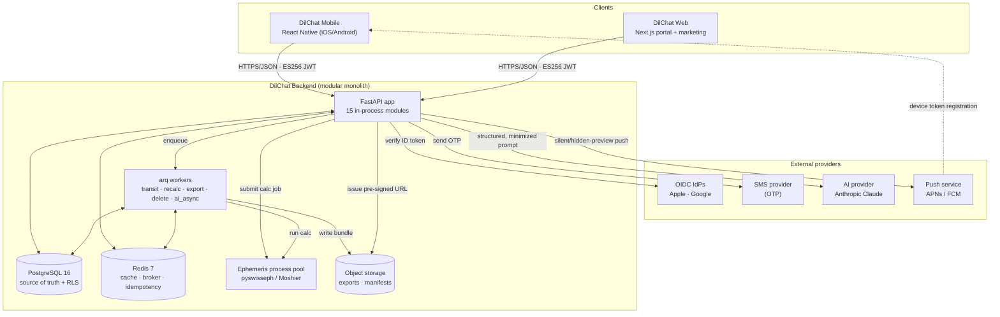

---

## 2. Container & component architecture

One process image runs in two roles selected at startup: **web role** (Uvicorn/Gunicorn serving FastAPI) and **worker role** (arq worker consuming queues). Both roles import the same `dilchat` package, share the same module services, and both talk to the **same** ephemeris process pool abstraction — so business logic is written once and called from either role.

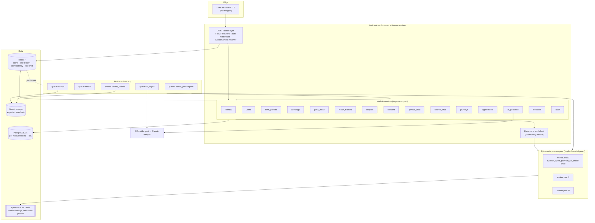

**Component notes**
- **API / Router layer** — thin. It authenticates, resolves a `ScopeContext`, applies rate limits + idempotency, then delegates to exactly one module service per request. No business logic lives in routers.
- **Module services** — the unit of isolation. Each exposes a Python port (a `Protocol`/ABC) other modules call; each owns its tables; none reaches into another's schema (P1/P2).
- **Ephemeris process pool** — a `ProcessPoolExecutor` of single-threaded workers, each initializing Swiss Ephemeris global state (`set_ephe_path`, `set_sid_mode(SE_SIDM_LAHIRI)`) exactly once (P8, DEC-007). Both web and worker roles submit to it; neither calls `swe.*` inline.
- **arq worker role** — five named queues (§9). Cron entries live here (nightly transit precompute).
- **Redis** — three logically separate concerns keyed by prefix: `cache:*`, `arq:*`, `idem:*`, `rl:*`, `sess:*`. Flushing cache never touches the broker.

---

## 3. Module responsibilities

All 15 modules, in dependency order (a module may depend only on modules **below** it, P2). Table prefix always equals the module name.

| Module | Owns (tables / domain) | Key operations (service port) | Depends on |
|--------|------------------------|-------------------------------|------------|
| **audit** | `audit_event` (append-only, hash-chained) | `emit(actor, action, scope, target, metadata)`; `verify_chain()` | — (leaf; imported by all) |
| **identity** | `identity_user_credential`, `identity_session`, `identity_oidc_link`, `identity_otp_challenge` | `register`, `authenticate`, `issue_access_jwt`, `rotate_refresh`, `revoke_session`, `verify_oidc`, `start_otp/verify_otp` | audit |
| **users** | `users_profile`, `users_preferences`, `users_device` (push tokens), `users_locale` | `get_profile`, `update_profile`, `register_device`, `set_notification_prefs` | identity, audit |
| **birth_profiles** | `birth_profiles_record` (encrypted birth coords/time), `birth_profiles_place_resolution` | `capture_birth_data`, `resolve_place` (GeoNames), `resolve_timezone` (zoneinfo/tzdata-2025b), `get_natal_inputs` | users, audit |
| **astrology** | `astrology_natal_chart`, `astrology_calc_trace` (jsonb) | `compute_natal(birth_inputs) -> chart` (Moon rashi/nakshatra/pada, ascendant context); wraps the ephemeris pool | birth_profiles, audit |
| **guna_milan** | `guna_milan_scorecard`, `guna_milan_koota_detail` | `compute_scorecard(chart_a, chart_b, role_map, rule_pack) -> 0..36 + 8 kootas` (immutable per version tuple, DEC-019) | astrology, audit |
| **moon_transits** | `moon_transits_global_daily` (per date+ephemeris), `moon_transits_user_daily_profile` | `precompute_global(date)`, `build_user_daily(user, date) -> emotional/interest climate` (`dilchat_transit_v1`, `dilchat_interest_v1`) | astrology, audit |
| **couples** | `couples_couple`, `couples_membership` (role, status active/revoked), `couples_pair_invite` | `create_invite`, `accept_invite`, `verify_membership(user, couple)`, `unpair` (flips to revoked → cascade revoke) | moon_transits, guna_milan, audit |
| **consent** | `consent_event`, `consent_shared_artifact` (immutable), `consent_revocation` | `request_share`, `grant`, `project(private_ref) -> shared_artifact`, `revoke` (per DEC-013 state machine) | couples, audit |
| **private_chat** | `private_chat_thread` (scope PRIVATE_A or PRIVATE_B), `private_chat_message`, `private_chat_context_snapshot` | `post_turn`, `list_thread`, `build_minimized_context` (for AI), `nominate_for_share` | consent, audit |
| **shared_chat** | `shared_chat_thread` (scope SHARED), `shared_chat_message` | `post_shared_message`, `list_shared`, `render_artifact_reference` | consent, audit |
| **journeys** | `journeys_template`, `journeys_instance`, `journeys_step_state` | `start_journey`, `advance_step`, `record_reflection` (private-scoped) | consent, audit |
| **agreements** | `agreements_agreement`, `agreements_party_signoff`, `agreements_version` | `draft`, `propose`, `sign` (two-party per OQ-8), `supersede` | consent, audit |
| **ai_guidance** | `ai_guidance_request`, `ai_guidance_output` (schema-validated), `ai_guidance_validation_failure` | `guide(task, minimized_input, schema) -> validated_output`; enforces disclaimers & DEC-021 guardrails | private_chat, shared_chat, journeys, agreements, audit |
| **feedback** | `feedback_rating`, `feedback_report`, `feedback_living_signal` (behavioral) | `rate_output`, `submit_living_signal` (`dilchat_living_v1`, jointly-visible aggregate only, OQ-9) | ai_guidance, audit |

**Cross-module rule of thumb:** if module X needs data from module Y, it calls `Y.service.<op>()`; it never issues SQL against a `Y_*` table. The `.importlinter` contract makes an illegal import a build failure (DEC-002).

---

## 4. Package / source layout

Under `products/dilchat/src/dilchat/`. Every module folder has the **same five-file shape** so the boundary is legible and mechanically checkable.

```text
products/dilchat/
├── pyproject.toml            # requires-python >=3.12 (DEC-010); dist name ugence-dilchat
├── README.md
├── alembic.ini
├── .importlinter             # dependency-order contract (DEC-002)
├── docs/                     # this file + peers
├── migrations/               # Alembic versions (one head; per-module table prefixes)
├── rules/
│   └── ashtakoota_lahiri_classical_v1/
│       ├── kootas/*.json     # 8 Koota tables
│       └── sources.json      # cited classical authority (DEC-009, frozen after review)
├── ephemeris/                # .se1 files provenance manifest (files baked into image)
├── tests/
└── src/dilchat/
    ├── __init__.py
    ├── app.py                # FastAPI factory; mounts routers; role selector (web|worker)
    ├── worker.py             # arq WorkerSettings; queues + cron
    ├── settings.py           # pydantic-settings; env config
    │
    ├── shared/               # cross-cutting, importable by all modules
    │   ├── scope.py          # ScopeContext dataclass + guard (PRIVATE_A/B/SHARED, P5)
    │   ├── provenance.py     # Provenance tuple builder/validator (P7)
    │   ├── db.py             # async engine, session, RLS session-var setter (SET app.user_id)
    │   ├── ports.py          # base Protocols / port registry
    │   ├── errors.py         # typed error hierarchy → HTTP mapping
    │   ├── idempotency.py    # Redis idempotency-key helper
    │   ├── ratelimit.py      # Redis token bucket
    │   ├── jobs.py           # enqueue(job_name, **kwargs) broker abstraction (DEC-006)
    │   ├── observability.py  # structured logging, metrics, trace context
    │   └── security/
    │       ├── jwt_es256.py  # access token mint/verify
    │       └── crypto.py     # Argon2id, field encryption for birth coords
    │
    ├── astrology/
    │   └── engine/
    │       ├── pool.py       # ProcessPoolExecutor of single-threaded swe procs (P8)
    │       ├── swe_worker.py # per-process init: set_ephe_path/set_sid_mode(LAHIRI)
    │       ├── moshier.py    # fallback path (FLG_MOSELPH); explicit labeling
    │       ├── nakshatra.py  # rashi/nakshatra/pada boundary logic
    │       └── timezone.py   # zoneinfo + timezonefinder resolution
    │
    └── modules/
        ├── audit/            { router, service, repository, models, schemas }.py
        ├── identity/         { router, service, repository, models, schemas }.py
        ├── users/            { router, service, repository, models, schemas }.py
        ├── birth_profiles/   { router, service, repository, models, schemas }.py
        ├── astrology/        { router, service, repository, models, schemas }.py
        ├── guna_milan/       { router, service, repository, models, schemas }.py
        ├── moon_transits/    { router, service, repository, models, schemas }.py
        ├── couples/          { router, service, repository, models, schemas }.py
        ├── consent/          { router, service, repository, models, schemas }.py
        ├── private_chat/     { router, service, repository, models, schemas }.py
        ├── shared_chat/      { router, service, repository, models, schemas }.py
        ├── journeys/         { router, service, repository, models, schemas }.py
        ├── agreements/       { router, service, repository, models, schemas }.py
        ├── ai_guidance/      { router, service, repository, models, schemas }.py
        │   └── providers/    # anthropic.py (default), openai.py (alt), base.py (port)
        └── feedback/         { router, service, repository, models, schemas }.py
```

**File contract per module**
- `router.py` — FastAPI `APIRouter`; DTO in/out; no business logic. Resolves `ScopeContext`, delegates to `service`.
- `service.py` — the **published port** + implementation. Transaction boundaries, invariants, provenance stamping, `audit.emit`.
- `repository.py` — the **only** place that issues SQL for this module's tables; every method requires a `ScopeContext`.
- `models.py` — SQLAlchemy 2 ORM (async) for this module's tables (`<module>_*`).
- `schemas.py` — Pydantic v2 request/response + internal DTOs.

---

## 5. Data flows

### 5a. Natal chart calculation (sync fast-path)

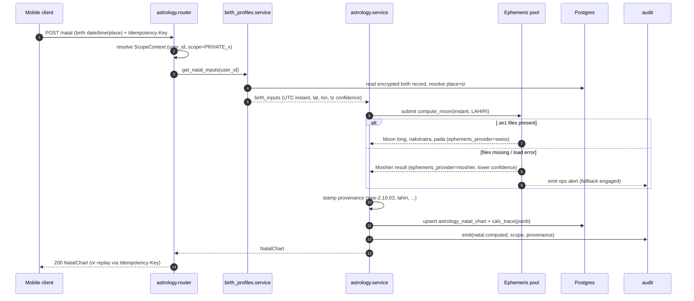

### 5b. Couple pairing + consent to pair

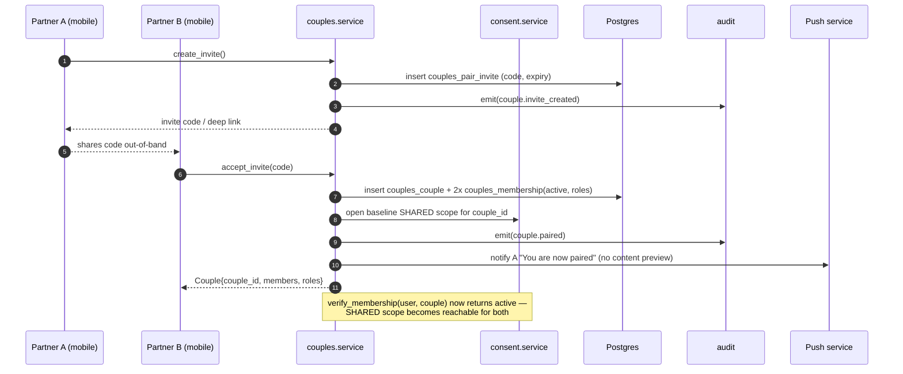

### 5c. Shared Guna Milan scorecard generation

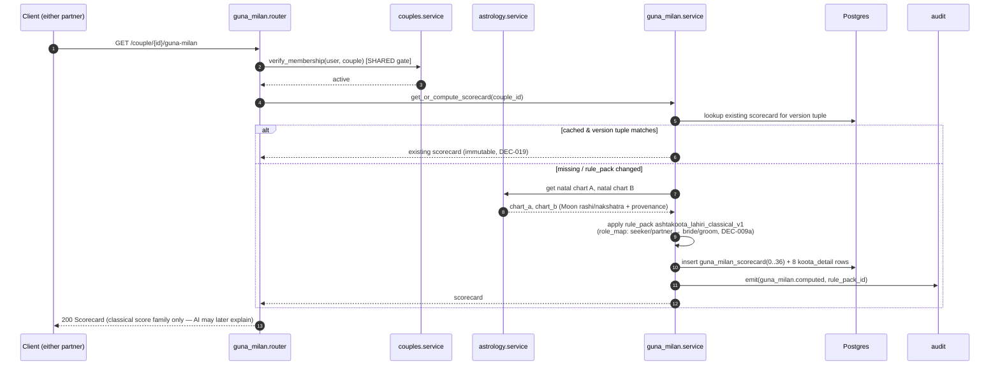

### 5d. Nightly global transit precompute + per-user daily profile

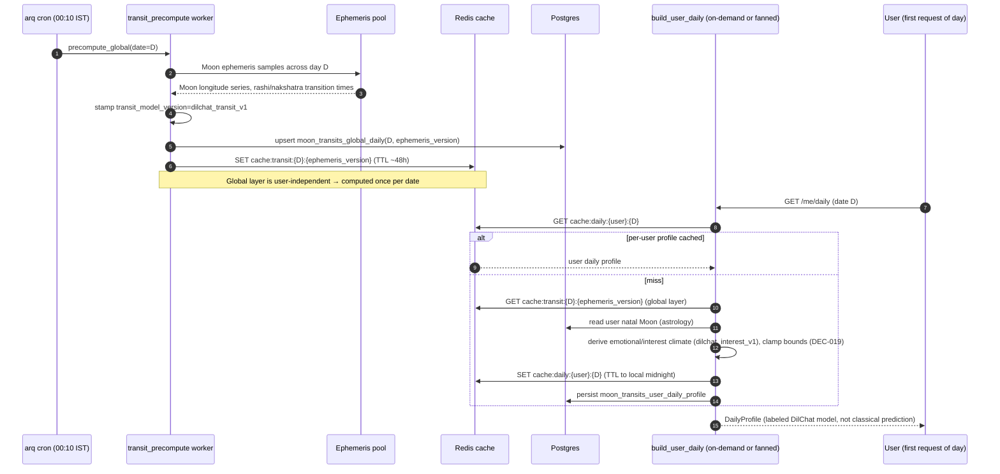

### 5e. Private AI chat turn with context minimization (sync + timeout fallback)

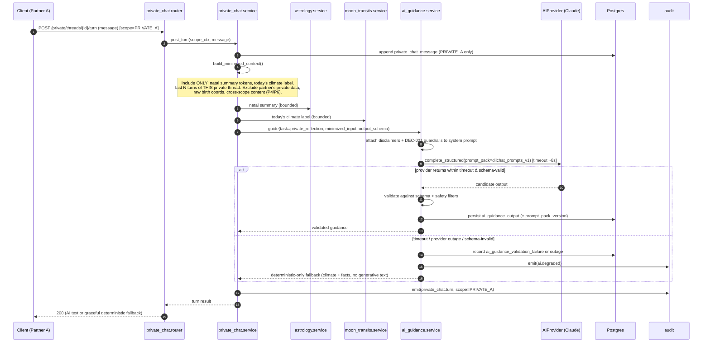

### 5f. Private → shared consent projection

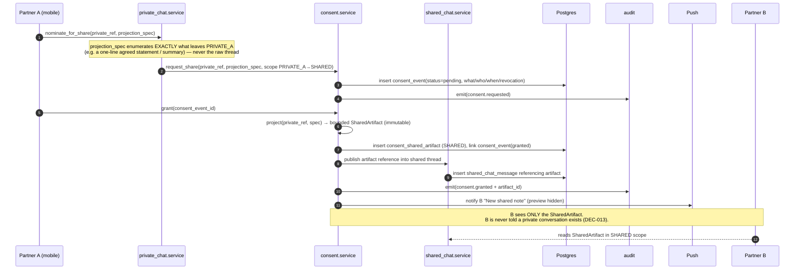

---

## 6. Trust boundaries

Boundaries are enforced, not assumed. Crossing any boundary requires an explicit, audited check.

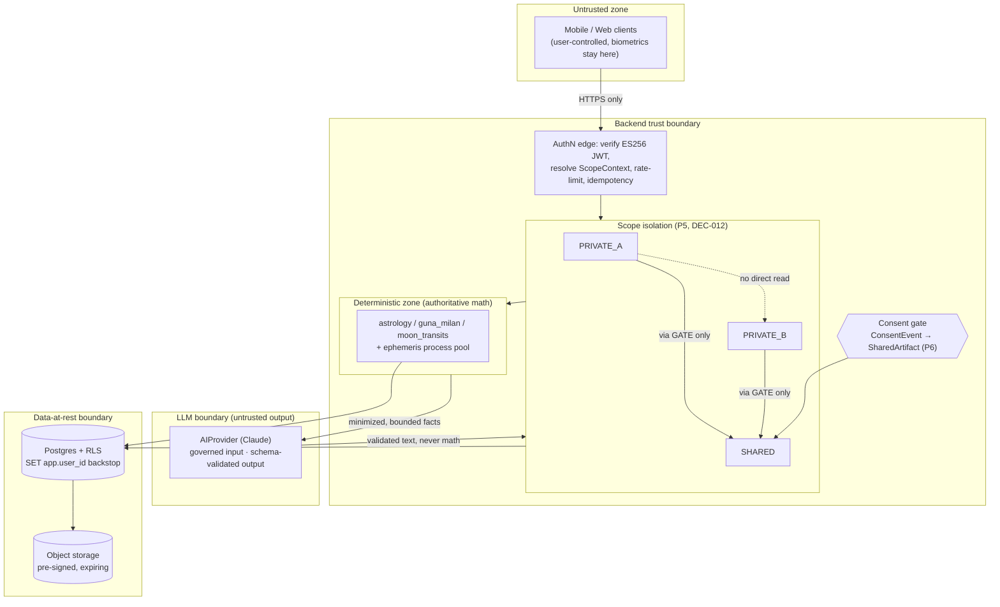

**Boundary prose**

1. **Client ↔ backend.** Everything client-side is untrusted, including biometric unlock (never leaves the device; the backend only ever sees a rotating opaque refresh token, DEC-011). The edge verifies the ES256 access JWT, then constructs a `ScopeContext` server-side; a client can never assert its own scope.
2. **Per-module boundaries.** A module is a trust boundary against its siblings: illegal cross-module imports fail the `.importlinter` build, and repositories refuse cross-prefix SQL (P1/P2). This limits blast radius — a bug in `journeys` cannot silently read `identity_session`.
3. **PRIVATE_A / PRIVATE_B / SHARED isolation.** The two private scopes never read each other, full stop. The **only** path from a private scope to `SHARED` is the consent gate (P6). Postgres RLS is the backstop: even if the app guard were bypassed, `SET app.user_id` + row policies deny cross-scope rows (DEC-012).
4. **Deterministic-calc vs LLM.** The heavy line in the diagram. Everything left of the LLM boundary is authoritative and reproducible from the provenance tuple. The LLM receives only minimized, consent-authorized, deterministic facts and returns text that is **schema-validated and never fed back as truth** into scores (P4, DEC-014, DEC-019). An LLM outage degrades to deterministic-only responses, never to guessed astronomy.
5. **Data-at-rest.** Birth coordinates are field-encrypted (OQ-6); exports/manifests live in object storage reachable only via short-lived pre-signed URLs.

---

## 7. Synchronous vs. asynchronous operations

The rule: **user-blocking, fast, and bounded → sync**; **fan-out, slow, retriable, or scheduled → async**.

| Operation | Mode | Why |
|-----------|------|-----|
| Natal chart calculation | **Sync** (submit to pool, await, ~tens of ms) | One Moon position; user is waiting on capture; deterministic and cheap. |
| Guna Milan scorecard (first compute) | **Sync**, then cached immutable | Two charts + table lookups; fast; immutable per version tuple so it is computed once. |
| Per-user daily profile (cache miss) | **Sync** off the precomputed global layer | Global transit already async-precomputed; per-user derivation is a cheap join. |
| Nightly **global** transit precompute | **Async** (arq cron) | User-independent, heavy across the day's samples; amortized once per `date+ephemeris_version`. |
| Versioned recalculation sweep (new rule_pack / model) | **Async** (`recalc` queue) | Potentially every user; must be chunked, throttled, retriable; never blocks a request. |
| Private AI chat turn | **Sync with timeout (~8s) + deterministic fallback** | Conversational latency matters; but bounded so a slow provider degrades gracefully (§5e). |
| Long/streamed AI generation (e.g. journey synthesis) | **Async** (`ai_async` queue) → push/poll | Exceeds interactive budget; result delivered later. |
| Data export bundle | **Async** (`export` queue) → pre-signed URL | Cross-module gather + serialization; slow; user notified on completion. |
| Account/couple deletion finalize | **Async** (`delete_finalize` queue) | Multi-module cascade + tombstoning; must be transactional-safe and auditable. |
| Consent grant / projection | **Sync** | Small, transactional, must be immediately consistent (SHARED becomes visible at once). |
| Unpair / session revoke | **Sync** | Security-critical; must take effect immediately (DEC-012). |

---

## 8. Client ↔ backend interaction patterns

### Authentication & session (DEC-011)

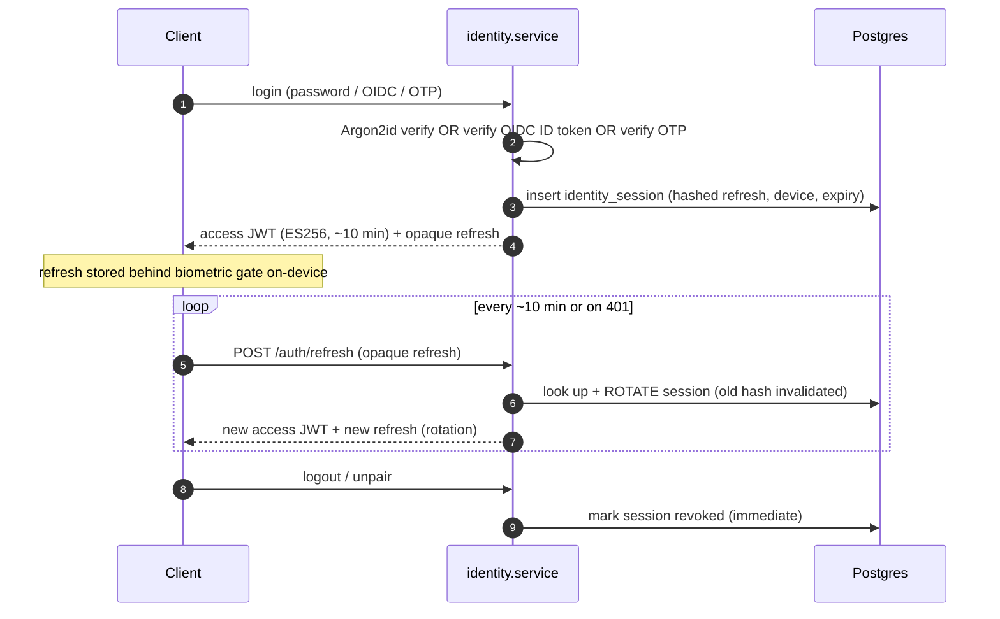

- **Access token:** stateless ES256 JWT, ~10 min TTL, carries `user_id` + minimal claims. Public key served for verification; private key in KMS.
- **Refresh token:** opaque, rotating, stored **hashed** server-side as `identity_session` rows so any session revokes instantly (unpair/logout invariant, DEC-011/DEC-012).
- **Biometric unlock** gates the on-device refresh token only; the backend never sees biometrics.

### Offline caching (client responsibility, backend-supported)
- Immutable, provenance-stamped artifacts (natal chart, Guna Milan scorecard) are safely cacheable on-device **keyed by provenance tuple**; a version change invalidates them.
- The daily profile carries a `valid_until` (local midnight, OQ-7) so clients know when to refetch.
- All list endpoints support `ETag` / `If-None-Match` and cursor pagination so an offline client reconciles cheaply on reconnect.

### Push notification privacy (§ meets DEC-013)
- **Previews hidden by default.** Push payloads carry a **category + opaque reference**, never message text, partner identity, or artifact content. The client fetches details over the authenticated API after unlock.
- A "new shared note" push must **never** reveal that a private conversation exists (P6).
- Notification content preferences live in `users_preferences`; the user may opt into richer previews explicitly.

### Web ↔ backend (Next.js, DEC-016)
- Marketing pages are SSR/static and hit no authenticated API.
- The account/consent/export/delete portal uses the **same** API and the same ES256/refresh model, with tokens in httpOnly, `SameSite=Strict` cookies for the portal origin.

---

## 9. Caching, background jobs, resilience

### Caching strategy (Redis, P3 — never source of truth)

| Cache key | Contents | TTL / invalidation |
|-----------|----------|--------------------|
| `cache:transit:{date}:{ephemeris_version}` | Global daily Moon transit layer | ~48h; keyed by ephemeris_version so a bump auto-separates |
| `cache:daily:{user_id}:{date}` | Per-user daily profile | Until local midnight (OQ-7); or model-version bump |
| `cache:natal:{user_id}:{provenance_hash}` | Natal chart summary tokens | Invalidated only by provenance change |
| `idem:{route}:{idempotency_key}` | Stored response for replay | ~24h; enforces at-most-once for mutating POSTs |
| `rl:{principal}:{window}` | Rate-limit token bucket | Sliding window |
| `sess:{jti_or_hash}` | Hot session lookup (backed by Postgres) | Short; Postgres authoritative |

### Background-job strategy (arq, DEC-006)

Five named queues; the broker is abstracted behind `shared/jobs.py::enqueue(job_name, **kwargs)` so arq→Celery is a swap, not a rewrite.

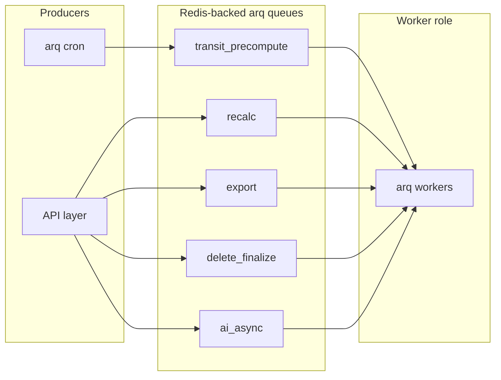

| Queue | Trigger | Idempotency key | Retry / backoff |
|-------|---------|-----------------|-----------------|
| `transit_precompute` | Cron 00:10 IST + on-demand backfill | `(date, ephemeris_version)` upsert | 3 tries, exp backoff; on persistent fail → ops alert, per-user path can compute on demand |
| `recalc` | New `rule_pack_id` / model version | `(entity_id, target_version)` | Chunked, throttled; each chunk retriable; resumable cursor |
| `export` | User export request | `(request_id)` | 3 tries; partial artifacts discarded on failure, re-gathered |
| `delete_finalize` | Account/couple deletion | `(deletion_id)` | Must reach terminal state; retries until tombstoned; audited each step |
| `ai_async` | Long AI generation | `(request_id)` | Timeout + fallback like §5e; failure → deterministic result recorded |

**Idempotency.** Every mutating POST accepts an `Idempotency-Key`; the edge stores the response under `idem:*` and replays it on duplicate delivery — covering mobile retries over flaky networks.

### Failure modes & degradation

| Failure | Detection | Degradation |
|---------|-----------|-------------|
| `.se1` ephemeris files missing/corrupt | Pool worker init check + checksum | Fall back to **Moshier**, stamp `ephemeris_provider="moshier"`, lower confidence, ops alert — never an unlabeled result (DEC-007) |
| Ephemeris pool saturated | Submit queue depth / latency | Backpressure sync callers with 503 + Retry-After; shed to async where allowed |
| AI provider outage / timeout / schema-invalid | Per-call timeout + schema validation | **Deterministic-only response** (facts + climate, no generative text); record `ai_guidance_validation_failure`; emit `ai.degraded` (P4) |
| Redis unavailable | Health probe | Serve from Postgres (slower); disable idempotency-required mutations if the store is down (fail safe, not silent double-write) |
| Postgres primary failover | Replica lag / connection loss | Read-only degraded mode for cached artifacts; block mutations until primary restored (Postgres is the only truth, P3) |

---

## 10. Observability

- **Structured logs** — JSON, one event per request/job. Standard fields: `request_id`, `user_id` (never PII beyond id), `module`, `scope`, `provenance_hash`, `latency_ms`, `outcome`. Birth coordinates and message content are **never** logged.
- **Metrics** (Prometheus-style):
  - `calc_latency_ms` (histogram, labeled `engine=swiss|moshier`)
  - `ephemeris_fallback_total` (counter — alerts if > 0 sustained)
  - `cache_hit_ratio` per cache family (`transit`, `daily`, `natal`, `idem`)
  - `ai_validation_failure_rate`, `ai_timeout_total`, `ai_degraded_total`
  - `queue_depth` / `job_retry_total` per arq queue
  - `consent_projection_total`, `scope_denied_total` (RLS/guard denials — a spike is a red flag)
- **Audit event emission** — the `audit` module records a hash-chained, append-only `audit_event` for every security- or consent-relevant action (`natal.computed`, `couple.paired`, `consent.granted`, `ai.degraded`, `session.revoked`). `verify_chain()` detects tampering; auditability is a first-class product requirement, not a log.
- **Tracing** — W3C `traceparent` propagated from the edge through module services into the ephemeris pool submission and the AI call, so a single chat turn's fan-out (private_chat → astrology → moon_transits → ai_guidance → provider) is one trace.

---

## 11. Deployment topology & module extraction path

### Deployment (DEC-018, India-first per OQ-13)

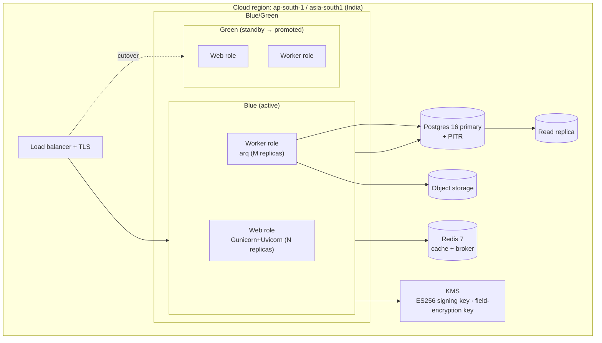

- **Containerized (Docker).** One image, role selected by entrypoint (`web` vs `worker`). Ephemeris `.se1` files baked in at a pinned checksum (DEC-007).
- **Blue/green.** New version deployed to green, health-checked (including an ephemeris self-test and a golden-chart assertion), then load balancer cutover; old color kept warm for fast rollback. **Alembic migrations are expand/contract** so blue and green tolerate one schema step between them.
- **Single region for MVP**; data-model carries `couple_id`/`user_id` residency keys so later multi-region partitioning (GDPR/CCPA) is additive, not a rewrite (DEC-018).

### Module extraction path (how a module becomes a service later)

The modular monolith is deliberately shaped so extraction is mechanical, not archaeological. For any candidate module:

1. **The published interface already exists.** Callers use `Module.service` ports (Python `Protocol`s), never its tables (P1). Extraction replaces the in-process port implementation with a network client behind the *same* interface — callers do not change.
2. **Extract table ownership cleanly.** Because every table is prefixed with its module name and no other module issues SQL against it, the module's tables move to (or stay logically owned by) the new service without untangling shared schema.
3. **Introduce network transport.** Swap the in-process call for gRPC/HTTP behind the port. `shared/jobs.py` and `shared/ports.py` localize where transport is chosen, so the change is confined.
4. **Re-establish observability & auth across the wire.** Propagate `traceparent`, re-verify `ScopeContext` at the new service edge (it must not trust an upstream assertion), keep audit emission.

**Easy to extract (leaf-ward, few invariants):**
- `astrology` + the ephemeris pool — pure, deterministic, provenance-stamped; a natural first "calculation service." Its process-pool isolation is already a de-facto service boundary (P8).
- `moon_transits` — mostly reads astrology + a heavy async precompute; extracting it isolates the nightly compute cost.
- `ai_guidance` — already behind the `AIProvider` port and consumes only minimized inputs; extracting it hardens the LLM boundary (P4).

**Hard to extract (the couple-scope invariants, DEC-002/012/013):**
- `couples` + `consent` + the three scopes are the reason MVP is a monolith. Pairing, membership revocation, and the private→shared projection are **transactional invariants** that today hold inside one Postgres transaction. Splitting them across services turns "grant consent and publish exactly one bounded SharedArtifact, atomically, while the other partner is never told a private thread exists" into a distributed saga with compensation logic. That is a deliberate *do-not-extract-first* zone: `private_chat`/`shared_chat` may leave, but `couples`+`consent` stay co-located until there is a hard operational reason and a proven saga design.

Extraction order recommendation: `astrology` → `moon_transits` → `ai_guidance` first; keep `identity`/`couples`/`consent` as the transactional core last.

---

## 12. Cross-references

| Document | What it authoritatively defines |
|----------|--------------------------------|
| [`DILCHAT_DECISION_LOG.md`](./DILCHAT_DECISION_LOG.md) | **Canonical.** All decisions (DEC-001…DEC-021), canonical identifiers/provenance tuple, open questions. This architecture restates, never overrides. |
| [`DILCHAT_API_SPEC.md`](./DILCHAT_API_SPEC.md) / [`openapi/dilchat.openapi.yaml`](./openapi/dilchat.openapi.yaml) | Endpoint shapes, DTOs, error codes, idempotency headers referenced in §5 and §8. |
| [`DILCHAT_ASTROLOGY_ENGINE_SPEC.md`](./DILCHAT_ASTROLOGY_ENGINE_SPEC.md) | Ephemeris math, ayanamsa handling, nakshatra/pada boundaries, ambiguous-time handling behind §5a and the `astrology/engine`. |
| [`DILCHAT_PRIVACY_CONSENT_AND_SECURITY.md`](./DILCHAT_PRIVACY_CONSENT_AND_SECURITY.md) | Full `ConsentEvent → SharedArtifact` state machine, scope guard details, retention/encryption behind §5f and §6. |
| [`DILCHAT_TEST_AND_VALIDATION_PLAN.md`](./DILCHAT_TEST_AND_VALIDATION_PLAN.md) | Golden-chart oracle validation (DEC-020) referenced by the blue/green health check in §11. |

---

*End of `DILCHAT_BACKEND_ARCHITECTURE.md`. Subordinate to the decision log; update in lockstep when a DEC changes.*
