# DilChat Backend — Data Model & Schema Design

> **Hardening update (Phase A/B):** birth_profiles/natal_chart_snapshots gained uncertainty-interval, per-field status, and provider-safety columns; single-value natal columns are nullable (migration 9c2b82ab02d2). RLS added on all tables (a1b2c3d4e5f6). See `DILCHAT_PHASE_A_B_HARDENING_REPORT.md` and Decision-Log DEC-029…DEC-035.

**Product:** DilChat (consumer) · **Company:** Ugence Labs · **Site:** dilchat.com
**Status of this document:** Design phase. **DESIGN-ONLY** — no production code, no
migration files, no ORM classes. Schema is expressed as specification tables and
simplified DDL *sketches* only.
**Canonical reference:** `DILCHAT_DECISION_LOG.md` (authoritative for names,
versions, module boundaries). This document cites it rather than re-deciding.

> **Reading contract.** Every rule in this document derives from the decision log.
> Where a design choice is load-bearing, the source decision is cited inline as
> `(DEC-nnn)` or `(OQ-n)`. If this document and the decision log disagree, the
> decision log wins and this document is the bug.

---

## 0. Design canon (restated, authoritative source = decision log)

| Canon | Value | Source |
|-------|-------|--------|
| Database | PostgreSQL 16, SQLAlchemy 2.x async, Alembic | DEC-004 |
| Table ownership | Every table name is prefixed by its owning module | DEC-002 |
| Privacy scopes | `PRIVATE_A`, `PRIVATE_B`, `SHARED` | DEC-001, DEC-012 |
| Authorization | App-layer `ScopeContext` guard (primary) + Postgres RLS (backstop), default-deny | DEC-012 |
| Private → shared | Only via a `ConsentEvent` producing a **bounded** `SharedArtifact`; never a raw row copy | DEC-013 |
| Score separation | Classical / Daily-derived / Living scored & versioned separately, never merged | DEC-019 |
| Immutability | Classical Guna Milan & NatalChart immutable per version tuple | DEC-019 |
| Versioning | Birth profiles are versioned (supersedes chain); recalculation creates new rows, never mutates history | DEC-019 |

**Provenance tuple** (stamped on every derived artifact; DEC-000 §0 / DEC-019):

```
(ephemeris_version, ayanamsa, rule_pack_id,
 transit_model_version, interest_model_version, prompt_pack_version)
```

MVP pinned values: `ephemeris_version=swe-2.10.03`, `ayanamsa=lahiri`,
`rule_pack_id=ashtakoota_lahiri_classical_v1`, `transit_model_version=dilchat_transit_v1`,
`interest_model_version=dilchat_interest_v1`, `prompt_pack_version=dilchat_prompts_v1`.

**Module → table-prefix map (15 modules).** Each module owns exactly the tables
whose names begin with its prefix. Cross-module reads go through service ports,
never raw SQL against another module's tables (DEC-002).

| Module | Prefix | Owns |
|--------|--------|------|
| identity | `identity_` | AuthIdentity, Session, Device |
| users | `users_` | User, UserPreferences |
| birth_profiles | `birth_` | BirthProfile |
| astrology | `astro_` | NatalChart |
| guna_milan | `guna_` | GunaMilanReport |
| moon_transits | `transit_` | DailyTransitGlobal, DailyPersonalProfile, CoupleClimate |
| couples | `couple_` | CoupleInvitation, Couple, CoupleMembership |
| consent | `consent_` | ConsentGrant, ConsentEvent, SharedArtifact |
| private_chat | `pchat_` | PrivateConversation, PrivateMessage |
| shared_chat | `schat_` | SharedConversation, SharedMessage |
| journeys | `journey_` | Journey, JourneyStep |
| agreements | `agree_` | CompromiseSession, Agreement, AgreementApproval, Commitment, OutcomeFeedback |
| ai_guidance | `ai_` | (no owned persistent tables in this cut; stateless port, DEC-014) |
| feedback | `fb_` | FeedbackEvent, LivingCompatScore |
| audit | `audit_` | AuditEvent |

**Conventions used throughout.**
- **PK:** all `id` columns are `UUID` (`gen_random_uuid()`, pgcrypto) unless noted.
- **Timestamps:** `TIMESTAMPTZ`, UTC, `NOT NULL DEFAULT now()` unless nullable by meaning.
- **Encryption class** column values: `PUBLIC`, `INTERNAL`, `SENSITIVE`, `HIGHLY-SENSITIVE` (§6).
  `app-enc` in a Notes cell means the column is envelope-encrypted **at the application layer** (ciphertext stored in `bytea`), on top of full-disk/tablespace encryption.
- **Scope** column values: `n/a` (not scope-bearing / global), `USER` (owner = user_id),
  `PRIVATE_A/B` (couple-slot-bound private), `SHARED` (couple-shared).

---

## 1. Entity–relationship diagram (grouped by module)

```mermaid
erDiagram
    User ||--o{ AuthIdentity : "has"
    User ||--o{ Session : "opens"
    User ||--o{ Device : "registers"
    User ||--|| UserPreferences : "has"
    User ||--o{ BirthProfile : "owns (versioned)"
    BirthProfile ||--o| BirthProfile : "supersedes"
    BirthProfile ||--o{ NatalChart : "derives (immutable)"

    NatalChart ||--o{ GunaMilanReport : "seeker_chart"
    NatalChart ||--o{ GunaMilanReport : "partner_chart"
    NatalChart ||--o{ DailyPersonalProfile : "feeds"
    DailyTransitGlobal ||--o{ DailyPersonalProfile : "input (by date+ver)"

    User ||--o{ CoupleMembership : "member_of"
    Couple ||--o{ CoupleMembership : "has (2 slots A/B)"
    Couple ||--o{ CoupleInvitation : "created_from"
    Couple ||--o| GunaMilanReport : "couple_scoped"
    Couple ||--o{ CoupleClimate : "daily"

    Couple ||--o{ ConsentGrant : "governs"
    ConsentGrant ||--o{ ConsentEvent : "logs"
    ConsentEvent ||--o| SharedArtifact : "produces (bounded)"
    Couple ||--o{ SharedArtifact : "holds"

    User ||--o{ PrivateConversation : "owns"
    PrivateConversation ||--o{ PrivateMessage : "contains (enc)"
    Couple ||--o{ SharedConversation : "has"
    SharedConversation ||--o{ SharedMessage : "contains"

    Couple ||--o{ Journey : "runs"
    Journey ||--o{ JourneyStep : "has"
    Couple ||--o{ CompromiseSession : "runs"
    Couple ||--o{ Agreement : "holds"
    Agreement ||--o{ AgreementApproval : "approved_by"
    Agreement ||--o{ Commitment : "obliges"
    Agreement ||--o{ OutcomeFeedback : "reviewed_by"

    User ||--o{ FeedbackEvent : "submits"
    Couple ||--o{ LivingCompatScore : "aggregate"
    User ||--o{ AuditEvent : "actor (nullable)"
```



> Diagram is intentionally reduced to core cardinalities. Note the **absence of any
> edge from `PrivateMessage` to `SharedMessage`** — that non-edge is a security
> invariant, not an omission (§4).

---

## 2. Per-module table specifications

Legend: **N?** = nullable (`Y`/`N`). **Enc** = encryption class (§6).

### 2.1 Module `identity` (DEC-011)

#### `identity_auth_identity` — AuthIdentity
| Column | Type | N? | Scope | Enc | Notes |
|--------|------|----|-------|-----|-------|
| id | UUID PK | N | USER | INTERNAL | |
| user_id | UUID FK→`users_user.id` | N | USER | INTERNAL | ON DELETE CASCADE |
| provider | TEXT `[password\|apple\|google\|phone\|email]` | N | USER | INTERNAL | CHECK enum |
| provider_subject | TEXT | Y | USER | SENSITIVE | OIDC `sub` / phone / email; null for password |
| credential_hash | TEXT | Y | USER | HIGHLY-SENSITIVE | Argon2id hash; null for federated |
| created_at | TIMESTAMPTZ | N | USER | INTERNAL | |

Unique: `(provider, provider_subject)` where `provider_subject IS NOT NULL`.

#### `identity_session` — Session
| Column | Type | N? | Scope | Enc | Notes |
|--------|------|----|-------|-----|-------|
| id | UUID PK | N | USER | INTERNAL | |
| user_id | UUID FK→`users_user.id` | N | USER | INTERNAL | ON DELETE CASCADE |
| refresh_token_hash | TEXT | N | USER | HIGHLY-SENSITIVE | opaque token, stored hashed (DEC-011) |
| device_id | UUID FK→`identity_device.id` | Y | USER | INTERNAL | ON DELETE SET NULL |
| issued_at | TIMESTAMPTZ | N | USER | INTERNAL | |
| expires_at | TIMESTAMPTZ | N | USER | INTERNAL | |
| rotated_from_id | UUID FK→`identity_session.id` | Y | USER | INTERNAL | rotation chain; self-FK |
| revoked_at | TIMESTAMPTZ | Y | USER | INTERNAL | non-null ⇒ dead; unpair/logout sets fast |
| ip | INET | Y | USER | SENSITIVE | |
| user_agent | TEXT | Y | USER | INTERNAL | |

Unique: `refresh_token_hash`. Index: `(user_id) WHERE revoked_at IS NULL`.

#### `identity_device` — Device
| Column | Type | N? | Scope | Enc | Notes |
|--------|------|----|-------|-----|-------|
| id | UUID PK | N | USER | INTERNAL | |
| user_id | UUID FK→`users_user.id` | N | USER | INTERNAL | ON DELETE CASCADE |
| platform | TEXT `[ios\|android\|web]` | N | USER | INTERNAL | |
| push_token | TEXT | Y | USER | SENSITIVE | rotates; null if push disabled |
| biometric_enabled | BOOLEAN | N | USER | INTERNAL | client gate only; no biometric leaves device (DEC-011) |
| last_seen | TIMESTAMPTZ | Y | USER | INTERNAL | |

### 2.2 Module `users`

#### `users_user` — User
| Column | Type | N? | Scope | Enc | Notes |
|--------|------|----|-------|-----|-------|
| id | UUID PK | N | USER | INTERNAL | root identity anchor |
| status | TEXT `[active\|deactivated\|deletion_pending\|deleted]` | N | USER | INTERNAL | lifecycle (§9) |
| primary_locale | TEXT (BCP-47) | N | USER | INTERNAL | e.g. `en-IN`, `hi-IN` |
| created_at | TIMESTAMPTZ | N | USER | INTERNAL | |
| deleted_at | TIMESTAMPTZ | Y | USER | INTERNAL | set at purge finalization |

#### `users_preferences` — UserPreferences
| Column | Type | N? | Scope | Enc | Notes |
|--------|------|----|-------|-----|-------|
| user_id | UUID **PK & FK**→`users_user.id` | N | USER | INTERNAL | 1:1 |
| notification_privacy | TEXT `[hidden\|generic\|full]` DEFAULT `hidden` | N | USER | INTERNAL | privacy-safe default (DEC-013 spirit) |
| daily_refresh_pref | TEXT | Y | USER | INTERNAL | local-midnight default (OQ-7) |
| behavioral_personalization_enabled | BOOLEAN DEFAULT `true` | N | USER | INTERNAL | gates Living Compat inputs (DEC-019) |
| locale | TEXT (BCP-47) | Y | USER | INTERNAL | overrides primary_locale for UI |

### 2.3 Module `birth_profiles`

#### `birth_profile` — BirthProfile (VERSIONED, supersedes chain; DEC-019, OQ-6)
| Column | Type | N? | Scope | Enc | Notes |
|--------|------|----|-------|-----|-------|
| id | UUID PK | N | USER | INTERNAL | |
| user_id | UUID FK→`users_user.id` | N | USER | INTERNAL | ON DELETE CASCADE |
| version | INT | N | USER | INTERNAL | monotonic per user |
| supersedes_id | UUID FK→`birth_profile.id` | Y | USER | INTERNAL | self-FK; null on v1 |
| preferred_name | TEXT | N | USER | SENSITIVE | display name |
| dob_date | DATE | N | USER | SENSITIVE | calendar date of birth |
| birth_time | TIME | Y | USER | **HIGHLY-SENSITIVE** | **app-enc**; null if unknown |
| birth_time_type | TEXT `[exact\|approximate\|unknown]` | N | USER | INTERNAL | drives confidence (DEC-017) |
| birthplace_label | TEXT | N | USER | SENSITIVE | human place string |
| latitude | NUMERIC(9,6) | Y | USER | **HIGHLY-SENSITIVE** | **app-enc**; birth coordinate (OQ-6) |
| longitude | NUMERIC(9,6) | Y | USER | **HIGHLY-SENSITIVE** | **app-enc**; birth coordinate (OQ-6) |
| iana_tz_historical | TEXT | N | USER | INTERNAL | e.g. `Asia/Kolkata`, resolved over `tzdata-2025b` |
| birth_confidence | NUMERIC(4,3) `[0..1]` | N | USER | INTERNAL | CHECK 0≤x≤1 |
| current_location_coarse | TEXT | Y | USER | SENSITIVE | coarse (city/region) for daily UX (OQ-6) |
| current_tz | TEXT | Y | USER | INTERNAL | IANA zone for local-midnight refresh (OQ-7) |
| created_at | TIMESTAMPTZ | N | USER | INTERNAL | |

**Immutability of history:** rows are never updated for astrological fields.
Editing birth data creates a **new version** row (`version+1`, `supersedes_id`=prior)
and triggers recalculation (new NatalChart). Old rows and their charts are retained.
Unique: `(user_id, version)`. Partial index: “current” = row with no successor.

### 2.4 Module `astrology`

#### `astro_natal_chart` — NatalChart (IMMUTABLE; DEC-007, DEC-008, DEC-019)
| Column | Type | N? | Scope | Enc | Notes |
|--------|------|----|-------|-----|-------|
| id | UUID PK | N | USER | INTERNAL | |
| birth_profile_id | UUID FK→`birth_profile.id` | N | USER | INTERNAL | |
| birth_profile_version | INT | N | USER | INTERNAL | denormalized for provenance |
| ephemeris_provider | TEXT `[swiss\|moshier]` | N | USER | INTERNAL | DEC-007 |
| ephemeris_version | TEXT | N | USER | INTERNAL | e.g. `swe-2.10.03` |
| ayanamsa | TEXT | N | USER | INTERNAL | `lahiri` (DEC-008) |
| julian_day_ut | DOUBLE PRECISION | N | USER | INTERNAL | JD UT of birth |
| moon_longitude_sidereal | NUMERIC(9,6) | N | USER | INTERNAL | degrees |
| moon_rashi | SMALLINT `[0..11]` | N | USER | INTERNAL | |
| moon_nakshatra | SMALLINT `[0..26]` | N | USER | INTERNAL | |
| moon_pada | SMALLINT `[1..4]` | N | USER | INTERNAL | |
| ascendant_sidereal | NUMERIC(9,6) | Y | USER | INTERNAL | null if birth_time unknown (OQ-4) |
| ascendant_rashi | SMALLINT | Y | USER | INTERNAL | null if unknown |
| confidence | NUMERIC(4,3) | N | USER | INTERNAL | folds birth_time_type + provider |
| calc_timestamp | TIMESTAMPTZ | N | USER | INTERNAL | when computed |
| calc_trace | JSONB | N | USER | INTERNAL | inputs, flags, tz-resolution notes (audit) |

Immutable after insert (no UPDATE; enforced by trigger + RLS, §6/§10).
Unique: `(birth_profile_id, ephemeris_version, ayanamsa)`.

### 2.5 Module `guna_milan`

#### `guna_report` — GunaMilanReport (IMMUTABLE; DEC-009, DEC-019)
| Column | Type | N? | Scope | Enc | Notes |
|--------|------|----|-------|-----|-------|
| id | UUID PK | N | SHARED* | INTERNAL | *couple-scoped if paired; USER-preview if `couple_id` null |
| couple_id | UUID FK→`couple.id` | Y | SHARED | INTERNAL | **null ⇒ single-user private preview** (OQ-3) |
| seeker_chart_id | UUID FK→`astro_natal_chart.id` | N | — | INTERNAL | |
| partner_chart_id | UUID FK→`astro_natal_chart.id` | N | — | INTERNAL | |
| rule_pack_id | TEXT | N | — | INTERNAL | `ashtakoota_lahiri_classical_v1` |
| ephemeris_version | TEXT | N | — | INTERNAL | provenance |
| ayanamsa | TEXT | N | — | INTERNAL | provenance |
| components | JSONB | N | — | INTERNAL | 8 named Koota scores + per-component trace |
| total_score | INT `[0..36]` | N | — | INTERNAL | CHECK 0≤x≤36 |
| applied_exception_ids | JSONB | N | — | INTERNAL | Nadi/Bhakoot exceptions applied |
| input_confidence | NUMERIC(4,3) | N | — | INTERNAL | min of chart confidences |
| calc_trace | JSONB | N | — | INTERNAL | full deterministic trace |
| created_at | TIMESTAMPTZ | N | — | INTERNAL | |

Immutable after insert. Unique: `(seeker_chart_id, partner_chart_id, rule_pack_id, ephemeris_version, ayanamsa)`
— the **version-tuple uniqueness** guaranteeing “compute once per tuple.” The
single-user private-preview case has `couple_id = NULL`; access then falls back to
USER-scope on the owning chart’s `user_id` (see §4/§6).

### 2.6 Module `moon_transits`

#### `transit_daily_global` — DailyTransitGlobal (global cache; DEC-005)
| Column | Type | N? | Scope | Enc | Notes |
|--------|------|----|-------|-----|-------|
| id | UUID PK | N | n/a (GLOBAL) | PUBLIC | not user data |
| date | DATE | N | n/a | PUBLIC | UT date |
| transit_model_version | TEXT | N | n/a | PUBLIC | `dilchat_transit_v1` |
| ephemeris_version | TEXT | N | n/a | PUBLIC | |
| transit_moon_longitude | NUMERIC(9,6) | N | n/a | PUBLIC | |
| transit_rashi | SMALLINT | N | n/a | PUBLIC | |
| transit_nakshatra | SMALLINT | N | n/a | PUBLIC | |
| transit_pada | SMALLINT | N | n/a | PUBLIC | |
| next_rashi_transition_at | TIMESTAMPTZ | Y | n/a | PUBLIC | surfaced within day (OQ-7) |
| next_nakshatra_transition_at | TIMESTAMPTZ | Y | n/a | PUBLIC | |
| tithi | SMALLINT | Y | n/a | PUBLIC | computed now, surfaced later (OQ-5) |
| lunar_phase | TEXT | Y | n/a | PUBLIC | |
| calc_trace | JSONB | N | n/a | INTERNAL | |

Unique: `(date, ephemeris_version, transit_model_version)`. RLS-exempt (global, read-all authenticated).

#### `transit_daily_personal` — DailyPersonalProfile
| Column | Type | N? | Scope | Enc | Notes |
|--------|------|----|-------|-----|-------|
| id | UUID PK | N | USER | INTERNAL | |
| user_id | UUID FK→`users_user.id` | N | USER | INTERNAL | ON DELETE CASCADE |
| natal_chart_id | UUID FK→`astro_natal_chart.id` | N | USER | INTERNAL | |
| date | DATE | N | USER | INTERNAL | local-day (OQ-7) |
| house_from_moon | SMALLINT | N | USER | INTERNAL | MVP primary (OQ-4) |
| house_from_asc | SMALLINT | Y | USER | INTERNAL | null if no ascendant |
| tara_bala | TEXT | N | USER | INTERNAL | |
| chandra_bala | TEXT | N | USER | INTERNAL | |
| interest_scores | JSONB | N | USER | INTERNAL | 12 interest themes (DEC-019) |
| emotional_comfort | NUMERIC(4,3) | N | USER | INTERNAL | derived climate |
| sensitivity | NUMERIC(4,3) | N | USER | INTERNAL | |
| expression_tendency | NUMERIC(4,3) | N | USER | INTERNAL | |
| receptivity | NUMERIC(4,3) | N | USER | INTERNAL | |
| need_for_space | NUMERIC(4,3) | N | USER | INTERNAL | |
| decision_steadiness | NUMERIC(4,3) | N | USER | INTERNAL | |
| confidence | NUMERIC(4,3) | N | USER | INTERNAL | |
| transit_model_version | TEXT | N | USER | INTERNAL | provenance |
| interest_model_version | TEXT | N | USER | INTERNAL | provenance |
| explanation_trace | JSONB | N | USER | INTERNAL | |

Unique: `(user_id, date, transit_model_version, interest_model_version)` — version-tuple uniqueness.

#### `transit_couple_climate` — CoupleClimate
| Column | Type | N? | Scope | Enc | Notes |
|--------|------|----|-------|-----|-------|
| id | UUID PK | N | SHARED | INTERNAL | |
| couple_id | UUID FK→`couple.id` | N | SHARED | INTERNAL | |
| date | DATE | N | SHARED | INTERNAL | |
| tension_risk | NUMERIC(4,3) | N | SHARED | INTERNAL | |
| synchronization | NUMERIC(4,3) | N | SHARED | INTERNAL | |
| shared_guidance | JSONB | N | SHARED | INTERNAL | neutral shared summary (OQ-8) |
| confidence | NUMERIC(4,3) | N | SHARED | INTERNAL | |
| model_version | TEXT | N | SHARED | INTERNAL | provenance |

Unique: `(couple_id, date, model_version)`.

### 2.7 Module `couples` (DEC-012)

#### `couple_invitation` — CoupleInvitation
| Column | Type | N? | Scope | Enc | Notes |
|--------|------|----|-------|-----|-------|
| id | UUID PK | N | USER | INTERNAL | |
| inviter_user_id | UUID FK→`users_user.id` | N | USER | INTERNAL | |
| token_hash | TEXT | N | USER | HIGHLY-SENSITIVE | invite token stored hashed |
| status | TEXT `[pending\|accepted\|expired\|revoked]` | N | USER | INTERNAL | |
| accepted_by_user_id | UUID FK→`users_user.id` | Y | USER | INTERNAL | |
| created_at | TIMESTAMPTZ | N | USER | INTERNAL | |
| expires_at | TIMESTAMPTZ | N | USER | INTERNAL | |
| accepted_at | TIMESTAMPTZ | Y | USER | INTERNAL | |

Unique: `token_hash`.

#### `couple_couple` — Couple
| Column | Type | N? | Scope | Enc | Notes |
|--------|------|----|-------|-----|-------|
| id | UUID PK | N | SHARED | INTERNAL | the shared workspace anchor |
| status | TEXT `[active\|unpaired]` | N | SHARED | INTERNAL | unpair flips to `unpaired` (§8) |
| created_at | TIMESTAMPTZ | N | SHARED | INTERNAL | |
| unpaired_at | TIMESTAMPTZ | Y | SHARED | INTERNAL | |

#### `couple_membership` — CoupleMembership (the scope-slot binding; §4)
| Column | Type | N? | Scope | Enc | Notes |
|--------|------|----|-------|-----|-------|
| id | UUID PK | N | SHARED | INTERNAL | |
| couple_id | UUID FK→`couple.id` | N | SHARED | INTERNAL | |
| user_id | UUID FK→`users_user.id` | N | SHARED | INTERNAL | |
| scope_slot | TEXT `[A\|B]` | N | SHARED | INTERNAL | maps user→PRIVATE_A/PRIVATE_B (§4) |
| role | TEXT | N | SHARED | INTERNAL | product role label |
| status | TEXT `[active\|revoked]` | N | SHARED | INTERNAL | unpair ⇒ revoked immediately (§8) |
| joined_at | TIMESTAMPTZ | N | SHARED | INTERNAL | |
| revoked_at | TIMESTAMPTZ | Y | SHARED | INTERNAL | |

Unique: `(couple_id, scope_slot)` and `(couple_id, user_id)`. These two constraints
guarantee exactly two slots per couple and one membership per user per couple.

### 2.8 Module `consent` (DEC-013)

#### `consent_grant` — ConsentGrant
| Column | Type | N? | Scope | Enc | Notes |
|--------|------|----|-------|-----|-------|
| id | UUID PK | N | SHARED | INTERNAL | |
| couple_id | UUID FK→`couple.id` | N | SHARED | INTERNAL | |
| granter_user_id | UUID FK→`users_user.id` | N | SHARED | INTERNAL | |
| artifact_type | TEXT | N | SHARED | INTERNAL | enumerated projection type |
| scope_from | TEXT `[PRIVATE_A\|PRIVATE_B]` | N | SHARED | INTERNAL | source scope |
| scope_to | TEXT `[SHARED]` | N | SHARED | INTERNAL | always SHARED |
| purpose | TEXT | N | SHARED | INTERNAL | bounded purpose string |
| state | TEXT `[requested\|granted\|revoked\|expired]` | N | SHARED | INTERNAL | |
| created_at | TIMESTAMPTZ | N | SHARED | INTERNAL | |
| expires_at | TIMESTAMPTZ | Y | SHARED | INTERNAL | |

#### `consent_event` — ConsentEvent (the projection authority; §4)
| Column | Type | N? | Scope | Enc | Notes |
|--------|------|----|-------|-----|-------|
| id | UUID PK | N | SHARED | INTERNAL | |
| grant_id | UUID FK→`consent_grant.id` | N | SHARED | INTERNAL | |
| event_type | TEXT `[request\|grant\|revoke\|expire]` | N | SHARED | INTERNAL | |
| actor_user_id | UUID FK→`users_user.id` | N | SHARED | INTERNAL | who acted |
| artifact_ref | TEXT | Y | SHARED | INTERNAL | opaque ref to source (never the raw content) |
| bounded_summary | TEXT | Y | SHARED | SENSITIVE | the enumerated projection payload/summary |
| created_at | TIMESTAMPTZ | N | SHARED | INTERNAL | append-only in practice |

#### `consent_shared_artifact` — SharedArtifact (bounded product of consent; §4)
| Column | Type | N? | Scope | Enc | Notes |
|--------|------|----|-------|-----|-------|
| id | UUID PK | N | SHARED | INTERNAL | |
| couple_id | UUID FK→`couple.id` | N | SHARED | INTERNAL | |
| source_scope | TEXT `[PRIVATE_A\|PRIVATE_B]` | N | SHARED | INTERNAL | provenance of what became shared |
| artifact_type | TEXT | N | SHARED | INTERNAL | |
| content_ref | TEXT | N | SHARED | SENSITIVE | Reference to an **immutable snapshot** of the bounded, consented projection (DEC-028), stored **encrypted under the couple DEK** and consent-gated at read (see `DILCHAT_PRIVACY_CONSENT_AND_SECURITY.md` field-encryption table). Never a live pointer into the raw private stream. |
| consent_event_id | UUID FK→`consent_event.id` | N | SHARED | INTERNAL | **mandatory provenance to the grant/event** |
| created_at | TIMESTAMPTZ | N | SHARED | INTERNAL | |
| revoked_at | TIMESTAMPTZ | Y | SHARED | INTERNAL | access-freeze on unpair/revoke (§8) |

### 2.9 Module `private_chat` (DEC-013)

#### `pchat_conversation` — PrivateConversation
| Column | Type | N? | Scope | Enc | Notes |
|--------|------|----|-------|-----|-------|
| id | UUID PK | N | PRIVATE_A/B | INTERNAL | |
| user_id | UUID FK→`users_user.id` | N | PRIVATE_A/B | INTERNAL | sole owner |
| couple_id | UUID FK→`couple.id` | Y | PRIVATE_A/B | INTERNAL | context only; partner never sees existence (DEC-013) |
| topic | TEXT | Y | PRIVATE_A/B | SENSITIVE | |
| scope | TEXT `[PRIVATE_A\|PRIVATE_B]` | N | PRIVATE_A/B | INTERNAL | matches owner's slot |
| created_at | TIMESTAMPTZ | N | PRIVATE_A/B | INTERNAL | |

#### `pchat_message` — PrivateMessage (content encrypted; private-scope only)
| Column | Type | N? | Scope | Enc | Notes |
|--------|------|----|-------|-----|-------|
| id | UUID PK | N | PRIVATE_A/B | INTERNAL | |
| conversation_id | UUID FK→`pchat_conversation.id` | N | PRIVATE_A/B | INTERNAL | ON DELETE CASCADE |
| role | TEXT `[user\|assistant]` | N | PRIVATE_A/B | INTERNAL | |
| content_encrypted | BYTEA | N | PRIVATE_A/B | **HIGHLY-SENSITIVE** | **app-enc**; ciphertext only |
| ai_task | TEXT | Y | PRIVATE_A/B | INTERNAL | which AI port task (DEC-014) |
| prompt_pack_version | TEXT | Y | PRIVATE_A/B | INTERNAL | provenance |
| created_at | TIMESTAMPTZ | N | PRIVATE_A/B | INTERNAL | |

There is **no `shared_message_id`, no `promoted_to` column** here. Movement to
shared is only via §2.8 consent flow (§4).

### 2.10 Module `shared_chat`

#### `schat_conversation` — SharedConversation
| Column | Type | N? | Scope | Enc | Notes |
|--------|------|----|-------|-----|-------|
| id | UUID PK | N | SHARED | INTERNAL | |
| couple_id | UUID FK→`couple.id` | N | SHARED | INTERNAL | |
| created_at | TIMESTAMPTZ | N | SHARED | INTERNAL | |

#### `schat_message` — SharedMessage
| Column | Type | N? | Scope | Enc | Notes |
|--------|------|----|-------|-----|-------|
| id | UUID PK | N | SHARED | INTERNAL | |
| conversation_id | UUID FK→`schat_conversation.id` | N | SHARED | INTERNAL | ON DELETE CASCADE |
| author | TEXT | N | SHARED | INTERNAL | `user_id` UUID string **or** literal `'assistant'` |
| content | TEXT | N | SHARED | SENSITIVE | plaintext under couple scope (both members already authorized) |
| created_at | TIMESTAMPTZ | N | SHARED | INTERNAL | |

> `author` is a discriminated value: either a member `user_id` or the sentinel
> `'assistant'`. A CHECK constrains it to `'assistant'` or a valid UUID form; app
> layer additionally verifies UUID authors are active members of the couple.

### 2.11 Module `journeys`

#### `journey_journey` — Journey
| Column | Type | N? | Scope | Enc | Notes |
|--------|------|----|-------|-----|-------|
| id | UUID PK | N | SHARED | INTERNAL | |
| couple_id | UUID FK→`couple.id` | N | SHARED | INTERNAL | |
| template_id | TEXT | N | SHARED | INTERNAL | |
| state | TEXT | N | SHARED | INTERNAL | |
| created_at | TIMESTAMPTZ | N | SHARED | INTERNAL | |

#### `journey_step` — JourneyStep
| Column | Type | N? | Scope | Enc | Notes |
|--------|------|----|-------|-----|-------|
| id | UUID PK | N | SHARED | INTERNAL | |
| journey_id | UUID FK→`journey_journey.id` | N | SHARED | INTERNAL | ON DELETE CASCADE |
| step_key | TEXT | N | SHARED | INTERNAL | |
| state | TEXT | N | SHARED | INTERNAL | |
| payload | JSONB | N | SHARED | INTERNAL | |

### 2.12 Module `agreements` (OQ-8)

#### `agree_compromise_session` — CompromiseSession
| Column | Type | N? | Scope | Enc | Notes |
|--------|------|----|-------|-----|-------|
| id | UUID PK | N | SHARED | INTERNAL | |
| couple_id | UUID FK→`couple.id` | N | SHARED | INTERNAL | |
| topic | TEXT | N | SHARED | SENSITIVE | |
| state | TEXT | N | SHARED | INTERNAL | |
| created_at | TIMESTAMPTZ | N | SHARED | INTERNAL | |

#### `agree_agreement` — Agreement
| Column | Type | N? | Scope | Enc | Notes |
|--------|------|----|-------|-----|-------|
| id | UUID PK | N | SHARED | INTERNAL | |
| couple_id | UUID FK→`couple.id` | N | SHARED | INTERNAL | |
| title | TEXT | N | SHARED | SENSITIVE | |
| body | TEXT | N | SHARED | SENSITIVE | |
| version | INT | N | SHARED | INTERNAL | revisions bump version |
| state | TEXT `[draft\|pending_approval\|approved\|active\|revised\|archived]` | N | SHARED | INTERNAL | |
| created_by | UUID FK→`users_user.id` | N | SHARED | INTERNAL | |
| created_at | TIMESTAMPTZ | N | SHARED | INTERNAL | |

#### `agree_approval` — AgreementApproval (two-party approval; OQ-8)
| Column | Type | N? | Scope | Enc | Notes |
|--------|------|----|-------|-----|-------|
| id | UUID PK | N | SHARED | INTERNAL | |
| agreement_id | UUID FK→`agree_agreement.id` | N | SHARED | INTERNAL | |
| user_id | UUID FK→`users_user.id` | N | SHARED | INTERNAL | |
| decision | TEXT `[approved\|rejected]` | N | SHARED | INTERNAL | |
| agreement_version | INT | N | SHARED | INTERNAL | approval bound to a version |
| decided_at | TIMESTAMPTZ | N | SHARED | INTERNAL | |

Unique: `(agreement_id, user_id, agreement_version)` — one decision per user per version.

#### `agree_commitment` — Commitment
| Column | Type | N? | Scope | Enc | Notes |
|--------|------|----|-------|-----|-------|
| id | UUID PK | N | SHARED | INTERNAL | |
| agreement_id | UUID FK→`agree_agreement.id` | N | SHARED | INTERNAL | |
| user_id | UUID FK→`users_user.id` | N | SHARED | INTERNAL | obligor |
| description | TEXT | N | SHARED | SENSITIVE | |
| due_date | DATE | Y | SHARED | INTERNAL | |
| status | TEXT `[open\|done\|missed]` | N | SHARED | INTERNAL | |

#### `agree_outcome_feedback` — OutcomeFeedback
| Column | Type | N? | Scope | Enc | Notes |
|--------|------|----|-------|-----|-------|
| id | UUID PK | N | PRIVATE_A/B | INTERNAL | private rating on a shared agreement (OQ-9) |
| agreement_id | UUID FK→`agree_agreement.id` | N | PRIVATE_A/B | INTERNAL | |
| user_id | UUID FK→`users_user.id` | N | PRIVATE_A/B | INTERNAL | owner |
| rating | SMALLINT | N | PRIVATE_A/B | INTERNAL | |
| note_encrypted | BYTEA | Y | PRIVATE_A/B | **HIGHLY-SENSITIVE** | **app-enc** private note |
| created_at | TIMESTAMPTZ | N | PRIVATE_A/B | INTERNAL | |

### 2.13 Module `feedback` (DEC-019, OQ-9)

#### `fb_feedback_event` — FeedbackEvent
| Column | Type | N? | Scope | Enc | Notes |
|--------|------|----|-------|-----|-------|
| id | UUID PK | N | USER/PRIVATE | INTERNAL | private to submitter |
| user_id | UUID FK→`users_user.id` | N | USER | INTERNAL | |
| couple_id | UUID FK→`couple.id` | Y | USER | INTERNAL | context only |
| subject_type | TEXT `[daily_profile\|guidance\|agreement\|climate]` | N | USER | INTERNAL | |
| subject_id | UUID | N | USER | INTERNAL | polymorphic ref (app-validated) |
| rating | SMALLINT | N | USER | INTERNAL | |
| accuracy | SMALLINT | Y | USER | INTERNAL | |
| consented | BOOLEAN | N | USER | INTERNAL | gates use in Living Compat (DEC-019) |
| created_at | TIMESTAMPTZ | N | USER | INTERNAL | |

#### `fb_living_compat_score` — LivingCompatScore (jointly-visible aggregate; OQ-9)
| Column | Type | N? | Scope | Enc | Notes |
|--------|------|----|-------|-----|-------|
| id | UUID PK | N | SHARED | INTERNAL | |
| couple_id | UUID FK→`couple.id` | N | SHARED | INTERNAL | |
| model_version | TEXT | N | SHARED | INTERNAL | `dilchat_living_v1` |
| subscores | JSONB | N | SHARED | INTERNAL | aggregate only; no per-partner raw inputs |
| aggregate | NUMERIC(5,3) | N | SHARED | INTERNAL | |
| inputs_trace | JSONB | N | SHARED | INTERNAL | de-identified aggregate trace (never raw private ratings) |
| computed_at | TIMESTAMPTZ | N | SHARED | INTERNAL | |

Unique: `(couple_id, model_version, computed_at)`.

### 2.14 Module `audit`

#### `audit_event` — AuditEvent (append-only, hash-chained)
| Column | Type | N? | Scope | Enc | Notes |
|--------|------|----|-------|-----|-------|
| id | UUID PK | N | n/a | INTERNAL | |
| actor_user_id | UUID FK→`users_user.id` | Y | n/a | INTERNAL | null for system actions |
| couple_id | UUID FK→`couple.id` | Y | n/a | INTERNAL | |
| action | TEXT | N | n/a | INTERNAL | |
| resource_type | TEXT | N | n/a | INTERNAL | |
| resource_id | UUID | Y | n/a | INTERNAL | |
| scope | TEXT | Y | n/a | INTERNAL | scope at time of action |
| provenance | JSONB | N | n/a | INTERNAL | version tuple + request context |
| ip | INET | Y | n/a | SENSITIVE | |
| created_at | TIMESTAMPTZ | N | n/a | INTERNAL | |
| prev_hash | BYTEA | Y | n/a | INTERNAL | hash of previous row (null for genesis) |
| row_hash | BYTEA | N | n/a | INTERNAL | `H(prev_hash ‖ canonical(row))` |

Append-only: no UPDATE/DELETE (trigger + RLS + revoked table privileges, §9).

---

## 3. Keys, constraints & indexes summary

### 3.1 Primary keys
All PKs are `UUID` (`gen_random_uuid()`), except `users_preferences` whose PK **is**
`user_id` (1:1 with User).

### 3.2 Foreign keys (selected, with delete behavior)
| Child | Column → Parent | On delete |
|-------|-----------------|-----------|
| identity_auth_identity | user_id → users_user | CASCADE |
| identity_session | user_id → users_user | CASCADE |
| identity_session | device_id → identity_device | SET NULL |
| identity_session | rotated_from_id → identity_session | SET NULL |
| birth_profile | user_id → users_user | CASCADE |
| birth_profile | supersedes_id → birth_profile | RESTRICT (history preserved) |
| astro_natal_chart | birth_profile_id → birth_profile | RESTRICT (immutable history) |
| guna_report | couple_id → couple_couple | SET NULL (preview survives) |
| guna_report | seeker/partner_chart_id → astro_natal_chart | RESTRICT |
| transit_daily_personal | user_id → users_user | CASCADE |
| transit_daily_personal | natal_chart_id → astro_natal_chart | RESTRICT |
| couple_membership | couple_id → couple_couple | RESTRICT |
| couple_membership | user_id → users_user | RESTRICT |
| consent_shared_artifact | consent_event_id → consent_event | RESTRICT (provenance mandatory) |
| pchat_message | conversation_id → pchat_conversation | CASCADE |
| schat_message | conversation_id → schat_conversation | CASCADE |
| agree_approval | agreement_id → agree_agreement | CASCADE |
| audit_event | actor_user_id → users_user | SET NULL (audit survives user purge, §9) |

### 3.3 Unique constraints (invariants)
| Table | Unique | Why |
|-------|--------|-----|
| birth_profile | (user_id, version) | one row per version |
| astro_natal_chart | (birth_profile_id, ephemeris_version, ayanamsa) | one chart per version tuple (immutable) |
| guna_report | (seeker_chart_id, partner_chart_id, rule_pack_id, ephemeris_version, ayanamsa) | **compute once per version tuple** |
| transit_daily_global | (date, ephemeris_version, transit_model_version) | global cache key |
| transit_daily_personal | (user_id, date, transit_model_version, interest_model_version) | version-tuple daily uniqueness |
| transit_couple_climate | (couple_id, date, model_version) | |
| couple_membership | (couple_id, scope_slot) **and** (couple_id, user_id) | exactly two slots; one membership per user |
| agree_approval | (agreement_id, user_id, agreement_version) | one decision per user per version |
| identity_session | refresh_token_hash | token uniqueness |
| identity_auth_identity | (provider, provider_subject) | one federated identity per subject |
| couple_invitation | token_hash | invite token uniqueness |

### 3.4 Important indexes
- **Scope indexes** (drive RLS + hot paths):
  `pchat_conversation(user_id, scope)`, `pchat_message(conversation_id)`,
  `schat_message(conversation_id)`, `couple_membership(user_id) WHERE status='active'`,
  `couple_membership(couple_id) WHERE status='active'`,
  `consent_shared_artifact(couple_id) WHERE revoked_at IS NULL`.
- **Session hygiene:** `identity_session(user_id) WHERE revoked_at IS NULL`,
  `identity_session(expires_at)` for reaping.
- **Daily lookups:** `transit_daily_personal(user_id, date)`,
  `transit_daily_global(date)`.
- **Version currency:** partial unique index for "current birth profile" =
  `birth_profile(user_id) WHERE NOT EXISTS successor` (implemented via a
  `is_current` generated flag or a `supersedes` NOT-referenced predicate at app layer).
- **Audit chain:** `audit_event(created_at)`, and a per-actor read index
  `audit_event(actor_user_id, created_at)`.

---

## 4. Private vs shared ownership model

### 4.1 scope_slot A/B → PRIVATE_A/PRIVATE_B
`couple_membership.scope_slot` is the **single source of truth** mapping a user to a
private scope within a couple:

```
membership(couple_id=C, user_id=U, scope_slot='A', status='active')
   ⇒ U owns scope PRIVATE_A in couple C
membership(couple_id=C, user_id=U, scope_slot='B', status='active')
   ⇒ U owns scope PRIVATE_B in couple C
```

`(couple_id, scope_slot)` uniqueness guarantees the two private scopes are disjoint
and each is held by exactly one user. A user's `PrivateConversation.scope` is set to
their own slot's scope at creation and is immutable.

### 4.2 SHARED reachability
A `SHARED` row (Couple, SharedConversation/Message, SharedArtifact, Journey,
Agreement, CoupleClimate, LivingCompatScore) is reachable **iff** the requester has
an `active` `couple_membership` for that `couple_id`. There is no other path: SHARED
rows carry `couple_id`, and every read resolves membership first (app guard) and is
re-checked by RLS (§6). Revoking membership (unpair) immediately removes all SHARED
reachability (§8) without deleting rows.

### 4.3 Why there is no table path PrivateMessage → SharedMessage
This is the structural expression of DEC-013. Observe the schema:

- `pchat_message` has **no** foreign key, ref column, or promotion flag pointing at
  `schat_message` (or vice-versa).
- The **only** bridge from a private scope to SHARED is the consent triple:
  `ConsentGrant → ConsentEvent → SharedArtifact`, where `SharedArtifact.content_ref`
  points at a **bounded projection** (a summary / enumerated statement) and
  `SharedArtifact.source_scope` records the origin. `consent_event_id` is a
  mandatory NOT NULL FK, so **no SharedArtifact can exist without a ConsentEvent**.
- `SharedMessage.content` is authored directly in SHARED scope; it is never a copy
  of a `pchat_message`. Even the partner is never told a private conversation exists
  (DEC-013) — hence `pchat_conversation` exposes nothing to the couple graph beyond
  an optional context `couple_id` that is only ever read under the owner's own scope.

Consequence: a query planner has no join that carries private ciphertext into a
shared-visible row. The projection is an explicit, logged, human-authored act, not a
data-flow edge.

---

## 5. (folded into §6) — encryption classification lives with authorization

---

## 6. Encryption classification & row-level authorization

### 6.1 Classification table

| Class | Definition | Storage rule | Example columns |
|-------|------------|--------------|-----------------|
| **PUBLIC** | Non-personal, shareable globally | Plain; disk encryption only | `transit_daily_global.*` (astronomy of the sky, not a person) |
| **INTERNAL** | Operational / low-sensitivity personal | Plain columns; disk/tablespace encryption (LUKS + Postgres TDE-equivalent at storage layer) | IDs, timestamps, statuses, version strings, JSONB traces without PII |
| **SENSITIVE** | Personal, identifying, or relationship content | Plain columns; disk encryption; strict RLS + audit | `preferred_name`, `birthplace_label`, `ip`, `push_token`, `schat_message.content`, agreement `title`/`body`, `consent_event.bounded_summary` |
| **HIGHLY-SENSITIVE** | Data whose leak is severe; must survive as ciphertext even to DB admins | **App-level envelope encryption** into `bytea`; DB stores ciphertext only | `birth_profile.latitude/longitude/birth_time`, `pchat_message.content_encrypted`, `agree_outcome_feedback.note_encrypted`, `credential_hash`, `refresh_token_hash`, `token_hash` (hashes are one-way, treated at this tier) |

### 6.2 App-level encryption vs disk encryption
- **Disk / tablespace encryption** (all tables): baseline at-rest protection against
  stolen media; transparent to queries. Covers PUBLIC/INTERNAL/SENSITIVE.
- **Application-level envelope encryption** (HIGHLY-SENSITIVE only): ciphertext is
  produced/consumed **inside the application**, so a compromised DB, a leaked backup,
  or a curious DBA sees only ciphertext. Applied to: **birth coordinates**
  (`latitude`, `longitude`), **birth time** (`birth_time`), **private message
  content** (`pchat_message.content_encrypted`), and **private notes**
  (`agree_outcome_feedback.note_encrypted`). Credential/token hashes are one-way
  (Argon2id / HMAC-SHA256) and never reversible, satisfying the tier by construction.

### 6.3 Key management (envelope / per-user data keys) — design level
```
Root KMS master key (cloud KMS / HSM; never leaves KMS)
   └─ wraps per-user Data Key (DEK), stored wrapped in a key table
        └─ encrypts that user's HIGHLY-SENSITIVE columns (AES-256-GCM)
```
- Each user has a **per-user DEK**, envelope-wrapped by the KMS master key. Column
  ciphertext stores `(key_id, nonce, ciphertext, tag)`.
- Per-user DEK enables **crypto-shredding**: destroying a user's wrapped DEK renders
  all their HIGHLY-SENSITIVE columns permanently unrecoverable (§9) without touching
  other rows.
- Key IDs are referenced (not the key material) in a `key_id` companion column /
  sidecar; rotation re-wraps DEKs under a new master version without re-encrypting
  column payloads (envelope indirection). No key material is stored in application
  tables.

### 6.4 RLS policy sketch (Postgres backstop; DEC-012, default-deny)
RLS is enabled **and forced** on every scope-bearing table. The connection sets
`SET app.user_id = '<uuid>'` per request (from the authenticated session). Membership
is looked up through a `SECURITY DEFINER` helper `app.active_couple_ids(uuid)`.

```sql
-- Default deny: enable + force RLS, no permissive policy unless stated.
ALTER TABLE pchat_conversation ENABLE ROW LEVEL SECURITY;
ALTER TABLE pchat_conversation FORCE ROW LEVEL SECURITY;

-- USER / PRIVATE_A|B rows: owner-only.
CREATE POLICY pchat_owner ON pchat_conversation
  USING (user_id = current_setting('app.user_id')::uuid);

CREATE POLICY pmsg_owner ON pchat_message
  USING (EXISTS (SELECT 1 FROM pchat_conversation c
                 WHERE c.id = pchat_message.conversation_id
                   AND c.user_id = current_setting('app.user_id')::uuid));

-- SHARED rows: any active member of the couple.
CREATE POLICY shared_member ON schat_message
  USING (EXISTS (
      SELECT 1 FROM schat_conversation sc
      JOIN couple_membership m ON m.couple_id = sc.couple_id
      WHERE sc.id = schat_message.conversation_id
        AND m.user_id = current_setting('app.user_id')::uuid
        AND m.status = 'active'));

-- SharedArtifact: active member AND not access-frozen.
CREATE POLICY artifact_member ON consent_shared_artifact
  USING (revoked_at IS NULL AND EXISTS (
      SELECT 1 FROM couple_membership m
      WHERE m.couple_id = consent_shared_artifact.couple_id
        AND m.user_id = current_setting('app.user_id')::uuid
        AND m.status = 'active'));

-- Guna preview (couple_id NULL): fall back to owning chart's user.
CREATE POLICY guna_access ON guna_report
  USING (
    (couple_id IS NOT NULL AND couple_id IN (SELECT app.active_couple_ids(current_setting('app.user_id')::uuid)))
    OR (couple_id IS NULL AND EXISTS (
        SELECT 1 FROM astro_natal_chart ch JOIN birth_profile bp ON bp.id = ch.birth_profile_id
        WHERE ch.id = guna_report.seeker_chart_id
          AND bp.user_id = current_setting('app.user_id')::uuid)));

-- Global cache: readable by any authenticated session (no personal data).
ALTER TABLE transit_daily_global ENABLE ROW LEVEL SECURITY;
CREATE POLICY transit_read_all ON transit_daily_global FOR SELECT USING (true);
```

Immutability (NatalChart, GunaMilanReport, AuditEvent) is enforced by **omitting any
UPDATE/DELETE policy** and additionally by `BEFORE UPDATE/DELETE` triggers that raise.

### 6.5 App-layer ScopeContext contract (primary guard; DEC-012)
Every repository call requires a `ScopeContext`:
```
ScopeContext = {
  user_id: UUID,                 # authenticated principal
  couple_id: UUID | None,        # active couple, if any
  scope: PRIVATE_A|PRIVATE_B|SHARED|USER,   # resolved for this operation
  slot: 'A'|'B' | None           # resolved from active membership
}
```
Rules:
1. **No unscoped access.** Repositories reject any query lacking a `ScopeContext`
   (default-deny in code, mirroring RLS default-deny).
2. `scope` is **derived**, never client-supplied: PRIVATE_A/B comes from the
   requester's `scope_slot`; SHARED requires an `active` membership in `couple_id`.
3. Membership is **re-verified on every shared-data request** (DEC-012); a `revoked`
   membership yields immediate denial before RLS is even reached.
4. The context also stamps `provenance` into `audit_event` for scope-bearing writes.

---

## 7. Data retention schedule

| Entity / group | Retention | Rationale |
|----------------|-----------|-----------|
| `audit_event` | **Long** (e.g. 7 yrs, legal-hold aware) | tamper-evident record; survives account purge in minimized form (§9) |
| `transit_daily_global` | **Short** cache (e.g. 90 days rolling; recomputable) | deterministic, regenerable from ephemeris; not personal |
| `transit_daily_personal` / `transit_couple_climate` | **Medium** (e.g. 13 months) | powers trends/recap; recomputable via sweep (§10) |
| `astro_natal_chart` | Life-of-profile | immutable derivation; small; keep with birth profile |
| `birth_profile` (all versions) | Life-of-account | versioned history; purged on account deletion |
| `guna_report` | Life-of-couple (or preview owner) | immutable; classical record |
| `pchat_message` / `pchat_conversation` | **Per policy** (user-controllable; default life-of-account, user may delete) | most sensitive; crypto-shred on delete |
| `schat_message` / shared_conversation | Life-of-couple; access-frozen on unpair (§8) | |
| `consent_*` | Long (co-terminous with audit) | consent is legally significant; revocations retained |
| `agree_*` (agreements, approvals, commitments) | Life-of-couple; approvals immutable | contractual record between partners |
| `fb_feedback_event` | Medium; only `consented=true` retained for model use | DEC-019 |
| `fb_living_compat_score` | Life-of-couple aggregate | |
| `identity_session` | Expire+revoke; reap dead rows after short grace (e.g. 30 days) | |
| `identity_device` | Life-of-account; prune stale after inactivity | |

Retention is enforced by scheduled `arq` sweep jobs (DEC-006), which for
recomputable data (transits) delete-and-let-regenerate, and for personal content
apply the deletion/crypto-shred rules of §9.

---

## 8. Unpairing behavior

Trigger: either partner unpairs, or an account entering deletion. One transaction:

1. `couple_couple.status → 'unpaired'`, set `unpaired_at = now()`.
2. **All** `couple_membership` rows for the couple: `status → 'revoked'`,
   `revoked_at = now()` — **immediately**. This alone severs SHARED reachability
   (§4.2 / §6.4): every SHARED RLS policy requires `status='active'`.
3. `consent_shared_artifact`: set `revoked_at = now()` (**access-freeze**, not
   delete). Any open `consent_grant` → `state='revoked'`, appended `consent_event`
   with `event_type='revoke'`.
4. Sessions: no forced logout of the users themselves, but any cached couple context
   is invalidated; the guard denies SHARED on next request.

**Historical shared data handling (explicit decision).**
`SharedConversation`/`SharedMessage`, `GunaMilanReport` (couple-scoped),
`CoupleClimate`, `Journey`, `Agreement`, `LivingCompatScore` are **retained but
access-frozen**, not purged. Rationale and **recommendation: retain + freeze, with
re-consent to restore.**
- Frozen = rows persist; RLS denies because membership is `revoked`. A future
  re-pair of the *same two users* can, via a fresh mutual `ConsentEvent`, thaw
  access (clear `revoked_at` on artifacts / re-activate membership) — history is not
  destroyed by a breakup, and neither party can unilaterally weaponize deletion.
- A hard purge is available on explicit **mutual** request or on account deletion of
  a party (§9), never as the default unpair path.
- `GunaMilanReport` remains immutable regardless; if `couple_id` is nulled by policy
  it degrades to a preview record for the seeker, or is frozen with the couple.

**Each partner's PRIVATE data is untouched.** `pchat_*`, `agree_outcome_feedback`,
private `fb_feedback_event`, birth profiles, natal charts, personal daily profiles —
all owned by a single `user_id` under PRIVATE_A/B/USER scope — are entirely unaffected
by unpairing. Unpair touches only couple-scoped/SHARED rows and the membership join.

---

## 9. Soft-delete vs hard-delete & account deletion

### 9.1 Per-entity rule
| Entity | Delete style | Notes |
|--------|--------------|-------|
| User | **Soft → hard**: `active → deletion_pending → deleted` | staged purge (§9.2) |
| Session | Hard (revoke then reap) | security; keep only until grace window |
| Device | Hard on account purge; prune stale | |
| BirthProfile / NatalChart | **No soft-delete flag**; immutable until account purge, then **crypto-shred + hard delete** | history preserved during account life |
| GunaMilanReport | Immutable; frozen on unpair; hard-deleted on account purge | |
| DailyPersonal/Global/Climate | Hard delete (regenerable) | |
| PrivateConversation/Message | **Crypto-shred** (destroy per-user DEK) then hard delete | most sensitive |
| SharedArtifact/Conversation/Message | Access-freeze on unpair; hard delete only on mutual purge or party deletion | |
| Consent* | Retained (legal); minimized on purge | |
| Agreements/Approvals/Commitments | Life-of-couple; hard delete on couple purge; approvals never edited | |
| AuditEvent | **Never soft/hard deleted by users**; append-only; minimized survivors on purge | §9.3 |

### 9.2 Account deletion cascade (`deletion_pending → purge`)
1. User requests deletion → `users_user.status='deletion_pending'`; sessions revoked;
   product access frozen. A grace window (e.g. 30 days, region-dependent, DEC-018)
   allows cancellation.
2. On finalize (arq job):
   - If in an active couple: run **unpair** first (§8), then decide couple-shared data
     per policy (freeze for the remaining partner; the departing user's *authorship*
     is redacted, but jointly-authored shared records the partner still needs may be
     retained in de-identified form — legal review, DEC-018).
   - **Crypto-shred**: destroy the user's per-user DEK, rendering
     `birth_profile.latitude/longitude/birth_time`, `pchat_message.content_encrypted`,
     `agree_outcome_feedback.note_encrypted` permanently unreadable (§6.3).
   - Hard-delete owned rows: identity_*, birth_profile, astro_natal_chart,
     transit_daily_personal, pchat_*, private feedback, devices.
   - `users_user.status='deleted'`, `deleted_at=now()`; PII columns nulled/tombstoned.
3. FKs are arranged so purge is possible: user-owned tables `ON DELETE CASCADE`;
   audit `ON DELETE SET NULL` so the audit chain survives.

### 9.3 What audit survives
`audit_event` is **not** deleted. On purge it is **minimized to the legally-required
minimum**: `actor_user_id` is SET NULL (or replaced by an opaque tombstone token),
free-text/PII in `provenance` is redacted, but the **hash chain remains intact**
(`prev_hash`/`row_hash` unaffected by nulling non-hashed columns, since the canonical
row hash is computed over a defined minimized projection). Retained: that an action of
a given type/scope occurred at a time — enough for security/legal, not enough to
re-identify the deleted user.

---

## 10. Migration & versioning strategy

- **Tooling:** Alembic over SQLAlchemy 2.x async (DEC-004). One linear migration
  history for the modular monolith; each migration is reviewed for module-ownership
  (a migration should not alter another module's tables).
- **Additive-first:** migrations are additive and backward-compatible where possible
  (add nullable column → backfill → enforce NOT NULL in a later migration). Expand /
  contract pattern for renames. No destructive change without a two-step deploy.
- **Immutability of computed rows:** NatalChart, GunaMilanReport, AuditEvent are never
  migrated in-place with recomputed values. A model/version change (new
  `ephemeris_version`, `rule_pack_id`, `transit_model_version`, etc.) does **not**
  UPDATE existing rows.
- **Backfill via recalculation sweeps:** a version bump enqueues an arq sweep that
  **inserts new rows** under the new version tuple (new NatalChart per birth profile,
  new GunaMilanReport per pair, new DailyPersonalProfile per user/date). The unique
  version-tuple constraints (§3.3) make sweeps idempotent — re-running skips existing
  tuples. Old rows remain for provenance and audit; the "current" row is selected by
  latest version tuple at read time.
- **Birth-profile recalculation:** editing birth data never mutates; it inserts a new
  `birth_profile` version (supersedes chain) and sweeps dependent charts/profiles.
- **RLS in migrations:** enabling/forcing RLS and creating policies are part of the
  migration that creates each scope-bearing table; default-deny is the initial state,
  policies are added explicitly.

---

## 11. DDL sketches — security-critical tables

> Simplified, illustrative DDL (design sketch, **not** a migration). Enum CHECKs and
> RLS shown inline for the security-critical set.

```sql
-- ── birth_profile (versioned; coordinates & time app-encrypted) ──────────────
CREATE TABLE birth_profile (
    id                       UUID PRIMARY KEY DEFAULT gen_random_uuid(),
    user_id                  UUID NOT NULL REFERENCES users_user(id) ON DELETE CASCADE,
    version                  INT  NOT NULL,
    supersedes_id            UUID REFERENCES birth_profile(id) ON DELETE RESTRICT,
    preferred_name           TEXT NOT NULL,
    dob_date                 DATE NOT NULL,
    birth_time_enc           BYTEA,                 -- app-enc TIME (HIGHLY-SENSITIVE)
    birth_time_type          TEXT NOT NULL CHECK (birth_time_type IN ('exact','approximate','unknown')),
    birthplace_label         TEXT NOT NULL,
    latitude_enc             BYTEA,                 -- app-enc (HIGHLY-SENSITIVE)
    longitude_enc            BYTEA,                 -- app-enc (HIGHLY-SENSITIVE)
    enc_key_id               TEXT,                  -- reference to per-user DEK version
    iana_tz_historical       TEXT NOT NULL,
    birth_confidence         NUMERIC(4,3) NOT NULL CHECK (birth_confidence BETWEEN 0 AND 1),
    current_location_coarse  TEXT,
    current_tz               TEXT,
    created_at               TIMESTAMPTZ NOT NULL DEFAULT now(),
    UNIQUE (user_id, version)
);
ALTER TABLE birth_profile ENABLE ROW LEVEL SECURITY;
ALTER TABLE birth_profile FORCE  ROW LEVEL SECURITY;
CREATE POLICY bp_owner ON birth_profile
    USING (user_id = current_setting('app.user_id')::uuid);

-- ── astro_natal_chart is immutable; guna_report references it ────────────────

-- ── guna_report (immutable; couple_id NULL = single-user preview) ────────────
CREATE TABLE guna_report (
    id                    UUID PRIMARY KEY DEFAULT gen_random_uuid(),
    couple_id             UUID REFERENCES couple_couple(id) ON DELETE SET NULL,
    seeker_chart_id       UUID NOT NULL REFERENCES astro_natal_chart(id) ON DELETE RESTRICT,
    partner_chart_id      UUID NOT NULL REFERENCES astro_natal_chart(id) ON DELETE RESTRICT,
    rule_pack_id          TEXT NOT NULL,
    ephemeris_version     TEXT NOT NULL,
    ayanamsa              TEXT NOT NULL,
    components            JSONB NOT NULL,           -- 8 named Koota scores + trace
    total_score           INT  NOT NULL CHECK (total_score BETWEEN 0 AND 36),
    applied_exception_ids JSONB NOT NULL DEFAULT '[]',
    input_confidence      NUMERIC(4,3) NOT NULL,
    calc_trace            JSONB NOT NULL,
    created_at            TIMESTAMPTZ NOT NULL DEFAULT now(),
    UNIQUE (seeker_chart_id, partner_chart_id, rule_pack_id, ephemeris_version, ayanamsa)
);
-- immutability: no UPDATE/DELETE policy + guard trigger
CREATE TRIGGER guna_immutable BEFORE UPDATE OR DELETE ON guna_report
    FOR EACH ROW EXECUTE FUNCTION raise_immutable();
ALTER TABLE guna_report ENABLE ROW LEVEL SECURITY;
ALTER TABLE guna_report FORCE  ROW LEVEL SECURITY;
-- (SELECT policy per §6.4 guna_access)

-- ── couple_membership (scope-slot binding; two hard invariants) ──────────────
CREATE TABLE couple_membership (
    id          UUID PRIMARY KEY DEFAULT gen_random_uuid(),
    couple_id   UUID NOT NULL REFERENCES couple_couple(id) ON DELETE RESTRICT,
    user_id     UUID NOT NULL REFERENCES users_user(id)   ON DELETE RESTRICT,
    scope_slot  TEXT NOT NULL CHECK (scope_slot IN ('A','B')),
    role        TEXT NOT NULL,
    status      TEXT NOT NULL DEFAULT 'active' CHECK (status IN ('active','revoked')),
    joined_at   TIMESTAMPTZ NOT NULL DEFAULT now(),
    revoked_at  TIMESTAMPTZ,
    UNIQUE (couple_id, scope_slot),
    UNIQUE (couple_id, user_id)
);
CREATE INDEX ix_membership_active_user   ON couple_membership(user_id)   WHERE status='active';
CREATE INDEX ix_membership_active_couple ON couple_membership(couple_id) WHERE status='active';

-- ── consent_event (append-only projection authority) ─────────────────────────
CREATE TABLE consent_event (
    id             UUID PRIMARY KEY DEFAULT gen_random_uuid(),
    grant_id       UUID NOT NULL REFERENCES consent_grant(id) ON DELETE RESTRICT,
    event_type     TEXT NOT NULL CHECK (event_type IN ('request','grant','revoke','expire')),
    actor_user_id  UUID NOT NULL REFERENCES users_user(id),
    artifact_ref   TEXT,                           -- opaque; never raw private content
    bounded_summary TEXT,                          -- SENSITIVE enumerated projection
    created_at     TIMESTAMPTZ NOT NULL DEFAULT now()
);
CREATE TRIGGER consent_event_append_only BEFORE UPDATE OR DELETE ON consent_event
    FOR EACH ROW EXECUTE FUNCTION raise_immutable();

-- ── consent_shared_artifact (bounded product; provenance MANDATORY) ──────────
CREATE TABLE consent_shared_artifact (
    id                UUID PRIMARY KEY DEFAULT gen_random_uuid(),
    couple_id         UUID NOT NULL REFERENCES couple_couple(id) ON DELETE RESTRICT,
    source_scope      TEXT NOT NULL CHECK (source_scope IN ('PRIVATE_A','PRIVATE_B')),
    artifact_type     TEXT NOT NULL,
    content_ref       TEXT NOT NULL,               -- bounded projection ref, not raw stream
    consent_event_id  UUID NOT NULL REFERENCES consent_event(id) ON DELETE RESTRICT,
    created_at        TIMESTAMPTZ NOT NULL DEFAULT now(),
    revoked_at        TIMESTAMPTZ                   -- access-freeze on unpair/revoke
);
CREATE INDEX ix_artifact_live ON consent_shared_artifact(couple_id) WHERE revoked_at IS NULL;
ALTER TABLE consent_shared_artifact ENABLE ROW LEVEL SECURITY;
ALTER TABLE consent_shared_artifact FORCE ROW LEVEL SECURITY;
-- (SELECT policy per §6.4 artifact_member)

-- ── pchat_message (private content app-encrypted; no path to shared) ─────────
CREATE TABLE pchat_message (
    id                  UUID PRIMARY KEY DEFAULT gen_random_uuid(),
    conversation_id     UUID NOT NULL REFERENCES pchat_conversation(id) ON DELETE CASCADE,
    role                TEXT NOT NULL CHECK (role IN ('user','assistant')),
    content_encrypted   BYTEA NOT NULL,             -- app-enc (HIGHLY-SENSITIVE)
    enc_key_id          TEXT NOT NULL,              -- per-user DEK ref (crypto-shred)
    ai_task             TEXT,
    prompt_pack_version TEXT,
    created_at          TIMESTAMPTZ NOT NULL DEFAULT now()
    -- NOTE: intentionally NO column referencing schat_message (DEC-013 invariant)
);
ALTER TABLE pchat_message ENABLE ROW LEVEL SECURITY;
ALTER TABLE pchat_message FORCE  ROW LEVEL SECURITY;
-- (SELECT policy per §6.4 pmsg_owner — owner of parent conversation only)

-- ── audit_event (append-only, hash-chained) ─────────────────────────────────
CREATE TABLE audit_event (
    id             UUID PRIMARY KEY DEFAULT gen_random_uuid(),
    actor_user_id  UUID REFERENCES users_user(id) ON DELETE SET NULL,
    couple_id      UUID REFERENCES couple_couple(id) ON DELETE SET NULL,
    action         TEXT NOT NULL,
    resource_type  TEXT NOT NULL,
    resource_id    UUID,
    scope          TEXT,
    provenance     JSONB NOT NULL,                  -- version tuple + request context
    ip             INET,
    created_at     TIMESTAMPTZ NOT NULL DEFAULT now(),
    prev_hash      BYTEA,                           -- null for genesis row
    row_hash       BYTEA NOT NULL                   -- H(prev_hash || canonical(row))
);
CREATE TRIGGER audit_append_only BEFORE UPDATE OR DELETE ON audit_event
    FOR EACH ROW EXECUTE FUNCTION raise_immutable();
CREATE INDEX ix_audit_actor_time ON audit_event(actor_user_id, created_at);
CREATE INDEX ix_audit_time       ON audit_event(created_at);
```

`raise_immutable()` is a shared trigger function that raises an exception on any
UPDATE/DELETE, backstopping the immutability of NatalChart, GunaMilanReport,
ConsentEvent, and AuditEvent even against a mistaken app write.

---

## 12. Traceability to the decision log

| Section | Backed by |
|---------|-----------|
| Module prefixes, dependency order | DEC-002 |
| PostgreSQL 16 / SQLAlchemy / Alembic | DEC-004, §10 |
| Provenance tuple on derived rows | §0, DEC-019 |
| Immutable classical/natal; versioned birth profiles | DEC-019 |
| Consent-gated projection, no private→shared row path | DEC-013, §4 |
| ScopeContext + RLS, default-deny | DEC-012, §6 |
| Encryption tiers & envelope keys | DEC-011 (auth secrets), OQ-6 (birth coords) |
| Guna preview `couple_id` NULL (prospective) | OQ-3 |
| Retention (transit short, audit long) | DEC-005, §7 |
| Unpair freeze + re-consent restore | DEC-012, DEC-013, §8 |
| Account deletion + crypto-shred + minimized audit | DEC-011, DEC-018, §9 |
| India-first residency shaping retention/legal | DEC-018, OQ-13 |

*End of DILCHAT_DATA_MODEL.md*
