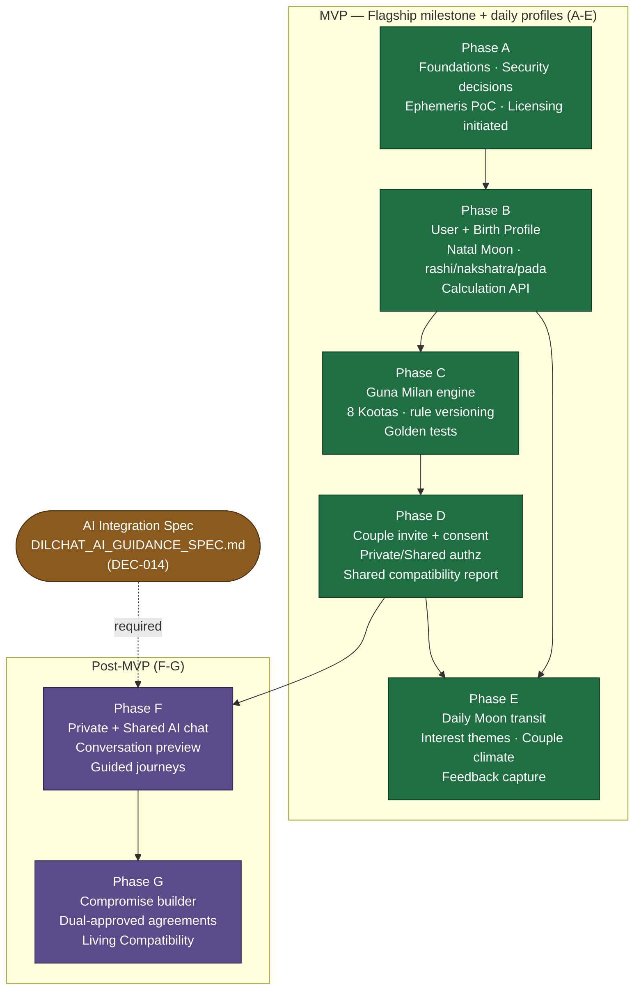

# DilChat Backend — Implementation Roadmap & Delivery Plan

**Product:** DilChat (consumer) · **Company:** Ugence Labs · **Site:** dilchat.com
**Document:** 10 of the DilChat design-document suite (the roadmap/operations doc).
**Status:** Design phase. **No production implementation begins until specs (documents 1–9) are approved.**
**Subordinate to:** [`DILCHAT_DECISION_LOG.md`](./DILCHAT_DECISION_LOG.md) — canonical. This roadmap sequences and gates the work; it never re-decides architecture, rule packs, or provenance. On any conflict, the Decision Log wins.

> **Flagship first milestone (verbatim, the north star of the MVP):**
> *"Two users independently create birth profiles, securely pair, and receive a reproducible shared Guna Milan scorecard plus individual daily Moon-interest profiles, with private and shared authorization boundaries enforced."*
> This milestone is satisfied by the completion of Phases **A → E**. Phases **F–G** are post-MVP.

---

## 0. How to read this document

- **Phases A–G** are fixed and named per the delivery brief. Each phase section carries the same nine subsections: *Entry criteria · Deliverables · Tests · Security checks · Exit criteria · Risks · Required approvals · Sprint estimate · Specialist review + Definition of Done*.
- A phase **must not** start production build until (a) its entry criteria are met and (b) the **GO gate** at its boundary is signed by the named approver (see §5).
- Everything is traced to a **DEC-###** decision, an **FR-####/NFR-##** requirement, or an **OQ-#** open question so a reviewer can route it.
- Estimates are in **2-week sprints** for a single feature squad (team in §12). They are planning ranges, not commitments; the critical path is called out in §11.

### Canon recap (binding — from the Decision Log)

| Area | Locked choice | Source |
|------|---------------|--------|
| Architecture | Modular monolith, 15 in-process modules, published ports only | DEC-002 |
| Framework / runtime | FastAPI + Pydantic v2, Python 3.12+ | DEC-003, DEC-010 |
| Datastore / cache / jobs | PostgreSQL 16 (+RLS), Redis 7, arq | DEC-004/005/006 |
| Ephemeris | `pyswisseph` (Swiss), Moshier fallback, single-threaded worker pool | DEC-007 |
| Ayanamsa / zodiac | Lahiri sidereal, versioned | DEC-008 |
| Guna Milan | `ashtakoota_lahiri_classical_v1` rule pack, `draft:true` until domain sign-off | DEC-009 |
| Authz | Policy-based row-level scope guard (default deny) + Postgres RLS backstop | DEC-012 |
| Sharing | Consent-gated projection → immutable `SharedArtifact`, never raw rows | DEC-013 |
| AI | `AIProvider` port; deterministic services compute all astrology; zero-retention terms | DEC-014, DEC-019 |
| Scopes | `PRIVATE_A`, `PRIVATE_B`, `SHARED` | §0 canon |
| Residency | India-first (`ap-south-1`/`asia-south1`), design for multi-region | DEC-018, OQ-13 |

**Module dependency order (lower may not import higher):**
`audit` ← `identity` ← `users` ← `birth_profiles` ← `astrology` ← {`guna_milan`, `moon_transits`} ← `couples` ← `consent` ← {`private_chat`, `shared_chat`, `journeys`, `agreements`} ← `ai_guidance` ← `feedback`.

---

## 1. Ordered phase plan & dependency graph

### 1.1 Phase overview

| Phase | Title | Primary modules | Depends on | MVP? | Rough estimate |
|-------|-------|-----------------|-----------|------|----------------|
| **A** | Foundations: audit, security decisions, ephemeris PoC, licensing initiated | (design + `astrology` PoC, `audit` skeleton) | — | MVP (enabler) | 2–3 sprints |
| **B** | User + birth profile + natal Moon calculation API | `identity`, `users`, `birth_profiles`, `astrology` | A | MVP | 3–4 sprints |
| **C** | Classical Guna Milan engine + golden tests | `guna_milan` | B | MVP | 2–3 sprints |
| **D** | Couple invitation, consent, scope boundaries, shared report | `couples`, `consent` | C | MVP | 3–4 sprints |
| **E** | Daily Moon transit, interest themes, couple climate, feedback capture | `moon_transits`, `feedback` (capture only) | B, D | MVP | 3–4 sprints |
| **F** | Private + shared AI chat, conversation preview, guided journeys | `private_chat`, `shared_chat`, `journeys`, `ai_guidance` | D, AI spec | **Post-MVP** | 4–5 sprints |
| **G** | Compromise builder, dual-approved agreements, Living Compatibility | `agreements`, `journeys` (compromise), `feedback` (Living Compat) | F | **Post-MVP** | 3–4 sprints |

**MVP cut line runs between E and F** (justified in §2). Phase A performs the repo/requirements audit and locks decisions; **no production feature code is written in A beyond a throwaway ephemeris proof-of-concept** and skeletons — the audit's exit is *approved specs*, which is the precondition for all other phases.

### 1.2 Dependency graph (Mermaid)



**Critical path:** `A → B → C → D → E` (the flagship milestone). Phase C is on the critical path *to the shared report* (D consumes the scorecard); Phase E can begin its transit/interest work as soon as B lands, but its *couple climate* and feedback surfaces block on D. See §11.

---

## 2. The MVP cut line

**Recommendation: MVP = Phases A–E. Post-MVP = Phases F–G.**

### 2.1 What is inside the line (A–E) and why

The flagship milestone names five capabilities: (1) independent birth-profile creation, (2) secure pairing, (3) a reproducible **shared Guna Milan scorecard**, (4) **individual daily Moon-interest profiles**, and (5) enforced private/shared authorization boundaries. These map exactly:

| Flagship capability | Delivered by | Key FRs |
|---------------------|--------------|---------|
| Independent birth profiles | B | FR-0301…0306 |
| Natal Moon rashi/nakshatra/pada, reproducible | B | FR-0401…0405 |
| Secure pairing | D | FR-0701…0704 |
| Shared Guna Milan scorecard (reproducible) | C (compute) + D (share) | FR-0501…0507, FR-0803 |
| Individual daily Moon-interest profiles | E | FR-0601…0605 |
| Private/shared authorization boundaries | D (+ consent) | FR-0801…0805, NFR-10/12 |
| Accounts, disclaimer gate, audit | A/B | FR-0101…0107, FR-0202, FR-1501/1504 |

A–E is the smallest slice that is **launchable and defensible**: it delivers a complete, reproducible, provenance-stamped astrology product with the couple-scope security invariants proven, and it does **not** ship the highest-risk surface (free-form AI). Everything in A–E is deterministic and testable against golden vectors; that makes the MVP auditable by the domain expert and the security reviewer before any user sees a report.

### 2.2 What is outside the line (F–G) and why deferred

- **AI chat (F)** is deferred because it carries the product's severe-tail risk (hallucination, intimate-partner-abuse misuse, crisis handling) and depends on the AI Integration Spec (DEC-014) plus a signed clinical/safety review and confirmed zero-retention vendor terms (FR-1304). None of that is required by the flagship milestone. Shipping A–E first lets the deterministic core earn trust while the AI safety program matures.
- **Living Compatibility / agreements (G)** depend on F and on additional consent surfaces (two-party approval, OQ-8; jointly-visible aggregate, OQ-9). They enrich retention but add no flagship value and expand the consent/authz attack surface. Defer until the A–E scope model is proven in production.

### 2.3 Cut-line consequence

The **daily Moon-interest profile (E)** is *inside* MVP but its **AI-authored narrative is not**; E ships deterministic interpretation text (`dilchat_interp_v1`) with the standing disclaimer. AI narration is layered in F. **Feedback capture** (thumbs, FR-1401) ships in E as passive capture; the Living Compatibility *aggregate* (FR-1402) is G.

---

## 3. Per-phase plans

Each phase repeats the required nine subsections. DoD (Definition of Done) closes each phase; the aggregate MVP acceptance checklist is §13.

---

### Phase A — Foundations, security decisions, ephemeris PoC, licensing

*Depends on: nothing. Modules touched: design of all; `astrology` PoC, `audit` skeleton only.*

**Entry criteria**
- Decision Log (doc 1) and PRD (doc 2) exist in draft.
- Monorepo placement `products/dilchat/` confirmed (DEC-001); Python 3.12+ toolchain available (DEC-010).

**Deliverables**
- **Repo & requirements audit** report: every FR-####/NFR-## traced to at least one phase; gaps and conflicts logged (esp. the root-`pyproject` `>=3.10` vs product `>=3.12` isolation, DEC-001).
- **Architecture & security decisions locked**: modular-monolith boundaries (DEC-002), `.importlinter` contract stub, scope model `PRIVATE_A/PRIVATE_B/SHARED` (DEC-012), consent-projection model (DEC-013), threat model v1 (STRIDE over the couple-scope boundary).
- **Swiss Ephemeris calculation proof-of-concept**: throwaway spike proving `pyswisseph` sidereal-Lahiri Moon longitude → rashi/nakshatra/pada, *and* the Moshier fallback path (`FLG_MOSELPH`), *and* the single-threaded worker-pool pattern (DEC-007). Not production code.
- **Reference-chart validation**: ≥ 20 known charts cross-checked against an external oracle (DEC-020) and against classical panchang values; boundary-case charts (nakshatra edges, pada edges) included.
- **Licensing decision (Astrodienst) initiated**: legal engagement opened for the Swiss Ephemeris AGPL-vs-commercial question (DEC-007, OQ-10); interim posture = AGPL build in isolated module + Moshier safety valve, documented.
- Provenance-tuple schema fixed (Decision Log §0) and enforced as a shared Pydantic model contract.
- CI skeleton: lint, type-check (mypy/pyright), import-linter, secret-scan, test runner.

**Tests**
- PoC parity: PoC output vs oracle within boundary tolerance for all reference charts.
- Fallback drift: Swiss vs Moshier Moon longitude delta measured and shown < nakshatra/pada boundary sensitivity.
- Import-linter contract fails a deliberately illegal cross-module import (negative test).

**Security checks**
- Threat model reviewed and signed by the security reviewer.
- Secret-scanning and dependency-audit (pip-audit) run clean on the skeleton.
- Confirm no ephemeris global-state mutation occurs off the worker pool in the PoC pattern.

**Exit criteria**
- Specs (docs 3–9) approved *or* have a dated approval plan; **audit report accepted by principal engineer + security reviewer**; PoC reproduces reference charts; licensing engagement is open with a named counsel and target date.

**Risks** — Swiss Ephemeris licensing ambiguity blocks nothing in dev but blocks launch (see §10 R-01); reference-chart disagreement reveals an ayanamsa/tolerance misunderstanding early (mitigated: it is *why* A exists).

**Required approvals** — Principal engineer (architecture); Security reviewer (threat model); Founder (scope confirmation of A–E as MVP); Legal (licensing engagement opened).

**Sprint estimate** — **2–3 sprints (4–6 weeks).**

**Specialist review** — Vedic-astrology domain expert (reference-chart selection + tolerance); Security reviewer (threat model, scope model); Privacy/legal counsel (Swiss Ephemeris licensing engagement). Clinical/safety advisor: *not yet* (no AI in A).

**Definition of Done (Phase A)** — Audit accepted; decisions locked and cross-linked to DECs; PoC + reference validation reproducible from a clean checkout; licensing legal thread open; **GATE-0 GO signed** (see §5). No production feature code merged.

**Cross-references** — DEC-001/002/007/012/013; PRD §9; `DILCHAT_BACKEND_ARCHITECTURE.md` §0–§4, §6, §11; `DILCHAT_ASTROLOGY_ENGINE_SPEC.md` (ephemeris math, tolerance); `DILCHAT_TEST_AND_VALIDATION_PLAN.md` (oracle validation, DEC-020).

---

### Phase B — User + birth profile + natal Moon calculation API

*Depends on: A. Modules: `identity`, `users`, `birth_profiles`, `astrology`.*

**Entry criteria** — GATE-0 GO signed; astrology-engine spec approved; PoC promoted into a productionizable design (worker-pool interface fixed).

**Deliverables**
- `identity`: Argon2id email+password (FR-0101), OIDC Google/Apple (FR-0102), ES256 10-min access tokens (FR-0104), rotating hashed refresh tokens + immediate revocation (FR-0105/0106), client-only biometric posture (FR-0107).
- `users`: profile CRUD (FR-0201), **standing-disclaimer acknowledgment gate** — unacknowledged users cannot view astrology outputs (FR-0202); locale `en-IN` default (FR-0201/0203).
- `birth_profiles`: capture date/time/place (FR-0301); **time-unknown/approximate** handling with confidence flag, no silent default time (FR-0302); authoritative GeoNames geocoding (FR-0303, DEC-017); historical local→UTC via `tzdata-2025b` with ambiguous/nonexistent-time flagging (FR-0304); **field-encryption of exact birth coordinates**, coarse-only thereafter (FR-0305, OQ-6); optional ascendant field captured, not interpreted (FR-0306, OQ-4).
- `astrology`: production sidereal-Lahiri natal **Moon rashi/nakshatra/pada** (FR-0401); provenance tuple on every artifact (FR-0402, NFR-20); **Moshier fallback with labeling + ops alert** (FR-0403); single-threaded calculation worker pool, async handlers never call `swe.*` (FR-0404); **byte-identical reproducibility** for a fixed version tuple (FR-0405).
- **Calculation API**: natal-chart endpoint (sync fast-path per architecture §5a) with idempotency, returning rashi/nakshatra/pada + provenance.
- `audit` (from A): disclaimer/ack log (FR-1504), profile-edit audit (FR-0201).

**Tests**
- Golden-chart suite: FR-0401 output matches reference vectors within boundary tolerance across the supported birth-year range; ayanamsa=Lahiri stamped.
- Reproducibility: same input + version tuple ⇒ byte-identical output (FR-0405, NFR-20).
- Fallback: with `.se1` files absent, output stamped `moshier`, confidence lowered, alert emitted, never unlabeled (FR-0403).
- Timezone edge cases: DST fall-back (ambiguous) and spring-forward (nonexistent) local times flagged, not guessed (FR-0304); pre-1970 historical offsets validated.
- Auth: token expiry ≤10 min (FR-0104); refresh rotation invalidates prior (FR-0105); revocation denies within one request cycle (FR-0106).
- Worker-pool concurrency: N concurrent natal requests produce no cross-request ayanamsa/path mutation (FR-0404); load test meets NFR-01 (p95 ≤ 1.5 s).

**Security checks**
- Birth coordinates unreadable without the field-encryption key (NFR-09); logs contain no exact coordinates or biometrics (FR-0107).
- Argon2id params meet OWASP; ES256 key rotation runbook exists (NFR-11).
- RLS enabled on `birth_profiles`/`users` tables as backstop (NFR-10); scope guard default-deny verified on unscoped access attempt.
- pip-audit / secret-scan clean.

**Exit criteria** — Natal calculation API live and reproducible; disclaimer gate enforced; encryption + tz + fallback behaviors verified by golden + edge tests; **GATE-1 GO signed**.

**Risks** — Numerical accuracy at nakshatra/pada boundaries (R-03); timezone/historical-data errors (R-09); single-threaded pool throughput ceiling (R-08). Mitigations in §10.

**Required approvals** — Principal engineer; Security reviewer (encryption + authz); Domain expert (rashi/nakshatra/pada correctness on golden set).

**Sprint estimate** — **3–4 sprints (6–8 weeks).**

**Specialist review** — Domain expert (natal correctness, boundary handling, ayanamsa); Security reviewer (auth, coordinate encryption, RLS). Privacy counsel: birthplace-PII minimization posture (OQ-6). Clinical: n/a.

**Definition of Done (Phase B)** — All P0 FRs above pass; golden + edge + reproducibility + fallback tests green in CI; NFR-01 met; provenance on every artifact; GATE-1 GO signed.

**Cross-references** — DEC-007/008/010/011/017; PRD §4.1–§4.4, §3.2–§3.3, NFR-01/09/11/20; `DILCHAT_ASTROLOGY_ENGINE_SPEC.md` (full engine); `DILCHAT_DATA_MODEL.md` (tables, scope columns, coordinate encryption); `DILCHAT_API_SPEC.md` + `openapi/dilchat.openapi.yaml` (natal endpoints); `DILCHAT_BACKEND_ARCHITECTURE.md` §5a; `DILCHAT_TEST_AND_VALIDATION_PLAN.md` (golden charts).

---

### Phase C — Classical Guna Milan engine + golden tests

*Depends on: B. Module: `guna_milan`.*

**Entry criteria** — GATE-1 GO; natal Moon rashi/nakshatra/pada available from `astrology`; the `ashtakoota_lahiri_classical_v1` rule pack drafted with `sources.json` citing a named classical authority (DEC-009, OQ-1).

**Deliverables**
- Classical **Ashtakoota engine**: all **eight Kootas** (Varna, Vashya, Tara, Yoni, Graha Maitri, Gana, Bhakoot, Nadi), summing to ≤ 36 (FR-0501).
- **Rule versioning**: pack stamped `rule_pack_id = ashtakoota_lahiri_classical_v1` on every scorecard (FR-0502); packs are content-addressed/immutable; `draft:true` packs **cannot render a user-facing report** (FR-0503, DEC-009).
- **Directional / role logic**: Tara, Bhakoot, Graha Maitri computed with defined bride/groom ordering, but product stores **neutral `seeker`/`partner` roles** mapped per the rule pack (FR-0504, DEC-009a, OQ-2).
- **Safety framing** baked into interpretation strings: Nadi never medical/genetic/fertility/pregnancy/health (FR-0505, DEC-021); Yoni only consensual-adult-romantic (FR-0506, DEC-021).
- **Score immutability**: computed score is fixed for a version tuple; recompute only on version change; no downstream layer can mutate it (FR-0507, DEC-019).
- Component-result structure: per-Koota max, awarded, and rationale reference (no free text yet).
- Private **preview scorecard** for the prospective single user, **no outbound contact/notification** (FR-0508, Persona C, OQ-3) — deterministic, ships here even though pairing is D.

**Tests**
- **Golden tests**: full 8-Koota scorecards for a curated matrix of chart pairs vs rule-pack tables and oracle; totals verified ≤ 36 (FR-0501).
- Determinism: identical natal pair + rule-pack version ⇒ identical scorecard (FR-0507).
- Draft-block: a `draft:true` pack cannot produce a user-facing scorecard (FR-0503) — negative test returns a blocked error.
- Directionality: swapping seeker/partner roles changes directional Kootas exactly as the rule pack prescribes and no others (FR-0504).
- Safety-string tests: Nadi/Yoni text scanned against a prohibited-lexicon list (FR-0505/0506).

**Security checks**
- Rule-pack payloads (jsonb) integrity-checked (checksum) on load; tampering rejected.
- No PII in the scorecard beyond what the report requires; provenance stamped.

**Exit criteria** — Deterministic 8-Koota scorecard reproducible and golden-verified; draft-gate enforced; safety framing verified; **the domain-review gate on the rule pack (GATE-2, DEC-009/OQ-1) is signed before any user-facing report** and the pack flipped `draft:false`; **GATE-2 GO signed**.

**Risks** — Rule-pack correctness / missing domain sign-off (R-02) — *the* gating risk for C; incorrect directional logic; safety-framing leakage into interpretation text. Mitigations §10.

**Required approvals** — **Vedic-astrology domain expert (mandatory sign-off on the rule pack and every Koota table + Tara/Bhakoot ordering)**; Founder (rule-pack source, DEC-009); Principal engineer; Security reviewer (integrity + safety strings).

**Sprint estimate** — **2–3 sprints (4–6 weeks).**

**Specialist review** — Domain expert (all eight Kootas, directionality, Nadi/Yoni framing) — blocking; Privacy/legal (Nadi/Yoni disclaimer wording, DEC-021) — blocking for user-facing text. Security: pack integrity. Clinical: n/a (no AI).

**Definition of Done (Phase C)** — 8-Koota engine golden-verified and deterministic; rule pack domain-signed and no longer draft; safety framing enforced by test; preview scorecard emits no notifications; GATE-2 GO signed.

**Cross-references** — DEC-009/009a/019/021; PRD §4.5, §3.5, §2.3 (Persona C); `DILCHAT_ASTROLOGY_ENGINE_SPEC.md` (Koota inputs); `rules/ashtakoota_lahiri_classical_v1/sources.json`; `DILCHAT_DATA_MODEL.md` (rule-pack + scorecard tables); `DILCHAT_TEST_AND_VALIDATION_PLAN.md` (golden Guna Milan matrix); `DILCHAT_API_SPEC.md` (scorecard DTO).

---

### Phase D — Couple invitation, consent, scope boundaries, shared report

*Depends on: C. Modules: `couples`, `consent`.*

**Entry criteria** — GATE-2 GO; deterministic scorecard available; **the security-review gate on the scope/consent boundary (GATE-Dsec) is scheduled before D ships**.

**Deliverables**
- `couples`: **single-use expiring invite** (FR-0701); couple reaches `active` only after both authenticated members join (FR-0702); **immediate unpair/revocation** flipping membership to `revoked`, shared access denied within one request cycle (FR-0703); **neutral role assignment**, no gender required (FR-0704).
- `consent`: **scope model presented before first shared computation** (FR-0801); **`ConsentEvent` as a first-class record** capturing what/who/when/revocation policy (FR-0802, DEC-013); **consent-gated projection only** — no raw private row becomes shared, only bounded enumerated `SharedArtifact`s (FR-0803, DEC-013); **revocation honored immediately** per policy (FR-0804); **partner never told a private conversation exists** (FR-0805, DEC-013).
- **Private/shared authorization boundaries** hardened: mandatory `ScopeContext` threaded through repository helpers (default deny), couple membership re-verified on every shared request, Postgres RLS backstop (`SET app.user_id`) on all scope-bearing tables (DEC-012, NFR-10/12).
- **Shared compatibility report**: the Guna Milan scorecard from C projected into a `SHARED` `SharedArtifact` via an explicit ConsentEvent — reproducible, provenance-stamped, immutable.
- `audit`: immutable pairing + consent event log (FR-1501).

**Tests**
- Pairing lifecycle: invite single-use + TTL expiry (FR-0701); `active` requires both members (FR-0702); unpair denies shared access within one request cycle (FR-0703).
- **Adversarial scope tests** (the crown-jewel suite): user A cannot read `PRIVATE_B`; a revoked member cannot read `SHARED`; unscoped queries denied; **app-layer bypass still denied by RLS** (NFR-10/12, zero cross-scope leakage).
- Consent projection: only enumerated fields appear in a `SharedArtifact`; raw private rows never projected (FR-0803); revoked ConsentEvent removes visibility immediately (FR-0804).
- Existence-hiding: no API/UX surface reveals a partner's private conversation (FR-0805) — probed by enumeration/timing tests.
- Reproducibility of the shared report against the version tuple.

**Security checks** — **This is the phase where the scope/consent boundary is proven.**
- Full adversarial authz test matrix green (default-deny + RLS backstop, NFR-10/12).
- Penetration-style review of invite tokens (single-use, unguessable, TTL), IDOR probes on couple/artifact IDs.
- Consent-event immutability and audit completeness verified (FR-1501).
- Data-minimization: coarse-only location surfaced (OQ-6, NFR-13).

**Exit criteria** — Two independent users can pair and both retrieve a reproducible shared Guna Milan scorecard; **zero cross-scope leakage** under the adversarial suite; unpair revokes immediately; **GATE-Dsec (security review of scope/consent) signed before ship**; **GATE-3 GO signed**. *This completes the security-boundary half of the flagship milestone.*

**Risks** — Scope-isolation bugs (R-07) — highest-severity security risk; privacy/consent leakage (R-04); existence-disclosure side channels. Mitigations §10.

**Required approvals** — **Security reviewer (blocking sign-off on scope/consent boundary, GATE-Dsec)**; Privacy/legal (consent UX + DPDP posture); Principal engineer; Founder (consent-approval model, OQ-8 for later, confirmed here for shared summaries).

**Sprint estimate** — **3–4 sprints (6–8 weeks).**

**Specialist review** — Security reviewer (scope/consent/authz) — blocking; Privacy/legal counsel (ConsentEvent model, DPDP, existence-hiding); Domain expert (shared report presentation fidelity). Clinical: n/a.

**Definition of Done (Phase D)** — Pairing + consent + shared report live; adversarial scope suite green with RLS backstop proven; unpair immediate; ConsentEvent/audit immutable; existence-hiding verified; GATE-Dsec + GATE-3 signed.

**Cross-references** — DEC-012/013; PRD §4.7–§4.8, §3.4, §2.4 (Persona D at-risk); NFR-10/12/13; `DILCHAT_PRIVACY_CONSENT_AND_SECURITY.md` (full ConsentEvent→SharedArtifact state machine, scope guard) — **primary spec**; `DILCHAT_DATA_MODEL.md` (scope columns, RLS policies); `DILCHAT_BACKEND_ARCHITECTURE.md` §5b/§5c/§5f, §6 (trust boundaries); `DILCHAT_TEST_AND_VALIDATION_PLAN.md` (adversarial scope tests); `DILCHAT_API_SPEC.md` (invite/consent/report endpoints).

---

### Phase E — Daily Moon transit, interest themes, couple climate, feedback capture

*Depends on: B and D. Modules: `moon_transits`, `feedback` (capture only).*

**Entry criteria** — GATE-1 GO (natal Moon) and GATE-3 GO (couple scope) — E needs both a user's natal Moon (B) and the couple boundary for couple climate (D).

**Deliverables**
- **Nightly global transit precompute** via arq cron, populating the global transit cache before the earliest local-midnight rollover (FR-0601, DEC-006, NFR-07).
- **Per-user daily climate**: transiting Moon vs that user's natal Moon → labeled interpretation (`transit_model_version = dilchat_transit_v1`), **not a prediction** (FR-0602, DEC-019, `[DilChat proprietary interpretation]`).
- **Interest-theme scoring**: `dilchat_interest_v1` themed scores, stamped with model version (FR-0603).
- **Couple climate**: a jointly-visible shared daily climate derived from both partners' transits, scope `SHARED`, projected via consent (uses D's boundary).
- **Local-midnight day boundary** + surfaced next rashi/nakshatra transition times within the day (FR-0604, OQ-7).
- Provenance + standing disclaimer on every daily profile (FR-0605).
- **Feedback capture** (passive): thumbs-up/down capture scaffolding on daily items (FR-1401) — *aggregate Living Compatibility is deferred to G*.
- Cheap-to-compute **tithi/phase stored now, surfaced later** (OQ-5) — compute + persist only.

**Tests**
- Transit derivation correctness against golden transit vectors; deterministic for a version tuple (NFR-20).
- Day-boundary: profile keyed to local midnight; transition times correct across tz edge cases (FR-0604).
- Cache read latency p95 ≤ 300 ms (NFR-02); precompute completes within SLA before earliest rollover (NFR-07).
- Couple climate respects scope: only paired, consented members see it; revoked members do not (reuses D suite).
- Labeling: every daily artifact carries `dilchat_transit_v1`/`dilchat_interest_v1` and the disclaimer (FR-0602/0605).

**Security checks**
- Couple-climate artifacts obey the scope guard + RLS (no leakage to non-members).
- Coarse-only current location used for daily presentation (OQ-6, NFR-13).
- Feedback rows scoped to author; no cross-scope read.

**Exit criteria** — Both paired users receive reproducible individual daily Moon-interest profiles and a shared couple climate; precompute + cache SLAs met; feedback capture live; **GATE-4 GO signed**. *This completes the flagship milestone and the MVP feature set.*

**Risks** — Single-threaded ephemeris pool throughput under nightly precompute fan-out (R-08); timezone/day-boundary errors (R-09); interpretation over-claiming (mitigated by labeling + disclaimer + DEC-019). Mitigations §10.

**Required approvals** — Domain expert (transit interpretation framing, Tara/Chandra Bala if used); Principal engineer; Security reviewer (couple-climate scope); Privacy/legal (daily disclaimer wording, DEC-021).

**Sprint estimate** — **3–4 sprints (6–8 weeks).**

**Specialist review** — Domain expert (transit/interest interpretation, Tara/Chandra Bala, day boundary OQ-7); Privacy/legal (disclaimer, coarse-location); Security (scope). Clinical: n/a (no AI narration in E).

**Definition of Done (Phase E)** — Daily individual + couple profiles reproducible and labeled; precompute/cache SLAs (NFR-02/07) met; feedback capture live; tithi stored; GATE-4 GO signed; **MVP acceptance checklist (§13) passes.**

**Cross-references** — DEC-006/019/021; PRD §4.6, §4.14 (capture), §3.6, NFR-02/07; `DILCHAT_ASTROLOGY_ENGINE_SPEC.md` (transit features, tithi); `DILCHAT_BACKEND_ARCHITECTURE.md` §5d (nightly precompute), §9 (arq); `DILCHAT_PRIVACY_CONSENT_AND_SECURITY.md` (couple-climate projection); `DILCHAT_TEST_AND_VALIDATION_PLAN.md` (transit goldens); `DILCHAT_API_SPEC.md` (daily-profile endpoints).

---

### Phase F — Private AI chat, shared AI chat, conversation preview, guided journeys  *(POST-MVP)*

*Depends on: D and the AI Integration Spec (`DILCHAT_AI_GUIDANCE_SPEC.md`, DEC-014). Modules: `private_chat`, `shared_chat`, `journeys`, `ai_guidance`.*

**Entry criteria** — MVP (A–E) shipped and stable; **AI Integration Spec approved**; confirmed **zero-retention/no-train** provider terms recorded (FR-1304, DEC-014); **clinical/safety advisor engaged** for crisis + abuse handling; **GATE-4 GO** signed.

**Deliverables**
- `ai_guidance`: `AIProvider` **port** (Claude default, OpenAI alternate) — swapping adapters requires no caller change (FR-1301, DEC-014); **schema-validated structured outputs**, invalid rejected (FR-1302); `prompt_pack_version = dilchat_prompts_v1` provenance (FR-1303); **AI never alters classical scores** — explain-only (FR-1305, DEC-019); AI receives **only minimum authorized context** and never computes astronomy/Koota/transit (FR-0902, DEC-014).
- `private_chat`: per-user reflection space scoped `PRIVATE_A/PRIVATE_B`; partner reads never return them (FR-0901); **safety guardrails** — AI refuses to infer infidelity, sexual consent, psychiatric diagnosis, or pressure a user to stay (FR-0903, DEC-021).
- `shared_chat`: jointly-visible couple chat, scope `SHARED` (FR-1001); **AI never impersonates a partner**, turns system-attributed (FR-1002, NG-7).
- **Conversation preview** projection (a bounded consented summary, never the raw stream, DEC-013).
- `journeys`: structured guided journey with ordered steps, per-couple state (FR-1101); private-first reflection option (FR-1102); compromise framing referencing scorecard/daily differences (FR-1103).

**Tests**
- Adapter swap (Claude↔OpenAI) requires no caller change (FR-1301).
- Schema validation rejects malformed AI output (FR-1302).
- Guardrail red-team suite: prohibited inferences refused (FR-0903); AI cannot alter a Koota (FR-1305); AI never authored as a partner (FR-1002).
- Context-minimization audit: provider payloads contain only authorized minimum; no astronomy delegated (FR-0902).
- Scope: private chat never leaks to partner; conversation preview only exposes consented projection.
- **Crisis/abuse handling**: simulated crisis + intimate-partner-abuse prompts route to the clinical-safety playbook (crisis resources, no pressure-to-stay).

**Security checks** — Provider payload minimization + zero-retention terms enforced (NFR-14); prompt-injection resistance; no cross-scope context bleed into AI; AI outputs audited with provenance.

**Exit criteria** — AI chat + journeys live with guardrails and clinical playbook; red-team + safety suites green; provider terms recorded; **GATE-Fsafety (clinical/safety sign-off) signed**; **GATE-5 GO signed**.

**Risks** — AI hallucination/safety (R-05); intimate-partner-abuse misuse (R-06); vendor lock-in/outage (R-10); scope bleed into prompts (R-07 extension). Mitigations §10.

**Required approvals** — **Clinical/safety advisor (blocking, crisis + abuse handling)**; Privacy/legal (AI retention, DEC-014; disclaimers, DEC-021); Founder (final vendor, FR-1304/NFR-14); Security reviewer (context minimization, injection); Domain expert (interpretation fidelity).

**Sprint estimate** — **4–5 sprints (8–10 weeks).**

**Specialist review** — Clinical/safety advisor (blocking); Privacy/legal (retention, disclaimers); Domain expert (AI interpretation stays within labeled models, never rewrites classical); Security (injection, minimization).

**Definition of Done (Phase F)** — Port + guardrails + clinical playbook live; red-team green; provider zero-retention recorded; existence-hiding + scope preserved; GATE-Fsafety + GATE-5 signed.

**Cross-references** — DEC-013/014/019/021; PRD §4.9–§4.11, §4.13, §3.7–§3.9, NG-7, NFR-14; `DILCHAT_AI_GUIDANCE_SPEC.md` (port, prompt packs, guardrails) — **primary spec**; `DILCHAT_PRIVACY_CONSENT_AND_SECURITY.md` (conversation-preview projection, existence-hiding); `DILCHAT_BACKEND_ARCHITECTURE.md` §5e; `DILCHAT_TEST_AND_VALIDATION_PLAN.md` (AI red-team + guardrail suites).

---

### Phase G — Compromise builder, dual-approved agreements, Living Compatibility  *(POST-MVP)*

*Depends on: F. Modules: `agreements`, `journeys` (compromise), `feedback` (Living Compat).*

**Entry criteria** — GATE-5 GO; F guardrails proven in production; two-party consent model (OQ-8) and jointly-visible-aggregate model (OQ-9) finalized.

**Deliverables**
- `agreements`: draft agreement statement visible only per consent (FR-1201); **two-party approval for important agreements** — `active` only after both approve (FR-1202, OQ-8); **immutable approval record** (authorship, approvals, timestamps, revocation) in `audit` (FR-1203); neutral one-party shared summaries, no approval (FR-1204, OQ-8).
- **Compromise builder**: guided flow producing a candidate compromise referencing scorecard/daily differences, feeding a draft agreement.
- **Living Compatibility**: `dilchat_living_v1` **jointly-visible aggregate**; each partner's private inputs/ratings stay private (FR-1402, OQ-9); **never feeds back into the classical score or astrology history** (FR-1403, DEC-019).
- Feedback → aggregate pipeline (from E's capture).

**Tests**
- Dual-approval: agreement `active` only after both approve; single approval insufficient (FR-1202).
- Immutability: approval record append-only, tamper-evident (FR-1203).
- Living Compat isolation: private inputs never exposed; only aggregate visible (FR-1402, OQ-9); aggregate never mutates Guna Milan/astrology (FR-1403) — invariant test.
- Compromise builder respects scope + consent projection.

**Security checks** — Two-party approval cannot be forged by one party; aggregate exposes no individual input; behavioral data never rewrites classical score (DEC-019); audit completeness.

**Exit criteria** — Compromise → dual-approved agreements + Living Compatibility live; isolation + immutability invariants proven; **GATE-6 GO signed**.

**Risks** — Behavioral data leaking individual inputs (R-04 extension); score contamination (mitigated by DEC-019 invariant test, R-02 adjacency); consent-approval forgery (R-07 adjacency). Mitigations §10.

**Required approvals** — Security reviewer (dual-approval + aggregate isolation); Privacy/legal (behavioral-data consent, DPDP); Founder (OQ-8/OQ-9 confirmation); Domain expert (Living Compat never claims classical authority); Clinical/safety (compromise flow not coercive).

**Sprint estimate** — **3–4 sprints (6–8 weeks).**

**Specialist review** — Security (dual-approval, isolation); Privacy/legal (behavioral consent); Clinical/safety (non-coercion); Domain expert (score-family separation, DEC-019).

**Definition of Done (Phase G)** — Agreements + Living Compat live; dual-approval + immutability + isolation + no-score-contamination invariants green; GATE-6 GO signed.

**Cross-references** — DEC-013/019; PRD §4.12, §4.14, §3.10–§3.11, OQ-8/OQ-9; `DILCHAT_PRIVACY_CONSENT_AND_SECURITY.md` (agreement approval + aggregate projection); `DILCHAT_DATA_MODEL.md` (agreement/feedback tables); `DILCHAT_TEST_AND_VALIDATION_PLAN.md` (isolation + score-separation invariants); `DILCHAT_AI_GUIDANCE_SPEC.md` (compromise framing).

---

## 4. Cross-cutting hardening (folded into every phase; final pass at launch)

Per the PRD, "Phase G hardening" concerns (Hindi localization, observability, exit/export/delete) are treated as **cross-cutting** and delivered incrementally, with a dedicated launch-hardening pass **before the MVP go-live** (after Phase E) and again before F/G:

- **Observability (NFR-17):** structured logs, tracing, latency/error/queue-depth metrics, **Moshier-fallback alarms** (FR-0403) — live before MVP launch.
- **Exit flows:** data export (FR-1502), deletion finalization with at-risk no-trace guarantee (FR-1503) — required before launch (DPDP/GDPR).
- **Localization (NFR-16):** `en-IN` at launch; `hi-IN` string infrastructure ready, content phased.
- **Recoverability (NFR-21):** Postgres PITR, RPO ≤ 15 min / RTO ≤ 4 h restore drill before launch.

---

## 5. GO / NO-GO gates

A gate is a hard stop: the next phase (or launch) does not proceed until the approver signs. Security- and legal-critical gates are **blocking regardless of schedule**.

| Gate | Boundary | Criteria (NO-GO if any unmet) | Approver(s) | Ties to |
|------|----------|-------------------------------|-------------|---------|
| **GATE-0** | A → B | Audit accepted; decisions locked; ephemeris PoC reproduces reference charts; licensing engagement opened | Principal engineer + Security reviewer + Legal | DEC-002/007 |
| **GATE-1** | B → C | Natal Moon golden-verified + reproducible; encryption/tz/fallback verified; auth invariants pass; NFR-01 met | Principal engineer + Domain expert + Security reviewer | FR-0301…0405 |
| **GATE-2 (DOMAIN)** | Before **any user-facing report** (C ships) | **Rule pack `ashtakoota_lahiri_classical_v1` domain-signed and flipped `draft:false`**; 8-Koota goldens pass; Nadi/Yoni safety framing verified | **Vedic-astrology domain expert (blocking)** + Founder | DEC-009 / OQ-1, DEC-021 |
| **GATE-Dsec (SECURITY)** | Before **Phase D ships** | **Scope/consent boundary security review passed**: adversarial scope suite green, RLS backstop proven, existence-hiding verified, invite-token review clean | **Security reviewer (blocking)** | DEC-012/013, NFR-10/12 |
| **GATE-3** | D → E | Two users pair + retrieve reproducible shared scorecard; unpair revokes immediately; zero cross-scope leakage | Principal engineer + Security reviewer + Privacy/legal | FR-0701…0805 |
| **GATE-4** | E → **MVP launch** | Flagship milestone met end-to-end; daily profiles reproducible; SLAs (NFR-02/07) met; §13 checklist passes | Principal engineer + Founder | Flagship milestone |
| **GATE-LICENSE (LEGAL)** | Before **public launch** | **Astrodienst Swiss Ephemeris commercial license obtained** (or a signed AGPL-compliant posture accepted by counsel); Moshier fallback retained | **Privacy/legal counsel (blocking)** + Founder | DEC-007 / OQ-10 |
| **GATE-PRIVACY (LEGAL)** | Before **public launch** | **DPDP (and GDPR if international) sign-off**: consent flows, export/delete (FR-1502/1503), coarse-location minimization (OQ-6), disclaimers (DEC-021), India residency (OQ-13/DEC-018), AI-retention terms if F live | **Privacy/legal counsel (blocking)** + Founder | DPDP/GDPR, DEC-018/021 |
| **GATE-Fsafety (CLINICAL)** | Before **Phase F ships** | **Clinical/safety advisor sign-off** on crisis + intimate-partner-abuse handling; AI guardrail red-team green; zero-retention vendor terms recorded | **Clinical/safety advisor (blocking)** + Privacy/legal + Founder | DEC-014/021, FR-0903 |
| **GATE-5** | F → G | AI chat guardrails proven; context minimization audited; no cross-scope prompt bleed | Security reviewer + Domain expert + Founder | FR-1301…1305 |
| **GATE-6** | G → post-MVP GA | Dual-approval + Living-Compat isolation + no-score-contamination invariants green | Security reviewer + Privacy/legal + Founder | DEC-019, OQ-8/9 |

**The four brief-mandated gates are:** GATE-LICENSE (Swiss Ephemeris licensing before public launch, DEC-007/OQ-10); GATE-2 (domain review of the Guna Milan rule pack before any user-facing report, DEC-009/OQ-1); GATE-Dsec (security review of the scope/consent boundary before Phase D ships); GATE-PRIVACY (DPDP/GDPR legal/privacy before launch).

---

## 6. Specialist review matrix (per phase)

Four standing specialists review across the plan; a ✔ means their sign-off is required for that phase, **(B)** means blocking.

| Phase | Vedic-astrology domain expert | Security reviewer (scope/consent/authz) | Privacy/legal counsel (DPDP/GDPR, AI retention, SwissEph license, disclaimers) | Clinical/safety advisor (crisis + abuse in AI) |
|-------|:---:|:---:|:---:|:---:|
| A | ✔ (reference charts, tolerance) | ✔ (threat model, scope model) | ✔ (licensing engagement opened) | — |
| B | ✔ (rashi/nakshatra/pada) | ✔ (auth, coord encryption, RLS) | ✔ (birthplace PII minimization) | — |
| C | **✔ (B)** (rule pack, Tara/Bhakoot, Nadi/Yoni framing) | ✔ (pack integrity, safety strings) | **✔ (B)** (Nadi/Yoni disclaimer wording) | — |
| D | ✔ (shared-report fidelity) | **✔ (B)** (scope/consent boundary) | ✔ (ConsentEvent, DPDP, existence-hiding) | — |
| E | ✔ (transit/interest, Tara/Chandra Bala, OQ-7) | ✔ (couple-climate scope) | ✔ (daily disclaimer, coarse location) | — |
| F | ✔ (AI stays within labeled models) | ✔ (injection, context minimization) | **✔ (B)** (AI retention, disclaimers) | **✔ (B)** (crisis + abuse handling) |
| G | ✔ (score-family separation, DEC-019) | ✔ (dual-approval, aggregate isolation) | ✔ (behavioral-data consent) | ✔ (non-coercive compromise) |
| **Launch** | ✔ | ✔ | **✔ (B)** (GATE-LICENSE + GATE-PRIVACY) | ✔ (if F live) |

**Standing responsibilities:**
- **Vedic-astrology domain expert** — owns the rule pack, Tara/Chandra Bala usage, all interpretations; blocking on GATE-2.
- **Security reviewer** — owns scope/consent/authz; blocking on GATE-Dsec.
- **Privacy/legal counsel** — owns DPDP/GDPR, AI retention terms, Swiss Ephemeris license, disclaimer wording; blocking on GATE-LICENSE, GATE-PRIVACY, and the legal halves of GATE-2/GATE-Fsafety.
- **Clinical/safety advisor** — owns crisis and intimate-partner-abuse handling in AI; blocking on GATE-Fsafety.

---

## 7. Risk register

Likelihood/Impact: **L / M / H**. Owners are roles, not names.

| # | Risk | Likelihood | Impact | Mitigation | Owner |
|---|------|:---:|:---:|------------|-------|
| **R-01** | **Swiss Ephemeris license (AGPL copyleft vs commercial) blocks hosted launch** | M | H | Open Astrodienst engagement in Phase A (DEC-007/OQ-10); keep ephemeris in an isolated module; retain Moshier (public-domain lineage) as a licensing safety valve; **GATE-LICENSE blocks public launch until resolved** | Privacy/legal + Founder |
| **R-02** | **Rule-pack incorrectness / no domain sign-off** ships a wrong Guna Milan report | M | H | Cite a named classical authority in `sources.json` (OQ-1); `draft:true` blocks user-facing reports (FR-0503); **GATE-2 domain sign-off is blocking**; golden matrix vs oracle | Domain expert |
| **R-03** | **Astrology numerical accuracy** at nakshatra/pada boundaries | M | H | Reference-chart validation in A; boundary-case goldens; measured Swiss-vs-Moshier drift < boundary sensitivity; ayanamsa stamped and versioned | Astrology engineer + Domain expert |
| **R-04** | **Privacy / consent leakage** (private content exposed to partner) | M | H | Consent-gated projection only, never raw rows (DEC-013); existence-hiding (FR-0805); adversarial scope suite; DPDP/GDPR review; **GATE-Dsec + GATE-PRIVACY** | Security + Privacy/legal |
| **R-05** | **AI hallucination / unsafe output** | M | H | Deterministic services compute all astrology (DEC-014); schema-validated outputs (FR-1302); explain-only, cannot alter scores (FR-1305); guardrail red-team; **GATE-Fsafety** | Clinical/safety + AI engineer |
| **R-06** | **Intimate-partner-abuse misuse** of the platform | M | H | Never reveal a private conversation exists (FR-0805); AI never pressures a user to stay / infers infidelity (FR-0903, DEC-021); at-risk exit leaves no new partner-visible trace (FR-1503); clinical playbook + crisis resources | Clinical/safety + Product |
| **R-07** | **Scope-isolation bug** (cross-scope read) | M | H | Default-deny scope guard + RLS backstop (DEC-012, NFR-10/12); membership re-verified per request; adversarial + IDOR + timing tests; **GATE-Dsec blocking** | Security reviewer |
| **R-08** | **Single-threaded ephemeris pool throughput** ceiling (esp. nightly precompute fan-out) | M | M | Dedicated process pool sized to cores; nightly global-transit **precompute + cache** (Redis) so reads don't hit `swe.*`; queue-depth alarms; load test to NFR-01/07; horizontal worker scaling | Astrology/platform engineer |
| **R-09** | **Timezone / historical-data errors** (offset, DST, pre-1970) | M | H | `tzdata-2025b` pinned; ambiguous/nonexistent times flagged not guessed (FR-0304); historical-offset goldens; birth-time confidence lowered rather than defaulted | Astrology engineer |
| **R-10** | **AI vendor lock-in / outage** | M | M | `AIProvider` port with Claude default + OpenAI alternate (DEC-014); timeout fallback (architecture §5e); AI is post-MVP so no launch dependency | AI engineer |
| **R-11** | **India data-residency non-compliance (DPDP)** | L | H | India-region hosting `ap-south-1`/`asia-south1` (DEC-018/OQ-13); data model designed for multi-region; **GATE-PRIVACY** blocks launch | Privacy/legal + Platform |
| **R-12** | Provenance/version drift makes an artifact non-reproducible | L | H | Full provenance tuple on every artifact (NFR-20); recompute determinism tests; content-addressed rule packs | Principal engineer |
| **R-13** | Schedule slip on critical path A→B→C→D→E | M | M | Buffer sprints per phase; parallelize E-transit work behind B; gate discipline over scope creep; F/G explicitly out of MVP | Eng manager |

---

## 8. Sprint breakdown & timeline

**Assumptions:** one feature squad (see §12), 2-week sprints, estimates include test authoring and specialist review cycles but not open-ended legal turnaround (tracked as parallel gates).

### 8.1 Timeline table

| Phase | Sprints | Nominal weeks | Cumulative (weeks) | Gate at exit |
|-------|:---:|:---:|:---:|--------------|
| A | 2–3 | 4–6 | 4–6 | GATE-0 |
| B | 3–4 | 6–8 | 10–14 | GATE-1 |
| C | 2–3 | 4–6 | 14–20 | GATE-2 (domain, blocking) |
| D | 3–4 | 6–8 | 20–28 | GATE-Dsec + GATE-3 |
| E | 3–4 | 6–8 | 26–36 | GATE-4 |
| **Launch hardening** (cross-cutting §4) | 1–2 | 2–4 | 28–40 | GATE-LICENSE + GATE-PRIVACY |
| **→ MVP launch (A–E)** | — | — | **~28–40 weeks (≈7–10 months)** | — |
| F | 4–5 | 8–10 | 36–50 | GATE-Fsafety + GATE-5 |
| G | 3–4 | 6–8 | 42–58 | GATE-6 |

MVP (A–E + hardening) lands in roughly **14–20 two-week sprints (~7–10 months)** for a single squad; parallelization (§12) can compress this toward the low end.

### 8.2 Critical path

```
A(2-3) → B(3-4) → C(2-3) → D(3-4) → E(3-4) → launch-hardening(1-2)
```

- **On the critical path:** A, B, C, D, E in series — each is a hard predecessor of the next for the flagship milestone.
- **Parallelizable (off critical path):** Phase E's *individual* transit + interest engine can start once **B** lands, running alongside **C/D**; only E's *couple climate* and feedback surfaces must wait for **D**. The legal threads (GATE-LICENSE, GATE-PRIVACY) run in parallel from Phase A and must **close before launch**, not before each phase — but starting them late is the most common way to slip launch, so they open in A.
- **Longest pole:** typically **B** (auth + engine + encryption + tz) and **D** (scope/consent boundary + adversarial hardening).

### 8.3 Parallelization opportunities

| Can run in parallel | With | Constraint |
|---------------------|------|-----------|
| Identity/users (B) | Astrology engine productionization (B) | Both gate on GATE-0; independent modules |
| Individual transit engine (E) | C and D | Needs B's natal Moon; couple climate waits for D |
| Legal: Swiss Ephemeris license + DPDP | All phases | Must close before launch (GATE-LICENSE/PRIVACY) |
| Domain review of rule pack | B build | Must close before C ships (GATE-2) |
| Observability/exit hardening (§4) | D/E | Must be live before launch |

---

## 9. Team & skills

| Role | Responsibility | Phases most engaged |
|------|----------------|--------------------|
| **Principal / tech lead** | Architecture, module boundaries, gate ownership, reproducibility invariants | A–G |
| **Backend engineers (2–3)** | FastAPI modules, Postgres/SQLAlchemy/Alembic, Redis, arq | A–G |
| **Astrology/ephemeris engineer** | `pyswisseph`, worker pool, ayanamsa, tz, transit features, goldens | A, B, C, E |
| **Security engineer / reviewer** | Scope guard, RLS, consent, authz tests, threat model | A–G (blocking D, F) |
| **Data/platform / SRE** | Deploy (India region), observability, PITR, precompute SLAs, cost | A, D, E, launch |
| **AI engineer** | `AIProvider` port, prompt packs, guardrails, red-team | F, G |
| **Mobile (React Native) + Web (Next.js)** | Clients (out of backend scope but coordinated) | B onward |
| **Product / founder** | Scope, founder-approval decisions (DEC-009, OQ-3/8/9/13), KPIs | A–G (gates) |
| **Vedic-astrology domain expert** *(specialist)* | Rule pack, Tara/Chandra Bala, interpretations | C (blocking), A/B/E/G |
| **Privacy/legal counsel** *(specialist)* | DPDP/GDPR, Swiss Ephemeris license, AI retention, disclaimers | A, launch (blocking) |
| **Clinical/safety advisor** *(specialist)* | Crisis + intimate-partner-abuse handling in AI | F (blocking), G |

**Cross-references to the DilChat design-document suite** (this is doc 10 of 10; each phase above cites the relevant sections):

| # | Document | Roadmap phases that cite it |
|---|----------|------------------------------|
| 1 | `DILCHAT_DECISION_LOG.md` (canonical) | All (every DEC/OQ) |
| 2 | `DILCHAT_BACKEND_PRODUCT_REQUIREMENTS.md` | All (FR/NFR/personas/journeys) |
| 3 | `DILCHAT_BACKEND_ARCHITECTURE.md` | A (§0–§6,§11), B (§5a), D (§5b/c/f,§6), E (§5d,§9), F (§5e) |
| 4 | `DILCHAT_API_SPEC.md` + `openapi/dilchat.openapi.yaml` | B, C, D, E, F (endpoint contracts) |
| 5 | `DILCHAT_DATA_MODEL.md` | B (coord encryption), C (rule-pack tables), D (scope/RLS), G (agreements) |
| 6 | `DILCHAT_ASTROLOGY_ENGINE_SPEC.md` | A (PoC/tolerance), B (engine), C (Koota inputs), E (transit/tithi) |
| 7 | `DILCHAT_PRIVACY_CONSENT_AND_SECURITY.md` | D (primary: consent state machine), E (couple climate), F (preview/existence-hiding), G (agreements) |
| 8 | `DILCHAT_AI_GUIDANCE_SPEC.md` | F (primary: port/guardrails), G (compromise framing) |
| 9 | `DILCHAT_TEST_AND_VALIDATION_PLAN.md` | A–G (goldens, adversarial scope, oracle, red-team) |

---

## 10. Post-MVP backlog (F–G and beyond)

Ordered by recommended sequence after MVP launch:

| Item | Description | Source | Depends on |
|------|-------------|--------|-----------|
| **Private + shared AI chat** | Reflection space, couple chat, guardrails, clinical playbook | Phase F, FR-0901…1002 | AI spec, GATE-Fsafety |
| **Conversation preview** | Consented bounded summary projection | Phase F, DEC-013 | F |
| **Guided journeys** | Structured themed journeys, private-first reflection | Phase F, FR-1101…1103 | F |
| **Compromise builder** | Candidate compromises → draft agreements | Phase G, FR-1103 | F |
| **Dual-approved agreements** | Two-party approval, immutable record | Phase G, FR-1201…1203, OQ-8 | F |
| **Living Compatibility** | `dilchat_living_v1` jointly-visible aggregate, private inputs stay private | Phase G, FR-1402, OQ-9 | F |
| **Ascendant-based daily interpretation** | Interpret the ascendant field captured in B | **OQ-4** | B (field), E (daily) |
| **Tithi scoring** | Surface + score tithi/phase stored in E | **OQ-5** | E (tithi stored) |
| **Alternate ayanamsas** | Raman, KP as rule-pack variants, never silently mixed | DEC-008 | C (pack framework) |
| **International launch** | GDPR/CCPA, possible regional partitioning, multi-region | **OQ-13**, DEC-018 | GATE-PRIVACY (intl) |
| **Richer journeys** | Deeper multi-step guided programs, more themes | Phase F/G extension | F |
| **Neutral one-party shared summaries** | Author + partner visibility, no approval | FR-1204, OQ-8 | G |
| **Phone/OTP + Hindi content** | FR-0103 P1; `hi-IN` content beyond string infra | NFR-16 | B, launch |

---

## 11. Definition of Done — per phase (summary) & overall MVP acceptance

### 11.1 Per-phase DoD (recap)

| Phase | Done when… | Gate |
|-------|-----------|------|
| A | Audit accepted; decisions locked; PoC reproduces reference charts; licensing thread open | GATE-0 |
| B | Natal Moon golden-verified + reproducible; encryption/tz/fallback + auth invariants pass; NFR-01 met | GATE-1 |
| C | 8-Koota engine golden-verified + deterministic; rule pack domain-signed (`draft:false`); safety framing enforced | GATE-2 |
| D | Pair → reproducible shared scorecard; zero cross-scope leakage (RLS proven); unpair immediate; consent/audit immutable | GATE-Dsec + GATE-3 |
| E | Individual + couple daily profiles reproducible & labeled; precompute/cache SLAs met; feedback capture live | GATE-4 |
| F | AI chat + journeys with guardrails + clinical playbook; red-team green; zero-retention recorded | GATE-Fsafety + GATE-5 |
| G | Dual-approved agreements + Living Compat; isolation + no-score-contamination invariants green | GATE-6 |

### 11.2 Overall MVP acceptance checklist (A–E must all be ✔ before launch)

**Flagship milestone acceptance criteria**
- [ ] Two users can **independently** register, acknowledge the disclaimer, and create birth profiles (FR-0101…0306).
- [ ] Each user's **natal Moon rashi/nakshatra/pada** is computed sidereal-Lahiri and matches golden vectors (FR-0401).
- [ ] The two users can **securely pair** via a single-use expiring invite; couple `active` only with both members (FR-0701/0702).
- [ ] They receive a **reproducible shared Guna Milan scorecard** (8 Kootas ≤ 36) projected via an explicit ConsentEvent into an immutable SharedArtifact (FR-0501/0803).
- [ ] Each user receives **individual daily Moon-interest profiles** keyed to local midnight, with a shared couple climate (FR-0602/0604).
- [ ] **Private/shared authorization boundaries** are enforced with zero cross-scope leakage; unpair revokes shared access within one request cycle (FR-0703/0805, NFR-12).

**Calculation invariants**
- [ ] Every generated artifact carries the **full provenance tuple** (`ephemeris_provider/version`, `ayanamsa=lahiri`, `zodiac=sidereal`, `rule_pack_id`, model versions) — NFR-20.
- [ ] **Reproducibility:** same input + version tuple ⇒ byte-identical output (FR-0405, FR-0507).
- [ ] **Moshier fallback** stamps `ephemeris_provider="moshier"`, lowers confidence, alerts, never unlabeled (FR-0403).
- [ ] Swiss Ephemeris runs only on the **single-threaded worker pool**; async handlers never call `swe.*` (FR-0404).
- [ ] Ambiguous/nonexistent local times **flagged, not guessed** (FR-0304).

**Security invariants**
- [ ] Default-deny scope guard + **Postgres RLS backstop**; app-layer bypass still denied (NFR-10/12).
- [ ] Exact birth coordinates **field-encrypted**; coarse-only thereafter; no coordinates/biometrics in logs (FR-0305/0107, NFR-09).
- [ ] Argon2id + ES256 (10-min) + rotating refresh + immediate revocation (FR-0104…0106, NFR-11).
- [ ] Adversarial scope + IDOR + existence-hiding tests green (FR-0805).
- [ ] **GATE-Dsec security review signed.**

**Privacy invariants**
- [ ] Sharing is **consent-gated projection only** — no raw private row shared (FR-0803, DEC-013).
- [ ] Partner is **never told** a private conversation exists (FR-0805).
- [ ] Data export + deletion finalization work; at-risk exit leaves **no new partner-visible trace** (FR-1502/1503).
- [ ] Nadi/Yoni framing safe; standing disclaimer present on all astrology outputs (DEC-021).
- [ ] **GATE-PRIVACY (DPDP) signed** and **GATE-LICENSE (Swiss Ephemeris) signed** before public launch.

**Operational readiness**
- [ ] Observability + Moshier-fallback alarms live (NFR-17).
- [ ] Nightly transit precompute meets SLA before earliest local-midnight rollover (NFR-07); daily read p95 ≤ 300 ms (NFR-02).
- [ ] India-region deployment; PITR restore drill meets RPO ≤ 15 min / RTO ≤ 4 h (NFR-19/21).

---

## 12. Cross-references

| Document | Authoritative for | Roadmap dependency |
|----------|-------------------|--------------------|
| [`DILCHAT_DECISION_LOG.md`](./DILCHAT_DECISION_LOG.md) | All decisions, provenance tuple, open questions — **canonical** | Every phase & gate |
| [`DILCHAT_BACKEND_PRODUCT_REQUIREMENTS.md`](./DILCHAT_BACKEND_PRODUCT_REQUIREMENTS.md) | FR/NFR, personas, journeys, MVP boundaries | Every phase |
| [`DILCHAT_BACKEND_ARCHITECTURE.md`](./DILCHAT_BACKEND_ARCHITECTURE.md) | Modular monolith, data flows, deployment | A–F |
| [`DILCHAT_API_SPEC.md`](./DILCHAT_API_SPEC.md) / [`openapi/dilchat.openapi.yaml`](./openapi/dilchat.openapi.yaml) | HTTP contract | B–F |
| `DILCHAT_DATA_MODEL.md` | Tables, scope columns, RLS | B, C, D, G |
| `DILCHAT_ASTROLOGY_ENGINE_SPEC.md` | Ephemeris math, ayanamsa, tz, transits | A, B, C, E |
| `DILCHAT_PRIVACY_CONSENT_AND_SECURITY.md` | Consent state machine, scope guard | D, E, F, G |
| `DILCHAT_AI_GUIDANCE_SPEC.md` | AIProvider port, guardrails | F, G |
| `DILCHAT_TEST_AND_VALIDATION_PLAN.md` | Goldens, adversarial scope, oracle, red-team | A–G |

---

*End of `DILCHAT_IMPLEMENTATION_ROADMAP.md`. Design phase — no production code authored. This roadmap sequences and gates the DilChat build; it is subordinate to the Decision Log and updated in lockstep when a DEC or OQ changes. No production implementation begins until specs (documents 1–9) are approved and GATE-0 is signed.*
