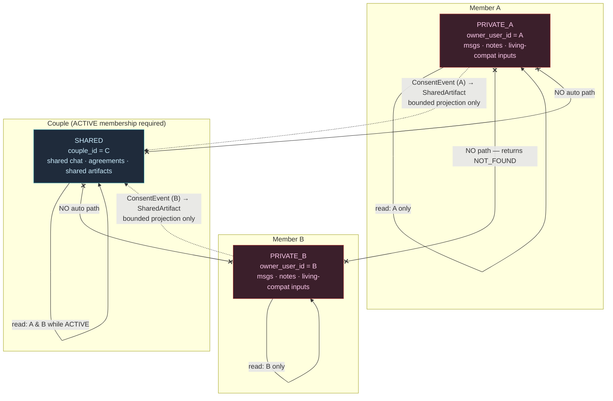
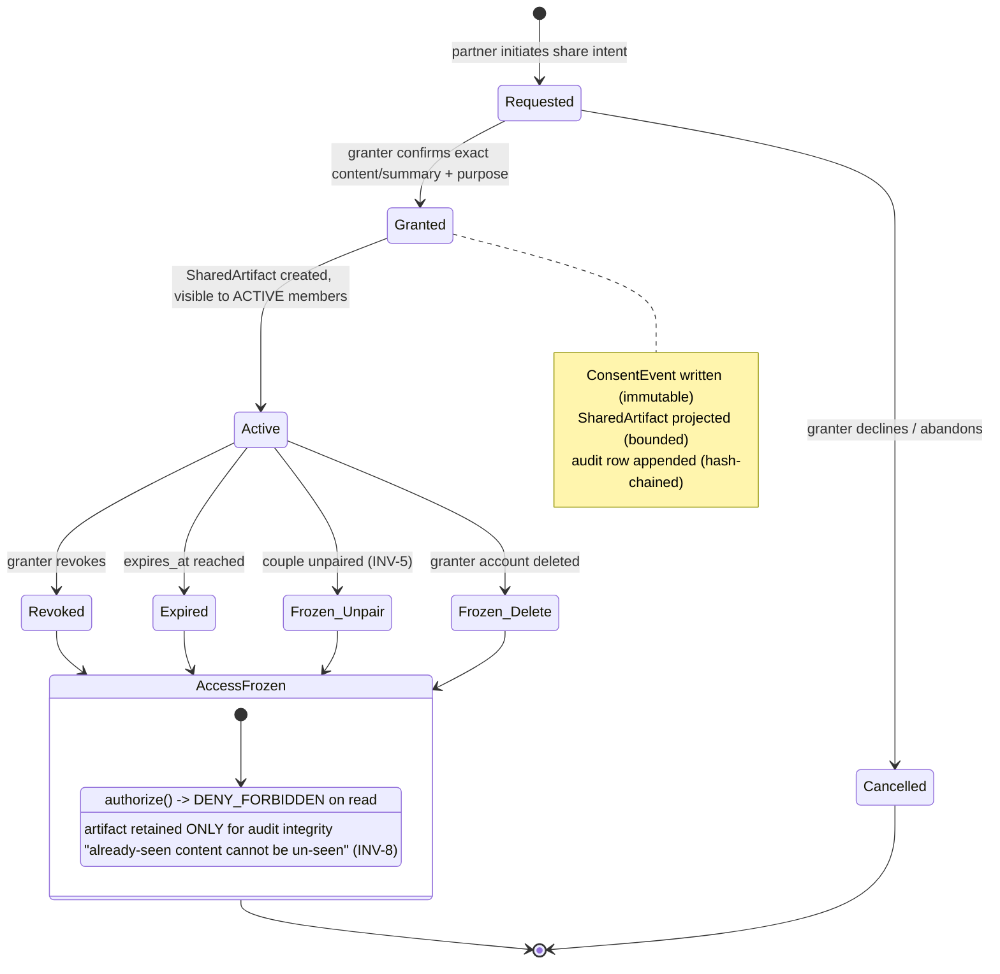

# DilChat — Privacy, Consent & Security Architecture

**Product:** DilChat (consumer) · **Company:** Ugence Labs · **Site:** dilchat.com
**Status of this document:** Design phase. No production code has been written.
**Document type:** Security & privacy architecture (design-only). This is the
canonical elaboration of DEC-011, DEC-012, DEC-013, DEC-014, and DEC-021 from
`DILCHAT_DECISION_LOG.md`. Where this document and the decision log disagree, the
decision log wins on identifiers and technology choices; this document is
authoritative on the privacy, consent, threat, and cryptographic *model*.

> **Read this first.** DilChat handles two categories of extraordinarily
> sensitive data at once: **intimate relationship content** (private messages,
> private notes, feelings about a partner, agreements, conflict) and **birth
> data** (exact birth coordinates and birth time, from which a great deal can be
> inferred). The people most likely to attack a DilChat account are not
> strangers on the internet — they are the *other person in the couple*. Every
> control in this document is designed with that reality in front of it.

---

## Table of contents

1. [Scope, principles, and non-negotiable invariants](#1-scope-principles-and-non-negotiable-invariants)
2. [Threat model](#2-threat-model)
3. [The three-scope privacy model](#3-the-three-scope-privacy-model)
4. [Consent state machine and projection rule](#4-consent-state-machine-and-projection-rule)
5. [Abuse cases (AC-#)](#5-abuse-cases-ac-)
6. [Shared-device and notification privacy](#6-shared-device-and-notification-privacy)
7. [Encryption and key management](#7-encryption-and-key-management)
8. [Audit logging](#8-audit-logging)
9. [Account compromise and recovery](#9-account-compromise-and-recovery)
10. [Data export and deletion (DPDP / GDPR-aligned)](#10-data-export-and-deletion-dpdp--gdpr-aligned)
11. [Coercion and safety](#11-coercion-and-safety)
12. [Security controls checklist (invariant → control → test)](#12-security-controls-checklist-invariant--control--test)

---

## 1. Scope, principles, and non-negotiable invariants

### 1.1 What this document covers

The privacy authorization model, the consent lifecycle, the AI context-minimization
contract, the cryptographic design, audit tamper-evidence, account compromise and
recovery, export/deletion, and — as a first-class concern — **intimate-partner-abuse
resistance**. It does *not* re-specify the astrology engine, the API surface, or the
data model beyond the security-relevant fields; those live in
`DILCHAT_ASTROLOGY_ENGINE_SPEC.md`, `DILCHAT_API_SPEC.md`, and
`DILCHAT_BACKEND_ARCHITECTURE.md` respectively.

### 1.2 Design principles

- **P1 — Default deny.** Absence of an explicit grant is a denial, everywhere, at
  every layer. No code path treats "unknown" as "allow."
- **P2 — Least authority.** Every actor (user, AI, worker, admin) sees the minimum
  data required. The AI is the tightest-budgeted actor of all.
- **P3 — Existence non-disclosure.** For cross-private access, the *existence* of
  data is itself a secret. We return `NOT_FOUND`, never `FORBIDDEN`, because
  `FORBIDDEN` confirms something is there.
- **P4 — One-way consent bridge.** Data moves from a private scope to shared *only*
  through an explicit, recorded, revocable ConsentEvent that names exactly what
  crossed. Never by an ordinary DB copy.
- **P5 — Honest revocation.** We revoke *future* access on demand and say so
  plainly; we never pretend we can un-show something a human already read.
- **P6 — Provenance always.** Every output — chart, score, AI message, shared
  artifact — carries where it came from and under what authority.
- **P7 — Tamper-evidence over tamper-proofing.** We cannot make logs physically
  unalterable, but we make silent alteration detectable (hash chaining).
- **P8 — Abuse-resistance is a feature, not a mode.** The product must not become a
  tool one partner uses to surveil, coerce, or control the other. When a feature's
  convenience trades against a victim's safety, safety wins.
- **P9 — Astrology is guidance, never a verdict.** No astrological output may be
  positioned as evidence for a real-world adverse decision about a person.

### 1.3 The invariants (canonical, hard requirements)

These are numbered `INV-#` and cross-referenced throughout. §12 maps each to its
enforcing control and its proving test.

| ID | Invariant |
|----|-----------|
| **INV-1** | Three isolated scopes `PRIVATE_A`, `PRIVATE_B`, `SHARED`. A can never access B's private data and vice versa. |
| **INV-2** | Shared data is accessible only to **ACTIVE** members of the couple. |
| **INV-3** | Access is **denied by default**; every request resolves an explicit scope decision. |
| **INV-4** | Couple membership is **re-checked on every shared-data request**. |
| **INV-5** | **Unpairing revokes authorization immediately** (shared access and pending consents). |
| **INV-6** | Private data enters shared context **only** via an explicit `ConsentEvent` naming exact content or a bounded summary. |
| **INV-7** | **No private→shared ordinary DB copy.** Only a projected `SharedArtifact` crosses. |
| **INV-8** | Revocation semantics are defined: future access is cut; already-seen content is acknowledged as unrecoverable. |
| **INV-9** | A partner **cannot query whether the other used private chat**. Cross-private access returns `NOT_FOUND`. |
| **INV-10** | AI receives **only the minimum authorized context**; cannot infer/disclose unshared private info. |
| **INV-11** | AI **never auto-sends** private content to the shared room and **never impersonates** a partner. |
| **INV-12** | Important shared agreements require **DUAL approval**. |
| **INV-13** | Every sensitive action is **auditable** in an **append-only, hash-chained** log. |
| **INV-14** | All outputs **preserve provenance**. |
| **INV-15** | Sensitive **notification previews are disabled by default**. |
| **INV-16** | Astrology may **not** be used as evidence for medical/psychiatric/employment/credit/insurance/legal decisions. |
| **INV-17** | **Nadi** is never medical/fertility; **Yoni** applies only to consensual adult romantic context. |
| **INV-18** | **Encryption in transit** (TLS 1.2+, internal mTLS) and **at rest** (disk + app-level envelope encryption for birth coordinates, birth time, private message content, private notes). |
| **INV-19** | Self-managed auth: **Argon2id**, **ES256 short JWT** + **rotating opaque refresh sessions** revocable immediately. |

---

## 2. Threat model

### 2.1 Assets (what we protect, ranked by sensitivity)

| Asset | Scope | Why it is dangerous if leaked |
|-------|-------|-------------------------------|
| A-1 · Private message content | `PRIVATE_A` / `PRIVATE_B` | Intimate thoughts about the partner/relationship; disclosure can trigger conflict, coercion, or violence. |
| A-2 · Private notes / journal | `PRIVATE_A` / `PRIVATE_B` | Same as A-1; often more candid. |
| A-3 · **Existence** of private-chat use | metadata | Merely knowing the partner "used private chat" is itself harmful (see INV-9). |
| A-4 · Exact birth coordinates | per-user | Precise home/hospital of birth → geolocation, identity, family. |
| A-5 · Exact birth time | per-user | Sensitive PII; combined with A-4 uniquely identifying. |
| A-6 · Shared messages & agreements | `SHARED` | Relationship record; still sensitive, but consensually shared between the two. |
| A-7 · Living Compatibility inputs | private | Behavioral ratings; must never become a control/surveillance score. |
| A-8 · Auth credentials & sessions | system | Account takeover unlocks A-1..A-7. |
| A-9 · Audit log | system | Reveals *who did what when*; also the integrity anchor. |
| A-10 · Encryption keys (KEKs/DEKs) | system | Master compromise = mass decryption. |
| A-11 · Consent records | `consent` module | The authorization ground-truth for every share. |

### 2.2 Trust boundaries

```
   [TB-0] Untrusted network / public internet
        │  TLS 1.2+
   [TB-1] Edge (WAF, rate limit, TLS termination)
        │  mTLS
   [TB-2] Application (FastAPI modular monolith) ── ScopeContext guard + RLS
        │  mTLS / socket
   [TB-3] Datastores (PostgreSQL 16, Redis 7)  ── disk encryption + app envelope encryption
        │  mTLS + signed request
   [TB-4] KMS / secrets manager (master keys)   ── separate blast radius
        │  zero-retention API contract
   [TB-5] External AI provider (Anthropic Claude / OpenAI)  ── minimum context only
        │
   [TB-6] Client device (iOS/Android, RN)  ── biometric gate, no sensitive push payloads
```

- **TB-1 → TB-2** is where authentication happens. Everything below assumes an
  authenticated principal but re-derives authorization (never trusts the edge for
  scope).
- **TB-2** is the authorization heart: the `ScopeContext` guard and Postgres RLS
  (DEC-012). A bug here is the highest-severity class of defect in the system.
- **TB-4 (KMS)** is deliberately a *separate* blast radius from TB-3: stealing the
  database does not yield plaintext because DEKs are wrapped by a KEK the database
  never holds.
- **TB-5 (AI provider)** is treated as **semi-trusted at best** — a compromised or
  misconfigured provider must not be able to reconstruct unshared private data,
  because we never send it (INV-10).

### 2.3 Adversaries

| ID | Adversary | Capability | Primary goal |
|----|-----------|-----------|--------------|
| ADV-1 | **Curious partner** | Authenticated couple member; own device | Read the other's private scope; learn *whether* they used it |
| ADV-2 | **Abusive / coercive partner** | Same + physical/psychological control over victim | Surveil, coerce disclosure, monitor, control |
| ADV-3 | **Ex-partner (post-unpair)** | Formerly authenticated; unpaired | Retain access to shared/private data after breakup |
| ADV-4 | **Shared-device co-viewer** | Physical access to an unlocked/left-open device | Read notifications, private sections over the shoulder |
| ADV-5 | **Network attacker** | On-path / MITM on TB-0 | Intercept content, hijack sessions |
| ADV-6 | **Malicious insider** | DB/infra/admin access | Bulk-read private content, alter audit, exfiltrate keys |
| ADV-7 | **Compromised AI provider** | Sees whatever we send to TB-5 | Reconstruct or leak private info; inject content |
| ADV-8 | **Stolen-device thief** | Physical device, locked or unlocked | Extract cached content, tokens |
| ADV-9 | **Law-enforcement / coercion of the operator** | Legal process or duress against Ugence | Compel disclosure of private content |
| ADV-10 | **Account-takeover attacker** | Phished/reset credentials | Read private chat, impersonate |

> **Intimate-partner abuse (ADV-2) is a first-class adversary, not an edge case.**
> Unlike most products, DilChat's most probable serious attacker is a *legitimately
> authenticated user* attacking *another legitimately authenticated user* they
> physically co-locate with. This reframes several "normal" product features
> (notifications, presence, read receipts, "helpful" AI summaries, location) as
> potential abuse vectors. The controls in §5, §6, and §11 exist specifically for
> ADV-2/ADV-4.

### 2.4 STRIDE-style analysis per trust boundary

Legend: **S**poofing, **T**ampering, **R**epudiation, **I**nformation disclosure,
**D**enial of service, **E**levation of privilege.

#### TB-0/TB-1 — Network & edge

| STRIDE | Threat | Adversary | Control |
|--------|--------|-----------|---------|
| S | Session/token replay | ADV-5, ADV-10 | Short ES256 JWT (10 min, DEC-011); refresh rotation; token binding to session row |
| T | Payload tampering in transit | ADV-5 | TLS 1.2+ (prefer 1.3), HSTS, cert pinning on mobile client |
| I | Traffic interception | ADV-5 | TLS everywhere; no sensitive data in URLs/query strings; no sensitive push payloads (§6) |
| D | Volumetric / credential-stuffing | ADV-5, ADV-10 | WAF, per-IP + per-account rate limits (Redis, DEC-005), exponential backoff, Argon2id cost |
| E | Edge trusted for authz | any | Edge authenticates only; TB-2 re-derives authorization independently |

#### TB-2 — Application (authorization core)

| STRIDE | Threat | Adversary | Control |
|--------|--------|-----------|---------|
| S | Forged `ScopeContext` / user_id | ADV-1, ADV-6 | ScopeContext derived only from verified JWT subject + server-side session; never from client-supplied body/header |
| T | Business-logic bypass of scope guard | ADV-1, ADV-6 | Mandatory repository helpers refuse unscoped queries; import-linter forbids raw cross-module SQL (DEC-002) |
| R | User denies performing a share/approval | any | Append-only hash-chained audit (§8) with actor, action, resource |
| I | **Cross-private read** | **ADV-1, ADV-2** | `authorize()` default-deny; cross-private returns `NOT_FOUND` (INV-9); RLS backstop (DEC-012) |
| I | Existence oracle via timing/error differences | ADV-1 | Uniform `NOT_FOUND` shape + constant-ish response for present-vs-absent private resources |
| D | Expensive AI/astro calls as DoS | ADV-10 | Rate limits + job quotas; deterministic services cached |
| E | Privilege escalation to admin/scope | ADV-6 | Admin actions are separate audited role; no admin path reads plaintext private content (§8.4) |

#### TB-3 — Datastores

| STRIDE | Threat | Adversary | Control |
|--------|--------|-----------|---------|
| T | Silent row edit / audit rewrite | ADV-6 | Audit hash-chain (§8); WORM-style append-only writes; periodic external anchor |
| I | Bulk DB theft / snapshot exfil | ADV-6, ADV-8 | Disk encryption + app-level envelope encryption; DB never holds KEK (§7) |
| I | Backup exposure | ADV-6 | Backups carry ciphertext only; crypto-shred applies to backups via key destruction |
| E | RLS bypass via superuser role | ADV-6 | App connects as non-superuser; RLS `FORCE`; break-glass superuser access is itself audited |

#### TB-4 — KMS / secrets

| STRIDE | Threat | Adversary | Control |
|--------|--------|-----------|---------|
| S | Rogue service assumes KMS identity | ADV-6 | Scoped IAM per service; short-lived credentials; KMS grant conditions |
| I | KEK exfiltration | ADV-6 | Master key non-exportable, HSM-backed; app only calls `Decrypt(dek_wrapped)` |
| E | Over-broad decrypt grants | ADV-6 | Per-purpose grants; decrypt volume alarms; deny bulk `Decrypt` outside batch jobs |

#### TB-5 — AI provider

| STRIDE | Threat | Adversary | Control |
|--------|--------|-----------|---------|
| I | Provider retains/leaks content | ADV-7 | Zero-retention/no-train contract (DEC-014); send only authorized, minimized context (INV-10) |
| T | Prompt injection → data exfil or impersonation | ADV-1, ADV-7 | Structured governed inputs only (DEC-014); output schema validation; AI cannot address the *other* scope; no tool that reads private scope |
| S | AI output presented as a partner's words | ADV-7 | AI outputs labeled as AI, provenance-stamped (INV-11, INV-14); no partner-impersonation path |
| I | Inference of unshared data from what we send | ADV-7 | Context budget excludes any private-scope content not covered by a ConsentEvent |

#### TB-6 — Client device

| STRIDE | Threat | Adversary | Control |
|--------|--------|-----------|---------|
| I | Shoulder-surf / left-open app | ADV-4, ADV-2 | Notification previews off by default (§6); biometric/local re-auth for private sections |
| I | Notification content leak on lock screen | ADV-4 | Generic push text; sensitive payload fetched only after in-app auth |
| S | Cached token reuse on stolen device | ADV-8 | Biometric-gated token store; server-side session revocation; short JWT lifetime |
| T | Local tamper / jailbreak | ADV-8 | Treat client as untrusted; server re-authorizes; no security decision trusted to client |

---

## 3. The three-scope privacy model

### 3.1 Scopes and how they map to rows

Every scope-bearing row carries an **owning scope** plus owner identifiers
(DEC-012):

| Column | Meaning |
|--------|---------|
| `scope` | `PRIVATE_A` \| `PRIVATE_B` \| `SHARED` (enum, NOT NULL) |
| `owner_user_id` | Set for `PRIVATE_*` rows; the sole reader of that private scope |
| `couple_id` | Set for `SHARED` rows (and on `PRIVATE_*` for membership resolution) |

- `PRIVATE_A` rows: `owner_user_id = <member A>`, readable only by A.
- `PRIVATE_B` rows: `owner_user_id = <member B>`, readable only by B.
- `SHARED` rows: `couple_id = <couple>`, readable by **active** members A **and** B.

> The labels A/B are *positional within a couple*, not global. `authorize()`
> resolves whether the actor is the owner of the private scope they are touching;
> it never grants "A" any standing against a different couple's "A".

### 3.2 The `ScopeContext`

A `ScopeContext` is constructed once per request, at TB-2, from trusted inputs
only, and threaded into every repository call. Repositories refuse to run a
scope-bearing query without one (default deny at the data layer).

```
ScopeContext:
  actor_user_id      : UUID        # from verified ES256 JWT subject only
  session_id         : UUID        # server-side Session row (revocable)
  couple_id          : UUID | None # resolved server-side, never client-supplied
  membership_status  : ACTIVE | PENDING | REVOKED | NONE   # re-read per request
  resolved_scope     : PRIVATE_SELF | SHARED | NONE
  device_id          : UUID        # for de-authorization / anomaly detection
  request_id         : UUID        # correlates to audit
```

Key rules:

- `actor_user_id` comes **only** from the verified token subject. A `user_id` in a
  request body or header is ignored for authorization (anti-spoofing, TB-2/S).
- `couple_id` and `membership_status` are **re-resolved on every request** from the
  `couples` module (INV-4). A cached membership is never trusted across requests.
- `resolved_scope` = `PRIVATE_SELF` means "the actor's own private scope"; there is
  no `PRIVATE_OTHER` value the system can even represent — the *other* partner's
  private scope is not addressable (INV-1, INV-9).

### 3.3 The decision function `authorize(actor, action, resource)`

Pure function, no side effects, default-deny, evaluated at TB-2 before any data
access; Postgres RLS (DEC-012) re-enforces the same predicate as a backstop.

```
authorize(ctx: ScopeContext, action: Action, resource: ResourceRef) -> Decision

Decision ∈ { ALLOW, DENY_NOT_FOUND, DENY_FORBIDDEN }

# Ordered rules; first match wins. No fallthrough to ALLOW.

R0  if ctx.actor_user_id is None or session invalid:      return DENY_FORBIDDEN   # unauthenticated
R1  if resource.scope in {PRIVATE_A, PRIVATE_B}:
        if resource.owner_user_id == ctx.actor_user_id:   return ALLOW            # own private scope
        else:                                             return DENY_NOT_FOUND   # INV-9: existence hidden
R2  if resource.scope == SHARED:
        if resource.couple_id != ctx.couple_id:           return DENY_NOT_FOUND   # not this couple
        if ctx.membership_status != ACTIVE:               return DENY_FORBIDDEN   # INV-2, INV-5 (unpaired/pending)
        if action requires DUAL_APPROVAL and not dual_ok: return DENY_FORBIDDEN   # INV-12
        return ALLOW
R3  default:                                              return DENY_FORBIDDEN   # INV-3 default deny
```

Why the two denial shapes matter:

- **`DENY_NOT_FOUND`** is returned whenever revealing that the resource *exists*
  would itself leak information — i.e. any attempt to reach *another user's private
  scope* (R1) or a *different couple's shared data* (R2 first clause). The API
  surfaces this as a plain 404 with a uniform body, identical to a genuinely
  absent resource. This is what enforces INV-9: A asking "does B have private
  notes?" gets the same answer whether B has thousands of notes or none.
- **`DENY_FORBIDDEN`** (403) is returned only when the *existence* is already known
  and non-sensitive but the action is not permitted — e.g. a **former** member
  (post-unpair) touching *their own couple's* shared data (they already know the
  couple existed), or a missing dual approval.

> **Timing/oracle hardening.** R1's `DENY_NOT_FOUND` path must be
> indistinguishable from a true miss not only in status code and body but in
> observable latency. Private-resource lookups run through a code path that does
> the same key-derivation/DB-touch work whether or not a row exists, so an
> attacker cannot use response time as an existence oracle. (Test:
> `test_cross_private_timing_uniform` in `DILCHAT_TEST_AND_VALIDATION_PLAN.md`.)

### 3.4 Scope model diagram



The dotted arrows are the **only** ways content crosses scopes, and they are
one-way (private→shared), consent-gated, and projected (never raw). There is no
edge from `PRIVATE_A` to `PRIVATE_B` in either direction — the attempt does not
return "denied," it returns "not found" (INV-9). There is no automatic edge from
`SHARED` back into any private scope, and no automatic edge from a private scope
into `SHARED` without a ConsentEvent (INV-6, INV-7, INV-11).

### 3.5 AI context minimization (the AI as a scoped actor)

The AI (`ai_guidance`, DEC-014) is not a superuser; it is the *most* restricted
actor. Its effective `ScopeContext` for any task is a strict subset of what the
requesting user could see, further reduced to only what the specific task needs.

- **Private-scope assistance** (e.g. helping A draft a private note): the AI sees
  only `PRIVATE_A` content for that task, and its output returns to `PRIVATE_A`. It
  has no handle to `PRIVATE_B` and no tool that could acquire one.
- **Shared-scope assistance** (e.g. summarizing a shared agreement): the AI sees
  only `SHARED` content for that couple plus deterministic astrology inputs. It
  never receives private-scope content from *either* partner unless a ConsentEvent
  has already projected it into a `SharedArtifact`.
- **No inference bridge (INV-10).** The context assembler physically excludes any
  private-scope rows not covered by an active ConsentEvent. The AI cannot infer
  "the other partner said X in private" because that string never entered its
  context window.
- **No auto-send, no impersonation (INV-11).** The AI has no capability to write to
  the shared room on its own, and no capability to post *as* a partner. Any
  AI-suggested shared text is a **draft returned to the requesting user**, who must
  themselves take the send action (which is audited under their identity).
- All AI outputs are schema-validated and stamped with `prompt_pack_version` and an
  `ai_generated: true` provenance flag (INV-14, DEC-014).

---

## 4. Consent state machine and projection rule

### 4.1 What a `ConsentEvent` records

A `ConsentEvent` is the immutable authorization record for a single private→shared
projection (DEC-013, INV-6). Once written it is never mutated; revocation is a new
linked event, not an edit.

| Field | Description |
|-------|-------------|
| `consent_id` | UUID, primary key |
| `granter_user_id` | The partner authorizing the share (owner of the private scope) |
| `couple_id` | Target couple context |
| `artifact_type` | Enumerated: `bounded_summary` \| `agreed_statement` \| `explicit_message_excerpt` \| `feeling_tag_rollup` (extensible, closed set) |
| `content_ref` | **Either** an exact reference (`private_message_id` / `note_id`) **or** a `bounded_summary_hash` of the exact projected text — never a pointer to "the whole conversation" |
| `projected_payload_ref` | FK to the resulting `SharedArtifact` (the bounded text that actually crossed) |
| `purpose` | Free-but-enumerated reason (`resolve_conflict`, `propose_agreement`, `share_feeling`, …) shown to both partners |
| `scope_from` | `PRIVATE_A` or `PRIVATE_B` |
| `scope_to` | `SHARED` (the only legal target) |
| `granted_at` | Timestamp (UTC) |
| `expires_at` | Optional expiry; null = until revoked/unpair |
| `revoked_at` | Null until revoked |
| `revocation_reason` | `granter_revoked` \| `expired` \| `unpair` \| `account_deleted` |
| `audit_ref` | FK into the append-only audit chain (§8) |

The `content_ref` requirement is what enforces INV-6's "identifies the exact
content or bounded summary." A ConsentEvent that cannot name *exactly* what it
authorizes is rejected at creation.

### 4.2 The `SharedArtifact`

A `SharedArtifact` is the bounded projection that actually lives in `SHARED` scope.
It is created *on grant* and is the only private-origin content a partner can ever
see. It stores the projected text (or rollup), never a live handle back into the
private stream. Its lifecycle is bound to its ConsentEvent: on revoke/expire/unpair
it becomes **access-frozen** — the row persists for audit integrity but
`authorize()` returns `DENY_FORBIDDEN` for read attempts (INV-8: future access is
cut).

### 4.3 Consent state machine



### 4.4 Revocation semantics (stated honestly, INV-8)

- **What revocation does:** immediately flips the `SharedArtifact` to
  access-frozen; every subsequent read by the partner returns `DENY_FORBIDDEN`; the
  artifact disappears from the shared timeline; a revocation event is appended to
  the audit chain and surfaced in both partners' user-visible audit.
- **What revocation cannot do:** it cannot un-read text the partner already saw,
  and cannot delete a screenshot or memory. **The UI states this plainly at grant
  time** ("Once shared, your partner may have already read or saved this; revoking
  hides it going forward but cannot un-share what was seen."). We do not imply
  false control (P5). This honest framing is itself an anti-coercion control (§11):
  a victim is never misled into believing a share is reversible.
- **Unpairing and deletion** are *automatic* revocation triggers for all of the
  granter's active ConsentEvents (INV-5), not just user-initiated ones.

### 4.5 The projection rule (INV-7)

> Only a **bounded, enumerated summary or explicitly named excerpt** crosses from
> private to shared — **never the raw private stream**.

Concretely:

1. A share operation must resolve to one of the closed `artifact_type` values in
   §4.1. There is no `artifact_type = full_conversation`.
2. The projected payload is **materialized once** into the `SharedArtifact` and
   decoupled from the private source. Editing or appending to the private
   conversation afterward does **not** change what was shared — no live view, no
   trailing pointer.
3. Free-text summaries pass through a **length + content bound**: capped length,
   and (for AI-assisted summaries) the AI may only condense text the granter
   themselves selected — it may not pull in adjacent private context (INV-10).
4. The granter previews the exact bytes that will cross and confirms; the
   `content_ref`/`bounded_summary_hash` is computed over *those* bytes so the audit
   trail proves what was authorized equals what was shown.
5. There is no ordinary DB copy path (INV-7): the `shared_chat` module cannot
   `INSERT ... SELECT FROM private_chat`. Cross-module raw SQL is blocked by the
   import-linter contract (DEC-002); the only supported route is
   `consent.project(consent_event) -> SharedArtifact`.

---

## 5. Abuse cases (AC-#)

Each abuse case names the **risk**, the **adversary**, and the **concrete
control(s)**. These are the scenarios security review and the test plan
(`DILCHAT_TEST_AND_VALIDATION_PLAN.md`) must exercise directly.

### AC-1 — Coerced sharing
**Risk:** ADV-2 pressures the victim to share private content into the shared room
"to prove they have nothing to hide."
**Controls:** (a) Sharing is always the victim's own explicit action — there is no
API by which one partner can *pull* the other's private content. (b) The grant UI
states revocation limits honestly (§4.4) so the victim is not deceived about
reversibility. (c) Bounded projection (INV-7) means even under coercion only a
named excerpt crosses, never the whole private history. (d) No feature exposes
"you haven't shared anything," which would create pressure; absence is silent
(INV-9). (e) Safety resources surfaced in-app (§11).

### AC-2 — Partner tries to detect the other's private-chat use
**Risk:** ADV-1/ADV-2 probes the API/UI to learn *whether* the partner has private
messages, notes, or activity.
**Controls:** Cross-private access returns `DENY_NOT_FOUND` uniformly (R1, INV-9);
no endpoint returns a count, timestamp, "last active in private," typing indicator,
or unread badge scoped to the partner's private data. Timing is uniform (§3.3). No
presence signal distinguishes "in private chat" from "online." Test:
`test_no_private_existence_oracle`.

### AC-3 — Screenshot / coercion on a shared device
**Risk:** ADV-4/ADV-2 with physical access screenshots private sections or forces
the victim to open them.
**Controls:** Private sections require **local biometric/PIN re-auth** on entry
(§6), so a merely-unlocked phone does not expose them; a short private-section
auto-lock timeout; notification previews off (§6); "quick exit" / decoy
considerations (§6.4) for at-risk users. We cannot prevent a screenshot of content
the user is actively viewing — this is documented as a residual risk, mitigated by
minimizing what is on screen and by fast re-lock.

### AC-4 — Using the app to monitor / control a partner
**Risk:** ADV-2 wants DilChat to function as spyware: location, read receipts,
activity timelines, "compatibility score dropping" pressure.
**Controls:** **No surveillance features by design (P8, §11).** No partner
location sharing; no per-message read receipts on private content; no "last seen in
private"; Living Compatibility is a **jointly-visible aggregate only** (DEC-019
OQ-9) with each partner's inputs staying private — it is explicitly framed as *not*
a control/surveillance score (§11). Any presence signal is coarse and mutual, never
one-directional monitoring.

### AC-5 — Weaponizing astrology ("the stars say you're wrong")
**Risk:** ADV-2 uses astrological outputs to justify control, blame, or an adverse
decision about the victim ("Nadi says you're incompatible / defective,"
"compatibility is low so you must obey").
**Controls:** INV-16/INV-17 enforced in the interpretation + AI layers (DEC-021):
astrology carries a standing non-evidentiary disclaimer and may not be framed as a
verdict about a person; Nadi is never medicalized/fertility-framed; Yoni only in
consensual adult romantic context; the AI is guardrailed to never pressure a user
to stay in an unsafe relationship, never infer infidelity/consent/diagnosis, and to
present scores as guidance with agency language, not commands (P9). Classical scores
are immutable and separated from behavioral scores (DEC-019) so they cannot be spun
into a moving "you're failing" metric.

### AC-6 — Post-breakup data access
**Risk:** ADV-3 (ex-partner) retains access to shared content, agreements, or the
victim's projected artifacts after the relationship ends.
**Controls:** Unpairing flips membership to `REVOKED` and `authorize()` denies all
shared reads **immediately** (INV-5, R2); all of the ex's active sessions covering
shared scope are re-evaluated on the next request (they never re-gain ACTIVE); all
active ConsentEvents auto-revoke and their SharedArtifacts freeze (§4.4). The ex
retains only their *own* private scope and their *own* copy of data they authored —
never the other's private scope (never had it) and never continued shared access.
Test: `test_unpair_revokes_shared_immediately`.

### AC-7 — Account takeover to read private chat
**Risk:** ADV-10 phishes/resets credentials to read the victim's private scope.
**Controls:** Argon2id + short ES256 JWT + revocable rotating refresh sessions
(INV-19); step-up auth and biometric client gate for private sections; **password
reset does not immediately unlock private scope** — a recovery lock / re-encryption
window applies (§9.4) so a fresh password alone cannot exfiltrate private content;
new-device sign-in triggers alerts and optional cool-down; session anomaly
detection (§9.3). Even a full takeover cannot reach the *partner's* private scope
(INV-1) — the blast radius is bounded to one private scope, and even that is delayed
by the recovery lock.

### AC-8 — Insider or legal-process compulsion
**Risk:** ADV-6/ADV-9 seeks bulk private content from the operator.
**Controls:** App-level envelope encryption means the DB and its backups hold
ciphertext; no admin console decrypts private message content or plaintext birth
coordinates (§8.4); crypto-shredded data is unrecoverable even under compulsion;
key access is separately audited with volume alarms; support staff have no path to
reveal a user's private scope (§9.5). Lawful requests are handled per published
policy against *what we can technically produce*, which for frozen/shredded data is
nothing.

---

## 6. Shared-device and notification privacy

DilChat assumes the phone may be shared, watched, or seized by ADV-2/ADV-4. The
notification and lock design follows from that.

### 6.1 Previews hidden by default (INV-15)

- Default push text is generic: **"DilChat: You have a new update."** No sender
  name, no message excerpt, no "private message from…", no astrology content, no
  agreement text — regardless of channel (APNs/FCM), including on the lock screen.
- The **sensitive payload is not in the push** at all (§6.3); the client fetches it
  only after in-app authentication.

### 6.2 Per-notification-type opt-in

- Richer previews are **opt-in per notification type** (e.g. a user may enable a
  named preview for "daily climate" while keeping "new shared message" and anything
  private generic). Private-scope notifications can **never** be upgraded to show
  content on the lock screen — the toggle for those controls at most whether a
  generic badge appears.
- Defaults are the safe values; enabling a richer preview is an explicit, reversible
  choice with an in-context warning about shared-device risk.

### 6.3 No sensitive content in push payloads

- Push payloads carry only an opaque `notification_id` + type + generic title. The
  client authenticates, then calls the API to retrieve the actual content, which is
  authorized through `authorize()` like any other read.
- This means an attacker who intercepts or inspects the push transport (ADV-5) or
  reads the notification tray (ADV-4) learns nothing beyond "something happened."

### 6.4 Client-side re-auth and at-risk-user affordances

- **Biometric / local PIN re-auth for private sections** (client gate, DEC-011):
  entering private chat or private notes requires a fresh biometric/PIN even if the
  app is open; a short inactivity timeout re-locks private sections automatically.
  The backend never sees biometrics.
- **Quick exit / decoy considerations** (at-risk users): a fast "panic" gesture that
  immediately leaves any private section and returns to a neutral screen (e.g. the
  daily climate), clearing private view state, so a victim can exit if watched.
  Decoy/duress affordances (e.g. a benign default landing view, no lingering private
  content in app-switcher snapshots — obscure the app preview when backgrounded) are
  designed in as safety features, not gimmicks (§11).
- **No sensitive content in the app-switcher snapshot** and no private content
  cached to disk unencrypted on the device.

---

## 7. Encryption and key management

Satisfies INV-18. Two independent layers: **disk encryption** (broad, coarse) and
**application-level envelope encryption** (narrow, field-level, key-separated from
the database).

### 7.1 Envelope encryption design

```
[TB-4] KMS / HSM
   Master Key (KEK)  — non-exportable, HSM-backed
        │  wraps
   Per-user Data Encryption Key (DEK)  — one per user (and a separate couple DEK
        │  for SHARED-only material where useful)
        │  stored ONLY in wrapped form in Postgres (dek_wrapped BLOB)
        │  encrypts
   Column ciphertext (AES-256-GCM, per-field nonce, AAD = {table,column,row_id})
```

- The database **never** holds a plaintext DEK or the KEK. To read a protected
  field, the app fetches `dek_wrapped`, calls KMS `Decrypt` to unwrap it in memory,
  decrypts the column, and drops the plaintext DEK from memory promptly. Stealing a
  DB snapshot (ADV-6/ADV-8) yields only ciphertext + wrapped DEKs (TB-3/I).
- **AAD binding** ties each ciphertext to its `{table, column, row_id}` so a
  ciphertext cannot be copied from one row/column to another (thwarts cut-and-paste
  tampering, TB-3/T).
- Per-user DEKs are the unit of **crypto-shredding**: destroying a user's DEK makes
  every field encrypted under it permanently unrecoverable, including in backups.

### 7.2 Field-level (app-encrypted) list

App-level envelope encryption is **mandatory** for (INV-18):

| Field | Table (module) | Notes |
|-------|----------------|-------|
| Exact birth coordinates (lat/lon) | `birth_profiles` | Highest-sensitivity PII (A-4); coarse location for daily UX stored separately (DEC-017 OQ-6) |
| Exact birth time | `birth_profiles` | A-5 |
| Private message content | `private_chat` | A-1; encrypted under the owner's per-user DEK |
| Private notes / journal | `private_chat` / notes | A-2 |
| SharedArtifact projected payload | `shared_chat` | Encrypted under the couple DEK; still consent-gated at read |
| Living Compatibility private inputs | `feedback` | A-7; stays private (OQ-9) |
| Refresh-token material, TOTP seeds | `identity` | Stored hashed/encrypted, never plaintext |

Derived astrology *results* (rashi, nakshatra, Guna Milan scores) are **not**
raw birth data and are protected by disk encryption + scope authorization, not
necessarily field-encrypted — but the **inputs** above always are.

### 7.3 App-encrypted vs disk-encrypted

- **Disk-encrypted (all data):** full-disk/volume encryption on Postgres and Redis
  storage and on backups — protects against physical media theft (ADV-8) and raw
  disk exfil. This is table stakes, not sufficient alone (a compromised DB
  connection sees plaintext through the running engine).
- **App-encrypted (the §7.2 list):** ciphertext even to a live DB connection or a
  malicious DBA (ADV-6). This is what makes insider/legal-compulsion resistance
  (AC-8) real.

### 7.4 Key rotation

- **KEK rotation:** KMS-managed; rewrapping DEKs is a metadata operation (unwrap
  with old KEK version, rewrap with new) — no column re-encryption needed. Scheduled
  and on-suspected-compromise.
- **DEK rotation:** per-user DEK can be rotated by decrypting-and-re-encrypting that
  user's protected columns in a background job (arq, DEC-006); used after suspected
  key exposure or as periodic hygiene.
- **TLS certificate rotation:** automated, short-lived internal certs (mTLS);
  external certs via ACME with monitored expiry.

### 7.5 Crypto-shredding on deletion

- Account deletion's terminal step destroys the user's per-user DEK (and, where the
  user is the last member, the couple DEK), rendering all their app-encrypted fields
  permanently unreadable — including in backups that predate garbage collection
  (§10.3). This is the primary deletion mechanism; row deletion is secondary.

### 7.6 Secrets management & TLS config

- **Secrets** (KMS grants, DB creds, provider API keys) live in a managed secrets
  manager, injected at runtime, never in images or repo; short-lived scoped IAM per
  service (TB-4/S). No long-lived static keys in env files in production.
- **TLS in transit (INV-18):** external TLS 1.2 minimum, TLS 1.3 preferred; HSTS;
  modern AEAD cipher suites only; mobile clients pin the server cert/public key.
  **Internal service-to-service and DB/Redis connections use mTLS** so a foothold in
  one service cannot trivially impersonate another (TB-2→TB-3).

---

## 8. Audit logging

Satisfies INV-13 and INV-14. The audit log is both the **repudiation defense** and
an **integrity anchor**; it must be append-only and tamper-evident.

### 8.1 `AuditEvent` structure (append-only, hash-chained)

```
AuditEvent:
  seq              : BIGINT        # monotonic per chain
  event_id         : UUID
  ts               : TIMESTAMPTZ   # server time, UTC
  actor_user_id    : UUID | 'system' | 'admin:<id>'
  action           : enum          # see §8.2
  resource_ref     : {module, type, id, scope}   # NO plaintext content
  couple_id        : UUID | null
  request_id       : UUID          # correlates to ScopeContext
  outcome          : ALLOW | DENY_NOT_FOUND | DENY_FORBIDDEN | OK | ERROR
  metadata         : jsonb         # minimized, non-sensitive (e.g. artifact_type, purpose)
  prev_hash        : bytes         # SHA-256 of previous row's row_hash
  row_hash         : bytes         # SHA-256(prev_hash || canonical(this row minus row_hash))
```

- **Hash chaining:** each row commits to the previous row's hash. Altering or
  deleting any historical row breaks the chain from that point forward, which a
  periodic verifier detects (P7, tamper-evidence, TB-3/T).
- **Append-only enforcement:** the audit table grants only `INSERT` to the app role
  (no `UPDATE`/`DELETE`); writes go through a single append port. Break-glass DBA
  access to the table is itself logged and alarmed.
- **External anchoring:** the head `row_hash` is periodically published to a
  write-once external store (or notarized), so even an insider who rewrites the
  whole table *and* recomputes hashes cannot match a previously-anchored digest.

### 8.2 Actions that are audited

Auth (login success/failure, refresh rotation, logout, session revocation,
step-up), pairing (invite, accept, dual-approval steps), **consent grant**,
**consent revoke/expire**, **unpair**, **share/projection** (SharedArtifact
create), **agreement dual-approval**, data **export** request/completion,
**deletion** request/grace/finalize, **admin/break-glass access**, KMS
decrypt-for-batch events, and every **authorization DENY** on a sensitive resource
(so probing attempts like AC-2 are visible).

### 8.3 What is NEVER logged

- **Private message content** and **private note text** — never, in any field,
  including `metadata` and error traces.
- **Plaintext birth coordinates** or **birth time** — never; audit references the
  `birth_profiles` row id and scope, not the values.
- Passwords, tokens, DEK/KEK material, biometric data.
- Notification content. Redaction is enforced by a structured logging layer that
  only accepts a whitelisted, non-sensitive `metadata` shape — free-form strings
  cannot smuggle content in.

### 8.4 Admin access & the no-plaintext rule

- Admin/support roles operate through tooling that shows **references and status,
  not private plaintext**. There is no admin action that decrypts private message
  content or birth coordinates for viewing. Any legitimate low-level access
  (e.g. an engineer with DB creds during an incident) is (a) app-encryption-blind
  (sees ciphertext, §7.3) and (b) audited/alarmed on KMS `Decrypt` volume.

### 8.5 User-visible audit subset

Users can see their own security-relevant history: their logins and devices, when
they granted/revoked a consent and to which artifact, when the couple was
paired/unpaired, agreement approvals, exports, and deletion status. They **cannot**
see anything scoped to the partner's private data (INV-9) — a consent the partner
granted is visible to both (it produced a shared artifact), but the partner's
private-scope internal events are not.

### 8.6 Retention

Audit is retained for a bounded, policy-defined period aligned to DPDP/GDPR
minimization (long enough for security/forensics and legal obligation, no longer).
On account deletion, the **minimized legally-required** audit subset survives
(§10.3) — it references ids and actions, never the crypto-shredded content.

---

## 9. Account compromise and recovery

Goal: a stolen credential or reset password must **not** hand an attacker the
victim's private scope, and support must **not** be a back door (AC-7, AC-8).

### 9.1 Session model (recap of INV-19)

Argon2id password hashing; **short-lived ES256 JWT (10 min)**; **opaque rotating
refresh tokens** stored server-side as hashed `Session` rows. Any session is
revocable immediately — the refresh token is checked against the live `Session` row
on every rotation, so revocation takes effect within one access-token lifetime at
most, instantly for refresh.

### 9.2 Revocation, forced re-auth, device de-authorization

- **Global revoke** ("sign out everywhere") invalidates all `Session` rows;
  outstanding JWTs expire within ≤10 min and cannot be refreshed.
- **Per-device de-authorization** from the user's device list; the removed device's
  refresh token is dead immediately.
- **Forced re-auth / step-up** is required for high-risk actions (change password,
  change recovery email/phone, export, delete, enter private section on a new
  device).

### 9.3 Detecting takeover

- New-device / new-geo sign-in generates an alert notification (generic preview,
  §6) and an audit event; optional cool-down before private-scope access is allowed
  from the new device.
- Anomaly signals: impossible travel, burst of failed logins then success,
  refresh-token reuse (a rotated-then-reused token indicates theft → auto-revoke the
  session family and alert).

### 9.4 Recovery that does not expose private data

The critical design point (AC-7): **resetting a password must not be equivalent to
reading private chat.**

- A password reset re-establishes *authentication* but triggers a **private-scope
  recovery lock**: private message/notes access is held for a cool-down window and
  requires an **additional** recovery factor (e.g. a previously-registered second
  factor or a longer waiting period), so a pure email-reset attacker cannot
  immediately exfiltrate private content.
- Where feasible, private-scope DEK access is bound to a factor the attacker does
  not obtain by resetting the password alone (e.g. re-derivation gated on the
  second factor / recovery period), so a fresh password does not by itself unwrap
  private-scope keys.
- Both partners' notification of a reset (generic) and the audit trail make a silent
  takeover harder to sustain.

### 9.5 Partner-coercion & support considerations

- **Support cannot reveal a user's private scope.** There is no support workflow
  that decrypts or displays private message content, private notes, or birth
  coordinates (§8.4). A partner who social-engineers support (ADV-2) cannot obtain
  the other's private data because support literally has no such capability.
- Account-recovery via support is identity-proofing for *authentication only* and is
  subject to the same private-scope recovery lock (§9.4); it never short-circuits
  into private content.
- This is deliberate: the abusive partner's most plausible non-technical attack is
  "call support and impersonate / pressure," and the architecture denies it a path.

---

## 10. Data export and deletion (DPDP / GDPR-aligned)

India-first under the DPDP Act (DEC-018 OQ-13), designed to extend to GDPR/CCPA.

### 10.1 What a user can export

- **Own data:** profile, own birth data, own private messages/notes, own settings,
  own audit subset (§8.5).
- **Shared data they are party to:** shared chat, agreements, and SharedArtifacts
  for couples where they are/were a member — the shared record they co-own.
- **Never the partner's private scope.** Export runs through `authorize()` exactly
  like any read; `PRIVATE_A`/`PRIVATE_B` rows the requester does not own are
  invisible to the export job (INV-1, R1). There is no "export everything about the
  couple" that reaches into the other's private data.

### 10.2 Export job security

- Export is an async job (arq) that assembles data **within the requester's
  authorization**, encrypts the bundle, and delivers via a **short-lived,
  single-use, authenticated download** (no public link). The bundle is deleted
  after the download window.
- Generating an export is a step-up-authed action and is audited (§8.2). Birth
  coordinates in an export are included only for the requester's own profile and are
  clearly marked sensitive.

### 10.3 Deletion flow

```
Active
  → deletion_pending      (user requests deletion; step-up auth; audited)
  → grace period          (configurable window; reversible; sessions restricted)
  → crypto-shred          (destroy per-user DEK → all app-encrypted fields unreadable)
  → row cleanup           (secondary; purge PII rows, cascade per FK policy)
  → minimized audit only  (append-only legally-required subset survives §8.6)
```

- **Crypto-shredding is primary** (§7.5): the moment the DEK is destroyed, the
  user's private content and birth coordinates are unrecoverable everywhere,
  including backups predating GC — satisfying "right to erasure" against ciphertext
  that outlives the row.
- **What survives:** only the **minimized, legally-required audit** (ids, actions,
  timestamps, outcomes — never crypto-shredded content), retained per §8.6.
- **Backups:** because backups hold only ciphertext wrapped by the destroyed DEK,
  they contain no readable residue after shred; backup lifecycle GC removes the
  ciphertext on its normal schedule.

### 10.4 Unpairing vs deletion (distinct operations)

| | **Unpair** | **Delete account** |
|--|-----------|--------------------|
| Membership | → `REVOKED`; shared access denied immediately (INV-5) | account ceases to exist after shred |
| Private scope | **retained** by each user (their own) | crypto-shredded |
| Shared data | frozen from the ex; each retains their exportable copy of shared record | subject to shred/cleanup |
| ConsentEvents | all active ones auto-revoke; artifacts freeze | auto-revoke + shred |
| Reversible? | re-pairing is a fresh pairing, not a restore of access | only during grace period |

Unpairing is a *relationship* action (breakup); deletion is a *data* action. They
must not be conflated — a user may unpair without deleting, and deleting one partner
must not delete the other.

---

## 11. Coercion and safety

DilChat is built so that it **cannot comfortably be used as a tool of control**
(P8). This section states the deliberate *non-features* and escape hatches.

### 11.1 Design choices that reduce harm

- **No surveillance surface (AC-4):** no partner location, no one-directional read
  receipts on private content, no "last seen in private," no activity feed that lets
  one partner monitor the other's app use. Any presence is coarse and mutual.
- **Existence non-disclosure (INV-9):** the abuser cannot even confirm the victim
  uses private chat, removing a common coercion trigger ("why do you have secrets").
- **Honest revocation framing (§4.4):** the victim is never deceived into believing
  a coerced share is fully reversible; conversely, they are never falsely blamed for
  "hiding" — absence is invisible.
- **Living Compatibility is not a surveillance score (DEC-019 OQ-9):** it is a
  jointly-visible aggregate with each partner's private inputs kept private; it is
  framed in-product as a shared reflection, **never** as a compliance/behavior score
  one partner can hold over the other, and it never feeds back into the immutable
  classical score. The UI language avoids "you're failing / your score dropped"
  framings (AC-5, P9).
- **Astrology as guidance, not verdict (INV-16/INV-17, DEC-021):** disclaimers,
  non-medical Nadi, consensual-only Yoni, and AI guardrails that refuse to pressure a
  user to stay in an unsafe relationship or to infer infidelity/consent/diagnosis.
- **AI never impersonates or auto-shares (INV-11):** the AI cannot be turned into a
  proxy that speaks *as* the victim or leaks their private scope into the shared room.

### 11.2 Escape hatches for at-risk users

- **Quick exit / decoy** and **background-snapshot obfuscation** (§6.4) so a watched
  user can leave private sections instantly.
- **Fast global sign-out and device de-authorization** (§9.2) so a user who fears
  their device is compromised can cut access immediately.
- **In-app safety resources** surfaced non-judgmentally where coercion patterns are
  plausible (e.g. at share/consent and unpair points), with links to support
  resources, and phrased so they do not themselves become a notification that
  endangers the user.
- **Support cannot be weaponized (§9.5):** an abusive partner cannot obtain the
  victim's private data through support impersonation.

### 11.3 Residual risks (stated honestly)

We cannot prevent a person who physically controls another's unlocked device and
compels them in real time from seeing on-screen content, nor un-see what was shared
under coercion (§4.4). We minimize the surface (fast re-lock, minimal on-screen
content, no previews, decoy exit) and we never *add* features that make such control
easier. This honesty is itself a safety commitment.

---

## 12. Security controls checklist (invariant → control → test)

Each invariant maps to the concrete control that enforces it and the test that
proves it. Test IDs reference `DILCHAT_TEST_AND_VALIDATION_PLAN.md` (consent-leakage
& authorization suites, §"Authorization" and §"Consent leakage"); where that plan
does not yet enumerate a case, the name below is the required addition.

| Invariant | Enforcing control | Proving test |
|-----------|-------------------|--------------|
| **INV-1** scope isolation A↔B | `authorize()` R1 default-deny; per-user DEK separation; RLS backstop (DEC-012) | `test_cross_private_read_denied`, `test_rls_blocks_cross_private` |
| **INV-2** shared = ACTIVE only | `authorize()` R2 membership check | `test_shared_requires_active_membership` |
| **INV-3** default deny | `authorize()` R3 fallthrough = DENY; repo helpers refuse unscoped queries | `test_unscoped_query_refused`, `test_default_deny_unknown_action` |
| **INV-4** membership re-checked per request | ScopeContext re-resolves `membership_status` every request | `test_membership_rechecked_each_request` |
| **INV-5** unpair revokes immediately | Unpair → `REVOKED`; next request denies shared; consents auto-revoke | `test_unpair_revokes_shared_immediately`, `test_unpair_auto_revokes_consents` |
| **INV-6** private→shared needs ConsentEvent | `consent.project()` is the only path; ConsentEvent names exact content_ref | `test_share_requires_consent_event`, `test_consent_records_exact_ref` |
| **INV-7** no ordinary DB copy | Import-linter blocks cross-module SQL (DEC-002); only bounded projection | `test_no_private_to_shared_copy`, `test_projection_is_bounded` |
| **INV-8** revocation semantics | SharedArtifact freeze on revoke; honest UI copy | `test_revoke_freezes_future_access`, `test_revoked_artifact_denied` |
| **INV-9** existence non-disclosure | R1 returns `DENY_NOT_FOUND`; uniform timing; no partner-private metadata endpoints | `test_no_private_existence_oracle`, `test_cross_private_timing_uniform` |
| **INV-10** AI minimum context / no inference | Context assembler excludes unconsented private rows | `test_ai_context_excludes_unshared_private`, `test_ai_cannot_infer_partner_private` |
| **INV-11** AI no auto-send / no impersonation | AI returns drafts to requester only; no shared-write tool; `ai_generated` provenance | `test_ai_never_autosends_to_shared`, `test_ai_never_impersonates_partner` |
| **INV-12** dual approval for agreements | `authorize()` R2 DUAL_APPROVAL gate; two-party approval state | `test_important_agreement_requires_dual_approval` |
| **INV-13** append-only hash-chained audit | INSERT-only audit table; `prev_hash`/`row_hash` chain; external anchor | `test_audit_append_only`, `test_audit_hash_chain_detects_tamper` |
| **INV-14** provenance on outputs | Provenance tuple (DEC-001) + `ai_generated`/`prompt_pack_version` stamps | `test_outputs_carry_provenance` |
| **INV-15** previews off by default | Generic push text; sensitive payload not in push; per-type opt-in | `test_default_notification_preview_generic`, `test_no_sensitive_push_payload` |
| **INV-16** astrology non-evidentiary | Standing disclaimer; AI guardrail refuses adverse-decision framing (DEC-021) | `test_astrology_disclaimer_present`, `test_ai_refuses_adverse_decision_use` |
| **INV-17** Nadi/Yoni constraints | Interpretation-layer rules: Nadi non-medical, Yoni consensual-adult-only (DEC-021) | `test_nadi_never_medical`, `test_yoni_consensual_context_only` |
| **INV-18** encryption in transit & at rest | TLS 1.2+/mTLS; disk + envelope field encryption of §7.2 list | `test_tls_min_version`, `test_birth_coords_encrypted_at_rest`, `test_private_content_encrypted_at_rest` |
| **INV-19** self-managed auth | Argon2id; ES256 10-min JWT; rotating opaque refresh, immediate revoke | `test_argon2id_params`, `test_jwt_short_lived_es256`, `test_refresh_rotation_and_revocation` |

### 12.1 Cross-references

- Authorization model & RLS: **DEC-012**; consent-gated projection: **DEC-013**.
- Auth/session: **DEC-011**; AI context port & retention: **DEC-014**.
- Safety constraints (Nadi/Yoni/medical/AI guardrails): **DEC-021**.
- Score-family separation (Living Compatibility ≠ surveillance): **DEC-019**, OQ-9.
- Data residency / DPDP posture: **DEC-018**, OQ-13.
- Test suites this document depends on: `DILCHAT_TEST_AND_VALIDATION_PLAN.md`
  → *Authorization*, *Consent leakage*, *Notification privacy*, *Crypto-at-rest*,
  *Audit tamper-evidence*. Any test named in §12 that is not yet present there is a
  required addition tracked as a gap.

---

## Appendix A — Glossary

| Term | Meaning |
|------|---------|
| **Scope** | One of `PRIVATE_A`, `PRIVATE_B`, `SHARED`; the isolation unit for authorization. |
| **ScopeContext** | Per-request authorization context derived from the verified token; threaded into every query. |
| **ConsentEvent** | Immutable record authorizing one bounded private→shared projection. |
| **SharedArtifact** | The bounded projected content that actually lives in `SHARED`; access-frozen on revoke/unpair. |
| **Projection** | The bounded, enumerated summary/excerpt that crosses scopes; never the raw private stream. |
| **Crypto-shred** | Deletion by destroying the encryption key, rendering ciphertext permanently unreadable. |
| **Envelope encryption** | KEK-wraps-DEK-wraps-column scheme keeping keys out of the database. |
| **Existence non-disclosure** | Returning `NOT_FOUND` (not `FORBIDDEN`) so the existence of private data is not revealed. |
| **Dual approval** | Both partners must approve an important shared agreement before it is binding. |

## Appendix B — Denial-shape decision quick reference

| Situation | Returned | Rationale |
|-----------|----------|-----------|
| Actor reads **own** private scope | `ALLOW` | Owner access |
| Actor reaches **other partner's** private scope | `DENY_NOT_FOUND` | INV-9 existence hidden |
| Actor reaches **another couple's** shared data | `DENY_NOT_FOUND` | Not this couple; existence hidden |
| **Former** member reaches **own couple's** shared data | `DENY_FORBIDDEN` | Existence already known; access revoked (INV-5) |
| Missing dual approval on agreement | `DENY_FORBIDDEN` | Action not permitted, existence not secret |
| Unauthenticated | `DENY_FORBIDDEN` | No principal |
| Unknown/unspecified action | `DENY_FORBIDDEN` | Default deny (INV-3) |

---

*End of document. Design-only; no production code implied. Authoritative on the
privacy, consent, threat, and cryptographic model per the DilChat Decision Log.*
